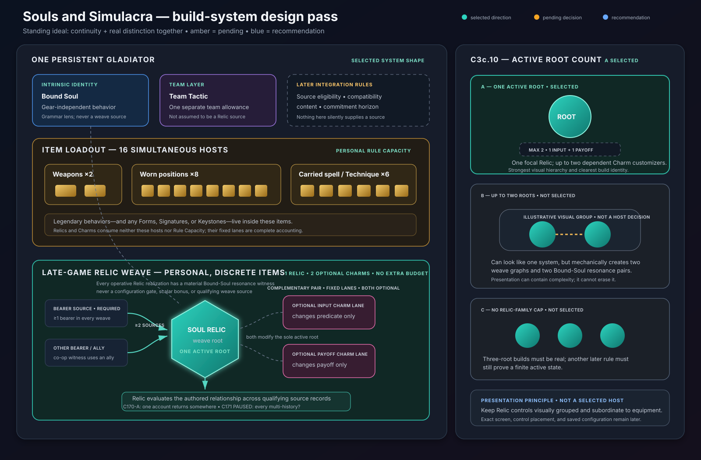

# Endless progression owner decision packet

> **Design-track quarantine:** this packet may not shape vanilla capture,
> candidates, fixtures, or promoted evidence. It concerns designed mechanics
> behind a separate seam.

**Status:** owner pre-read and guided-session worksheet. EP-D01, EP-D02, and
EP-D07 are closed through explicitly accepted dispositions; EP-D03–EP-D06 and
EP-A01–EP-A03 remain pending. This packet is not the authoritative
[decision record](endless-progression-decisions.md), a balance specification,
or implementation authorization.

The [master closure index](endless-progression-master-closure-index.md) now
governs admission and finite closure for the remaining pass. It preserves all
selected worksheet directions, classifies C171 as authoring/evaluation rather
than an owner choice, and freezes the next Relic work into registered slots.
Do not resume the former prevalence/graph frontier from this packet alone.

The 2026-09-11 [decision-rigor audit](endless-progression-decision-rigor-audit.md)
found EP-D01 fully evidenced under the later presentation standard, durable
pre-replay provenance gaps for accepted EP-D02/EP-D07, and one EP-D04 direction
that requires atomic repair: R9.4. Current accepted rules remain authoritative
unless explicitly replaced; R10 is paused after corrected R10.2 while the owner
completes the selected full-assurance confirmation path. EP-D02-C3c.88-A now
forces every actual fixed-width exact-union rotation to retain at least one
noncore motif. EP-D02-C3c.89-B gives exactly one forced-breadth structural
class support for changing the complete singleton-map family while its exact
noncore union stays fixed. EP-D02-C3c.90-B identifies that sole class as union-
locked, leaving every fixed-width-capable definition support-negative. The
owner's EP-D02-C3c.91-B answer makes that support universal within the union-
locked class. EP-D02-C3c.92-B requires exactly one of the breathing and union-
locked eligible classes to author a same-definition, same-`U`, unequal-family
exact-key pair. EP-D02-C3c.93-B identifies union-locked affinities as that sole
actual participant, EP-D02-C3c.94-B makes actual family variation universal
inside that class, EP-D02-C3c.95-C makes every locked definition's exact-key-
to-family projection injective, and EP-D02-C3c.96-A makes every supported Soul
vary somewhere inside every locked definition. EP-D02-C3c.97-C now gives every
locked name at least one common exact-key pair on which all supported Souls
change assigned noncore map, and EP-D02-C3c.98-C makes every completed exact
key participate in at least one such whole-roster contrast. EP-D02-C3c.99-C
now gives every locked definition structural support for an all-Soul-changing
pair whose unequal families still share and reassign an exact noncore map
member. EP-D02-C3c.100-C now requires every locked definition to actually
author at least one such pair. EP-D02-C3c.101-C now gives every completed exact
key in every locked definition at least one overlap-bearing common partner.
EP-D02-C3c.102-C now makes every locked definition structurally capable of two
member-disjoint complete noncore map families at its stable exact union.
EP-D02-C3c.103-C now makes every locked definition actually author at least one
member-disjoint common edge while retaining C101's overlap-bearing coverage.
EP-D02-C3c.104-C now gives every completed exact key structural support for a
member-disjoint partner without requiring that partner to be authored.
EP-D02-C3c.105-C now actually gives every completed locked exact key both an
overlap-bearing common partner and a distinct member-disjoint common partner.
EP-D02-C3c.106-C now gives every locked definition at least one persistent Soul
Relic instance ID carried by two family-distinct completed snapshots. EP-D02-
C3c.107-C now gives every completed locked exact key a family-distinct partner
carrying the same persistent instance ID. EP-D02-C3c.108-C now gives every
locked definition at least one same-instance family contrast that holds exactly
one of input-affecting state or grammar-evaluation boundary fixed. EP-D02-
C3c.109-C now gives every represented persistent instance ID in every locked
definition at least one such one-coordinate pair. EP-D02-C3c.110-C now gives
every locked definition at least one represented persistent instance whose
every completed key has a same-instance one-coordinate partner. EP-D02-
C3c.111-C now extends that coverage across every represented instance and thus
every completed key. EP-D02-C3c.112-C now keeps both state-only and boundary-
only one-coordinate comparison types in the completed locked catalog. EP-D02-
C3c.113-A now separates those types by locked definition: every locked name is
state-supporting only or boundary-supporting only, and both name classes are
nonempty. EP-D02-C3c.114-C now puts at least one same-instance all-Soul-
changing common edge in every locked definition, and EP-D02-C3c.115-C extends
that incidence to every represented persistent-instance fiber. EP-D02-
C3c.116-C now gives every locked definition at least one represented
persistent-instance fiber whose every completed key has an internal all-Soul-
changing partner. EP-D02-C3c.117-C now extends that coverage to every
represented persistent-instance fiber and therefore every completed key. EP-
D02-C3c.118-C now gives every locked definition at least one exact edge that
is both its sole one-coordinate comparison type and an all-Soul-changing
common relation. EP-D02-C3c.119-C now extends that exact alignment to every
represented persistent-instance fiber. EP-D02-C3c.120-C now gives every locked
definition at least one represented fiber whose every completed key
participates in an aligned edge. EP-D02-C3c.121-C now extends that aligned-edge
coverage to every represented fiber and therefore every completed locked key.
EP-D02-C3c.122-C now keeps both overlap-bearing motif migration and member-
disjoint complete-family reweaving among actual aligned edges. EP-D02-
C3c.123-C now fills all four comparison-type by aligned-family cells, so both
family identities occur under both state-only and boundary-only comparison.
EP-D02-C3c.124-A now keeps every locked definition aligned-family-pure, so the
four `S-O`, `S-R`, `B-O`, and `B-R` named archetype classes are all nonempty.
EP-D02-C3c.125-C now gives every locked name at least one aligned foil pair that
the same owned persistent artifact can materially realize within one canonical
nonforked legal history. EP-D02-C3c.126-C now extends that lived-edge incidence
to every represented persistent instance. EP-D02-C3c.127-C now gives every
locked definition at least one represented artifact whose complete key set is
lived-aligned-edge-covered. EP-D02-C3c.128-C now extends that lived-key
completeness to every represented artifact and therefore every completed
locked form. EP-D02-C3c.129-C now gives every locked name at least one
represented artifact whose complete form set occurs within one qualifying
history, and EP-D02-C3c.130-C extends that one-history completeness to every
represented artifact. EP-D02-C3c.131-A now makes every input-affecting Relic-
owned state lineage-carried across ordinary encounter cuts, and EP-D02-
C3c.132-A carries that same assignment across clean Circuit cuts when no
separate state operation occurs. EP-D02-C3c.133-A now seals successful input-
result commitment against any new participant decision after provisional
completion, and EP-D02-C3c.134-A seals every completed tagged candidate against
automatic semantic revocation before commitment. EP-D02-C3c.135-A limits every
context/receipt tag to one commit per continuous-sufficiency interval, so a
later same-tag result requires genuine relationship insufficiency followed by
renewed sufficiency. EP-D02-C3c.136-A now gives every tag some same-encounter
break–renew–recommit witness. EP-D02-C3c.137-A now forbids decision-unexposed
blink rearm for every tag. EP-D02-C3c.138-A now requires every legal recommit
path to expose a material rearm opportunity while its fixed context is live
and the relationship is insufficient. EP-D02-C3c.139-A now requires every
legal path to expose relationship or recurrence leverage while that context
remains live in both isolated alternatives. EP-D02-C3c.140-A now requires an
alternative actually selected on every recommit path to participate in that
leverage. EP-D02-C3c.141-A now requires every legal recommit path to contain at
least one actual chosen-arm comparison whose decisive input is isolated to
relationship facts or recurrence authorization. EP-D02-C3c.142-C now requires
the completed catalog to contain at least one valid independent witness of each
form. EP-D02-C3c.143-C now requires dual-support and specialist fixed context/
receipt tags to coexist. EP-D02-C3c.144-A now requires every dual tag to have
at least one actual recommit path exercising both independent forms. EP-D02-
C3c.145-A now makes every legal path of every dual tag both-form. EP-D02-
C3c.146-C now requires both predicate-only and recurrence-only specialist
classes beside the dual class. C3c.147-A gives every candidate tag at least one
continuous-context recommit history, C3c.148-A makes every legal recommit
history continuous throughout the post-`c1` through pre-`q2` semantic slice,
and C3c.149-A gives every dual tag at least one same-opportunity independent-
form witness. C3c.150-A now puts at least one such joint opportunity on every
legal history of every dual tag, C3c.151-A gives every dual tag at least one
history with a joint opportunity whose predicate and recurrence isolation
pairs first become decisive at the same actual-anchored canonical cut, and
C3c.152-A now puts at least one such same-cut joint opportunity on every legal
history of every dual tag, C3c.153-A now gives every live joint opportunity at
least one predicate/recurrence pair combination sharing an exact decisive cut,
C3c.154-A makes the two complete decisive-cut sets equal at every such
opportunity, and C3c.155-A now makes that common set a singleton at every joint
opportunity. C3c.156-A now requires catalog-level authorized pre-choice support
for both independent forms, and C3c.157-A now gives every mechanically dual tag
at least one authorized pre-choice form account. C3c.158-A now gives every
mechanically dual tag authorized accounts of both forms, possibly on different
histories. C3c.159-A now gives every dual tag at least one exact legal history
carrying both authorized form accounts, and C3c.160-A now gives every exact
legal history of every dual tag at least one authorized form account. C3c.161-A
now gives every such history both authorized form accounts, possibly at
different opportunities. C3c.162-A now gives every dual tag at least one
atomic choice where both forms are co-legible, and C3c.163-A now gives every
exact legal history of every dual tag at least one such choice. C3c.164-A now
gives every mechanically joint opportunity at least one qualifying pre-choice
form account, and C3c.165-A now makes both distinct forms co-legible at every
mechanically joint opportunity. C3c.166-A now gives every dual tag at least one
joint opportunity with a canonical integrated semantic account that both maps
the distinct P/R comparisons and relates them as two faces of the same
continuing choice. C3c.167-A now gives every exact legal history of every dual
tag at least one such integrated opportunity, and C3c.168-A extends that
integration to every mechanically joint opportunity. C3c.169-A now gives every
dual tag at least one exact legal history with two distinct, commitment-
separated joint opportunities. C3c.170-A now gives every dual tag at least one
same-history opportunity pair sharing the same canonical integrated-account
identity. The last drafted choice was EP-D02-C3c.171, which compared whether
every multi-opportunity history must contain some such reuse pair. The master
closure index reclassifies that prevalence question as authoring/evaluation,
not an active owner choice, because its own boundary changes no player action,
authoritative transition, power/release result, or local mechanic. Singleton
histories remain outside its preserved denominator. Fixed-width-capable
definitions remain ineligible. A 2026-09-24 prerequisite audit then proved
that the old RCS-03 and RCS-04 rows compressed seven independently variable
transformation boundaries. The amended register contains RCS-03A–RCS-03E and
RCS-04A–RCS-04B. The owner selected RCS-03A-C, complete two-dialect
transformation. A second prerequisite audit then found that the old RCS-03B
still bundled evaluation-lifetime topology, a conditional pending-evaluation
initiation, bind cut, in-flight context-change disposition, participant
cancellation, automatic expiry/horizon, and concurrency. The twice-amended
register replaces that parent alias with RCS-03B1–RCS-03B7. The owner selected
RCS-03B1-A: every evaluation is cut-atomic, so RCS-03B2–RCS-03B7 are pruned. A
third prerequisite audit then found that RCS-03C still combined eligible-cut
cadence, actual invocation authority, and contingent evidence acquisition even
though C133/C141/C155 expressly left those axes open. The thrice-amended
register splits that parent into RCS-03C1–RCS-03C3. The owner selected
RCS-03C1-A: every readiness episode is evaluation-eligible at its opening cut.
A fourth prerequisite audit then found that RCS-03C2 still combined invocation-
control source with the timing of participant authorization. The amended
register splits that parent into RCS-03C2A–RCS-03C2B. The owner selected
RCS-03C2A-A: every eligible opportunity automatically invokes exactly one cut-
atomic evaluation, so conditional RCS-03C2B is pruned. A prerequisite screen
then derived one coherent current-cut `H`/`S` acquisition rule. The owner
selected RCS-03C3A-A: every materially H-reading position is freshness-bounded.
A fifth prerequisite amendment routed same-cut evidence fan-out and later
source-use/reuse semantics to RCS-03C3B–RCS-03C3F and expanded RCS-08's cross-
root/team scope rather than leaving them implicit. A sixth prerequisite audit
then found that canonical atom identity still compressed additional coupled
H+S evidence admission, within-H phase attribution, catalog phase support,
action-root identity, build-provenance identity, root/child atom addressability,
and conditional child-application partitioning. RCS-03C3B is therefore a non-
counting parent for the registered identity rows. The owner selected
RCS-03C3B0-A: no position admits an additional fully inseparable H+S path. A
seventh prerequisite audit then found that the old RCS-03C3B1A row still
compressed residual opposite-form material participation, minimum phase
attribution, and additional irreducible multi-phase-H supplements. It is now a
non-counting parent for RCS-03C3B1A0–RCS-03C3B1A2. The owner selected
RCS-03C3B1A0-A, making every position temporally projection-pure. An eighth
audit then split old RCS-03C3B1A1 into minimum phase attribution and
per-position independent phase multiplicity. The owner selected
RCS-03C3B1A1A-A, requiring one independently meaningful phase anchor at every
history position. A ninth audit then split the remaining multiplicity row into
plural-position prevalence and conditional tri-phase prevalence.
The owner selected RCS-03C3B1A1B1-C: phase-singular and phase-plural history
positions coexist, then selected RCS-03C3B1A1B2-A: every phase-plural
position is exact-two. A tenth audit split old RCS-03C3B1A2 into prevalence
and conditional package-width support. The owner selected RCS-03C3B1A2A-C:
coupled-supplement and clean history positions coexist, then selected
RCS-03C3B1A2B-C: width-two and width-three packages coexist. That width-three
witness derives exact material phase support `{D,E,O}` at RCS-03C3B1B. An
eleventh audit makes old RCS-03C3B2A a non-counting parent for within-operation
root partition, cross-operation finite-episode merging, additive compound-H
relation-root promotion, current-state root succession, and current-state
multi-root support. The owner selected RCS-03C3B2A1-A: every accepted
operation occurrence has one primitive lineage across its realized
applications. RCS-03C3B2A2A is the active owner choice under SR-03.

> **Standalone north star — owner direction, 2026-09-15:** the intended new
> game name is **Souls and Simulacra**. Complete the current design-framework
> pass against the already-designed SS2-derived skeleton, using that identity
> as a thematic-coherence lens rather than as an automatic answer to later
> mechanics. After the full pass, begin a separate expansion, audit, and
> adaptation of the engine for the standalone game. This note neither renames
> vanilla evidence nor authorizes implementation.

> **Standing design ideal — owner direction, 2026-09-15:** for **Souls and
> Simulacra**, always use *Achintya Bheda Abheda* (*acintya-bhedābheda*) as the
> enduring ideal. When a mechanic represents a relationship among Soul,
> simulacrum, Relic, Charm, combatant, source, or result, prefer designs in
> which meaningful continuity or participation and real, mechanically legible
> distinction coexist at the same operative boundary. Separate states, keys,
> definitions, or catalog entries that respectively supply “unity” and
> “difference,” mere co-presence, labels, or cosmetic variation do not by
> themselves satisfy the ideal. This is an inspirational game-design analogy,
> not a claim of theological equivalence or a silent formal invariant. It does
> not auto-select mechanics, supply unstated rules, reopen selected directions,
> bypass prerequisites, or replace one-at-a-time owner choices. Every future
> recommendation must name the operative relationship and boundary, assess its
> fit as direct, partial, neutral, or merely aggregate, and state the gameplay
> tradeoff. If the strongest gameplay recommendation tensions the ideal, expose
> that tension rather than hiding it or changing the mechanic silently. Never
> present an incompatible option as though it satisfies the ideal; if no offered
> direction can remain consistent, add or recommend an explicit replacement
> rather than weakening the north star.

### Audit-remediation scope — A selected

The remediation-scope choice did not reopen an accepted rule: the recorded
EP-D02/EP-D07 wording remains authoritative unless the owner chooses a change
and later explicitly accepts its complete replacement.

| Choice | Scope | Recommendation and tradeoff | Boundary to test |
| --- | --- | --- | --- |
| **A — full uniform assurance** | Confirm every atomic EP-D02 choice one at a time, then the nine EP-D07 choices, repair R9.4 atomically, and resume R10.3. The earlier seventeen-to-twenty-three D02 estimate no longer bounds the route: the owner's dedicated Charm/Soul Relic design direction raises the total integration-only D02 map to at least twenty-one choices before its full purpose, acquisition, content, and release subtrees are mapped. | **Recommended.** This is the only path that supports the claim that every surviving major progression choice received the requested A/B/C treatment. The exact turn count now depends on C3c.1's topology and the size of the requested full-system design; short confirmations remain possible. | Team Tactic budget and connected-member dropout authority both receive their own alternatives even if the owner ultimately keeps their accepted wording. A buried disagreement changes only through a later exact replacement replay. |
| **B — dependency-prioritized assurance** | Confirm EP-D02, whose item/Capacity rules directly shape EP-D04; retain EP-D07's complete accepted replay despite its provenance gap; then repair R9.4 and resume R10.3. | Stronger than a targeted repair and shorter than A, but it cannot establish uniform historical rigor for human-seat/dropout policy. | A hidden disagreement over Capacity is caught before more rarity design depends on it, while an unexamined preference for majority rather than unanimous dropout voting would remain accepted by reliance on the old replay. |
| **C — targeted repair only** | Keep both accepted replays without granular confirmation, repair only R9.4, and resume R10.3. | Fastest, and the accepted texts are complete, but the durable record must permanently say their pre-replay atomic treatment is unproven. | A future reader can verify what D02/D07 say and that they were explicitly accepted, but cannot verify that each independent alternative was considered one at a time. |

An owner-written replacement scope remains available. After this answer, present
only the first choice on the selected path.

**Scope answer — selected by Zanzagar on 2026-09-11:** **A, full uniform
assurance.** Confirm every atomic EP-D02 choice one at a time, then the nine
EP-D07 choices, repair R9.4 atomically, and only then resume R10.3. The later C3
split corrects the estimate, not the selected assurance standard. This is a
review-route selection, not a product-rule amendment or final disposition.

### EP-D02-C1 — Capacity ownership — A confirmed

This confirmation asked only about the ownership model; it did not decide later
grant recipients, qualifying victories, cadence, or lower-route projection.

| Choice | Ownership rule | Recommendation and tradeoff | Boundary example |
| --- | --- | --- | --- |
| **A — personal Capacity (current accepted rule)** | Capacity belongs solely to each persistent `combatantId`. It cannot be pooled, loaned, transferred, copied, averaged, or projected from another gladiator. | **Recommended.** It preserves gladiator-specific progression and prevents an established character or teammate from lending unearned build power. The cost is real alt and mixed-progression-team friction; later assistance or catch-up rules must solve that without sharing Capacity. | Before any lower-route clamp, a veteran at 32 and a novice at 8 remain capped at 32 and 8 respectively when teamed. A newly created gladiator does not inherit the veteran's 32. |
| **B — campaign-wide unlock** | One campaign-save Capacity value applies independently to every gladiator owned in that campaign, including newly created gladiators. It is a shared unlock level, not a spendable team pool. | Makes alternate characters and roster changes immediately flexible, but one character's progress grants full build latitude to characters that never earned it and multiplies the unlock across simultaneous allies. | If the campaign has reached 32, both the veteran and novice may each build to 32 before route clamps; creating another gladiator also gives it 32. |
| **C — Circuit team pool** | Each entered gladiator contributes its personal earned Capacity to one frozen Circuit pool, and the team allocates that total across allied loadouts, subject to the fixed per-gladiator ceiling and later route rules. | Enables pronounced carry/support specialization and lets friends smooth progression gaps, but turns personal progression into lendable power and rewards concentrating behavior Load on whichever seat exploits it best. | A 32-capacity veteran and 8-capacity novice contribute 40 total and could allocate it 36/4 rather than 32/8 for that Circuit; neither permanently gains the other's Capacity. |

An owner-written replacement remains available. `A` confirms only the current
ownership direction. `B` or `C` selects a revision direction, while the accepted
EP-D02 clause remains authoritative until a complete replacement is replayed
and explicitly accepted.

**Confirmation answer — selected by Zanzagar on 2026-09-11:** **A, personal
Capacity.** Capacity remains owned solely by each persistent `combatantId`, with
no pooling, loan, transfer, copying, averaging, or projection from another
gladiator. This confirms the current accepted direction and changes no
authoritative wording.

### EP-D02-C2 — simultaneous item-host grammar — A confirmed

This confirmation asked which mapped **item positions** may carry behavior
payloads simultaneously, using Legendary items as the maximum-complexity case.
It did not decide payload prices, standalone non-item rules, Ascendancy
accounting, or Team Tactic accounting.

| Choice | Item-host rule | Recommendation and tradeoff | Boundary example |
| --- | --- | --- | --- |
| **A — sixteen simultaneous hosts (current accepted rule)** | Primary weapon, secondary weapon, the eight named worn positions, and all six carried spell/Technique positions may simultaneously carry behavior payloads. Every equipped payload remains in the frozen host set even while its trigger is inactive; both weapons count, although only the selected weapon's effect operates. The catalog must contain at least one otherwise-legal all-sixteen-Legendary composition; compatibility may still reject arbitrary combinations. | **Recommended.** It preserves the full-paper-doll all-Legendary aspiration and lets Capacity remain the general concurrency budget. Its cost is the largest UI, readability, authoring, simulation, and interaction-testing surface. | Equip payload-bearing primary `P`, secondary `S`, and carried Technique `T`, with `P` selected. All three occupy hosts under A. `S` cannot hide an unpaid payload merely because its effect waits for a weapon swap. |
| **B — shared weapon host** | The eight worn and six carried positions remain simultaneous hosts, but the weapon pair supplies only one behavior host: the currently selected weapon. Both weapons may carry behavior identities, but a swap atomically proposes removing the old weapon payload and adding the new one, and is refused if the resulting configuration is illegal. | Reduces simultaneous breadth by one and avoids charging an unused weapon, but creates mid-Circuit swap-refusal complexity and encourages carrying an uncounted counter weapon until it becomes favorable. | With `P` selected, only `P + T` occupy hosts; `S` does not. Switching to `S` is a validated host transition, not a free reveal of its behavior. |
| **C — ten equipment-only hosts** | Both weapon positions and all eight worn positions are simultaneous behavior hosts. The six carried spell/Technique positions remain usable ordinary action/item positions but cannot carry rarity behavior payloads. | Greatly reduces action-bar proc clutter and the catalog/testing surface, but removes Legendary carried spells and Techniques and abandons the complete sixteen-position Legendary build fantasy. | `P` and `S` both occupy hosts even when only `P` is selected, but `T` cannot bear a Tempered, Inscribed, or Legendary behavior at all. |

An owner-written replacement remains available. `A` confirms only the current
item-host direction. `B` or `C` selects a revision direction, while the accepted
EP-D02 clauses remain authoritative until a complete replacement is replayed
and explicitly accepted. The Load values assigned to `P`, `S`, and `T` remain
the separate EP-D02-C4 choice.

**Confirmation answer — selected by Zanzagar on 2026-09-11:** **A, sixteen
simultaneous hosts.** Both weapons, all eight worn positions, and all six carried
spell/Technique positions remain in the frozen equipped host set together. An
inactive weapon cannot hide its payload, and the catalog must permit at least
one otherwise-legal all-sixteen-Legendary composition. This confirms the current
accepted direction and changes no authoritative wording.

> **Codex correction, 2026-09-11:** the first C3 draft bundled Bound Soul's
> admission, multiplicity, budget, and horizon with independent treatment of
> Forms/Signatures/Keystones, Charms/Soul Relics, and a hypothetical Discipline.
> A read-only check rejected it before owner selection. The card is withdrawn;
> none of its options was selected. The original twelve-choice D02 audit count
> was therefore too small. The first corrected map had six C3 choices on the
> accepted branch, plus three per additional standalone lane. The later C3c
> owner replacement below splits that map again and requires a full dedicated
> Charm/Soul Relic design subtree. [D]

### EP-D02-C3a — Bound Soul combat-source role — A confirmed

This confirmation asked only whether Bound Soul may directly change combat
without an item host. It did **not** decide how many may be active, whether it
consumes Capacity, when it is selected or rebound, or the fate of Forms,
Signatures, Keystones, Charms, and Soul Relics.

| Choice | Bound Soul role | Recommendation and tradeoff | Boundary example |
| --- | --- | --- | --- |
| **A — gear-independent combat identity (current accepted role)** | Bound Soul may directly alter combat as a personal source that does not require an equipped item host. Its multiplicity, accounting, and commitment horizon remain later C3 choices. | **Recommended.** It preserves a mechanical identity intrinsic to the gladiator rather than making every defining rule loot-dependent. The cost is an additional balance axis beside all sixteen item payloads, so later choices must bound it tightly. | A Firebound gladiator with no Soul-tagged item equipped can still receive the Soul's authored combat transformation. This answer does not say how large that transformation is. |
| **B — noncombat identity only** | Bound Soul may affect name, story, presentation, or recommendations, but it causes no stat, rule, eligibility, or combat-state change. | Produces the cleanest combat accounting and prevents a permanent choice from constraining balance, but removes the mechanical character-creation fantasy the Soul system was meant to provide. | The same Firebound gladiator may have fire-themed presentation, but combat resolves exactly as if no Bound Soul were present. |
| **C — item-anchored Soul licence** | Bound Soul is a persistent identity that may unlock or qualify compatible item payloads, but it has no combat effect by itself. Every realized Soul behavior comes from—and is accounted to—the equipped item that hosts it. | Preserves Soul-themed loot and makes active effects traceable to the sixteen-host surface, but the gladiator's supposed core identity can disappear when the matching gear is removed and may become a mandatory gear tax. | Firebound alone changes nothing. Equipping a compatible ember weapon may activate that weapon's Soul-qualified payload; unequipping it removes the combat behavior. |

An owner-written replacement remains available. `A` confirms only the current
gear-independent **role**, not the accepted clause's one-count, separate bound,
or character-creation horizon. `B` or `C` selects a revision direction, while
the accepted EP-D02 clause remains authoritative until a complete replacement
is replayed and explicitly accepted.

**Confirmation answer — selected by Zanzagar on 2026-09-11:** **A,
gear-independent combat identity.** Bound Soul may directly alter combat without
an equipped item host. This confirms only the current accepted role; its
multiplicity, accounting, magnitude, and commitment horizon remain undecided by
this pass, and no authoritative wording changes.

### EP-D02-C3b — Forms/Signatures/Keystones placement — A confirmed

This confirmation gave Forms, Signature behaviors, and Keystones one **uniform**
v1 placement rule. It did not select exact content, effect tuning,
multiplicity/grouping, budget, or commitment horizon. Different treatment among
the three—or dual item-contained and standalone placement—would still require a
split and replacement direction.

| Choice | Uniform family rule | Recommendation and tradeoff | Boundary example |
| --- | --- | --- | --- |
| **A — item-contained only (current accepted rule)** | Forms, Signature behaviors, and Keystones create no standalone slots or sources. Their concepts may appear in v1 only inside an equipped item's behavior payload, inheriting that item host and the tariff selected later at C4. This permits but does not require content from all three categories to ship. | **Recommended.** It keeps their tactical ideas and clear item provenance without adding an unpaid progression layer. The cost is a denser loot catalog, and a build-defining Form, Signature, or Keystone disappears when its host item is removed. | A gladiator with no item containing Counterstance has no Counterstance mechanic. Equipping boots whose paid payload contains Counterstance makes the boots—not a phantom personal source—supply it. |
| **B — mechanically absent from v1** | Forms, Signature behaviors, and Keystones create no combat state, eligibility, action, modifier, or item behavior in v1. The terms may remain narrative or future design vocabulary only. | Produces the smallest, clearest initial rules surface, but defers several potentially fun identity and sequencing mechanics already explored in the design. | Counterstance does not function without an item and cannot appear mechanically on boots either; a future version would need a new explicit admission decision. |
| **C — standalone rather than item-contained** | Admit Forms, Signature behaviors, and Keystones in v1 as gear-independent rule-source categories; under this option their mechanics do not also appear inside item payloads. Their exact content roster, host/count/grouping, accounting, and commitment horizons remain dependent choices. | Preserves those identities across gear swaps and opens a separate progression lane, but adds simultaneous power beside Bound Soul and sixteen item hosts and can bypass item burdens unless later bounded. | Counterstance may eventually operate without Counterstance boots, but this answer alone does not say whether it can coexist with a Signature or Keystone, what it costs, or when it may be changed. |

An owner-written replacement remains available. `A` confirms only the current
uniform item-contained placement permission; it does not accept the system
draft's illustrative Form budgets, Signature trigger, Keystone tag limit, or a
promise that all three categories ship. `B` or `C` selects a revision direction,
while the accepted EP-D02 clause remains authoritative until a complete
replacement is replayed and explicitly accepted.

**Confirmation answer — selected by Zanzagar on 2026-09-11:** **A,
item-contained only.** Forms, Signature behaviors, and Keystones create no
standalone sources; their concepts may appear only inside equipped item payloads.
This is placement permission, not a promise that all three ship or acceptance of
their illustrative content/tuning, and it changes no authoritative wording.

### EP-D02-C3c — Charm/Soul Relic placement — replacement direction selected

> **Codex correction, 2026-09-11:** the former C3c card coupled two independent
> choices: whether Charms/Soul Relics receive a standalone design outside item
> hosts, and whether active mechanics must ship in v1. The owner's answer chose
> the former while deliberately leaving release timing open. None of the old
> A/B/C options was selected; that compound card is withdrawn. [D]

**Owner-written replacement direction — selected by Zanzagar on 2026-09-11:**
Charms and Soul Relics will be fully designed on a dedicated system surface
outside the sixteen item hosts. They do not occupy the six carried
spell/Technique positions and are not merely names or themes inside equipped
item payloads. They may receive their own explicit hosts, slots, and accounting
through the dependent design choices. This direction neither requires active
v1 mechanics nor defers the design work until after v1; the complete design may
ship in a later patch if integration scope or readiness warrants it.

This placement direction does **not** decide whether Charm and Soul Relic form
one lane or two, whether both may operate together, their purpose, content,
host/count/grouping, accounting, power, acquisition, commitment horizon, or
release patch. The accepted EP-D02 deferral remains authoritative until a
complete replacement is replayed and explicitly accepted.

### EP-D02-C3c.1 — Charm/Soul Relic relationship topology — C selected

This choice determined the relationship topology. Every option kept the design
outside the sixteen item hosts and left v1-versus-later release timing open.

| Choice | Dedicated-system relationship | Recommendation and tradeoff | Boundary example |
| --- | --- | --- | --- |
| **A — two independent concurrent sibling systems** | Charm and Soul Relic are peer activation lanes: neither hosts, modifies, or requires the other. A later legal build may activate members of both families at once, with each receiving its own purpose and dependent host/count, accounting, and commitment decisions. | Preserves the strongest independent identity and the widest build surface, but creates two extra source families beside Bound Soul and sixteen item hosts; later shared limits would still have to prevent free double-dipping. | One gladiator may eventually have both an Ember Charm and an Ancestor Soul Relic active as independent peers. This answer alone gives neither an effect, count, nor cost. |
| **B — one exclusive shared mode** | Charm and Soul Relic are two classes in one dedicated system, but an active configuration may contain sources from only one class at a time. Later choices decide how many members of the selected class may operate. | Creates an immediate, legible opportunity cost and a smaller topology, but the stronger class can crowd out the other and make half the collection feel like a consolation prize. | If an Ancestor Soul Relic is active, no Ember Charm may be active; changing the selected class follows a later commitment rule. This answer does not limit the eventual within-class count. |
| **C — Soul-Relic-rooted Charm customization** | Every active Charm customizes an active Soul Relic rather than operating as an independent source. Later choices decide how many Soul Relics and Charms may operate, how Charms attach, and their compatibility, budget, and change horizon. | **Recommended.** It gives the two names distinct jobs, creates a coherent collectible buildcraft loop, and avoids adding two unrelated free-power lanes. The cost is dependency: Charms do nothing without a Soul Relic, and later rules must prevent one universally best Relic-plus-Charm package. | An Ancestor Soul Relic supplies a root identity; an Ember Charm may later alter one authored part of it. With no active Soul Relic, the Ember Charm supplies no combat rule. |

An owner-written replacement remains available. This choice determines only the
relationship topology. It does not select effects, magnitude, counts, budget,
acquisition, change timing, or a release patch.

**Direction answer — selected by Zanzagar on 2026-09-11:** **C,
Soul-Relic-rooted Charm customization.** Every active Charm customizes an active
Soul Relic and supplies no independent rule. This selects no Relic or Charm
count, attachment grammar, effect, budget, ownership, acquisition, commitment
horizon, or release patch, and it changes no authoritative wording.

### EP-D02-C3c.2 — Soul Relic root purpose — A selected

This choice determined the system's primary gameplay job before its relationship
to Bound Soul, Charm effect grammar, ownership, counts, budget, acquisition,
commitment horizons, content, and release timing. Every option remained a
configured system outside item hosts; none made it an innate character identity,
an item payload, an Ascendancy Branch, or the already-defined Team Tactic
category.

| Choice | Primary gameplay job | Recommendation and tradeoff | Boundary example |
| --- | --- | --- | --- |
| **A — cross-source build weaver** | A Soul Relic supplies a grammar whose useful output requires a declared relationship among at least two independently legal, already-accounted action or build sources. Charms customize which relationships matter. The hierarchy supplies no self-contained attack/stat package, changes no source's item record, Load, or lineage, imposes no separate standing covenant, and never lets one effect trigger another effect. | **Recommended.** It opens a genuinely new layer of buildcraft instead of a seventeenth pseudo-item. The cost is combinatorial testing and a serious set-bonus failure mode: rigid recipes or dense Legendary kits could crowd out creative and lower-rarity builds unless later content and validation prevent it. | A shield source exposes `guard` and a carried Technique exposes `fire`. The hierarchy may later make the player-executed `guard -> fire` relationship meaningful; with only one source it has no cross-source payoff, and the shield effect never fires the Technique automatically. The exact payoff remains open. |
| **B — self-contained tactical engine** | A Soul Relic owns a complete combat loop that can function without any behavior-bearing item or other qualifying source; Charms tune only that Relic loop. It does not require a standing mastery covenant, rewrite an item, learn a Legendary Branch, define innate identity, or consume or redefine the Team Tactic allowance. | Produces the clearest immediately playable collectible toy, but it is closest to an additional free power source and creates the greatest accounting, UI, and mandatory-best-package risk beside the full sixteen-item build. | A configured combat actor using only Standard gear could still build and spend a visible Relic resource, and changing weapons would not move the engine. Who owns, accesses, or configures the hierarchy remains open; its exact trigger, action, and payoff also remain open. |
| **C — mastery covenant** | A Soul Relic declares a visible optional play constraint or performance condition; only satisfying that covenant can enable its later payoff. Charms customize the covenant grammar. Its value comes from honoring the condition rather than merely combining sources; it does not alter route offers/rewards or operate as an unconditional engine. | Creates distinctive skill expression and self-authored tension, but can feel punitive or inaccessible and can duplicate Legendary burdens or Contracts if the later catalog does not keep the covenant voluntary, legible, and mechanically distinct. | A covenant may later ask the bearer to use three distinct actions before repeating one. Repetition remains legal but forfeits or resets the unselected payoff; a Charm may alter the disclosed satisfaction rule. Nothing in this answer sets that payoff. |

An owner-written replacement remains available. This choice selects only the
primary job. It does not establish persistent ownership, qualifying source
families, a resource, exact effect grammar, magnitude, count, cost, acquisition,
change timing, or release patch.

**Direction answer — selected by Zanzagar on 2026-09-12:** **A, cross-source
build weaver.** The hierarchy's useful output requires a declared relationship
among at least two independently legal and already-accounted action or build
sources. It supplies no self-contained attack/stat package or standing covenant,
changes no source record, Load, or lineage, and cannot let one effect trigger
another effect. This does not yet decide which source families qualify, the
exact relationship grammar or payoff, or any later integration dimension, and
it changes no authoritative wording.

### EP-D02-C3c.3 — Relic-weaver relationship to Bound Soul — B selected

This choice decided whether the configured actor's current Bound Soul has
privileged influence over Relic legality or weave grammar. It did **not** decide
whether Bound Soul behavior may later count as one of the weaver's required
sources. Every option left Relic/Charm ownership, access, multiplicity, budget,
acquisition, commitment horizon, exact content, and release timing open.

| Choice | Bound Soul relationship | Recommendation and tradeoff | Boundary example |
| --- | --- | --- | --- |
| **A — orthogonal coexistence** | Bound Soul identity neither gates a Relic/Charm configuration nor parameterizes its weave grammar, cost, or payoff. If a later generic source-eligibility choice admits Bound Soul behavior, it participates only like any other eligible source rather than as a privileged key. | Keeps the smallest interaction matrix and cleanest accounting, but leaves “Soul Relic” thematically disconnected from the gladiator's intrinsic Soul identity and gives up a potentially rich source of sidegrade variation. | Hold the Relic, Charms, and qualifying sources fixed. Firebound and Stonebound use the same Relic legality and grammar, while each Bound Soul's own separate behavior remains unchanged. |
| **B — universal non-gating resonance** | Every otherwise-legal Relic/Charm configuration remains admissible under every Bound Soul, but the Bound-Soul/Relic pair identity selects a qualitative, versioned variant of the weave grammar. The supported pair map must contain at least two materially distinct grammar variants; exact mappings remain later content. Resonance never grants a separate effect or automatic qualifying source, and it never rewrites or suppresses Bound Soul behavior. | **Recommended.** It makes Soul Relics meaningfully resonate with intrinsic identity without turning character creation into a loot lock. The cost is a much larger authored/testing matrix and the risk that nominal sidegrades conceal one universally best Soul pairing. | The same Relic, Charm, and paid sources remain legal for Firebound and Stonebound, but later content gives at least some pair keys materially different relationship grammars. Neither gains a scalar bonus merely for matching, and the Relic's absence leaves Bound Soul behavior unchanged. |
| **C — hard attunement gate only** | Bound Soul identity determines whether the Soul Relic root is legal under a later authored compatibility map. Attached-Charms remain a separate later compatibility question. For a legal root pair, Bound Soul does not otherwise parameterize the Relic grammar, cost, or payoff. | Creates the strongest thematic collection identity and simplest legal-pair behavior, but can make an accepted character-creation choice into a permanent build/loot tax and create dead Relics for that gladiator. | If Firebound and a Tide Relic are later declared incompatible, that Relic root cannot operate; Firebound and the paid build sources continue normally. This answer does not decide the attached Charms or whether root configuration is refused, stored inactive, or migrated. |

An owner-written replacement may combine gating and pair-keyed resonance; none
of A/B/C does both. This choice does not select a Bound Soul as a qualifying
weaver source, grant a resonance bonus, assign ownership or counts, fix a
compatibility map, choose enforcement/migration, set a budget, determine
acquisition or rebinding, or select a release patch.

**Direction answer — selected by Zanzagar on 2026-09-12:** **B, universal
non-gating resonance.** Every otherwise-legal Relic/Charm configuration remains
admissible under every Bound Soul. The Bound-Soul/Relic pair identity selects a
qualitative, versioned weave-grammar variant, and the supported map must contain
at least two materially distinct variants. Resonance adds no separate effect or
scalar match bonus, does not make Bound Soul an automatic source, and never
rewrites or suppresses Bound Soul behavior. This changes no authoritative
wording.

### EP-D02-C3c.4 — Charm customization authority — C selected

> **Codex clarification, 2026-09-12:** C3c.2-A's option text said Charms
> “customize which relationships matter,” which leans input-side, while the
> card's explicit scope left exact Charm grammar and payoff authority open. That
> conflict was not safe to resolve silently. Option A below preserves the
> literal input-side reading; B or C selects an explicit revision. [D]

This choice asked only which side of the selected cross-source weave a Charm
definition may author. All options applied the later
source-eligibility filter first: a Charm cannot admit an ineligible source,
count itself as a required source, count one source twice, reduce the
two-source minimum, rewrite source records or Load, erase the material
Bound-Soul/Relic resonance variation, or permit one effect to trigger another
effect. Exact input dimensions, payoff families, resonance/Charm precedence,
ownership, active counts, budget, acquisition, commitment horizon,
compatibility, and release remain later choices.

| Choice | Per-Charm authority | Recommendation and tradeoff | Boundary example |
| --- | --- | --- | --- |
| **A — input-grammar only** | Every mechanically active Charm may alter only the relationship predicate over later-eligible sources. It never changes the Relic payoff descriptor or magnitude. Which predicate dimensions—such as abstract roles, ordering, timing, or target relation—are supported remains later grammar work. | Preserves the literal C3c.2-A wording, keeps the pair-selected payoff identity stable, and makes Charms build adapters. The cost is narrower collectible variety, and an easier predicate can still become the strongest effective-power choice or a universal adapter. | For symbolic eligible sources `S1` and `S2`, a Charm may later change `S1 -> S2` to `S2 -> S1`; both resolve to the same still-unselected payoff `P`. It cannot admit excluded source `S3`. |
| **B — payoff only** | Every Charm leaves source membership and the complete pair-selected relationship predicate unchanged. It may alter only the qualitative payoff side of the Relic weave after that predicate succeeds; numeric magnitude, payoff count, and cost remain later. | Gives the clearest input readability and lets Charms feel immediately consequential, but makes them resemble pseudo-affixes and can produce one generically best payoff family while doing nothing to fit the weave to a varied build. | `S1 -> S2` remains identical with or without the Charm. A Charm may later select payoff form `P1` instead of `P0`, but a failed relation yields neither, and this choice defines neither payoff or magnitude. |
| **C — typed one-side catalog** | The Charm schema supports both input-type and payoff-type definitions, and a complete system design must include at least one materially functional definition of each type. Every individual Charm is statically exactly one type and may alter only that side; no Charm may rewrite both predicate and payoff. This choice neither permits nor forbids the two types from being active together. | **Recommended.** It preserves the richest collectible buildcraft while keeping each Charm's job legible and auditable. The cost is a larger UI/test matrix and a dangerous easiest-input-plus-best-payoff package if later count and compatibility rules permit both types together. | An input Charm may make A's `S1 -> S2` to `S2 -> S1` change while holding `P0`; a separate payoff Charm may make B's `P0` to `P1` change while holding the predicate. One Charm that performs both changes is illegal; whether the two separate Charms may coexist remains open. |

An owner-written replacement may give one Charm two-sided authority; A/B/C do
not. This choice does not decide qualifying source families or exact arity,
predicate dimensions, payoff content or power, Bound-Soul-resonance precedence,
ownership/access, Relic or Charm counts, attachment slots, duplicate rules,
budget, acquisition, swap/rebinding timing, compatibility content, or release.

**Direction answer — selected by Zanzagar on 2026-09-12:** **C, typed one-side
catalog.** The Charm schema supports both input-type and payoff-type
definitions, and the complete design must include at least one materially
functional definition of each. Every individual Charm is statically exactly
one type and may alter only its designated side; no Charm may rewrite both the
relationship predicate and its payoff. This neither permits nor forbids the two
types from being active together and changes no authoritative wording.

### EP-D02-C3c.5 — Soul Relic access scope — A selected

> **Codex correction, 2026-09-12:** the audit queue bundled
> “ownership/persistence” and did not separate the Soul Relic root from its
> dependent Charms. That is not atomic. This card asks only which logical
> access state is consulted when a combatant proposes an available Soul Relic
> root. It does not decide persistence technology or lifecycle, and Charm
> access receives a separate later choice. [D]

> **Owner refinement and Codex correction, 2026-09-12:** the owner proposed
> account-wide access with individual earning. Those are compatible but
> independent product rules; treating personal earning provenance as a common
> premise here would silently decide acquisition authority. The first card's
> typed personal/campaign option is withdrawn before selection. This revised
> card asks only access scope, including the owner's account-wide model;
> earning attribution receives its own next choice. [A/D]

This choice asked **whose collection makes a Soul Relic an available build
candidate**. Each option used
exactly one access key with no fallback or union. An access record is only a
logical premise here: this choice does not say who earns or receives it,
whether it represents a reusable unlock or a unique object, whether it can
disappear, or whether multiple combatants can use the same Relic at once.
Access grants candidate eligibility, not authority to commit another player's
configuration; a battle seat or current controller never substitutes for the
selected access namespace.

| Choice | Soul Relic access rule | Recommendation and tradeoff | Boundary example |
| --- | --- | --- | --- |
| **A — combatant collection** | Access is keyed only by stable `combatantId`. Another gladiator gains nothing by sharing a human player, account, or campaign with a combatant whose collection contains the Relic. | Makes the Soul Relic feel most like a gladiator's personal item and preserves the strongest character-specific collection. The cost is repeated alt/roster collection work and less freedom to test one Relic against different Bound Souls. | The Ashen Relic is present under Aster's `combatantId`. Neither Bronn in Aster's campaign nor a new gladiator controlled by Aster's player may propose it. How Aster's record arose remains open. |
| **B — campaign collection** | Access is keyed only by `campaignId`. Every otherwise-eligible persistent gladiator in that campaign may propose a Relic present in the campaign collection, regardless of which human member controls that gladiator. Access does not cross the campaign boundary. | Encourages experimentation within one established party, but shares collection access across different players while providing no continuity into a new campaign. | The Ashen Relic is present under Campaign One. Aster and teammate Cassia may each propose it there; neither may derive access to it in Campaign Two from that record. How it entered Campaign One's collection remains open. |
| **C — global player-profile collection** | Access is keyed only by one new stable global `playerProfileId`. Every otherwise-eligible gladiator linked to that profile may propose its Relics across campaigns; another player's gladiator gains nothing merely by sharing a campaign. | **Recommended after the owner's refinement.** It removes repeat collection grind for one player's future builds without gifting access to teammates. The cost is a new global identity and cross-campaign progression surface, plus a power-leak risk if a fresh gladiator can activate an endgame Relic before later eligibility rules permit it. | The Ashen Relic is present under Aster's player's global profile. Another gladiator linked to that profile may propose it in Campaign Two, but teammate Cassia on a different profile may not. Who originally earned or received it remains open. |

The current repository defines campaign, member, combatant, seat, controller,
and custodian identities, but no global player profile. C necessarily selects
semantic cross-campaign access and requires one stable profile-to-combatant
link; otherwise it collapses into B. Its exact identity provider, storage,
synchronization, conflict handling, and migration remain `[U]`. An owner-written
replacement may restore typed scopes or use another namespace. This choice
does not decide earning/receipt attribution, Charm access, definition
entitlement versus discrete instances, duplicate or concurrent-use rules,
custody, transfer permission or timing, exact acquisition paths/rates,
durability or consumption, active counts, attachment, configuration horizon,
budget, compatibility content, persistence implementation, migration policy,
or release.

**Direction answer — selected by Zanzagar on 2026-09-12:** **A, combatant
collection.** A Soul Relic is an available candidate only through the stable
`combatantId` collection that contains it, with no campaign, global-profile,
human-player, seat, controller, or fallback access. Sharing any of those
identities with another gladiator grants no derived access. The owner's
rationale is that this intricate item system may arrive later in a gladiator's
progression and therefore need not eliminate character-specific collection
work. This sets no exact unlock time and changes no authoritative wording.

### EP-D02-C3c.6 — Charm access scope — A selected

This choice asked whose collection makes a Charm an available candidate. The
selected key applies uniformly to both input-type and payoff-type Charms;
neither type gets an unspoken exception.
Charm access never supplies or bypasses its required root: the target combatant
must independently have an otherwise-legal active Soul Relic before any Charm
can operate. Access grants candidate eligibility, not authority to edit another
combatant's configuration.

| Choice | Charm access rule | Recommendation and tradeoff | Boundary example |
| --- | --- | --- | --- |
| **A — combatant collection** | Charm access is keyed only by stable `combatantId`, matching the selected Soul Relic access scope. Sharing a campaign or player profile grants no Charm access. | **Recommended.** It makes both Relics and their customizing items part of one gladiator's authored collection and matches the owner's character-carried Charm analogy. The cost is repeated Charm collection work across gladiators and slower experimentation with the two Charm types. | Aster's collection contains an Ember input Charm and an otherwise-legal Relic. Bronn has his own legal Relic but not Ember, so Bronn cannot propose that Charm—even if both gladiators share one player profile. |
| **B — campaign collection** | Charm access is keyed only by `campaignId`. Every otherwise-eligible gladiator in the campaign may propose its Charms against that gladiator's own legal Relic; no access crosses the campaign boundary. | Makes a party's customization collection easier to explore, but one player's acquisition can benefit another player's gladiator and the Charm collection no longer matches personal Relic ownership. | Campaign One contains an Ember payoff Charm. Aster and teammate Cassia may each propose it against their own personal Relics; whether both may use it simultaneously or need separate copies remains open. A Campaign Two gladiator gains nothing. |
| **C — global player-profile collection** | Charm access is keyed only by the same new stable global `playerProfileId` model described in C3c.5-C. Linked gladiators may propose its Charms across campaigns, but another player's teammate may not. | Reduces repeat Charm grind without sharing with teammates, but creates the same new global identity/cross-campaign persistence surface rejected for Relics and produces deliberately mismatched scopes: personal Relic roots customized from a profile-wide Charm pool. | Aster and another gladiator linked to Aster's profile may each propose Ember against their separately accessible personal Relics, including in different campaigns. Teammate Cassia on another profile may not. |

An owner-written replacement may give the two Charm types different scopes or
use another namespace; A/B/C apply one scope uniformly. This choice does not
decide who earns or receives a Charm, definition entitlement versus discrete
instances, duplicates or simultaneous use, which Relic a Charm may attach to,
active Charm count, input/payoff coexistence, custody, transfer, loss,
acquisition rate, configuration horizon, budget, compatibility content,
persistence implementation, migration, or release.

**Direction answer — selected by Zanzagar on 2026-09-12:** **A, combatant
collection.** Both input-type and payoff-type Charm access is keyed only by the
stable `combatantId` collection, with no campaign, global-profile, human,
seat, controller, or fallback access. Charm access never supplies the required
personal Soul Relic root or authority over another combatant's configuration.
This changes no authoritative wording.

### EP-D02-C3c.7 — Soul Relic possession unit — A selected

This choice asked what record in one combatant-specific collection constitutes
possession of a Soul Relic. It does
not inherit the ordinary equipment item-state machine merely because the owner
calls Relics items: the selected dedicated surface remains outside all sixteen
item hosts. “While it exists” below does not promise permanence.

| Choice | Soul Relic possession unit | Recommendation and tradeoff | Boundary example |
| --- | --- | --- | --- |
| **A — discrete item instances** | Every available Soul Relic candidate requires one uniquely identified instance record, such as `soulRelicInstanceId`. Two copies of one definition, if later acquisition rules permit them, are two distinct records. | **Recommended.** It best honors the owner's item framing and supports tangible provenance, individual history, and possible later evolution. The cost is inventory/save complexity and a greater risk of duplicate clutter. | If later rules permit Aster to possess two Ashen Relics, they have different instance IDs; removing one would not remove the other. This answer neither permits the second acquisition nor lets both operate simultaneously. |
| **B — definition entitlements** | Possession is non-quantity-bearing membership for one versioned Relic definition. There are no separately owned copies of that definition, although the entitlement itself need not be permanent. | Produces the cleanest collection UI and eliminates physical duplicate clutter, but makes Relics feel like learned powers or codex unlocks rather than found items and leaves less room for instance history. | Aster's collection either contains the Ashen definition or does not. A later duplicate award cannot create a second owned Ashen unit; how that event is rerolled, converted, or rejected remains an acquisition choice. |
| **C — statically typed catalog** | Every versioned Soul Relic definition is authored as exactly instance-backed or entitlement-backed, and the complete design must include at least one materially usable definition of each type. One definition cannot switch representation per acquisition or player choice. | Supports singular artifacts alongside learned Relic traditions, but doubles inventory language, reward handling, UI, and migration tests and risks making one representation feel like the inferior prize. | Ashen may exist as separately identified instances while Wayfarer is one collection entitlement. Both must support real builds; neither type gains extra active slots or power from its representation. |

An owner-written replacement may require both a definition entitlement and a
crafted instance. None of A/B/C does. This choice does not decide Charm
possession semantics, acquisition sources or duplicate-event handling,
provenance fields, inventory limits, active Relic count, simultaneous use,
custody, binding, transfer, durability, consumption, evolution, attachment,
budget, compatibility, configuration horizon, persistence implementation,
migration policy, or release.

**Direction answer — selected by Zanzagar on 2026-09-12:** **A, discrete item
instances.** Every available Soul Relic candidate requires one uniquely
identified instance record while it exists. If later acquisition rules permit
two copies of one definition, they remain two IDs rather than collapsing into
one count or entitlement. This does not itself permit duplicate acquisition,
simultaneous operation, transfer, loss, or evolution and does not inherit the
ordinary-equipment state machine. It changes no authoritative wording.

### EP-D02-C3c.8 — Charm possession unit — A selected

This choice asked what one combatant-specific Charm collection actually holds.
The answer applies uniformly to both
input-type and payoff-type Charms. A possession count is not an activation
reservation: no option decides how many Charms may operate or attach.

| Choice | Charm possession unit | Recommendation and tradeoff | Boundary example |
| --- | --- | --- | --- |
| **A — discrete item instances** | Every possessed Charm has an authoritative unique instance ID. Even mechanically identical Charms are not collapsed into a quantity. | **Recommended.** It most strongly supports the owner's item/character-carried Charm framing and preserves room for per-item provenance, history, rolls, or evolution. The cost is the most duplicate clutter and the largest inventory/save/UI burden. | If later acquisition permits Aster to own two identical Ember Charms, they have different `charmInstanceId` values. This does not permit both to be active, attached, traded, or consumed. |
| **B — fungible definition stacks** | Possession is a nonnegative integer quantity keyed by versioned Charm definition. Units in one stack have no individual IDs or histories. | Keeps Charms as quantity-bearing items with compact inventory handling, but cannot support different per-copy rolls or histories inside one stack; any variation must use a different authored definition/variant key. | Aster holds `Ember x2`, not Ember instances E1 and E2. The quantity does not mean two may operate, and this answer does not make Charms consumable. |
| **C — definition membership** | Possession is boolean membership for a versioned Charm definition, with neither individual units nor a quantity. The membership itself need not be permanent. | Gives the cleanest collection interface and eliminates physical duplicate clutter, but makes Charms feel like learned modifiers rather than carried items and cannot support per-copy variation. | Aster either has access to Ember or does not. A later duplicate award cannot add another possessed Ember; reroll, conversion, or rejection remains a later acquisition rule. |

An owner-written replacement may mix representations by Charm type or
definition, or require both an entitlement and an instance. A/B/C each use one
uniform representation. This choice does not decide duplicate acquisition or
award resolution, inventory limits, provenance fields, individual rolls,
active count, simultaneous use, input/payoff coexistence, attachment,
consumption, durability, custody, binding, transfer, evolution, acquisition
rates, budget, compatibility, configuration horizon, persistence
implementation, migration, or release.

**Direction answer — selected by Zanzagar on 2026-09-12:** **A, discrete item
instances.** Every possessed input-type or payoff-type Charm has an
authoritative unique instance ID. Mechanically identical Charms never collapse
into a fungible quantity or boolean collection entry. This permits, but does
not require, later per-item provenance, rolls, history, or evolution. It does
not authorize duplicate acquisition, active coexistence, attachment,
consumption, transfer, or loss and changes no authoritative wording.

### EP-D02-C3c.9 — zero-Soul-Relic product status — C selected

> **Owner challenge and Codex correction, 2026-09-12:** the first card asked
> only whether zero roots was legal and recommended “optional” without making
> its power meaning explicit. The owner correctly observed that a meaningful
> Relic normally adds value. Legal omission is not competitive equivalence.
> The first alternatives are withdrawn before selection; the revised card asks
> what product promise, if any, the zero-root state receives. [A/D]

This choice asked what product status zero active Relics receives. Zero active Relics always means zero
active Charms and no Relic weave, while Bound Soul and all otherwise-legal
ordinary build sources continue under their own rules. An active Relic need not
produce a useful weave when fewer than two later-eligible, already-accounted
sources satisfy its grammar. This card determines the zero-root state's product
status and active-set lower bound; maximum root count remained later at that
stage.

| Choice | Zero-root product rule | Recommendation and tradeoff | Boundary example |
| --- | --- | --- | --- |
| **A — legal omission without a parity promise** | Zero active Relics remains legal everywhere, but receives no dedicated substitute, fallback, or competitive-parity guarantee. A later Relic cost may incidentally create an opportunity benefit, but omission itself promises nothing. | Keeps the lowest cognitive and entry barrier and permits self-handicap or transitional builds. The cost is honest soft-mandatory optimization: mature Relicless builds may have a lower ceiling, and UI cannot present them as balance-equivalent. | Aster owns Ashen and Ember but activates neither. Entry remains legal and ordinary/Bound-Soul rules continue, but there is no replacement weave or assurance that this build can match an otherwise identical Relic build. |
| **B — competitively supported no-Relic archetype** | Zero remains legal, and the complete design must provide a mutually exclusive alternative opportunity intended for a comparable eventual performance envelope. It can never coexist with Relic or Charm output. The exact content and budget mechanism remain later decisions. | Makes Relicless play a genuine endgame build family, but effectively opens a second progression/content/balance subtree and risks disguising a free scalar or default pseudo-Relic as “nothing equipped.” Comparable intent would still require validation, not guarantee identical outcomes. | A mature zero-root build receives a later-designed alternative opportunity while Ashen receives the weave path; no state may claim both. This answer neither names nor prices the alternative. |
| **C — mandatory after safe late enablement** | Before a combatant crosses a later-defined Relic-readiness transition, zero remains legal. Once the non-optional enabled state begins, every combat using that enabled ruleset requires at least one active personal Relic; the combatant cannot disable the layer to evade the requirement. Enablement is invalid until later accepted acquisition, loss, and migration rules guarantee a legal personal instance and a non-stranding recovery path. | **Recommended after the owner's challenge.** It makes the Relic weaver an honest core late-game layer without inventing B's shadow system, while preserving simpler play beforehand. The cost is a permanent post-transition cognitive/inventory obligation and no mature Relicless archetype. | Pre-enable Aster may enter with zero. After safe enablement, that configuration is rejected; if no legal personal Relic exists, the enablement transition itself must fail safely rather than strand the save. A teammate's Relic and Aster's Charms cannot satisfy the requirement. |

C's provisioning condition is a safety invariant, not selection of a starter
Relic, milestone, acquisition rate, durability rule, or release patch. “Legal
personal instance” does not guarantee that the Relic currently has two sources
capable of producing a useful weave. An owner-written replacement may make the
requirement possession-conditional, activity-specific, or team-wide; A/B/C do
not. This choice does not set maximum root count, require any Charm, choose
exact enablement timing, allow duplicate acquisition or activation, choose
attachment, budget mechanism, configuration horizon, acquisition content,
loss/transfer semantics, migration mechanism, or release.

**Direction answer — selected by Zanzagar on 2026-09-12:** **C, mandatory
after safe late enablement.** Before a combatant crosses a later-defined
Relic-readiness transition, zero active Soul Relics remains legal. After that
non-optional enabled state begins, every combat using the enabled ruleset
requires at least one active personal Soul Relic, and the combatant cannot
disable the layer to evade the requirement. Enablement is invalid until later
accepted acquisition, loss, and migration rules guarantee a legal personal
instance and a non-stranding recovery path. No active Charm or currently
satisfiable weave is required. This changes no authoritative wording.

### EP-D02-C3c.10 — maximum active Soul Relic roots — A selected

This choice asked only whether the Soul Relic family itself imposes an upper
bound on one combatant's active root set. After
C3c.9-C enablement, its lower bound is already one. Every distinct active
instance counts once; the same instance cannot be counted twice.
Same-definition copies, source reuse, payoff stacking, Charms, budget, and
other validators remain separate.

| Choice | Soul Relic family cardinality | Recommendation and tradeoff | Boundary example |
| --- | --- | --- | --- |
| **A — maximum one active root** | The post-enablement active set contains exactly one personal Soul Relic. A second otherwise-legal instance fails the family-count validator. | **Recommended.** One Relic remains the readable build anchor and one Bound-Soul/Relic resonance pair, while Charms supply customization depth. The cost is less simultaneous Relic expression and an owned collection used primarily as competing sidegrades. | Aster owns Ashen, Tide, and Gale but activates exactly one. The two inactive instances add no grammar, resonance, or Charm authority. |
| **B — maximum two active roots** | The post-enablement active set contains one or two distinct personal Relic instances; a third fails solely on family count. The complete design must admit at least one materially functional two-root configuration or B collapses to A. | Enables deliberate dual-weave builds, but greatly enlarges UI and interaction testing and creates immediate risks that one source relation pays twice or that broad predicate coverage replaces coherent identity. | Holding every other validator legal, Ashen plus Tide passes the count check and Gale fails as a third. This does not say whether Ashen and Tide may use the same sources or combine payoffs. |
| **C — no Soul-Relic-family cap** | Raw Soul Relic count alone never rejects a configuration. A later independently selected contract must still prove a finite active-state bound without presupposing whether it comes from slots, budget, compatibility, or another mechanism. The complete design must admit at least one materially functional three-root configuration or C collapses to B. | Maximizes ensemble weaving and future extensibility, but creates the largest combinatorial, readability, and mandatory-best-stack risk and makes the eventual finite limiter load-bearing. | Holding every other validator legal, Ashen, Tide, and Gale all pass the family-count check. This answer neither guarantees a fourth nor selects which later constraint could reject it. |

An owner-written replacement may choose another fixed maximum or a progression-
dependent cap; A/B/C do neither. This choice does not decide same-definition
duplicate possession or activation, cross-root source reuse, output ordering or
stacking, Charm attachment or count, input/payoff coexistence, budget,
compatibility, configuration horizon, acquisition, loss, transfer, migration,
or release.

**Direction answer — selected by Zanzagar on 2026-09-12:** **A, maximum one
active root.** After the safe enablement selected in C3c.9-C, the active set
contains exactly one personal Soul Relic instance. Any proposed second Relic
fails the family-count validator regardless of whether its definition matches
the first. Inactive owned Relics add no grammar, resonance, payoff, or Charm
authority. This collapses simultaneous same-definition duplicate activation;
it does not decide whether the collection may possess duplicate instances.
This changes no authoritative wording.

#### Non-normative system-fit visual



The visual uses green/solid system panels for selected directions, amber for
pending choices, and blue for a recommendation only. Its grouped Relic
presentation is illustrative: it does not select a screen, host, Charm
attachment, or Charm count.

### EP-D02-C3c.11 — same-definition Soul Relic possession — A selected

This choice asked whether one combatant's personal collection may
simultaneously contain multiple Soul Relic instances with the same stable
`relicDefinitionId`. C3c.7-A still gives every permitted copy its own instance
ID, while C3c.10-A permits only one active Relic total. Possession does not
activate a copy or make it mechanically distinct.

| Choice | Same-definition possession rule | Recommendation and tradeoff | Boundary example |
| --- | --- | --- | --- |
| **A — one owned instance per definition** | A legal combatant collection may contain at most one Soul Relic instance for each `relicDefinitionId`. An operation that would create a second same-definition holding cannot commit that illegal result; a later rule must resolve the event without presupposing how. | **Recommended.** A Relic definition stays a singular build thesis rather than becoming another roll-grind gear lane, which protects the visual and thematic hierarchy selected in C3c.10. The cost is that future duplicate award events need a satisfying separately designed resolution, and independently rolled or evolved copies would require reopening this rule. | Aster owns Ashen instance `R17`. Tide may enter the collection, but another Ashen may not commit as a second holding; a later acquisition rule must decide whether the event is prevented, replaced, converted, or otherwise resolved. This choice destroys nothing by itself. |
| **B — authored finite cap per definition** | Every Relic definition declares a stable positive integer `maxOwned`; at least one supported definition must use a value above one or B collapses to A. An operation above that definition's cap cannot commit the illegal collection result. | Supports different artifact fantasies and leaves room for selected Relics to have multiple personal copies, but makes a normally simple collection rule content-dependent and requires player-facing collection rules, generators, migration, and validation to honor every cap. It still grants duplicate copies no automatic mechanical difference. | Ashen may declare `maxOwned: 1` while Echo declares `maxOwned: 2`. Aster may retain two distinct Echo instance IDs but not commit a third as another holding; only one Relic of any definition may be active. |
| **C — no per-definition possession cap** | Raw same-definition count never rejects a collection. Every permitted award remains a distinct instance, although a later total-storage, retirement, or acquisition rule may still bound holdings. | Maximizes future room for rolls, evolution histories, trade, or alternative versions, but none of those features is selected yet; without them, identical inactive copies become inventory clutter and make Relics behave more like conventional gear. | Aster may possess Ashen instances `R17`, `R44`, and `R90`. They remain separate records, but C3c.10-A allows at most one of all Aster's Relics to be active. |

An owner-written replacement may instead choose one universal fixed maximum
above one or make duplicate possession conditional on a later explicit
instance-differentiation rule. This choice does not decide whether a duplicate
can be awarded, how an illegal or unwanted duplicate award resolves, instance
rolls or evolution, total collection size, storage UI, retirement, salvage,
transfer, loss, migration, acquisition rates, Charm duplication, or release.

**Direction answer — selected by Zanzagar on 2026-09-12:** **A, one owned
instance per definition.** A legal combatant collection contains at most one
Soul Relic instance for each stable `relicDefinitionId`. An operation that
would create a second same-definition holding cannot commit that illegal
result. This retains per-instance identity for the one permitted holding but
does not create rolls, evolution, salvage, transfer, loss, or any particular
duplicate-award resolution. This changes no authoritative wording.

### EP-D02-C3c.12 — same-definition Soul Relic duplicate-award destination — A selected

This choice assumed a combatant had validly earned a Soul Relic reward and its
otherwise-selected definition matched one already in that combatant's
collection. C3c.11-A forbids committing a second holding; this choice decided
the duplicate event's primary value destination. It did not choose reward
sources, odds, rates, exact substitute selection, progression magnitude, or
currency sinks.

| Choice | Duplicate-award destination | Recommendation and tradeoff | Boundary example |
| --- | --- | --- | --- |
| **A — substitute an unowned eligible Relic** | If the declared reward pool contains any otherwise-eligible Relic definition the combatant does not own, the duplicate outcome resolves to one such unowned definition instead. The exact random-versus-choice selection policy remains later. If that eligible pool is complete, no duplicate instance commits and a later terminal-collection fallback must resolve the award. | **Recommended.** Every pre-completion Relic reward advances discovery and preserves each definition as a singular artifact without creating an upgrade grind or new currency. The cost is faster catalog completion, less drop suspense as the pool narrows, and a still-required satisfying post-completion fallback. | Aster owns Ashen and an earned reward initially selects Ashen from a pool that also contains unowned Tide. The committed Relic must be an eligible unowned definition such as Tide, never a second Ashen. If Aster owns the entire eligible pool, this card creates no item and delegates the value to the later terminal fallback. |
| **B — infuse the owned Relic** | The duplicate instance never enters the collection. Instead, the award commits one idempotent progression receipt to the existing same-definition Relic. The complete design must give that progression a finite ceiling and a real authored change; its exact branches, magnitude, and capped-state fallback remain later. | Makes repeat drops exciting and deepens attachment to a favorite artifact, but creates a duplicate-farming power track that can make Relics compete with equipment and can punish players who spread rewards across definitions. | Aster owns Ashen `R17`; another Ashen award adds one bounded Ashen-infusion receipt to `R17`, not an `R44` holding. Replaying settlement cannot add the receipt twice. At the eventual infusion ceiling, a later fallback must handle the award. |
| **C — convert to fungible Relic currency** | The duplicate instance never enters the collection. Instead, the award commits a versioned quantity of a separate Relic currency that has no combat rule by itself. Its exact rate, storage bound, and allowed sinks require a later economy subtree. | Retains value after repeats and can support targeted crafting or collection control, but adds a currency/UI/economy layer and risks turning unwanted duplicate farming into the optimal route. | Aster keeps Ashen `R17`; another Ashen award yields the declared Relic-currency receipt. The currency is not a Relic, Charm, source, resonance, or active rule and cannot satisfy mandatory-Relic entry. |

An owner-written replacement may let the player compare the new instance with
the incumbent and keep exactly one, or may hybridize destinations by disclosed
reward source. A/B/C choose one uniform primary destination. Every branch must
settle atomically and idempotently and must never leave two same-definition
holdings; exact persistence mechanics remain later. This choice does not decide
the terminal fallback required by A/B, substitute selection policy, instance
rolls, evolution details, currency amounts/sinks, acquisition sources or rates,
custody, transfer, loss, migration, Charm duplicates, or release.

**Direction answer — selected by Zanzagar on 2026-09-12:** **A, substitute an
unowned eligible Relic.** When an otherwise-earned reward selects a Relic
definition already in the receiving combatant's collection, and its declared
reward pool contains at least one otherwise-eligible unowned definition, the
committed Relic must be one of those unowned definitions rather than a duplicate
holding. No infusion receipt or Relic currency is created. If the declared pool
is complete, no Relic item commits and a later terminal-collection fallback
must preserve the reward's value. Substitute-selection authority remains open.
This changes no authoritative wording.

### EP-D02-C3c.13 — duplicate-award substitute selection authority — B selected

> **Codex correction, 2026-09-12:** the first C3c.13 draft bundled final
> selection authority with complete-versus-sampled candidate breadth, a fixed
> three-offer cardinality, weighted sampling without replacement, and a
> reachable pool-size requirement. Those are independent decisions. That card
> is withdrawn before owner selection and chose nothing. The corrected card
> asks only who has final authority when at least two candidates are presented.

This choice asked only who makes the final selection among presented substitute
candidates. C3c.12-A had already restricted every possible substitute to an
otherwise-eligible unowned definition inside the original reward's declared
pool. A later rule determines which subset, if any, is presented. With exactly
one presented candidate, all options resolve it automatically.

| Choice | Final selection authority | Recommendation and tradeoff | Boundary example |
| --- | --- | --- | --- |
| **A — system always selects** | Whenever at least two substitute candidates are presented, the system's later versioned rule selects exactly one; the player cannot override that result. | Keeps settlement fast and preserves whatever distribution the later candidate/selection rules establish, but duplicate protection gives the player no added agency and may select the least-wanted presented Relic. | Tide and Gale are the two presented substitutes. The system commits Tide; Aster cannot choose Gale. This card does not say why those two were presented or how Tide was selected. |
| **B — player always selects** | Whenever at least two substitute candidates are presented, the receiving combatant's player selects exactly one. The complete design must contain at least one reachable duplicate event with two presented candidates or B collapses to A. | **Recommended.** A duplicate becomes a small moment of agency instead of an invisible reroll, while a later bounded candidate-set rule can still protect discovery and rarity. The cost is a persistent choice state, decision friction, and a required timeout/default rule before release. | Tide and Gale are presented. Aster chooses Gale and Tide is not awarded. This card does not decide whether the offer came from the full eligible pool or a sampled subset. |
| **C — authority is authored per reward source** | Every versioned reward-source definition statically declares either system or player final authority. The complete design must contain at least one reachable source of each kind or C collapses to A or B. Authority cannot change after candidates are revealed. | Lets major rewards offer ceremony while routine rewards resolve quickly, but creates inconsistent acquisition UX and a source-classification surface players may optimize around. | A championship source declares player authority over Tide versus Gale, while a routine hunt source declares system authority. Neither declaration changes which candidates are presented. |

An owner-written replacement may let the player choose between automatic and
manual resolution before candidates are revealed. A/B/C do not. Every automatic
result or player offer must be immutable once its reward commits; reloading
cannot obtain different candidates or authority. This choice does not decide
candidate-set breadth or construction, sampling, weights, draft size, automatic
selection algorithm or seed, terminal-collection fallback, offer
timeout/default, acquisition source or cadence, custody, transfer, loss,
migration, Charm duplicates, or release.

**Direction answer — selected by Zanzagar on 2026-09-12:** **B, player always
selects.** Whenever a committed duplicate-substitute offer presents at least
two candidates, the receiving combatant's player selects exactly one; the
system cannot replace that choice with its preferred candidate. With one
candidate, it resolves automatically. The complete design must contain at
least one reachable two-candidate choice so this authority is materially
functional. This selects neither how many candidates are presented nor how
they are constructed, ordered, or weighted. This changes no authoritative
wording.

### EP-D02-C3c.14 — duplicate-substitute offer breadth topology — B selected

This choice asked whether the player's committed duplicate-substitute offer
exposes the complete eligible-unowned pool, a uniformly bounded subset, or a
breadth rule authored per reward source. C3c.13-B had already given the player
final authority whenever at least two candidates are presented. This choice did
not choose the bounded size or how a subset is sampled.

| Choice | Candidate-set breadth | Recommendation and tradeoff | Boundary example |
| --- | --- | --- | --- |
| **A — present the complete eligible-unowned pool** | Every otherwise-eligible unowned definition in the original reward's declared pool is presented, and the player chooses one. No candidate in that set is hidden by a sampling step. | Maximizes clarity and control and needs no draft-size or sampling rule, but turns every duplicate into direct targeting across the entire remaining pool, collapses any relative rarity among those candidates, and can create a large comparison screen. | Tide, Gale, Stone, Thorn, and Echo are the five eligible-unowned definitions in the pool. All five are offered and Aster may choose any one. |
| **B — present one uniform bounded subset** | One later-selected fixed `offerSize >= 2` applies to every duplicate-substitute offer. If the eligible-unowned count is at most `offerSize`, all candidates are presented; otherwise exactly `offerSize` are presented under a later sampling rule. At least one reachable event must have more eligible candidates than `offerSize`, or B collapses to A. | **Recommended.** It gives the player a real choice without turning duplicate protection into a full-catalog vending screen, and leaves room for rarity to matter. The cost is two required follow-ups—exact size and sampling—and additional committed-offer state. | If the later size were three, the five-candidate pool might present Tide, Stone, and Echo; Aster chooses one. Three is illustrative here, not selected by B. |
| **C — breadth is authored per reward source** | Every versioned reward source statically declares complete-pool or bounded-subset breadth. The supported catalog must contain at least one reachable source of each kind or C collapses to A or B. A bounded source's exact size remains later. | Lets ceremonial rewards grant broad control while routine sources preserve discovery, but creates inconsistent offer UX and a reward-source classification that players may optimize around. | A championship duplicate may expose all five candidates while a hunt duplicate exposes a later-sized subset. Both still give Aster final choice among what is presented. |

An owner-written replacement may make breadth depend on collection completion
or another disclosed progression state. A/B/C do not. The committed candidate
set cannot change on reload. This choice does not decide bounded `offerSize`,
sampling or ordering, source weights, exact random algorithm or seed,
terminal-collection fallback, offer timeout/default, acquisition source or
cadence, custody, transfer, loss, migration, Charm duplicates, or release.

**Direction answer — selected by Zanzagar on 2026-09-12:** **B, one uniform
bounded subset.** One later-selected fixed `offerSize >= 2` applies to every
duplicate-substitute offer. If the eligible-unowned pool contains no more than
that size, every candidate is presented; if it contains more, exactly
`offerSize` distinct definitions are presented under a later sampling rule.
The complete design must contain at least one reachable pool larger than the
selected size so this does not collapse to complete-pool choice. This selects
no exact size, sampling, order, or weight. This changes no authoritative
wording.

### EP-D02-C3c.15 — duplicate-substitute offer size — B selected

This choice fixed the integer required by C3c.14-B's one uniform bounded offer.
When fewer eligible-unowned definitions remain, all are presented; one resolves
automatically and two or more use the player authority selected in C3c.13-B.

| Choice | Fixed `offerSize` | Recommendation and tradeoff | Boundary example |
| --- | --- | --- | --- |
| **A — two candidates** | Present exactly two distinct eligible-unowned definitions whenever at least two exist. | Creates the fastest, cleanest choice and preserves the most discovery pressure, but a duplicate reward can still produce a frustrating either/or pair and offers little recovery from unlucky sampling. | From eligible Tide, Gale, Stone, Thorn, and Echo, the committed offer contains exactly two—for example, Tide and Thorn—and Aster chooses one. |
| **B — three candidates** | Present exactly three distinct eligible-unowned definitions whenever at least three exist. | **Recommended.** Three creates a meaningful decision and good odds of at least one appealing direction without becoming a catalog browser. The cost is moderately more UI and a little more targeted collection acceleration than A. | From the same five candidates, the committed offer contains exactly three—for example, Tide, Stone, and Echo—and Aster chooses one. |
| **C — four candidates** | Present exactly four distinct eligible-unowned definitions whenever at least four exist. | Gives the most agency of these fixed choices and reduces bad offers, but approaches complete-pool targeting in modest catalogs, erodes rarity fastest, and needs the widest comparison layout. | From the same five candidates, the offer hides only one definition; Aster chooses among the other four. |

For the selected integer to remain a bounded-subset rule, the complete design
must contain at least one reachable declared pool with more eligible-unowned
definitions than `offerSize`; otherwise C3c.14-B collapses to C3c.14-A. An
owner-written replacement may choose another fixed integer of at least two.
This choice does not decide sampling or ordering, source weights, exact random
algorithm or seed, terminal-collection fallback, offer timeout/default,
acquisition source or cadence, custody, transfer, loss, migration, Charm
duplicates, or release.

**Direction answer — selected by Zanzagar on 2026-09-12:** **B, three
candidates.** Every duplicate-substitute offer presents exactly three distinct
eligible-unowned Relic definitions whenever at least three remain. With two,
both are presented; with one, it resolves automatically. At least one reachable
declared pool must contain four or more eligible-unowned definitions so the
bounded offer remains materially different from complete-pool choice. This
selects no sampling, order, weight, or random algorithm. This changes no
authoritative wording.

### EP-D02-C3c.16 — duplicate-substitute sampling measure — A selected

> **Codex correction, 2026-09-12:** the first C3c.16 draft made personal
> presentation-history adjustment a peer to source-weighted and uniform
> baselines. That was not atomic: history adjustment could modify either
> baseline and creates independent state, scope, cap, and reset decisions. The
> first card is withdrawn before owner selection and chose nothing. The
> corrected card compares only the baseline measure's authority scope.

When more than three eligible-unowned definitions remain in the original
reward's declared pool, C3c.15-B requires the system to commit three distinct
candidates before the player chooses one. This choice determined only the
relative baseline sampling measure used to form that unordered set. Exact
numeric weights, sampling algorithm, seed, and display order remain later.

| Choice | Sampling measure | Recommendation and tradeoff | Boundary example |
| --- | --- | --- | --- |
| **A — always preserve reward-source weights** | Every reward source declares positive versioned definition weights, and candidate likelihood follows those weights after conditioning on eligibility and unowned status. At least one reachable source must use materially nonuniform weights or A collapses to B. | **Recommended.** It preserves source identity and Relic rarity while the three-offer/player-choice rules provide duplicate protection and agency. The cost is that common or source-favored Relics can repeatedly occupy offer space when the player keeps declining them. | If a source later weights Tide above Gale, Stone, Thorn, and Echo, Tide is more likely to appear in the committed three. This card selects no numeric weight and does not guarantee Tide. |
| **B — always use a uniform measure** | For every reward source, each possible three-definition subset of the eligible-unowned pool has equal probability, regardless of weights used for the initial duplicate result. | Gives the clearest fairness story and broadest collection discovery, but deliberately erases reward-source rarity and targeting when duplicate protection activates. | With five eligible-unowned definitions, each of the ten possible three-definition subsets has equal probability; a normally rare Echo is not penalized relative to Tide. |
| **C — measure type is authored per reward source** | Every versioned reward source statically declares weighted or uniform substitute sampling. The supported catalog must include at least one reachable uniform source and one reachable source with materially nonuniform weights, or C collapses to A or B. | Lets ceremonial or broad-discovery sources sample uniformly while targeted sources preserve rarity, but creates inconsistent reward behavior and another source classification players may optimize around. | A championship source treats all ten three-definition subsets equally, while a hunt source makes Tide more likely according to its later declared weights. Both still commit three distinct candidates. |

An owner-written replacement may use an authored category-stratified baseline.
A later independent choice may add disclosed anti-repeat or personal-history
protection to any selected baseline; A/B/C do not. All three sample without
duplicate definitions because C3c.15-B requires three distinct candidates;
that is not a separate weighting choice. This choice does not decide numeric
source weights, exact weighted/uniform algorithm, PRNG or seed, offer ordering,
history adjustment, terminal-collection fallback, timeout/default, acquisition
source or cadence, custody, transfer, loss, migration, Charm duplicates, or
release.

**Direction answer — selected by Zanzagar on 2026-09-12:** **A, always
preserve reward-source weights.** Every reward source declares positive
versioned Relic-definition weights, and the three-candidate substitute set
follows those weights after conditioning on current eligibility and unowned
status. At least one reachable source must use materially nonuniform weights so
this direction does not collapse to uniform sampling. Exact numeric weights,
subset algorithm, PRNG, seed, and ordering remain open. This changes no
authoritative wording.

### EP-D02-C3c.17 — duplicate-substitute presentation-history protection — A selected

> **Codex pre-presentation correction, 2026-09-12:** the first C3c.17 draft let
> B's history adjustment be an identity operation and therefore overlap A. It
> also called C's later rule "disclosed" while disclosure was expressly still
> open. Before owner presentation, B now requires a material likelihood change
> in at least one reachable history state and C says only "later-defined." The
> first draft chose nothing.

This choice asked whether committed prior substitute offers may modify later
sampling for the same combatant after C3c.16-A established the source-weighted
baseline. Only presented-but-unchosen
definitions need history treatment: the selected definition becomes owned and
is already removed by C3c.12-A.

| Choice | History-protection topology | Recommendation and tradeoff | Boundary example |
| --- | --- | --- | --- |
| **A — no history adjustment** | Every new offer uses only the source-weighted baseline conditioned on the current eligible-unowned pool. A definition's prior presentations or declines never change its later likelihood. | **Recommended.** The three-choice offer already supplies meaningful protection, and A keeps source identity legible without another hidden pity state. The cost is that heavily weighted, repeatedly declined Relics can occupy future offer space again. | Tide and Gale were offered and declined last time. If both remain eligible and unowned, their next-offer likelihood is unchanged from the source-weighted baseline. |
| **B — soft history adjustment** | Prior presentation without selection must materially change relative candidate likelihood in at least one reachable history state, but every otherwise-eligible unowned definition always retains positive probability. The later contract must fix the per-combatant history scope, formula, cap, and reset. | Reduces stale repeat offers while preserving every candidate's chance, but adds hidden persistent state and lets strategic declines influence future distributions. | Tide and Gale were just declined. Both remain possible next time, but a later-defined formula reduces their weights relative to never-presented Thorn and Echo in at least one reachable state. |
| **C — hard history exclusion permitted** | A later-defined history rule may temporarily give a previously presented-but-unchosen definition zero sampling eligibility. It must relax exclusions whenever necessary to provide the three candidates required by C3c.15-B. At least one reachable state must exclude a candidate or C collapses to B. | Gives the strongest protection against visibly repeated offers, but most distorts source rarity, creates the largest history/migration surface, and makes deliberate declining a powerful targeting tool. | Tide and Gale were declined. With at least three other eligible-unowned definitions available, a later rule may exclude Tide and Gale from the next offer; with too few alternatives, exclusions must relax rather than shrink the required offer. |

An owner-written replacement may use a visible player-controlled blacklist or a
non-historical diversity rule. A/B/C do not. If B or C is selected, later
choices must define exactly which offers enter history, its horizon, formula or
exclusion priority, cap, reset, disclosure, and migration. This choice does not
decide those details, numeric source weights, subset algorithm, PRNG or seed,
offer ordering, terminal-collection fallback, timeout/default, acquisition
source or cadence, custody, transfer, loss, Charm duplicates, or release.

**Direction answer — selected by Zanzagar on 2026-09-12:** **A, no history
adjustment.** Every duplicate-substitute offer uses the source-weighted baseline
conditioned only on the current eligible-unowned pool. A Relic definition's
prior presentations or declines never alter its later candidate likelihood.
This creates no sampling-relevant presentation-history state and selects no
numeric weight, subset algorithm, PRNG, seed, or offer order. This changes no
authoritative wording.

### EP-D02-C3c.18 — complete-pool Relic reward destination — A selected

This choice applied when an otherwise-earned Relic outcome resolved from a
reward source whose declared pool contained no
otherwise-eligible definition unowned by the receiving combatant. C3c.11-A
forbids a second same-definition holding, C3c.12-A therefore cannot substitute
another Relic, and C3c.13-B through C3c.17-A have no candidate offer to govern.
This choice sets one uniform primary value destination for that complete-pool
event; it does not choose Relic sources, odds, rates, or exact reward values.

| Choice | Complete-pool destination | Recommendation and tradeoff | Boundary example |
| --- | --- | --- | --- |
| **A — source-local non-Relic reroute** | Every Relic-granting source declares a versioned, nonempty terminal fallback through its existing non-Relic reward economy. A complete-pool event atomically resolves through that same source-local fallback and creates no Relic item, Relic-mastery receipt, or dedicated Relic currency. At least one reachable complete-pool event must exercise the reroute. Exact contents and value equivalence remain later. | **Recommended.** Full Relic ownership remains genuine collection completion, source identity is retained, and completion does not secretly begin another power or currency grind. The cost is that a post-completion Relic hit becomes less thematically special and every source needs a satisfying deliverable fallback. | Aster owns every eligible Relic in an arena-vault pool when the vault selects Ashen. The settlement commits the vault's later-authored non-Relic fallback, not Ashen or a new Relic resource; a failed settlement commits neither result. |
| **B — bounded mastery of the selected owned Relic** | The event commits one idempotent personal progression receipt to the already-owned instance of the originally selected definition. The track must have a finite ceiling and at least one real authored functional change; its branches, magnitude, and ultimate capped-state fallback remain later. | Keeps a Relic-themed reward exciting after collection completion and deepens artifact attachment, but turns duplicate farming into a post-collection power track, can privilege frequently weighted definitions, and merely moves the terminal-fallback problem to the mastery cap. | The complete pool yields Ashen again. No item enters the collection; Ashen's owned instance receives exactly one mastery receipt. Replaying settlement cannot add a second receipt. |
| **C — fungible Relic-surplus currency** | The event commits a versioned amount of a new personal Relic currency rather than an item or definition-bound receipt. The currency has no combat rule by itself, and the later economy must provide at least one real sink. Amounts, storage bounds, sinks, and capped-state treatment remain later. | Preserves a reusable Relic-themed reward and supports future targeting or cosmetics, but adds an economy and UI layer, invites optimal duplicate farming, and can become deferred disappointment when useful sinks are exhausted. | The complete pool yields Ashen again. Aster receives the declared Relic-surplus amount; it cannot count as a Relic, activate a weave, or satisfy mandatory-Relic entry. |

An owner-written replacement may instead award a cosmetic-only Relic memento or
let the player choose among disclosed terminal destinations. A/B/C select one
uniform primary destination and do neither. Every branch must settle atomically
and idempotently and may not create a second Relic holding. This choice does not
decide A's exact fallback contents or equivalence rule, B's mastery content or
cap, C's amounts or sinks, acquisition sources or cadence, reward ordering,
timeout/default, custody, transfer, loss, Charm duplicates, migration, or
release.

**Direction answer — selected by Zanzagar on 2026-09-12:** **A, source-local
non-Relic reroute.** Every Relic-granting reward source declares a versioned,
nonempty terminal fallback through its existing non-Relic reward economy. When
that source's eligible Relic pool is complete for the receiving combatant, the
otherwise-earned event atomically resolves through that same source-local
fallback. It creates no Relic item, Relic-mastery receipt, or dedicated Relic
currency. Exact fallback contents and value equivalence remain open. This
changes no authoritative wording.

### EP-D02-C3c.19 — duplicate-substitute display order — B selected

This choice governed only the system-authored initial display order after
C3c.15-B committed up to three distinct candidate definitions, C3c.16-A
determined their source-weighted membership, and C3c.13-B let the receiving
player select one. It applied when two or three candidates were shown.
Order cannot change candidate membership, sampling probability, or the stable
definition selected at settlement. A one-candidate event still resolves
automatically.

| Choice | Initial display-order rule | Recommendation and tradeoff | Boundary example |
| --- | --- | --- | --- |
| **A — stable neutral catalog order** | Every offer sorts candidates by one versioned total catalog order independent of source weight, sampling history, and combatant state. The same candidate set always appears in the same order under the same catalog version. | Maximizes visual predictability, accessibility, and deterministic reproduction with no ordering randomness. The cost is that persistent position bias becomes permanently correlated with particular definitions. | If the catalog order is Ashen, Echo, Tide, an offer containing exactly those definitions always displays Ashen left, Echo center, Tide right, regardless of their source weights. |
| **B — uniform committed shuffle** | After candidate membership is fixed, every permutation of the shown definitions has equal probability. The resulting order commits atomically with the offer and survives reload, reconnect, and replay of that same settlement unchanged. Exact PRNG and seed derivation remain later. | **Recommended.** It distributes position and first-card attention bias without presenting the source weights as a recommendation. The cost is a less predictable layout and one more committed random result that persistence and replay must preserve. | For Ashen, Echo, and Tide, all six orders are equally likely across independent valid offers. Once `Tide / Ashen / Echo` commits, reloading cannot reshuffle it. |
| **C — descending source affinity** | Candidates display from highest to lowest declared source weight; a later stable neutral rule breaks equal-weight ties. At least one reachable offer must order unequal-weight candidates differently from A's catalog order or C collapses to A. | Makes the source's strongest affinities immediately legible and gives position real informational value, but encourages “pick the first card” behavior, exposes relative rarity ranks, and compounds source weighting with presentation bias. | If the source weights Tide above Ashen above Echo, the same three candidates display Tide, Ashen, Echo even when the neutral catalog order would differ. Numeric weights remain undisclosed by this card. |

An owner-written replacement may make ordering player-configurable or use a
nonuniform authored presentation rule. A/B/C do neither. This choice does not
decide candidate membership or weights, exact sampling/shuffle algorithm,
PRNG/seed, card layout, animation, localization, information disclosure beyond
the visible order itself, timeout/default behavior, acquisition sources or
cadence, custody, transfer, loss, Charm duplicates, migration, or release.

**Direction answer — selected by Zanzagar on 2026-09-12:** **B, uniform
committed shuffle.** After candidate membership is fixed, every permutation of
the two or three displayed definitions has equal probability. The realized
order commits atomically with the offer and survives reload, reconnect, and
replay of that same settlement unchanged. Order never changes membership,
sampling probability, or the stable definition selected. Exact shuffle
algorithm, PRNG, and seed derivation remain open. This changes no authoritative
wording.

### EP-D02-C3c.20 — Soul Relic legal custody scope — A selected

This choice applied only after one Relic
instance and its receiving combatant have already been determined; earning and
recipient attribution remain later acquisition questions. C3c.5-A still makes
an instance an available build candidate only while it is present in that
combatant's `combatantId` collection. This choice asks which durable identity
holds legal title to the instance. It does not yet decide who may act for that
owner, whether title or placement can transfer, or when either may change.

| Choice | Legal custody scope | Recommendation and tradeoff | Boundary example |
| --- | --- | --- | --- |
| **A — combatant-owned Relic** | Every created Relic has exactly one stable current `ownerCombatantId`. A pending personal escrow may sit outside inventory capacity but remains titled to that combatant. No campaign, member, controller, seat, or profile owns it. This does not make the current owner permanent; transfer permission remains a later choice. | **Recommended.** It matches the selected combatant-specific collection fantasy and keeps access, history, and legal title on one character record. The cost is that retirement, deletion, or corruption of that combatant needs an explicit non-stranding rule rather than automatically returning the Relic to a party or account. | Ashen is titled to Aster even while waiting in Aster's personal claim escrow. Bronn gains no custody by sharing Aster's campaign or player. A later transfer rule could change the title atomically, but this card does not permit it. |
| **B — campaign-owned Relic with exclusive combatant placement** | Every Relic has exactly one `ownerCampaignId`. It may be unavailable in campaign custody or placed in exactly one combatant collection; only the placed combatant gets C3c.5-A access. Campaign title never creates simultaneous party access. The complete design must contain a reachable campaign-custody state distinct from combatant placement or B collapses to A with extra metadata. | Preserves a Relic as a party heirloom through roster turnover and allows safe shared storage, but separates ownership from the gladiator whose build and history use it, creates governance disputes, and invites funneling toward a carry. | Campaign One owns Ashen while Aster is its sole placed user. If it returns to campaign custody, neither Aster nor Bronn may activate it; later transfer rules would decide whether and how Bronn could receive placement. |
| **C — player-profile-owned Relic with exclusive combatant placement** | Every Relic has exactly one global `ownerPlayerProfileId`. It may be unavailable in profile custody or placed in exactly one linked combatant collection; only the placed combatant gets C3c.5-A access. The complete design requires a stable profile identity and at least one reachable cross-campaign custody state or C collapses to B. | Lets a player's artifact history survive campaigns and character turnover while preventing concurrent use, but most weakens character-specific ownership and adds global identity, synchronization, recovery, and migration surfaces absent from the repository. | Aster's player profile owns Ashen and places it only with Aster. A new gladiator in another campaign gains no access merely from profile ownership; a later permitted placement transition would be required. |

An owner-written replacement may split legal title from a neutral custodial
service or use definition entitlements instead of instance ownership. A/B/C do
neither. B/C merely admit an unavailable shared-custody state and an exclusive
initial placement; they do not authorize later reassignment. This choice does
not decide the authorized human/system actor, reward recipient attribution,
transfer permission or horizon, inventory capacity, retirement/deletion,
durability, loss/recovery, acquisition sources or cadence, Charm custody,
configuration horizon, persistence machinery, migration policy, or release.

**Direction answer — selected by Zanzagar on 2026-09-12:** **A,
combatant-owned Relic.** Every created Soul Relic has exactly one stable current
`ownerCombatantId`. A pending personal escrow may sit outside inventory
capacity but remains titled to that combatant. No campaign, member, controller,
seat, or profile owns it. This does not make the current owner permanent or
authorize a transfer; those remain later choices. This changes no authoritative
wording.

### EP-D02-C3c.21 — Soul Relic owner-side action authority — A selected

This choice followed C3c.20-A's legal title for one
`ownerCombatantId`, but a combatant record cannot authenticate a human choice.
This card asks which durable authority may approve the owner side of any later-
permitted discretionary Relic mutation—for example claiming a pending instance
or proposing a configuration change. It creates none of those operations and
does not decide whether transfer exists, whether a recipient must also consent,
or when a permitted operation may occur. Deterministic system settlement and
invariant enforcement are not discretionary choices.

| Choice | Owner-side approval authority | Recommendation and tradeoff | Boundary example |
| --- | --- | --- | --- |
| **A — persistent combatant custodian** | Only the combatant's stable `custodianMemberId` may approve its discretionary Relic mutations. A seat, current controller, campaign host, teammate, or AI gains no authority by controlling or sharing play. If that custodian is unavailable, the choice remains pending unless a later explicit recovery rule applies. | **Recommended.** It matches the repository's separation of combatant ownership, human custody, seat, and controller, and prevents temporary control or hosting from changing a permanent artifact. The cost is that disconnected or unavailable custodians can delay nonautomatic Relic decisions and therefore need a later recovery policy. | Aster owns Ashen and member Mara is Aster's custodian. Even if a future mode temporarily maps guest Niko to Aster's battle controls, Niko may fight but cannot claim, configure, retire, or initiate transfer of Ashen. |
| **B — authenticated current controller** | The authenticated controller currently mapped to the owning combatant's seat may approve discretionary Relic mutations, whether or not that actor is the persistent custodian. The complete design must support at least one legal controller/custodian divergence or B collapses to A. | Makes future guest control, hot-seat play, or voluntary handoff frictionless, but lets temporary control alter persistent property and creates takeover, reconnect, and stale-controller race risks. It has no distinct effect in accepted first-playable allied play, where controller and custodian remain aligned. | Mara owns Aster's record but delegates Aster's controls to Niko in a later-supported mode. While authenticated as current controller, Niko may approve Ashen's persistent mutation; losing control must atomically revoke that authority. |
| **C — campaign governance** | A later-defined campaign decision protocol, not the individual custodian or controller alone, approves every discretionary mutation of a combatant-owned Relic. The complete design must contain a reachable multi-member case where governance can reject the owner's preferred action or C collapses to A. | Treats Relics as consequential party assets despite personal title and can protect against unilateral carry funneling, but gives teammates veto power over a gladiator's own item and adds ballots, absence, timeout, and deadlock handling to ordinary inventory use. | Mara wants to configure Aster's Ashen Relic, but Campaign One's later governance rule rejects the proposal. Ashen remains Aster's property and unchanged; host status supplies no extra vote by itself. |

An owner-written replacement may assign different authorities by operation—for
example personal custody for configuration but bilateral consent for transfer.
A/B/C instead choose one uniform owner-side authority; any separately required
recipient or campaign consent may only add to it under a later transfer rule.
This choice does not decide which mutations exist, transfer permission or
horizon, recipient consent, timeout/default or authority recovery, character
retirement/deletion, inventory capacity, durability, loss/recovery, acquisition
or recipient attribution, Charm custody, configuration horizon, persistence
machinery, migration policy, or release.

**Direction answer — selected by Zanzagar on 2026-09-12:** **A, persistent
combatant custodian.** Only the owning combatant's stable
`custodianMemberId` may approve the owner side of a later-permitted
discretionary Soul Relic mutation. A seat, current controller, campaign host,
teammate, or AI gains no authority by controlling or sharing play. If the
custodian is unavailable, the choice remains pending unless a later explicit
recovery rule applies. Deterministic system settlement and invariant
enforcement remain non-discretionary. This changes no authoritative wording.

### EP-D02-C3c.22 — voluntary Soul Relic transfer scope — A selected

This choice followed C3c.20-A's current combatant ownership
and C3c.21-A's persistent-custodian
owner-side approval authority. This choice asks whether a valid Relic's title
may voluntarily move to a different `combatantId`, and the widest domain in
which that move may occur. Any permitted transfer must atomically move the same
instance ID, title, collection membership, and full provenance; it can never
duplicate the item, violate C3c.11-A's one-per-definition cap, or grant access
before the recipient is otherwise eligible. Recipient consent, consideration,
exact timing, and transfer frequency remain later if transfer is admitted.

| Choice | Maximum voluntary transfer scope | Recommendation and tradeoff | Boundary example |
| --- | --- | --- | --- |
| **A — no voluntary transfer** | A Relic's `ownerCombatantId` can never change through gifting, trade, lending, campaign storage, or another player action. Administrative recovery and migration may repair a broken identity link but cannot be used to choose a different beneficiary. | **Recommended.** It makes each Relic a true gladiator artifact, protects personal acquisition and collection pacing, and prevents carry funneling or market pressure. The cost is no teammate gifting, alt inheritance, or ordinary correction of buyer's remorse; retirement/deletion needs a separate safe terminal policy. | Aster owns Ashen and Bronn lacks it. Even if both custodians agree, Ashen cannot move to Bronn. Aster may later choose another owned active Relic, but title remains Aster's. |
| **B — same-campaign transfer only** | A Relic may move between otherwise-eligible combatants currently belonging to the same campaign, but never across a campaign boundary. At least one reachable same-campaign move must be legal or B collapses to A. The item is always titled to exactly one combatant; no campaign-owned intermediate state is created. | Enables cooperative gifting and party build repair while containing exchange to a known roster, but lets a team funnel rare Relics into one carry, weakens personal collection pacing, and creates social pressure around drops. | Aster and Bronn are in Campaign One and each custodian later satisfies the selected consent/horizon rules; Ashen may move atomically from Aster to Bronn if Bronn is eligible and does not own Ashen. Cassia in Campaign Two cannot receive it. |
| **C — cross-campaign transfer permitted** | A Relic may move between otherwise-eligible combatants even when they do not share a campaign. At least one reachable cross-campaign move must be legal or C collapses to B. This selects permission only; gifting, barter, market listings, fees, and discovery channels remain later. | Maximizes collection exchange and community economy, but most undermines character-earned identity, enables twinking and external-market pressure, and requires global authentication, fraud recovery, anti-duplication, and economy controls. | Aster in Campaign One may later transfer Ashen to eligible Cassia in Campaign Two under the selected consent and horizon rules. The same instance and provenance move; no copy or account-wide access is created. |

An owner-written replacement may permit only one-time retirement inheritance or
transfers solely among one human's gladiators. A/B/C do neither. A safe
recovery or migration correction restores the intended existing owner and is
not a discretionary transfer. This choice does not decide recipient consent,
transfer horizon or frequency, exchange consideration or channel,
retirement/deletion, inventory capacity, durability, loss/recovery, acquisition
or recipient attribution, Charm transfer, configuration horizon, persistence
machinery, migration policy, or release.

**Direction answer — selected by Zanzagar on 2026-09-12:** **A, no voluntary
transfer.** A Soul Relic's `ownerCombatantId` can never change through gifting,
trade, lending, campaign storage, inheritance, or another player action.
Administrative recovery or migration may restore a broken identity link only
to its intended existing owner and cannot choose a different beneficiary. This
collapses recipient-consent, exchange-channel, and transfer-horizon branches.
It does not decide character retirement/deletion or involuntary loss. This
changes no authoritative wording.

### EP-D02-C3c.23 — persistent Soul Relic loss severity — A selected

This choice followed C3c.9-C, which makes one personal Relic
mandatory after safe enablement, C3c.10-A makes exactly one active, and
C3c.22-A prevents another combatant from supplying a replacement by transfer.
This choice asks the strongest persistent impairment or loss that ordinary
gameplay may impose on an owned instance. It excludes battle-local effect
suppression that leaves the campaign item unchanged, explicit whole-combatant
retirement/deletion, administrative recovery from corruption, and migration.

| Choice | Maximum persistent loss severity | Recommendation and tradeoff | Boundary example |
| --- | --- | --- | --- |
| **A — no persistent durability or gameplay loss** | Relic use, combat outcomes, failure, maintenance, and ordinary reward operations can never reduce an owned instance's persistent usability or destroy it. A Relic has no charges, wear, repair state, breakage, consumption, confiscation, or gameplay salvage path. | **Recommended.** It makes a singular mandatory artifact trustworthy, removes maintenance busywork and save-loss anxiety, and keeps collection progress permanent. The cost is no long-term wear, repair ritual, or item-risk drama; stakes must come from builds and encounters instead. | Aster loses a Circuit while Ashen is active. Battle-local states clear normally, but Ashen's persistent identity, ownership, availability, and usability are unchanged. |
| **B — reversible persistent impairment** | A later-defined gameplay event may place a Relic in a persistent damaged or dormant state that blocks its use while preserving the same instance ID and ownership. At least one reachable event must do so and at least one later recovery transition must restore that same instance. An enabled combatant must always retain a guaranteed non-stranding route to one legal active Relic. | Adds artifact care, recovery objectives, and temporary build disruption without erasing collection progress, but risks mandatory maintenance chores, soft lockouts, and farming the cheapest repair path. Repair trigger, cost, duration, and exact recovery remain later. | Ashen becomes dormant after a later-defined event. Aster may activate another owned legal Relic, or—if none exists—must have an available guaranteed recovery path before another enabled combat can require entry. Repair restores Ashen's same ID rather than minting a copy. |
| **C — permanent gameplay destruction permitted** | A later-defined gameplay event may irreversibly destroy a Relic instance and remove its definition from that combatant's owned collection. At least one reachable event must actually destroy an ID. Such destruction may commit only if the same atomic transition leaves another legal personal Relic available or grants a guaranteed legal replacement, so C3c.9-C can never strand an enabled combatant. | Creates the highest artifact stakes and reacquisition drama, but attacks the permanence of a unique collection, encourages save avoidance, and requires a replacement/reacquisition economy that can dominate play. | A catastrophic outcome destroys Ashen `R17`. The transaction is invalid if it would leave enabled Aster with no legal personal Relic and no replacement in that same commit; deleting `R17` alone is never allowed. |

An owner-written replacement may use battle-local charges that always reset or
permit a voluntary ritual sacrifice under a separate value rule. A/B/C do
neither. B/C select only severity and non-stranding invariants; exact triggers,
probabilities, repair/replacement content, costs, timing, and authority remain
later. This choice does not decide voluntary retirement, character
retirement/deletion, inventory capacity, Relic host, Charm durability or loss,
acquisition or recipient attribution, configuration horizon, persistence
machinery, migration policy, or release.

**Direction answer — selected by Zanzagar on 2026-09-12:** **A, no persistent
durability or gameplay loss.** Relic use, combat outcomes, failure,
maintenance, and ordinary reward operations can never reduce an owned
instance's persistent usability or destroy it. A Soul Relic has no persistent
charges, wear, repair state, breakage, consumption, confiscation, or gameplay
salvage path. Battle-local suppression that leaves the campaign instance
unchanged remains possible, while voluntary retirement, whole-combatant
retirement/deletion, administrative recovery, and migration remain separate.
This changes no authoritative wording.

#### Derived Relic activation-lane consequence — no owner choice

The selected dedicated non-item surface, combatant-specific collection,
C3c.9-C lower bound, and C3c.10-A maximum jointly leave one logical personal
Relic activation lane. Before safe enablement its legal active set contains
zero or one owned `soulRelicInstanceId`; afterward it contains exactly one.
This is a rules-level active-root relation, not selection of a screen, panel,
serialized field, Capacity cost, Bound Soul host, or Charm socket. Asking the
owner to choose between an explicit one-slot host and a hostless one-element
designation would create no gameplay difference unless it silently bundled a
later rule, so the former queue's “Relic host/multiplicity” entry is exhausted
by derivation rather than another A/B/C card. The eventual complete replay must
state the one-lane contract; exact presentation and accounting remain later.

### EP-D02-C3c.24 — maximum active Charm instances — B selected

This choice followed C3c.8-A, which makes every possessed Charm a
distinct instance, C3c.1-C makes every active Charm a dependent customizer of
the sole active Relic root, and C3c.9-C requires no Charm. Zero active Charms
therefore remains legal. This choice sets only the Charm family's total active
cardinality across both types and every later attachment group. Each distinct
active `charmInstanceId` counts once, and one instance cannot count twice.

| Choice | Charm family cardinality | Recommendation and tradeoff | Boundary example |
| --- | --- | --- | --- |
| **A — maximum one active Charm** | The active Charm set contains zero or one instance. A proposed second Charm fails the family-count validator even when it has a different definition or type. Input-type and payoff-type Charms therefore cannot operate together. | Produces the cleanest presentation and smallest interaction surface, but makes the collectible layer a single modifier choice and prevents the input-plus-payoff construction that could give the two typed families their richest expression. | With Ashen active, Aster may activate Ember or Mirror. Proposing both fails solely because the total would be two; no later budget or compatibility rule needs to run. |
| **B — maximum two active Charms** | The active Charm set contains zero, one, or two distinct instances; a proposed third fails solely on family count. The complete design must admit at least one materially functional legal two-Charm configuration or B collapses to A. That witness may be same-type or cross-type, so type coexistence remains a later choice. | **Recommended.** Two Charms can give one Relic meaningful layered customization without creating another competing root, while retaining a small readable ceiling. The cost is a larger interaction matrix and a serious easiest-input-plus-best-payoff package risk if later rules allow cross-type pairs without sufficient compatibility or budget pressure. | Holding other validators aside, Ember plus Mirror passes the count check and Knot fails as a third. A later type or compatibility rule may still reject that particular pair, but at least one authored pair must ultimately be legal and useful. |
| **C — no Charm-family cap** | Raw active Charm count alone never rejects a configuration. A later independently selected contract must still prove a finite active-state bound without presupposing whether it comes from slots, budget, compatibility, or another mechanism. The complete design must admit at least one materially functional three-Charm configuration or C collapses to B. | Maximizes combinatorial customization and future extensibility, but gives the weakest visual hierarchy, the largest testing surface, and the greatest risk that collecting more compatible Charms simply becomes mandatory stacking. | Holding other validators aside, Ember, Mirror, and Knot all pass the family-count check. This neither guarantees a fourth nor prevents a later finite global limiter from rejecting the complete configuration. |

An owner-written replacement may choose another fixed maximum, a per-Relic
maximum, or a progression-dependent cap; A/B/C do neither. A collapses the
input/payoff co-activation branch; B/C leave it open. This choice does not
decide attachment locus or grouping, same-definition Charm activation,
budget, exact input or payoff content, compatibility, acquisition or duplicate
awards, custody, transfer, loss, configuration horizon, UI presentation,
persistence machinery, migration policy, or release.

**Direction answer — selected by Zanzagar on 2026-09-12:** **B, maximum two
active Charms.** A combatant's active Charm set contains zero, one, or two
distinct instances across all types and later attachment groups. A proposed
third fails the family-count validator. The complete system must admit at
least one materially functional legal two-Charm configuration; whether that
witness is same-type or cross-type remains the next choice. This changes no
authoritative wording.

### EP-D02-C3c.25 — two-Charm type composition — B selected

This choice followed C3c.4-C, which makes every Charm statically
exactly input-type or payoff-type, and C3c.24-B admits at most two active
Charms while requiring at least one materially functional pair. Every option
below leaves zero or one Charm legal and asks only which type multisets may
occupy the two-Charm state. Later definition compatibility may reject exact
pairs, but it cannot erase the required witness for the selected topology.

| Choice | Legal two-Charm type compositions | Recommendation and tradeoff | Boundary example |
| --- | --- | --- | --- |
| **A — type-neutral pairs** | Type identity alone permits input+input, input+payoff, and payoff+payoff. The complete design must include at least one materially functional pair of each shape—one input+input, one input+payoff, and one payoff+payoff—or A does not realize its advertised topology. | Maximizes experimentation and permits both same-side specialization and two-stage customization, but creates every interaction class at once: input ordering, payoff ordering, and the easiest-input-plus-best-payoff package all need control. | Ember input + Knot input, Ember input + Mirror payoff, and Mirror payoff + Echo payoff all pass the type-composition validator. Exact-definition compatibility may reject a particular pair only if another functional witness of that same shape remains. |
| **B — complementary pair only** | A two-Charm state contains exactly one input-type and one payoff-type instance. At most one of each type may be active, and the complete design must include at least one materially functional cross-type pair. Two same-type instances—including two copies of one definition—fail this validator. | **Recommended.** It gives the two slots clear complementary jobs: one retunes what relationship succeeds and one retunes what the success does. It also eliminates same-side ordering and double-stacking. The cost is no two-input or two-payoff specialization, no same-definition co-activation, and a risk that mature builds treat one Charm of each type as a compulsory package. | Ember input + Mirror payoff passes the type rule. Ember + Knot fails because both are input-type; Mirror + Echo fails because both are payoff-type. One Charm of either type remains legal. |
| **C — homogeneous pair only** | If two Charms are active, both must be input-type or both must be payoff-type; a cross-type pair fails. The complete design must include at least one materially functional input+input pair and one materially functional payoff+payoff pair so neither advertised homogeneous shape is erased. | Creates a meaningful configuration mode—reshape the relationship or reshape the payoff—and blocks the obvious easiest-input-plus-best-payoff combination. The cost is that the two catalog types cannot cooperate, every build leaves one type family inactive, and same-side ordering or compounding still needs later rules. | Ember input + Knot input passes the type rule, as does Mirror payoff + Echo payoff. Ember + Mirror fails because their types differ. Exact-definition compatibility may narrow definitions but must retain both same-type shapes. |

An owner-written replacement may use a per-Relic, asymmetric, or conditional
composition rule. A/B/C instead apply one global rule. B structurally forbids
all same-definition co-activation because copies share a static type; A/C leave
that question open. Duplicate possession and acquisition remain open under all
three. This choice does not decide attachment locus or UI grouping, exact
definition compatibility, same-side ordering or precedence, budget, input or
payoff content, acquisition or duplicate-award resolution, custody, transfer,
loss, configuration horizon, persistence machinery, migration, or release.

**Direction answer — selected by Zanzagar on 2026-09-12:** **B,
complementary pair only.** Zero or one active Charm may be of either type. A
two-Charm state contains exactly one input-type and one payoff-type instance,
and the complete design must contain at least one materially functional legal
cross-type pair. Every homogeneous pair fails the type-composition validator;
that structurally includes two copies of one definition because a definition
has one static type. Duplicate possession and acquisition remain separate.
This changes no authoritative wording.

#### Derived Charm-lane consequence — no owner choice

C3c.1-C's dependent customization, C3c.10-A's sole active root, C3c.24-B's
two-Charm maximum, and C3c.25-B's complementary composition jointly leave two
optional logical modifier lanes in the active Relic configuration: zero or one
input Charm and zero or one payoff Charm, both functionally targeting the sole
active Relic. A separate shared-versus-split attachment-group card would create
no gameplay difference unless it bundled another rule. This derivation does
not decide UI panels, persistent per-Relic socket storage, exact grammar-node
targeting, configuration horizon, or serialized schema. The eventual complete
replacement replay must state the two typed lanes.

### EP-D02-C3c.26 — additional Relic-hierarchy scarce-budget domain — A selected

This is the only current owner question. The fixed one-root, optional
one-input, and optional one-payoff lanes already provide finite slot
accounting. This choice asks whether an otherwise-legal active hierarchy must
also reserve a scarce budget beyond those validators, and over what domain.
An “active hierarchy” contains its Relic root; the pre-enablement zero-root
state is outside this question. A nominal positive number against a pool that
can never bind does not count as scarce budget.

| Choice | Additional budget domain | Recommendation and tradeoff | Boundary example |
| --- | --- | --- | --- |
| **A — no additional scarce budget** | The fixed Relic and typed Charm lanes are the hierarchy's complete standing accounting. Neither the root nor its active Charms reserve personal Rule Capacity or a new fungible pool. Other legality, authored burdens, and compatibility may still constrain them. | **Recommended.** It keeps the hierarchy one compact system rather than a second meter and preserves the legal 48-Load all-sixteen-Legendary endpoint unchanged. The cost is no cross-system resource sacrifice: once acquired, a net-positive Charm tends to fill its optional lane unless later content gives real sidegrade burdens or compatibility tradeoffs. | Aster proposes a 48-Load all-Legendary item configuration plus Ashen, Ember input, and Mirror payoff. The hierarchy adds no budget rejection; the proposal may still fail a later content or compatibility rule. |
| **B — every active hierarchy reserves scarce budget** | Every active hierarchy, including a root with zero Charms, must reserve some positive scarce budget. At least one reachable proposal must fail or displace another budgeted benefit solely because this reservation binds. Charging only active Charms cannot satisfy B. Under the unchanged 48-Load/all-sixteen rules, the reservation necessarily uses a later dedicated pool; charging existing Rule Capacity instead requires explicitly reopening those accepted rules. | Creates a universal opportunity cost and the strongest guard against “free” Relic power, but makes the mandatory root a standing tax and introduces another constrained resource—or forces revision of the all-Legendary endpoint. Exact root/package allocation and tariff remain later. | A root-only Ashen hierarchy and Ashen+Ember+Mirror both must reserve later-defined budget. At least one otherwise-legal proposal is refused or displaces another benefit because that budget is unavailable; a decorative always-sufficient meter is invalid. |
| **C — an authored proper subset reserves scarce budget** | A nonempty proper subset of active hierarchies reserves positive scarce budget while the rest reserve none. The complete design must contain materially functional paying and budget-free hierarchies, plus at least one reachable proposal whose legality or displacement changes solely because the charge binds. Exact classification remains later. If the later pool is existing Rule Capacity, an eligible all-sixteen-Legendary hierarchy must remain in the free class unless that endpoint is explicitly reopened. | Can make exceptional configurations pay while keeping a baseline Relic layer clean, but creates the greatest opacity and balance risk: players will hunt for budget-free packages that reproduce paid value, and every authored classifier becomes a tuning surface. | Illustratively only, a later classifier might leave root-only Ashen free and charge Ashen+Ember+Mirror. C selects neither that classifier nor its pool; it only requires real functional examples on both sides and a charge that actually binds. |

An owner-written replacement may use another disclosed domain, but a
never-binding counter is not a budget. A collapses all pool, charged-unit,
tariff, and budget-progression branches. B/C leave exact allocation, pool,
tariff, progression, and—under C—classification for dependent choices, subject
to the all-sixteen endpoint and C3c.9-C's non-stranding rule. This choice does
not set effect content or magnitude, exact source grammar, compatibility,
acquisition, Charm custody/transfer/loss, configuration horizons, UI,
persistence machinery, migration, validation thresholds, or release.

**Direction answer — selected by Zanzagar on 2026-09-12:** **A, no
additional scarce budget.** The fixed one-root, zero-or-one input-Charm, and
zero-or-one payoff-Charm lanes are the Relic hierarchy's complete standing
accounting. Neither the root nor an active Charm reserves personal Rule
Capacity or any new fungible pool. Other legality, authored burdens, and
compatibility remain independently enforceable. This preserves the accepted
48-Load all-sixteen-Legendary endpoint, collapses the charged-unit, pool,
tariff, and budget-progression branches, changes no authoritative wording, and
does not select effect content, power, or any other deferred rule.

### EP-D02-C3c.27 — Bound Soul qualification toward the weaver source minimum — B selected

C3c.2-A requires the Relic weave's useful output to relate at least two
independently legal, already-accounted action or build sources. C3c.3-B makes
the Bound-Soul/Relic pair select a qualitative grammar variant but explicitly
does not make Bound Soul an automatic source. This card asks only whether an
actual event or behavior supplied by the configured combatant's
gear-independent Bound Soul may satisfy one source position in that minimum.
Any admitted candidate must still be a later-valid, canonical, independently
accounted behavior source. This card does not define how behavior is atomized,
how many Bound Soul sources may be active, make the resonance key itself a
source, waive the later generic eligibility predicate, count one source twice,
or decide any other source family.

| Choice | Bound Soul source-family rule | Recommendation and tradeoff | Boundary example |
| --- | --- | --- | --- |
| **A — uniformly eligible under the generic filter** | Bound Soul family membership never excludes its behavior from the weaver. An actual Bound Soul-supplied event may satisfy one required source position only when it independently passes the same later eligibility and relationship rules as any other admitted source. At least one materially functional weave must actually count Bound Soul or A collapses to B. | Creates the strongest mechanical bond between intrinsic Soul identity and the Relic weave. The cost is that the permanent gear-independent behavior can become a free half-recipe, reducing pressure to weave two chosen build components; resonance plus source participation may also overcentralize the Bound Soul axis. | Illustratively, let `BS` be a qualifying Firebound event and `G` an eligible guard source. `BS -> G` may satisfy the two-source minimum if the later predicate matches. The Firebound/Ashen resonance key does not supply a third source, and `BS` cannot count twice. |
| **B — uniformly excluded from the source count** | Bound Soul behavior, its state, and its events can never satisfy the weaver's required source count. The Bound-Soul/Relic pair still selects its qualitative grammar variant, but at least two later-eligible non-Bound-Soul sources must satisfy that grammar. | **Recommended.** It keeps the roles crisp: Bound Soul changes how the Relic interprets a build, while the weave itself must connect two later-eligible non-Bound-Soul sources. This best protects the cross-source purpose from becoming “innate Soul plus any one other source.” The cost is less direct Soul-to-Relic interaction and a larger thematic burden on the resonance variants to feel meaningful. | With illustrative sources `BS`, `G`, and carried Technique `F`, `BS -> G` fails solely because `BS` is family-ineligible. `G -> F` may succeed, while Firebound/Ashen still chooses a different qualitative grammar variant from Stonebound/Ashen. |
| **C — admission varies by Bound-Soul/Relic pair** | A versioned pair map declares whether Bound Soul behavior is eligible for each supported Bound-Soul/Relic key. The complete design must contain one reachable admitted key where a later-valid canonical Bound Soul source actually occupies a required position in a functional weave. It must also contain one reachable excluded key where such a source passes every non-family condition but fails solely at the pair-family gate, while that Relic remains functional with other sources. Admission still cannot waive the generic filter, and every pair remains configuration-legal under C3c.3-B. | Makes resonance pairs more distinct and gives designers a controlled way to feature intrinsic behavior, but creates the largest content/testing matrix and can turn universal non-gating resonance into a covert character-creation advantage if admitted pairs routinely need one fewer other source. | Firebound/Ashen might admit illustrative `BS -> G`. For Firebound/Tide, hold every non-family condition for that relation satisfied: `BS -> G` fails only at the pair gate, while `G -> F` keeps Tide functionally usable. Both roots remain equippable; exact mappings and source meanings remain later. |

An owner-written replacement may let Bound Soul appear only as contextual or
third-source grammar without ever satisfying the two-source minimum. A/B/C
instead partition source-count admission into all supported pair keys, none,
or a nonempty proper subset. This choice does not decide which item, action,
spell/Technique, Team Tactic, ally, enemy, or environmental families qualify;
exact source identity and distinctness, arity beyond the minimum, predicate
dimensions, payoff, magnitude, resonance/Charm precedence, compatibility,
Bound Soul multiplicity, Bound Soul accounting, initial selection or rebinding,
configuration horizon, acquisition, persistence, validation, or release.

**Direction answer — selected by Zanzagar on 2026-09-12:** **B, uniformly
excluded from the source count.** Bound Soul behavior, state, and events never
satisfy a required Relic-weaver source position. The Bound-Soul/Relic pair
still selects its qualitative, versioned grammar variant, but at least two
later-eligible non-Bound-Soul sources must satisfy that grammar. This does not
decide another source family's eligibility, source atomization or distinctness,
Bound Soul multiplicity/accounting/rebinding, exact relationship content,
payoff, or magnitude; it changes no authoritative wording.

### EP-D02-C3c.28 — Relic-weaver combatant-source origin domain — B selected

C3c.27-B excludes Bound Soul from the source count. This card asks only which
combatant origins may supply an otherwise-eligible canonical source to the
bearer's Relic weave. Every supplied option admits bearer-origin sources; B
also admits participating allies, and C also admits opponents. This is a
maximum provenance domain, not action authority or a rule for how many source
positions each origin may occupy.

Every canonical source retains its origin attribution. Where applicable, its
ownership, Load or resource payment, declaration, execution, and controller
authority remain governed by that source's own rules. The Relic evaluates only
the later-defined canonical source record: admission cannot loan Capacity,
project a payload, command or redirect another seat, repeat a source record, or
let one effect trigger another effect. Team Tactic and environmental/object
sources are outside this combatant-origin card.

| Choice | Maximum `sourceCombatantId` domain | Recommendation and tradeoff | Boundary example |
| --- | --- | --- | --- |
| **A — bearer-origin only** | Every required source position must originate from the Relic bearer. Allied and opposing combatant sources are family-ineligible even when every other source and relationship condition matches. The complete system must contain at least one materially functional all-bearer weave; because the two-source minimum remains, that witness uses at least two distinct bearer sources. | Keeps the Relic an entirely personal build system, gives the bearer full execution agency, remains structurally consistent across 1v1/2v2/3v3, and cannot compete with Team Tactic as a cooperation layer. The cost is giving up direct teammate combo-building and opponent-reactive weaves. | Aster's own `Guard` source followed by Aster's own `Heat` Technique may satisfy a later grammar. Replacing that identical `Heat` record with ally Borel's or an opponent's matching event fails solely on origin. |
| **B — bearer and allied origins** | Sources may originate from the bearer or another participating allied combatant; opponent origins remain ineligible. The complete system must include at least one functional all-bearer weave and one functional weave in which a genuine ally-origin source occupies a required position. Whether every individual weave must also include the bearer remains a dependent composition choice. | **Recommended.** It adds purposeful human cooperation to the personal Relic layer while preserving an all-bearer provenance path that later content and format validation can make usable in 1v1, and it refuses hostile or collusive fuel. When a witness uses an action or paid behavior, its originating player retains that choice and cost. The tradeoff is coordination and format complexity, plus a serious amplification risk if one ally source record can feed several personal Relics; source reuse and cross-format validation remain later. | Aster performs `Guard`; allied Borel independently chooses and pays for a `Heat` Technique, and Aster's Relic may evaluate `Aster Guard -> Borel Heat`. The matching source from an opponent fails. Aster cannot issue Borel's command or spend Borel's resource. |
| **C — any participating combatant origin** | Sources may originate from the bearer, an ally, or an opponent. The complete system must include materially functional all-bearer, ally-origin, and opponent-origin witnesses; they need not be one weave. Whether a particular weave must contain a bearer source remains later. | Enables reactive Relics that read enemy commitments as well as cooperative ones—for example, answering an opponent's Guard with a Break source. The cost is the largest policy and testing surface: opponents can deny, bait, or collusively feed relations, AI and human behavior change availability, and one event may amplify several Relics unless later reuse rules prevent it. | After Aster supplies `Guard`, an opponent independently chooses a matching `Heat` action; Aster's Relic may observe the relation without controlling or redirecting that action. A different functional witness must use an ally origin, and an all-bearer witness must also remain. |

An owner-written replacement may choose a non-monotone origin domain, such as
bearer plus opponents but not allies. A fixes every combatant-source position
to the bearer. B/C leave a dependent composition choice over whether each
weave must include the bearer and whether two external origins may satisfy the
minimum. All options leave source-event reuse across multiple Relics, exact
source families and atomization, ordinary-action versus item-behavior
admission, Team Tactic/environment participation, exact arity, relationship
grammar, timing, payoff ownership/content/magnitude, compatibility, horizons,
persistence, validation, and release unresolved.

**Direction answer — selected by Zanzagar on 2026-09-12:** **B, bearer and
allied origins.** An otherwise-eligible canonical Relic-weaver source may
originate from the bearer or another participating allied combatant; opponent
origins remain ineligible. The complete system must contain a materially
functional all-bearer weave and a materially functional weave using a genuine
ally-origin source. Every source retains its origin and its own applicable
ownership, accounting, payment, declaration, execution, and controller rules;
the Relic only evaluates its canonical record. This does not decide whether
every successful weave must include a bearer source, whether two allied sources
may satisfy it without the bearer, source reuse, exact source families or
atomization, arity, grammar, payoff, or any other deferred rule. It changes no
authoritative wording.

### EP-D02-C3c.29 — bearer-origin participation requirement — A selected

C3c.28-B admits otherwise-eligible sources from the Relic bearer and
participating allies. This card asks only whether every successful weave must
contain at least one bearer-origin source. A **zero-bearer** weave has every
counted source originate from one or more other participating allies; it says
nothing about how many allies supplied them.

The comparison domain is the completed catalog's versioned canonical effective
input-grammar entries—whatever later-valid composition of Relic, qualitative
Bound-Soul resonance, and optional input Charm produces—with the bearer-
requirement bit itself excluded from entry identity. Any requirement is frozen
before combat and cannot change with route, format, opponent, runtime state, or
observed outcomes. This defines the all/none/mixed topology without yet choosing
whether a later stable authoring key is the Relic definition, resonance pair,
input Charm, or another grammar identity.

| Choice | Bearer-origin requirement | Recommendation and tradeoff | Boundary example |
| --- | --- | --- | --- |
| **A — every weave requires bearer participation** | Every effective input-grammar entry requires at least one counted source from the Relic bearer. A zero-bearer candidate that passes every other condition fails solely at this origin-composition gate. The selected C3c.28-B ally-origin witness must therefore combine at least one bearer source with at least one genuine ally source. | **Recommended.** It preserves the cooperative weave selected at C3c.28 while keeping the personal Relic's owner causally involved. It blocks passive or quarterbacked activation powered entirely by teammates and gives the bearer a readable responsibility. The cost is excluding “conductor” or support Relics designed to listen to a combination performed wholly by allies. | Suppose one or more allies supply otherwise-valid distinct `Guard` and `Heat` sources for Aster's Relic. The zero-bearer relation fails only here. Replacing either counted source with Aster's otherwise-equivalent source makes `Aster + ally` satisfy the bearer gate; exact grammar still decides the rest. |
| **B — no weave has a bearer-origin minimum** | No effective input-grammar entry may reject an otherwise-valid relation solely because every counted source is ally-origin. Bearer sources remain eligible, the inherited all-bearer witness remains, and the complete system must contain at least one materially functional zero-bearer weave in some supported team format. This is an existential witness, not a promise for every Relic or format. | Maximizes cooperative freedom and permits a personal Relic to act as a listener or conductor while its owner performs a different role. The cost is reduced personal agency: a Relic may complete while its owner contributes no source, and one teammate sequence may feed several personal Relics unless later reuse rules bind it. Some definitions may also have weak 1v1 value. | Borel and/or another ally supply the two otherwise-valid distinct sources; Aster supplies none. Aster's Relic may accept that zero-bearer relation, while Aster still cannot declare, redirect, or pay for either source. Who receives or controls the later payoff remains unresolved. |
| **C — mixed bearer-required and bearer-optional portfolio** | The completed supported portfolio contains a nonempty set of effective input-grammar entries that require a bearer source and a nonempty set that do not. A required entry needs A's sole-gate rejection and bearer-inclusive success witness; an optional entry needs B's functional zero-bearer witness. The later authoring key and exact mapping remain dependent choices. | Supports both hands-on personal Relics and ally-listening support archetypes. The cost is a new classification and UI burden, plus configuration gaming if a resonance or Charm can move an otherwise-similar weave into the optional class. Stable mapping and cross-format value would need especially strong validation. | For symbolic entry `G_required`, ally-only `Guard -> Heat` fails until one source is Aster-origin. For distinct entry `G_optional`, an all-ally relation succeeds. This card does not say whether the difference comes from the Relic, resonance, Charm, or another later key. |

An owner-written replacement may require the bearer in a particular source role
or impose another disclosed participation rule. A collapses the zero-bearer
and classifier branches; B collapses only the classifier branch while requiring
one real zero-bearer witness; C leaves its stable authoring key and mapping as
the next dependent choice. This card does not change the at-least-two-source
minimum or decide exact arity, same-versus-different ally origins, source reuse
across personal Relics, source families or atomization, relationship roles,
timing, payoff ownership/content/magnitude, compatibility, format balance,
horizons, persistence, validation, or release.

**Direction answer — selected by Zanzagar on 2026-09-12:** **A, universal
bearer participation.** Every successful effective input-grammar entry
requires at least one counted bearer-origin source. An otherwise-valid
zero-bearer relation fails solely at that origin-composition gate. The
C3c.28-B cooperative witness must therefore include both a bearer-origin
source and a genuine ally-origin source. The requirement is versioned before
combat and cannot change with route, format, opponent, runtime state, or
observed result. This collapses the zero-bearer and mixed-classifier branches,
does not decide exact arity, ally multiplicity, source identity or reuse,
grammar, payoff, or any other deferred rule, and changes no authoritative
wording.

### EP-D02-C3c.30 — combatant-source semantic basis — C selected

C3c.2-A permits action or build sources, C3c.27-B excludes Bound Soul from the
source count, and C3c.28-B/C3c.29-A require every successful weave to include
a bearer source while supporting at least one bearer-plus-ally weave. This card
asks which **semantic basis** a Relic's combatant-source grammar may address.
It does not yet choose individual source families or canonical source atoms.

An **action-basis** position has a basis predicate over canonical action
semantics rather than supplying-build provenance. Holding separately selected
eligibility and the canonical action facts fixed, changing the legal component
that supplied them cannot by itself change that basis-predicate result. An
ordinary weapon, spell, or carried Technique may still be needed to make the
action available; every source remains governed by its own applicable legality,
accounting, and payment rules. Action-basis does not mean itemless or free.

A **build-basis** position has a basis predicate over canonical configured-
build semantics whose later-defined provenance is part of the match. Holding
action semantics and other conditions fixed, a different legal build
provenance may therefore change that basis-predicate result. This card does not
decide whether the eventual atom or provenance key is an item instance,
payload, Technique, tag, component-owned occurrence, multi-component fact, or
another build record. Exact eligible component families remain later content.

These are addressing vocabularies, not an event-atomization rule. One Technique
or resolution may expose candidate action and build views, but this card does
not establish that they are distinct canonical sources or permit one source to
fill two required positions. It also does not decide whether configuration
alone or a runtime occurrence supplies evidence, or whether an inactive or
dormant configured component can expose any matchable fact.

| Choice | Supported combatant-source basis | Recommendation and tradeoff | Boundary example |
| --- | --- | --- | --- |
| **A — action-basis only** | Every combatant-source basis predicate addresses canonical action semantics and is invariant to a provenance-only substitution. The completed catalog must contain a reachable, materially functional, bearer-compliant at-least-two-source entry with reachable isolation counterfactuals: holding supplying provenance and all other conditions fixed, changing canonical action semantics changes its basis match; holding action semantics fixed, changing otherwise-eligible supplying provenance does not change it solely at this basis gate. | Produces the clearest action-semantic language and lets different legal builds reach the same relationship through equivalent actions. It can support active combo play if the later evidence rule requires occurrences. The cost is that the Relic may feel like a rotation tracker rather than a collector that recognizes specific build pieces, and broadly available actions may create generic best recipes. | Illustratively, Aster's `Guard` and allied Borel's `Heat` may match an action-addressed relation. Substitute a different otherwise-eligible component that exposes the same canonical `Heat`: the basis match stays fixed. Hold the component fixed but replace `Heat` with a different canonical action fact: the reachable boundary variant fails at this basis gate. Whether either fact comes from configuration or runtime remains open. |
| **B — build-basis only** | Every combatant-source basis predicate addresses later-eligible, legally configured, already-accounted build semantics or provenance. The completed catalog must contain a reachable, materially functional, bearer-compliant at-least-two-source entry with a reachable isolation counterfactual: holding canonical action semantics and all other conditions fixed, changing otherwise-eligible build provenance changes its match solely at this basis gate. Action-semantic changes cannot matter except insofar as they change a later-canonical build fact. | Gives collection and loadout construction the strongest direct identity and makes Relics recognize authored build provenance. The cost is the closest approach to a passive set bonus or gear tax: equivalent action semantics can fail because they came from the wrong build record, and the grammar may duplicate item compatibility work. | Illustratively, an entry may accept Aster's `Bastion` provenance and reject an otherwise-eligible replacement at this basis gate even when both expose identical `Guard` semantics. Conversely, changing an action label while holding the same matched build fact fixed does not by itself change this basis result. This does not say whether configuration is sufficient, the component must act, or a dormant component is visible. |
| **C — both bases materially supported** | Under the later-selected composition rule, the completed catalog must demonstrate both A's action-semantic sensitivity and B's build-provenance sensitivity through reachable, materially functional, bearer-compliant entries and reachable isolation counterfactuals. That later rule—not this card—decides whether the dimensions appear in separate entries, a conjunctive entry, or both. | **Recommended.** It preserves action-semantic relationships and specific loadout synergies without forcing the entire Relic catalog to behave only like a rotation tracker or only like a set bonus. It can support active combos if runtime evidence is selected later. The cost is the largest taxonomy, UI, authoring, and validation surface, plus a serious double-view exploit unless later atomization makes every counted source unambiguous. | The later catalog could demonstrate an action-sensitive `Guard -> Heat` boundary and a build-sensitive illustrative `Bastion` substitution boundary. This example does not authorize separate or conjunctive entry topology. If one Technique exposes both views, C alone neither creates two canonical sources nor lets it occupy two positions. |

An owner-written replacement may reopen C3c.2's selected universe by defining a
third disclosed addressing basis. A/B/C exhaust the nonempty support patterns
over the currently selected action-semantic and build-provenance dimensions;
“neither” would leave the completed supported catalog unable to realize
C3c.2-A's cross-source purpose and C3c.29-A's bearer-source requirement. This
card does not decide exact family membership, action declaration versus
resolution versus outcome, static versus runtime evidence, source atomization
or distinctness, exact arity, same-entry cross-basis composition, source reuse
across Relics, Team Tactic or environmental/object admission, relationship
roles/timing, payoff ownership/content/magnitude, compatibility, horizons,
persistence, validation, or release.

**Direction answer — selected by Zanzagar on 2026-09-12:** **C, both bases
materially supported.** Under the later composition rule, the completed catalog
must demonstrate both action-semantic sensitivity and build-provenance
sensitivity through reachable, materially functional, bearer-compliant entries
and reachable isolation counterfactuals. This does not yet say whether those
dimensions appear in separate entries, together in one entry, or both. A
Technique's candidate action and build views are not thereby distinct source
atoms and cannot automatically fill two positions. Exact families, provenance
keys, evidence timing, atomization, composition, arity, reuse, grammar, payoff,
and every other deferred rule remain open; no authoritative wording changes.

### EP-D02-C3c.31 — action/build sensitivity composition per effective entry — A selected

C3c.30-C requires the completed catalog to make both action semantics and
build provenance matter somewhere, but deliberately leaves their per-entry
composition open. This card classifies the completed catalog's versioned final
effective input-grammar entries after the configured Relic, qualitative Bound-
Soul resonance, and optional input Charm have composed.

For this card, let `S_action(G)` be true only when entry `G` has a reachable,
materially functional boundary at which changing canonical action semantics
while holding build provenance and every other selected condition fixed changes
the predicate result. Let `S_build(G)` analogously require a reachable material
boundary where changing otherwise-eligible build provenance while holding
action semantics and every other condition fixed changes the result. These are
derived from the final predicate and its reachable counterfactuals, not an
author-written type label that may disagree with behavior.

The comparison domain `E+` contains entries for which at least one sensitivity
is true. Within `E+`, an entry is **pure action** `(true,false)`, **pure build**
`(false,true)`, or **hybrid** `(true,true)`. A **basis-neutral** `(false,false)`
entry remains a separately deferred admission question rather than being
silently prohibited here. “Hybrid” selects no Boolean operator, source-position
layout, atom count, evidence phase, or static-versus-runtime rule; it says only
that both dimensions have independent reachable material sensitivity in the
same final effective entry.

| Choice | Hybrid membership within `E+` | Recommendation and tradeoff | Boundary example |
| --- | --- | --- | --- |
| **A — single-basis entries only** | Every entry in `E+` is pure action or pure build; no final effective entry is hybrid. To satisfy C3c.30-C without collapse, the completed catalog must contain at least one reachable, materially functional, bearer-compliant pure-action entry and at least one such pure-build entry, each with its isolation counterfactuals. | **Recommended.** The catalog still supports both action meaning and build identity, but each effective recipe has one legible semantic job. This mirrors the selected one-sided Charm discipline and avoids turning every tooltip into “right action from right item.” The cost is losing bespoke recipes whose identity genuinely requires both the action and its supplying build provenance. | Illustratively, `G_action` changes when `Heat` becomes another action semantic but not when an otherwise-eligible Heat-supplying component changes; distinct `G_build` changes under a provenance substitution while action semantics remain fixed. No one entry has both sensitivities. |
| **B — hybrid entries only** | Every entry in `E+` has both sensitivities. At least one reachable, materially functional, bearer-compliant final entry must satisfy `S_action` and `S_build` through their respective reachable material isolation witnesses; those witnesses may use different baselines and result directions. Pure-action and pure-build entries are absent from `E+`. | Makes every basis-sensitive Relic weave respond materially to both play semantics and build provenance. The cost is a universal specificity tax: either kind of substitution can change the result at an authored boundary, making the system hardest to discover, communicate, and keep viable across loot states. | In one reachable context, hold `Bastion` provenance fixed and change its matched `Guard` semantic: `G_hybrid` changes. In a possibly different context, hold action semantics fixed and substitute otherwise-eligible non-`Bastion` provenance: the same final entry changes. The baselines and change directions need not match, so this selects no AND/OR operator or source-position arrangement. |
| **C — mixed single-basis and hybrid portfolio** | `E+` contains at least one reachable, materially functional, bearer-compliant hybrid entry and at least one such pure entry, all with the applicable isolation counterfactuals. C3c.30-C still requires both dimensions to matter across the completed catalog. Whether C's pure support is action-only, build-only, or includes both becomes the next dependent choice; the stable mapping to Relic/resonance/Charm identities also remains later. | Supports readable general recipes alongside advanced “action plus provenance” recipes. The cost is the largest teaching and validation surface, plus a strong risk that hybrid entries either dominate through specificity rewards or become unpopular gear-check curiosities while pure entries do the same job more easily. | A pure entry may recognize illustrative `Guard -> Heat` independently of provenance, while a hybrid entry separately proves both action and provenance sensitivity. This is a portfolio witness, not permission for one Technique occurrence to count twice or a decision about the pure subtype mix. |

An owner-written replacement may constrain hybrid membership by a disclosed
future grammar key, but that mapping is not selected by A/B/C. These options
exhaust zero, all, or a nonempty proper subset of `E+` being hybrid. The
unavoidable witness minima do not set total catalog size. This card does not
decide basis-neutral entry admission, exact source families or atoms,
provenance keys, declaration/resolution/outcome phase, static/runtime evidence,
inactive/dormant visibility, exact arity, dimension-to-position realization,
relationship operators or timing, source reuse, Team Tactic/environment
admission, payoff ownership/content/magnitude, compatibility, horizons,
persistence, validation, or release.

**Direction answer — selected by Zanzagar on 2026-09-12:** **A, single-basis
entries only.** Every final effective input-grammar entry materially sensitive
to at least one C3c.30 dimension is either pure action or pure build; none is
hybrid. The completed catalog must contain reachable, materially functional,
bearer-compliant examples of both pure types with their isolation
counterfactuals. Basis-neutral entry admission remains separate. This does not
decide source families, atoms, evidence timing, arity, operators, positions,
reuse, payoff, or any other deferred rule, and changes no authoritative
wording.

### EP-D02-C3c.32 — minimum evidence required for a counted source — B selected

C3c.31-A keeps every basis-sensitive effective entry either pure action or pure
build, while leaving configuration-versus-runtime evidence open. This card asks
what evidence is minimally sufficient for each counted combatant-source
position belonging to a basis-sensitive `E+` entry. Call that position domain
`P+`. Positions in any later-admitted basis-neutral entry remain outside this
card. Evidence is classified by the minimum **semantic facts** the input
predicate requires, independent of when a record is serialized or which
timestamp, wrapper, sequence number, or hash it carries.

A **configuration-sufficient** position can be satisfied from semantic facts
fully determined by a later-canonical projection of the frozen legal entry
configuration and unavoidable deterministic battle initialization. It requires
no fact contingent on a later combat history. A delayed battle-start copy,
timestamp, wrapper, sequence number, or hash of those same facts remains
configuration-sufficient rather than becoming in-combat evidence. Later combat
activity may coexist or affect the still-undecided payoff, but it is not
necessary to create that counted source. Exact projected fields and whether an
inactive or dormant configured component is visible remain later.

An **in-combat-required** position cannot be satisfied by configuration or
unavoidable initialization alone. It requires at least one material semantic
fact whose existence or value is causally produced or changed by a contingent,
legal post-entry combat event or state transition. Two reachable histories with
identical frozen configuration and deterministic initialization must differ in
that fact and in source-position satisfaction solely at this evidence gate.
The record may retain configured build provenance, and configuration may remain
a legality condition; neither fact makes it configuration-sufficient. Exact
event-versus-state subtype and declaration/resolution/outcome boundary remain
later.

These two classes are mutually exclusive by minimum sufficiency: with all other
conditions held fixed, either no contingent combat-produced semantic fact is
needed to satisfy the position or at least one such fact is necessary. This is
not yet a rule about when the complete multi-source relationship resolves or
when its payoff fires.

| Choice | Evidence-sufficiency rule | Recommendation and tradeoff | Boundary example |
| --- | --- | --- | --- |
| **A — configuration-sufficient only** | Every position in `P+` can be supplied entirely from later-canonical semantic facts determined by the frozen legal configuration and unavoidable initialization. No contingent post-entry combat fact is required, and later combat activity cannot create an additional counted `P+` source. The completed catalog must have a reachable, materially functional, bearer-compliant `E+` weave whose input predicate can succeed with zero contingent in-combat facts and fails under a source-removing configuration counterfactual. | Produces the most predictable loadout-planning layer and the lowest combat tracking burden. The cost is that the cross-source weaver becomes structurally close to a passive set bonus: bearer and ally can satisfy its source relation before either makes a combat decision. | Aster and Borel enter with later-eligible configured sources exposing illustrative `Guard` and `Heat`. The input relation may already be satisfied before either acts. Remove Borel's qualifying configured source while holding everything else fixed and it fails; whether or when a payoff occurs remains later. |
| **B — in-combat evidence required only** | Every position in `P+` requires a later-canonical material fact produced or changed by contingent legal post-entry combat history; frozen configuration, unavoidable initialization, or their delayed serialization is never sufficient. At least one reachable, materially functional, bearer-compliant entry must have two reachable histories with identical configuration and initialization: the history lacking or differing in the required combat-produced fact fails, while the history producing it succeeds solely at this evidence gate. | **Recommended.** It makes Relic weaving combat-history-dependent rather than another preassembled set bonus. Build-sensitive recipes can still demand the right provenance, but that build must produce qualifying combat evidence. The cost is more sequencing, coordination, state tracking, replay, and UI burden, especially for the required bearer-plus-ally witness. | Aster and Borel enter with the same illustrative Guard/Heat-capable configuration, which supplies no counted source by itself. One legal history lacks the required Guard/Heat event or state facts and fails; another produces them and may satisfy the relation. This card does not choose their order, window, declaration/resolution phase, or exact record type. |
| **C — both evidence modes materially supported** | `P+` contains a reachable, materially functional configuration-sufficient witness and a reachable, materially functional in-combat-required witness, both bearer-compliant and both proven by the applicable isolation counterfactuals. A later composition rule decides whether evidence modes occur in separate entries, in different positions of one entry, or through another permitted arrangement. Mapping the modes to C3c.31-A's pure-action and pure-build entries also remains later. | Supports both deliberate pre-battle synergies and live cooperative weaving. The cost is two different player mental models and the largest UI/test surface: one Relic may be “online” at entry while another waits for combat evidence, and unclear presentation can make identical-looking sources appear inconsistent. | One later entry may recognize a configured bearer-plus-ally relation without a contingent combat fact, while another with the same visible loadout remains unsatisfied across one legal history and succeeds in another because a qualifying fact was produced. C does not require those to be different Relics or permit one component to count twice. |

An owner-written replacement may add a third evidence horizon, such as a
bounded prior-encounter record, but A/B/C do not authorize cross-encounter
memory. These options exhaust the nonempty support sets over configuration-
sufficient and in-combat-required positions within `P+`. Positions in any
later-admitted basis-neutral entries remain separate. The witness minima do not
set catalog size or exact arity. This card does not decide evidence-mode mapping
to action/build entries, same-entry or same-position composition, alternative
versus conjunctive operators, exact source families or atoms, provenance keys,
event/state subtype, declaration/resolution/outcome phase, inactive/dormant
visibility, relationship ordering/window, source reuse, Team Tactic/environment
admission, payoff ownership/content/magnitude/timing, compatibility, horizons,
persistence, validation, or release.

**Direction answer — selected by Zanzagar on 2026-09-12:** **B, in-combat
evidence required only.** Every counted position in a basis-sensitive entry
requires at least one material semantic fact causally produced or changed by
contingent legal post-entry combat history. Frozen configuration, unavoidable
deterministic initialization, and delayed copies or hashes of either are never
sufficient. A reachable, materially functional, bearer-compliant witness must
contain two legal histories with the same frozen configuration and
initialization but different required combat-produced facts and different
source-position satisfaction solely at that evidence gate. Configuration may
remain a legality condition or retained provenance. This does not yet choose
occurrence-history versus current-state semantics, exact phase, source families
or atoms, arity, operators, windows, reuse, payoff, or any other deferred rule,
and changes no authoritative wording.

### EP-D02-C3c.33 — combat-evidence attribution topology — A selected

C3c.32-B requires every position in `P+` to depend materially on contingent
post-entry combat evidence. Before choosing whether that evidence means
occurrence history or current battle state, this card resolves a hidden
prerequisite: must at least one evidence fact have an independently testable
semantic effect, or may a position qualify only through history and state facts
that always co-vary in reachable play?

Use two provisional semantic projections solely to expose that question:

- `H`, bounded within-this-battle **occurrence history**, states what happened
  or changed, including an occurrence, transition, order, or trajectory.
- `S`, **current canonical battle state**, states what is presently true,
  available, or legal at the later-selected evaluation boundary.

Classification follows meaning and reachable behavior, never field names,
timestamps, storage tables, or serialization wrappers. A cached bit meaning
“that occurrence happened” remains an `H` fact; an event payload that merely
copies present state remains an `S` fact. A marker can expose both candidate
views: its currently armed condition is `S`, while the occurrence sequence that
armed it is `H`. Frozen configuration and unavoidable initialization remain
insufficient under C3c.32-B, and cross-encounter history is outside this card.

A final effective position `p` in `P+` is **independently attributable** when at
least one reachable legal isolation pair, with the same frozen configuration
and deterministic initialization, changes `p`'s satisfaction solely through one
of these boundaries:

1. a nonempty set of materially read coordinates inside `H` may change while
   all `S` facts read by `p` and every selected input outside `H` remain fixed;
   or
2. a nonempty set of materially read coordinates inside `S` may change while
   all `H` facts read by `p` and every selected input outside `S` remain fixed.

The opposite projection is held fixed only for facts the predicate reads, not
for the entire causally determining combat history. A history-only or state-only
predicate therefore satisfies the test with the unread projection held
vacuously fixed. No isolation among coordinates inside the varied projection is
required; this card selects no source fact, field, tuple, or atom boundary.

A position is **coupled-only** when it has the reachable same-configuration
combat-produced pass/fail witness required by C3c.32-B, but complete analysis of
the declared reachable domain proves that every material evidence-gate witness
necessarily changes at least one read `H` fact and at least one read `S` fact
together. Neither one-projection isolation exists. Failure to find an isolation
pair in an incomplete search is **unresolved**, not proof of coupled-only
behavior, and cannot satisfy any option. If any valid isolation pair exists, the
position is independently attributable even if other reachable witnesses change
both projections. Thus the two classes are disjoint and, within A/B/C's declared
`H`/`S` universe and a complete analysis, exhaustive.

| Choice | Attribution rule over `P+` | Recommendation and tradeoff | Boundary example |
| --- | --- | --- | --- |
| **A — independently attributable positions only** | Every position in `P+` must have at least one independently attributable combat-evidence sensitivity. Coupled-only positions are invalid. The completed catalog must contain at least one reachable, materially functional, bearer-compliant entry with the applicable isolation witness. This does not yet choose whether positions are history-only, state-only, or independently dual-sensitive. | **Recommended.** Every counted position in `P+` has at least one player-facing causal reason that can be explained and regression-tested; authors cannot use a single indivisible transition as the position's only purported two-condition basis. The cost is less freedom to build dramatic “as this happens, this becomes true” source packages when the rules never permit the two meanings to separate. Such content must choose one meaning or await a later evaluation boundary that makes the distinction real. | If `Guard resolved` and `Guarding now` always rise together at an immediate check, that pair alone cannot masquerade as two meaningful evidence levers. A valid entry instead proves either an occurrence-history difference after relevant current state converges, or a current-state difference while the history facts it reads remain fixed. Which form the catalog supports is the next dependent choice. |
| **B — coupled-only positions only** | Every position in `P+` must be coupled-only. Each position still needs C3c.32-B's reachable combat-produced pass/fail witness, and a complete reachable-domain proof must establish the absence of either one-projection isolation. At least one reachable, materially functional, bearer-compliant entry must realize the coupled behavior. | Makes every source about an indivisible combat moment or condition package. The joint pass/fail behavior can be tested, but the system cannot truthfully attribute qualification to what happened versus what is true now. That opacity makes tooltips, replay diagnosis, resolver ordering, and future mechanic changes fragile, while much of the apparent conjunction may be behaviorally redundant. | Suppose the evaluation boundary is the same atomic transition that resolves illustrative `Guard` and necessarily enters `Guarding`. Legal histories can include or omit that transition, but none can change the read occurrence without also changing the read state. Every source position would be built from such inseparable packages. |
| **C — mixed attributable and coupled-only portfolio** | `P+` contains at least one independently attributable position and at least one coupled-only position, each in a reachable, materially functional, bearer-compliant entry and each proven by its applicable witness standard. Neither class may be a nominal or unreachable label. | Preserves clean sequence/state recipes while allowing bespoke fused-moment recipes. The cost is two causal explanation standards inside one already intricate Relic system: some tooltips can identify one decisive fact, while others must explain an inseparable package. It creates the largest authoring and validation surface and makes content drift across the boundary easy. | One entry may remember an illustrative `Heat` occurrence after current state converges, proving independent history attribution; another may qualify only on an atomic `Guard-resolved-and-Guarding` package that no reachable history separates. C does not decide whether those entries use different Relics, bases, families, or payoffs. |

An owner-written replacement may add a genuinely third semantic projection or a
canonical rule for classifying inseparable evidence, but renaming or wrapping a
copy of `H` or `S` does neither. A/B/C exhaust zero, all, or a nonempty proper
subset of `P+` being coupled-only. The selected bearer-origin minimum,
bearer-plus-ally cooperative witness, pure-action/pure-build catalog support,
and no-effect-chain rule remain unchanged.

B necessarily selects both `H` and `S` with inseparable same-position use in
every `P+` position; C necessarily selects that consequence for a nonempty
proper subset. Those are direct meanings of “coupled-only,” not deferred
composition choices. A selects neither evidence form. Under A—and for the
independently attributable positions under C—the later support/composition
cards still decide history-only, state-only, or independently dual-sensitive
membership. Whether an independently attributable position may also contain
additional coupled material boundaries remains later; A only forbids coupling
as the position's sole attribution path.

Beyond those disclosed consequences, this card does not decide exact
occurrence subtypes, current-state fields, declaration/resolution/outcome phase,
evaluation or sampling boundary, ordering or retention window, source families
or atoms, provenance keys, inactive/dormant visibility, exact arity or position
roles, same-versus-different ally participation, relationship operators, source
consumption or reuse across entries/Relics, Team Tactic/environment admission,
payoff ownership/content/magnitude/timing, UI, compatibility, configuration
horizon, persistence/migration, validation, or release.

**Direction answer — selected by Zanzagar on 2026-09-13:** **A,
independently attributable positions only.** Every position in `P+` must have
at least one reachable legal isolation pair in which its satisfaction changes
solely through a nonempty change inside the occurrence-history projection or
solely through a nonempty change inside the current-state projection while the
opposite projection and all inputs outside the varied projection remain fixed.
A position whose only material combat-evidence path is an inseparable `H`+`S`
package is invalid. Failure to find an isolation pair through incomplete
analysis remains unresolved rather than proving coupling or invariance. This
selection does not choose which independent form the catalog supports and does not yet forbid
additional coupled boundaries inside a position that already has a valid
independent path. It changes no authoritative wording.

### EP-D02-C3c.34 — independently attributable evidence-form support — C selected

C3c.33-A guarantees at least one independently isolatable combat-evidence path
for every position in `P+`. This card asks which independent semantic forms the
completed basis-sensitive catalog materially supports. It does not ask whether
an additional inseparable boundary may coexist inside an otherwise attributable
position.

For each final effective `p` in `P+`, let `I_H(p)` be true if and only if a
reachable legal pair with identical frozen configuration and deterministic
initialization changes `p`'s satisfaction while a nonempty set of materially
read coordinates inside bounded within-battle occurrence history (`H`) may
differ, all current-state facts read by `p` remain fixed, and every selected
input outside `H` remains fixed. Let `I_S(p)` be true if and only if the
symmetric isolation exists while a nonempty set of materially read coordinates
inside current canonical battle state (`S`) may differ, all occurrence-history
facts read by `p` remain fixed, and every selected input outside `S` remains
fixed. Neither definition requires isolation among coordinates inside its
varied projection and neither selects a fact, field, tuple, or atom boundary.

Classification remains semantic rather than representational: timestamps,
cached bits, event wrappers, state tables, hashes, and authored labels do not
choose `H` or `S`. `I_H(p)=false` or `I_S(p)=false` requires a complete proof of
invariance over the declared reachable domain. Incomplete analysis is
unresolved and satisfies no option. C3c.33-A requires
`I_H(p) or I_S(p)` for every `p`, so at least one independent form is supported.

Define `K` as the subset of `{H,S}` that contains `H` if and only if some
`p` in `P+` has `I_H(p)=true`, and contains `S` if and only if some `p` has
`I_S(p)=true`. The card chooses among the three nonempty support sets. This
support vector deliberately ignores additional coupled `H`+`S` boundaries still
deferred by C3c.33-A; therefore “independent `H` only” does not assert that no
`S` fact can appear anywhere in a final predicate.

| Choice | Independent-support rule | Recommendation and tradeoff | Boundary example |
| --- | --- | --- | --- |
| **A — independent occurrence-history support only** | The catalog support set is `{H}`. Consequently every position in `P+` has `I_H(p)=true` and `I_S(p)=false`: every counted position in `P+` has an independently isolatable history path, and complete analysis proves that no independently isolatable current-state path exists anywhere in `P+`. Additional coupled `H`+`S` boundaries remain a later choice. | Produces the cleanest deliberate combo language: the Relic remembers meaningful combat occurrences even after temporary state converges, and an ordered log can explain qualification. The cost is a basis-sensitive history-tracker identity, with greater ordering, retention, replay, anti-spam, and reuse pressure; it excludes independently state-driven stance, resource, or formation recipes within `P+`. | At the eventual evaluation boundary two histories have the same relevant current state. One contains qualifying illustrative bearer `Guard` and allied `Heat` occurrences and the other lacks one; only the former supplies the affected position. The example selects no occurrence phase, order, or retention window. |
| **B — independent current-state support only** | The catalog support set is `{S}`. Consequently every position in `P+` has `I_S(p)=true` and `I_H(p)=false`: every counted position in `P+` has an independently isolatable live-state path, and complete analysis proves that no independently isolatable occurrence-history path exists anywhere in `P+`. Additional coupled `H`+`S` boundaries remain a later choice. | Creates a battlefield-constellation system: players establish and protect live conditions that opponents can disrupt before the eventual evaluation boundary. The cost is snapshot-timing and state-UI burden, plus a risk that weaving degrades into maintaining warmed-up passive flags; a well-executed sequence has no independent authority within `P+` after its relevant state disappears. | Both histories hold the occurrence facts read by the position fixed, but only one reaches the boundary with illustrative bearer `Guarding` and allied `Heat-readied` states; only that history supplies the affected position. Exact state fields, expiry, and sampling boundary remain later. |
| **C — both independent forms materially supported** | The catalog support set is `{H,S}`. It must contain at least one valid `I_H` witness and at least one valid `I_S` witness, each in a reachable, materially functional, bearer-compliant final entry. Every position still needs at least one independent path under C3c.33-A. The two witnesses may belong to the same position only if two distinct isolation pairs prove them; C does not require that distribution. | **Recommended.** It supports two genuinely different late-game play disciplines: sequence builds bank meaningful combat occurrences, while formation builds create and maintain live, disruptable conditions. C3c.33-A keeps every counted position in `P+` independently explainable, and the one-root/single-basis selections already limit simultaneous conceptual load. The cost is two evidence languages, separate log-versus-state UI needs, and the largest replay and validation surface; state content can still become a warmed-up passive bonus if later design gives it no meaningful counterplay. | One later entry may recognize illustrative `Guard` and `Heat` occurrences after their states clear; another may ignore that old sequence and require `Guarding` and `Heat-readied` now. They may be different entries, positions, or Relics—or one position with two real isolation witnesses. This card chooses none of those arrangements. |

An owner-written replacement may add a genuinely third independently
attributable semantic form, but renaming or wrapping `H` or `S` does not create
one. A/B/C exhaust the nonempty independent-support sets `{H}`, `{S}`, and
`{H,S}`. One transition exposing candidate history and state views does not
prove both: without separate reachable isolation it proves neither independent
form and cannot be a position's sole path under C3c.33-A. Nor does one source or
Technique occurrence thereby create two canonical atoms, occupy two positions,
or count twice.

Under A every `P+` position is independently history-only; under B every `P+`
position is independently state-only. Only under C does per-position/per-entry
distribution among independently history-only, independently state-only, and
independently dual-sensitive support remain later. Every option leaves
permission for additional coupled boundaries and broader predicate composition
unresolved.

This card otherwise does not decide mapping to C3c.31-A's pure-action and
pure-build entries, exact occurrence subtypes, current-state fields,
declaration/resolution/outcome phase, evaluation or sampling boundary, ordering
or retention window, source families or atoms, provenance keys,
inactive/dormant visibility, exact arity or position
roles, same-versus-different ally participation, relationship operators, source
consumption or reuse across entries/Relics, Team Tactic/environment admission,
payoff ownership/content/magnitude/timing, UI, compatibility, configuration
horizon, persistence/migration, validation, or release. The inherited bearer-
origin minimum, bearer-plus-ally cooperative witness, pure-action/pure-build
catalog support, and no-effect-chain rule remain unchanged; this card does not
require either evidence form to satisfy each inherited witness separately.

**Direction answer — selected by Zanzagar on 2026-09-13:** **C, both
independent forms materially supported.** The completed basis-sensitive catalog
must contain at least one position in `P+` with a valid reachable `I_H` witness
and at least one position in `P+` with a valid reachable `I_S` witness, each in a
materially functional, bearer-compliant final entry. Every position still needs
at least one independent path under C3c.33-A. One position may supply both
catalog witnesses only through two distinct projection-isolation pairs. This
selection does not yet decide whether any position is independently sensitive
to only one form or both, how forms are distributed across entries or Relics,
how they map to pure-action and pure-build entries, or whether additional
coupled boundaries are later admitted. It neither creates canonical atoms nor
permits one occurrence to count twice. This is a direction selection and
changes no authoritative wording.

### EP-D02-C3c.35 — per-position independent evidence composition — A selected

C3c.34-C requires both independently attributable evidence forms somewhere in
the completed basis-sensitive catalog. This card now asks whether an individual
position in `P+` may be independently sensitive to both forms. It resolves
position topology before asking how differently typed positions may coexist in
one final entry.

For each final effective `p` in `P+`, define three extensional types from the
C3c.34 isolation tests:

- `T_H = {p | I_H(p)=true and I_S(p)=false}`: independently history-only;
- `T_S = {p | I_H(p)=false and I_S(p)=true}`: independently state-only; and
- `T_D = {p | I_H(p)=true and I_S(p)=true}`: independently dual-sensitive.

C3c.33-A excludes the resolved `(false,false)` case, so `T_H`, `T_S`, and `T_D`
partition `P+` once the reachable-domain analysis is complete. A false component
requires the complete invariance proof already defined by C3c.34; an unresolved
component satisfies no option. These types deliberately ignore any additional
coupled `H`+`S` boundary still left open. Thus “independently history-only” means
the position has no independently isolatable state path, not that no state fact
could ever appear in a broader final predicate.

| Choice | Per-position composition rule | Recommendation and tradeoff | Boundary example |
| --- | --- | --- | --- |
| **A — independently single-form positions only** | `T_D` is empty. Every position in `P+` is in exactly one of `T_H` or `T_S`. Because C3c.34-C requires both forms across the catalog, both `T_H` and `T_S` must be nonempty: at least one reachable, materially functional, bearer-compliant final entry must exhibit each type. Their witness positions are necessarily distinct, but they may appear in the same or different entries; that grouping remains later. | **Recommended.** It preserves both sequence-memory and live-battlefield play across the Relic catalog while giving each counted position in `P+` one independently explainable evidence language. This continues the established pattern of global variety with local legibility. The cost is excluding a position with two separately manipulable history and state levers and potentially requiring more position/catalog surface to express both forms. Later coupled-boundary permission could still erode that clarity and remains a separate choice. | Position `p_H` changes when the materially read history projection changes while state is fixed, and complete analysis proves no state-isolation witness for it. A distinct `p_S` passes the symmetric state test and has no history-isolation witness. No position passes both tests. The example does not decide whether `p_H` and `p_S` share an entry. |
| **B — independently dual-sensitive positions only** | `T_D = P+`. Every position requires two distinct reachable projection-isolation pairs: one establishes `I_H`, and another establishes `I_S`. The pairs may use different legal baselines and result directions. There are no independently history-only or state-only positions. | Gives every position in `P+` two independently manipulable causal levers and the greatest within-position recipe flexibility. The cost is that every such position needs two truthful explanations and the largest tooltip, replay, and regression surface, with a strong accidental-double-count risk unless later atomization, position-distinctness, and reuse rules prevent it. Because C3c.31-A already requires pure-action and pure-build entries, B also necessarily puts both independent evidence forms in each of those basis classes; that is a derived consequence, not another bundled choice. | For the same `p`, one reachable pair changes only materially read `H` coordinates while read `S` is fixed, and a different reachable pair changes only materially read `S` coordinates while read `H` is fixed. This does not say whether the eventual predicate uses AND, OR, precedence, simultaneous satisfaction, or another relationship. |
| **C — mixed dual- and single-form positions** | `T_D` is a nonempty proper subset of `P+`. At least one reachable, materially functional, bearer-compliant position must be dual-sensitive through two distinct isolation pairs, and at least one distinct position must be nondual through one applicable witness plus a complete proof that its opposite independent sensitivity is absent. C3c.34-C may be satisfied entirely by the dual position, so the nondual complement may contain only `T_H`, only `T_S`, or both; that becomes the next dependent choice. | Allows advanced two-lever positions alongside simpler, more legible positions. It has the highest taxonomy, explanation, authoring, and validation burden: two position standards coexist, and later content must justify why a concept deserves one rather than the other. | `p_dual` has separate valid history- and state-isolation pairs, while `p_single` is independently history-only. This satisfies C without requiring or forbidding any independently state-only position; the nondual-complement branch would decide that next. |

A/B/C exhaust whether the set of independently dual-sensitive positions is
empty, all of `P+`, or a nonempty proper subset. A and C require more than one
witness position across the catalog, but neither fixes entry arity or total
catalog size. Under A, a later card can ask whether entries group same-form
positions, cross the two forms, or support both patterns. Under B that temporal
grouping fork collapses because every position is dual-sensitive. Under C the
nondual complement's `{T_H}`, `{T_S}`, or `{T_H,T_S}` support must be resolved
before per-entry grouping.

This card does not select an AND/OR/precedence relationship, a shared witness
baseline, simultaneous satisfaction, exact occurrence subtypes or state fields,
evaluation phase or window, source families or canonical atoms, double-count
rules, exact arity or position roles, additional coupled-boundary permission,
provenance, reuse, payoff, UI, compatibility, configuration horizon,
persistence/migration, validation, or release. A and C also leave evidence-form
mapping across action/build entry classes and exact entry/Relic grouping open.
Under B alone, the universal dual-sensitive rule necessarily places both forms
in every already-required pure-action and pure-build entry and collapses the
evidence-form grouping question; it still does not map particular source
families or atoms to either basis. The inherited bearer-origin minimum,
bearer-plus-ally cooperative witness, pure-action/pure-build catalog support,
and no-effect-chain rule remain unchanged.

**Direction answer — selected by Zanzagar on 2026-09-13:** **A,
independently single-form positions only.** `T_D` is empty: every position in
`P+` is independently history-only or independently state-only, never both.
C3c.34-C therefore requires nonempty `T_H` and `T_S` support through distinct
positions in reachable, materially functional, bearer-compliant final entries.
The classification is derived from the projection-isolation witnesses rather
than an authored label, and incomplete analysis satisfies no type. This does
not decide whether the two position types occur in the same entry or Relic,
their mapping to action/build or bearer/ally roles, their source atoms, or
whether an additional coupled boundary may later coexist with an otherwise
single-form position. It is a direction selection and changes no authoritative
wording.

### EP-D02-C3c.36 — per-entry independent evidence-form composition — C selected

C3c.35-A gives every counted position in `P+` exactly one independently
attributable evidence form, while C3c.34-C requires both forms somewhere in the
completed catalog. This card asks whether positions using the two forms may
coexist inside one final basis-sensitive entry. It classifies the final entry
after the configured Relic, qualitative Bound-Soul resonance, and optional
input Charm have composed; a draft label cannot override the resulting
predicate.

For each final effective `G` in `E+`, let `P(G)` be its nonempty set of counted
`P+` positions. Define:

- `E_H = {G | P(G) is a subset of T_H}`: independently history-homogeneous;
- `E_S = {G | P(G) is a subset of T_S}`: independently state-homogeneous; and
- `E_X = {G | P(G) intersects both T_H and T_S}`: independently cross-form.

C3c.35-A makes those three types disjoint and exhaustive once every position's
reachable-domain analysis is complete. An unresolved position classification
satisfies no option. “Homogeneous” and “cross-form” describe only independent
`H`/`S` sensitivity; they deliberately ignore any additional coupled boundary
still left open. A cross-form entry has distinct `T_H` and `T_S` positions, but
that fact alone selects no relationship operator and grants no permission for
one event or source atom to fill both.

| Choice | Per-entry composition rule | Recommendation and tradeoff | Boundary example |
| --- | --- | --- | --- |
| **A — independent-form homogeneous entries only** | `E_X` is empty. Every entry in `E+` is in exactly one of `E_H` or `E_S`. Because C3c.34-C requires both forms, the completed catalog must contain at least one reachable, materially functional, bearer-compliant `E_H` entry and one distinct such `E_S` entry. This does not yet map either temporal type to C3c.31-A's pure-action or pure-build classes. | Gives every recipe one evidence clock and the clearest combat log, tooltip, and evaluation story. The cost is forbidding a single recipe from relating a remembered occurrence to a live battlefield condition, even though each underlying position would remain individually legible. | In illustrative `G_H`, the history positions can distinguish a past bearer `Guard` and allied `Heat` occurrence while their read current states are fixed. Distinct `G_S` can distinguish current bearer `Guarding` and allied `Heat-readied` states while its read histories are fixed. No entry contains both position types; exact phase, window, and operator remain open. |
| **B — independent-form cross entries only** | `E_X = E+`. Every basis-sensitive final entry contains at least one `T_H` position and at least one distinct `T_S` position; no independently homogeneous entry exists. Because C3c.31-A already requires materially functional pure-action and pure-build entries, both independent evidence forms necessarily occur inside every entry of both basis classes. | Makes every recipe capable of bridging “what happened” and “what is true now.” The cost is a universal two-clock tax: even the simplest Relic recipe needs history presentation, live-state presentation, and their combined regression coverage. It also creates greater accidental-double-count pressure until later atom, position-distinctness, and reuse rules bind. | One final entry contains `p_H`, which independently distinguishes an earlier bearer `Guard`, and `p_S`, which independently distinguishes an ally's current `Heat-readied` state. They are distinct positions with separate isolation witnesses. B does not say whether they are conjunctive, alternative, ordered, or simultaneously required, nor whether the same underlying transition can supply both after later atom rules. |
| **C — mixed homogeneous and cross-form portfolio** | `E_X` is a nonempty proper subset of `E+`. The completed catalog must contain at least one reachable, materially functional, bearer-compliant cross-form entry and at least one distinct such homogeneous entry. The cross-form witness already supplies both catalog-wide evidence forms, so the homogeneous complement may contain only `E_H`, only `E_S`, or both; that support becomes the next dependent choice. | **Recommended.** C3c.35-A keeps every individual position on one readable evidence clock, while C permits selected advanced recipes to bridge remembered events and live conditions without imposing that burden on every recipe. It supports a range from approachable weaves to intricate late-game timing puzzles. The cost is two entry-level teaching and validation standards; cross-form recipes may become brittle curiosities or dominate simpler recipes unless later payoff and tuning justify their extra execution burden. | `G_X` contains a history-only bearer-Guard position and a state-only allied-Heat position, while distinct `G_simple` contains only history positions. This satisfies C without requiring or forbidding a state-homogeneous entry and without deciding whether either entry is pure action or pure build or shares a Relic identity. |

A/B/C exhaust whether the independently cross-form subset of `E+` is empty,
all of `E+`, or a nonempty proper subset. A necessarily yields distinct
history-homogeneous and state-homogeneous witnesses. B necessarily places both
forms in every already-required pure-action and pure-build entry. Under C, the
homogeneous complement's `{E_H}`, `{E_S}`, or `{E_H,E_S}` support must be
resolved before mapping entry types to stable identities or action/build
classes.

The inherited at-least-two-source purpose and universal bearer-origin minimum
apply to every entry. The inherited all-bearer and bearer-plus-ally functional
witnesses remain catalog-wide requirements; this card does not require every
new entry type to reproduce both. It otherwise does not select exact
history/state subtypes, evaluation phase or window, relationship operators,
ordering or simultaneous satisfaction, exact arity or position roles,
source families or canonical atoms, atom position-distinctness or reuse,
mapping to bearer/ally roles or, beyond B's disclosed both-forms-in-both-basis-
classes consequence, any finer mapping to action/build classes, basis-neutral
admission, additional coupled-boundary permission, stable
Relic/resonance/Charm mapping, payoff, UI, compatibility, configuration horizon,
persistence/migration, validation, or release.

**Direction answer — selected by Zanzagar on 2026-09-13:** **C, mixed
homogeneous and cross-form portfolio.** `E_X` is a nonempty proper subset of
`E+`. The completed catalog must contain at least one reachable, materially
functional, bearer-compliant cross-form entry with distinct `T_H` and `T_S`
positions and at least one distinct reachable, materially functional, bearer-
compliant homogeneous entry. Each position remains independently single-form
under C3c.35-A. The cross-form witness supplies both catalog-wide evidence
forms, so this selection does not decide whether the homogeneous complement is
history-only, state-only, or materially supports both. It also does not select
an operator, evaluation window, exact arity, source atoms or reuse, action/build
or bearer/ally mapping, stable Relic/resonance/Charm mapping, or additional
coupled-boundary permission. It is a direction selection and changes no
authoritative wording.

### EP-D02-C3c.37 — homogeneous-entry evidence-form support — C selected

C3c.36-C guarantees a nonempty cross-form set `E_X` and a nonempty homogeneous
complement `E_O = E+ \ E_X`. Every entry in `E_O` is exactly one of `E_H` or
`E_S` under C3c.35-A. This card asks which homogeneous types the completed
catalog materially supports before their mapping to action/build classes or
stable Relic/resonance/Charm identities.

Define `K_O` as the subset of `{H,S}` containing `H` if and only if some final
entry in `E_O` is independently history-homogeneous (`E_H`), and containing `S`
if and only if some final entry in `E_O` is independently state-homogeneous
(`E_S`). Every supported type below requires a reachable, materially
functional, bearer-compliant final entry; an authored label, unreachable
definition, or unresolved classification supplies no support. C3c.36-C makes
`K_O` nonempty.

| Choice | Homogeneous-complement support rule | Recommendation and tradeoff | Boundary example |
| --- | --- | --- | --- |
| **A — history-homogeneous support only** | `K_O={H}`: at least one functional `E_H` entry exists and `E_S` is empty. Cross-form entries remain required by C3c.36-C. Consequently every `T_S` position in the completed `E+` catalog occurs inside an `E_X` entry, while `T_H` positions may occur in `E_H` or `E_X`. | Keeps an approachable sequence-memory lane alongside advanced cross-form recipes. The cost is that every independently live-state-driven position must pay the two-clock complexity tax; the catalog cannot offer a focused formation or maintained-condition recipe. It may overemphasize retrospective combo checklists. | Illustrative `G_H` contains only positions that independently distinguish earlier bearer `Guard` and allied `Heat` occurrences. The already-required `G_X` contains one history and one state position. An otherwise-valid all-state `G_S` entry is absent; exact window, operator, origin mapping, and basis remain open. |
| **B — state-homogeneous support only** | `K_O={S}`: at least one functional `E_S` entry exists and `E_H` is empty. Cross-form entries remain required. Consequently every `T_H` position occurs inside an `E_X` entry, while `T_S` positions may occur in `E_S` or `E_X`. | Keeps an approachable, visible, disruptable live-condition lane alongside advanced cross-form recipes. The cost is that every remembered-occurrence position must pay the two-clock complexity tax; the catalog cannot offer a focused sequence-memory recipe. Poor later state content could also collapse into passive status upkeep. | Illustrative `G_S` contains only positions that independently distinguish current bearer `Guarding` and allied `Heat-readied` state. The required `G_X` contains one state and one history position. An otherwise-valid all-history `G_H` entry is absent; exact sampling boundary, operator, origin mapping, and basis remain open. |
| **C — both homogeneous types materially supported** | `K_O={H,S}`. In addition to C3c.36-C's cross-form witness, the completed catalog must contain distinct reachable, materially functional, bearer-compliant `E_H` and `E_S` witness entries. This derives a minimum of three distinct final effective entries—one `E_H`, one `E_S`, and one `E_X`—without fixing total catalog size or saying that they use different Relic roots. | **Recommended.** It gives the late-game system a complete, teachable range: focused occurrence-memory recipes, focused live-state formations, and selected advanced recipes bridging the two. C3c.35-A still keeps every individual position legible. The cost is the largest authoring, tooltip, balance, and regression surface; all three types must earn real niches rather than becoming filler or a simple strict difficulty/power ladder. | `G_H` independently reads only remembered occurrences, `G_S` independently reads only current states, and `G_X` has distinct positions of both types. They may map to either pure-action or pure-build classes and may belong to the same or different Relic definitions; C selects neither mapping. |

An owner-written replacement may impose a different disclosed nonempty support
or minimum rule over the existing `{E_H,E_S}` universe, but “neither” is not
viable because C3c.36-C requires a functional homogeneous entry. A genuinely
third independent evidence form requires explicitly reopening the upstream
evidence-form decisions and recomputing C3c.35–C3c.37; a later content subtype
inside `H` or `S` does not create a fourth option here. A/B/C exhaust the three
nonempty support sets `{H}`, `{S}`, and `{H,S}`. A does not remove state
positions; it confines them to cross-form entries. B symmetrically confines
history positions to cross-form entries. C requires three distinct final
entries but no particular number of Relic instances, definitions, resonance
variants, or Charm configurations.

After this support choice, the next semantic dependency is which surviving
temporal entry types occur in C3c.31-A's pure-action versus pure-build classes;
stable Relic/resonance/Charm identity mapping is a separate later axis. The
inherited at-least-two-source and bearer-origin requirements apply to every
entry, while all-bearer and bearer-plus-ally witnesses remain catalog-wide. This
card otherwise does not decide exact occurrence/state subtypes, evaluation
phase/window, operators, ordering or simultaneous satisfaction, arity or roles,
source families/atoms, position-distinctness or reuse, bearer/ally mapping,
basis-neutral admission, additional coupled-boundary permission, payoff, UI,
compatibility, configuration horizon, persistence/migration, validation, or
release.

**Direction answer — selected by Zanzagar on 2026-09-13:** **C, both
homogeneous types materially supported.** In addition to C3c.36-C's required
cross-form entry, the completed catalog must contain distinct reachable,
materially functional, bearer-compliant history-homogeneous and state-
homogeneous final entries. This derives at least three distinct final effective
entries—one `E_H`, one `E_S`, and one `E_X`—but neither requires three Relic
definitions nor maps those entries to pure-action or pure-build classes. Each
position remains independently single-form. This selection does not decide
stable Relic/resonance/Charm identities, source families or atoms, operator,
timing, arity, origin mapping, payoff, or additional coupled boundaries. It is
a direction selection and changes no authoritative wording.

### EP-D02-C3c.38 — temporal-type basis-breadth topology — B selected

C3c.37-C requires functional `E_H`, `E_S`, and `E_X` temporal entry types.
C3c.31-A separately makes every entry in `E+` pure action or pure build and
requires both basis classes somewhere in the catalog. Before mapping individual
temporal types, this card asks how many of them must be materially represented
in **both** basis classes.

For each `t` in `{E_H,E_S,E_X}`, let `Q_action(t)` be true if and only if the
completed catalog contains a reachable, materially functional, bearer-compliant
pure-action final entry of temporal type `t`; define `Q_build(t)` symmetrically
for a pure-build final entry. C3c.37-C requires at least one of these values to
be true for every `t`. A type is **basis-dual** when both are true, and let
`D_B` be the subset of `{E_H,E_S,E_X}` that is basis-dual.

Basis-dual classifies catalog support, not one entry: C3c.31-A requires its
action and build witnesses to be distinct final entries. It does not revive a
hybrid entry, make a position dual-sensitive, require paired definitions, or
imply that the two witnesses share a Relic, grammar, source family, or payoff.
An authored label, unreachable entry, cosmetic relabel, or unresolved isolation
analysis supplies no support.

| Choice | Temporal-to-basis breadth rule | Recommendation and tradeoff | Boundary example |
| --- | --- | --- | --- |
| **A — no temporal type is basis-dual** | `D_B` is empty. Each of `E_H`, `E_S`, and `E_X` is materially supported in exactly one basis class. Because C3c.31-A requires both pure-action and pure-build support globally, at least one temporal type must be action-only and at least one must be build-only; all-action and all-build assignments are invalid. The selected minima can be met by three distinct entries. Which of the six nonconstant assignments applies remains a dependent choice. | Gives the smallest required cross-product and strongest type identities. The cost is hard-wiring each temporal playstyle to exactly one semantic basis: for example, making focused history recipes action-only would permanently exclude focused history that recognizes supplying-build provenance. The resulting associations may feel arbitrary rather than thematic. | Illustratively, `E_H` and `E_X` have only pure-action witnesses while `E_S` has only a pure-build witness. A functional pure-build `E_H` entry would violate A. This example does not select that assignment or map it to a Relic identity. |
| **B — every temporal type is basis-dual** | `D_B={E_H,E_S,E_X}`. Each temporal type must have a distinct reachable, materially functional, bearer-compliant pure-action witness and pure-build witness. Because no entry may be hybrid, this derives at least six distinct final effective entries without requiring six Relic definitions or paired variants. The temporal-to-basis support branch then closes. | **Recommended.** Time form answers *when* evidence matters; semantic basis answers *what* the recipe recognizes. Keeping those axes orthogonal across the catalog permits focused history, focused state, and cross-form play to be action-led or provenance-led, while every individual entry remains single-basis and every position remains single-form. The cost is the largest required grid and serious filler/reskin pressure: all six materially functional cells must feel worth supporting. This card does not require pairwise-distinct mechanics, identities, or payoffs. | The catalog has separate pure-action and pure-build `E_H` entries, separate pure-action and pure-build `E_S` entries, and separate pure-action and pure-build `E_X` entries. Nothing requires the two witnesses in a temporal row to share a Relic, source family, predicate structure, or payoff. |
| **C — some but not all temporal types are basis-dual** | `D_B` is a nonempty proper subset of `{E_H,E_S,E_X}`. At least one temporal type has distinct action and build witnesses, while at least one other type is materially supported in exactly one basis. Exactly one dual type derives at least four distinct entries; exactly two derive at least five. Which count, which types, and which singleton basis each remaining type uses become dependent choices. | Selectively grants basis breadth where it produces the most interesting designs without requiring the complete six-cell grid. The cost is another classification that can feel arbitrary, plus several dependent mapping decisions and the risk that a token second-basis entry exists only to label one type “dual.” | Illustratively, `E_X` could have separate action and build witnesses, `E_H` only an action witness, and `E_S` only a build witness. C does not select that mapping; it only requires at least one dual and one single-basis temporal type. |

A/B/C exhaust whether `D_B` is empty, the whole three-type set, or a nonempty
proper subset. Under A, a later choice must select a nonconstant assignment of
the three temporal types between action-only and build-only support. Under B,
all six temporal/basis cells are required and that mapping branch collapses.
Under C, later choices must select whether one or two types are dual, identify
them, and assign each remaining type one basis.

Every required cell needs a reachable, materially functional, bearer-compliant
entry with the applicable action/build and history/state isolation evidence.
The all-bearer and bearer-plus-ally witnesses remain catalog-wide rather than
repeating in every cell. This card does not select stable
Relic/resonance/Charm identity mapping, paired-content symmetry, exact
occurrence/state subtypes, evaluation phase/window, operators, ordering or
simultaneity, arity/roles, source families/atoms, position-distinctness/reuse,
bearer/ally mapping, basis-neutral admission, additional coupled-boundary
permission, payoff, UI, compatibility, configuration horizon,
persistence/migration, validation, or release.

**Direction answer — selected by Zanzagar on 2026-09-13:** **B, every temporal
type basis-dual.** The completed catalog must contain distinct reachable,
materially functional, bearer-compliant pure-action and pure-build final
entries for each of `E_H`, `E_S`, and `E_X`. Because no entry may be hybrid,
this derives at least six distinct final effective entries without requiring
six Relic definitions, paired variants, or pairwise-distinct mechanics,
identities, or payoffs. The six-cell temporal-to-basis support branch is now
complete. Each entry remains single-basis and each counted position remains
independently single-form. This does not map cells to Relic, resonance, or
Charm identities or decide any other deferred realization rule. It is a
direction selection and changes no authoritative wording.

### EP-D02-C3c.39 — within-cell Soul Relic input-grammar instance sensitivity — C selected

C3c.7-A makes each possessed Soul Relic a uniquely identified instance, while
C3c.11-A permits at most one owned instance of a definition per combatant and
expressly creates no rolls or evolution. C3c.38-B now requires six functional
temporal-by-basis entry cells but does not say whether two instances of the same
Relic definition can supply different input grammar **within the same cell**.
This card resolves only that within-cell identity granularity before assigning
base-grammar ownership or separately deciding whether an identity may move
between cells.

Let `D+` be the nonempty set of supported Relic definitions that participate in
at least one reachable, materially functional final entry in `E+`. A definition
`d` is **within-cell input-instance-variable** only if two actor-ID-preserving
counterfactual legal worlds for the same combatant each contain exactly one of
two instances with `relicDefinitionId=d` and produce materially different final
input predicates solely because their `soulRelicInstanceId`, instance
provenance, or other instance-specific Relic state differs. The two compared
entries must retain the same one of C3c.38-B's temporal-by-basis cells. The
comparison holds combatant, ruleset/catalog version, Bound Soul, active input-
Charm mechanical descriptor, qualifying source records, and every non-Relic-
instance fact fixed. The instances never coexist, so the comparison does not
violate C3c.11-A. A different ID, history label, cosmetic, or provenance record
with no predicate consequence is not a material witness; neither is a
difference realized only by changing temporal or basis cell.

Let `V_R` be the subset of `D+` that is within-cell input-instance-variable.

| Choice | Relic instance-sensitivity rule | Recommendation and tradeoff | Boundary example |
| --- | --- | --- | --- |
| **A — definition-stable within-cell input grammar** | `V_R` is empty. For every supported Relic definition, complete reachable-domain analysis shows that no legal same-definition instance substitution can change the final input predicate while every other semantic input and the temporal-by-basis cell remain fixed. Instance IDs still carry ownership, custody, provenance, and any later-permitted non-input history. | Provides the safest and most learnable baseline: within a known recipe class, a named Relic is a stable buildcraft promise, while Bound-Soul resonance and the optional input Charm provide explicit qualitative variation. It also fits the one-per-definition and duplicate-substitution rules. The cost is giving up individually rolled or evolved relationship variants inside a cell; later cell-membership stability remains separate. | Counterfactual world one gives Aster only Ashen `R17`; world two instead gives the same Aster only Ashen `R44`. Hold the Bound Soul, input-Charm descriptor, source history, and cell fixed. Under A, the final input predicate is invariant even if the two instances have different acquisition provenance. |
| **B — every definition has within-cell instance-variable input grammar** | `V_R=D+`. Every supported Relic definition must have a reachable, material same-definition witness pair in one fixed temporal-by-basis cell whose final input predicates differ solely because the Relic instances differ. The instances occupy alternate legal worlds for the same combatant rather than coexisting. The later generation, disclosure, and variation grammar must make every definition's instance distinction real. | Makes every Relic drop feel like a singular artifact even among copies of one recipe class. The cost is a universal third variation layer on top of resonance and Charms, much harder comparison, migration, and testing, and severe acquisition frustration because, while a copy is owned, duplicate substitution redirects another same-definition award instead of providing a comparison or reroll copy. | In two alternate worlds, Aster's only Ashen is respectively `R17` or `R44`. Both final entries remain, for example, pure-action and history-homogeneous, but a reachable source boundary passes for one predicate and fails for the other solely because of instance data. Different IDs without that result change are insufficient. |
| **C — mixed stable and within-cell-variable definitions** | `V_R` is a nonempty proper subset of `D+`. At least one materially participating definition in `D+` but not `V_R` must be invariant under every legal same-definition substitution within every cell in which it participates, while at least one definition in `V_R` needs B's material same-combatant counterfactual witness. Which definitions vary and how their instance state is generated remain later choices. | **Recommended after owner discussion.** Stable definitions can teach and anchor the system while a clearly distinguished variable class creates personal artifact stories and new build puzzles. The cost is two collection and comparison languages plus a premium-chase or avoided-trap risk. Later cards must resolve visible named facets, bounded qualitative rather than raw-quality variation, viable sidegrades, and meaningful agency before an irreversible result; none is silently selected here. | Ashen may pass the complete within-cell invariance test, while alternate Dreamglass instances for the same combatant produce B's material fixed-cell difference. C chooses that mixed topology, not those names or an exact variation mechanic. |

> **Recommendation refinement, 2026-09-13:** the first presentation recommended
> A as the safest baseline. The owner asked whether C could add gameplay rather
> than detract. C is now recommended for a deliberately exceptional variable
> artifact class, provided later atomic choices make its facets visible,
> qualitative, bounded, viable, and subject to meaningful player agency before
> an irreversible result. Those safeguards remain future choices; this
> recommendation does not silently select their exact rules. [A/D]

A/B/C exhaust whether `V_R` is empty, all of `D+`, or a nonempty proper
subset. B and C require same-combatant counterfactual worlds whose two same-
definition instances never coexist, because C3c.11-A still forbids two such
holdings in one collection; neither option reopens duplicate acquisition,
transfer, or the one-active-root rule. An owner-written replacement may make
instance state affect only a separately defined domain, but this card concerns
within-cell final input predicates only.

This card does not decide whether Relic instances may differ in payoff,
cosmetics, history, or a later non-input progression axis. It also does not
select input-Charm definition-versus-instance sensitivity, base-grammar owner,
entry multiplicity, resonance or Charm transformation powers and precedence,
any temporal/basis cell assignment, paired-content symmetry, exact
occurrence/state subtypes, evaluation phase/window, operators, arity/roles,
source families/atoms, position-distinctness/reuse, bearer/ally mapping,
basis-neutral admission, additional coupled-boundary permission, payoff, UI,
compatibility, configuration horizon, persistence/migration, validation, or
release. Any later instance variation must obey those later-selected rules.
Whether a same-definition instance substitution may move an entry between
C3c.38's six cells remains a distinct later choice under A, B, or C.

**Direction answer — selected by Zanzagar on 2026-09-13:** **C, mixed stable
and within-cell-variable Relic definitions.** The completed supported catalog
must contain at least one materially participating Relic definition whose final
input predicate is invariant under every legal same-definition instance
substitution within every temporal-by-basis cell in which it participates, and
at least one distinct definition with a reachable material fixed-cell
same-combatant counterfactual witness. The alternate instances never coexist.
This selection creates neither a percentage nor an authored name list and does
not choose how variable instance state is generated, disclosed, selected,
re-attuned, valued, or balanced. The owner's fun target is qualitative personal
artifact puzzles rather than hidden superior/inferior rolls; the exact
protections needed to achieve it remain later choices. Cross-cell instance
variation, payoff variation, and every other deferred rule remain open. This is
a direction selection and changes no authoritative wording.

### EP-D02-C3c.40 — input-Charm `E+` participation breadth — B selected

> **Codex correction, 2026-09-13:** the first C3c.40 draft asked about
> input-Charm instance sensitivity before establishing whether any functional
> input Charm participates in `E+`. Its A option combined an empty participant
> set with a nonempty stable set, while B and C silently required participation.
> An intermediate audit-only replacement then classified catalog-wide `E+`
> versus basis-neutral support, but its likely branch would have prematurely
> decided whether neutral Charm use exists. Both drafts were withdrawn before
> owner presentation and selected nothing. This narrower prerequisite card
> replaces them. [D]

C3c.4-C requires the completed catalog to contain at least one materially
functional input-type Charm, and every such Charm may alter only the final
input predicate. C3c.31-A partitions final effective entries by their action-
and build-sensitivity vector: `E+` contains entries spanning all six selected
basis-sensitive cells, while `E0` contains basis-neutral `(false,false)`
entries. Before asking whether input-Charm **instances** vary, this card asks
how broadly functional
input-Charm definitions must participate in `E+`. Payoff-type Charms are
outside this card.

Let `I` be the nonempty set of materially functional input-Charm definitions
required by C3c.4-C. Let `I_E` contain a definition `c` only if at least one
legal instance of `c` has a mechanically material active contribution to a
reachable, materially functional, bearer-compliant final entry in `E+`. A
Charm merely being equipped or labelled for a cell is insufficient. There must
be a reachable pair of otherwise-identical legal worlds—one with that exact
Charm instance active and one with the already-legal input lane empty—in which
the final predicate returns different results. The comparison holds the exact
Relic instance and state, Bound Soul, exact payoff-Charm instance/state or
absence, qualifying sources, ruleset/catalog, and every other semantic fact
fixed. The final entry
with `c` active determines whether the witness belongs to `E+`.

| Choice | Input-Charm `E+` participation rule | Recommendation and tradeoff | Boundary example |
| --- | --- | --- | --- |
| **A — neutral-only input-Charm catalog** | `I_E` is empty. No functional input-Charm definition has a material use in `E+`. Because every member of `I` must still be materially functional somewhere, every input-Charm definition works only through basis-neutral `E0` entries. | Gives Charms a separate identity as basis-neutral relationship tools; the eventual origin, target, order, timing, and compatibility grammar remains open. The cost is disconnecting the entire input-Charm catalog from the six established action/build cells and necessarily admitting materially charmed basis-neutral content before that broader content has been designed. | Illustratively, Knot changes “two eligible bearer sources within two turns” to “on consecutive turns.” Removing Knot restores the wider window, but otherwise-eligible action-semantic and build-provenance substitutions do not change the charmed predicate result, so Knot has no `E+` use. |
| **B — every input-Charm definition participates in `E+`** | `I_E=I`. Every functional input-Charm definition has at least one reachable material use in one of the six selected cells. A definition may also have basis-neutral uses; B neither requires nor forbids them. | **Recommended.** Every named input Charm remains anchored to at least one legible action/build recipe while Relics retain the exceptional per-copy variation selected in C3c.39-C. This keeps the collectible catalog coherent and guarantees a nonempty domain for the later instance question without prematurely banning creative neutral uses. The cost is that no input-Charm definition can exist solely as a basis-neutral relationship tool. | In an illustrative two-definition catalog, Ember reverses the pure-action history relation “Guard, then Heat” to “Heat, then Guard,” while Knot requires those same action-semantic events to share a target. Otherwise-eligible supplying-component substitutions leave both predicates invariant. Each definition needs at least one such material `E+` witness; either may separately support neutral timing grammar later. |
| **C — mixed `E+` participation** | `I_E` is a nonempty proper subset of `I`, so at least two functional input-Charm definitions exist. At least one definition has a material `E+` use, while at least one distinct definition works only through `E0`. Definitions inside `I_E` may also have neutral uses. | Creates deliberately different collectible roles: recipe-linked Charms and basis-neutral relationship Charms. The cost is two catalog languages, more identity/mapping/UI work, and a risk that one role becomes the default while the other becomes niche; neutrality itself promises no breadth or power advantage. | Illustratively, Ember has the pure-action witness from B, while Knot only changes the neutral timing window from A. C selects that mixed topology, not those names or exact mechanics. |

A/B/C exhaust `I_E` being empty, equal to nonempty `I`, or a nonempty proper
subset. A necessarily yields only materially charmed `E0` support; C
necessarily yields both `E+` and `E0` support. Those are consequences of each
functional definition needing some material input-side use, not separately
selected neutral-content rules. B deliberately leaves neutral support open.
After B or C, `I_E` is guaranteed nonempty and the within-cell input-Charm
instance-sensitivity question becomes well-founded. A instead routes that
question through `E0`. An owner-written replacement may impose a different
definition-coverage topology.

This card does not decide exact cell assignments, how many definitions support
each cell, whether an `I_E` definition also supports `E0`, stable identity-to-
cell mapping, definition-versus-instance sensitivity, cross-cell variation,
payoff-Charm instance sensitivity, base-grammar ownership, entry multiplicity,
resonance or Charm transformation powers and precedence, exact
occurrence/state subtypes, evaluation phase/window, operators, arity/roles,
source families/atoms, position-distinctness/reuse, bearer/ally mapping,
basis-neutral content beyond A/C's unavoidable existence witness, additional
coupled-boundary permission, payoff, UI, compatibility, acquisition,
configuration horizon, persistence/migration, validation, or release.

**Direction answer — selected by Zanzagar on 2026-09-13:** **B, every
functional input-Charm definition participates in `E+`.** `I_E=I`: each
materially functional input-Charm definition must have at least one reachable,
bearer-compliant use in one of the six selected temporal-by-basis cells for
which activating an exact instance rather than leaving the legal input lane
empty changes the final predicate result in otherwise-identical legal worlds.
This does not require every instance or use to participate, any definition to
support every cell, one distinct definition per cell, or any basis-neutral use.
A definition may also support `E0`, but whether any does remains open. Exact
cell assignments, instance sensitivity, mapping, content, and every other
deferred rule remain open. This is a direction selection and changes no
authoritative wording.

> **Codex example correction, 2026-09-13:** the first illustrative B example
> said “shield-provided Block, then Fire” and called the result build-sensitive.
> That phrasing mixed action meaning with supplying-component provenance and
> could imply a hybrid entry forbidden by C3c.31-A. The example above now uses
> a clean pure-action history relation. The owner selected `I_E=I`, not the
> discarded example; no direction changed. [D]

### EP-D02-C3c.41 — input-Charm within-cell instance sensitivity in `E+` — A selected

C3c.8-A gives every possessed Charm a unique instance ID, and C3c.40-B now
guarantees that the nonempty set `I` of functional input-Charm definitions all
participate materially in `E+`. C3c.39-C already reserves selected per-copy
input-grammar variation for an exceptional Soul Relic class. This card asks
separately whether two instances of the **same input-Charm definition** may
produce materially different final input predicates inside one fixed `E+`
temporal-by-basis cell. It holds the exact Relic instance fixed so Relic and
Charm variation cannot impersonate each other. Payoff-type Charms and any
basis-neutral uses remain outside this card.

An input-Charm definition `c` is **within-cell input-instance-variable in
`E+`** only if there is a pair of distinct same-definition/version Charm
instances in actor-ID-preserving alternate legal worlds for the same
combatant, each with exactly one active input Charm, whose final predicates
return different Boolean results on one identical canonical
source/history/state valuation reachable in both worlds solely because the
`charmInstanceId`, instance provenance, or other instance-specific Charm state
differs. The comparison
holds the exact Soul Relic instance and all its state, Bound Soul, exact payoff-
Charm instance/state or absence, every non-input-Charm configuration fact,
evaluation boundary, ruleset/catalog version, and one of C3c.38-B's six
temporal-by-basis cells fixed. Both final predicates must independently remain
in that same cell. The compared input-Charm instances need not coexist in that
combatant's collection or history and are not active together for that
combatant in either witness world, so the witness assumes neither personal
duplicate possession nor a second personal input lane. It creates no rule for
other combatants. Different IDs, labels,
serialization, cosmetics, or provenance with identical predicate results do
not count; neither do payoff-only or legality-only differences, unreachable
distinctions, or differences realized only by changing cell.

Let `V_I` be the subset of nonempty `I` that is within-cell input-instance-
variable in `E+`.

| Choice | Input-Charm instance-sensitivity rule | Recommendation and tradeoff | Boundary example |
| --- | --- | --- | --- |
| **A — every input-Charm definition is stable within an `E+` cell** | `V_I` is empty. For every definition in `I`, complete reachable-domain analysis shows that no legal same-definition instance substitution can change the final predicate result while the exact Relic instance, every other semantic fact, and the temporal-by-basis cell remain fixed. Unique IDs may still carry ownership, custody, provenance, or later-permitted nonmechanical history. This does not decide instance behavior in `E0`. | **Recommended.** Mixed Relic instances remain the exceptional personal-artifact puzzle, while copies of a named input Charm are dependable within the same fixed root, context, and cell. This avoids multiplying `Relic facet × Charm facet × resonance` before exact grammar is even taught. The cost is that two copies cannot offer different relationship variants while those facts and the cell remain fixed; cross-cell behavior is still open. | Hold Firebound, exact Dreamglass `R17`, exact payoff-Charm state, sources, and a history/pure-action cell fixed. Alternate legal worlds activate Ember `E1` or same-definition `E2`. Both must return the same result on every common reachable valuation even if their IDs or acquisition histories differ. |
| **B — every input-Charm definition varies by instance within an `E+` cell** | `V_I=I`. Every functional input-Charm definition needs at least one material same-definition, fixed-Relic, fixed-cell witness. The later instance-state realization grammar must therefore make at least two legally possible instances of every definition mechanically distinct in alternate legal worlds evaluated on one identical source/history/state valuation reachable in both, without requiring the instances to coexist. Variation is existential per definition, not required in every cell or between every possible pair. | Makes every input-Charm acquisition a potentially singular buildcraft discovery. The cost is universal compounded variance on top of mixed Relics and qualitative resonance: a Relic name plus Charm name no longer explains the recipe, and every definition creates later disclosure, comparison, migration, and bad-outcome-safeguard questions. Those safeguards and any reroll/replacement access remain unselected. | With exact Dreamglass `R17` fixed, Ember `E1` recognizes “Guard, then Heat” while Ember `E2` recognizes “Heat, then Guard.” On the identical reachable `Guard -> Heat` valuation, `E1` returns true and `E2` false. Both remain in the same history/pure-action cell, supplying-component substitutions remain invariant, and every input-Charm definition needs an analogous material witness. |
| **C — mixed stable and instance-variable input-Charm definitions** | `V_I` is a nonempty proper subset of `I`, so at least two functional input-Charm definitions exist. At least one definition outside `V_I` must pass A's complete within-cell invariance rule across every `E+` cell in which it participates, while at least one distinct definition in `V_I` needs B's material witness. Which definitions vary and how remain later choices. | Supports predictable core adapters plus exceptional individually faceted Charms. The cost is a second mixed instance taxonomy layered on C3c.39-C's mixed Relics, creating a potential stable/variable Relic × stable/variable Charm teaching matrix before resonance and exact recipes are counted; this card guarantees none of those four pairings. That extra collectible class must earn its burden. | Ember may be fixed-cell stable across same-definition instances, while alternate Knotglass instances differ materially around the same exact Relic inside one fixed cell. C selects neither those names nor the variation mechanism. |

A/B/C exhaust `V_I` being empty, all of nonempty `I`, or a nonempty proper
subset. B and C necessarily require mechanically distinct same-definition
instances in alternate legal worlds evaluated on an identical valuation
reachable in both for every or selected definitions. Their witness requires no
same-combatant co-possession or simultaneous activation and selects no
duplicate-award handling; it creates no rule for other combatants. An owner-
written replacement may redefine the scope. Under this scope, variation witnessed only
in `E0` does not satisfy B/C and therefore falls under A; the `E0` topology
remains separate. Incomplete reachable-domain analysis establishes neither
variation nor stability and remains unresolved rather than defaulting to A. A
stable class can be satisfied without a nontrivial comparison when fewer than
two distinct same-definition instances are legally comparable in any common
fixed-root/context/cell domain; A creates no promise of obtainable
interchangeable copies. B/C do not require both compared variants to differ materially from the empty input
lane, make both viable sidegrades, or prevent a bad result; those remain later
safeguard choices.

This card does not decide which definitions vary, exact variation facets,
generation, disclosure, preview, comparison, choice, reroll, re-attunement,
same-instance evolution over time, value or sidegrade protections,
same-definition possession, duplicate awards, cross-cell variation, cell mapping, instance behavior in
`E0`, payoff-Charm instance sensitivity, base-grammar ownership, entry
multiplicity, resonance or Charm transformation powers and precedence, exact
occurrence/state subtypes, evaluation phase/window, operators, arity/roles,
source families/atoms, position-distinctness/reuse, bearer/ally mapping,
additional coupled-boundary permission, payoff, UI, compatibility,
acquisition, configuration horizon, persistence/migration, validation, or
release.

**Direction answer — selected by Zanzagar on 2026-09-13:** **A, every input-
Charm definition is stable within an `E+` cell.** `V_I` is empty. For every
definition in nonempty `I`, complete reachable-domain analysis must establish
that no two legally comparable distinct same-definition/version input-Charm
instances return different final-predicate Boolean results on one identical
canonical source/history/state valuation reachable in both alternate worlds
while the exact Soul Relic instance and state, Bound Soul, payoff-Charm state
or absence, every non-input-Charm configuration fact, evaluation boundary,
ruleset/catalog version, and temporal-by-basis cell remain fixed. Incomplete
analysis remains unresolved rather than counting as stability. When fewer than
two distinct same-definition instances are legally comparable in a common
fixed-root/context/cell domain, A requires no nontrivial comparison and creates
no promise that interchangeable copies are obtainable. Unique instance IDs may
still carry ownership, custody, provenance, and later-permitted nonmechanical
history. This does not constrain cross-cell behavior, basis-neutral `E0`, same-
instance evolution, different Relic or resonance contexts, or payoff-side
behavior. It is a direction selection and changes no authoritative wording.

### EP-D02-C3c.42 — material Bound-Soul participation across Soul Relic definitions in `E+` — A selected

> **Codex dependency correction, 2026-09-13:** an earlier frontier put base-
> grammar ownership immediately after Relic and input-Charm instance
> granularity. Re-derivation found that “Relic-owned base plus unrestricted
> resonance transform” and “pair-owned grammar” can encode exactly the same
> combat behavior. Ownership would therefore be a schema label until a
> material resonance or durable lineage invariant is fixed. C3c.3-B also
> guarantees only two materially distinct variants somewhere in the complete
> pair map; its current wording does not force changing Bound Soul to matter
> while one Relic is fixed. This card resolves that gameplay prerequisite.
> Base ownership remains open. [D]

C3c.3-B makes every otherwise-legal Bound-Soul/Relic configuration admissible
and says the pair selects a qualitative, versioned grammar variant. The global
two-variant floor can nevertheless be satisfied by differences between Relics
even if every supported Bound Soul behaves identically for each fixed Relic.
This card asks which materially participating Soul Relic **definitions** must
make Bound Soul identity causally matter somewhere in the selected six-cell
`E+` input-grammar domain. It does not ask whether every Soul pairing, recipe,
instance, or cell must be unique.

Reuse C3c.39's nonempty `D+`, the set of supported Relic definitions that
participate in at least one reachable, materially functional final entry in
`E+`. For each two-Soul comparison, first fix a nonempty **common reachability
envelope** `Ω` of identical canonical source/history/state valuations reachable
under both Souls. Construct each world's **cell-tagged extensional input
portfolio** from the hierarchy's legally composed final predicate records
before applying any Soul-local combat-reachability filter. A pair `(cell,
predicate behavior)` belongs to that portfolio only when the predicate has its
required material, bearer-compliant cell-classification witness within `Ω`;
`cell` is one of C3c.38-B's six cells. Two predicate behaviors are equal for
this comparison **if and only if** they return the same Boolean for every
valuation in `Ω`. Extensionally identical entries collapse only inside this
comparison set; this neither merges their authored records nor decides entry
count or arbitration. A Bound Soul's separate combat behavior therefore cannot
manufacture resonance merely by making a valuation reachable in only one
world.

A definition `d` is **materially Soul-responsive in `E+`** only if there are
two supported Bound Soul identities and actor-ID-preserving alternate legal
worlds for the same combatant with one exact Soul Relic instance of definition
`d` whose cell-tagged extensional input portfolios differ solely because Bound
Soul identity differs. The comparison holds that exact Relic instance and
state, exact input-Charm instance/state or the empty lane, exact payoff-Charm
instance/state or absence, every non-Soul configuration fact, evaluation
boundary, and ruleset/catalog version fixed. A material witness is a cell-
tagged predicate behavior present in one portfolio with no extensionally equal
behavior in the other over `Ω`. Its required material cell witness must itself
be realized inside `Ω`; a difference confined to a Soul-local or unreachable
valuation does not count. A
different pair key, serialized record, tooltip, or unreachable distinction
with no predicate-behavior difference does not count. The alternate-world
witness permits no in-game rebinding of the combatant's intrinsic Bound Soul.

Let `D_S` be the subset of `D+` whose definitions have that witness.

| Choice | Bound-Soul participation breadth | Recommendation and tradeoff | Boundary example |
| --- | --- | --- | --- |
| **A — every supported Relic definition materially resonates** | `D_S=D+`. Every supported Relic definition needs at least one exact-instance, fixed-context witness in which changing only Bound Soul changes the cell-tagged extensional `E+` input portfolio. This derives at least two supported Bound Soul identities. It does **not** require every Relic instance, Soul pair, Charm context, entry, or cell to differ. | **Recommended.** “Soul Relic” becomes a real gameplay promise for every named Relic without forcing every recipe to mutate or every Soul to own a unique best version. The cost is a material resonance authoring and validation obligation for every Relic definition, plus comparison and balance work so the variants remain qualitative sidegrades rather than a hidden best-Soul list. | If Ashen and Dreamglass are the supported definitions, each needs some fixed exact-instance context where, for example, Firebound and Stonebound disagree on whether the same reachable history/pure-action valuation satisfies a final predicate. The witnessing Soul pair, cell, and relation may differ by Relic; the names and relation are illustrative. |
| **B — only some supported Relic definitions materially resonate** | `D_S` is a nonempty proper subset of `D+`, so at least two supported Relic definitions exist. Every definition inside `D_S` needs A's witness. For every definition outside it, complete reachable-domain analysis must find no such same-Relic Bound-Soul witness anywhere in `E+`. | Creates dedicated resonance-forward Relics and Soul-invariant anchors. The cost is two identity languages inside one system: some “Soul Relics” care about the Soul and others do not in the six-cell core. That distinction needs explicit disclosure, and the invariant class may feel thematically mislabeled or become the safe universal choice. | Ashen may change materially between Firebound and Stonebound in one fixed context, while Dreamglass has an identical cell-tagged extensional `E+` input portfolio under every supported Soul for every legal fixed context. B chooses that mixed topology, not those names. |
| **C — no supported Relic definition materially resonates in `E+`** | `D_S` is empty. Complete reachable-domain analysis must show that changing Bound Soul never changes the cell-tagged extensional `E+` input portfolio while a Relic definition and all other compared facts remain fixed. The globally distinct pair-map variants required by the current C3c.3-B text could then differ only when the Relic also changes, or on a still-deferred domain outside this card. | Minimizes the same-Relic Soul comparison matrix, but defeats the intended player-facing resonance promise in the established six-cell core. Selecting C would expose C3c.3-B as nominal on this domain and require that earlier direction to be revised or its meaningful effect deliberately placed elsewhere during the final replay. | Firebound/Ashen and Stonebound/Ashen expose extensionally identical cell-tagged `E+` predicate portfolios in every fixed context, and the same is true for every other Relic definition. Firebound/Ashen may still differ from Firebound/Dreamglass because the Relic changed; that does not make Bound Soul material. |

A/B/C exhaust `D_S` being all of nonempty `D+`, a nonempty proper subset, or
empty. A/B require at least two supported Bound Soul identities and one
reachable material witness for every/all selected definitions. B's invariant
complement and C require complete reachable-domain analysis; incomplete
analysis remains unresolved rather than counting as invariance. An owner-
written replacement may impose a different definition-coverage rule.

This card does not decide how many Souls must differ per Relic, whether every
instance or entry participates, equal power, exact recipes or cell assignments,
same-definition Relic or Charm cross-cell instance footprints, basis-neutral
`E0`, payoff behavior, base-grammar ownership, entry multiplicity, resonance or
Charm transformation powers and precedence, operators, source families/atoms,
UI, acquisition, configuration horizon, persistence/migration, validation, or
release.

**Direction answer — selected by Zanzagar on 2026-09-14:** **A, every
supported Relic definition materially resonates in `E+`.** `D_S=D+`. For each
supported definition, at least one exact Relic instance/state and fixed Charm
context must admit two supported Bound Souls whose legally composed cell-
tagged extensional final-input portfolios differ solely because Bound Soul
identity differs. The comparison uses a nonempty common reachability envelope
`Ω`, constructs both portfolios before Soul-local reachability filtering, and
requires the distinguishing predicate behavior's material bearer-compliant
cell witness inside `Ω`; independent Bound Soul combat behavior cannot fake
resonance. This derives at least two supported Bound Soul identities but does
not require every Relic instance, Soul pair, Charm context, entry, or cell to
differ, choose any exact recipe, or establish a power advantage. Every named
Soul Relic must therefore make Soul identity mechanically real somewhere in
the six-cell core. C3c.43-A now closes operative-realization breadth; Soul-pair,
Charm-context, entry, and cell breadth remain later. It is a direction
selection and changes no authoritative wording.

### EP-D02-C3c.43 — material Bound-Soul participation across operative Relic instance-state realizations in `E+` — A selected

> **Codex correction, 2026-09-14:** the first C3c.43 draft asked whether one
> exact hierarchy exposes one or several simultaneous final input channels.
> Internal result slots can collapse to the same aggregate `P or Q` behavior;
> making several slots materially distinct required the draft to silently
> require player-disclosed recipe identities and separately observable
> progress/results. That communication rule has not received its own owner
> choice. The multiplicity draft was withdrawn before owner presentation and
> selected nothing. Multiplicity returns after its material
> communication/consumer prerequisite is resolved. [D]

C3c.42-A requires every supported Relic **definition** to have at least one
exact instance/state with a material same-Relic Bound-Soul witness. It does not
say whether every materially operative realization of that definition must
retain such a witness. C3c.39-C deliberately permits an exceptional class of
instance-sensitive Relic definitions, while C3c.11-A lets a combatant possess
only one instance of a definition and C3c.22-A forbids voluntary transfer. This
card asks whether instance/state variation may produce a functional Soul Relic
realization whose six-cell input grammar is entirely indifferent to Bound Soul.

For each `d` in nonempty `D+`, let nonempty `R_d+` contain every legal,
reachable, versioned, **`E+`-operative Relic realization** of `d`. One
realization is the exact tuple of `soulRelicInstanceId`, all Relic state that
can affect input grammar, and one grammar-evaluation boundary later authorized
by the configuration/evolution rules. It belongs to `R_d+` only if, while
active at that boundary, it has a nonempty materially functional, bearer-
compliant `E+` portfolio under at least one supported Bound Soul and one legal
fixed input-Charm-or-empty context. Inactive inventory records, pending or
invalid states, unreachable records, and wholly `E+`-dormant realizations are
outside `R_d+`; their operability remains a separate choice.

This snapshot unit selects no precombat or in-combat boundary and authorizes no
state transition, evolution, reroll, or refresh. If later rules permit several
relevant states or evaluation boundaries for one persistent instance, each
reachable operative tuple is classified separately. B/C's required distinct
realizations may therefore be different instance IDs, different material
states of one ID, different later-authorized boundaries, or a combination;
which mechanism exists remains open.

Let `S_d` contain a realization `r` from `R_d+` only when `r` has C3c.42's
complete witness: in actor-ID-preserving alternate legal worlds, hold that
exact realization, evaluation boundary, exact input-Charm instance/state or
empty lane, payoff Charm or absence, version, and every non-Soul fact fixed;
two supported Bound Souls must produce different cell-tagged extensional final-
input portfolios over a nonempty common reachability envelope solely because
Soul identity differs. The witnessing Soul pair, Charm context, cell, and
predicate may differ between realizations.

C3c.42-A derives `S_d` nonempty for every `d`. A realization in `R_d+` but not
`S_d` is **Soul-invariant in `E+`** only if at least one supported Soul pair and
legal fixed input-Charm-or-empty context admit a nonempty valid common envelope
containing a material `E+` comparison for both worlds, and complete analysis of
every supported Soul pair and every legal fixed input-Charm-or-empty context
with such an envelope finds no material portfolio difference. Zero comparable
envelopes, failure to find a witness, or incomplete analysis remains unresolved,
not invariant. Let `U` contain each definition for which `S_d=R_d+`.

| Choice | Realization-level Bound-Soul participation | Recommendation and tradeoff | Boundary example |
| --- | --- | --- | --- |
| **A — every operative Relic realization materially resonates** | `U=D+`. Every reachable `E+`-operative instance/state/boundary realization of every supported definition needs at least one C3c.42 material Soul witness. The Soul pair, Charm context, cell, and predicate may differ by realization. This does not require every Soul pair or context to differ. | **Recommended.** Every materially usable realization remains a genuine Soul Relic, while C3c.39-C's selected variable artifacts may still offer different qualitative puzzles. A prevents an otherwise-functional permanent personal instance from becoming wholly Soul-indifferent through its generated facet, migrated state, or later evolution. The cost is a resonance witness and validation obligation for every permitted operative facet/state/boundary, constraining future generation and evolution space. | If operative Ashen realizations `R17/s0` and alternate-world `R44/s1` both exist, each must have some fixed legal context where two Souls produce different `E+` portfolios. They may use different Souls, cells, or predicates, and need not resemble one another. The IDs/states are illustrative and do not select copy acquisition or evolution. |
| **B — uniformly responsive definitions plus realization-mixed definitions** | `U` is a nonempty proper subset of `D+`, so at least two supported definitions exist. Every operative realization of each definition in `U` is responsive. Every definition outside `U` has at least one responsive realization from C3c.42-A and at least one distinct operative realization proven Soul-invariant in `E+`. | Supports always-resonant anchor definitions plus exceptional “unbound” facets or states. The cost is a second definition/realization taxonomy layered on C3c.39-C, and one-per-definition possession plus no transfer can leave a combatant stuck with a functional but Soul-indifferent version until later acquisition/agency rules provide an answer. | Every operative Ashen realization may respond to some Soul change, while Dreamglass `R17` responds and alternate `R44` has a nonempty material `E+` portfolio proven identical under every supported Soul and legal Charm context. B chooses that topology, not those names or how the realizations arise. |
| **C — every definition mixes responsive and Soul-invariant realizations** | `U` is empty. For every supported definition, C3c.42-A supplies at least one responsive realization and complete analysis must identify at least one distinct operative Soul-invariant realization. Every definition therefore needs at least two legally realizable members of `R_d+`; they need not coexist or be two instance IDs. | Maximizes artifact variation and permits generalist or “unbound” versions of every Relic. The cost is universal outcome opacity: every Relic name can yield a functional realization that ignores Soul in `E+`, multiplying preview, comparison, sidegrade, migration, and player-agency burdens across the whole catalog. | Each definition has a responsive realization `r+` and a distinct operative invariant realization `r0`. For C3c.39-C's required within-cell-stable definition, that contrast cannot be manufactured by a common fixed-Soul, fixed-cell predicate substitution; it must use a still-open difference in cell/support footprint, comparison context, material state, or evaluation boundary. |

A/B/C exhaust `U` being all of nonempty `D+`, a nonempty proper subset, or
empty among fully classified legal designs. Zero-comparison or incompletely
analyzed realizations are unresolved and cannot satisfy B/C's required
invariant witness. B derives at least two definitions. Every definition outside
`U` requires at least two distinct operative realizations, but C3c.11-A still
forbids their co-possession by one combatant; alternate legal worlds suffice.
An owner-written replacement may use another realization-coverage topology.

C3c.39-C and this card compare orthogonal counterfactual axes. C3c.39 holds
Soul/context/cell fixed and substitutes Relic realization; this card holds one
realization fixed and substitutes Soul. A stable or variable C3c.39 definition
can therefore belong to `U`. C additionally constrains the later cross-cell,
support, context, or state-boundary branch for C3c.39's required stable
definition, because its responsive/invariant contrast cannot come from a
forbidden common fixed-cell instance difference.

This card does not guarantee that every legal Relic record is operative, that
every supported Soul participates for each realization, that resonance works
without an input Charm, or that variants have equal power or viable sidegrade
value. It does not decide exact state generation/evolution, disclosure,
preview, comparison, choice, reroll/re-attunement, persistent loss/recovery,
cross-cell instance footprints, basis-neutral `E0`, payoff behavior, input-
channel multiplicity or communication, base-grammar ownership,
transformation/precedence, exact content, acquisition, configuration horizon,
persistence/migration, validation, or release.

**Direction answer — selected by Zanzagar on 2026-09-14:** **A, every
operative Relic realization materially resonates in `E+`.** `U=D+`. Every
legal, reachable, versioned, materially `E+`-operative tuple of exact Soul
Relic instance, input-affecting state, and later-authorized grammar-evaluation
boundary must admit at least one complete C3c.42 same-Relic Bound-Soul witness.
The witnessing Soul pair, fixed Charm context, cell, and predicate may differ
between realizations. This keeps C3c.39-C's selected per-copy qualitative
variation but forbids an otherwise-functional realization from becoming wholly
Soul-indifferent. It does not require every legal Relic record to be operative,
every supported Soul pair or context to differ, Charm-free resonance, equal
power, or viable sidegrades, and it authorizes no state transition, evolution,
or evaluation horizon. It is a direction selection and changes no
authoritative wording.

### EP-D02-C3c.44 — player-result and pre-payoff consumer identity alignment in `E+` — A selected

The first C3c.43 multiplicity draft was withdrawn because several internal
predicate rows can collapse to one aggregate result such as `P or Q`. Its
draft definition silently treated a player-facing recipe identity and a
downstream-consumable input result as the same unit. C3c.43-A now guarantees a
nonempty operative Soul-responsive domain for every supported Relic definition,
but it still supplies no semantic result identity. This card resolves that
prerequisite before simultaneous result multiplicity is counted.

For one fixed legal `E+`-operative input context `h`, hold the combatant, Bound
Soul, exact Relic realization, input Charm or empty lane, qualifying source
configuration, evaluation boundary, and version fixed. Project the payoff
Charm, payoff descriptor/data, and payoff arbitration out. Let `Y_h` contain
the reachable semantic final-input resolution states after Relic, resonance,
and optional input-Charm composition but before any payoff mapping. Raw UI
pixels, strings, serialized IDs, unreachable signatures, and internal rows are
not states merely because an implementation stores them separately.

Define two equivalence relations over `Y_h`:

- `y1 ~L y2` when the versioned **player semantic result contract** treats the
  two states as the same declared relationship-result identity. If they are
  distinct under `~L`, the player must be able to learn which semantic result
  occurred through truthful authorized presentation; this selects neither the
  visual layout nor live position-by-position progress.
- `y1 ~C y2` when the **pre-payoff consumer contract** treats the states as the
  same input result and no authorized downstream mechanic may branch on their
  difference. A distinction under `~C` requires a completed design to supply a
  reachable material downstream transition under at least one later-legal
  payoff mapping that depends on it; a spare key or unused addressable slot
  does not count. The `~C` partition is fixed upstream of the payoff lane. A
  payoff Charm or payoff rule may map existing classes to consequences but may
  neither refine nor coarsen the input-result partition; otherwise a payoff-
  only component would indirectly exercise input authority. This selects no
  particular payoff, count, priority, merge, cooldown, charge, or arbitration
  rule.

Both relations are defined extensionally on the complete reachable domain for
`h`. A strict distinction needs a reachable witness; extensionally equal or
unreachable predicate rows canonicalize together. Incomplete classification is
unresolved. Let relation inclusion use the usual orientation: `~L` is finer
than `~C` when `~L` is a subset of `~C`, because the player then distinguishes
at least every result the consumer distinguishes and possibly more.

| Choice | Player/consumer result-identity rule | Recommendation and tradeoff | Boundary example |
| --- | --- | --- | --- |
| **A — exact semantic alignment everywhere** | For every legal operative `h`, `~L = ~C`. Two reachable result states are separately meaningful to the player if and only if they remain separately material to the downstream consumer. This permits either one aggregate result or several aligned results and therefore does not decide multiplicity. | **Recommended.** It creates one honest vocabulary: no decorative “extra channel” that mechanics immediately erase and no hidden branch that payoff logic can distinguish while the player cannot. Every separately presented result must remain separately consumable and earn some legal material consumer witness; every consumer-distinct result must be truthfully identified. The cost is less room for nonmechanical mastery sub-results or secret result discovery, plus a material consumer witness and communication obligation for every eventual distinct channel. This guarantees semantic honesty, not fun by itself; fun still depends on content, arbitration, payoff, pacing, and presentation. | For reachable same-cell predicates `P` and `Q`, both contracts may treat `P or Q` as one result, or both may preserve separate `P` and `Q` results. Either is A. A does not choose between those counts; it requires the two contracts to agree. |
| **B — player-refined, consumer-aggregated somewhere** | `~L` is a subset of `~C` in every operative context and is strictly finer in at least one. The player receives at least one semantic relationship-result distinction that collapses before payoff consumption. No consumer distinction may be hidden from the player. | Supports separately celebrated mastery paths, diagnostics, or build explanations even when they feed one mechanical success result. The cost is UI and cognitive load for distinctions with no downstream consequence; players may reasonably read two displayed completions as two gameplay opportunities when the resolver treats them as one. | The player contract separately reports that `P` or `Q` succeeded, but the consumer receives only one `P or Q` success result. The two objectives may be informative, but they are not two mechanically distinct payoff-facing channels. |
| **C — the consumer outruns the player somewhere** | At least one operative context has reachable `y1,y2` with `y1 ~L y2` but not `y1 ~C y2`: the player contract merges a distinction that an authorized downstream mechanic treats materially differently. This includes a uniformly consumer-finer design and any incomparable or mixed relation topology; if selected, those subcases become a later dependent choice. | Permits mystery, discovery, and mechanically different hidden resolutions without requiring every input distinction to be explained in advance. The cost is opaque optimization and apparent inconsistency: identical presented success states may lead to different consequences. It also makes policy evaluation depend on information the acting player may not possess. | The player sees only “Relic relationship satisfied,” while the consumer materially distinguishes whether `P` or `Q` succeeded and a later rule produces different reachable continuations. If nothing downstream actually differs, the hidden key collapses and does not satisfy C. |

A/B/C are exhaustive and mutually exclusive. Either some consumer distinction
is hidden by `~L`, which is C, or `~L` is a subset of `~C` everywhere. In the
latter case the relations are equal everywhere, which is A, or player identity
is strictly finer somewhere, which is B. An owner-written replacement may
choose another explicit alignment relation. A context with one result can
satisfy A trivially; B/C require a reachable strict witness and cannot be met by
labels, dead rows, or an incomplete analysis.

C3c.42/C3c.43 remain predicate-portfolio rules and are not retroactively
strengthened by this card. A Soul-dependent internal predicate difference may
continue to satisfy their selected resonance witness even when both result
contracts project it into one aggregate result. Under A, the two result
projections agree, but their common partition still does not determine whether
one class is an indivisible categorical result or a set of co-occurring result
receipts. A dependent composition card must normatively author that receipt
family before co-occurrence can be counted. Under B/C, an additional dependent
choice would first have to say which mismatched result surface owns it.

A does not decide whether one or several aligned result classes exist. B's
strict witness derives at least two player-semantic result classes somewhere;
C's strict witness derives at least two consumer result classes somewhere.
Those are mismatched-surface minima, not a selected aligned-channel count.
Payoff selection cannot change those input-class minima. This card otherwise
does not decide exact class breadth or maximum, predicate
operators, overlap or simultaneous satisfaction, first/all/priority/choice/
merge arbitration, payoff count or magnitude, live progress disclosure, visual
UI, persistent IDs, per-result resources or cooldowns, cell mapping,
transformation or precedence, base-grammar ownership, source atoms/reuse,
`E0`, operability outside the positive domain, content, acquisition,
configuration horizon, persistence/migration, validation, or release.

**Direction answer — selected by Zanzagar on 2026-09-14:** **A, exact player/
consumer semantic alignment everywhere in `E+`.** For every legal operative
input context, `~L=~C`: two reachable final-input resolution states are
separately meaningful to the player if and only if they remain separately
material to the pre-payoff consumer. A player distinction must be truthfully
learnable, a consumer distinction must have a reachable material downstream
witness under at least one later-legal payoff mapping, and raw labels, IDs,
dead rows, or unused slots create neither. The aligned partition is fixed
upstream of the payoff lane; payoff-only Charms and rules may map existing
classes to consequences but cannot refine or coarsen input-result identity.
This permits one aggregate result or several aligned results and therefore
does not choose multiplicity, an exact payoff, arbitration, or live progress
UI. C3c.42/C3c.43 remain predicate-portfolio rules and are not retroactively
strengthened. It is a direction selection and changes no authoritative
wording.

### EP-D02-C3c.45 — aligned positive-result co-occurrence topology in `E+` — C selected

C3c.44-A gives every fixed operative input context one common player/consumer
partition `Y_h / ~`, but a partition does not determine how a result is
composed. The same four aligned states `none`, `P-only`, `Q-only`, and `P+Q`
could produce at most one positive categorical receipt at a time—nothing,
`P`, `Q`, or an indivisible `P+Q`—or produce the set of atomic receipts `{}`,
`{P}`, `{Q}`, or `{P,Q}`. Both preserve exactly the same C3c.44 state
distinctions, but only the second lets two results remain separately
addressable at one boundary.
Counting quotient classes, predicate rows, serialized bits, or evaluator-local
Boolean coordinates would therefore repeat the withdrawn multiplicity draft's
error.

This card instead makes the **authored semantic receipt contract** normative.
For each fixed legal operative context `h`, a completed design declares one
closed, versioned, complete family `J_h` of aligned positive-input-result
receipt identities and an occurrence map `a_h: Y_h -> 2^{J_h}` after input
composition and before payoff mapping:

- `a_h(y1)=a_h(y2)` if and only if `y1 ~ y2` under C3c.44-A. Receipt-set
  equality therefore preserves exactly the common player/consumer result
  partition rather than adding a hidden or decorative distinction.
- Each receipt is a positively oriented semantic statement that an authored
  input relationship result occurred, not an invented `not-P`, unused slot,
  debug row, or alternate encoding. It must occur in at least one reachable
  state and not occur in at least one other reachable state of the same
  complete `Y_h`; an always-present or dormant bit cannot manufacture
  multiplicity. Each receipt carries C3c.44-A's truthful player meaning and
  reachable material pre-payoff consumer obligation.
- Two purported receipts are distinct only if some reachable state contains
  exactly one of the pair. Extensionally co-occurring aliases canonicalize to
  one receipt. A nested or aggregate result may count only when it is
  independently authored as a genuine positive relationship result and meets
  every player, consumer, reachability, and distinctness obligation; changing
  Boolean basis inside an evaluator does not change `J_h`. Once those
  obligations are met, its co-occurrence counts even if the two identities are
  nested; this topology does not require a stronger four-corner independent-
  axis witness.
- `J_h` is the complete declared family, not a favorable subset chosen after a
  trace is observed. One witness holds the combatant, Bound Soul, exact Relic
  realization, input-Charm-or-empty lane, source configuration, evaluation
  boundary, and version fixed. Receipts from alternate Charms, Souls,
  realizations, configurations, or times cannot be unioned.

Let `H+` be the nonempty domain of those operative contexts with at least one
such reachable nonconstant positive receipt. Contexts with no positive receipt
do not help satisfy any option and remain part of the later operability/content
frontier. Let `M` contain exactly those `h` in `H+` for which one reachable
same-boundary state `y` has `|a_h(y)| >= 2`. Such an `h` has **co-result
capability**. This means at least two separately meaningful aligned receipts
actually survive final input composition together; it does not mean every
evaluation emits both.

| Choice | Co-result-capability rule | Recommendation and tradeoff | Boundary example |
| --- | --- | --- | --- |
| **A — universal no-co-result topology** | `M` is empty. Every reachable resolution in every positive context emits at most one positive receipt. A context may still own several separately meaningful receipts when they are mutually exclusive; A is not a one-result-identity or one-predicate rule. | Gives the clearest resolver, result feed, and payoff handoff while retaining alternative recipes. It also removes the co-result jackpot and its hidden-premium-roll risk. The cost is excluding every build whose mastery moment is completing two independently meaningful Relic relationships at one boundary; even genuinely concurrent completions must be aggregated, selected, deferred, or made mutually exclusive by later rules. | In one exact Ashen context, `P` may recognize illustrative bearer `Guarding` plus allied `Heat-readied`, while `Q` recognizes bearer `Feinting` plus the same allied state. If the authored bearer modes are mutually exclusive across the complete reachable domain, `{P}` and `{Q}` are honest alternative receipts but `{P,Q}` never occurs. A also permits a context with only `P`. |
| **B — universal co-result capability** | `M=H+`. Every positive operative context must have at least one reachable resolution that emits two or more distinct aligned receipts together. This derives at least two receipt identities in every such context but neither an exact maximum nor co-emission on every evaluation. | Makes simultaneous relationship completion a universal promise and gives every Relic context a coordination ceiling. The cost is a universal dashboard and authoring tax: even the simplest teaching or anchor context needs a real overlap witness, and all content inherits the burst, payoff-access, communication, and regression burden of multi-receipt resolution. | In every positive context there must be an analogue of one exact trace in which `P = bearer Guard -> ally Heat` and `Q = bearer Feint -> ally Strike` complete from distinct legal source-event pairs before the same boundary and the final input contract emits `{P,Q}`. The example assumes no unresolved source reuse and selects no payoff. |
| **C — mixed co-result capability** | `M` is a nonempty proper subset of `H+`. At least one positive context has a reachable co-result state and at least one distinct positive context emits at most one receipt in every reachable resolution. This derives at least two positive contexts and at least two receipt identities in the co-result witness; exact distribution and maximum remain later. | **Recommended.** Focused contexts can teach one readable relationship result at a time, while selected advanced contexts create a genuine coordinated late-game jackpot or mastery window. The serious cost is **co-result jackpot dominance**: an overlap-capable Relic realization may earn more uptime, burst, choice value, or future payoff access from one window and become the hidden premium facet over a readable realization. Later payoff, comparison, disclosure, and balance decisions must confront that degeneration; this card silently selects none of their safeguards. | An exact Ashen context may expose only `P`, or several receipts that are always mutually exclusive. A distinct exact Dreamglass context admits one trace where the separate source pairs complete `P = bearer Guard -> ally Heat` and `Q = bearer Feint -> ally Strike` at the same boundary and emits `{P,Q}`. The names, mappings, and relations are illustrative. |

A/B/C are exhaustive and mutually exclusive over nonempty `H+`: `M` is empty,
all of `H+`, or a nonempty proper subset. If `H+` had only one member, C would
be unrealizable rather than creating a fourth case; selecting C itself requires
the stated two-context witnesses. A does not imply one receipt identity, and B
does not require multiple receipts on every actual resolution.

This card selects the material **outcome topology** of input-result composition,
not its later mechanism. An A-like context may achieve exclusivity through its
predicate domain or through a later-authorized aggregation/selection rule; a
B/C co-result witness must survive whatever input resolver is later selected.
It fixes no exact simultaneous maximum beyond A's upper bound of one and B/C's
witnessed lower bound of two, no exact receipt identities, mapping key,
predicate overlap rule, event/source reuse, progress UI, ordering, priority,
choice, merge, cooldown, charge, resource, or persistence schema. Payoff-only
Charms cannot alter `J_h` or `a_h`; how one or several surviving receipts map
to, share, compete for, or amplify payoffs remains wholly open.
Transformation and precedence, cross-cell instance footprints, stable
authoring/lineage ownership, base-grammar ownership, additional operability,
`E0`, content, acquisition, configuration horizon, migration, validation,
release, and implementation also remain later.

An owner-written replacement may choose another explicit material
co-occurrence topology.

**Direction answer — selected by Zanzagar on 2026-09-14:** **C, mixed
co-result capability.** `M` is a nonempty proper subset of `H+`. The completed
design must contain at least one fixed positive operative context with a
reachable same-boundary state emitting at least two distinct aligned semantic
receipts together, and at least one distinct fixed positive context whose
complete reachable domain never emits more than one receipt at a boundary.
Every counted receipt remains part of the complete authored positive-result
contract, is nonconstant on its fixed `Y_h`, satisfies C3c.44-A's player/
consumer obligations, and cannot be manufactured from a complement, dormant
bit, alternate Boolean encoding, favorable subset, or coextensive alias. This
derives at least two positive contexts and at least two receipts in the
co-result witness, while permitting several mutually exclusive receipts in a
no-co-result context. It selects no exact simultaneous maximum, context-to-
class mapping, receipt identity, overlap cause, event/source reuse, input-
resolver mechanism beyond the witnessed topology, progress UI, payoff mapping
or arbitration, or safeguard against co-result jackpot dominance. It is a
direction selection and changes no authoritative wording.

### EP-D02-C3c.46 — maximum simultaneous aligned-result width in `E+` — A selected

C3c.45-C guarantees at least one focused positive context that never emits
more than one receipt and at least one advanced positive context with a
reachable same-boundary co-result. It therefore fixes a material lower bound
of two somewhere but no global upper bound. That width must be chosen before
context mapping, overlap construction, input resolution, payoff fan-out, or UI
can be bounded.

For one fixed ruleset/catalog version `v`, one combatant's sole active Soul
Relic root, each legal `h` in `H+`, and each reachable final-input state `y` at
that context's one actual evaluation boundary, define
`c(h,y)=|a_h(y)|`. Do not sum receipts across combatants, Relic roots,
alternate Souls/Charms/realizations/configurations, or different evaluation
times. Let

`W_v = sup { c(h,y) }` in the nonnegative integers extended by infinity.

C3c.45-C makes this set nonempty and gives `W_v >= 2`. If `W_v` is finite,
integer-valuedness means some legal reachable state actually emits exactly
`W_v` receipts; a dormant slot or merely reserved technical capacity does not
raise it. `W_v = infinity` means that for every finite `n`, some legal
reachable context and state emits at least `n` receipts; no one state must emit
an infinite set. All receipts and witnesses inherit C3c.44/C3c.45's semantic,
material, nonconstant, fixed-context rules.

| Choice | Maximum simultaneous-width rule | Recommendation and tradeoff | Boundary example |
| --- | --- | --- | --- |
| **A — exact global maximum two** | `W_v=2`. Every legal reachable final-input state contains at most two aligned positive-result receipts, and C3c.45-C's required co-result context supplies a real state with exactly two. Other contexts may top out at one. | **Recommended.** The advanced case becomes a legible **dual weave**: materially more expressive than a focused result without turning the one active Relic root into several parallel engines. It gives later UI, arbitration, validation, and payoff design a hard two-receipt boundary. The cost is excluding a genuine triple-team constellation or larger engine even if later playtesting could make one readable. A pair can still become the mandatory premium realization, so the co-result dominance problem remains rather than disappearing. | One exact Dreamglass history completes `P = bearer Guard -> ally Heat` and `Q = bearer Feint -> ally Strike` from distinct legal source-event pairs and emits `{P,Q}` at one boundary. No legal context can emit a third receipt there. A distinct Ashen context remains focused as C3c.45-C requires. |
| **B — exact global maximum three** | `W_v=3`. No legal reachable state emits four receipts, and at least one state emits exactly three; pair-only content cannot nominally select B. Co-result contexts may still have maxima of two or three. | Enables a rare **triple constellation**, especially evocative for coordinated team play, while retaining a finite global boundary. The cost rises sharply: authors need a third genuine player/consumer result rather than filler, triple-capable contexts gain a larger burst/coverage premium, and the maximum can begin dictating 3v3-oriented content even though the gladiator remains mode-neutral. | One legal team history completes the two relationships above plus distinct `R = bearer Rally -> ally Brace`, using three separately legal source-event pairs, and emits `{P,Q,R}` at one boundary. This is a width witness only; it selects neither those names nor a team-format mapping. |
| **C — global maximum four or more** | `W_v` is a finite integer of at least four or is infinity. The completed version must therefore contain a reachable four-receipt-or-larger state; permission or technical headroom alone is insufficient. If C is selected, the next dependent choice separates finite from reachable-unbounded width, then fixes an exact finite value where applicable. | Opens elaborate endgame engine or full-constellation builds. The cost is that receipt count becomes a major power/content-density axis: overlap combinations, policy search, result presentation, migration, and validation can grow combinatorially, and one Soul Relic risks feeling like an extensible trigger board rather than a focal root. Grouping the high-width branch here chooses no exact cap. | A bespoke late-game context separately completes four authored relationships from four legal source-event pairs and preserves `{P,Q,R,S}` at one boundary. Later rules might cap that at four or permit still larger reachable widths; C deliberately leaves that dependent fork open. |

A/B/C are exhaustive and mutually exclusive because C3c.45-C already proves
`W_v >= 2`: the extended-integer value is exactly two, exactly three, or at
least four. Empty and one-wide cases contradict the selected co-result witness.
An owner-written replacement may choose another explicit maximum rule.

This is a material reachable-width choice, not a storage-array size, authored
capacity that no content attains, or count of qualifying predicates before
final input composition. It selects no distribution of width across contexts,
Relic definitions, realizations, Souls, Charms, cells, or team formats; no
event/source reuse; no overlap cause; no first/all/priority/choice/merge rule
beyond enforcing the chosen final bound; no payoff count, duplication,
amplification, or arbitration; and no UI layout. Width/co-result coverage and
its stable mapping key, transformation authority, cross-cell instance
footprints, precedence, base/lineage ownership, additional operability, exact
content, acquisition, configuration horizon, persistence/migration,
validation, release, and implementation remain later.

**Direction answer — selected by Zanzagar on 2026-09-14:** **A, exact global
maximum two.** For one fixed ruleset/catalog version and one combatant's sole
active Soul Relic root, `W_v=2`: every legal reachable final-input state emits
at most two aligned positive-result receipts at its one actual evaluation
boundary, while C3c.45-C's required co-result context supplies a real state
emitting exactly two. Receipt counts cannot be combined across combatants,
Relic roots, alternate Souls/Charms/realizations/configurations, or evaluation
times, and dormant capacity or qualifying predicates erased before final input
composition do not count. This makes the advanced result a bounded dual weave
and excludes triple or larger final receipt sets without removing the open
co-result jackpot-dominance risk. It selects no distribution, receipt identity,
mapping key, overlap mechanism, source/event reuse, remaining input arbitration,
payoff behavior, UI, or safeguard. It is a direction selection and changes no
authoritative wording.

### EP-D02-C3c.47 — dual-weave support breadth across receipt-bearing Relic realizations in `E+` — A selected

> **Codex fixed-version domain correction, 2026-09-14:** the first card wrote
> `R_{d,v}+` as though C3c.43 made that slice nonempty for every globally
> supported definition in every version. C3c.43 guarantees nonempty versioned
> operative realizations across its complete domain, not support in an arbitrary
> fixed version. The corrected `D_v+` below contains only definitions with an
> operative realization in `v`; an absent definition can never masquerade as a
> focused or receipt-silent one. C3c.47-A's selected equality over the
> receipt-bearing tagged domain is unchanged. [D]

C3c.46-A makes every final receipt set at most two wide and preserves a real
two-receipt witness. It does not say how broadly that **dual-weave capability**
is available. C3c.43's operative-realization domain is too broad to use
directly: a predicate-operative realization may still have no positive result
receipt anywhere, and C3c.45 deliberately left those receipt-silent cases to a
later operability branch. Calling one “focused” here would silently settle that
separate question.

Fix one completed ruleset/catalog version `v` governed by C3c.45-C and
C3c.46-A. Slice C3c.43's operative domain by version:

`R_{d,v}+ = { r in R_d+ : version(r)=v }`.

Let `D_v+` contain exactly the supported definitions `d` for which this slice
is nonempty. A definition with no operative realization in `v` is absent from
the version's domain, not receipt-silent or focused. For each `d` in `D_v+`,
define:

- `B_{d,v}` as the realizations `r` in `R_{d,v}+` for which at least one legal
  fixed context `h` anchored to that exact instance/state/evaluation-boundary
  realization belongs to `H+`. These are the **receipt-bearing realizations**.
  Definitions with nonempty `B_{d,v}` form `D_{B,v}`. Predicate-operative but
  receipt-silent realizations and definitions remain outside this card.
- `K_{d,v}` as the realizations in `B_{d,v}` for which some such legal fixed
  `h` has a reachable state `y` with `|a_h(y)|=2`. These are
  **dual-weave-capable realizations**. The witnessing Soul,
  input-Charm-or-empty lane, source configuration, and receipt pair may differ
  between realizations, but every individual witness fixes all of them and uses
  `r`'s own versioned boundary.

Use tagged unions `B_v*` and `K_v*` over definition/realization pairs so two
definitions can never collapse through a reused local identifier. C3c.45-C and
C3c.46-A make both `D_{B,v}` and `K_v*` nonempty in this completed version. A
realization in
`B_{d,v}` but outside `K_{d,v}` counts as proven focused-only only when complete
analysis of every legal anchored positive context and every reachable state
finds width at most one. Failure to find a dual witness or incomplete analysis
is unresolved, not a negative classification. C3c.45-C's one no-co-result
**context** does not by itself prove any realization focused-only, because the
same realization may dual in another context.

| Choice | Dual-weave support-breadth rule | Recommendation and tradeoff | Boundary example |
| --- | --- | --- | --- |
| **A — every receipt-bearing realization has dual access** | `K_v*=B_v*`. Every legal, reachable, versioned Relic realization that produces any positive receipt somewhere must also have at least one legal fixed context with a reachable two-receipt result. Other contexts for that same realization may remain focused; A does not require every Soul, Charm, build, cell, or evaluation to dual. | **Recommended.** Every usable result-bearing artifact can reach the system's advanced mastery moment somewhere, preventing both a hidden premium-instance lottery and a premium-definition hierarchy. This fits the goal that optimization should unlock the wider two-result semantic ceiling without making dual output constant or presuming greater power. The cost is a universal feature tax: every generated facet, material state, migrated realization, and authorized boundary needs a genuine dual construction, which can homogenize Relics or turn one Soul/Charm pairing into a compulsory unlock unless later mapping and balance work preserve alternatives. | Exact Ashen `R17/state0/boundaryA` may emit `{P,Q}` only under Firebound plus Ember, while exact Dreamglass `R44/state1/boundaryB` reaches its own dual weave under Stonebound plus an empty input lane. Both can have other focused contexts. The names and mappings are illustrative. |
| **B — every represented definition has access, but realizations mix** | `K_v*` is a proper subset of `B_v*`, while every `d` in `D_{B,v}` has nonempty `K_{d,v}`. Every receipt-bearing Relic definition therefore has at least one dual-capable realization, but at least one definition also has a distinct receipt-bearing realization proven focused-only. | Supports personal artifact stories in which two copies or states of one named Relic have different mastery ceilings. The cost is the strongest hidden-premium-roll failure: with one owned instance per definition, duplicate substitution, permanent personal custody, and no voluntary transfer, the capable realization can become the “real drop” while the focused-only one feels bricked even though both remain operative and Soul-responsive. | Ashen `R17` has some fixed context emitting `{P,Q}`, while alternate-world receipt-bearing Ashen `R44` is proven at most one-wide across every legal context. Every other receipt-bearing definition still has at least one capable realization. This selects no acquisition or state-transition mechanism. |
| **C — only some represented definitions have dual access** | Some `d0,d1` in `D_{B,v}` have `K_{d0,v}` nonempty and `K_{d1,v}` empty. At least one receipt-bearing Relic definition can dual somewhere, while every receipt-bearing realization of at least one distinct definition is proven focused-only. Capable definitions may still be uniform or realization-mixed; that becomes a dependent choice if C is selected. | Creates the clearest named archetypes: players can learn that one Relic family is a focused single-result tool while another opens dual-weave play. The cost is a premium-definition hierarchy if two receipts offer greater timing, coverage, choice, or payoff access; the community may treat focused-only definitions as incomplete, and C can still hide B's instance lottery inside the capable class until a later stability choice resolves it. | Some receipt-bearing Dreamglass realization emits `{P,Q}`, while complete analysis shows every receipt-bearing Ashen realization is at most one-wide. The example chooses neither those names nor the relative strength of their single results. |

A/B/C are exhaustive and mutually exclusive over the nonempty tagged
receipt-bearing domain. If `K_v*=B_v*`, A applies. Otherwise coverage is
proper: if every represented definition has some capable realization, B
applies; if not, global nonempty `K_v*` supplies a capable definition and an
empty `K_{d,v}` supplies C. B derives a same-definition capable/focused-only
realization pair; C derives at least two receipt-bearing definitions. A one-
definition domain makes C unrealizable rather than introducing a fourth case.
An owner-written replacement may choose another explicit coverage topology.

This card selects binary access to at least one dual context, not its ease,
frequency, power, or exact mapping. It does not require Charm-free access,
every supported Soul or input Charm to participate, equal power or viable
sidegrades, or a focused context for every realization. Receipt-silent
operability remains open. Exact Soul/Charm/source/cell mapping, mapping
stability, transformation authority, cross-cell footprints, overlap and event/
source reuse, input arbitration, payoff fan-out/arbitration, UI, state
generation/evolution, acquisition, configuration horizon, persistence/
migration, validation, release, and implementation remain later.

**Direction answer — selected by Zanzagar on 2026-09-14:** **A, every receipt-
bearing realization has dual access.** `K_v*=B_v*`. Every legal, reachable,
versioned Relic realization that produces any aligned positive receipt in some
anchored `E+` context must also have at least one fixed legal anchored context
with a reachable two-receipt result at that realization's own evaluation
boundary. Other contexts for the same realization may remain focused or
receipt-silent. This prevents a receipt-bearing realization from being capped
at focused-only width across all of its legal anchored contexts, but it does not require every supported Soul, input
Charm, build, cell, source configuration, or context to dual; promise Charm-
free access; or equalize ease, frequency, power, or payoff. Predicate-operative
but wholly receipt-silent realizations remain outside this selected denominator
and are addressed by C3c.48. Exact mapping and its stability, transformation,
cross-cell footprints, overlap/reuse, input and payoff arbitration, UI, state
generation/evolution, acquisition, configuration horizon, persistence/
migration, validation, release, and implementation remain later. It is a
direction selection and changes no authoritative wording.

### EP-D02-C3c.48 — positive-result operability breadth across all `E+`-operative Relic realizations — A selected

C3c.47-A guarantees a dual-weave route for every realization that is already
known to produce any positive receipt. Its deliberately restricted denominator
does not resolve the operative realizations excluded from that set. C3c.43's
`R_{d,v}+` requires a materially functional, Soul-responsive `E+` predicate
portfolio, but a later result projection may still erase all of that
realization's positive receipt output. This card decides whether those
**predicate-operative but receipt-silent** realizations are allowed before a
system-wide behavioral mapping is assigned.

For the same fixed completed ruleset/catalog version `v`, use the tagged
operative domain

`R_v* = { (d,r) : d in D_v+ and r in R_{d,v}+ }`.

Reuse C3c.47's tagged receipt-bearing subset `B_v*`, where `(d,r)` belongs only
if some legal fixed context anchored to exact `r` belongs to `H+`. Thus
`B_v*` is a subset of `R_v*`. C3c.45-C makes `B_v*` nonempty, and selected
C3c.47-A gives every member of `B_v*` a reachable two-receipt context. Every
definition in `D_v+` has a nonempty operative realization set in this version
by definition, but it need not yet have a member of `B_v*`. Definitions absent
from `D_v+` cannot supply a bearing or silent witness for this card.

An operative realization counts as **receipt-silent** only after complete
analysis of every legal fixed context anchored to that exact realization and
every reachable final-input state proves that no context has a nonconstant
aligned positive receipt. An empty authored row, raw predicate distinction,
unused receipt ID, unreachable output, failure to find a positive witness, or
incomplete analysis is unresolved rather than a negative proof. Receipt silence
does not mean focused output: a focused context has a positive receipt but
never emits two together, while a silent realization has no positive receipt
in any context.

| Choice | Positive-result operability rule | Recommendation and tradeoff | Boundary example |
| --- | --- | --- | --- |
| **A — every operative realization is receipt-bearing** | `B_v*=R_v*`. Every legal, reachable, versioned, materially `E+`-operative Relic instance/state/boundary realization has at least one positive-result context. Combined with C3c.47-A, every such realization therefore has at least one dual-weave context, although its other contexts may be focused or silent. | **Recommended.** A materially predicate-operative Relic realization can never spend its whole input grammar on results that disappear before the player/payoff surface. At most one instance of a definition can be owned and title cannot transfer, so same-definition substitution is unavailable; mandatory one-root activation does not itself force this particular definition when another legal Relic is available. The cost is a universal result-authoring and migration obligation: every permitted operative facet, state, and boundary needs a genuine positive output and dual route, so an intentionally sealed, suppressive, or setup-only operative mode cannot live inside `R_v*`. Wholly dormant or unreachable records remain outside that domain. | Exact Ashen `R17/state0/boundaryA` and alternate-world Ashen `R44/state1/boundaryB` may use different Souls, Charms, cells, sources, predicates, and receipt identities; each must reach some two-receipt set somewhere—for example `{P,Q}` for one and `{R,S}` for the other. A tuple that meets C3c.43's operative criteria but is receipt-silent remains in `R_v*` and makes A fail; compliance must add a positive receipt or remove the upstream material operability that placed it there. |
| **B — every represented definition bears results, but realizations mix** | `B_v*` is a proper subset of `R_v*`, while `B_{d,v}` is nonempty for every `d` in `D_v+`. Every Relic definition operative in this version has at least one receipt-bearing realization, but at least one such definition also has a distinct operative realization proven receipt-silent. Selected C3c.47-A makes every bearing realization dual-capable. | Permits exceptional sealed facets or states inside an otherwise productive Relic definition. It creates the risk of a harsher version/state outcome if later agency or recovery is absent: the combatant's sole owned instance of that definition can remain Soul-responsive and predicate-operative yet expose no positive Relic result. It becomes a loadout trap only if no other legal root or legal state transition is available; B selects neither condition nor any acquisition mechanism. | Ashen `R17` has a reachable `{P,Q}` context. Alternate-world Ashen `R44` has a material Soul-responsive predicate portfolio, yet complete analysis shows `a_h(y)` has no positive receipt for every legal anchored context and reachable state. Some bearing realization still exists for every other definition represented in `D_v+`. |
| **C — only some represented definitions bear positive results** | At least one `d0` in `D_v+` has nonempty `B_{d0,v}`, while at least one distinct `d1` in `D_v+` has empty `B_{d1,v}`. Every operative realization of `d1` in this version is proven receipt-silent. Definitions with positive-result access may be uniformly bearing or realization-mixed; that becomes a dependent choice if C is selected. | Creates a named class whose input grammar is materially active but never returns a positive relationship result, distinct from Relics that can reach the dual-weave ceiling. That can support an intentionally alien or suppressive archetype, but it fights the system's build-weaver promise and leaves the payoff-Charm lane with nothing positive to consume for that definition. It creates the strongest risk of a complete-definition trap unless separately designed silent behavior supplies comparable utility; this card selects no such utility or power. | Some Dreamglass realization emits `{P,Q}`. Every operative Ashen realization in the same version remains materially Soul-responsive at the predicate layer, but complete analysis finds no aligned positive receipt in any of its contexts. The names and any alternative value of silent behavior are not selected. |

A/B/C are exhaustive and mutually exclusive. If `B_v*=R_v*`, A applies. If
the inclusion is proper but every definition in `D_v+` has nonempty
`B_{d,v}`, B applies; the definition containing any silent realization then
also has a distinct bearing realization. Otherwise nonempty global `B_v*`
supplies a bearing definition and an empty `B_{d,v}` supplies C. C therefore
requires at least two definitions in `D_v+`; a one-definition domain makes C
unrealizable rather than creating a fourth case. An owner-written replacement
may choose another explicit positive-result operability topology.

This card concerns existence of some positive result per materially operative
realization. It does not require every legal inventory record to be operative,
every context or actual evaluation to emit a receipt, every context to dual, or
every receipt-bearing route to be equally usable. It selects no Soul-by-Relic,
Charm-free, source, cell, receipt-identity, or team-format coverage; no stable
mapping key, transformation or precedence rule, cross-cell footprint, overlap
or source/event reuse, input or payoff arbitration, UI, state transition,
acquisition, configuration horizon, persistence/migration, validation, release,
or implementation.

**Direction answer — selected by Zanzagar on 2026-09-14:** **A, every
materially operative realization is receipt-bearing.** `B_v*=R_v*`. Combined
with C3c.47-A, `K_v*=B_v*=R_v*`: every legal, reachable, versioned, materially
`E+`-operative exact Relic instance/state/evaluation-boundary realization has
at least one anchored positive-result context and at least one anchored context
with a reachable two-receipt result. Those contexts need not be the same, and
other contexts for the realization may remain focused or receipt-silent. A
tuple that meets C3c.43's operative criteria but has no positive receipt remains
inside `R_v*` and makes the completed design noncompliant; it cannot be
reclassified away merely to satisfy the equality. Wholly dormant, unreachable,
invalid, and nonoperative records remain outside the domain. This selects no
Soul/Charm/source/cell coverage, actual player access, ease, frequency, power,
payoff, mapping, transformation, state transition, acquisition, configuration
horizon, migration, validation, release, or implementation. It is a direction
selection and changes no authoritative wording.

### EP-D02-C3c.49 — Bound-Soul coverage of dual-weave capability across operative Relic realizations — A selected

C3c.47-A and C3c.48-A together guarantee that every materially operative Relic
realization can reach a dual weave under **some** Bound Soul and some fixed
context. They do not say whether the combatant's particular intrinsic Soul can
reach that two-result topology with that realization. C3c.3-B keeps every
otherwise-legal Soul/Relic/Charm configuration admissible and gives the
Soul/Relic pair a qualitative grammar variant, but legal configuration is not
the same as dual-weave capability. C3c.42-A and C3c.43-A require material Soul
response without requiring every supported Soul to reach a dual result.

For the same fixed completed ruleset/catalog version `v`, retain C3c.48's
nonempty tagged operative domain `R_v*`. Let `S_v` be the closed set of
genuinely supported version-`v` Bound Soul identities: each member can be the
same combatant's intrinsic Soul in at least one actor-ID-preserving legal
counterfactual world in `v`. Dormant IDs, future-version Souls, cosmetics, and
impossible character records are excluded. C3c.43-A gives every member of
`R_v*` a same-version material witness using two supported Souls, so
`|S_v| >= 2`.

Selected C3c.3-B supplies the complete comparison domain: for every tagged
realization `b=(d,r)` in `R_v*` and every `s` in `S_v`, the exact Relic/Charm
configuration remains Soul-admissible under `s` in an actor-ID-preserving
counterfactual world with `r`'s owner fixed. Thus no member of
`R_v* x S_v` is absent merely because of Soul identity. This is configuration-
layer counterfactual admissibility, not a grant of a live Soul transition,
rebinding, acquisition, ownership, or a dual-result witness. Other context
requirements still determine which anchored contexts are legal.

Define `E_v` as a relation inside `R_v* x S_v`. Let `b=(d,r)` be one tagged
operative realization in `R_v*`. A pair `(b,s)` belongs to `E_v` only when an
actor-ID-preserving legal counterfactual world holds definition `d`, exact
operative realization `r`, version, owner, and `r`'s evaluation boundary fixed,
uses intrinsic Soul `s`, and has **one** legal fixed anchored context—containing
one exact input-Charm realization/state or the empty lane plus one exact source
configuration—with a reachable final-input state `y` satisfying
`|a_h(y)|=2`. The witness may use a different Charm, source configuration,
cell, predicate, or receipt pair for each `(b,s)`, but receipts cannot be joined
across contexts or times. Payoff-Charm data remain projected out.

This is counterfactual catalog capability. It neither changes a live
combatant's Soul nor grants rebinding, acquisition, current ownership of a
witnessing Relic or Charm, or the ability to form every source configuration.
C3c.47-A and C3c.48-A derive that the projection of `E_v` onto `R_v*` is all of
`R_v*`: every operative realization already has at least one incident Soul.

A Soul/realization pair is **not dual-capable** only after complete analysis of
every legal input-Charm-or-empty, source, cell, and other anchored context for
that exact pair at `r`'s boundary and every reachable state proves width at
most one. Failure to find a dual witness or incomplete analysis is unresolved.
C3c.3-B forbids using a Soul-based equip or configuration rejection as the
negative witness. A missing edge says only “no dual route”; that pair may still
produce positive focused receipts, be receipt-silent under that Soul, or later
receive greater payoff power.

| Choice | Soul-by-realization dual-capability rule | Recommendation and tradeoff | Boundary example |
| --- | --- | --- | --- |
| **A — every supported Soul can dual with every operative realization** | `E_v=R_v* x S_v`. For every exact operative realization and every genuinely supported Soul in the version, at least one legal fixed context reaches two aligned receipts. The contexts and receipt identities may differ for every pair. | **Recommended.** Universal non-gating resonance remains honest at the system's widest semantic-result topology: a character's intrinsic Soul cannot secretly remove dual-weave capability from an otherwise-operative personal Relic. Qualitative Soul identity can still come from different predicates, cells, sources, receipt identities, difficulty, frequency, and eventual payoff. The cost is the full Soul-by-realization authoring and validation matrix, which can encourage copied token dual routes; one input Charm could still become the compulsory key until the separate Charm-free breadth choice. | With Firebound and Stonebound plus exact Ashen `R17` and Dreamglass `R44`, all four pairings can dual somewhere. Firebound/Ashen may use the empty lane and `{P,Q}`, Stonebound/Ashen may require Ember and reach `{R,S}`, and both Dreamglass pairings may use different source histories. A grants none of those inventory pieces or mappings. |
| **B — distributed access, but some exact Soul/realization pairs lack dual access** | `E_v` is a proper subset of `R_v* x S_v`, while its projection onto `S_v` is all of `S_v`. The inherited projection onto `R_v*` also remains complete. Every Soul has some dual-capable realization and every realization has some dual-capable Soul, but at least one exact pair has no dual route. This requires at least two tagged operative realizations, not necessarily two definitions. | Creates a compatibility-chart puzzle that later mapping stability and disclosure would have to make learnable, and lets missing dual access contribute to identity without excluding a whole Soul from dual play. The cost is collection or future-rebinding pressure: the combatant's current Soul and personal Relic may form a legal pair that cannot reach the two-result topology, even though the realization separately retains C3c.43's some-two-Soul responsiveness witness and each component has a dual-capable partner elsewhere. Acquisition and rebinding remain unselected. | Firebound/Ashen and Stonebound/Dreamglass can dual, while Stonebound/Ashen and Firebound/Dreamglass cannot. Every Soul and realization still participates somewhere. Either missing pair may retain strong focused output; B selects no power disadvantage. |
| **C — at least one supported Soul is globally dual-excluded** | The projection of `E_v` onto `S_v` is a proper subset. At least one genuinely supported Soul has no dual-capable pairing with any operative Relic realization in the version, while the inherited nonempty realization projection guarantees that at least one other Soul has a dual edge. | Creates the sharpest Soul archetype boundary: some intrinsic identities use only non-dual Relic play. The cost is a character-identity caste at the flagship two-result grammar and strong pressure for later rebinding. A globally excluded Soul could still have focused receipts or even stronger eventual payoffs, so C does not itself establish a power deficit or call that Soul receipt-silent. | Every operative Ashen and Dreamglass realization can dual under Firebound, while none can dual under Stonebound. Stonebound/Relic configurations remain legal and may yield single receipts; every realization separately retains some C3c.43 two-Soul responsiveness witness, which need not include Stonebound. The names and any power comparison are illustrative. |

A/B/C are exhaustive and mutually exclusive because the inherited projection
onto nonempty `R_v*` is complete. If `E_v` is the full product, A applies. If
it is proper and every supported Soul has an incident edge, B applies. If not,
at least one supported Soul has degree zero and C applies. Under B, one
realization cannot suffice: Soul-surjectivity would make its only row the full
product, so B derives at least two tagged operative realizations. C3c.43-A
already derives at least two Souls. An owner-written replacement may choose a
different explicit Soul-by-realization capability topology.

This card decides only catalog access to some two-receipt context for each
Soul/realization pair. It does not require Charm-free access, participation by
every input Charm, distinct routes, equal ease/frequency/power/payoff, actual
ownership or availability, any per-format guarantee, or any live Soul change.
Exact Soul/Charm/source/cell/receipt mapping and mapping stability,
transformation, precedence, cross-cell footprints, overlap and source/event
reuse, input/payoff arbitration, UI, state transition, acquisition, Bound-Soul
commitment/rebinding, configuration horizon, persistence/migration, validation,
release, and implementation remain later.

**Direction answer — selected by Zanzagar on 2026-09-14:** **A, every
supported Soul can dual with every operative Relic realization.**
`E_v=R_v* x S_v`. For every tagged exact operative realization `b=(d,r)` and
every genuinely supported Bound Soul `s` in the fixed version, at least one
actor-ID-preserving legal anchored context at `r`'s own evaluation boundary has
a reachable two-receipt result. Each pair may use a different input Charm or
empty input lane, source configuration, cell, predicate, receipt pair,
difficulty, and frequency. C3c.3-B supplies configuration admissibility for the
whole counterfactual product but grants no live Soul change. This prevents an
intrinsic Soul from removing dual-weave capability from a materially operative
personal Relic realization; it does not make every context dual, require
input-Charm-free access or every Charm's participation, grant any witnessing
inventory or source configuration, equalize power/payoff, or select mapping,
stability, transformation, acquisition, rebinding, migration, release, or
implementation. It is a direction selection and changes no authoritative
wording.

### EP-D02-C3c.50 — input-Charm-free dual-capability breadth across supported Soul/operative-Relic-realization pairs — A selected

C3c.49-A gives every supported Bound Soul and operative Relic realization some
dual route, but each witness may use an active input Charm. C3c.24-B and
C3c.25-B leave the single logical input-Charm lane optional, and C3c.9-C makes
the enabled Relic root legal without an active Charm. This card decides whether
that optionality reaches the flagship two-result grammar or whether some or all
pairs require an input Charm to dual.

For the same fixed completed version, let

`P_v = R_v* x S_v = E_v`.

This is the nonempty, definition-tagged Soul-by-operative-realization product
selected through C3c.49-A. Define `F_v` as a relation inside `P_v`. For tagged
realization `b=(d,r)` and supported Soul `s`, `(b,s)` belongs to `F_v` only when
one actor-ID-preserving legal fixed context holds `d`, exact `r`, owner,
version, `s`, `r`'s evaluation boundary, and one exact source configuration
fixed; fixes one exact payoff-Charm realization/state or the empty payoff lane;
has **zero active input-type Charm instances** in the logical input lane; and
has a reachable final-input state `y` with `|a_h(y)|=2`.

An empty input lane is not a null, no-op, extensionally neutral, or merely
inactive owned Charm. The fixed optional payoff-Charm lane may be occupied or
empty, but C3c.44-A projects its current data out before input-result identity,
so it cannot count as the input modifier or create, split, or merge receipts at
that boundary. A prior payoff consequence may still affect context
reachability. “Input-Charm-free” therefore does not silently choose a zero-
total-Charm configuration, payoff-independent access, or any payoff behavior.
Every positive edge uses one real fixed context; receipts cannot be joined
across contexts, Souls, sources, or times.

A pair lies outside `F_v` only after complete analysis of every legal empty-
input-lane anchored context, every source/cell/context alternative, and every
reachable state at `r`'s boundary proves width at most one. Failure to find a
free dual witness or incomplete analysis is unresolved. Nonmembership says
only that this pair has no empty-input-lane dual route. Its zero-input-Charm
root configuration remains permitted, but every proposed anchored context must
still satisfy all other context rules; every legal empty-lane context emits at
most one receipt or none. C3c.49-A guarantees that some legal active-input-
Charm context supplies a dual route for every nonmember.

| Choice | Empty-input-lane dual-capability rule | Recommendation and tradeoff | Boundary example |
| --- | --- | --- | --- |
| **A — universal input-Charm-free dual access** | `F_v=P_v`. Every supported Soul with every exact operative Relic realization has at least one legal dual-result context while the input-Charm lane is empty. Input Charms may still change or add routes, but none is the sole key to dual capability. | **Recommended.** Every Soul/operative-realization pair retains some catalog dual route with its input lane empty, so the optional input item is not a hidden prerequisite. Charms stay qualitative relationship customizers, and C3c.40-B still requires every functional input-Charm definition to matter somewhere in `E+`. The cost is a full empty-lane authoring and validation matrix, less room for a Charm to create genuinely new dual access, and a risk that poorly authored Charms feel redundant or still become automatic power fills because they consume no separate scarce budget. | Firebound/Ashen can emit `{P,Q}` through one empty-input relationship, while an Ember input Charm may replace that route with a different `{R,S}` relationship or make another context easier. Stonebound/Ashen and both illustrative Dreamglass pairings also need their own empty-input dual routes, but none need share receipts, cells, sources, or difficulty. |
| **B — mixed native and input-Charm-dependent pairs** | `F_v` is a nonempty proper subset of `P_v`. At least one exact Soul/realization pair can dual with the input lane empty, while at least one other pair is proven unable to do so and therefore requires some active input Charm for every dual route. This chooses neither the Soul nor realization projection of `F_v`; those become separate dependent choices if B is selected. | Lets selected Charms act as exciting bridges that unlock dual play for particular resonances while other pairs feel naturally complete. The cost is a hidden premium-class risk: a native pair reaches the same structural ceiling without spending its sole input lane, while a dependent pair must fill that lane before later acquisition, disclosure, compensation, and stable mapping have been designed. | Firebound/Ashen and Stonebound/Dreamglass may dual with empty input lanes. Stonebound/Ashen and Firebound/Dreamglass may reach two receipts only with some legal input Charm. Every pairing still satisfies C3c.49-A, and an empty-lane nonmember may retain focused output. |
| **C — universal input-Charm requirement for dual access** | `F_v` is empty. No supported Soul/operative-realization pair can reach two receipts while its input lane is empty. Because C3c.49-A makes every pair dual-capable, every pair has at least one dual witness using an active input Charm. | Makes the input Charm the universal second half of the dual-weave engine and gives that collectible lane an unmistakable structural job. The cost is experiential soft-mandatory stacking: after the Relic system itself becomes mandatory, every player seeking its flagship two-result grammar also needs a personal Charm whose acquisition is not yet guaranteed. Root-only configurations remain legal but can feel deliberately incomplete. | Firebound or Stonebound with Ashen or Dreamglass may still emit one focused result with no input Charm, but all four illustrative pairings need some active input Charm to emit two. C grants none of those Charms and does not say their dual routes are stronger than the focused alternatives. |

A/B/C are exhaustive and mutually exclusive over nonempty `P_v`: `F_v` is
all of it, a nonempty proper subset, or empty. B derives two distinct
Soul/realization pairs but not two Relic realizations, because C3c.43-A already
provides at least two supported Souls. B deliberately does not bundle whether
an entire Soul or an entire realization lacks empty-lane dual access; those
projection questions follow separately only if B is selected. An owner-written
replacement may choose another explicit empty-input-lane coverage topology.

This card selects only input-Charm-free access to the structural two-receipt
result. It does not require every input Charm or Charm instance to participate
in dual play; require a zero-payoff-Charm configuration; classify empty-lane
nonmembers as focused or receipt-silent; equalize ease, frequency, power, or
payoff; grant actual inventory, ownership, acquisition, source formability, or
live Soul changes; or select exact Soul/Relic/Charm/source/cell/receipt mapping,
mapping stability/disclosure, transformation, precedence, cross-cell
footprints, overlap/reuse, arbitration, UI, state transitions, configuration
horizons, persistence/migration, validation, release, or implementation.

**Direction answer — selected by Zanzagar on 2026-09-14:** **A, universal
input-Charm-free dual access.** `F_v=P_v=R_v* x S_v=E_v`. Every genuinely
supported Bound Soul paired with every tagged exact materially `E+`-operative
Relic realization in the fixed version has at least one legal anchored context
with an empty input-Charm lane and a reachable two-receipt result. One exact
payoff-Charm realization/state or the empty payoff lane remains fixed in each
witness; its current data cannot create, split, merge, or rename the receipts
at that boundary, although an earlier payoff consequence may affect whether
the context is reachable. An empty input lane is not a null, neutral, inactive,
or no-op Charm instance. Input Charms remain materially required somewhere in
`E+` by C3c.40-B and may change routes or relationships, but none can be the
sole key to dual capability for a Soul/realization pair. This grants no actual
inventory, source formability, ease, frequency, power, payoff, exact mapping,
acquisition, rebinding, migration, release, or implementation. It is a
direction selection and changes no authoritative wording.

### EP-D02-C3c.51 — six-cell grounding breadth for input-Charm-free dual results — A selected

C3c.38-B requires the completed catalog to contain a materially functional
entry in each of the six temporal-by-basis cells. C3c.50-A separately gives
every supported Soul/exact operative-Relic-realization pair at least one dual
route with the input-Charm lane empty. Neither rule connects those facts. Every
pair could satisfy C3c.50-A through one cell while the other five cells remain
functional only in focused, active-Charm, or pre-result behavior; a cell-tagged
predicate may also be projected away before either dual receipt. This card asks
how much of the established six-cell vocabulary must materially survive into
the flagship empty-input two-result surface somewhere in the catalog.

For the same fixed completed version, let

`C6 = {H/action, H/build, S/action, S/build, X/action, X/build}`

be C3c.38-B's six-cell universe. `H`, `S`, and `X` respectively mean
occurrence-history, current-state, and cross-form entries; action/build retain
C3c.30–C3c.31's action-semantic and build-provenance meanings.

For one legal C3c.50-A witness context `h`, hold the combatant, supported Bound
Soul, exact tagged Relic realization and state, owner, version, empty input-
Charm lane, exact source configuration, evaluation boundary, and exact payoff-
Charm realization/state or empty payoff lane fixed. Reuse `J_h` and `a_h` only
inside that context. Let `X_h` be the complete reachable canonical valuations
of the source/history/state inputs at that boundary. Let
`Z_h` be the complete same-context reachability relation inside
`X_h x Y_h`: `(x,y)` belongs to `Z_h` when the completed legal input resolver
can reach semantic final-input state `y` from valuation `x`. `Z_h` need not be
a function; later player choice, priority, merge, or stochastic resolution may
permit more than one `y` for the same `x`.

A nonempty subset `T` of `C6` is a **local cell-grounding package** for a
genuine dual receipt `j` in `J_h` only when two reachable pairs
`(x2,y2),(x0,y0)` in `Z_h` inside that same fixed `h` establish all of the
following:

- `|a_h(y2)|=2`, `j` occurs in that dual result, and `j` does not occur in
  `a_h(y0)`;
- all nonpredicate resolver-control and exogenous branch coordinates used in
  the comparison are held fixed, and the canonical final-predicate outputs
  outside the cells in `T` agree between `x2` and `x0`; and
- completed local analysis identifies an inclusion-minimal semantic package
  `Q` of changed canonical predicate outputs that accounts for **this exact
  receipt-occurrence transition**, and `T` is exactly the cell projection of
  `Q`. Every output in `Q` is indispensable: removing it from that package
  means the package no longer accounts for `j`'s toggle in this transition. A
  raw evaluator read-set or authored dependency declaration is not proof, nor
  is an unrelated co-varying source fact, player selection, priority state,
  random branch, label, serialized key, dormant row, or extensionally
  duplicate predicate.

A singleton package proves independently isolatable cell grounding. A larger
minimal package proves genuinely coupled grounding and counts every necessary
member cell; this card deliberately does **not** require a reachable one-cell-
only counterfactual. Mere co-presence of a cell-tagged predicate in a dual
context counts as neither. This set-valued rule avoids silently banning
coupled relationships while still preventing a dormant or correlated cell from
claiming credit. Both compared valuations use the same `J_h`, so no receipt
identity is inferred across Charms, Souls, Relics, contexts, or versions.

Let `G_v` be the union of the cells in every valid local grounding package for
every dual receipt in every legal empty-input context anchored to a pair in
`P_v`. Thus `G_v` is a subset of `C6`. C3c.50-A makes the pair and dual-witness
domains nonempty, but does **not** derive that `G_v` is nonempty: the selected
rules have not yet required any dual receipt to depend materially on a six-cell
predicate.

A cell lies outside `G_v` only after complete analysis of every supported
Soul/operative-realization pair, every legal empty-input context, fixed payoff
state or absence, source configuration, boundary, reachable valuation, dual
receipt, and valid local dependency package proves that the cell never grounds
such a receipt. Failure to find a witness or incomplete within-context resolver
dependency analysis is unresolved rather than a negative classification;
cross-context receipt comparison is neither required nor permitted.

| Choice | Empty-input dual cell-grounding rule | Recommendation and tradeoff | Boundary example |
| --- | --- | --- | --- |
| **A — all six cells reach native dual play** | `G_v=C6`. Every temporal-by-basis cell materially grounds at least one receipt in some empty-input dual result, either alone or as a necessary member of a genuinely coupled package. This is catalog-wide coverage, not a six-cell promise for every Soul/realization pair. | **Recommended.** The system's full recipe vocabulary survives into its advanced dual-weave play without an input Charm acting as the bridge: what happened, what is true now, their cross-form combinations, action meaning, and build provenance can all causally matter at the two-result ceiling. The cost is six real grounding obligations, substantial authoring and validation load, and token-witness/reskin pressure. A still permits a cell to participate only through a coupled package; independent-versus-coupled breadth remains later. | In one empty-input Firebound/Ashen context, changing a history/action package changes `{Ward}` into `{Counterpoint,Ward}`. In another, `{Echo}` becomes `{Confluence,Echo}` only through a minimal coupled `{S/build,X/action}` package; both necessary cells count without pretending either works alone. Valid packages elsewhere cover the remaining three cells. Names and mapping are illustrative. |
| **B — only some cells reach native dual play** | `G_v` is a nonempty proper subset of `C6`, so between one and five cells materially ground empty-input dual receipts and at least one never does. Which cells and whether each support is singleton or coupled become dependent choices. | Lets selected recipe families own the clearest native dual moments while other cells may later support focused results, active-Charm transformations, or earlier predicate behavior. The cost is a hidden premium-cell hierarchy: players may learn that only certain temporal/basis languages reach the flagship topology without occupying the Charm lane, even though all six were presented as core functional vocabulary. | Illustratively, only `H/action`, `S/build`, and `X/action` appear in valid packages. The other three still have C3c.38-B functional entries, but complete analysis finds that none materially grounds an empty-input dual receipt. B selects neither that subset nor a power disadvantage. |
| **C — native dual play has no six-cell package grounding** | `G_v` is empty. C3c.50-A still gives every Soul/realization pair an empty-input dual route, but no receipt in any such dual result has a valid local grounding package containing a cell-tagged final `E+` predicate. Because those genuine receipts are nonconstant, every relevant occurrence transition must involve some later-authorized cause outside the fixed-coordinate six-cell package—possibly an `E0` predicate, a result-selection/priority coordinate, or another legal resolver fact, alone or jointly with cell behavior. C selects none of those mechanisms or admits any new grammar category; it creates the obligation to identify one later. Complete analysis must establish the absence of package grounding; an untraced result is unresolved, not C. | Avoids a six-cell-to-dual coverage matrix and permits a distinct dual-result language or resolver role. The cost is a deliberate conceptual split or opaque cross-layer coupling: the most advanced result topology is never causally attributable to a valid six-cell package, while the legal non-six-cell factor in its nonconstant receipts remains a new downstream design obligation. | Illustratively, every pair reaches `{P,Q}` somewhere with an empty input lane through a basis-neutral timing relationship in `E0`; within every empty-input dual context, no six-cell predicate behavior belongs to a valid receipt-grounding package. That `E0` realization is only one possible later mechanism, not something C selects. The six cells remain functional elsewhere, and C selects no active-input-Charm behavior. |

A/B/C are exhaustive and mutually exclusive because `G_v` is either all of
the six-cell universe, a nonempty proper subset, or empty. A derives coverage
of six cells, B of one through five, and C of zero. It derives no minimum number
of contexts, Souls, Relic definitions or realizations, receipt identities, or
routes: one context can contain several valid packages and one coupled package
can cover several cells. C creates a later obligation to identify the legal
non-six-cell cause of receipt variation, but does not itself select `E0`, a new
grammar category, or a resolver mechanism. An owner-written replacement may
choose another explicit catalog-wide grounding rule.

This card selects only catalog-wide six-cell participation in empty-input dual
results. It does not decide per-pair cell breadth; the exact pair/cell/receipt
mapping; whether a counted cell is independently grounded or only part of a
coupled package; package-size limits; stable receipt identity across contexts;
mapping stability under Soul substitution or same-definition Relic-instance
substitution; participation by active input Charms; `E0` or any nonpredicate
resolver mechanism; transformation, precedence, cross-cell footprints, overlap
or source/event reuse; input or payoff arbitration; ease, frequency, power, or
payoff; acquisition, ownership, source formability, rebinding, configuration
horizons, UI, persistence/migration, validation, release, or implementation.

**Direction answer — selected by Zanzagar on 2026-09-14:** **A, all six cells
reach native dual play.** `G_v=C6`. Each of the six history/state/cross-form by
action/build cells must belong to at least one valid local grounding package
for a genuine receipt in some reachable empty-input two-receipt result. A
singleton package proves independent grounding; a larger inclusion-minimal
package counts each genuinely necessary coupled cell without pretending any
works alone. Mere co-presence, correlation, dormant or duplicate predicates,
raw read sets, labels, and untraced declarations count as none. This is
catalog-wide coverage: it does not require every supported Soul/exact operative
Relic-realization pair to support every cell, or even yet require every pair's
empty-input dual route to have a valid six-cell package. It selects no exact
mapping, context or receipt count, package arity, cross-context receipt
identity, ease, frequency, power, payoff, access, acquisition, or
implementation. The C alternative's global non-six-cell-cause obligation is
not selected. This is a direction selection and changes no authoritative
wording.

### EP-D02-C3c.52 — per-pair six-cell grounding breadth for input-Charm-free dual results — B selected

C3c.51-A makes all six temporal-by-basis cells materially ground an empty-
input dual receipt somewhere in the completed catalog. C3c.50-A separately
gives every supported Bound Soul/exact operative-Relic-realization pair an
empty-input dual route. Those two complete projections still need not meet in
every pair: one pair can carry several or all cell witnesses while another
pair's dual receipt has no valid six-cell grounding package. This card decides
the row topology before later choices ask whether a cell footprint remains
stable when Soul or exact Relic realization changes.

Reuse

`P_v=R_v* x S_v`

and C3c.51's `C6`, same-context reachability relation, genuine receipts, and
valid inclusion-minimal local grounding packages. Define

`L_v = { (p,c) in P_v x C6 : some legal empty-input dual context anchored to p has a valid local grounding package T with c in T }`.

Here `p=(b,s)` fixes the definition-tagged exact operative realization `b` and
supported Bound Soul `s`. Let `C_v(p)={c : (p,c) in L_v}` be that exact pair's
**native dual cell footprint**. An edge is existential catalog capability: its
context, receipt, source configuration, payoff-Charm state or absence, and
other package members may differ from every other edge. If `c` belongs only to
a genuinely coupled package `T`, `(p,c)` still belongs to `L_v`; this is cell
participation, not a promise that `c` works independently.

Every positive edge uses one C3c.51 witness inside one fixed `h` and one
context-local `J_h`; only the stable cell label and exact pair key enter `L_v`.
No receipt identity is joined across contexts. C3c.51-A derives that the cell
projection of `L_v` is all of `C6`. C3c.50-A does **not** derive that its pair
projection is all of `P_v`, because a real empty-input dual result may lack a
valid six-cell grounding package.

A pair/cell edge is absent only when complete analysis of every legal empty-
input context anchored to that exact pair at the realization's fixed evaluation
boundary, across every fixed-payoff-state-or-absence and source-configuration
alternative, reachable `(x,y)` in `Z_h`, dual receipt, and valid minimal package
proves that `c` never appears. A failed search, missing resolver dependency
analysis, or incomplete context enumeration is unresolved. A pair has an empty
footprint only after that negative burden is met for all six cells. The pair's
C3c.50-A dual route remains real; empty footprint does not mean no dual access,
an input-Charm requirement, or lower power.

| Choice | Per-pair native-dual cell-footprint rule | Recommendation and tradeoff | Boundary example |
| --- | --- | --- | --- |
| **A — every pair reaches every cell** | `L_v=P_v x C6`; equivalently, `C_v(p)=C6` for every exact pair. Every supported Soul with every operative Relic realization has some empty-input dual receipt grounded through each of the six cells. Different cells may use different contexts and coupled packages. | Gives every pair maximum recipe-language freedom and makes its cell-support set perfectly stable under Soul or realization substitution. The cost is the full Soul-by-exact-realization-by-six authoring and validation matrix, severe homogenization/token-route pressure, and less room for qualitative resonance identity to determine *how* a pair reaches its already-universal dual ceiling. | For exact Ashen `R17`, both Firebound and Stonebound must each support `H/action`, `H/build`, `S/action`, `S/build`, `X/action`, and `X/build` empty-input dual grounding. Every Dreamglass realization and every other supported Soul must do the same. One context may cover several cells; A does not require six contexts per pair. |
| **B — every pair is grounded, with selective footprints** | `L_v` is a proper subset of `P_v x C6`, while its projection onto `P_v` is all of `P_v`. Every exact pair has at least one cell in its native dual footprint, but at least one exact pair lacks at least one cell. With C3c.51-A, all six cells still occur globally. | **Recommended.** No Soul/realization pair receives a token empty-input dual route disconnected from the core recipe language, while different pairs can express qualitative identity through which cells ground their dual play. The cost is uneven flexibility and a learnability burden: later rules must control footprint size, disclosure, and stability so a narrow pair does not feel like a bricked version beside a broad one. B necessarily creates at least two distinct footprints but does not say whether Soul, definition, exact realization, or several axes cause the difference. | Illustratively, Firebound/Ashen `R17` supports `{H/action,X/build}`, Stonebound/Ashen `R17` supports `{S/build}`, Firebound/Dreamglass `R44` supports `{S/action,X/action}`, and Stonebound/Dreamglass `R44` supports `{H/build}`. Every pair has a grounded route and the union is all six, but no listed pair has every cell. Those names and sets are not selected. |
| **C — at least one pair has no six-cell-grounded native dual** | The projection of `L_v` onto `P_v` is a proper subset. At least one exact Soul/realization pair has `C_v(p)` empty, although C3c.50-A still gives it an empty-input dual route. C3c.51-A ensures other pairs collectively ground all six cells. | Permits deliberately alien pairings whose dual behavior depends on a later legal non-six-cell factor or inseparable cross-layer resolution rather than any valid six-cell package. The cost is a hollow-resonance class: a legal pair reaches the flagship result width but none of the six core recipe languages can be credited for that result, increasing opacity and pressure for later compensation or rebinding. C itself selects no alternate mechanism. | Stonebound/Ashen `R17` may still reach `{P,Q}` with an empty input lane, but complete analysis gives it an empty `C_v(p)`; its receipt variation might later use `E0` or a resolver coordinate. Other illustrative Soul/Relic pairs collectively supply all six C3c.51-A cells. This does not make Stonebound/Ashen weaker or Charm-dependent. |

A/B/C are exhaustive and mutually exclusive given C3c.51-A's full cell
projection. If `L_v` is the complete product, A applies. If it is proper but
every pair has a nonempty row, B applies. Otherwise at least one row is empty
and C applies. Since `R_v*` is nonempty and the selected Soul-responsiveness
chain derives at least two supported Souls, A entails at least twelve pair/cell
edges. B entails at least one positive edge per pair, all six cells globally,
at least one proven missing edge, and at least two distinct footprints. C
entails at least one empty and at least one positive footprint. None of those
facts requires one context or receipt per edge: one coupled package may create
several edges. An owner-written replacement may choose another explicit row-
coverage rule.

This card decides only whether every exact Soul/operative-realization pair has
all, at least one, or possibly zero six-cell-grounded empty-input dual
capabilities. It does not select exact B/C footprints, any exact B row degree
or floor above B's inherited minimum of one, or any additional C row minimum;
which Soul, definition, realization, or state axis owns footprint variation;
stability under Soul substitution or same-definition realization substitution;
singleton-versus-coupled package breadth or size; stable receipt identity;
active-input-Charm dual participation; `E0` or another resolver mechanism;
exact predicates, sources, contexts, receipts, mappings, transformations,
precedence, base-grammar ownership, cross-cell footprints outside this support
relation, overlap or source/event reuse; input or payoff arbitration; ease,
frequency, power, or payoff; access, inventory, source formability,
acquisition, rebinding, configuration horizons, UI, persistence/migration,
validation, release, or implementation.

**Direction answer — selected by Zanzagar on 2026-09-14:** **B, every pair is
grounded with selective footprints.** `L_v` is a proper subset of
`P_v x C6`, while its projection onto `P_v` is all of `P_v`. Every supported
Bound Soul paired with every tagged exact materially `E+`-operative Relic
realization therefore has at least one valid six-cell local grounding package
for a genuine receipt in an empty-input dual context, but at least one exact
pair/cell edge is absent. Together with C3c.51-A, the catalog still covers all
six cells and necessarily contains at least two distinct pair footprints. An
edge may come from a singleton package or from one indispensable member of a
genuinely coupled package; B does not yet distinguish them. An absent edge
requires the card's complete fixed-boundary negative analysis, not a failed
search. B selects no exact footprint, row-degree floor above one, axis of
variation, mapping stability, receipt lineage, Charm behavior, ease,
frequency, power, payoff, access, acquisition, or implementation. Every pair
retains C3c.50-A's empty-input dual ceiling; the selected variation concerns
how the core recipe language reaches it, not whether the pair can reach it.
This is a direction selection and changes no authoritative wording.

### EP-D02-C3c.53 — per-pair independently grounded native-dual foothold coverage — A selected

C3c.52-B gives every exact Soul/operative-Relic-realization pair a nonempty
native dual cell footprint, but a positive edge need not have a singleton
witness: it may arise solely within a coupled package. A pair with footprint
`{S/build,X/action}` might have one genuine
two-cell dependency knot and no receipt transition attributable to either
cell independently. Its footprint size would be two without providing two
independently attributable cell relationships. Before choosing a minimum
footprint size or asking whether footprints remain stable under Soul or Relic
substitution, this card decides whether each pair receives at least one
independently grounded foothold.

Reuse C3c.51's valid local cell-grounding packages and C3c.52's `P_v`, `C6`,
and exact fixed-realization evaluation boundary. For each pair `p`, define its
singleton-grounded cell set

`I_v(p) = { c in C6 : some legal empty-input dual context anchored to p has a valid local grounding package T={c} }`

and define

`U_v = { p in P_v : I_v(p) is nonempty }`.

A singleton `T={c}` means the inclusion-minimal semantic predicate package for
that exact same-context receipt-occurrence transition projects to one
temporal-by-basis cell. It can still contain several indispensable predicate
outputs inside that cell, draw on several counted source positions, or occur
in a mechanically elaborate context. It does not mean one source, one
predicate, one receipt, one route, an easy trigger, or an otherwise isolated
combat state. It does mean that no second cell is indispensable to that local
receipt transition while C3c.51's nonpredicate resolver controls and exogenous
branch coordinates remain fixed.

This is not already decided by C3c.33-A. That earlier choice gives every
counted source position an independently isolatable in-combat evidence path at
the entry/predicate layer. A position-isolation witness can still be projected
into a final dual receipt only through a minimal package spanning several
cells; C3c.53 asks about independence at that later cell-to-receipt boundary.

A pair lies outside `U_v` only when complete analysis of every legal empty-
input dual context anchored to that exact pair at the realization's fixed
evaluation boundary, across every fixed payoff state or absence, source
configuration, reachable same-context transition, genuine dual receipt, and
valid minimal package proves that every package has size at least two. Failure
to find a singleton, missing resolver-dependency analysis, or incomplete
context enumeration is unresolved. Because C3c.52-B already requires every
pair to have some valid package, a nonmember of `U_v` is genuinely coupled-
only rather than ungrounded.

| Choice | Per-pair independently grounded foothold rule | Recommendation and tradeoff | Boundary example |
| --- | --- | --- | --- |
| **A — every pair has an independent foothold** | `U_v=P_v`. Every supported Soul/exact operative-realization pair has at least one empty-input dual receipt with a singleton cell-grounding package. Other cells, receipts, and routes for the same pair may remain genuinely coupled. | **Recommended.** Every legal pairing gets at least one cell-level attributable anchor that later teaching and feedback can explain, while C3c.52-B still preserves selective footprints and advanced coupled relationships. The cost is one real singleton witness per pair, with substantial authoring and validation load, pressure to stamp out token anchor routes, and a risk that the anchor becomes the automatic easiest route unless later tuning prevents it. A alone promises neither player control nor easy triggering. | Illustratively, in Firebound/Ashen `R17`, changing only an `H/action` package while the other cell outputs and resolver controls remain fixed changes `{Ward}` to `{Ward,Counterpoint}`. Stonebound/Ashen `R17` has an analogous singleton `{S/build}` witness. Either pair may additionally have a receipt grounded only through `{S/action,X/build}` together. A selects neither those cells nor a common anchor across pairs. |
| **B — some pairs have footholds; others are coupled-only** | `U_v` is a nonempty proper subset of `P_v`. At least one exact pair has a singleton package, while every valid package for at least one other exact pair contains two or more cells. All pairs remain grounded under C3c.52-B. | Supports an intentional spectrum from single-cell-attributable pairings to coupled-only relationship puzzles and lets coupled-only identity be special. The cost is a hidden explanation-complexity class: one pair has a cell-level causal witness while another may look unreliable or broken unless its complete coupled dependency is disclosed and taught. This selects neither player control nor easier triggers for the singleton-bearing pair. | Firebound/Ashen `R17` might have a receipt toggle grounded by `{H/action}` alone, while Stonebound/Ashen `R17` might have no singleton and reach native dual grounding only through minimal `{S/build,X/action}` packages. Both still have nonempty footprints and the same structural two-receipt ceiling. |
| **C — every pair is coupled-only** | `U_v` is empty. No exact pair has a singleton package; every pair's native dual grounding occurs only through valid packages containing at least two cells. C3c.52-B still requires a package for every pair and all six cells globally. | Every six-cell-grounded native-dual foothold is cross-cell coupled; no pair has a singleton cell-grounding witness. That can create exciting mastery puzzles, but it removes cell-level independent attribution everywhere on this surface, making later onboarding, tooltips, diagnosis, balance attribution, and regression validation substantially harder. It automatically raises C3c.52-B's inherited minimum footprint from one to at least two without a separate numeric-floor choice. Non-six-cell receipt causes remain open. | Firebound/Ashen `R17` might ground receipts only through `{H/action,X/build}`, Stonebound/Ashen `R17` only through `{S/build,X/action}`, and other coupled packages cover the remaining global cells. No pair ever offers a valid `{c}` package, even though every listed cell is materially necessary where it appears. |

A/B/C are exhaustive and mutually exclusive because `U_v` is all of the
nonempty `P_v`, a nonempty proper subset, or empty. A requires one positive
singleton witness per pair. B requires at least one such witness plus a
complete coupled-only negative for another pair. C requires the coupled-only
negative for every pair; with C3c.52-B it also derives `|C_v(p)|>=2` for every
pair, because each required nonempty package contains at least two distinct
cells. A and B do not choose a minimum footprint size above C3c.52-B's one.
An owner-written replacement may choose another explicit per-pair singleton-
coverage topology.

This card selects only whether singleton-grounded native-dual access exists
for every, some, or no exact pair. It does not select which singleton cells,
receipts, predicates, sources, contexts, or pairs provide it; require every
cell in a footprint to work independently; require all six cells to appear as
singletons somewhere; choose the number of singleton cells or packages per
pair; prohibit coupled packages; set a footprint-size floor except C's derived
minimum; or select stability under Soul substitution, same-definition exact-
realization substitution, or state change. It also does not select active-
input-Charm participation, payoff-Charm-free access, stable receipt identity,
exact mappings, transformation, precedence, base-grammar ownership, cross-cell
footprints outside this relation, overlap or source/event reuse, input or
payoff arbitration, ease, frequency, power, payoff, inventory, source
formability, acquisition, rebinding, configuration horizons, UI,
persistence/migration, validation, release, or implementation.

**Direction answer — selected by Zanzagar on 2026-09-14:** **A, every pair has
an independent foothold.** `U_v=P_v`. Every supported Bound Soul paired with
every tagged exact materially `E+`-operative Relic realization has at least one
legal empty-input dual context in which a genuine receipt has a valid singleton
cell-grounding package. That singleton establishes cell-level causal
attribution at the final cell-to-receipt boundary; it may still contain several
indispensable outputs inside one cell, use several counted sources, occur in an
elaborate context, or be difficult to reach. Additional cells, receipts, and
routes for the same pair may remain genuinely coupled. A selects no particular
singleton cell, number of singleton cells or packages per pair, all-six
singleton coverage, exact footprint degree, substitution stability, player
control, ease, frequency, power, payoff, Charm behavior, mapping, access,
acquisition, or implementation. The rejected C alternative's derived
two-cell minimum does not apply. This is a direction selection and changes no
authoritative wording.

### EP-D02-C3c.54 — singleton-support topology across native-dual pair/cell edges — B selected

C3c.53-A gives every exact Soul/operative-Relic-realization pair at least one
singleton-grounded native-dual foothold. It does not say whether the pair's
other footprint cells also have singleton witnesses, or whether each of the six
cell languages has any singleton witness anywhere. Every pair could receive the
same token `H/action` anchor while the other five cells reach native dual play
only through coupled packages. Conversely, every pair/cell edge in the selected
footprints could have some independent witness. This card classifies that
nested support topology before later scalar footprint-degree and substitution-
stability choices.

Using C3c.52's `L_v` and C3c.53's `I_v(p)`, define

`N_v = { (p,c) in L_v : c in I_v(p) }`.

Thus `N_v` is the set of exact pair/cell edges backed by at least one valid
singleton package `T={c}`. Singleton support already implies the corresponding
edge belongs to `L_v`, so `N_v` is a subset of `L_v`. C3c.53-A fixes the pair
projection of `N_v` to all of `P_v`; every pair has at least one such edge.
C3c.51-A fixes the cell projection of `L_v` to all of `C6`; every cell has at
least one native-dual edge, whether singleton-backed or coupled-only.

Membership in `N_v` is existential. A singleton-backed edge may also occur in
coupled packages, in the same or different contexts, for the same or different
receipts. It does not mean every route or receipt involving that pair and cell
works independently, and it joins no receipt identity across contexts. An edge
in `L_v` but outside `N_v` is **coupled-only for that exact pair/cell key**: at
least one valid package containing the cell exists, but complete analysis finds
no valid singleton `{c}` package for that pair.

Classifying `(p,c)` in `L_v\N_v` requires both a positive `L_v` package witness
and complete analysis of every legal empty-input dual context anchored to `p`
at the exact realization's fixed evaluation boundary, across fixed payoff state
or absence, source configuration, reachable same-context transition, genuine
receipt, and valid minimal package, proving that no `T={c}` witness exists.
Classifying an entire cell outside the cell projection of `N_v` applies that
negative burden across every exact pair. A failed search, missing resolver-
dependency map, or incomplete context enumeration is unresolved.

| Choice | Singleton-support topology | Recommendation and tradeoff | Boundary example |
| --- | --- | --- | --- |
| **A — every supported edge has an independent witness** | `N_v=L_v`; equivalently, `I_v(p)=C_v(p)` for every exact pair. Every cell in every pair's native-dual footprint has at least one singleton package somewhere. Coupled packages may still coexist, and a particular receipt or route may still be coupled-only. | Maximizes cell-level causal attribution across the selected footprint relation and gives later teaching or diagnostics an independent witness for every supported pair/cell claim. The cost is the full edge-by-edge singleton authoring and validation matrix, strong token-shadow-witness pressure, and less room for a pair/cell affinity to derive its identity specifically from indispensable cross-cell coupling. A promises no visibility, player control, frequency, ease, or power for those witnesses. | If Stonebound/Ashen `R17` supports `H/action` and `S/build`, each edge has some separate same-context receipt-toggle witness with only that cell in its valid package. Another context may still contain a genuine `{H/action,S/build}` package; A does not require one shared receipt or context for the singleton witnesses. |
| **B — every cell has an independent exemplar, with at least one pair-specific coupled-only edge** | `N_v` is a proper subset of `L_v`, while its cell projection is all of `C6`. Every one of the six cells has a singleton witness for at least one exact pair, but at least one other pair/cell edge exists only through coupled packages. C3c.53-A still gives every pair some singleton foothold. | **Recommended.** It preserves a cell-level causal reference for every core recipe language while letting some Soul/Relic combinations derive real identity from indispensable cross-cell relationships. The cost is pair-keyed explanation complexity: the same cell is singleton-backed for one pair and coupled-only for another, creating a later disclosure question and validation burden. A token catalog could put all six singleton exemplars on one showcase pair, so distribution and frequency remain later safeguards. | Firebound/Ashen `R17` may have a singleton `H/action` receipt toggle. Stonebound/Ashen `R17` may have a singleton `S/build` foothold while its `H/action` edge exists only through a minimal `{H/action,S/build}` package. Other pairs provide singleton exemplars for the remaining cells. Those mappings are illustrative. |
| **C — at least one cell is globally coupled-only** | The cell projection of `N_v` is a nonempty proper subset of `C6`. At least one cell occurs in `L_v` under C3c.51-A but has no singleton witness for any exact pair; wherever it grounds an empty-input dual receipt, it does so only through a multi-cell package. Every pair still has some singleton foothold in another cell under C3c.53-A. | Gives one or more recipe languages an intrinsically relational identity on this native-dual surface, which can support distinctive mastery puzzles. The cost is that those core cells have no independently attributable native-dual reference anywhere, increasing explanation, diagnosis, and balance risk and inviting a token “mystery cell” whose coupled content is too rare to matter. Earlier predicate-layer independence and other result surfaces remain unaffected. | `X/build` may occur for Firebound/Ashen only through `{H/action,X/build}` and for Stonebound/Dreamglass only through `{H/build,X/build}`. Complete catalog analysis finds no valid singleton `{X/build}` package, while every exact pair receives a singleton from some other cell. |

A/B/C are exhaustive and mutually exclusive. Because `N_v` is a subset of
`L_v`, either they are equal and A applies, or `N_v` is proper. In the proper
case its cell projection is either all of `C6`, giving B, or a proper subset,
giving C. C3c.53-A makes that C projection nonempty; C3c.51-A makes every cell
missing from it a real coupled-only cell rather than an absent cell. The
impossible fourth combination—`N_v=L_v` with a deficient cell projection—is
excluded because the cell projection of `L_v` is already all six.

B necessarily creates singleton-status variation for at least one cell across
two distinct exact pairs: if `(p,c)` lies in `L_v\N_v`, B's full cell
projection supplies a different `q` with `(q,c)` in `N_v`. It does not decide
whether Soul identity, exact Relic realization, or both own that variation. C
derives between one and five singleton-backed cell labels globally but selects
neither the count nor their identities. One package can create several `L_v`
edges, and none of the options derives a number of contexts, receipts, routes,
or simultaneous capabilities. An owner-written replacement may choose another
explicit singleton-support topology.

This card decides only whether coupled-only support exists at no pair/cell
edges, a nonempty proper subset of pair/cell edges while every cell remains
singleton-backed somewhere, or every occurrence of at least one cell on the
native-dual surface.
It does not set total footprint degree, singleton degree per pair, exact edge or
cell subsets, package-size limits, which receipt or route is coupled, or
stability under Soul substitution, same-definition exact-realization
substitution, or state change. It also does not select active-input-Charm
participation, payoff-Charm-free access, cross-context receipt identity, exact
predicates, sources, contexts, receipts, mapping, transformation, precedence,
base-grammar ownership, overlap or source/event reuse, input or payoff
arbitration, disclosure, player control, ease, frequency, power, payoff,
inventory, source formability, acquisition, rebinding, configuration horizons,
UI, persistence/migration, validation, release, or implementation.

**Direction answer — selected by Zanzagar on 2026-09-14:** **B, every cell has
an independent exemplar while at least one pair/cell edge remains coupled-only.**
`N_v` is a proper subset of `L_v`, and its cell projection is all of `C6`.
Every one of the six temporal-by-basis cells therefore has at least one valid
singleton package for some exact Soul/operative-Relic-realization pair, while
at least one different exact pair/cell edge has a valid coupled package but no
singleton witness. C3c.53-A still gives every pair some singleton foothold.
The selected topology necessarily makes one cell singleton-backed for one
exact pair and coupled-only for another, but it does not decide whether Soul
identity, exact Relic realization, or both own that variation. Coupled packages
remain permitted for singleton-backed edges as well. B selects no exact edge,
cell-to-pair map, count or distribution of singleton/coupled-only edges,
footprint degree, package size, context or receipt lineage, disclosure, player
control, ease, frequency, power, payoff, Charm behavior, access, acquisition,
or implementation. This is a direction selection and changes no authoritative
wording.

### EP-D02-C3c.55 — minimum total native-dual cell-footprint breadth — B selected

C3c.52-B gives every exact supported Soul/operative-Relic-realization pair a
nonempty native-dual cell footprint while leaving at least one exact pair/cell
edge absent. C3c.53-A gives every pair at least one singleton-grounded edge,
and C3c.54-B gives every cell a singleton exemplar somewhere while preserving
at least one coupled-only exact edge. None of those choices says how many of
the six cell languages the narrowest exact pair must support. This card sets
that catalog-wide floor before asking whether footprint membership remains
stable under Soul or exact-realization substitution.

Reuse C3c.52's `C_v(p)`. For each exact pair `p` define its total native-dual
footprint degree and the achieved catalog minimum:

`d_v(p)=|C_v(p)|` and `m_v=min_{p in P_v} d_v(p)`.

`P_v` is nonempty, every row is nonempty under C3c.52-B, and at least one row
has a missing edge because `L_v` is proper. Therefore the exact minimum is one
of `1,2,3,4,5`. Degree counts distinct cell labels in `L_v`, not contexts,
receipts, routes, packages, independently triggerable tools, or simultaneous
capabilities. One genuinely coupled package may establish several of those
cell edges.

| Choice | Minimum total footprint rule | Recommendation and tradeoff | Boundary example |
| --- | --- | --- | --- |
| **A — choose an exact one-cell minimum** | `m_v=1`. Every exact pair retains C3c.52-B's nonempty footprint, and at least one pair supports exactly one of the six cells on this native-dual surface. C3c.53-A makes that exact-one row's sole edge singleton-backed. | Preserves the sharpest specialization and the lowest authoring floor. The cost is that a legal Soul/realization pair can collapse to one recipe language, making it structurally brittle beside broader pairs and easy to satisfy with a token obscure route. C3c.54-B's required coupled-only edge must occur in another row. | Stonebound/Ashen `R17` might have `C_v(p)={S/build}`, witnessed by a singleton `{S/build}` package, while broader pairs supply every other global singleton exemplar and at least one coupled-only edge. The exact-one row has no native-dual edge in the other five cells; this alone says nothing about its power, ease, or value. |
| **B — require two cells from every pair** | `m_v=2`. Every exact pair supports at least two distinct cells, and at least one exact pair supports exactly two. Only one of those cells is required to have an independent witness for that pair; the other may be coupled-only. | **Recommended.** This is the smallest floor that prevents any exact pairing from becoming a one-cell recipe while retaining strong specialization. C3c.53-A guarantees one attributable anchor, and the second edge gives every pair a genuine second piece of cell vocabulary. The cost is a material per-pair authoring and validation burden, plus premium-breadth and token-second-edge risks that later distribution and quality rules must address. | Stonebound/Ashen `R17` might have `C_v(p)={S/build,X/action}`. `{S/build}` has a singleton witness, while `X/action` appears only in a valid minimal `{S/build,X/action}` package. That is two supported cell edges but only one singleton-backed edge; route count remains open. Other pairs still supply the remaining global singleton exemplars required by C3c.54-B. |
| **C — require at least three cells from every pair** | `3<=m_v<=5`. Every exact pair supports at least half of the six-cell language, while C3c.52-B still requires some exact edge to be absent. This is a staging branch rather than an exact endpoint: if selected, the next one-at-a-time card must choose `m_v=3`, `m_v=4`, or `m_v=5`. | Gives every exact pairing broad contact with the core recipe grammar and reduces the chance that a pair feels cell-starved. The cost is much heavier matrix authoring and validation, pressure toward homogeneous footprints, and less space for narrow qualitative identities. Selecting C does not silently choose which of its three materially different floors applies. | One pair's footprint might include `H/action`, `S/build`, and `X/action`, with `H/action` singleton-backed and `{S/build,X/action}` a coupled package; it may have additional unlisted edges, and every other pair supports at least three cells. That illustrates the branch only; a follow-up must still decide whether the true minimum is three, four, or five. |

A/B/C are exhaustive and mutually exclusive at this node because they
partition the five possible exact minima into `{1}`, `{2}`, and `{3,4,5}`. C
deliberately requires an immediate dependent exact-value split; treating it as
a finished rule would hide a major breadth decision. An owner-written
replacement may instead state another explicit catalog-wide minimum or a
different bounded branching rule.

Proving `m_v=k` requires at least `k` distinct positive `L_v` edges for every
exact pair, one exhibited pair with exactly `k` edges, and C3c.52's complete
fixed-boundary negative analysis for each of that row's remaining `6-k` cells.
Thus an exact-one witness carries five absent-edge obligations, an exact-two
witness four, and an exact-three/four/five witness three/two/one. A failed
search or incomplete context/dependency map remains unresolved. Several
positive edges may come from one coupled package, so none of these proof counts
turns cell degree into an independent-route count.

C3c.54-B also guarantees some coupled-only edge `(p,c)`. C3c.53-A gives the
same `p` a singleton-backed edge `(p,d)`, and `d` must differ from `c`; hence at
least one row has degree two or more regardless of this choice. Under A, the
exact-one minimum must occur in a different row and is wholly singleton-backed
on this surface; A therefore also makes total footprint degree nonregular and
forces the exact maximum to be at least two. Also, every valid package for `p`
is contained in `C_v(p)`, so an exact-`k` row locally permits no package wider
than `k`; this is not a global package-size cap.

Let `n_v=min_{p in P_v}|I_v(p)|` be the catalog's minimum singleton-backed
degree. Because `I_v(p)` is a subset of `C_v(p)` and C3c.53-A makes every
`I_v(p)` nonempty, `1<=n_v<=m_v`. A therefore also derives `n_v=1`; B leaves
the later exact singleton-degree choice at one or two; and C leaves it between
one and the later-selected exact `m_v`. Those are consequences of the outer
total-footprint floor, not extra selections hidden in this card.

B blocks a one-cell row, but its strongest token implementation could still
give most pairs the same easy singleton `H/action` anchor plus one contrived
coupled extension, while one showcase pair carries the other five global
singleton exemplars. Footprint distribution, mapping stability, discoverable
triggers, and content quality remain necessary later safeguards.

This card selects only the minimum number of distinct native-dual cell edges
per exact pair. It does not set the exact maximum; B and C leave degree
regularity open, while A derives nonregular degree and a maximum of at least
two. It does not set exact footprints, the exact singleton degree except A's
derived `n_v=1`, package count or global package-size limit, independent route
count, simultaneous availability, or stability under Soul substitution,
same-definition exact-realization substitution, or state change. It also does
not select active-input-Charm participation, payoff-Charm-free access,
cross-context receipt identity, exact predicates, sources, contexts, receipts,
mapping, transformation, precedence, base-grammar ownership, overlap or
source/event reuse, input or payoff arbitration, disclosure, player control,
ease, frequency, power, payoff, inventory, source formability, acquisition,
rebinding, configuration horizons, UI, persistence/migration, validation,
release, or implementation.

**Direction answer — selected by Zanzagar on 2026-09-14:** **B, require two
cells from every exact pair.** `m_v=2`: every supported Bound Soul paired with
every tagged exact materially `E+`-operative Relic realization has at least two
distinct native-dual cell edges, and at least one exact pair has exactly two.
C3c.53-A guarantees at least one singleton-backed edge per pair, but a second
edge may remain coupled-only; two cells therefore do not mean two contexts,
receipts, routes, independently triggerable tools, or simultaneous
capabilities. For the nested singleton minimum, `1<=n_v<=2`. Every valid
package for an exact-two row is locally at most two cells wide, without setting
a global package-size cap. B selects no exact pair or footprint, maximum or
regular degree, exact singleton degree, package count, placement of the
coupled-only edge required by C3c.54-B, substitution stability, mapping,
disclosure, player control, ease, frequency, power, payoff, Charm behavior,
access, acquisition, or implementation. This is a direction selection and
changes no authoritative wording.

### EP-D02-C3c.56 — second singleton-foothold coverage across exact pairs — B selected

C3c.55-B gives every exact Soul/operative-Relic-realization pair at least two
distinct native-dual cell edges and gives at least one pair exactly two.
C3c.53-A guarantees one singleton-backed edge per pair, but the newly required
second total edge may still be coupled-only. C3c.54-B separately gives every
cell a singleton exemplar somewhere while preserving at least one coupled-only
edge. This card decides how broadly exact pairs receive a **second distinct
singleton-backed cell**. It is the preferred next nested support question;
mapping-stability and identity-axis questions remain independently ready and
unresolved.

Define the second-foothold-qualified pair set

`Q_v = { p in P_v : |I_v(p)| >= 2 }`.

Membership means that two different cell labels each have at least one valid
singleton package for that exact pair. The two witnesses may use different
contexts, source configurations, payoff states, reachable transitions, or
receipts. They need not coexist and do not establish two routes, tools,
choices, reliable triggers, easy activations, or a power advantage. Several
singleton packages inside one cell still contribute only one member of
`I_v(p)`.

| Choice | Second-singleton coverage topology | Recommendation and tradeoff | Boundary example |
| --- | --- | --- | --- |
| **A — every pair has a second singleton foothold** | `Q_v=P_v`. Every exact pair has at least two distinct singleton-backed cell edges. Because C3c.55-B supplies an exact-total-degree-two row, the catalog's exact minimum singleton degree becomes two. | Gives every exact pairing two cell-level causal reference points and ensures that an exact-two footprint is not made from one anchor plus one inseparable extension. The cost is two positive singleton witnesses for every exact pair, strong boilerplate or shadow-witness pressure, and less room for an exact-two footprint itself to be distinguished by indispensable coupling. C3c.54-B's coupled-only content survives only as at least a third distinct edge in a broader row. | Stonebound/Ashen exact `R17` might have `C_v(p)=I_v(p)={S/build,X/action}`, with separate singleton packages for both labels. Firebound/Dreamglass exact `R44` might have singleton `S/action` and `X/build` edges plus a coupled-only `H/build` edge witnessed through `{S/action,H/build}`. The two singleton witnesses may occur in different contexts; neither is promised visible, controllable, frequent, easy, or part of a distinct route. |
| **B — mix one-anchor and multi-anchor pairs** | `Q_v` is a nonempty proper subset of `P_v`. At least one exact pair has two or more singleton-backed cells, while at least one other exact pair has exactly one. The latter still has at least two total cells under C3c.55-B, so it necessarily has a coupled-only edge. | **Recommended.** It preserves two genuinely different causal structures: exact pairs with multiple independently attributable cell labels and exact pairs with one such label whose additional supported cells are coupled-only. Later stability, disclosure, and trigger-quality rules could turn that structure into a teachable clarity-versus-mastery contrast; this card alone does not. Unlike A, it does not impose a universal second-witness matrix merely for structural neatness. The cost is a real explanation and balance class: without those later safeguards, an exact one-anchor pairing can look like unexplained missing support rather than intentional relational structure. | Firebound/Dreamglass exact `R44` might have singleton-backed `H/action` and `X/build` cells. Stonebound/Ashen exact `R17` might have `C_v(p)={S/build,X/action}` but `I_v(p)={S/build}`, with `X/action` supported only by a minimal `{S/build,X/action}` package. Other pairs supply the remaining global singleton labels. This is mixed causal structure, not a claim that the first pair has two playable routes. |
| **C — exactly one singleton foothold per pair** | `Q_v` is empty. Every exact pair has exactly one singleton-backed cell. Since every pair has at least two total cells, every pair also has at least one coupled-only edge. | Creates a uniform structural grammar: one independently attributable cell per exact pair, with every additional supported cell coupled. Later teaching and disclosure could turn this into a coherent expert puzzle language, but this card itself supplies no reliable or easy anchor. The cost is universal coupling complexity, the heaviest negative-validation burden, and no pair with a second cell-level causal reference. C3c.54-B's six-cell singleton projection also forces at least six exact pair keys in the completed version. | Six or more exact pair keys could distribute one singleton label apiece across `C6`. Stonebound/Ashen exact `R17` might have sole singleton `S/build` and coupled-only `X/action`; Firebound/Ashen exact `R18` might have sole singleton `H/action` and coupled-only `X/build`. For an exact-two row, every valid package supporting its coupled-only edge has width two and equals that row's footprint. |

A/B/C are exhaustive and mutually exclusive. C3c.53-A makes every `I_v(p)`
nonempty, so `Q_v` is either all of the nonempty `P_v`, a nonempty proper
subset, or empty. Outside `Q_v`, an exact pair has exactly one singleton-backed
cell—not zero. An owner-written replacement may choose another explicit
second-foothold topology.

The derived scalar and degree consequences differ. Under A,
`n_v=min_p|I_v(p)|=2`; every exact-total-degree-two row has `I_v(p)=C_v(p)`,
while C3c.54-B's coupled-only edge must occur in a different row of total
degree at least three. A therefore makes total degree nonregular and forces its
exact maximum to be at least three, while singleton-degree regularity remains
open. Under B, `n_v=1` and singleton degree is nonregular because another pair
has at least two; total-degree regularity remains open. Under C, singleton
degree is uniformly one, `|P_v|>=6`, and total-degree regularity remains open.

Proving membership in `Q_v` requires two distinct positive singleton-cell
witnesses. Proving a pair lies outside it requires its positive singleton
witness from C3c.53-A plus complete fixed-boundary analysis showing that none
of the other five cell labels has any singleton package; failed search is
unresolved. A applies the two-positive burden to every pair. B requires at
least one qualified pair and at least one complete exact-one negative. C
requires that exact-one negative across every pair. Any coupled-only edge in
an exact-total-degree-two row forces a valid width-two package equal to that
row's footprint, but no option creates a global package-width cap.

B's strongest token implementation could concentrate all six global singleton
exemplars on one showcase pair, give every other pair the same obscure
`H/action` singleton plus a contrived coupled extension, and use one of those
rows as the exact-two minimum. That passes the topology while creating little
useful identity. Distribution, trigger quality, stability, disclosure, and
content-value safeguards remain later work.

This card selects only whether every, some, or no exact pairs have a second
distinct singleton-backed native-dual cell. It does not choose the exact
members of `Q_v`, exact total or singleton footprints beyond the derived
thresholds, singleton package counts, contexts, receipts, routes, simultaneous
availability, total-degree maximum except A's lower bound, package-size limits
except the local exact-two consequence, or stability under Soul substitution,
definition substitution, exact-realization substitution, or state change. It
also does not select active-input-Charm participation, payoff-Charm-free
access, cross-context receipt identity, exact predicates, sources, mapping,
transformation, precedence, base-grammar ownership, overlap or source/event
reuse, input or payoff arbitration, disclosure, player control, ease,
frequency, power, payoff, inventory, source formability, acquisition,
rebinding, configuration horizons, UI, persistence/migration, validation,
release, or implementation.

**Direction answer — selected by Zanzagar on 2026-09-14:** **B, mix one-anchor
and multi-anchor pairs.** `Q_v` is a nonempty proper subset of `P_v`. At least
one exact supported Soul/operative-Relic-realization pair has two or more
distinct singleton-backed native-dual cell edges, while at least one other
exact pair has exactly one. C3c.55-B still gives that one-anchor pair at least
two total cell edges, so it necessarily has at least one coupled-only edge.
The catalog's exact singleton minimum is therefore one and singleton degree is
nonregular; total-degree regularity remains open. This selects no exact member
of `Q_v`, footprint, cell, package, context, receipt, route, ease, power, or
stable mapping. The intended opportunity is a later-teachable contrast between
multi-anchor and relational one-anchor causal structures, but this choice by
itself supplies neither teaching nor player-visible value. This is a direction
selection and changes no authoritative wording.

### EP-D02-C3c.57 — total native-dual footprint stability under Bound-Soul substitution — A selected

C3c.52-B guarantees at least two distinct exact-pair native-dual cell
footprints, while C3c.55-B gives every pair at least two cells and C3c.56-B
mixes one-anchor and multi-anchor singleton structures. None says whether the
**total** cell-label footprint can change when the Bound Soul changes and one
exact operative Relic realization stays fixed. This outer mapping question
comes before the nested questions of `Q_v`-membership or exact singleton-set
stability. It also comes before a Relic-side comparison, because the exact
realization coordinate still combines definition, instance, input-affecting
state, and evaluation boundary and must later be split rather than treated as
one ownership answer.

For one fixed completed version, reuse C3c.52's complete product

`P_v=R_v* x S_v`

and write `C_v(b,s)=C_v((b,s))`, where `b` is one definition-tagged exact
operative Relic realization and `s` is one supported Bound Soul. C3c.42-A
derives at least two supported Souls. C3c.3-B makes every otherwise-legal
`(b,s)` pair counterfactually admissible, while C3c.49-A/C3c.50-A make the
whole product dual-capable and empty-input dual-capable. These are actor-ID-
preserving alternate legal worlds, not permission to rebind a combatant's
intrinsic Soul during play.

Define the set of exact realizations with **Soul-variable total footprints**:

`V^C_{S,v} = { b in R_v* : some s_1,s_2 in S_v have C_v(b,s_1) != C_v(b,s_2) }`.

A difference means that some one of the six stable cell labels belongs to
exactly one footprint. Different predicates, packages, contexts, receipts, or
singleton-versus-coupled status inside the same total cell set do not qualify.
Conversely, equal footprints join only the cell-label sets: each Soul's edge
may still use a different context, source configuration, payoff state,
package, predicate, or receipt, and no receipt identity is joined across
contexts.

| Choice | Bound-Soul total-footprint rule | Recommendation and tradeoff | Boundary example |
| --- | --- | --- | --- |
| **A — every exact realization has a Soul-stable cell palette** | `V^C_{S,v}` is empty. For each fixed exact `b`, every supported Soul has exactly the same total native-dual cell footprint. C3c.43-A still requires every `b` to have a material Soul-responsive input-portfolio witness, so predicate behavior must differ somewhere even though no total cell label is added or removed here. The Soul-indexed footprint edges may separately use different packages, contexts, or receipts. | **Recommended.** The exact Relic realization provides a simpler stable outer recipe vocabulary for later teaching while the Bound Soul remains mechanically meaningful inside it. This contains one combinatorial layer after C3c.56-B already selected mixed singleton/coupled causal structure. The cost is that a Soul cannot open or close an entire native-dual cell for fixed `b`; all total-footprint variation required by C3c.52-B must occur when `b` changes. A narrow exact-two footprint also repeats for every supported Soul at that `b`, multiplying its four absent-edge obligations. | Fix exact Ashen `R17`. Firebound and Stonebound both have `C_v={H/action,X/build}`, although Firebound's `H/action` predicate might recognize `Guard -> Heat` while Stonebound's recognizes `Feint -> Guard`. Their singleton sets may still differ: Firebound could have both cells singleton-backed while Stonebound has only `H/action` singleton-backed and reaches `X/build` only through a coupled package. A distinct exact realization supplies other global cells. |
| **B — mix Soul-stable and Soul-variable exact realizations** | `V^C_{S,v}` is a nonempty proper subset of `R_v*`. At least one exact realization has identical total footprints across all supported Souls, while another exact realization has a cell in the symmetric difference for some Soul pair. | Supports both Soul-stable and Soul-variable total-footprint structures at the exact-snapshot level. If later rules make that distinction stable and legible, it could create a deliberate contrast; this card does not. The cost is another exact-realization taxonomy layered on mixed singleton structure and mixed within-cell Relic-instance behavior. Because membership attaches to `b`, not automatically to a named definition, it remains potentially opaque unless separately selected authoring and disclosure rules give it a stable, legible grouping. | Exact Ashen `R17` might be stable at `{H/action,X/build}` for every Soul. Exact Dreamglass `R44` might give Firebound `{H/action,X/build}` but Stonebound `{S/action,X/build}`. Both Dreamglass rows remain exactly two cells wide, so the changed set is not automatically broader, easier, or stronger. |
| **C — every exact realization has a Soul-variable cell palette** | `V^C_{S,v}=R_v*`. For every exact `b`, at least one pair of supported Souls differs on at least one total native-dual cell label. Other Soul pairs may remain equal, and the differing footprints may have equal cardinality. | Makes Bound Soul identity reshape the outer recipe vocabulary for every operative artifact snapshot. The cost is a universal Soul-by-realization mapping and negative-validation burden on top of an intrinsic Soul that this comparison does not let the player swap live, nontransferable Relics, and C3c.56-B's causal variation. A formal difference can still be one obscure edge for one Soul pair and provide little visible gameplay value. | For fixed Ashen `R17`, Firebound might have `{H/action,X/build}` while Stonebound has `{S/build,X/build}`. Every other exact realization needs some analogous Soul-pair set difference, but not the same swapped cell and not a distinct footprint for every Soul. |

A/B/C are exhaustive and mutually exclusive because the variable set is empty,
a nonempty proper subset of the nonempty `R_v*`, or all of it. B requires at
least one stable and one variable exact realization. C requires a variation
witness for every exact realization but does not require cross-realization
variation at a fixed Soul. An owner-written replacement may specify another
explicit exact-realization-scoped Soul-stability rule. It must state any
required stable and variable witnesses and retain the same positive-edge and
complete-absence proof standard.

C3c.43-A's per-realization Soul-responsive predicate witness does not force
membership in `V^C_{S,v}`: two Souls may expose materially different
cell-tagged predicates while the aggregate native-dual cell-label sets remain
equal. Under A, C3c.52-B's required pair-footprint variation is therefore
forced onto changing the exact `b` coordinate, without deciding whether its
definition, instance ID, state, or boundary owns that difference. Under B,
both Soul-axis and exact-`b`-axis footprint variation necessarily occur. Under
C, Soul-axis variation occurs for every `b`, but fixed-Soul variation across
different `b` values is not derived. No option requires a degree change:
different footprints may swap labels at equal size, so total-degree regularity
and the exact maximum remain open.

A has one additional replication consequence. C3c.55-B supplies some exact
pair of total degree two. If its `b` is Soul-stable, every supported Soul paired
with that `b` has the same exact-two footprint. Thus A yields at least
`|S_v|` exact-two rows, each with four absent cell edges. With full six-cell
projection, A also needs at least two distinct exact `b` keys. These are
logical consequences of stable set equality, not promises of equal contexts,
receipts, singleton support, ease, or power.

A variable witness requires one positive `L_v` package edge for `(b,s_1,c)`
and C3c.52's complete absent-edge analysis for `(b,s_2,c)`, or the reverse.
Different predicates in one shared cell or failure to find an edge is
insufficient. A stable exact realization requires complete equality across all
six cell labels for every supported Soul. A applies that all-Soul burden to
every `b`; B needs at least one completely stable `b` and one valid variable
witness; C needs a valid variable witness for every `b`.

The strongest token A catalog could keep every fixed-`b` label set stable while
supporting those labels through unrelated obscure contexts for different Souls
and satisfying C3c.43-A with one barely noticeable predicate difference. B can
confine variability to one showcase snapshot; C can vary one rare edge per
snapshot. All pass this topology without creating a useful player-facing
identity. Later mapping, distribution, context/trigger quality, and disclosure
rules must reject those content failures.

This card selects only total cell-set equality under supported-Soul
substitution at one fixed exact operative realization. It does not select
`Q_v`-membership stability, singleton degree or exact `I_v`-set stability,
singleton/coupled status, number of changed cells, definition-level or same-
definition instance/state stability, live Soul rebinding, routes, contexts,
cross-context receipt identity, exact predicates, packages, transformation,
precedence, base-grammar or durable-lineage ownership, active-input-Charm
participation, payoff-Charm-free access, disclosure, player control, ease,
frequency, power, payoff, inventory, source formability, acquisition,
configuration horizons, UI, persistence/migration, validation, release, or
implementation.

**Direction answer — selected by Zanzagar on 2026-09-15:** **A, every exact
realization has a Soul-stable total cell palette.** `V^C_{S,v}` is empty. For
each definition-tagged exact operative Relic realization `b`, every supported
Bound Soul has the same total native-dual cell footprint `C_v(b,s)`. C3c.43-A
still requires material Soul-responsive predicate behavior for every `b`; the
selected equality joins no predicates, packages, contexts, receipts, routes,
or singleton status across Souls. C3c.52-B's required total-footprint variation
therefore occurs only when exact `b` changes, without deciding whether
definition, instance ID, input-affecting state, or evaluation boundary owns it.
C3c.55-B's exact-two footprint repeats across that `b`'s whole Soul fiber,
giving at least `|S_v|` exact-two rows with four absent cell edges each, and
full six-cell projection requires at least two exact `b` keys. This selects no
`Q_v`-membership or exact `I_v` stability, total-degree maximum, disclosure,
ease, power, or live Soul rebinding. It is a direction selection and changes no
authoritative wording.

### EP-D02-C3c.58 — one-anchor/multi-anchor class stability under Bound-Soul substitution — A selected

C3c.57-A now fixes the total native-dual cell palette across supported Souls
for each exact operative Relic realization. Its own boundary example still
allows one Soul to have two singleton-backed cells while another Soul has only
one within that same total palette. C3c.56-B guarantees that one-anchor and
multi-anchor exact pairs both exist globally, but it does not say whether a
fixed exact realization can cross that coarse causal threshold when only Bound
Soul changes. This threshold-stability question precedes exact singleton-count
or `I_v`-set stability: exact singleton sets can differ without crossing the
one-versus-multiple boundary, while crossing that boundary necessarily changes
the exact singleton set.

For one fixed completed version, reuse C3c.56's

`Q_v={p in P_v : |I_v(p)|>=2}`

By C3c.57-A, write `C_v(b)` for the common total footprint
`C_v(b,s)` shared by every supported Soul at fixed `b`, and define its common
degree `d_v(b)=|C_v(b)|`.

Now define the supported-Soul fiber of one exact operative realization `b`:

`Q_v(b)={s in S_v : (b,s) in Q_v}`.

If `Q_v(b)=S_v`, every supported Soul paired with `b` is multi-anchor. If it is
empty, every supported Soul paired with `b` is one-anchor and therefore has
exactly one singleton-backed cell. Define the exact realizations whose coarse
class is **Soul-variable**:

`V^Q_{S,v}={b in R_v* : Q_v(b) is nonempty and Q_v(b) != S_v}`.

Equivalently, `b` belongs to `V^Q_{S,v}` only when some supported Soul paired
with that same exact `b` is multi-anchor and another is one-anchor. C3c.42-A
already gives at least two supported Souls, and the comparison remains an
actor-ID-preserving alternate-world classification rather than permission for
live Soul rebinding.

| Choice | Soul stability of the one-/multi-anchor class | Recommendation and tradeoff | Boundary example |
| --- | --- | --- | --- |
| **A — every exact realization keeps one coarse anchor class across Souls** | `V^Q_{S,v}` is empty. Every exact `b` has either `Q_v(b)=S_v` or `Q_v(b)` empty: all supported Souls are multi-anchor for that `b`, or all are one-anchor. Because C3c.56-B makes global `Q_v` nonempty and proper, at least one exact `b` is uniformly multi-anchor and a distinct exact `b` is uniformly one-anchor. Exact singleton labels and, inside the multi-anchor class, exact counts may still differ across Souls. | **Recommended.** This gives later teaching a stable coarse one-/multi-anchor classification at one exact artifact snapshot while C3c.43-A's required per-realization Soul-response witness remains and exact singleton layouts stay open. It rules out the especially subtle case where the same total cell palette crosses that threshold solely with Soul. The cost is that Bound Soul cannot move a fixed `b` between the one- and multi-anchor classes; C3c.56-B's class variation moves across exact `b`, whose definition/instance/state/boundary grouping still needs later authoring and disclosure. Individual cells may still change between singleton-backed and coupled-only across Souls without crossing the coarse threshold, and every uniformly one-anchor fiber repeats its coupled-only burden for every Soul. | Exact Ashen `R17` keeps total `C_v={H/action,H/build,S/build,X/build}`. Firebound may have `I_v={H/action,X/build}` and Stonebound `{H/build,S/build,X/build}`: different singleton sets and counts, but both are multi-anchor. Exact Dreamglass `R44` keeps total `{S/action,X/action}`; Firebound may have sole singleton `{S/action}` and Stonebound sole singleton `{X/action}`. Both remain one-anchor, and their other cell is coupled-only. Together the examples touch all six singleton labels without selecting these mappings. |
| **B — mix class-stable and class-variable exact realizations** | `V^Q_{S,v}` is a nonempty proper subset of `R_v*`. At least one exact realization crosses the one-/multi-anchor boundary for some Soul pair, while at least one other exact realization stays uniformly multi-anchor or uniformly one-anchor across all Souls. The stable realization's polarity is not selected. | Supports selective Soul-sensitive changes in causal structure while retaining some stable snapshots. If later rules make that distinction stable and legible, it could create special resonance-forward puzzles; this card does not. The cost is another exact-instance/state/boundary taxonomy, and the same total palette can conceal an independently attributable structure that changes underneath it. One obscure second singleton can satisfy the variable witness without producing useful gameplay. | Exact Ashen `R17` may keep total `{H/action,X/build}` and remain one-anchor for both Souls, with Firebound's sole singleton `H/action` and Stonebound's `X/build`. Exact Dreamglass `R44` keeps total `{H/build,S/action,S/build,X/action}`; Firebound may have all four cells singleton-backed, while Stonebound has only `S/build` singleton-backed. Dreamglass therefore changes coarse class without changing its total palette. |
| **C — every exact realization changes coarse anchor class across Souls** | `V^Q_{S,v}=R_v*`. For every exact `b`, at least one supported Soul is multi-anchor and at least one other supported Soul is one-anchor. The witnessing Souls may differ by `b`; the same Soul need not occupy one class everywhere. | Makes Soul identity affect singleton-versus-coupled causal structure for every operative artifact snapshot while C3c.57-A holds total labels fixed. The cost is the universal Soul-by-realization positive/negative matrix and no Soul-stable coarse class at any exact snapshot. A token design can give the same Soul one obscure second singleton for every `b`, producing a repeated Soul-indexed multi-anchor/one-anchor split without establishing visibility, fun, balance, ease, or power. | Exact Ashen `R17` keeps `{H/action,X/build}`: Firebound may singleton-back both cells while Stonebound singleton-backs only `H/action`. Exact Dreamglass `R44` keeps `{H/build,S/action,S/build,X/action}`: Firebound may singleton-back all four while Stonebound backs only `S/build`. Every `b` crosses the threshold, but no option says that Firebound must always be the multi-anchor Soul. |

A/B/C are exhaustive and mutually exclusive because `V^Q_{S,v}` is empty, a
nonempty proper subset of nonempty `R_v*`, or all of it. B deliberately leaves
its stable fiber either uniformly multi-anchor or uniformly one-anchor; that
polarity is a later distribution question, not part of this stability atom. An
owner-written replacement may state another exact-`b`-scoped Soul-stability
rule for `Q_v` membership. It must state whatever stable and variable witnesses
it requires and retain `Q_v`'s two-positive versus exact-one complete-negative
classification standard.

C3c.57-A makes `C_v(b,s)` equal across supported Souls. At every `b` in
`V^Q_{S,v}`, a cell in that shared total palette is therefore singleton-backed
for one Soul and coupled-only for another; the threshold crossing cannot be
manufactured by adding or removing a total cell. Exact `I_v` and singleton
count necessarily vary there, while total footprint and total degree do not.
The converse is false: exact `I_v` can vary through label swaps or counts above
two while `b` stays outside `V^Q_{S,v}`.

Under A, let `R_multi` contain the uniformly multi-anchor exact realizations and
`R_one` the uniformly one-anchor realizations. Both are nonempty and
`Q_v=R_multi x S_v`; its complement in `P_v` is `R_one x S_v`. Each side therefore
contains at least `|S_v|` exact pair rows. Every pair over an `R_one` realization
has exactly `d_v(b)-1` coupled-only total edges because exactly one of its
`d_v(b)` cells is singleton-backed. Under B, the variable fiber itself supplies
both global classes while the stable fiber's polarity remains open. Under C,
both `Q_v` and its complement project onto every exact `b`, so every
realization has at least one one-anchor row and at least one coupled-only edge.

C3c.57-A already repeats C3c.55-B's exact-total-degree-two footprint across one
whole Soul fiber. Under A, that fiber is either uniformly multi-anchor, in
which case `I_v=C_v` for every Soul there, or uniformly one-anchor, in which
case every Soul has one singleton cell plus exactly one coupled-only cell. Under
C, the same exact-two fiber necessarily contains both patterns. B leaves all
three placements possible. A degree-two one-anchor row's coupled-only edge is
supported by a valid width-two package equal to the row's footprint, but no
option creates a global package-width limit.

Membership in `Q_v` requires two distinct positive singleton-cell witnesses.
Classification outside it requires the one positive singleton witness from
C3c.53-A plus complete fixed-boundary analysis excluding singleton packages in
the other five cell labels; failure to find a second witness is unresolved. A
Soul-variable `b` needs one valid member and one valid nonmember Soul. A stable
all-member fiber applies the two-positive burden to every Soul, while a stable
all-nonmember fiber applies the exact-one negative burden to every Soul.

The strongest token A catalog can preserve the threshold while rotating every
singleton label between Souls and using unrelated obscure contexts, so the
stability is not recognizable. B can confine its class change to one showcase
snapshot, and C can give every `b` one rare second-singleton witness for one
Soul. Later exact-set mapping, distribution, context/trigger quality,
disclosure, and content-value rules must reject those failures.

This card selects only whether `Q_v` membership is stable under supported-Soul
substitution at one fixed exact operative realization. It does not select exact
singleton counts above the threshold, exact `I_v`-set or individual cell-
status stability, definition-level or same-definition instance/state
stability, exact package counts, contexts, receipts, routes, simultaneous
availability, live Soul rebinding, exact predicates, transformation,
precedence, base-grammar or durable-lineage ownership, active-input-Charm
participation, payoff-Charm-free access, disclosure, player control, ease,
frequency, power, payoff, inventory, source formability, acquisition,
configuration horizons, UI, persistence/migration, validation, release, or
implementation.

**Direction answer — selected by Zanzagar on 2026-09-15:** **A, every exact
realization keeps one coarse anchor class across Souls.** `V^Q_{S,v}` is empty.
For every exact operative Relic realization `b`, either every supported Soul is
multi-anchor or every supported Soul is one-anchor. C3c.56-B therefore splits
the nonempty exact-realization domain into nonempty `R_multi` and `R_one`
classes. C3c.57-A keeps each class member's total cell palette and degree stable
across Souls, but individual singleton-backed labels may still rotate and a
multi-anchor count may still change above the threshold. Thus
`Q_v=R_multi x S_v`, its complement in `P_v` is `R_one x S_v`, and every
one-anchor row has exactly `d_v(b)-1` coupled-only total edges. The inherited
exact-total-degree-two Soul fiber is uniformly multi-anchor or uniformly one-
anchor. This selects no exact singleton count or `I_v` map, definition/instance/
state/boundary ownership, predicates, packages, contexts, receipts, routes,
disclosure, ease, power, live Soul rebinding, or implementation. It is a
direction selection and changes no authoritative wording.

### EP-D02-C3c.59 — singleton-anchor-count stability under Bound-Soul substitution — A selected

C3c.58-A now keeps every fixed exact operative Relic realization in one coarse
one-/multi-anchor class across all supported Souls. A one-anchor realization
therefore already has exactly one singleton-backed cell under every Soul. A
multi-anchor realization always has at least two, but its exact count could
still change—for example, from two singleton-backed cell labels under one Soul
to three under another—without crossing C3c.58's threshold. That scalar question
precedes exact singleton-label stability: equal exact sets imply equal counts,
while equal counts can conceal label swaps.

For one fixed completed version, define the two nonempty C3c.58-A classes

`R_{multi,v}={b in R_v* : Q_v(b)=S_v}`

and

`R_{one,v}={b in R_v* : Q_v(b) is empty}`.

They partition `R_v*`. Write `I_v(b,s)=I_v((b,s))` and define the singleton-
anchor count

`k_v(b,s)=|I_v(b,s)|`.

For `b` in `R_{one,v}`, `k_v(b,s)=1` for every supported Soul, so count
variation is already impossible there. For `b` in `R_{multi,v}`,
`2<=k_v(b,s)<=d_v(b)<=6`. Define the multi-anchor exact realizations whose
count is **Soul-variable**:

`V^k_{S,v}={b in R_{multi,v} : some s_1,s_2 in S_v have k_v(b,s_1) != k_v(b,s_2)}`.

The domain is `R_{multi,v}`, not all of `R_v*`, so the all-variable option is
not made impossible by the forced count-one class. The Soul comparison remains
an actor-ID-preserving alternate-world classification and supplies no live
rebind. `k_v` counts distinct cell labels with existential singleton-package
witnesses; it is not a count of routes, tools, simultaneous options, reliable
triggers, easy activations, or power.

| Choice | Soul stability of singleton-anchor count | Recommendation and tradeoff | Boundary example |
| --- | --- | --- | --- |
| **A — every multi-anchor exact realization keeps one count across Souls** | `V^k_{S,v}` is empty. Each fixed `b` in `R_{multi,v}` has one integer singleton-anchor count under every supported Soul. Every `R_{one,v}` member is already fixed at one. Different exact realizations may have different counts, and exact singleton labels may change through equal-count swaps. | **Recommended.** This gives a fixed exact artifact snapshot a stable structural amount of singleton-backed cell breadth while permitting Soul-sensitive label changes and retaining C3c.43-A's separate predicate-response witness. It reduces pressure to treat one Soul as automatically preferable merely because its row has more singleton labels, although the card itself selects neither disclosure nor power. The cost is that Soul cannot quantitatively expand or contract this breadth at fixed `b`; exact label changes and behavior below the projection must carry any Soul-specific identity here. | Exact Ashen `R17` keeps total `{H/action,H/build,S/build,X/action,X/build}`. Firebound may have singleton set `{H/action,X/build}` and Stonebound `{H/build,S/build}`: different labels, but count two under both. Exact Dreamglass `R44` keeps total `{S/action,X/action}`; Firebound's sole singleton may be `S/action` and Stonebound's `X/action`. The two exact realizations together provide all six singleton labels, an exact-two total fiber, both coarse classes, and coupled-only edges without selecting these mappings. |
| **B — mix count-stable and count-variable multi-anchor realizations** | `V^k_{S,v}` is a nonempty proper subset of `R_{multi,v}`. At least one fixed multi-anchor `b` changes count for some Soul pair, while another multi-anchor `b` keeps one count across every Soul. The one-anchor class remains fixed at one. | Supports selected Soul-dependent denser-versus-leaner singleton structures while retaining some count-stable multi-anchor snapshots. Later authoring and disclosure could make those selected changes meaningful; this card does not. The cost is another exact-instance/state/boundary taxonomy, pressure to mistake a higher count for greater strength, and at least two multi-anchor exact keys plus the required one-anchor key. One obscure third singleton can satisfy the variable witness. | Exact Ashen `R17` keeps total `{H/action,H/build,X/build}`: Firebound singleton-backs `{H/action,X/build}` and Stonebound `{H/build,X/build}`, both at count two. Dreamglass `R44` keeps total `{S/action,S/build,X/action,X/build}` but moves from Firebound `{S/action,X/build}` at count two to Stonebound `{S/build,X/action,X/build}` at count three. Exact Iron `R63` remains one-anchor on total `{H/action,S/build}` and supplies the exact-two fiber. Together the illustrative singleton sets cover all six labels. |
| **C — every multi-anchor exact realization changes count across Souls** | `V^k_{S,v}=R_{multi,v}`. Every fixed multi-anchor `b` has at least one supported Soul pair with unequal singleton-anchor counts. The witnessing Souls and counts may differ by `b`; one-anchor realizations remain fixed at one. | Maximizes quantitative Soul sensitivity inside the multi-anchor class. The cost is a universal comparison, authoring, and validation burden with no count-stable multi-anchor snapshot, plus strong pressure toward a hidden “highest-count Soul” list even though count proves neither ease nor power. A token catalog can give one Soul the same obscure third singleton for every `b`. | Exact Ashen `R17` can keep total `{H/action,H/build,S/build,X/action,X/build}`, with Firebound singleton-backing `{H/action,X/build}` at count two and Stonebound `{H/build,S/build,X/action}` at count three. Exact Dreamglass `R44` remains one-anchor on total `{S/action,X/action}`, swapping its sole singleton between the Souls. If these are the only exact keys, every multi-anchor realization is count-variable while every earlier projection and floor remains satisfied. |

A/B/C are exhaustive and mutually exclusive because `V^k_{S,v}` is a subset
of the nonempty `R_{multi,v}` and is empty, a nonempty proper subset, or all of
that domain. B necessarily supplies at least two distinct
multi-anchor exact realizations and C3c.58-A supplies a distinct one-anchor
realization, so B requires at least three exact `b` keys and, because
`|S_v|>=2`, at least six exact pair rows. An owner-written replacement may
specify another explicit multi-anchor count-stability topology, but it must
state its stable and variable witnesses and retain exact-count proof.

Any count-variable multi-anchor `b` has `d_v(b)>=3`: two different integers in
the interval from two through `d_v(b)` cannot exist when total degree is two.
C3c.55-B separately requires at least one exact-total-degree-two pair, which
C3c.57-A repeats across its Soul fiber. B and C therefore force total-degree
nonregularity and a total-degree maximum of at least three. Under C, every
exact-total-degree-two realization must lie in `R_{one,v}`; under B it may
instead be a count-stable multi-anchor realization. A leaves total-degree
regularity and maximum open.

C therefore places C3c.55-B's inherited exact-two witness in a one-anchor Soul
fiber. C3c.57-A gives at least `|S_v|` exact pair rows in that fiber; each has
one singleton-backed cell and one coupled-only cell. Every valid package
supporting that coupled-only edge has width two and equals the row's total
footprint. This is a local consequence for those rows, not a global package-
width cap.

Count variation necessarily changes the exact `I_v` set. Because C3c.57-A
keeps `C_v(b)` fixed, at least one cell in the set difference is singleton-
backed for one Soul and coupled-only for another while total footprint and
degree remain unchanged. The converse is false: equal-count label swaps can
change exact `I_v` without membership in `V^k_{S,v}`. Thus
`V^k_{S,v}` is a subset of the later exact-set-variable domain; a B or C answer
will prune the later all-exact-sets-stable branch. One-anchor label swaps also
remain open under every option here because their count is forced to one.

To establish exact count `k`, the completed fixed-boundary analysis needs `k`
distinct positive singleton-cell witnesses plus complete exclusion of
singleton packages from every other cell label. Matching only the witnesses
found under two Souls does not prove count equality. A applies that stable-
count burden to every multi-anchor exact realization; B needs a proven stable
and a proven variable realization; C needs unequal proven counts for every
multi-anchor `b`. Failed search or incomplete package/context enumeration is
unresolved.

The strongest token A catalog can make every multi-anchor footprint exactly
two cells, where multi-anchor status automatically gives count two, or use
unrelated obscure witnesses to preserve a larger count. B can put one rare
third singleton on one showcase realization and use an automatically stable
degree-two multi-anchor key as its complement. C can repeat the same obscure
third-singleton trick for every multi-anchor key. All pass this count topology
without producing recognizable or valuable play. Later exact-label mapping,
distribution, context/trigger quality, disclosure, and content-value rules
must reject those failures.

This card selects only stability of `|I_v(b,s)|` under supported-Soul
substitution for fixed exact multi-anchor operative realizations. It does not
select exact `I_v` labels or individual cell status, one common count across
different `b` keys, definition-level or same-definition instance/state
stability, any package identity, map, count, or width beyond C's forced local
exact-two-fiber consequence, predicates, contexts, receipts, routes,
simultaneous availability, live Soul rebinding, transformation, precedence,
base-grammar or durable-lineage ownership, active-input-Charm participation,
payoff-Charm-free access, disclosure, player control, ease, frequency, power,
payoff, inventory, source formability, acquisition, configuration horizons,
UI, persistence/migration, validation, release, or implementation.

**Direction answer — selected by Zanzagar on 2026-09-15:** **A, every exact
realization keeps one singleton-anchor count across supported Souls.**
`V^k_{S,v}` is empty. Every fixed multi-anchor exact realization `b` has one
integer `k_v(b)=|I_v(b,s)|>=2` under every supported Soul; every one-anchor
realization is already fixed at count one. Combined with C3c.57-A and C3c.58-A,
the total footprint `C_v(b)`, total degree `d_v(b)`, one-/multi-anchor class,
singleton count `k_v(b)`, and coupled-only-cell count `d_v(b)-k_v(b)` are all
Soul-stable while exact `b` is held fixed. Exact singleton labels may still
rotate through equal-count exchanges, and counts may differ between exact
realizations. C3c.43-A's independent material Soul-responsive predicate witness
remains required for every operative realization. This selects no exact label,
predicate, package, context, receipt, route, definition/instance/state/boundary
ownership, disclosure, ease, power, live rebinding, or implementation. It is a
direction selection and changes no authoritative wording.

### EP-D02-C3c.60 — anchor-class participation in equal-count singleton-label rotation — B selected

C3c.59-A fixes the number of singleton-backed cell labels at every fixed exact
operative Relic realization. It does **not** fix their identities. At the same
multi-anchor `b`, Firebound could singleton-back `{H/action,X/build}` while
Stonebound singleton-backs `{H/build,S/build}`; both sets have size two. At a
one-anchor `b`, the sole singleton label could likewise change from `S/action`
to `X/action`. C3c.57-A keeps the total palette fixed, so a label lost from the
singleton set remains supported but becomes coupled-only rather than vanishing.

A single global empty/proper/full variable-set card would gloss a material
distinction. Its middle branch would combine catalogs where only one-anchor
realizations rotate, only multi-anchor realizations rotate, or both classes
rotate but not at every key. Conversely, separate empty/proper/full cards for
both classes would choose within-class prevalence before deciding which causal
classes should participate at all. This card therefore resolves only the
class-level projection first. Class identity under B and within-class
some-versus-every prevalence under B or C remain later one-at-a-time choices.

For `t` in `{one,multi}`, define

`V^I_{t,S,v}={b in R_{t,v} : some s_1,s_2 in S_v have I_v(b,s_1) != I_v(b,s_2)}`

and define the set of coarse anchor classes that contain at least one such
Soul-variable exact realization:

`K^I_{S,v}={t in {one,multi} : V^I_{t,S,v} is nonempty}`.

Because C3c.58-A makes both `R_{one,v}` and `R_{multi,v}` nonempty, the possible
projection has zero, one, or both classes. Because C3c.59-A fixes cardinality
at each exact `b`, every unequal pair of finite `I_v` sets exchanges at least
one label in each direction: their symmetric difference is even and has size
at least two. This is a cell-status rotation, not an increase in anchor count,
route count, simultaneous tools, ease, or power. The Soul comparison remains
an actor-ID-preserving alternate-world classification, not live rebinding.

| Choice | Anchor classes that admit Soul-sensitive label rotation | Recommendation and tradeoff | Boundary example |
| --- | --- | --- | --- |
| **A — neither class rotates singleton labels** | `K^I_{S,v}` is empty. For every fixed exact realization in both `R_{one,v}` and `R_{multi,v}`, `I_v(b,s)` is identical under every supported Soul. Soul-responsive predicates may still differ beneath that stable set under C3c.43-A. | Produces the clearest fixed-artifact structural identity: total palette, anchor class, count, and exact singleton labels all remain stable across Souls. The cost is that Bound Soul can never change which native-dual cells are independently attributable at fixed `b`; all pair identity at this layer must come from predicates, contexts, receipts, or other behavior below the projection. A token catalog can preserve every label only through obscure unrelated contexts, so formal stability alone does not make the structure visible or fun. | Exact multi-anchor Ashen `R17` could have common `C=I={H/action,H/build,S/build,X/action,X/build}` for Firebound and Stonebound. Exact one-anchor Dreamglass `R44` could have common `C={S/action,X/action}` and common `I={S/action}`. Together they cover all six singleton labels, include both classes and an exact-two fiber, and retain a coupled-only `X/action` edge without any label rotation. |
| **B — exactly one class rotates singleton labels** | `|K^I_{S,v}|=1`. One of the one-anchor or multi-anchor classes contains at least one exact realization whose equal-count singleton set changes with Soul; the other class is wholly label-stable. This card does not choose which class. That identity is the next choice. | **Recommended.** It reserves one causal class as a stable structural reference for later teaching while allowing the other to carry qualitative, not quantitative, Soul texture. My likely next recommendation is multi-anchor-only rotation: preserve the sole independently attributable label on the more fragile one-anchor structure while allowing selected equal-count exchanges where several anchors already exist. That follow-up is deliberately not selected here. The cost is a real class-level rule to teach and validate; one obscure swap on one key can satisfy B unless later prevalence and content-quality rules prevent it. | A multi-only realization is possible: Ashen keeps `C={H/action,H/build,S/build,X/action,X/build}`; Firebound has `I={H/action,S/build,X/build}` and Stonebound `{H/build,X/action,X/build}`, both count three. Dreamglass remains a stable one-anchor key with `C={S/action,X/action}` and `I={S/action}` for both Souls. A one-only catalog is also feasible: Ashen has common `C=I={H/action,H/build,S/build,X/action,X/build}` for both Souls, while Dreamglass keeps common `C={S/action,X/action}` and swaps its sole `I` from `{S/action}` to `{X/action}`. That alternative also covers all six singleton labels, retains an exact-two coupled-only fiber, and varies only `R_one`; B intentionally leaves class identity for the next card. |
| **C — both classes rotate singleton labels** | `K^I_{S,v}={one,multi}`. At least one one-anchor exact realization and at least one multi-anchor exact realization have Soul-variable equal-count singleton sets. This does not require every realization in either class to vary. | Gives both causal structures authored Soul-sensitive cell identity and the richest discovery space. The cost is two different explanation patterns: the one-anchor class can replace its sole causal reference, while the multi-anchor class exchanges members of a larger set. No class is wholly stable at this layer, and a token catalog can use one obscure showcase swap in each class while every other key remains unchanged. | Ashen can keep `C={H/action,H/build,S/build,X/build}` while Firebound has `I={H/action,X/build}` and Stonebound `{H/build,S/build}`. Dreamglass can keep `C={S/action,X/action}` while its sole singleton swaps from `S/action` to `X/action`. A separate one-anchor Iron key may remain stable, demonstrating that C selects class participation rather than universal within-class rotation. |

A/B/C are exhaustive and mutually exclusive because `K^I_{S,v}` is a subset
of the two-element set `{one,multi}` and therefore has cardinality zero, one,
or two. Under B, which class is the sole member is not hidden or delegated to
implementation; it becomes the immediate next owner choice. Under B or C,
whether some or every exact realization varies inside each participating class
also remains an explicit later choice. Under A those descendant choices prune
because exact `I_v` stability is global.

Every variable exact realization has at least two total cell labels whose
singleton/coupled-only statuses exchange between a witnessing Soul pair. For a
one-anchor key, this follows because each set has one different member. For a
multi-anchor key with common count `k`, variability also requires
`d_v(b)>=k+1>=3`; otherwise `I_v(b,s)=C_v(b)` is the only size-`k` subset. Thus
multi-anchor participation guarantees at least one exact key with total degree
at least three and at least one coupled-only edge in every row of that key's
Soul fiber. C always selects that participation. B does so only if its next
class-identity choice selects multi-anchor rotation. Because C3c.55-B already
supplies an exact-total-degree-two fiber, C—and B on that later multi-only
branch—forces total-degree nonregularity and a total-degree maximum of at least
three. Neither option places the exact-two fiber in one class because it does
not yet make rotation universal within a participating class. A, and B on the
one-only branch, add no degree consequence. No option creates a global package-
width cap.

Proof uses complete exact-set classification at the fixed evaluation boundary.
A requires all six cell-membership results to match across every supported Soul
for every exact key. B additionally requires that complete stability result for
every key in its nonparticipating class, not merely one stable example, plus at
least one variable witness in its participating class. C needs at least one
variable witness in each class. A variable witness under B or C needs a proven
singleton package for one Soul and complete exclusion of any singleton package
for that same cell under another; C3c.59-A then requires the reverse-direction
label exchange as well. Matching only the positive witnesses found under two
Souls, or failing to find a contrary package, is unresolved.

The strongest token A catalog can hold labels constant only through unrelated
rare contexts. B can place one invisible swap on one showcase key in its sole
participating class. C can repeat that trick once per class. Later prevalence,
exact overlap, context/trigger quality, disclosure, and content-value choices
must reject those failures.

An owner-written replacement may specify another class-projection rule, but it
must state which of the two C3c.58-A classes have a nonempty Soul-variable
exact-set projection and retain the positive-singleton plus complete-negative
proof standard. This card selects no participating-class identity under B,
within-class proper/full prevalence, exact label or overlap map, common labels
between Souls, definition/instance/state/boundary ownership, predicate, package,
context, receipt, route, simultaneous availability, active-input-Charm
participation, payoff-Charm-free access, disclosure, player control, ease,
frequency, power, payoff, inventory, acquisition, live Soul rebinding,
configuration horizon, UI, persistence/migration, validation, release, or
implementation.

**Direction answer — selected by Zanzagar on 2026-09-15:** **B, exactly one
anchor class admits equal-count singleton-label rotation.**
`|K^I_{S,v}|=1`. Exactly one of `V^I_{one,S,v}` and
`V^I_{multi,S,v}` is nonempty, while the other is empty. The participating
class contains at least one fixed exact realization whose singleton-backed
cell-label set changes under supported-Soul substitution without changing its
count. Every exact realization in the nonparticipating class keeps its complete
singleton-label set across all supported Souls. This answer does not choose
which class participates, whether some or every exact key in it varies, the
exact labels or overlap, or any predicate, package, context, receipt, route,
definition/instance/state/boundary ownership, disclosure, ease, power, live
rebinding, or implementation. Those omissions are explicit later choices, not
delegation. This is a direction selection and changes no authoritative wording.

### EP-D02-C3c.61 — identity of the sole Soul-variable anchor class — A selected

C3c.60-B makes `K^I_{S,v}` a singleton subset of the two-element set
`{one,multi}`. The next product decision is therefore which already-selected
causal structure carries any equal-count singleton-label rotation. This comes
before within-class prevalence because the two identities have different
structural and teaching consequences. It also comes before exact overlap:
different one-element sets are necessarily disjoint, whereas two different
multi-anchor sets may retain a common core or exchange every member.

There are exactly two substantive directions. A third ordinary option would
duplicate one of them, contradict C3c.60-B by selecting neither or both classes,
or introduce a different axis. The owner-written replacement path remains
available below; a replacement choosing neither or both explicitly reopens
C3c.60 rather than masquerading as a C3c.61 identity.

| Choice | Sole class admitting equal-count singleton-label rotation | Recommendation and tradeoff | Boundary example |
| --- | --- | --- | --- |
| **A — multi-anchor class only** | `K^I_{S,v}={multi}`: `V^I_{multi,S,v}` is nonempty and `V^I_{one,S,v}` is empty. At least one multi-anchor exact realization exchanges equal-count singleton labels across Souls. Every one-anchor exact realization keeps the same sole singleton label across all Souls. | **Recommended.** It puts qualitative Soul-sensitive composition in the more combinatorial class, where multiple independently attributable cells remain after a rotation, while preserving the fragile one-anchor class as a stable structural reference for later teaching. C3c.59-A prevents this from becoming a higher-count Soul upgrade. The real cost is a richer mapping and validation burden: a variable multi-anchor key requires total-degree slack, and equal-size sets can still be entirely disjoint unless a later overlap rule prevents it. One obscure exchanged label can satisfy this identity without becoming noticeable or fun. | Exact multi-anchor Ashen `R17` keeps `C={H/action,H/build,S/build,X/action,X/build}`. Firebound has `I={H/action,S/build,X/build}`; Stonebound has `I={H/build,X/action,X/build}`. Both keep count three and share `X/build`, while other labels exchange singleton/coupled-only status. Exact one-anchor Dreamglass `R44` keeps `C={S/action,X/action}` and the same sole `I={S/action}` under both Souls. Together they cover all six singleton labels, include the exact-two fiber, and retain coupled-only edges without selecting these mappings. |
| **B — one-anchor class only** | `K^I_{S,v}={one}`: `V^I_{one,S,v}` is nonempty and `V^I_{multi,S,v}` is empty. At least one one-anchor exact realization swaps its sole singleton label across Souls. Every multi-anchor exact realization keeps its complete singleton-label set across all Souls. | Produces a bolder focal identity change: the Soul can replace the one independently attributable cell of an otherwise relational Relic realization, which could become a sharp discovery moment if later surfaced well. It avoids forcing any new degree-above-two catalog member. The cost is brittleness: a player who learned the artifact through its sole anchor has no stable cell-level reference under another Soul, and the other supported cells remain coupled-only. An obscure or near-reskinned sole-label swap can satisfy B while feeling like missing or inconsistent behavior. | Exact multi-anchor Ashen keeps common `C=I={H/action,H/build,S/build,X/action,X/build}` under Firebound and Stonebound. Exact one-anchor Dreamglass keeps common `C={S/action,X/action}` but has Firebound `I={S/action}` and Stonebound `I={X/action}`. The sole reference cell changes while count one and total degree two remain fixed; the other cell is coupled-only in each row. The two keys still cover all six singleton labels. |

A/B are exhaustive and mutually exclusive. C3c.60-B says `K^I_{S,v}` has
exactly one member, and the only singleton subsets of `{one,multi}` are
`{multi}` and `{one}`. An owner-written replacement may state another complete
identity rule. If it preserves C3c.60-B, it must still resolve to one of those
two members under the current class partition; if it selects neither, both, a
new class, or version-dependent class count, it explicitly reopens and replaces
C3c.60 rather than acting as a third C3c.61 direction.

Under A, every variable multi-anchor exact key with common singleton count `k`
has `d_v(b)>=k+1>=3`; every Soul row in that key's fiber has at least one
coupled-only cell. Alongside C3c.55-B's inherited exact-degree-two fiber, A
therefore forces total-degree nonregularity and a total-degree maximum of at
least three. It does not place the exact-two fiber in either class: that key may
be one-anchor or a stable degree-two multi-anchor key. It creates no global
package-width cap.

Under B, no new total-degree bound, nonregularity, or maximum-above-two result
follows. An all-degree-two catalog remains feasible: one variable one-anchor
key can swap `H/action` with `H/build`, while stable multi-anchor keys with
`C=I={S/action,S/build}` and `C=I={X/action,X/build}` cover the other four
labels. This three-key counterexample satisfies the six-label projection and
mixed anchor classes without any degree above two. B likewise does not force
the inherited exact-two key into the variable subset.

Both directions need only the two already-required nonempty class keys and
therefore add no global exact-key minimum beyond two; the two-row-per-Soul
examples above show that bound is attainable when `|S_v|=2`. A later choice
that requires a nonempty proper variable subset of the selected class would
instead require at least two keys in that class plus one in the stable class.
That prevalence question is not answered here.

Proof for A needs at least one completely classified variable multi-anchor key
and exact `I_v` equality across every supported Soul for **every** one-anchor
key, not merely one stable example. Proof for B needs at least one variable
one-anchor key with two different proven sole labels and exact `I_v` equality
for every multi-anchor key. A variable cell needs a positive singleton-package
witness under one Soul and complete exclusion of any singleton package for
that cell under another. Matching positives, incomplete context enumeration,
or failed search is unresolved.

A token A catalog can preserve several familiar anchors and exchange one label
only in an obscure context, or use wholly disjoint equal-size sets whose
witnesses never form a coherent player model. A token B catalog can swap the
sole label only in contrived payoff states or give its two labels near-reskinned
predicate behavior. Later within-class prevalence, multi-anchor overlap where
applicable, context/trigger quality, disclosure, and content-value decisions
must reject those failures.

This card selects only the identity of C3c.60-B's sole variable coarse class.
It does not select nonempty-proper versus full within-class prevalence, exact
labels, multi-anchor overlap or exchange severity, common Soul-to-label
behavior across Relics, definition/instance/state/boundary ownership, any
predicate, package, context, receipt, route, simultaneous availability,
active-input-Charm participation, payoff-Charm-free access, disclosure, player
control, ease, frequency, power, payoff, inventory, acquisition, live Soul
rebinding, configuration horizon, UI, persistence/migration, validation,
release, or implementation.

**Direction answer — selected by Zanzagar on 2026-09-15:** **A, only the
multi-anchor class admits equal-count singleton-label rotation.**
`K^I_{S,v}={multi}`: `V^I_{multi,S,v}` is nonempty and
`V^I_{one,S,v}` is empty. At least one multi-anchor exact realization changes
its singleton-backed cell-label set across supported Souls while keeping its
C3c.59-A count. Every one-anchor exact realization keeps the same sole
singleton label across every supported Soul. A variable multi-anchor key has
`d_v(b)>=k_v(b)+1>=3` and at least one coupled-only cell in every Soul row, so
the catalog is total-degree-nonregular beside C3c.55-B's exact-degree-two
fiber and has maximum degree at least three. The exact-two fiber's class remains
open. This answer selects no within-class prevalence, exact labels or overlap,
Soul-pair coverage, predicate, package, context, receipt, route,
definition/instance/state/boundary ownership, disclosure, ease, power, live
rebinding, or implementation. It is a direction selection and changes no
authoritative wording.

### EP-D02-C3c.62 — prevalence of equal-count label rotation within the multi-anchor class — B selected

C3c.61-A makes `V^I_{multi,S,v}` nonempty and every one-anchor exact key label-
stable. It does not say whether the variable multi-anchor keys form a proper
subset or the entire multi-anchor class. That outer prevalence question comes
before Soul-pair coverage and overlap severity: those later questions describe
how variation is distributed inside the domain selected here. It also precedes
definition/instance/state/boundary attribution because the current exact `b`
coordinate still combines those axes and must later be split rather than
silently assigned to one.

There are exactly two substantive directions. The variable set cannot be empty
without reopening C3c.61-A, and every nonempty subset of `R_{multi,v}` is either
proper or full. A numeric quota would refine the proper branch rather than
create a third topology. The owner-written replacement path remains available
below.

| Choice | Prevalence among multi-anchor exact realizations | Recommendation and tradeoff | Boundary example |
| --- | --- | --- | --- |
| **A — some but not all multi-anchor realizations rotate** | `V^I_{multi,S,v}` is a nonempty proper subset of `R_{multi,v}`. At least one multi-anchor exact key has Soul-variable equal-count singleton labels, and at least one distinct multi-anchor key keeps its complete exact singleton set across every supported Soul. Every one-anchor key remains label-stable under C3c.61-A. | **Initial recommendation.** This gives the advanced class both stable causal references and authored Soul-sensitive composition puzzles. Because C3c.43-A already requires every operative realization to respond materially to Soul at the predicate layer, a stable `I_v` map is not a Soul-inert Relic; it simply keeps its independently attributable cell vocabulary. Selective prevalence avoids forcing every exact instance/state/boundary snapshot to manufacture a label swap and lets selected exact keys carry a distinctive composition-rotation puzzle. The cost is another taxonomy that later ownership and disclosure must make legible. A single obscure showcase key can satisfy A unless later coverage and content-quality rules reject it. | Variable multi-anchor Ashen `R17` keeps `C={H/action,H/build,S/build,X/action,X/build}`. Firebound has `I={H/action,S/build,X/build}` and Stonebound `{H/build,X/action,X/build}`, both count three. Stable multi-anchor Dreamglass `R44` keeps common `C=I={S/action,S/build}`. Stable one-anchor Iron `R63` keeps common `C={H/action,X/action}` and sole `I={H/action}`. The three keys cover all six singleton labels; the stable Dreamglass exact-two fiber proves that selective prevalence does not force every degree-two key into the one-anchor class. |
| **B — every multi-anchor realization rotates** | `V^I_{multi,S,v}=R_{multi,v}`. Every multi-anchor exact key has at least one supported Soul pair with different equal-count singleton sets. Every one-anchor exact key remains label-stable. This does not require every Soul pair, or the same Soul pair across keys, to witness a change. | **Final recommendation before selection.** This creates the cleanest class rule: one-anchor labels are stable, while every multi-anchor exact realization has some Soul-sensitive composition. It prevents one showcase key from carrying the entire C3c.61-A direction and makes Soul-dependent reconfiguration a systemic part of the intended **Souls and Simulacra** identity. The cost is a universal authoring and complete-validation burden over every exact multi-anchor instance/state/boundary snapshot, no stable multi-anchor reference, and compulsory coupled-only slack in every multi-anchor row. A token catalog can repeat the same obscure exchange for one niche Soul pair on every key while ordinary play remains unchanged. | Multi-anchor Ashen uses the variable count-three sets from A. Multi-anchor Dreamglass keeps `C={S/action,S/build,X/action}`; Firebound has `I={S/action,X/action}` and Stonebound `{S/build,X/action}`, both count two. Stable one-anchor Iron keeps `C={H/action,S/build}` and sole `I={H/action}` under both Souls. Every multi key rotates, all six labels have singleton exemplars, and Iron supplies the exact-two one-anchor fiber without selecting shared-label overlap as a rule. |

A/B are exhaustive and mutually exclusive because C3c.61-A already makes
`V^I_{multi,S,v}` nonempty. It is therefore either a nonempty proper subset of
the nonempty `R_{multi,v}` or all of it. An owner-written replacement may state
another complete prevalence rule; one that makes the set empty explicitly
reopens C3c.61 and C3c.60 rather than acting as a third C3c.62 direction.

A requires at least two distinct multi-anchor exact keys—one variable and one
stable—plus the nonempty stable one-anchor class. Therefore `|R_v*|>=3`; with
`|S_v|>=2`, `|P_v|>=6`. The example is tight. Every variable multi key has
`2<=k_v(b)<=5`, `3<=d_v(b)<=6`, and at least one coupled-only cell in every
Soul row. A stable multi key may instead have `d_v(b)=k_v(b)` and `I_v=C_v`, as
the example does. The inherited exact-two fiber may lie either in `R_one` or at
a stable multi key. The inherited C3c.55-B total-degree minimum is two;
C3c.61-A already forces nonregularity and a maximum of at least three. A adds
no global package-width cap.

B adds no exact-key minimum beyond the inherited two nonempty classes, so two
keys and four pair rows remain attainable when `|S_v|=2`. It makes every multi-
anchor key satisfy `d_v(b)>=k_v(b)+1>=3` and gives every multi-anchor row at
least one coupled-only cell. No exact-degree-two key can therefore be multi-
anchor: C3c.55-B's entire inherited exact-two Soul fiber lies in `R_one`.
C3c.61-A keeps its sole singleton label fixed, so each row there has one
coupled-only edge, every valid package supporting that edge has width two and
equals the row footprint, and four cell edges are absent. Every exact pair row
in the entire domain has at least one coupled-only cell under B—one-anchor rows
by definition and multi-anchor rows by universal variation—but no global
package-width cap follows.

Proof for A needs one completely classified variable multi key, one distinct
completely classified stable multi key whose exact `I_v` set matches across all
supported Souls, and the inherited C3c.61-A proof that every one-anchor key is
stable. Proof for B needs a valid unequal exact-set witness for every multi-
anchor key plus that inherited one-anchor stability. Each variable cell needs
a positive singleton-package witness under one Soul and complete exclusion
under another; failed search or incomplete context enumeration is unresolved.

The strongest token A catalog puts one rare one-for-one exchange on one exact
key in a huge otherwise-stable catalog, perhaps keyed by opaque state or
boundary coordinates. The strongest token B catalog copies the same obscure
exchange across every multi key for the same niche Soul pair while most Souls
and ordinary play remain identical. Later Soul-pair coverage, exact overlap or
exchange severity, mapping ownership, context/trigger quality, disclosure, and
content-value choices must reject those failures.

This card selects only nonempty-proper versus full prevalence of
`V^I_{multi,S,v}`. It does not select a numeric quota inside A, every-Soul or
every-pair variation inside B, witnessing Soul identity, exact labels,
multi-anchor overlap or exchange severity, common Soul-to-label behavior,
definition/instance/state/boundary ownership, any predicate, package, context,
receipt, route, simultaneous availability, active-input-Charm participation,
payoff-Charm-free access, disclosure, player control, ease, frequency, power,
payoff, inventory, acquisition, live Soul rebinding, configuration horizon, UI,
persistence/migration, validation, release, or implementation.

**Direction answer — selected by Zanzagar on 2026-09-15:** **B, every
multi-anchor exact realization admits equal-count singleton-label rotation.**
`V^I_{multi,S,v}=R_{multi,v}`. For every fixed multi-anchor exact realization
`b`, at least one supported-Soul pair has unequal singleton-backed cell-label
sets, while C3c.59-A keeps their cardinality equal and C3c.57-A keeps the total
cell palette fixed. Every one-anchor exact realization remains label-stable
under C3c.61-A. Consequently every multi-anchor key has
`d_v(b)>=k_v(b)+1>=3` and at least one coupled-only cell in every Soul row;
every exact-degree-two key lies in the one-anchor class; and every exact pair
row has at least one coupled-only cell. This does not require every Soul pair
to differ, the same pair to witness every key, or any particular overlap,
visibility, usefulness, power, or live rebinding. The owner selected B because
its universal reconfiguration grammar better supports the intended standalone
identity **Souls and Simulacra**. The name is a design lens, not a silent
selection of later mechanics. This is a direction selection and changes no
authoritative wording.

### EP-D02-C3c.63 — prevalence of all-pairs Soul distinction within the multi-anchor class — B selected

For each fixed multi-anchor exact realization `b`, let

`D_v(b)={{s_1,s_2} in binom(S_v,2) : I_v(b,s_1) != I_v(b,s_2)}`

be the unordered supported-Soul pairs whose exact singleton-label maps differ.
C3c.62-B makes `D_v(b)` nonempty for every `b` in `R_{multi,v}`. It does not
say whether `D_v(b)` contains **all** supported-Soul pairs. Define the
pair-complete keys

`R_{pair,v}={b in R_{multi,v} : D_v(b)=binom(S_v,2)}`.

This is the next Soul-pair-coverage atom. It precedes exact overlap severity:
first decide which Relics distinguish every Soul pair at all, then decide how
much of their equal-count anchor sets must remain shared. If `|S_v|=2`, the
only supported pair already witnesses every C3c.62-B key, so C is derived;
A or B therefore also imposes the derived minimum `|S_v|>=3`.

| Choice | Pair-complete prevalence | Recommendation and tradeoff | Boundary example |
| --- | --- | --- | --- |
| **A — no multi-anchor realization distinguishes every Soul pair** | `R_{pair,v}` is empty. Every multi-anchor exact key has at least one unequal Soul pair, as C3c.62-B requires, and at least one distinct Soul pair with equal singleton-label sets. | Gives every Relic at least one anchor-level Soul affinity or echo and avoids requiring any Relic to encode the whole Soul roster injectively. The cost is that no multi-anchor Relic can make every Soul structurally distinct at this layer. Repeating one identical Soul grouping across the entire catalog can satisfy A while making the supposedly universal reconfiguration grammar feel like one global faction tag. | With Firebound `F`, Stonebound `S`, and Veilbound `V`, Ashen may use `I_F=I_V={H/action,S/build}` and `I_S={H/build,X/action}`. Dreamglass may use `I_F=I_V={S/action,X/action}` and `I_S={S/build,X/action}`. Both Relics rotate, but each contains the equal pair `{F,V}`. |
| **B — mix pair-complete and affinity-preserving multi-anchor realizations** | `R_{pair,v}` is a nonempty proper subset of `R_{multi,v}`. At least one multi-anchor exact key gives every supported Soul a distinct singleton-label set, while at least one other key has both an unequal pair and an equal pair. | **Recommended.** It lets some Relics act as sharp Soul-identity prisms while others expose affinities or echoes between Souls. That supports the title's thematic pull without forcing every small Relic footprint to encode an ever-growing Soul roster. The cost is a real resolution-depth taxonomy, at least two multi-anchor keys, and at least three supported Souls. A single showcase pair-complete Relic can tokenize B unless later catalog and disclosure rules require both structures to matter in play. | Ashen keeps the `F=V!=S` maps from A. Dreamglass, with `C={S/action,S/build,X/action}`, uses `I_F={S/action,X/action}`, `I_S={S/build,X/action}`, and `I_V={S/action,S/build}`. Every Dreamglass Soul pair differs, while Ashen preserves the `{F,V}` affinity. A stable one-anchor Iron key remains outside this choice. |
| **C — every multi-anchor realization distinguishes every Soul pair** | `R_{pair,v}=R_{multi,v}`. For every fixed multi-anchor exact key, the map `s -> I_v(b,s)` is injective: every two supported Souls have different equal-count singleton-label sets. | Creates the strongest and cleanest Soul-identity rule: changing Souls always changes the independently attributable composition of every multi-anchor Relic. The cost is a universal pairwise proof and a hard combinatorial roster constraint. A key with total degree `d` and singleton count `k` can encode at most `binom(d,k)` Souls; a three-cell/two-anchor key permits only three. One obscure exchanged label per pair can still satisfy C without useful gameplay. | Dreamglass uses the three pairwise-distinct maps from B. Ashen can use `I_F={H/action,S/build}`, `I_S={H/build,X/action}`, and `I_V={H/action,X/action}`. Every pair differs on both multi-anchor keys, while one-anchor Iron keeps its sole label under all three Souls. |

A/B/C are exhaustive and mutually exclusive because `R_{pair,v}` is either
empty, a nonempty proper subset of the nonempty `R_{multi,v}`, or the whole
set. An owner-written replacement remains available. Selecting a minimum
number of distinct label maps without resolving this empty/proper/full
topology would refine rather than replace one of these branches.

Every nonconstant `s -> I_v(b,s)` already gives each supported Soul at least
one counterpart with a different map, so a separate “every Soul participates”
choice would be fake: C3c.62-B derives it. C3c.63 instead asks the meaningful
edge question—whether **every Soul pair** differs. Under B or C, an all-pairs
key with degree `d` and count `k` requires
`|S_v|<=binom(d,k)<=20`; under B only one such key is required, while C applies
the bound independently to every multi-anchor key. A/B require an equal pair
and therefore at least three Souls; B also requires at least two multi-anchor
keys. None of these counts a label-map difference as greater power.

Proof of pair-completeness requires exact `I_v` inequality for every unordered
supported-Soul pair on the key. Proof of a non-pair-complete key requires both
one proven unequal pair and one proven equal pair; equal positives are
insufficient unless complete singleton-package enumeration excludes every
additional label under both Souls. Predicate differences required by C3c.43-A
may remain material even when two Souls share the same `I_v` projection.

This card selects only the empty/proper/full prevalence of keys whose Soul-to-
singleton-set map is injective. It does not select the exact witnessing pairs,
which labels exchange, how much overlap remains, whether the same pair behaves
consistently across Relics, definition/instance/state/boundary ownership,
routes, contexts, disclosure, ease, frequency, power, live rebinding,
acquisition, persistence, release, or implementation.

**Direction answer — selected by Zanzagar on 2026-09-15:** **B, mix pair-
complete and affinity-preserving multi-anchor exact realizations.**
`R_{pair,v}` is a nonempty proper subset of `R_{multi,v}`. At least one fixed
multi-anchor exact realization gives every supported Soul a distinct equal-
count singleton-label set. At least one other fixed multi-anchor realization
has both an unequal supported-Soul pair and a distinct equal pair. C3c.62-B
still makes every multi-anchor key variable somewhere, and C3c.43-A still
requires material predicate response even when two Souls share the same
singleton-set projection. This derives `|S_v|>=3`,
`|R_{multi,v}|>=2`, and, from any pair-complete key with total degree `d` and
singleton count `k`, `|S_v|<=binom(d,k)<=20`. It does not select the exact
Soul equivalence classes, label overlap, a common anchor, power, disclosure,
or live rebinding. This is a direction selection and changes no authoritative
wording.

### EP-D02-C3c.64 — disjointness prevalence among actual multi-anchor Soul-pair rotations — A selected

For the actual unequal-set comparison edges selected by C3c.62-B and refined
by C3c.63-B, define

`E^Delta_v={(b,{s_1,s_2}) : b in R_{multi,v}, {s_1,s_2} in D_v(b)}`

and let

`Z_v={(b,{s_1,s_2}) in E^Delta_v : I_v(b,s_1) intersect I_v(b,s_2)=empty}`

be the rotations that retain no singleton-backed cell label at all. Equal-map
Soul pairs on an affinity-preserving key are not rotations and are outside
`E^Delta_v`. C3c.59-A makes both sides of every edge equal in size, but it does
not decide whether an unequal pair shares `k-1`, fewer, or zero labels.

This is the next exact-overlap atom. It asks only whether complete anchor-set
replacement occurs nowhere, somewhere, or everywhere among changed pairs. A
later common-core question remains separate: pairwise overlap can exist without
one label being shared by every Soul on a Relic.

| Choice | Disjoint rotation prevalence | Recommendation and tradeoff | Boundary example |
| --- | --- | --- | --- |
| **A — every actual rotation retains at least one anchor** | `Z_v` is empty. For every unequal Soul pair on every multi-anchor exact key, the two equal-count singleton sets have nonempty intersection. The shared label may differ from pair to pair; this does not require one universal per-Relic core. | **Recommended.** It gives every Soul-driven reconfiguration a learnable thread of Relic continuity: the Soul changes composition without erasing every independently attributable behavior the player associated with that Relic. This complements C62-B's universal rotation without making every swap a complete identity replacement. The cost is that the system cannot author a truly total anchor metamorphosis. A token catalog can retain one obscure shared label while all salient behavior changes, so later disclosure and content-quality rules still matter. | Pair-complete Dreamglass has `I_F={S/action,X/action}`, `I_S={S/build,X/action}`, and `I_V={S/action,S/build}`. Every pair is different and shares one label, yet the intersection of all three sets is empty. Thus A preserves pairwise continuity without silently choosing a universal core. |
| **B — mix overlapping and disjoint rotations** | `Z_v` is a nonempty proper subset of `E^Delta_v`. At least one unequal Soul pair retains a singleton label and at least one other unequal pair has disjoint singleton sets. The two witnesses may occur on the same exact key or different keys. | Provides both readable reframing and rare total metamorphosis. That can make exceptional Soul/Relic meetings dramatic, but adds another distinction to teach and validate. Any disjoint edge requires `d_v(b)>=2k_v(b)`, so in the six-cell system its key has `k<=3`. One obscure disjoint edge can tokenize B unless later prevalence and gameplay-value rules make it consequential. | Pair-complete Ashen with `C={H/action,H/build,S/build,X/action}` uses `I_F={H/action,H/build}`, `I_S={S/build,X/action}`, and `I_V={H/action,S/build}`. `{F,S}` is disjoint, while `{F,V}` and `{S,V}` each retain one anchor. A separate affinity-preserving key supplies C3c.63-B's other required class. |
| **C — every actual rotation completely replaces the anchor set** | `Z_v=E^Delta_v`. Whenever two Souls have different singleton-label maps on a multi-anchor exact key, those maps are disjoint. Equal-map pairs on affinity-preserving keys remain allowed. | Creates the sharpest Soul authorship: a changed Soul map never preserves an independently attributable label. The cost is extreme structural rigidity and weak continuity. Combined with C3c.63-B, the required pair-complete key and at least three Souls force exactly three supported Souls at this layer, singleton count two, and a six-cell total footprint on every pair-complete witness key. A near-reskinned partition can still satisfy C without fun. | A pair-complete six-cell Prism uses `I_F={H/action,H/build}`, `I_S={S/action,S/build}`, and `I_V={X/action,X/build}`. An affinity key may use `I_F=I_V={H/action,H/build}` and `I_S={S/action,S/build}`. Every changed pair is disjoint; the equal `{F,V}` pair is not a rotation. |

A/B/C are exhaustive and mutually exclusive because `Z_v` is either empty, a
nonempty proper subset of the nonempty `E^Delta_v`, or the whole edge domain.
An owner-written replacement remains available. Requiring exactly one
exchanged label would be a later overlap-depth refinement inside A or the
overlapping portion of B, not a fourth disjointness topology.

Any disjoint edge joins two size-`k` subsets inside one size-`d` total palette,
so it derives `2k<=d<=6` and therefore `k<=3`. Under C, C3c.63-B's pair-
complete key contains at least three pairwise-disjoint size-`k` sets. Thus
`3k<=d<=6`; since multi-anchor means `k>=2`, it follows that `k=2`, `d=6`,
and `|S_v|=3`. That is a consequence of C, not a separately selected roster or
footprint rule. A imposes no new degree bound beyond C62-B. B forces at least
one disjoint-capable key but leaves other keys unconstrained beyond the parents.

Proof of a nonempty intersection requires at least one exact cell label with a
valid singleton package under both Souls. Proof of disjointness requires the
complete exact `I_v` sets on both sides, not merely failure to find a shared
witness. Neither overlap nor disjointness implies ease, frequency, visibility,
utility, or strength. In particular, retaining one weak anchor does not make A
player-legible, and replacing every anchor does not make C powerful.

This card selects only empty/proper/full disjointness among actual unequal-set
Soul-pair comparisons. It does not select the exact pairs or labels, minimum
positive overlap, a universal per-Relic core, common Soul behavior across
Relics, definition/instance/state/boundary ownership, predicates, packages,
contexts, routes, disclosure, ease, frequency, power, live rebinding,
acquisition, persistence, release, or implementation.

**Direction answer — selected by Zanzagar on 2026-09-15:** **A, every actual
multi-anchor Soul-pair rotation retains at least one singleton anchor.**
`Z_v` is empty. For every fixed multi-anchor exact realization and every
supported-Soul pair with unequal exact singleton-label sets, their intersection
is nonempty. Equal-map Soul pairs on affinity-preserving keys remain outside
the rotation denominator. This forbids complete anchor-set replacement but
does not require the same label to survive every pair: pairwise-intersecting
sets may have empty intersection across all Souls. No new total-degree bound
follows beyond C3c.62-B. This does not select a common core, exact overlap
depth, exact labels, visibility, usefulness, power, or live rebinding. This is
a direction selection and changes no authoritative wording.

> **Codex bound correction, 2026-09-15:** the first post-C3c.64 frontier notes
> retained C3c.63-B's loose at-most-twenty Soul bound. C3c.64-A actually
> tightens it. Its required pair-complete key is a family of distinct,
> equal-size, pairwise-intersecting subsets of at most six cell labels. The
> largest such family has fifteen members, attained by all four-of-six
> subsets. The current selected parents therefore imply
> `3<=|S_v|<=15`. Frozen handoffs before this correction remain historical
> records, not current guidance.

### EP-D02-C3c.65 — universal-Soul common-core prevalence within multi-anchor exact realizations — B selected

For each fixed multi-anchor exact realization `b`, define its all-Soul
singleton core

`G_v(b)=intersection over s in S_v of I_v(b,s)`

and define

`R_{core,v}={b in R_{multi,v} : G_v(b) is nonempty}`.

C3c.64-A makes the distinct maps on every `b` pairwise intersecting, but it
does not force `G_v(b)` to be nonempty. For three Souls, `{a,b}`, `{b,c}`, and
`{a,c}` share one anchor on every pair while sharing none across all three.
C3c.65 therefore asks whether a permanent all-Soul core exists on none, some,
or every multi-anchor exact key. It comes before core size, exact core labels,
or definition/instance/state/boundary ownership.

| Choice | All-Soul common-core prevalence | Recommendation and tradeoff | Boundary example |
| --- | --- | --- | --- |
| **A — every multi-anchor realization has a common core** | `R_{core,v}=R_{multi,v}`. Every fixed multi-anchor exact key has at least one singleton-backed cell label present under every supported Soul. C3c.62-B still requires at least one other label to change somewhere on each key. | Gives the cleanest persistent Relic identity: every Soul refracts a stable independent spine plus a rotating remainder. This is easiest to teach and validates continuity more strongly than C64-A. The cost is less relational mystery and a new catalog-wide roster constraint: C3c.63-B's required pair-complete key can encode at most ten supported Souls when all its size-`k` sets must contain a common label inside six cells. A formally common but rarely useful anchor can still tokenize A. | Pair-complete Prism uses `I_F={S/action,X/action}`, `I_S={S/action,S/build}`, and `I_V={S/action,X/build}`; `S/action` is the common core. Affinity Ashen uses `I_F=I_V={H/action,X/action}` and `I_S={H/action,H/build}`; `H/action` is its core. Every multi key has a spine, but Prism distinguishes all three Souls and Ashen does not. |
| **B — mix core-bearing and coreless multi-anchor realizations** | `R_{core,v}` is a nonempty proper subset of `R_{multi,v}`. At least one fixed multi-anchor key has an all-Soul singleton core, while at least one other has pairwise-overlapping Soul maps whose total intersection is empty. | **Recommended.** It gives the catalog both legible identity-spine Relics and higher-mastery relational Relics whose continuity moves around a cycle. This preserves C64-A's no-total-replacement promise without reducing every Soul interaction to “fixed core plus variable accent.” It also avoids A's universal ten-Soul ceiling. The cost is another structural distinction to teach, and one obscure core-bearing or coreless showcase can satisfy B unless later prevalence and content-value rules reject token examples. | Pair-complete Dreamglass uses `I_F={S/action,X/action}`, `I_S={S/build,X/action}`, and `I_V={S/action,S/build}`: every pair overlaps, but the three-way core is empty. Affinity Ashen uses `I_F=I_V={H/action,X/action}` and `I_S={H/action,H/build}`, retaining common `H/action`. The two existing C3c.63-B classes can carry the two core topologies without selecting that alignment as a general rule. |
| **C — no multi-anchor realization has a common core** | `R_{core,v}` is empty. Every fixed multi-anchor key has pairwise-overlapping singleton maps under C3c.64-A, but for every candidate label at least one supported Soul lacks it. | Maximizes relational Soul authorship: no independent anchor belongs permanently to a multi-anchor Relic across the whole Soul roster. The cost is the weakest global reference and a higher combinatorial floor. Because C3c.63-B requires an affinity-preserving key, three Souls are insufficient: an equal pair leaves at most two distinct maps, whose required pairwise overlap would itself be a common core. C therefore forces at least four supported Souls. A rotating cycle can still be opaque rather than deep. | With four Souls, a pair-complete key can use the four distinct three-of-four subsets of `{H/action,H/build,S/action,S/build}`; every pair intersects while the total intersection is empty. An affinity key can use `I_F=I_V={X/action,H/action}`, `I_S={H/action,X/build}`, and `I_W={X/action,X/build}`; it has an equal pair, every distinct pair overlaps, and no label occurs in all four rows. |

A/B/C are exhaustive and mutually exclusive because `R_{core,v}` is empty, a
nonempty proper subset of the nonempty `R_{multi,v}`, or the whole set. An
owner-written replacement remains available. Requiring a specific number of
core labels would refine A or the core-bearing portion of B and is not a fourth
existence topology.

Under A, take a required C3c.63-B pair-complete key with core size `g>=1`,
total degree `d<=6`, and singleton count `k`. Its distinct Soul maps are size-
`k` subsets containing the fixed core, so
`|S_v|<=binom(d-g,k-g)<=10`. B does not add that global bound because its
required pair-complete key may be the coreless key; its exact alignment with
C3c.63's pair-complete/affinity classes remains open. C forces
`|S_v|>=4` as described above but does not select an exact roster size.

Proof of a nonempty core requires one exact label with a valid singleton
package under **every** supported Soul for that `b`. Proof of an empty core
requires complete exact-set classification showing that every candidate label
is excluded under at least one supported Soul; no collection of pairwise
overlap witnesses proves it. A common label need not be easy, frequent, visible,
useful, or powerful, and a coreless cycle need not be more complex in play.

This card selects only empty/proper/full prevalence of all-Soul singleton cores
among multi-anchor exact realizations. It does not select core size, exact core
or rotating labels, alignment with pair-complete versus affinity keys, common
Soul behavior across different Relics, definition/instance/state/boundary
ownership, predicates, packages, contexts, routes, disclosure, ease,
frequency, power, live rebinding, acquisition, persistence, release, or
implementation.

**Direction answer — selected by Zanzagar on 2026-09-15:** **B, mix common-
core-bearing and coreless multi-anchor exact realizations.**
`R_{core,v}` is a nonempty proper subset of `R_{multi,v}`. At least one fixed
multi-anchor exact key has a singleton-backed cell label present under every
supported Soul. At least one other fixed multi-anchor key has pairwise-
overlapping exact singleton sets under C3c.64-A but empty all-Soul
intersection. Every multi-anchor key still rotates somewhere under C3c.62-B.
This creates both identity-spine and relational-cycle structures without
selecting how either aligns with C3c.63-B's pair-complete and affinity classes.
It adds no supported-Soul bound beyond the corrected post-C3c.64-A range
`3<=|S_v|<=15`; the universal ten-Soul bound from C65-A does not apply. This is
a direction selection and changes no authoritative wording.

### EP-D02-C3c.66 — joint support breadth of Soul-distinction and common-core classes — A selected

C3c.63-B partitions multi-anchor exact keys into two nonempty classes:

- `P` — **pair-complete:** every supported Soul has a distinct `I_v(b,s)`;
- `A` — **affinity-preserving:** at least one Soul pair has equal maps and at
  least one has unequal maps.

C3c.65-B independently partitions them into two nonempty classes:

- `C` — **core-bearing:** `G_v(b)` is nonempty;
- `N` — **coreless:** `G_v(b)` is empty.

Let

`J_v={(x,y) in {P,A} x {C,N} : some b occupies joint class (x,y)}`.

Both coordinate projections of `J_v` are already the complete two-element
sets, but the selected parents do not say whether the catalog occupies two,
three, or all four joint cells. That joint-support breadth comes before the
orientation of a two-cell diagonal, the identity of a missing cell in a three-
cell support, or any later prevalence quota.

| Choice | Occupied joint classes | Recommendation and tradeoff | Boundary example |
| --- | --- | --- | --- |
| **A — exactly two joint classes** | `|J_v|=2`. Because both marginal classes are nonempty, the occupied cells must form one of the two diagonals: either `{(P,C),(A,N)}` or `{(P,N),(A,C)}`. Core status therefore perfectly predicts pair-completeness class and vice versa. This card does not choose which diagonal; that orientation is next. | **Recommended.** It compresses two abstract binary axes into two learnable Relic archetypes instead of making players memorize three or four combinations. It also needs only the two multi-anchor keys already required by C3c.63-B and C3c.65-B. The cost is real coupling: the game can never author the two off-diagonal combinations after the orientation is chosen without reopening this rule, and a misleading theme label could make that correlation feel arbitrary. | One legal diagonal is a coreless pair-complete Dreamglass plus a core-bearing affinity Ashen. The inverse diagonal—a core-bearing pair-complete Prism plus a coreless affinity Veil—is also legal but has different roster consequences. A selects only “two aligned archetypes,” not which pairing. |
| **B — exactly three joint classes** | `|J_v|=3`. Exactly one of `(P,C)`, `(P,N)`, `(A,C)`, and `(A,N)` is absent. One marginal class contains both core structures while the other contains only one; the missing cell is a later choice. | Allows controlled crossing without requiring the full Cartesian catalog. It can give one Relic class extra internal variety while keeping the other predictable. The cost is structural asymmetry that may be harder to explain than either two clean archetypes or four independent combinations, plus at least three multi-anchor exact keys. Depending on the later missing cell, it may force at least four Souls, cap the roster at ten, or both. | The catalog could contain `(P,N)` Dreamglass, `(A,C)` Ashen, and `(A,N)` Veil while omitting `(P,C)`. Pair-complete Relics would then always be coreless, while affinity Relics could have either core topology. This is one example; B does not choose the absent cell. |
| **C — all four joint classes** | `J_v={P,A} x {C,N}`. The catalog contains pair-complete/core-bearing, pair-complete/coreless, affinity/core-bearing, and affinity/coreless multi-anchor exact keys. Pair-completeness and core status are therefore independently represented at the catalog-support level; no frequency equality follows. | Maximizes authored variety and prevents players from inferring one structural axis from the other. The cost is four distinct combinations to author, validate, disclose, and teach, with at least four multi-anchor exact keys. Because `(A,N)` requires at least four Souls and `(P,C)` supports at most ten in six cells, C derives `4<=|S_v|<=10`. A token catalog can provide one obscure specimen of each without making the independence meaningful. | With four Souls, `(P,C)` can use four star sets sharing `a`; `(P,N)` can use the four distinct three-of-four subsets of `{a,b,c,d}`; `(A,C)` can duplicate one star set while retaining `a`; and `(A,N)` can duplicate one member of the coreless triangle `{a,b}`, `{b,c}`, `{a,c}`. All obey C64-A while occupying the full matrix. |

The joint-support picture is:

```text
                         CORE-BEARING   CORELESS
PAIR-COMPLETE                 P,C          P,N
AFFINITY-PRESERVING           A,C          A,N

A: exactly one diagonal        2 occupied cells
B: any one cell absent         3 occupied cells
C: full matrix                 4 occupied cells
```

A/B/C are exhaustive because both selected binary marginals rule out joint-
support sizes zero and one, while the four-cell product bounds the maximum at
four. With exactly two occupied cells, full marginal coverage forces a
diagonal; with three, exactly one cell is absent; with four, the support is the
complete product. An owner-written replacement remains available. Choosing an
orientation or missing cell here would improperly bundle the dependent identity
question.

The two possible A diagonals have materially different consequences. `{(P,N),
(A,C)}` is feasible with the current three-Soul minimum and, after the bound
correction recorded at C3c.64-A, supports at most fifteen Souls. `{(P,C),
(A,N)}` contains a coreless affinity key and therefore needs at least four
Souls, while its core-bearing pair-complete key bounds the roster at ten. Under
B, the exact lower/upper consequences depend on which cell is missing, though
C3c.64-A now bounds every support containing a pair-complete key at fifteen.
C necessarily contains both stricter constraining cells and therefore derives
`4<=|S_v|<=10`.

Proof of an occupied joint cell needs one exact multi-anchor key completely
classified on both axes across every supported Soul. Failed search does not
prove a cell absent; absence requires complete classification of the relevant
catalog domain. Joint support says nothing about how many keys occupy a cell,
how often players encounter them, or whether the distinction is visible or
useful.

This card selects only two/three/four occupied joint classes. It does not
select the A diagonal, the B missing cell, per-class prevalence, core size or
labels, common Soul behavior across Relics, definition/instance/state/boundary
ownership, predicates, packages, contexts, routes, disclosure, ease,
frequency, power, live rebinding, acquisition, persistence, release, or
implementation.

**Direction answer — selected by Zanzagar on 2026-09-15:** **A, exactly two
occupied joint classes.** `|J_v|=2`. Because C3c.63-B and C3c.65-B make both
coordinate projections complete, those two occupied cells form exactly one
diagonal: either `{(P,N),(A,C)}` or `{(P,C),(A,N)}`. Thus every multi-anchor
exact key belongs to one of two correlated structural archetypes, while both
off-diagonal combinations are absent after the orientation is chosen. This
does not choose that orientation, the number of keys in either archetype,
labels, core size, frequency, visibility, or power. Together with C3c.64-A it
implies `3<=|S_v|<=15` before the next orientation choice. This is a direction
selection and changes no authoritative wording.

### EP-D02-C3c.67 — orientation of the two occupied diagonal joint classes — A selected

C3c.66-A leaves exactly two possible joint-support matrices. This card chooses
which structural story the two Relic archetypes tell. It does not choose their
names: **prism** below is shorthand for a pair-complete key, and **affinity**
for a key that deliberately gives at least one Soul pair the same map.

```text
                         CORE-BEARING   CORELESS
A  PAIR-COMPLETE               ·           ●
   AFFINITY-PRESERVING         ●           ·

B  PAIR-COMPLETE               ●           ·
   AFFINITY-PRESERVING         ·           ●
```

| Choice | Exact orientation | Design philosophy and tradeoff | Concrete legal catalog |
| --- | --- | --- | --- |
| **A — coreless prisms, rooted affinities** | `J_v={(P,N),(A,C)}`. Every pair-complete key is coreless; every affinity-preserving key is core-bearing. | **Recommended.** The Relics that distinguish every Soul become genuinely relational: continuity moves around the Soul roster rather than hiding one permanent answer in every map. Relics that express affinity instead retain a readable common spine, so their repeated Soul maps feel like an authored kinship rather than lost differentiation. This gives *Souls and Simulacra* a clean contrast between unique Soul refractions and shared motifs, works with three Souls, and retains room for as many as fifteen. The cost is a strong catalog law: a pair-complete Relic can never have a permanent anchor, and an affinity Relic can never be globally coreless. The first archetype also demands better UI teaching because no one label summarizes it across every Soul. | With Souls `F`, `S`, and `V`, coreless pair-complete Dreamglass uses `I_F={S/action,X/action}`, `I_S={S/build,X/action}`, `I_V={S/action,S/build}`. All three maps differ and every pair overlaps, but their total intersection is empty. Core-bearing affinity Ashen uses `I_F=I_V={H/action,X/action}` and `I_S={H/action,H/build}`. `F` and `V` share a map, `S` changes it, and `H/action` survives under all three. |
| **B — rooted prisms, coreless affinities** | `J_v={(P,C),(A,N)}`. Every pair-complete key is core-bearing; every affinity-preserving key is coreless. | Every Soul-distinguishing prism keeps a stable signature and changes only its surrounding accents, making the broadest identity Relics easiest to recognize. Affinity becomes local rather than universal: Soul pairs or groups resemble one another, but no anchor belongs to the whole roster. That can create stranger, discovery-heavy Relics. The costs are thematic inversion—the category named for affinity has no global common core—and a narrower roster: the coreless affinity witness requires at least four Souls, while the rooted pair-complete witness permits at most ten. | With four Souls, rooted pair-complete Prism uses `{H/action,S/action}`, `{H/action,S/build}`, `{H/action,X/action}`, and `{H/action,X/build}`: all maps differ and share `H/action`. Coreless affinity Veil uses `I_F=I_V={S/action,X/action}`, `I_S={X/action,S/build}`, and `I_W={S/action,S/build}`. It has one equal pair and three pairwise-overlapping distinct maps, but no label belongs to all four Souls. |

A/B are exhaustive because a two-cell support with both binary marginal
projections full must be one of the two diagonals. They are mutually exclusive
because selecting one diagonal excludes both cells of the other. An owner-
written replacement may reopen C3c.66 if neither correlation is desirable;
adding a third option here would silently choose three or four cells against
the selected parent.

Under A, the required `(P,N)` family consists of distinct, equal-size,
pairwise-intersecting subsets with empty total intersection inside at most six
labels. Three sets suffice, and the largest possible such family has fifteen
members, attained by all four-of-six subsets; hence `3<=|S_v|<=15`. Under B,
an `(A,N)` key needs at least three distinct maps, while affinity additionally
requires one of those maps to be shared by a Soul pair; hence at least four
Souls. Its `(P,C)` key has at most
`max binom(d-g,k-g)=10` distinct equal-size maps containing a nonempty core,
hence `4<=|S_v|<=10`. These are supported-roster bounds, not a choice of roster
size.

Proof of either orientation requires complete classification of every multi-
anchor exact key on both axes, at least one witness in each occupied cell, and
proof that both excluded cells are empty. Failed content search cannot prove an
excluded class. Neither orientation says how many Relics occupy either class,
whether players see these labels, or whether the distinction produces material
gameplay; later prevalence, disclosure, and content-quality cards retain those
jobs.

This card selects only the diagonal orientation. It does not select per-class
prevalence, exact core size or labels, common Soul partitions across different
Relics, definition/instance/state/boundary ownership, predicates, packages,
contexts, routes, disclosure, ease, frequency, power, live rebinding,
acquisition, persistence, release, or implementation.

**Direction answer — selected by Zanzagar on 2026-09-15:** **A, coreless pair-
complete prisms and core-bearing affinities.**
`J_v={(P,N),(A,C)}`. Every pair-complete multi-anchor exact key gives every
supported Soul a distinct equal-count singleton-label set, every changed pair
retains an anchor, and no label survives across the whole Soul roster. Every
affinity-preserving multi-anchor exact key gives at least one Soul pair equal
sets and another pair unequal sets while retaining at least one all-Soul
singleton anchor. The `(P,C)` and `(A,N)` classes are empty. This creates a
catalog contrast between relational Soul prisms and affinities with a shared
identity spine, retains `3<=|S_v|<=15`, and changes no authoritative wording.
It does not select archetype prevalence, core multiplicity or labels, shared
Soul partitions across different keys, disclosure, power, or implementation.

> **Codex frontier-order result, 2026-09-15:** a count-based per-archetype
> prevalence card is not yet prerequisite-ready. The current exact key `b`
> combines Relic definition, instance, input-affecting state, and evaluation
> boundary, so adding snapshots could manufacture a numerical majority without
> adding a player-visible Relic. First finish structural properties that are
> already well-defined per exact key, then split those ownership axes and
> choose a stable counting unit before any prevalence quota.

### EP-D02-C3c.68 — all-Soul shared-core multiplicity within affinity exact keys — A selected

C3c.67-A makes the affinity-preserving class exactly the core-bearing class.
For each affinity exact key `b`, write

`g_v(b)=|G_v(b)|>=1`

for the number of singleton-backed cell labels present under every supported
Soul. Let

`R_{affinity,v}=R_{multi,v} \ R_{pair,v}`

be the nonempty affinity-preserving exact-key class, and let

`R_{plural-core,v}={b in R_{affinity,v} : g_v(b)>=2}`.

The affinity domain is nonempty. C3c.62-B also requires every one of its keys
to rotate somewhere, so its core can never consume the whole singleton set.
This card asks only whether a shared affinity spine always has one anchor or
may contain several; exact plural sizes and labels remain later.

```text
ONE-CORE AFFINITY                 PLURAL-CORE AFFINITY
Fire    [CORE][a]                 Fire    [CORE 1][CORE 2][a]
Stone   [CORE][b]                 Stone   [CORE 1][CORE 2][b]
Void    [CORE][a]                 Void    [CORE 1][CORE 2][a]
        one fixed motif                    broader fixed spine
```

| Choice | Shared-core rule | Recommendation and tradeoff | Boundary example |
| --- | --- | --- | --- |
| **A — exactly one common anchor on every affinity key** | `R_{plural-core,v}` is empty: `g_v(b)=1` for every affinity-preserving exact key. Other singleton labels must still rotate somewhere on every key, and different Soul pairs may share different non-core labels. | **Recommended.** It makes the selected two-archetype contrast sharp: a prism has no universal answer, while an affinity Relic has exactly one enduring motif and lets the Soul meaningfully author everything around it. One core is easy to teach without letting the shared spine swallow the Soul-dependent composition. The cost is uniformity across all affinity snapshots and no option for a Relic whose identity intentionally rests on a broader invariant foundation. A badly tuned universal anchor could also become the only part players care about. | With three Souls, Ashen uses `I_F=I_V={H/action,X/action}` and `I_S={H/action,H/build}`. Exactly `H/action` survives all Souls; `F/V` form the affinity pair and `S` rotates the other label. Coreless pair-complete Dreamglass remains the separate prism archetype. |
| **B — mix single-core and plural-core affinity keys** | `R_{plural-core,v}` is a nonempty proper subset of `R_{affinity,v}`. At least one affinity exact key has `g=1`, while another has `g>=2`. | Gives the rooted archetype internal depth: some affinities revolve around one motif, while others preserve a larger ritual frame. The cost is another exact-key taxonomy before definition/instance/state ownership is settled, and one obscure plural-core snapshot can tokenize the promise. B requires at least two affinity exact keys plus the required prism key, so at least three multi-anchor exact keys. | Ashen uses the single-core map above. Tide has `I_F=I_V={H/action,S/action,X/action}` and `I_S={H/action,S/action,S/build}`, so `{H/action,S/action}` is its two-label core and its third label rotates. Dreamglass supplies `(P,N)`. |
| **C — every affinity key has a plural core** | `R_{plural-core,v}=R_{affinity,v}`: every affinity-preserving exact key has at least two all-Soul singleton anchors. Exact keys may still use different plural sizes. | Gives every affinity Relic a strong, unmistakable invariant structure; Souls change accents around that structure rather than its foundation. The cost is that the supposedly Soul-responsive rooted archetype can feel mostly predetermined. Every affinity key must have singleton count at least three and total cell degree at least four, eliminating compact two-anchor affinity patterns and increasing authoring breadth. | Tide alone may witness the affinity class with the two-core maps above. Every other affinity exact key must likewise preserve at least two anchors across every Soul while rotating at least one further label somewhere. Coreless prisms remain unchanged. |

A/B/C are exhaustive and mutually exclusive because
`R_{plural-core,v}` is empty, a nonempty proper subset of the nonempty affinity
domain, or the whole domain. Zero-core affinity is excluded by C3c.67-A, so it
is not a fourth direction. An owner-written replacement may reopen the
orientation or state another complete core-multiplicity rule.

Every affinity key has `1<=g<k<d<=6`: its core is nonempty, rotation needs at
least one non-core singleton label, and two distinct equal-size maps need at
least one further total-footprint label. Thus a single-core key has `2<=k<=5`
and `3<=d<=6`; a plural-core key has `2<=g<=4`, `3<=k<=5`, and `4<=d<=6`. B
requires one plural witness, while C applies that constraint to every affinity
key. A/B/C leave C3c.67-A's supported-Soul range `3<=|S_v|<=15` unchanged
because the coreless pair-complete class remains the roster-limiting witness
and affinity maps may repeat across Souls.

Proof that `g=1` requires one label present in every supported-Soul singleton
set plus complete exclusion of every other candidate label from at least one
Soul. Failure to find a second common label is not proof. Proof that `g>=2`
requires two exact labels with valid singleton packages under every supported
Soul. Core width does not establish ease, frequency, visibility, utility, or
power.

This card selects only empty/proper/full prevalence of plural all-Soul cores
inside the affinity-preserving exact-key class. It does not select any exact
core size above one, core labels, per-archetype catalog prevalence, common Soul
partitions across different Relics, definition/instance/state/boundary
ownership, predicates, packages, contexts, routes, disclosure, ease,
frequency, power, live rebinding, acquisition, persistence, release, or
implementation.

**Direction answer — selected by Zanzagar on 2026-09-15:** **A, exactly one
all-Soul common anchor on every affinity exact key.**
`R_{plural-core,v}` is empty and `g_v(b)=1` for every
`b in R_{affinity,v}`. Every such key still has at least one Soul-pair label
rotation around that sole core, so `1=g<k<d<=6`; compact two-singleton, three-
cell affinity structures remain legal. Pair-complete prisms remain coreless
under C3c.67-A. The catalog therefore has a sharp structural contrast between
relational prisms with no universal label and affinities with exactly one
enduring motif. The supported-Soul range remains `3<=|S_v|<=15`. This does not
select core labels, definition-level stability, archetype prevalence,
disclosure, power, or implementation and changes no authoritative wording.

### EP-D02-C3c.69 — definition-level stability of the multi-anchor prism/affinity archetype — A selected

C3c.67-A and C3c.68-A classify every **multi-anchor exact realization** as
either a coreless pair-complete prism `(P,N)` or a single-core affinity `(A,C)`.
They do not say whether that classification belongs to the stable named Relic
definition or can differ between exact realizations carrying the same
definition ID.

For every operative exact key, let
`def_v: R_v^* -> \mathcal D_v` project that key to its stable ID in the Relic
definition domain `\mathcal D_v`; C69 uses the restriction of this projection
to multi-anchor keys. Define

`D_{multi,v}={d : some b in R_{multi,v} has def_v(b)=d}`

and

`D_{dual,v}={d in D_{multi,v} : some same-definition b_P is in R_{pair,v} and some b_A is in R_{affinity,v}}`.

`D_{multi,v}` is nonempty. A **dual-archetype definition** therefore has at
least one prism exact key and at least one affinity exact key. The exact-key
difference might eventually come from instance identity, input-affecting state,
or evaluation boundary, but this card neither chooses that cause nor authorizes
a transformation, live switch, or simultaneous coexistence.

```text
A  Dreamglass definition  -> PRISM only
   Ashen definition       -> AFFINITY only

B  Dreamglass definition  -> PRISM only
   Eclipse definition     -> PRISM + AFFINITY

C  every multi definition -> PRISM + AFFINITY
```

> **Thematic fit note — owner inquiry, 2026-09-15:** *Acintya-bhedābheda*
> describes an unfathomable **simultaneous** oneness and difference in the
> relationship between Krishna and his energies; it is not oneness in one state
> followed by difference in another. The current topology's closest game
> analogy therefore lies inside one fixed exact realization rather than in
> `D_dual`. C64-A already makes every changed Soul-pair map genuinely unequal
> yet non-disjoint. The single-core affinity is the clearest expression: one
> all-Soul anchor supplies continuity while its rotating remainder supplies
> real distinction at the same time. A prism is a more relational expression:
> every Soul map differs, yet every pair still overlaps. C69-C can look like
> the superficial “both” answer, but it only requires separate prism and
> affinity exact keys and establishes no simultaneity. At this decision layer,
> A remains the recommendation because each named Relic keeps one stable dialect
> of simultaneous continuity and difference; B/C govern metamorphic breadth,
> not greater bhedābheda. This is a thematic analogy, not a theological
> equivalence. See the [St Andrews Encyclopaedia of Theology](https://www.saet.ac.uk/Hinduism/CaitanyaVaisnavism#section-3-relationship)
> and [Caitanya-caritāmṛta Madhya 20.108–109](https://vedabase.io/en/library/cc/madhya/20/108-109/).

| Choice | Definition-level archetype rule | Recommendation and tradeoff | Boundary example |
| --- | --- | --- | --- |
| **A — every multi-support definition is archetype-pure** | `D_{dual,v}` is empty. All multi-anchor exact realizations carrying one definition ID occupy the same selected archetype. Because both archetypes exist globally, at least one definition is prism-pure and a different definition is affinity-pure. | **Recommended.** Whenever a definition is multi-anchor, its name, art, and collection identity can teach one stable Soul relationship: Dreamglass never becomes an affinity and Ashen never becomes a prism. Instances and states may still alter exact labels, predicates, packages, or power without crossing between those archetypes. The cost is no named metamorphic Relic that genuinely crosses from prism to affinity; any multi-anchor transformation must stay inside its definition's archetype unless this rule is reopened. Whether that definition may also have one-anchor exact keys remains separate. | Dreamglass `R17` and another same-definition exact key may use different coreless, pair-complete label maps, but both remain `(P,N)`. Ashen snapshots may move their sole core from one label to another and change which Souls match, but every multi-anchor one remains `(A,C)` with exactly one core. |
| **B — mix pure and dual multi-support definitions** | `D_{dual,v}` is a nonempty proper subset of `D_{multi,v}`. At least one definition spans both archetypes, while at least one other definition stays wholly prism or wholly affinity across all of its multi-anchor exact keys. | Allows rare metamorphic Relics without making every collection entry unstable. That can be exciting, but creates a second definition taxonomy and makes the dual definition change both pair-completeness and core existence. One obscure snapshot can tokenize the promise. B requires at least two multi-support definitions and at least three multi-anchor exact keys. | Dreamglass remains prism-pure. Eclipse exact key `E1` uses `{a,b}`, `{b,c}`, `{a,c}` and is `(P,N)`; same-definition `E2` uses `F=V={d,e}`, `S={d,f}` and is `(A,C)` with sole core `d`. Calling them dormant/awakened would require a later state rule; C69-B only establishes that both alternate legal exact keys exist. |
| **C — every multi-support definition is dual-archetype** | `D_{dual,v}=D_{multi,v}`. Every definition with any multi-anchor realization has at least one prism exact key and at least one affinity exact key. Definitions supported only by one-anchor realizations are outside this card. | Makes the Relic definition a container for transformation rather than a stable multi-anchor promise. Every named Relic can express radical instance-, state-, or boundary-dependent topology if later rules authorize it. The cost is that name and art no longer tell players which multi-anchor archetype applies, every definition needs at least two fully classified multi-anchor exact keys, and the future instance/state/boundary matrix becomes mandatory rather than exceptional. | Both Dreamglass and Ashen must each have an `E1`-like `(P,N)` exact key and an `E2`-like `(A,C)` exact key. Even if the player currently sees only one, the definition cannot be described truthfully as simply a prism or affinity. |

A/B/C are exhaustive and mutually exclusive because `D_{dual,v}` is empty, a
nonempty proper subset of nonempty `D_{multi,v}`, or the whole domain. An
owner-written replacement may state another complete definition-level support
rule. A forces at least two multi-support definitions because the two globally
required archetypes cannot share a definition; B also requires at least two
definitions and at least three multi-anchor exact keys; C requires at least two
multi-anchor exact keys per multi-support definition but can satisfy this layer
with one such definition. More generally,
`|R_{multi,v}|>=|D_{multi,v}|+|D_{dual,v}|`. Because the inherited one-anchor
exact class is also nonempty, A requires at least three total exact operative
keys, B at least four, and C at least three. All retain
`3<=|S_v|<=15`.

Proof that a definition is pure requires classifying every one of its supported
multi-anchor exact realizations, including every permitted instance, input-
affecting state, and evaluation boundary. Absence of a discovered counterexample
is not proof. A dual witness requires two exact keys with the same definition
ID, one fully classified `(P,N)` and one fully classified single-core `(A,C)`.
No option says a player can switch between them, when either applies, or which
one is stronger.

This card selects only empty/proper/full prevalence of definitions spanning
both selected multi-anchor archetypes. It does not classify one-anchor-only
definitions or decide whether one definition may mix one- and multi-anchor
exact keys. It does not select exact label stability, the instance/state/
boundary source of any same-definition variation, transformation authority,
common Soul partitions, per-archetype prevalence, predicates, packages,
contexts, routes, disclosure, ease, frequency, power, live rebinding,
acquisition, persistence, release, or implementation.

**Direction answer — selected by Zanzagar on 2026-09-15:** **A, every
multi-support definition is archetype-pure.** `D_{dual,v}` is empty. All
multi-anchor exact realizations carrying one stable Relic definition ID remain
in the same selected archetype: that definition is prism-pure or affinity-pure
across its multi-anchor support. Because both archetypes exist globally, at
least one definition is prism-pure and a different definition is affinity-pure,
so `|D_{multi,v}|>=2` and `|R_{multi,v}|>=2`; the inherited nonempty one-anchor
class makes at least three operative exact keys globally. A definition's exact
labels, predicates, packages, and power may still differ without crossing the
prism/affinity boundary. This can support one stable named dialect of
simultaneous continuity and distinction under the standing *Achintya Bheda
Abheda* ideal without silently selecting its eventual presentation. It does not
decide whether the definition may also have one-anchor exact keys, the cause of
any same-definition variation, transformation authority, or any other deferred
scope, and it changes no authoritative wording.

### EP-D02-C3c.70 — definition-level stability of the one-anchor/multi-anchor class — A selected

C3c.58-A makes the one-anchor or multi-anchor class Soul-stable at one fixed
exact Relic realization. C3c.56-B makes both classes nonempty globally, and
C3c.69-A now makes every multi-support definition prism-pure or affinity-pure
across its multi-anchor keys. None of those rules says whether that same stable
definition ID may also occur on a one-anchor exact key. This coarser ownership
question precedes exact-label or common-partition stability and precedes
choosing whether instance identity, input-affecting state, or evaluation
boundary causes any permitted same-definition change.

Reuse the nonempty exact-key partition `R_{one,v}` and `R_{multi,v}`. C69
already defines

`D_{multi,v}={d : some b in R_{multi,v} has def_v(b)=d}`.

Now define only over that multi-support domain

`D_{cross,v}={d in D_{multi,v} : some b_o in R_{one,v} has def_v(b_o)=d}`.

Thus a member of `D_{cross,v}` has at least one one-anchor exact key and at
least one multi-anchor exact key. C69-A still requires all of that definition's
multi-anchor keys to remain in one prism/affinity archetype. Definitions whose
operative support is exclusively one-anchor are deliberately outside the
denominator, so B or C does not silently decide whether any such definitions
exist.

```text
A  Dreamglass -> PRISM-MULTI only
   Ashen      -> AFFINITY-MULTI only
   Echo       -> ONE-ANCHOR only

B  Dreamglass -> PRISM-MULTI + ONE-ANCHOR
   Ashen      -> AFFINITY-MULTI only

C  Dreamglass -> PRISM-MULTI + ONE-ANCHOR
   Ashen      -> AFFINITY-MULTI + ONE-ANCHOR
```

| Choice | Definition-level anchor-class rule | Recommendation, ideal fit, and tradeoff | Boundary example |
| --- | --- | --- | --- |
| **A — no multi-support definition crosses the class boundary** | `D_{cross,v}` is empty. Every operative definition is one-/multi-class-pure: a multi-support definition never has a one-anchor exact key, while the globally required one-anchor class is carried by at least one separate one-only definition. | **Recommended. Inherited ideal fit: direct at the fixed-exact-key/supported-Soul boundary; C70's marginal fit: neutral and protective.** Every option retains the already-selected simultaneous continuity and distinction inside each form: C64-A supplies it structurally for multi forms, while every one-anchor form retains C43-A's material Soul-responsive predicate witness despite its C61-A-stable sole label. A does not itself require multiple same-definition forms or difference between them. Instead, the stable definition ID can later let name and art teach one causal-breadth identity and prevent succession between one- and multi-anchor snapshots from masquerading as bhedābheda. The cost is no named Relic that expands or collapses across that threshold, plus at least three operative definitions: prism-multi, affinity-multi, and one-only. | Dreamglass uses prism maps `F={a,b}`, `S={b,c}`, `V={a,c}`. Ashen uses affinity maps `F=V={d,e}`, `S={d,f}`. Separate Echo is one-anchor with common sole singleton `{a}` inside total palette `{a,d}`; its inherited Soul distinction must occur in the material predicate response below this label projection. |
| **B — some but not all multi-support definitions cross** | `D_{cross,v}` is a nonempty proper subset of `D_{multi,v}`. At least one prism- or affinity-pure multi-support definition also has a one-anchor key, while at least one other multi-support definition remains multi-only. One-anchor-only definitions remain optional. | **Inherited ideal fit: direct inside each form; C70's marginal fit: partial as a cross-key metaphor.** A crossing definition can express one enduring identity through genuinely different causal breadths, fitting the simulacrum theme, but separate keys do not themselves provide simultaneous unity and difference. This permits rare threshold-changing Relics without making that burden universal. The cost is another definition taxonomy, and one hidden or useless one-anchor snapshot can tokenize the promise unless later authoring and disclosure rules reject it. | Dreamglass carries both the prism key above and a one-anchor key with sole `{a}` inside `{a,d}`; the repeated `a` is illustrative, not required here. Ashen remains affinity-multi only. This card does not say whether the two Dreamglass keys are different instances, states, or boundaries, or let a player switch between them. |
| **C — every multi-support definition crosses** | `D_{cross,v}=D_{multi,v}`. Every definition with a prism or affinity multi-anchor key also has at least one one-anchor key. One-anchor-only definitions may still exist outside this domain. | **Inherited ideal fit: direct inside each form; C70's marginal fit: merely aggregate.** Every multi-support name contains both breadth classes, but distributing “both” across separate exact keys is not simultaneous bhedābheda. It maximizes potential transformation and the literal *Simulacra* reading, while making a second form mandatory for every prism and affinity definition. The cost is at least four exact keys, a universal variation/mapping burden whose cause remains open, and a strong risk that one form becomes a dormant content tax or token witness. | Dreamglass owns its prism key plus one one-anchor key; Ashen owns its affinity key plus a different one-anchor key. Their multi keys remain prism- and affinity-pure respectively under C69-A. The one-anchor forms may be unrelated unless a later continuity rule constrains them; C does not silently supply one. |

A/B/C are exhaustive and mutually exclusive because `D_{cross,v}` is empty, a
nonempty proper subset of nonempty `D_{multi,v}`, or all of that domain. An
owner-written replacement may state another complete support rule. It must not
silently turn cross-key alternation into simultaneous coexistence or decide the
existence of one-anchor-only definitions under B/C.

C69-A already forces at least two multi-support definitions and two
multi-anchor exact keys, one prism and one affinity. The global one-anchor class
is also nonempty. Under A, its definition must be distinct, so there are at
least three operative definitions and three exact keys in every completed
version. B needs at least two multi-support definitions, one crossing and one
multi-only, and at least three exact keys. C needs one one-anchor key for each
of at least two multi-support definitions, hence at least four exact keys. This
**C70-local per-version** floor is
`|R_v^*|>=|D_{multi,v}|+max(1,|D_{cross,v}|)`, yielding A/B/C minima `3/3/4`.

> **Codex cumulative-count correction, 2026-09-15:** the first C70
> presentation called `3/3/4` the tight general floor without qualifying its
> interaction with selected C3c.39-C. C39 additionally requires two distinct
> same-definition instances with a material fixed-cell predicate difference in
> one ruleset/catalog version. Therefore **at least one C39-witness version**
> on the selected C70-A branch contains at least four exact keys: two keys for
> its variable definition plus one affinity/prism counterpart and one separate
> one-only definition. C39 does not quantify that witness over every future
> version, so it would be equally wrong to replace the per-version floor with
> an unconditional four. The corrected statements are: at least three exact
> keys in every completed version under C70-A, and at least four in some
> C39-witness version. The owner selected A's topology, not the misstated
> cumulative count; no direction changed. [D]

All options retain the supported-Soul range `3<=|S_v|<=15`.

Proof of A requires exhaustive classification of every supported exact key of
every multi-support definition and proof that none is one-anchor; failed search
is not absence. B needs one same-definition one-/multi-anchor pair plus one
multi-support definition proven to have no one-anchor key. C needs a valid one-
anchor witness for every multi-support definition. Every one-anchor witness
keeps its sole singleton label across supported Souls under C61-A but still
needs C43-A's material per-realization Soul-response witness; it cannot be a
Soul-inert token.

This card selects only empty/proper/full support of one-anchor keys inside the
multi-support definition domain. It does not decide whether one-anchor-only
definitions exist under B/C, their prevalence, exact labels, cross-key label
continuity, common Soul partitions, exact counts inside the multi class,
instance/state/evaluation-boundary causation, transformation, coexistence, live
switching, predicates, packages, contexts, routes, disclosure, ease, frequency,
power, acquisition, persistence, release, or implementation.

**Direction answer — selected by Zanzagar on 2026-09-15:** **A, no
multi-support definition crosses the one-/multi-anchor boundary.**
`D_{cross,v}` is empty. Every operative Relic definition is class-pure within a
completed version: Dreamglass-like prism definitions and Ashen-like affinity
definitions remain multi-only, while the required one-anchor class belongs to
at least one separate Echo-like one-only definition. C69-A continues to make
each multi-only definition prism-pure or affinity-pure across its exact keys.
Thus every completed version needs at least three operative definitions and
three exact keys. In at least one version that realizes C39-C's mandatory
same-definition variable-instance witness, one of those definitions needs a
second exact key, making four the tight cumulative floor there. This selection
does not require or forbid other same-definition variation inside one class,
and it selects no variation cause, transformation, coexistence, live switching,
label continuity, one-only prevalence, disclosure, power, or implementation.
It changes no authoritative wording.

### EP-D02-C3c.71 — definition-level stability of the total native-dual cell palette — A selected

C3c.57-A makes the total native-dual footprint Soul-stable for one fixed exact
operative Relic realization: write that common set as `C_v(b)`. C3c.52-B still
requires at least two such palettes in a completed version. C3c.69-A and
C3c.70-A now make each definition stable in its prism/affinity archetype and
one-/multi-anchor class, but neither says whether exact realizations carrying
one definition ID can add or remove an entire cell from their total outer
recipe vocabulary. C3c.39-C is orthogonal: its required instance-variable
definition changes a final predicate while one cell is held fixed, which
neither proves nor forbids a total-palette change.

Fix one completed ruleset/catalog version `v`. Let

`D_v^+=def_v(R_v^*)`

be its nonempty operative Relic-definition domain, and for each `d` define its
set of realized total palettes

`Palette_v(d)={C_v(b) : b in R_v^* and def_v(b)=d}`.

Now define the definitions with **exact-realization-variable total palettes**:

`D^C_{var,v}={d in D_v^+ : |Palette_v(d)|>=2}`.

A definition outside this set has exactly one total native-dual cell palette
across every one of its operative exact instance/state/evaluation-boundary
keys in `v`. This joins only membership in the six stable cell labels. It does
not join predicates, singleton status, packages, contexts, receipts, power, or
the cause of any exact-key difference.

```text
Six stable cells: a  b  c  d  e  f

A  Dreamglass exact keys -> {a,b,c} / {a,b,c}   stable prism name
   Ashen exact keys      -> {d,e,f}             stable affinity name
   Echo exact keys       -> {a,d}               stable one-only name

B  Dreamglass exact keys -> {a,b,c} / {a,b,d}   variable prism name
   Ashen exact keys      -> {d,e,f}             stable affinity name
   Echo exact keys       -> {a,d}               stable one-only name

C  Dreamglass -> {a,b,c} / {a,b,d}
   Ashen      -> {d,e,f} / {a,b,d}
   Echo       -> {a,d}   / {a,e}                every name varies
```

| Choice | Definition-level total-palette rule | Recommendation, ideal fit, and tradeoff | Deeper boundary example |
| --- | --- | --- | --- |
| **A — every definition is palette-stable** | `D^C_{var,v}` is empty. Every exact operative realization carrying one definition ID has the same total native-dual cell set in that version. C3c.52-B's required global palette difference therefore occurs between definitions rather than inside one name. | **Recommended. Inherited ideal fit: direct at each fixed-exact-key/supported-Soul boundary; C71's marginal fit: neutral and protective.** A named Relic teaches one actionable outer recipe vocabulary, while C39-C's exceptional personal artifacts can remain mechanically distinct through different predicates inside that shared vocabulary. This protects continuity without pretending cross-key alternation itself is simultaneous bhedābheda. The cost is that a same-named instance, state, or boundary cannot open or close an entire native-dual cell; radical personal variation must happen within the stable palette or under a later explicitly reopened rule. | Dreamglass keys `P1` and `P2` both use total palette `{a,b,c}` and coreless prism singleton maps `F={a,b}`, `S={b,c}`, `V={a,c}`. They can still witness C39-C: for the same Soul, same cell `a`, same canonical valuation, and every non-Relic fact fixed, `P1`'s instance facet can make its final predicate pass while `P2`'s makes it fail. Ashen uses affinity palette `{d,e,f}` with `F=V={d,e}`, `S={d,f}` and sole core `d`. Echo uses `{a,d}` with sole singleton `{a}` for every Soul; its required Soul distinction occurs below this label projection. |
| **B — stable and palette-variable definitions coexist** | `D^C_{var,v}` is a nonempty proper subset of `D_v^+`. At least one definition has two different total palettes among its exact keys, while at least one other definition is exhaustively palette-stable. | **Inherited ideal fit: direct inside each fixed form; C71's marginal fit: partial as a definition/simulacrum metaphor.** A rare name can persist through exact forms with genuinely different recipe vocabularies, which can make selected simulacra feel transformative. But the forms are alternate keys, no overlap is required, and the card grants no transformation or simultaneous expression. The cost is another definition taxonomy plus a risk that one obscure added or removed cell tokenizes the variable class; future authoring and disclosure rules would have to make the difference useful and legible. | Dreamglass `P1` uses `{a,b,c}` with prism maps `F={a,b}`, `S={b,c}`, `V={a,c}`. Same-definition `P2` uses `{a,b,d}` with prism maps `F={a,b}`, `S={b,d}`, `V={a,d}`. It remains prism-multi under C69/C70 while changing one total cell. Ashen remains stable at `{d,e,f}` and Echo at `{a,d}`. The two Dreamglass instances may also supply C39's fixed-cell predicate witness, but C71-B alone neither requires that reuse nor chooses the variation's cause. |
| **C — every definition is palette-variable** | `D^C_{var,v}=D_v^+`. Every operative definition has at least two exact keys with different total native-dual cell sets in the version. | **Inherited ideal fit: direct inside each fixed form; C71's marginal fit: merely aggregate.** Every Relic name contains several outer vocabularies, maximizing exact-simulacrum variety, but distributing same and different across alternate keys is not simultaneous bhedābheda. The stable definition can become only a label, especially because its palettes may be disjoint. The cost is a universal two-form authoring, comparison, migration, disclosure, and negative-proof burden before any source of that variation or player agency exists. | Dreamglass uses the two prism palettes from B. Ashen uses `{d,e,f}` with `F=V={d,e}`, `S={d,f}` and `{a,b,d}` with `F=V={a,d}`, `S={b,d}`; both remain single-core affinities. Echo uses `{a,d}` and `{a,e}`, keeping sole singleton `{a}` for every Soul on both one-only keys. Dreamglass can be C39's variable-predicate definition while Echo remains C39-stable inside every shared cell even though its outer palette changes. |

A/B/C are exhaustive and mutually exclusive because `D^C_{var,v}` is empty,
a nonempty proper subset of nonempty `D_v^+`, or all of that domain. A
definition with one exact operative key is palette-stable, not evidence for B
or C. An owner-written replacement may state another complete definition-level
palette rule, but it must not infer simultaneity, transformation, or shared
labels from the mere existence of alternate keys.

C70-A gives every completed version at least three operative definitions:
prism-multi, affinity-multi, and one-only. Ignoring C39's cross-version
existence obligation, C71's tight per-version exact-key minima are therefore
`3/4/6` under A/B/C: a palette-variable definition needs one additional key.
At least one version must also carry C39-C's same-definition variable-instance
pair. In such a witness version the cumulative minima are `4/4/6`: under A the
pair keeps one palette and differs in its fixed-cell predicate; under B the
same pair can witness both predicate and palette variation; under C every one
of the three definitions needs two keys. Equivalently, in a C39-witness
version,

`|R_v^*|>=|D_v^+|+max(1,|D^C_{var,v}|)`.

With the inherited `|S_v|>=3`, those witness-version floors induce at least
`12/12/18` exact Soul/key rows. These are structural minima, not proposed
catalog sizes, rarity rates, or content quotas. All options retain the upper
Soul ceiling `|S_v|<=15`.

Proof of A requires exhaustive equality across all six labels for every
operative exact key of every definition; failed search for a difference is not
stability. B needs one same-definition positive palette edge paired with a
complete absent-edge proof for that cell on another key, plus one definition
passing A's exhaustive stability proof. C needs such a positive/negative
same-definition witness for every operative definition. A changed predicate,
package, receipt, singleton status, or cardinality alone neither proves nor
disproves a palette-set difference.

The strongest token A catalog could keep one palette per name while giving
same-definition keys nearly indistinguishable predicates. B could add one
unusable cell to one showcase key. C could vary one obscure edge for every
name, making comparison harder without producing better play. Later predicate
quality, source/relationship content, disclosure, player agency, and balance
rules must reject those failures; this topology cannot do so alone.

This card selects only total native-dual six-cell set equality among exact
operative keys with one stable definition ID in a fixed completed version. It
does not close C39's broader cross-cell `E+` entry-membership question or select
total degree stability under B/C, singleton count, exact singleton labels,
affinity Soul partitions, instance/state/evaluation-boundary causation,
transformation, coexistence, live switching, predicates, packages, contexts,
receipts, routes, disclosure, ease, frequency, power, acquisition, persistence,
release, or implementation.

**Direction answer — selected by Zanzagar on 2026-09-15:** **A, every Relic
definition is total-palette-stable.** `D^C_{var,v}` is empty. In one completed
version, every exact operative instance/state/evaluation-boundary realization
carrying a stable definition ID has the same total native-dual cell set
`C_v(d)`. Therefore its total degree `d_v(d)=|C_v(d)|` is also stable at the
definition level and needs no separate owner card. C3c.52-B's required palette
variation occurs between definitions, while C3c.39-C's personal artifact
variation can still change a fixed-cell predicate inside a shared palette.
This joins no singleton count or labels, affinity Soul partition, predicate,
package, context, receipt, route, or power. It selects no variation cause,
transformation, coexistence, live switching, disclosure, acquisition, release,
or implementation, and it changes no authoritative wording.

### EP-D02-C3c.72 — definition-level singleton-count variability by multi-anchor archetype — A selected

C3c.59-A makes the singleton-anchor count Soul-stable for each fixed exact key,
so write

`k_v(b)=|I_v(b,s)|`

without a Soul index. C3c.71-A now gives every stable definition one total
palette and therefore one total degree across all of its exact keys. It does
not say whether two exact keys carrying that definition can have different
numbers of singleton-backed cells inside the shared palette. Such a change
also changes the inverse coupled-only count `d_v(d)-k_v(b)`.

A naive empty/proper/full classification over all multi-support definitions
would repeat the bundling corrected at C3c.60. Its middle case would conflate
prism-only variability, affinity-only variability, and variability in both
archetypes with some other stable definition. Those cases have different
structure and roster consequences. C69-A and C70-A instead partition operative
definitions into three nonempty classes:

- `D_{prism,v}`: multi-only, coreless pair-complete prism definitions;
- `D_{affinity,v}`: multi-only, single-core affinity definitions; and
- `D_{one,v}`: one-anchor-only definitions.

Every exact key of a `D_{one,v}` definition has `k_v(b)=1`, so that class is
already count-stable and is outside C72's denominator. For each multi-support
definition `d`, define

`Counts_v(d)={k_v(b) : b in R_v^* and def_v(b)=d}`

and

`D^k_{var,v}={d in D_{prism,v} union D_{affinity,v} : |Counts_v(d)|>=2}`.

Project those variable definitions onto the two established archetypes:

`T^k_{var,v}={t in {prism,affinity} : D^k_{var,v} intersects D_{t,v}}`.

C72 chooses only the zero/one/both participation of those two archetypes. If
exactly one participates, its identity is the immediate next owner choice; if
an archetype participates, whether some or every definition within it varies
remains later.

```text
                          PRISM NAMES       AFFINITY NAMES      ONE-ONLY NAMES
A — neither varies       2 -> 2             2 -> 2              1 -> 1
B — exactly one varies   2 -> 3             2 -> 2              1 -> 1
                         or 2 -> 2           or 2 -> 3           1 -> 1
C — both vary            2 -> 3             2 -> 3              1 -> 1

The numbers illustrate singleton-backed cells per exact simulacrum.
They are not selected numeric targets.
```

| Choice | Multi-archetype participation rule | Recommendation, ideal fit, and gameplay tradeoff | Deeper boundary example |
| --- | --- | --- | --- |
| **A — neither archetype admits definition-level count variation** | `T^k_{var,v}` is empty, equivalently `D^k_{var,v}` is empty. Every prism and affinity definition keeps one singleton-anchor count across all of its exact operative realizations. Counts may still differ between definitions, and same-definition exact keys may change singleton labels or predicates while preserving the count. | **Recommended. Inherited ideal fit: direct at each fixed-exact-key/supported-Soul boundary; C72's marginal fit: neutral and protective.** A named Relic retains one quantitative amount of independently grounded recipe breadth, while exact simulacra can remain qualitatively distinct through which cells are anchors and how their predicates behave. This avoids turning a higher singleton count into an apparent superior-copy roll. The cost is that no same-name simulacrum can expand or contract this breadth; personal-artifact variety must remain qualitative rather than quantitative here. | Dreamglass has stable palette `{a,b,c,d,e}`. Exact prism `P2` maps `F={a,b}`, `S={b,c}`, `V={a,c}`; same-definition `P2'` maps `F={a,d}`, `S={d,e}`, `V={a,e}`. Both are coreless pair-complete prisms with count two despite radically different anchor labels, and their fixed-cell predicates may also differ for C39. Ashen can keep count three on its own stable palette, while Echo remains one-only at count one. |
| **B — exactly one archetype admits definition-level count variation** | `|T^k_{var,v}|=1`. At least one definition in exactly one of the prism or affinity classes has two exact keys with unequal counts. Every definition in the other archetype is count-stable. C72-B does not choose which archetype; that dependent identity is next. | **Inherited ideal fit: direct inside each fixed form; C72's marginal fit: partial as an alternate-simulacrum metaphor.** Selected names in one dialect can have condensed and expansive exact forms inside one stable palette, potentially creating conspicuous personal artifacts. But the forms are alternate keys, not simultaneous unity-and-difference, and extra independently grounded cells can read as raw quality rather than identity. The cost and even the roster bound differ by the later identity: prism variability is more constrained than affinity variability. | Prism-only example: on stable `{a,b,c,d,e}`, Dreamglass `P2` uses the count-two triangle above while `P3` uses `F={a,b,c}`, `S={c,d,e}`, `V={a,d,e}`, a count-three coreless prism. Ashen stays count-stable. Affinity-only alternative: Ashen `A2` has `F=V={b,c}`, `S={b,d}` at count two; `A3` has `F=V={b,c,d}`, `S={b,e,f}` at count three on stable `{b,c,d,e,f}`, with sole core `b` on both. Dreamglass stays stable. B selects neither alternative yet. |
| **C — both archetypes admit definition-level count variation** | `T^k_{var,v}={prism,affinity}`. At least one prism definition and at least one affinity definition each have exact keys with unequal singleton counts. Other definitions in either archetype may remain stable; C does not mean every multi-support definition varies. | **Inherited ideal fit: direct inside each fixed form; C72's marginal fit: merely aggregate as a two-archetype mandate.** Both dialects contain condensed and expansive simulacra, but catalog coverage across separate definitions and keys does not strengthen simultaneous bhedābheda. This maximizes quantitative form variety while making the higher-count comparison problem unavoidable in both archetypes. The cost is two variation languages, at least five exact keys, a tighter ten-Soul ceiling from the required variable prism, and broader authoring, disclosure, balance, and migration burdens. | Use both Dreamglass `P2/P3` and Ashen `A2/A3` from B, plus one-only Echo with total palette `{a,f}` and sole singleton `{a}`. All definitions keep their C71-A palettes and C69/C70 archetypes. Dreamglass's pair can also be distinct instances with a material predicate difference in shared cell `a` for C39, while Echo supplies the stable definition. |

A/B/C are exhaustive and mutually exclusive because `T^k_{var,v}` is a
subset of the two-element nonempty archetype set `{prism,affinity}` and has
cardinality zero, one, or two. Under B, identity is not delegated: prism versus
affinity is the next card. Under B or C, within-participating-archetype
definition prevalence remains later. An owner-written replacement may state a
different complete class-projection rule; choosing a new archetype or allowing
one-only count variation would explicitly reopen C69/C70 rather than extend
C72.

C70-A requires at least one prism definition, one affinity definition, and one
one-only definition. Therefore C72's tight local per-version exact-key floors
are `3/4/5` under A/B/C. In a version carrying C39-C's required variable-
instance pair, the floors are `4/4/5`: A's additional pair preserves count,
while B or C can use a count-variable pair as the C39 witness when distinct
instances also differ materially in one shared-cell predicate. That reuse is
feasible, not automatic. With the inherited three-Soul minimum, the witness-
version floors imply at least `12/12/15` exact Soul/key rows.

C71-A makes any count change occur inside a fixed total palette. Because every
multi key must rotate labels under C62-B, `2<=k_v(b)<d_v(d)<=6`. A count-
variable multi definition therefore needs `d_v(d)>=4`. A variable prism needs
at least five palette cells: at degree four, a coreless pairwise-intersecting
count-two prism can support at most the three maps of a triangle, whereas a
coreless count-three prism needs all four three-of-four maps, so one supported-
Soul roster cannot realize both counts. Affinity variation can attain degree
four with four Souls.

A variable prism also tightens the supported-Soul ceiling from fifteen to ten.
Across at most six labels, the largest coreless pairwise-intersecting uniform
families for singleton counts two through five have sizes `3,10,15,6`.
Two unequal counts on one prism definition must support the same Soul roster,
whose size cannot exceed the smaller family; the best possible pair is counts
three and four, yielding ten. Thus C derives `3<=|S_v|<=10`. B derives that
ceiling only if its next identity choice selects prism participation; an
affinity-only B branch retains the current `3<=|S_v|<=15`. A also retains that
current range.

Proof of A requires exhaustive count equality across every exact key of every
prism and affinity definition; a one-key definition is stable but cannot prove
the rest of its archetype stable. B needs one positive same-definition unequal-
count pair in one archetype and exhaustive absence of such pairs throughout
the other, with participating identity resolved next. C needs one valid
variable-definition witness in each archetype. Proving each exact count still
requires its positive singleton-package witnesses and complete exclusion of
singleton support from every other cell in the stable palette. Failed search
is unresolved.

The strongest token A catalog can preserve counts while making its alternate
keys behaviorally redundant. B can add one obscure singleton on one showcase
key; C can repeat that token once per archetype. Conversely, a higher count can
become a hidden strictly preferred roll even though count alone proves neither
ease, frequency, nor power. Later exact-label maps, predicate and trigger
quality, disclosure, player agency, sidegrade viability, and numeric balance
must reject those failures.

This card selects only which established multi-anchor definition archetypes
contain at least one same-definition exact-key singleton-count difference. It
does not select B's participating identity, within-class prevalence, exact
counts, labels, affinity Soul partitions, core-label continuity, instance/
state/evaluation-boundary causation, transformation, coexistence, live
switching, predicates, packages, contexts, receipts, routes, disclosure, ease,
frequency, power, acquisition, persistence, release, or implementation.

**Direction answer — selected by Zanzagar on 2026-09-15:** **A, neither
multi-anchor archetype admits definition-level singleton-count variation.**
`T^k_{var,v}` and therefore `D^k_{var,v}` are empty. Every prism definition
and every affinity definition keeps one singleton-anchor count across all of
its exact operative realizations in a completed version; every one-only
definition is already fixed at one. Counts may differ between definitions,
and exact simulacra carrying one definition may still change singleton labels,
Soul groupings, and predicates while preserving that definition's palette and
count. The supported-Soul range remains `3<=|S_v|<=15`. The local exact-key
floor is three, while a version carrying C39-C's variable-instance witness has
at least four. This does not select exact counts or labels, affinity Soul
partitions, core-label continuity, the cause of same-definition variation,
transformation, disclosure, power, or implementation, and it changes no
authoritative wording.

### EP-D02-C3c.73 — definition-level stability of affinity Soul-group count — A selected

C3c.72-A now gives every affinity definition one total palette, total degree,
and singleton-anchor count across all of its exact keys. It does not say how
many distinct singleton-label maps those keys assign across the supported Soul
roster. Two Souls belong to the same **anchor-affinity group** on exact key `b`
when they have exactly the same singleton-backed cell-label set:

`s ~_b t iff I_v(b,s)=I_v(b,t)`.

Let

`Pi_v(b)=S_v / ~_b`

be the resulting equivalence partition and let

`rho_v(b)=|Pi_v(b)|`

be its number of blocks. This equality is only at the singleton-label-map
projection. Souls in one block may still differ materially in predicates,
contexts, receipts, or power under C3c.43-A.

The prism and one-only classes have no live choice here. Pair-complete prisms
always have `rho_v(b)=|S_v|`, while one-only exact keys keep their sole label
under every Soul and therefore have `rho_v(b)=1`. Only the nonempty affinity
definition class has the inherited nontrivial range

`2<=rho_v(b)<=|S_v|-1`:

an affinity key has at least one equal Soul pair and, under C3c.62-B, at least
one unequal pair. For each affinity definition `d`, define

`Blocks_v(d)={rho_v(b) : b in R_{affinity,v} and def_v(b)=d}`

and

`D^rho_{var,v}={d in D_{affinity,v} : |Blocks_v(d)|>=2}`.

C73 chooses the complete empty/proper/full topology of this one homogeneous
definition class. This is the same single-axis prevalence treatment used by
C63, C65, C69, and C71. It does not bundle the distinct-archetype identities
that made the naive pre-C72 middle case unsound. Block count is the preferred
next coarse projection before block-size profile or exact partition identity;
core-label continuity is an independently ready sibling, not a derived
consequence.

```text
                              ASHEN EXACT 1       ASHEN EXACT 2
A — every name count-stable  {F,V} / {S,W}   -> {F,S} / {V,W}     2 -> 2
B — stable + variable names  {F,V} / {S,W}   -> {F,V} / {S} / {W} 2 -> 3
C — every name varies        every affinity definition has at least two counts

These are numbers of distinct singleton-label maps, not power tiers.
Exact group membership and block-size profiles remain later choices.
```

| Choice | Affinity-definition Soul-group-count rule | Recommendation, ideal fit, and gameplay tradeoff | Deeper boundary example |
| --- | --- | --- | --- |
| **A — every affinity definition is group-count-stable** | `D^rho_{var,v}` is empty. Every exact operative realization carrying one affinity definition ID has the same `rho`, although its Soul membership partition, block-size profile, exact singleton labels, sole-core label, and predicates may still differ. | **Recommended. Inherited ideal fit: direct inside each fixed affinity-key/Soul-roster relationship; C73's marginal fit: neutral and protective.** The sole all-Soul core supplies continuity while genuinely different Soul maps supply simultaneous distinction. A named affinity keeps one learnable amount of anchor-level Soul resolution across its simulacra without pretending that cross-key stability creates that direct fit. This avoids a higher-`rho` copy reading as a premium roll. The cost is that no same-name affinity can expand or contract the number of anchor-map groups. | With Souls `F/S/V/W`, Ashen has stable palette `{a,d,e,f}` and count two. Exact `A2` maps `F=V={a,e}` and `S=W={d,e}`, giving groups `{F,V}/{S,W}`. Same-definition `A2'` maps `F=S={a,e}` and `V=W={d,e}`, giving `{F,S}/{V,W}`. Both have `rho=2`, sole core `e`, and coupled-only slack even though the Soul grouping changes. Their shared-cell predicates may also differ for C39. |
| **B — stable and group-count-variable affinity definitions coexist** | `D^rho_{var,v}` is a nonempty proper subset of `D_{affinity,v}`. At least one affinity definition has exact keys with unequal `rho`, while at least one other affinity definition is exhaustively group-count-stable. | **Inherited ideal fit: direct inside each fixed form; C73's marginal fit: partial as an alternate-simulacrum metaphor.** Exceptional affinity names can persist while their exact forms compress or split the roster's anchor-map groupings, but those forms are separate keys rather than simultaneous unity and difference. This gives rare personal artifacts a conspicuous relational mutation without making it universal. The costs are a second affinity-definition taxonomy, at least four operative definitions and five exact keys, and a risk that the higher-resolution copy becomes the desired roll. | Ashen uses `A2` above and `A3` with `F=V={a,e}`, `S={d,e}`, and `W={e,f}` on the same palette and count, changing `rho` from two to three while retaining sole core `e`. A separate Tide affinity remains at `rho=2`, for example `F=S={b,f}` and `V=W={c,f}` on palette `{b,c,e,f}`. Dreamglass and Echo still supply the required prism and one-only definitions. |
| **C — every affinity definition is group-count-variable** | `D^rho_{var,v}=D_{affinity,v}`. Every operative affinity definition has at least two exact keys with unequal `rho`. | **Inherited ideal fit: direct inside each fixed form; C73's marginal fit: merely aggregate as a universal alternate-form mandate.** Every affinity name can express both coarser and more differentiated anchor-map groupings, but distributing them across separate simulacra does not strengthen simultaneous bhedabheda. This maximizes relational form variety while making comparison, disclosure, authoring, and migration burdens universal. It also forces at least four supported Souls. | A minimal catalog may use Ashen as its only affinity definition and require its `A2/A3` pair, plus one Dreamglass prism and one Echo one-only key. If more affinity definitions exist, each needs its own unequal-`rho` pair; one hidden split for each name would satisfy the topology formally but remain token content. |

A/B/C are exhaustive and mutually exclusive because the nonempty set
`D_{affinity,v}` contains an empty, nonempty proper, or full subset of
group-count-variable definitions. B is a genuine prevalence direction, not an
unresolved identity bundle: exact participating names remain content authoring,
whereas the proper-versus-full rule is selected here. An owner-written
replacement may state a different complete affinity group-count rule. Reopening
prism injectivity or one-only label stability would reopen C63/C61 rather than
extend C73.

For any affinity key with definition degree `d`, stable singleton count `k`,
and `rho` distinct maps, every map contains the sole core and chooses `k-1`
labels from the other `d-1`. Therefore

`2<=rho<=min(|S_v|-1, choose(d-1,k-1))<=10`.

Three supported Souls force `rho=2`, so B and C require at least four Souls.
A group-count-variable affinity definition also needs `d>=4`; with degree
three, sole-core rotation forces `k=2` and permits only the two maps
`{core,x}` and `{core,y}`, fixing `rho=2`. Degree four and count two attain the
bound with the `A2/A3` construction above. No option tightens the inherited
fifteen-Soul ceiling because affinity maps may repeat and the coreless prism
remains roster-limiting. Thus A retains `3<=|S_v|<=15`, while B and C derive
`4<=|S_v|<=15`.

C70-A's prism, affinity, and one-only definitions give A a tight local floor
of three definitions and three exact keys. B needs a variable affinity
definition, a distinct stable affinity definition, the prism, and the one-only
definition: at least four definitions and five keys. C can use one affinity
definition with two unequal-`rho` keys beside the prism and one-only keys, for
three definitions and four keys. In a version carrying C39-C's required
variable-instance pair, the tight A/B/C exact-key floors are `4/5/4`. B or C
can reuse a group-count-variable pair only when the two exact keys are distinct
instances and additionally differ materially in one shared-cell predicate;
the `rho` change alone is not C39 evidence. With the minimum Soul rosters,
those witness versions contain at least `12/20/16` exact Soul/key rows.

Proof of A requires equal `rho` across every permitted instance, input-
affecting state, and evaluation-boundary key of every affinity definition.
Proof of B requires one positive unequal-`rho` same-definition pair and one
affinity definition passing A's exhaustive stability proof; a one-key stable
definition is formally sufficient but can tokenize the promise. C requires an
unequal-`rho` pair for every affinity definition. Computing any `rho` requires
classifying the exact `I_v(b,s)` set for every supported Soul through positive
singleton-package witnesses and complete negative analysis. Equal discovered
positives or a failed search do not prove exact map equality.

The strongest token A catalog can preserve `rho` while changing only names or
rarely encountered membership. B can hide one variable definition and make
its higher-`rho` key a strict desirability roll; C can repeat one contrived
split for every affinity name. Because live Soul rebinding remains unselected,
any partition difference can also remain counterfactual catalog structure that
the owner of one fixed Soul never feels. Later block-size-profile and exact-
partition stability, predicate quality, disclosure, player agency, sidegrade
viability, and numeric balance must reject those failures.

This card selects only empty/proper/full prevalence of affinity definitions
whose exact keys have different numbers of singleton-map Soul-equivalence
blocks. It does not select exact `rho`, block-size profiles, block membership,
common Soul pairs across definitions, singleton or core labels, prism maps,
instance/state/evaluation-boundary causation, transformation, coexistence,
live switching, predicates, packages, contexts, receipts, routes, disclosure,
ease, frequency, power, acquisition, persistence, release, or implementation.

**Direction answer — selected by Zanzagar on 2026-09-15:** **A, every affinity
definition is group-count-stable.** `D^rho_{var,v}` is empty. Every affinity
definition keeps one number `rho` of singleton-map Soul-equivalence blocks
across all of its exact operative keys in a completed version. Exact keys
carrying one definition may still change the block-size profile, exact Soul
membership, singleton labels, sole-core label, and predicates. Prism and
one-only group counts remain derived at `|S_v|` and one respectively. The
supported-Soul range remains `3<=|S_v|<=15`; the local exact-key floor remains
three, and a version carrying C39-C's variable-instance witness has at least
four. This changes no authoritative wording and selects no exact `rho`, profile,
partition, labels, variation cause, transformation, disclosure, power, or
implementation.

### EP-D02-C3c.74 — definition-level stability of affinity Soul-group-size profile — A selected

C3c.73-A gives every affinity definition one block count `rho`, but it still
does not say whether the **sizes** of those blocks stay the same. For an exact
affinity key `b`, define the unlabeled block-size profile

`lambda_v(b)=sort_desc(multiset{|B| : B in Pi_v(b)})`.

This is only an integer partition of the supported-Soul count: it records how
many Souls occupy each singleton-map group, sorted largest first. It does not
record block order, Soul identities, or which singleton-label map owns a block.
For example, `{F,V}/{S,W}` and `{F,S}/{V,W}` have different memberships but the
same profile `(2,2)`, while `{F,S,V}/{W}` has profile `(3,1)`.

For each affinity definition `d`, let

`Profiles_v(d)={lambda_v(b) : b in R_{affinity,v} and def_v(b)=d}`

and

`D^lambda_{var,v}={d in D_{affinity,v} : |Profiles_v(d)|>=2}`.

Prisms and one-only definitions again have no live choice: their profiles are
derived as `(1,1,...,1)` and `(|S_v|)`. Only affinities are in the denominator.
Because C73-A fixes `rho` per affinity definition, every profile being compared
for one name has the same number of positive parts. Profile is the correct next
coarse projection before exact partition identity: asking whether the full
partition stays fixed now would silently bundle group-size shape with exact
Soul membership. Affinity core-label continuity remains an independently ready
sibling rather than a prerequisite or consequence.

```text
Four Souls: F, S, V, W               EXACT 1          EXACT 2

A — every name shape-stable          FSV | W     ->   SVW | F      3+1 -> 3+1
B — stable + variable names          FSV | W     ->   FV | SW      3+1 -> 2+2
C — every name changes shape         every affinity name has 2+ profiles

The bars show equal singleton-label maps, not teams or power tiers.
Changing which Soul is the outlier is membership change, not profile change.
```

| Choice | Affinity-definition group-size-profile rule | Recommendation, ideal fit, and gameplay tradeoff | Deeper boundary example |
| --- | --- | --- | --- |
| **A — every affinity definition is profile-stable** | `D^lambda_{var,v}` is empty. One affinity definition keeps one sorted multiset of block sizes across all exact operative keys, although those keys may regroup which Souls occupy the blocks and may change labels, the sole core, and predicates. | **Recommended. Inherited ideal fit: direct inside each fixed affinity-key/Soul-roster relationship; C74's marginal fit: neutral and protective.** The shared core supplies continuity while unequal Soul maps supply simultaneous distinction. At the definition/exact-simulacrum boundary, one name also keeps a learnable relational silhouette without pretending that this cross-key stability creates the direct fit. This avoids a hidden “balanced `(2,2)` versus outlier `(3,1)`” desirability roll. The cost is that one affinity name cannot move between communal and selective group-size shapes. | Ashen has palette `{a,b,f}`, singleton count two, sole core `a`, and `rho=2`. Exact `A31` maps `F=S=V={a,b}` and `W={a,f}`. Same-definition `A31'` maps `S=V=W={a,b}` and `F={a,f}`. The outlier changes, but both profiles are `(3,1)`. A `(2,2)` name could likewise swap pair membership while keeping its shape. |
| **B — stable and profile-variable affinity definitions coexist** | `D^lambda_{var,v}` is a nonempty proper subset of `D_{affinity,v}`. At least one affinity definition has exact keys with different profiles, while at least one other affinity definition is exhaustively profile-stable. | **Inherited ideal fit: direct inside each fixed form; C74's marginal fit: partial as an alternate-simulacrum metaphor.** Exceptional names can express a real shift between balanced and lopsided affinities, while other names keep one silhouette. That can make alternate forms exciting if the shape is visible and choosable. The costs are a second name taxonomy, at least five exact keys, a potentially token stable name, and a preferred-copy chase when the player's Soul occupies the exceptional block. | Ashen uses `A31` above and `A22`, where `F=V={a,b}` and `S=W={a,f}`, changing `(3,1)` to `(2,2)` without changing its palette, count, core, or `rho=2`. A separate Tide definition remains profile-stable at `(2,2)`: on palette `{c,e,f}`, let `F=S={c,e}` and `V=W={e,f}`, with sole core `e`. Dreamglass and Echo still provide the required prism and one-only definitions. |
| **C — every affinity definition is profile-variable** | `D^lambda_{var,v}=D_{affinity,v}`. Every operative affinity definition has at least two exact keys with different group-size profiles while retaining its own stable `rho`. | **Inherited ideal fit: direct inside each fixed form; C74's marginal fit: merely aggregate across separate simulacra.** Every affinity name can change its relational silhouette, maximizing alternate-form contrast. But separate keys do not strengthen simultaneous Achintya Bheda Abheda, and this universalizes comparison, disclosure, authoring, and migration burdens. Definitions whose stable `rho=|S_v|-1` would be forbidden because their profile is forced. | A minimal catalog may use Ashen as its sole affinity definition and require its `A31/A22` pair, beside one Dreamglass prism and one Echo one-only key. Every additional affinity name would need its own profile-changing pair; one invisible off-Soul reshuffle per name would satisfy the topology formally but remain token content. |

A/B/C are exhaustive and mutually exclusive because the nonempty affinity-
definition domain contains an empty, nonempty proper, or full subset of
profile-variable definitions. This is one homogeneous empty/proper/full set
topology, not C72's rejected bundle of different archetype identities. An
owner-written replacement may state another complete profile rule. Reopening
affinity group-count stability would reopen C73 rather than extend C74.

Let `n=|S_v|`. With a fixed `rho`, a profile is an integer partition of `n`
into exactly `rho` positive parts. At least two such profiles exist exactly
when

`2<=rho<=n-2`.

Equivalently, profile variation needs `n-rho>=2`. Three Souls therefore force
C74-A, while B and C require at least four. Unlike C73 count variation, no new
palette-degree floor is needed: degree three, singleton count two, sole core
`a`, and the two maps `{a,b}` and `{a,f}` already realize `(3,1)` and `(2,2)`
by changing only their multiplicities across four Souls. The existing coreless
prism remains roster-limiting at fifteen, while affinity maps may repeat at
different multiplicities, so no option tightens that inherited ceiling. A
retains `3<=|S_v|<=15`; B and C derive
`4<=|S_v|<=15`. Under C, every affinity definition must additionally have
stable `rho<=|S_v|-2`; a definition with `rho=|S_v|-1` has only the forced
profile `(2,1,...,1)`.

C70-A's prism, affinity, and one-only definitions give A a tight local floor
of three definitions and three exact keys. B needs one profile-variable
affinity definition, a distinct profile-stable affinity definition, the prism,
and the one-only definition: four definitions and five exact keys. C can use
one variable affinity definition beside the prism and one-only definitions:
three definitions and four exact keys. In a version carrying C39-C's required
variable-instance pair, the tight A/B/C exact-key floors are `4/5/4`. A
profile-variable pair can reuse C39 only when its two exact keys are distinct
instances and additionally differ materially in one shared-cell predicate;
profile change alone is not C39 evidence. With the minimum Soul rosters, those
witness versions contain at least `12/20/16` exact Soul/key rows.

Proof of A requires equal `lambda` across every permitted instance, input-
affecting state, and evaluation-boundary key of every affinity definition.
Proof of B requires one positive same-definition unequal-profile pair and one
affinity definition passing A's exhaustive proof. A one-key stable definition,
or one whose `rho=n-1` mathematically forces its profile, is formally sufficient
but can tokenize B's stable side. C requires an unequal-profile pair for every
affinity definition. Every profile calculation still requires exact
classification of `I_v(b,s)` for every supported Soul; equal discovered
positives or a failed search do not prove exact map equality.

The strongest token A catalog has one exact key per name or hides same-profile
regrouping that never matters in play. B can use a token stable name and turn
one profile into a premium roll. C can repeat one contrived shift for every
name. All three can also satisfy their formal rule through an **off-Soul
reshuffle**: the current player's Soul keeps the same singleton map while only
other Souls move. Because live Soul rebinding remains unselected, later rules
for exact membership, predicate quality, disclosure, player agency, sidegrade
viability, and numeric balance must prevent profile structure from becoming
counterfactual catalog trivia.

This card selects only empty/proper/full prevalence of affinity definitions
whose exact keys have different unlabeled block-size profiles. It does not
select the profile itself, exact partition membership, persistent Soul pairs,
the block-to-singleton-map assignment, singleton or core labels, instance/
state/evaluation-boundary causation, transformation, coexistence, live
switching, predicates, packages, contexts, receipts, routes, disclosure, ease,
frequency, power, acquisition, persistence, release, or implementation.

**Frontier corrections, 2026-09-15:** the first note here would have moved from
C74-A directly to exact-partition stability. That was too fine because same-
profile exact keys can assign a named Soul to differently sized groups or only
assign different equal-size peers. An intermediate replacement then asked for
the exact group-size role; adversarial review also rejected that draft before
owner presentation because it bundled the coarser no-peer/has-peer threshold
with exact peer-bearing cohort size. A second replacement then asked whether
named-Soul peer-presence maps vary, but adversarial review caught one still-
coarser prerequisite: a C74-stable profile with no size-one block forces every
Soul's peer bit to one, so such a definition is ineligible rather than a
genuine stability witness. C75 therefore first resolves which affinity
definitions support any one-Soul block at all. Named-Soul peer variation,
exact size role, and partition membership remain successively later. Affinity
core-label continuity remains a prerequisite-ready independent sibling. None
of the three superseded drafts selected anything.

**Direction answer — selected by Zanzagar on 2026-09-15:** **A, every affinity
definition is group-size-profile-stable.** `D^lambda_{var,v}` is empty. Every
affinity definition keeps one unlabeled sorted multiset of singleton-map Soul-
group sizes across all of its exact operative keys in a completed version.
Exact keys carrying one definition may still reassign named Souls among those
sizes, regroup equal-size partners, change the block-to-map assignment,
singleton or sole-core labels, and predicates. Prism and one-only profiles
remain derived as `(1,1,...,1)` and `(|S_v|)`. The supported-Soul range remains
`3<=|S_v|<=15`; the local exact-key floor remains three, and a version carrying
C39-C's variable-instance witness has at least four. This changes no
authoritative wording and selects no exact profile, Soul-indexed peer-presence
or size role, partition membership, labels, variation cause, transformation,
disclosure, power, or implementation.

### Withdrawn initial EP-D02-C3c.75 draft — exact group-size-role stability

> **Withdrawn before owner presentation.** The card below is retained only to
> make the caught bundling error auditable. It combined `mu=1` versus `mu>=2`
> with `mu=2` versus `mu=3,...`, repeating C58-before-C59's threshold/count
> ordering mistake. None of its A/B/C directions is selectable or selected.
> A second withdrawn peer-presence draft follows it; the corrected active C75
> support card follows both.

C3c.74-A fixes the unlabeled block-size profile, but it does not fix which
named Soul occupies which size. For an exact affinity key `b` and supported
Soul `s`, define

`mu_v(b)(s)=|[s]_{Pi_v(b)}|`.

This **group-size role** is simply the number of Souls, including `s`, whose
singleton-backed cell-label map equals `s`'s map. It says whether `s` is, for
example, the lone outlier, one member of a pair, or one member of a trio. It
does not record the identities of `s`'s peers, block order, the singleton-label
map assigned to the block, predicates, ease, frequency, or power. “Role” here
names this structural projection only; it is not a combat role or team.

C74-A fixes the multiset of values taken by `mu_v(b)` for one definition but
not their assignment to Soul identities. For each affinity definition `d`, let

`RoleMaps_v(d)={mu_v(b) : b in R_{affinity,v} and def_v(b)=d}`

and

`D^mu_{var,v}={d in D_{affinity,v} : |RoleMaps_v(d)|>=2}`.

Prisms and one-only definitions again have no live choice. Every Soul has role
one on a pair-complete prism and role `|S_v|` on a one-only key. Only affinity
definitions enter the denominator.

```text
Four Souls: F, S, V, W             EXACT 1          EXACT 2

role changes, profile 3+1          FSV | W     ->   SVW | F
                                    F: 3 -> 1         W: 1 -> 3

role stays, partners change 2+2    FS | VW     ->   FV | SW
                                    every Soul remains role 2

Bars show equal singleton-label maps, not teams or power tiers.
```

The second line proves why exact-partition stability is still too fine: a
partition may change even when every Soul's group-size role stays fixed. The
first line changes the coarser role map even though C74's profile remains
`(3,1)`.

| Choice | Affinity-definition per-Soul group-size-role rule | Recommendation, ideal fit, and gameplay tradeoff | Deeper boundary example |
| --- | --- | --- | --- |
| **A — every affinity definition is Soul-role-stable** | `D^mu_{var,v}` is empty. For one affinity definition and named Soul, every exact operative key assigns that Soul the same group size. Exact peers may still change among repeated equal-size blocks, and block-to-map labels and predicates remain open. | **Recommended. Inherited ideal fit: direct inside each fixed affinity-key/Soul-roster relationship; C75's marginal fit: neutral and protective.** The sole core supplies continuity while unequal maps supply simultaneous distinction. At the definition/Soul/exact-simulacrum boundary, A gives the name a learnable promise: one simulacrum cannot make a Soul the lone outlier and another make it a majority member. It still permits qualitative partner rewiring where the profile supports it, avoiding another superficially premium role roll. The cost is that a name with profile `(3,1)` must keep the same Soul as its outlier. | Let Ashen use singleton maps `X={a,d}` and `Y={a,f}` on stable palette `{a,d,f}`, with sole core `a`, count two, `rho=2`, and profile `(2,2)`. `A1` assigns `F=S=X`, `V=W=Y`; `A2` assigns `F=V=X`, `S=W=Y`. The partition changes from `{F,S}/{V,W}` to `{F,V}/{S,W}`, but every Soul remains in a size-two group. |
| **B — Soul-role-stable and Soul-role-variable affinity definitions coexist** | `D^mu_{var,v}` is a nonempty proper subset of `D_{affinity,v}`. At least one affinity definition realizes two different Soul-indexed role maps, while at least one other affinity definition is exhaustively role-stable. A variable definition need not vary every Soul. | **Inherited ideal fit: direct inside each fixed form; C75's marginal fit: partial as an alternate-simulacrum metaphor.** Exceptional “morphic affinity” names can recast which Soul is isolated or grouped, while stable names teach the baseline. This can create strong personal simulacrum stories if current roles are visible and choosable. The costs are a second definition taxonomy, at least five exact keys, and a likely preferred-realization problem if being the singleton, pair member, or majority member is not an exact sidegrade. | Ashen keeps profile `(3,1)`: `A31` assigns `F=S=V=X`, `W=Y`, while `A31'` assigns `S=V=W=X`, `F=Y`; F moves from role three to one and W from one to three. A separate Tide definition remains role-stable. A nonvacuous Tide may use a `(2,2)` profile and the A-style partner reshuffle above, although one Tide key is enough for B's tight formal floor. |
| **C — every affinity definition is Soul-role-variable** | `D^mu_{var,v}=D_{affinity,v}`. Every operative affinity definition has at least two exact keys that assign a different group size to at least one named Soul while retaining its own stable palette, count, `rho`, and profile. | **Inherited ideal fit: direct inside each fixed form; C75's marginal fit: merely aggregate across separate simulacra.** Every affinity name can recast a Soul's structural prominence, maximizing alternate-form contrast. Separate keys do not strengthen simultaneous Achintya Bheda Abheda, however, and the rule universalizes preview, comparison, authoring, migration, and validation burdens. It also forbids every uniform profile such as `(2,2)`, `(3,3)`, or `(2,2,2)`, because those profiles force the same role on every Soul. | A minimal catalog may use Ashen as its sole affinity definition and require its `A31/A31'` role-changing pair, beside one Dreamglass prism and one Echo one-only key. Every additional affinity name needs its own role-changing pair; one hidden change involving only other Souls would satisfy the topology formally but remain token content for the current owner. |

A/B/C are exhaustive and mutually exclusive because the nonempty affinity-
definition domain contains an empty, nonempty proper, or full subset of Soul-
role-variable definitions. This is one homogeneous empty/proper/full topology,
not C72's rejected bundle of different archetype identities. An owner-written
replacement may state another complete Soul-role rule. Reopening profile
stability would reopen C74 rather than extend C75.

Write the stable profile as a multiset with `m_r` blocks of size `r`. Role-map
variation is possible exactly when at least two **different** block sizes occur:

`|{r : m_r>0}|>=2`.

If every block has the same size `q`, then `mu_v(b)(s)=q` for every Soul and
the role map is forced. Conversely, given blocks of unequal sizes `p` and `q`,
swapping one Soul between them preserves both block sizes and all C74 structure
but changes those Souls' roles from `p` to `q` and `q` to `p`. Three Souls with
profile `(2,1)` attain the minimum, using degree three, singleton count two,
one core, and two maps. Thus all A/B/C branches retain
`3<=|S_v|<=15`, add no palette-degree floor, and add no restriction on stable
`rho`: for every inherited `2<=rho<=|S_v|-1`, some nonuniform profile exists.
C instead constrains every affinity definition to choose such a nonuniform
profile.

C70-A's prism, affinity, and one-only definitions give A a tight local floor
of three definitions and three exact keys. B needs one role-variable affinity
definition, a distinct role-stable affinity definition, the prism, and the one-
only definition: four definitions and five exact keys. C can use one variable
affinity definition beside the prism and one-only definitions: three
definitions and four exact keys. In a version carrying C39-C's required
variable-instance pair, the tight A/B/C exact-key floors are `4/5/4`. A role-
variable pair can reuse C39 only when its two keys are distinct instances and
also differ materially in one shared-cell predicate; the `mu` change alone is
not C39 evidence. Minimum local Soul/key rows are `9/15/12`, and minimum C39-
witness rows are `12/15/12`.

A tight three-Soul construction uses a coreless Dreamglass prism with maps
`F={a,b}`, `S={b,c}`, `V={a,c}`; an Ashen affinity with maps
`X={d,e}`, `Y={d,f}`; and an Echo one-only key whose singleton is `{a}` inside
palette `{a,d}`. Ashen exact `E1` assigns `F=S=X`, `V=Y`; `E2` assigns
`F=V=X`, `S=Y`. The pair keeps profile `(2,1)` while changing the role map,
and the combined witness covers all six singleton labels. B adds a distinct
stable affinity definition; C may use Ashen as its sole affinity definition.

Proof of A requires equal `mu` functions across every permitted instance,
input-affecting state, and evaluation-boundary key of every affinity definition.
Proof of B requires one positive same-definition unequal-role-map pair and one
affinity definition passing A's exhaustive proof. A one-key stable definition,
or one with a uniform profile, is formally sufficient but can tokenize B's
stable side. C requires an unequal-role-map pair for every affinity definition;
it does not require every Soul to change role. Every proof still requires exact
classification of `I_v(b,s)` for every supported Soul. Equal discovered
positives or a failed search do not prove exact map equality.

The strongest token A catalog uses one key per name or only uniform profiles,
making role stability vacuous or derived. It can also harden an advantageous
outlier/majority assignment into a hidden Soul caste. B can hide one variable
name, use a token stable name, or make one role assignment the premium
realization. C can repeat one contrived off-owner exchange per name. Because
live Soul rebinding and the source of exact-key variation remain unselected,
later causation, disclosure, owner-Soul relevance, player agency, sidegrade
viability, and numeric balance must reject those failures.

This card selects only empty/proper/full prevalence of affinity definitions
whose exact keys assign different group sizes to at least one named Soul. It
does not select the exact profile or role map, peer identities, how many Souls
change, exact partition membership, persistent pairs, block-to-map assignment,
singleton or core labels, instance/state/evaluation-boundary causation,
transformation, coexistence, live switching, predicates, packages, contexts,
receipts, routes, disclosure, ease, frequency, power, acquisition, persistence,
release, or implementation.

The exact-partner frontier must be recomputed from C75. Any role-variable
definition is already exact-partition-variable. Among role-stable definitions,
partner regrouping is possible only when the stable profile repeats some
nonsingleton size: at least two blocks of one size `q>=2`, tight at profile
`(2,2)` with four Souls. Repeated singleton blocks do not help. If no such
eligible role-stable definition exists, every role-stable definition is
derived partition-stable, while the catalog-wide variable set remains exactly
`D^mu_{var,v}`. One eligible definition yields only a binary stable/variable
choice; at least two admit an empty/proper/full topology over that eligible
subset. Under the withdrawn draft's C direction, universal exact-partition
variability would have been derived. This entire draft remains nonselectable.

### Withdrawn second EP-D02-C3c.75 draft — definition-level stability of each Soul's affinity peer-presence

> **Withdrawn before owner presentation.** This card correctly projected exact
> size to the coarser no-peer/has-peer bit, but then treated definitions whose
> C74-stable profiles contain no size-one block as genuine stable witnesses.
> For those definitions every peer bit is forced to one. The draft therefore
> bundled profile support for solitude with variation of named-Soul peer maps.
> None of its A/B/C directions is selectable or selected. The corrected active
> C75 support card follows it.

The withdrawn exact-size-role draft still combined two different comparisons:
a Soul can change between having no equal-map peer and having at least one, or
it can keep a peer while changing from a pair to a trio. C58 and C59 already
established the correct threshold-before-count discipline at the exact-pair
layer. Apply the same discipline here.

For exact affinity key `b` and supported Soul `s`, define the peer-presence bit

`alpha_v(b)(s)=1 iff mu_v(b)(s)>=2`.

Thus `alpha=1` means at least one **other** supported Soul has exactly the same
singleton-backed cell-label set as `s`; `alpha=0` means `s` alone occupies its
equivalence block. This projection does not record how many peers exist, who
they are, which singleton-label map the block receives, predicates, ease,
frequency, or power. “Peer” means equal singleton maps only: two peer Souls may
still differ materially in predicates, contexts, receipts, or power under
C3c.43-A.

C74-A fixes the number of singleton blocks and therefore the number of zeroes
in `alpha_v(b)`, but it does not assign those zeroes to named Souls. For each
affinity definition `d`, let

`PeerMaps_v(d)={alpha_v(b) : b in R_{affinity,v} and def_v(b)=d}`

and

`D^alpha_{var,v}={d in D_{affinity,v} : |PeerMaps_v(d)|>=2}`.

Prisms and one-only definitions again have no live choice. Every Soul has
`alpha=0` on a pair-complete prism and `alpha=1` on a one-only key. Only
affinity definitions enter the denominator.

```text
THREE SOULS, PROFILE 2+1            EXACT 1       EXACT 2
peer presence changes               FS | V    ->  FV | S
                                    S: peer -> alone; V: alone -> peer

FIVE SOULS, PROFILE 3+2             EXACT 1       EXACT 2
peer presence stays                 FSV | WT  ->  FSW | VT
                                    everyone has a peer on both keys
                                    V/W still differ in exact size: 3 <-> 2

Bars show equal singleton-label maps, not teams or power tiers.
```

The second comparison proves why exact group size belongs later: two keys can
assign different peer-bearing cohort sizes while preserving every Soul's
coarser peer-presence bit.

| Choice | Affinity-definition per-Soul peer-presence rule | Recommendation, ideal fit, and gameplay tradeoff | Deeper boundary example |
| --- | --- | --- | --- |
| **A — every affinity definition is peer-presence-stable** | `D^alpha_{var,v}` is empty. For one affinity definition and named Soul, every exact operative key agrees on whether that Soul has any equal-map peer. Exact peer-bearing size and peer identity remain open. | **Recommended. Inherited ideal fit: direct inside each fixed affinity-key/Soul-roster relationship; C75's marginal fit: neutral and protective.** The sole core supplies continuity while unequal maps supply simultaneous distinction. At the definition/Soul/exact-key boundary, a name makes one learnable promise: two exact keys cannot treat the same Soul as affiliated on one and wholly alone on the other. Finer pair-versus-trio roles and partner assignments may still differ, preserving qualitative simulacrum space without turning connection itself into a hidden roll. The cost is that a same-name “chosen outsider changes identity” fantasy is excluded. | Let Ashen use maps `X={a,d}` and `Y={a,f}` on stable palette `{a,d,f}`, with sole core `a`, count two, `rho=2`, and profile `(3,2)`. `A1` assigns `F=S=V=X`, `W=T=Y`; `A2` assigns `F=S=W=X`, `V=T=Y`. Every Soul has a peer on both keys, although V has exact roles three then two and W has two then three. |
| **B — peer-presence-stable and peer-presence-variable affinity definitions coexist** | `D^alpha_{var,v}` is a nonempty proper subset of `D_{affinity,v}`. At least one affinity definition realizes two different named-Soul peer-presence maps, while at least one other affinity definition is exhaustively peer-presence-stable. A variable definition need not vary every Soul. | **Inherited ideal fit: direct inside each fixed form; C75's marginal fit: partial as an alternate-simulacrum metaphor.** Exceptional “morphic affinity” names can realize both solitude and affiliation for a Soul while stable names teach the baseline. This can create strong personal stories if the current relationship is visible and choosable. The costs are a second definition taxonomy, at least five exact keys, and a likely preferred-realization problem unless solo and peer-bearing expressions are true sidegrades. | With three Souls and profile `(2,1)`, Ashen `E1` assigns `F=S=X`, `V=Y`, while `E2` assigns `F=V=X`, `S=Y`; S has a peer only on `E1`, and V only on `E2`. A separate Tide remains stable. A nonvacuous Tide pair may keep `F/S/V` peer-bearing and `W` alone under profile `(3,1)` on both exact keys while changing block-to-map labels or predicates; one Tide key is enough for B's tight formal floor. |
| **C — every affinity definition is peer-presence-variable** | `D^alpha_{var,v}=D_{affinity,v}`. Every operative affinity definition has at least two exact keys that disagree on whether at least one named Soul has an equal-map peer, while retaining its own stable palette, count, `rho`, and profile. | **Inherited ideal fit: direct inside each fixed form; C75's marginal fit: merely aggregate across separate simulacra.** Every affinity name can realize both solitude and affiliation for some Soul, maximizing alternate-form contrast. Separate keys do not strengthen simultaneous Achintya Bheda Abheda, and the rule universalizes preview, comparison, authoring, migration, and validation burdens. It also forbids affinity profiles with no singleton block, including `(2,2)`, `(3,2)`, and `(2,2,2)`. | A minimal catalog may use Ashen as its sole affinity definition and require its `E1/E2` peer-presence pair beside one Dreamglass prism and one Echo one-only key. Every additional affinity name needs its own peer-presence-changing pair; one hidden difference involving only Souls other than the current owner's would satisfy the topology formally but remain token content. |

A/B/C are exhaustive and mutually exclusive because the nonempty affinity-
definition domain contains an empty, nonempty proper, or full subset of peer-
presence-variable definitions. This is one homogeneous empty/proper/full
topology, not C72's rejected bundle of different archetype identities. An
owner-written replacement may state another complete peer-presence rule.
Reopening profile stability would reopen C74 rather than extend C75.

Let `m_1` be the number of size-one blocks in the stable profile. An affinity
profile always has at least one nonsingleton block. The number of possible
named-Soul peer-presence maps is

`choose(|S_v|,m_1)`.

It exceeds one exactly when `m_1>=1`: the exact keys may assign the fixed set
of singleton positions to different Souls. If `m_1=0`, every Soul has a peer
and `alpha` is forced stable even when exact cohort sizes or partners differ.
Three Souls with profile `(2,1)` attain the variable minimum, using degree
three, singleton count two, one core, and two maps. Thus all A/B/C branches
retain `3<=|S_v|<=15`, add no palette-degree floor, and add no restriction on
stable `rho`: for every inherited `2<=rho<=|S_v|-1`, a profile with one
nonsingleton block and singleton remainder exists. C instead requires every
affinity definition's profile to contain at least one singleton block.

C70-A's prism, affinity, and one-only definitions give A a tight local floor
of three definitions and three exact keys. B needs one peer-presence-variable
affinity definition, a distinct stable affinity definition, the prism, and the
one-only definition: four definitions and five exact keys. C can use one
variable affinity definition beside the prism and one-only definitions: three
definitions and four exact keys. In a version carrying C39-C's required
variable-instance pair, the tight A/B/C exact-key floors are `4/5/4`. A peer-
presence-variable pair can reuse C39 only when its two keys are distinct
instances and also differ materially in one shared-cell predicate; the
`alpha` change alone is not C39 evidence. Minimum local Soul/key rows are
`9/15/12`, and minimum C39-witness rows are `12/15/12`.

A tight three-Soul construction uses a coreless Dreamglass prism with maps
`F={a,b}`, `S={b,c}`, `V={a,c}`; an Ashen affinity with maps
`X={d,e}`, `Y={d,f}`; and an Echo one-only key whose singleton is `{a}` inside
palette `{a,d}`. Ashen exact `E1` assigns `F=S=X`, `V=Y`; `E2` assigns
`F=V=X`, `S=Y`. The pair keeps profile `(2,1)` while exchanging which Soul is
alone, and the combined witness covers all six singleton labels. B adds a
distinct stable affinity definition; C may use Ashen as its sole affinity
definition.

Proof of A requires equal `alpha` functions across every permitted instance,
input-affecting state, and evaluation-boundary key of every affinity definition.
Proof of B requires one positive same-definition unequal-peer-map pair and one
affinity definition passing A's exhaustive proof. A one-key stable definition,
or one whose profile has no singleton block, is formally sufficient but can
tokenize B's stable side. C requires an unequal-peer-map pair for every affinity
definition; it does not require every Soul to change status. Every proof still
requires exact classification of `I_v(b,s)` for every supported Soul. Equal
discovered positives or a failed search do not prove exact map equality.

The strongest token A catalog uses one key per name or only no-singleton
profiles, making peer stability vacuous or derived. It can also harden an
advantageous isolated/affiliated assignment into a hidden Soul caste. B can
hide one variable name, use a token stable name, or make one status the premium
realization. C can repeat one contrived off-owner exchange per name. Because
live Soul rebinding and the source of exact-key variation remain unselected,
later causation, disclosure, owner-Soul relevance, player agency, sidegrade
viability, and numeric balance must reject those failures.

This card selects only empty/proper/full prevalence of affinity definitions
whose exact keys disagree on whether at least one named Soul has an equal-map
peer. It does not select the exact profile, peer-presence map, peer-bearing
group size, peer identities, how many Souls differ, exact partition membership,
persistent pairs, block-to-map assignment, singleton or core labels, instance/
state/evaluation-boundary causation, transformation, coexistence, live
switching, predicates, packages, contexts, receipts, routes, disclosure, ease,
frequency, power, acquisition, persistence, release, or implementation.

The exact-size-role frontier must be recomputed from C75. Any peer-presence-
variable definition is already exact-role-variable. Among peer-presence-stable
definitions, exact peer-bearing size can vary only when the stable profile has
at least two distinct nonsingleton sizes, tight at `(3,2)` with five Souls. If
no such eligible stable definition exists, every peer-stable definition is
derived exact-role-stable and the catalog-wide exact-role-variable set remains
exactly `D^alpha_{var,v}`. One eligible definition yields only a binary stable/
variable choice; at least two admit empty/proper/full over that eligible subset.
Under C75-C, universal exact-role and exact-partition variability are already
derived. Exact partners remain a still-finer later projection. Core-label
continuity remains an independent prerequisite-ready sibling in every branch.

This entire peer-presence draft remains nonselectable. Its feasibility result
is useful only after the active support question below establishes a nonempty
eligible domain.

### EP-D02-C3c.75 — affinity-definition support for one-Soul map groups — A selected

C74-A gives every affinity definition `d` one stable sorted multiset of Soul-
group sizes, `lambda_v(d)`. Before asking which **named** Soul can move between
alone and peer-bearing status, first ask whether that definition's profile
permits alone status at all. Let

`m_{1,v}(d)=the multiplicity of 1 in lambda_v(d)`

and define

`D^solo_v={d in D_{affinity,v} : m_{1,v}(d)>=1}`.

A size-one Soul group means that one Soul alone has its whole singleton-backed
cell-label map. It does **not** mean a one-cell map or one singleton package.
Every affinity key still has exactly one all-Soul core label and at least two
unequal Soul maps. “Solo” here names only the equivalence-block size.

Prism and one-only definitions do not enter this denominator. A prism derives
all size-one blocks; a one-only key derives one all-Soul block. Mixing those
already fixed archetypes into the question would repeat C72's rejected bundled
topology.

```text
FOUR SOULS                        MAP-GROUP PROFILE

fully peer-covered                FS | VW          (2,2)
                                  every Soul has an equal-map peer

singleton-bearing                 FSV | W          (3,1)
                                  W alone has its whole map

Bars show equal singleton-label maps, not teams or power tiers.
Both examples remain affinities: their blocks differ, and all Souls share
exactly one core label.
```

| Choice | Affinity-definition support rule | Recommendation, ideal fit, and gameplay tradeoff | Deeper boundary example |
| --- | --- | --- | --- |
| **A — no affinity definition has a one-Soul map group** | `D^solo_v` is empty. Every part of every affinity definition's stable profile is at least two, so every supported Soul always has an equal-map peer on every exact key carrying that name. Exact group size, peer identity, labels, and predicates remain open. | **Recommended. C75 fit: direct** at one exact affinity-key/supported-Soul-roster boundary. Every Soul participates with at least one exact-map peer while the affinity's at least two unequal maps preserve real distinction; the sole core adds all-Soul continuity at that same boundary. It also gives the three structural families a sharp vocabulary: prisms make every Soul unique, affinities give every Soul a peer without making all Souls identical, and one-only Relics give every Soul the same map. The cost is substantial: it forbids the compelling “solitary witness within a chorus” fantasy, requires at least four supported Souls, and limits group count to `rho<=floor(|S_v|/2)`. | On palette `{a,e,f}`, let `X={a,e}` and `Y={a,f}`, with sole core `a`. Ashen maps `F=S=X` and `V=W=Y`, profile `(2,2)`. A second Ashen key may instead map `F=V=X` and `S=W=Y`: every Soul still has a peer, but partner identity changes. |
| **B — singleton-bearing and fully peer-covered affinity definitions coexist** | `D^solo_v` is a nonempty proper subset of `D_{affinity,v}`. At least one affinity name has a stable profile containing a size-one block, while at least one other name has no such block. | **C75 fit: aggregate.** Each fixed affinity relationship inherits direct core-plus-difference fit, but catalog coexistence across separate names does not itself strengthen simultaneous Achintya Bheda Abheda. Gameplay gains the richest visible dialect—“choral” affinities and “solitary-witness” affinities—if profile class is taught by name. The costs are another taxonomy, at least two affinity definitions, and pressure for one class to become a disguised power tier. | Tide may use `F=S={a,e}`, `V=W={a,f}`, profile `(2,2)`, while Ashen uses `F=S=V={b,e}`, `W={b,f}`, profile `(3,1)`. Each name keeps its own C74-stable silhouette; B does not require either named-Soul assignment to vary. |
| **C — every affinity definition has a one-Soul map group** | `D^solo_v=D_{affinity,v}`. Every affinity name's stable profile contains at least one size-one block, although the exact count and the Soul identities occupying those blocks remain open. | **C75 fit: direct** at the fixed key/Soul-roster boundary: a solo Soul shares the universal core yet retains a full map no other Soul has, expressing rooted individuality and participation simultaneously. This strongly supports a Souls and Simulacra “solitary witness” fantasy and preserves the three-Soul minimum. The cost is that every affinity repeats the outsider motif, balanced profiles such as `(2,2)` are forbidden, and “affinity” can become an unintuitive label for a family that always leaves somebody without an equal-map peer. | With three Souls, let `X={d,e}` and `Y={d,f}`, sole core `d`, and map `F=S=X`, `V=Y`, profile `(2,1)`. V is map-unique but still shares `d` with F and S. With four Souls, `(3,1)` and `(2,1,1)` are both legal; C selects neither exact profile nor singleton count. |

A/B/C are exhaustive and mutually exclusive because the nonempty affinity-
definition domain has an empty, nonempty proper, or full subset `D^solo_v`.
This is one homogeneous prevalence question. An owner-written replacement may
state another complete support rule. Reopening the profile's cross-key
stability would reopen C74 rather than extend C75.

A profile with `rho` parts has no size-one block exactly when all parts are at
least two, which is possible exactly when

`|S_v|>=2*rho`.

Necessity follows by summing `rho` parts of size at least two; sufficiency is
the profile `(|S_v|-2(rho-1),2,...,2)`. A singleton-bearing profile exists for
every inherited `2<=rho<=|S_v|-1`, witnessed by
`(|S_v|-rho+1,1,...,1)`. Consequently A constrains every affinity definition
to `rho<=floor(|S_v|/2)`, B imposes that bound on its fully peer-covered
members, and C adds no `rho` restriction. A and B require at least four Souls,
tight at `(2,2)`; C retains `3<=|S_v|<=15`, tight at `(2,1)`. Degree three,
singleton count two, a sole core, and two maps realize both shapes at four
Souls, so no new palette-degree floor appears.

C70-A gives A and C tight local floors of three definitions and three exact
keys: one prism, one affinity, and one one-only definition. B needs two
distinct affinity definitions plus the prism and one-only definitions, giving
four definitions and four keys. Adding C39-C's required same-definition,
materially predicate-different instance makes the tight A/B/C key floors
`4/5/4`; profile support alone is not C39 evidence. At the smallest legal Soul
count, local Soul/key row floors are `12/16/9`, and the C39-witness row floors
are `16/20/12`. No option selects a finite upper bound on definitions, keys, or
rows.

Tight global constructions preserve the six-label coverage already required.
For A at four Souls, Dreamglass may use prism maps `{a,b,c}`, `{a,b,d}`,
`{a,c,d}`, `{b,c,d}`; Ashen uses `X={a,e}`, `Y={a,f}` with profile `(2,2)`;
and Echo uses sole singleton `{c}` inside palette `{c,d}`. B keeps Dreamglass
and Echo, uses one affinity at `(2,2)`, and adds a distinct affinity at `(3,1)`.
For C at three Souls, Dreamglass uses `{a,b}`, `{b,c}`, `{a,c}`; Ashen uses
`X={d,e}`, `Y={d,f}` at `(2,1)`; and Echo uses sole singleton `{a}` inside
palette `{a,d}`. The C39 witness adds one same-definition key, preserves that
definition's C74 profile, and separately changes a shared-cell predicate
materially.

Proof of A requires every operative affinity definition to have `m_1=0` after
complete exact-key classification. Proof of B requires distinct positive
definition witnesses on both sides plus complete classification showing that
each name keeps its C74 profile. Proof of C requires `m_1>=1` for every
operative affinity definition. Equal discovered positives or a failed search
do not prove exact map equality. A one-key-per-name catalog can make any branch
formally easy, so later authoring still has to make the chosen structure matter.

A can become token if peer identity never affects a predicate or consumer; it
can also harden hidden peer castes. B can satisfy coexistence with one obscure
name in either class or turn the classes into rarity tiers. C can make the same
Soul a permanent outsider everywhere or hide every solo block off the current
owner. None of A/B/C selects power, and later visibility, owner-Soul relevance,
sidegrade viability, and balance rules must reject those failures.

This card selects only empty/proper/full prevalence of affinity definitions
whose C74-stable profile contains any size-one Soul block. It does not select
the exact number of such blocks, which named Souls occupy them, whether those
identities vary across exact keys, peer-bearing group sizes, peer identities,
exact partition membership, persistent pairs, block-to-map assignment,
singleton or core labels, instance/state/evaluation-boundary causation,
transformation, coexistence, live switching, predicates, packages, contexts,
receipts, routes, disclosure, ease, frequency, power, acquisition, persistence,
release, or implementation.

The named-Soul peer-presence frontier is conditional on C75. Under A every
`alpha` map is derived all-one, so no peer-variation card exists. Under B or C,
only definitions in `D^solo_v` are eligible: outside it peer presence is forced
stable. If `|D^solo_v|=1`, that later frontier is a binary stable/variable
choice; with at least two eligible definitions it admits empty/proper/full over
that eligible subset. Exact peer-bearing size, partners, and partition identity
remain successively finer. Core-label continuity remains an independent
prerequisite-ready sibling in every branch.

**Direction answer — selected by Zanzagar on 2026-09-15:** **A, no affinity
definition has a one-Soul map group.** `D^solo_v` is empty. Every part of every
affinity definition's C74-stable profile is at least two, so every supported
Soul has at least one equal-map peer on every affinity exact key. Each affinity
still has at least two unequal maps and exactly one all-Soul core. At that fixed
affinity-key/Soul-roster boundary, universal peer participation, real map
distinction, and core continuity coexist directly. The supported-Soul range is
now `4<=|S_v|<=15`, and every affinity definition satisfies
`2<=rho<=floor(|S_v|/2)`. The tight local exact-key floor remains three; a
version carrying C39-C's same-definition material predicate witness has at
least four. This derives every named-Soul peer-presence map as all-one, so no
peer-presence-variation card remains. It selects no exact group sizes, named-
Soul size assignment or variation, partners, partition, labels, predicates,
power, or implementation, and it changes no authoritative wording.

### EP-D02-C3c.76 — affinity-definition support for mixed peer-group sizes — B selected

C74-A fixes one sorted group-size profile `lambda_v(d)` for each affinity
definition, and C75-A removes every size-one part. Before asking whether a
**named** Soul can change its exact peer-bearing group size between same-name
simulacra, first ask whether that definition's profile contains more than one
size to occupy. Define

`Sizes_v(d)={r>=2 : r occurs in lambda_v(d)}`

and

`D^mixed_v={d in D_{affinity,v} : |Sizes_v(d)|>=2}`.

This is profile support, not named-Soul variation. A mixed-size profile makes a
later size-role change possible, but C76 does not require any Soul to change
size across exact keys. Prisms and one-only definitions remain outside the
denominator because their profiles are already derived.

```text
SIX SOULS                         MAP-GROUP PROFILE

equal-size affinity               FSV | WTR        (3,3)
                                  every group has three Souls

mixed-size affinity               FSVW | TR        (4,2)
                                  every Soul still has a peer

Bars show equal singleton-label maps, not teams, combat roles, or power.
Both examples retain unequal maps and one all-Soul core.
```

| Choice | Affinity-definition size-support rule | Recommendation, ideal fit, and gameplay tradeoff | Deeper boundary example |
| --- | --- | --- | --- |
| **A — every affinity definition has equal-size groups** | `D^mixed_v` is empty. Each affinity profile is `(q,q,...,q)` for that definition, although `q` and `rho` may differ between definitions. Named Souls may still change partners while every Soul keeps size `q`. | **C76 fit: direct locally; marginal contribution: neutral and protective.** At one exact affinity-key/Soul-roster boundary, every Soul has equal peer participation and the shared core while unequal maps preserve distinction. Equal cardinality adds readable symmetry rather than a new unity/difference channel. It removes hidden majority/minority status rolls and is the simplest fairness promise. The costs are a more repetitive catalog, collapse of the later size-role frontier, and a strict divisibility constraint: every definition needs `rho` to divide `|S_v|`, so prime roster sizes are impossible. | With six Souls, Ashen may use `F=S=V=X`, `W=T=R=Y`, profile `(3,3)`, while Tide may use three groups at `(2,2,2)`. C76-A does not require both profiles. Same-name `(3,3)` keys may exchange F and W, changing partners while both Souls remain in groups of three. |
| **B — equal-size and mixed-size affinity definitions coexist** | `D^mixed_v` is a nonempty proper subset of `D_{affinity,v}`. At least one affinity name is internally equal-size and at least one other name has two or more group sizes. | **Recommended for gameplay. C76 fit: aggregate at the catalog-prevalence boundary.** Every fixed key still inherits direct fit through its core, universal peer participation, and unequal maps, but placing “equipoised circle” and “major/minor circle” geometries in separate names does not itself strengthen simultaneous Achintya Bheda Abheda. C74 makes each silhouette learnable by name rather than a hidden copy roll, giving a readable baseline plus exceptional relational puzzles. Costs: at least six Souls, a composite roster, another name taxonomy, and risk that mixed-size names become disguised rarity or power tiers. | Tide uses maps `X={a,f}`, `Y={a,e}` with `F=S=V=X`, `W=T=R=Y`, profile `(3,3)`. Ashen uses `U={b,d}`, `Z={b,f}` with `F=S=V=W=U`, `T=R=Z`, profile `(4,2)`. Both are fully peer-covered; B does not yet say whether a named Soul ever moves between Ashen's size-four and size-two groups. |
| **C — every affinity definition has mixed-size groups** | `D^mixed_v=D_{affinity,v}`. Every affinity profile contains at least two distinct sizes, while exact sizes, multiplicities, and named-Soul assignments remain open. | **C76 fit: direct locally; the universal catalog mandate is aggregate.** Each fixed key keeps every Soul peer-connected and core-rooted while unequal cohort cardinality makes relational distinction additionally legible. This gives every affinity access to later majority/minority role puzzles and permits every roster size from five through fifteen. The costs are universal structural hierarchy, no symmetric affinity fantasy, and a strong risk that larger cohorts read as privileged or smaller cohorts as punished even though C76 selects no power. | With five Souls, Ashen uses `F=S=V=X`, `W=T=Y`, profile `(3,2)`. With six, `(4,2)` or `(3,2,1)` would normally be mixed, but C75-A forbids the latter because it contains a one-Soul group. Every legal C profile keeps all parts at least two. |

A/B/C are exhaustive and mutually exclusive because the nonempty affinity-
definition domain has an empty, nonempty proper, or full subset `D^mixed_v`.
This is one homogeneous support topology. An owner-written replacement may
state another complete size-support rule. Reopening profile stability or
one-Soul groups would reopen C74 or C75 rather than extend C76.

Let `n=|S_v|`. A uniform `rho`-part profile exists exactly when `rho` divides
`n` and `q=n/rho>=2`; its only form is `(q,...,q)`. A mixed-size profile whose
parts are all at least two exists exactly when

`n>=2*rho+1`.

If `n=2*rho`, every part is forced to two. If `n>=2*rho+1`, the profile
`(n-2(rho-1),2,...,2)` is mixed and legal. Therefore A is feasible exactly at
supported-Soul counts `{4,6,8,9,10,12,14,15}` and requires divisibility for
every affinity definition. B is feasible exactly at
`{6,8,9,10,12,14,15}`, with tight profiles `(3,3)` and `(4,2)`. C is feasible
for every `5<=n<=15` and requires every affinity definition to satisfy
`rho<=floor((n-1)/2)`, tight at `(3,2)`.

The tight affinity witnesses for every branch still need only degree three,
singleton count two, one core, and two maps. The required coreless pair-
complete prism has a separate capacity consequence: A's four-Soul minimum is
tight at prism degree four, while B's six-Soul and C's five-Soul minima require
prism degree at least five. With at most four labels, count-two coreless
pairwise-intersecting maps support at most three Souls and count-three maps at
most four; degree five attains both B and C minima.

C70-A gives A and C tight local floors of three definitions and three exact
keys: one prism, one affinity, and one one-only definition. B needs both an
equal-size and a mixed-size affinity definition, giving four definitions and
four keys. Adding C39-C's required same-definition materially predicate-
different instance makes the tight A/B/C key floors `4/5/4`; profile class
coexistence between definitions is not C39 evidence. At the smallest legal
Soul count, local Soul/key row floors are `12/24/15`, and C39-witness row
floors are `16/30/20`. No option selects a finite upper bound on definitions,
keys, or rows.

Tight all-six-label constructions preserve C57-C75. For A at four Souls,
Dreamglass uses prism maps `{a,b,c}`, `{a,b,d}`, `{a,c,d}`, `{b,c,d}`; Ashen
uses `X={a,e}`, `Y={a,f}` at `(2,2)`; and Echo uses sole singleton `{b}` inside
palette `{b,c}`. For B at six Souls, Dreamglass uses six pairwise-intersecting
three-of-five maps `{a,b,c}`, `{a,b,d}`, `{a,b,e}`, `{a,c,d}`, `{a,c,e}`,
`{b,c,d}` with empty all-Soul intersection; Tide uses `X={a,f}`, `Y={a,e}` at
`(3,3)`; Ashen uses `U={b,d}`, `Z={b,f}` at `(4,2)`; and Echo uses sole
singleton `{c}` inside `{c,d}`. For C at five Souls, Dreamglass uses the five
four-of-five subsets of `{a,b,c,d,e}`; Ashen uses `X={f,a}`, `Y={f,b}` at
`(3,2)`; and Echo uses sole singleton `{c}` inside `{c,d}`. A C39 witness adds
one same-definition exact key, preserves its C74 profile class, and separately
changes a shared-cell predicate materially.

Proof of A requires `|Sizes_v(d)|=1` for every operative affinity definition;
proof of B requires distinct positive definition witnesses on each side plus
complete profile classification; proof of C requires at least two sizes for
every affinity definition. A one-key-per-name catalog can make support easy to
show without making it matter. Equal discovered positives or failed searches
still do not prove exact singleton-map equality.

A can repeat one symmetric profile and leave partner identity cosmetic. B can
hide one mixed-size name or turn profile class into a power tier. C can repeat
`(n-2,2)` everywhere, keep the same Souls permanently in large or small
cohorts, or place all interesting structure off the current owner. None selects
power. Later owner-Soul relevance, predicate quality, disclosure, sidegrade
viability, and balance rules must reject those token implementations.

This card selects only empty/proper/full prevalence of affinity definitions
whose stable, fully peer-covered profile contains at least two distinct group
sizes. It does not select exact sizes or multiplicities, `rho` values, which
Souls occupy which sizes, cross-key named-Soul size variation, peer identities,
exact partition membership, persistent cohorts, block-to-map assignment,
singleton or core labels, instance/state/evaluation-boundary causation,
transformation, coexistence, live switching, predicates, packages, contexts,
receipts, routes, disclosure, ease, frequency, power, acquisition, persistence,
release, or implementation.

The named-Soul exact-size-role frontier is conditional on C76. Under A every
Soul's size is derived as `q=n/rho`, so no size-role card exists and exact
partner membership becomes the next projection on this branch. Under B or C,
only definitions in `D^mixed_v` are eligible: equal-size definitions are
forced size-stable, not genuine stable witnesses. If `|D^mixed_v|=1`, the later
frontier is binary stable/variable; with at least two eligible definitions it
admits empty/proper/full over that subset. Exact partners remain finer. Core-
label continuity remains an independent prerequisite-ready sibling in every
branch.

**Direction answer — selected by Zanzagar on 2026-09-15:** **B, equal-size and
mixed-size affinity definitions coexist.** `D^mixed_v` is a nonempty proper
subset of `D_{affinity,v}`. At least one affinity name has a stable equal-size
profile and at least one other name has a stable profile containing two or
more peer-bearing group sizes. Every fixed affinity key retains direct fit at
the Soul-roster relationship through one all-Soul core, universal peer
participation, and unequal maps; the coexistence of the two profile classes
across separate names is aggregate rather than a stronger direct fit. The
supported-Soul counts are now exactly `{6,8,9,10,12,14,15}`. Tight local and
C39-witness key floors are four and five, with minimum row floors twenty-four
and thirty; the tight coreless prism degree is five. This choice creates but
does not resolve the named-Soul exact-size-role frontier inside mixed-size
definitions. It selects no exact profile, named-Soul size assignment or
variation, peers, labels, predicates, power, or implementation, and it changes
no authoritative wording.

### EP-D02-C3c.77 — named-Soul exact-size-role stability within mixed-size affinity definitions — B selected

C76-B guarantees at least one mixed-size affinity definition and at least one
equal-size affinity definition. Only the mixed-size names can vary a named
Soul's exact peer-group size. For exact affinity key `b` and supported Soul
`s`, define

`mu_v(b)(s)=|[s]_{Pi_v(b)}|`.

This **group-size role** is the number of Souls, including `s`, whose singleton-
backed cell-label map equals `s`'s map. C75-A makes every such role at least
two. The role says, for example, whether `s` belongs to a pair or a group of
four; it is not a combat role, team assignment, or power rank. It forgets the
identities of `s`'s peers, the map assigned to that block, predicates, ease,
frequency, and power.

For each `d in D^mixed_v`, let

`RoleMaps_v(d)={mu_v(b) : b in R_{affinity,v} and def_v(b)=d}`

and

`D^mu_{var,v}={d in D^mixed_v : |RoleMaps_v(d)|>=2}`.

Every equal-size affinity definition has the constant role map `s -> q`, so it
is forced stable and stays outside this denominator. Prisms and one-only
definitions also remain outside: their roles are already derived as one and
`|S_v|`. Excluding these classes prevents mathematically forced stability from
masquerading as an authored stable witness.

```text
SIX SOULS, PROFILE (4,2)          EXACT 1              EXACT 2

size role changes                FSVW | TR      ->     SVWT | FR
                                 F: 4 -> 2              T: 2 -> 4

size role stays                  FSVW=U | TR=Z  ->     FSVW=Z | TR=U
                                 every Soul keeps its size; the maps assigned
                                 to the blocks may still change

Bars show equal singleton-label maps, not teams or power tiers.
U and Z are two maps with one shared core label.
```

| Choice | Mixed-affinity named-Soul size-role rule | Recommendation, ideal fit, and gameplay tradeoff | Deeper boundary example |
| --- | --- | --- | --- |
| **A — every mixed-size affinity definition is size-role-stable** | `D^mu_{var,v}` is empty. For one mixed-size affinity definition and named Soul, every exact operative realization assigns that Soul the same group size. Exact peers may still change when the stable profile repeats a size, while block-to-map assignment and predicates remain open. | **Inherited fixed-key fit: direct; C77 marginal fit: neutral and protective.** At each exact key, all Souls retain peers and one core while unequal maps preserve distinction. Across same-definition simulacra, A adds a learnable continuity promise and prevents one exact realization from making a Soul part of the broad circle while another makes it part of the narrow circle. It adds no required distinction at that cross-key projection. The costs are persistent large/small Soul castes and, for a profile such as `(4,2)` with one block of each size, a completely fixed partition. | Ashen keeps `F,S,V,W` in size four and `T,R` in size two on every exact key. It may still swap maps `U` and `Z` between those fixed blocks or change a material predicate. With eight Souls and profile `(4,2,2)`, `FSVW|TR|KM` may become `FSVW|TK|RM`: every Soul keeps role four or two while the size-two partners change. |
| **B — size-role-stable and size-role-variable mixed definitions coexist** | `D^mu_{var,v}` is a nonempty proper subset of `D^mixed_v`. At least one mixed-size affinity name has two exact keys assigning different sizes to some named Soul, while at least one other mixed-size name is exhaustively size-role-stable. A variable definition need not vary every Soul. | **Recommended for gameplay. Inherited fixed-key fit: direct; C77 marginal fit: partial at the named-Soul/definition/across-simulacra boundary.** A variable name retains its stable profile, palette, peer participation, and Relic identity while structurally recasting a Soul's relational breadth; because the contrast lives across separate exact keys and its visibility and causation remain open, it is not a new direct realization of the ideal by itself. Stable mixed names teach a dependable baseline while exceptional “morphic” names fulfill the *Souls and Simulacra* promise. Costs are a second mixed-name taxonomy, at least two mixed definitions, comparison/UI burden, and a preferred-realization risk unless the size roles become visible sidegrades. | Ashen keeps `(4,2)` but uses `FSVW|TR` on `A1` and `SVWT|FR` on `A2`; F moves from four to two and T from two to four. A separate Veil definition also has a mixed profile but keeps each named Soul's size role fixed. Equal-size Tide remains outside this choice rather than serving as Veil's stable witness. |
| **C — every mixed-size affinity definition is size-role-variable** | `D^mu_{var,v}=D^mixed_v`. Every mixed-size affinity name has at least two exact operative keys assigning different group sizes to at least one named Soul. Equal-size affinity names remain derived size-role-stable under C76-B. | **Inherited fixed-key fit: direct; C77 marginal fit: partial per variable name and aggregate as a universal catalog mandate.** Every mixed affinity can reinterpret relational breadth across simulacra, maximizing alternate-form identity without isolating any Soul. But separate-key contrast does not strengthen the direct ideal at one exact relationship, and C does not require the current owner's Soul to be the one that changes. It universalizes paired authoring, preview, comparison, migration, and sidegrade pressure and removes the option for a dependable mixed-size name, although equal-size names still supply a stable baseline. | Ashen may use the `A1/A2` pair above as the catalog's first mixed definition. Every later mixed-size name needs its own role-changing pair. A hidden exchange involving only off-owner Souls satisfies C formally, so later owner-Soul relevance and disclosure rules still have real work to do. |

A/B/C are exhaustive and mutually exclusive because C76-B makes
`D^mixed_v` nonempty and `D^mu_{var,v}` is its empty, nonempty proper, or full
subset. This is one homogeneous prevalence topology. The proper-subset branch
B is possible only with at least two mixed-size definitions; selecting B would
therefore require that authored minimum rather than assuming it already exists.
An owner-written replacement may state another complete role-stability rule.
Reopening profile stability or equal-/mixed-size support would reopen C74 or
C76 rather than extend C77.

Write a mixed profile as a multiset with `m_r` blocks of size `r`. It has

`n! / product_r((r*m_r)!)`

possible named-Soul size-role maps, because exactly `r*m_r` Souls must receive
role `r`. This count exceeds one exactly when at least two different sizes
occur. Equivalently, swapping one Soul between blocks of unequal sizes
preserves the C74 profile while changing both Souls' roles. Thus every
definition in `D^mixed_v` supports variation mathematically; C77 decides which
definitions actually realize more than one supported role map across exact
keys. All three branches retain C76-B's exact supported-Soul set
`{6,8,9,10,12,14,15}` and its six-Soul minimum.

C70-A and C76-B give A a tight local floor of four definitions and four exact
keys: one prism, one equal-size affinity, one mixed-size affinity, and one one-
only definition. B needs a variable mixed definition with two keys and a
distinct stable mixed definition, so its tight floor is five definitions and
six keys. C needs two keys for the one required mixed definition, so its floor
is four definitions and five keys. In a version carrying C39-C's required
same-definition material predicate witness, the tight A/B/C key floors are
`5/6/5`: B and C may reuse their role-variable pair only when the two keys are
distinct instances that also differ materially in a shared-cell predicate.
The role-map change alone is not C39 evidence. At the six-Soul minimum, local
Soul/key row floors are `24/36/30` and C39-witness row floors are `30/36/30`.
No branch raises C76-B's degree floors: affinity witnesses remain degree three
and the required coreless prism remains degree five.

Tight all-six-label constructions extend the C76-B witness. Dreamglass keeps
the six coreless pairwise-intersecting three-of-five prism maps; Tide uses
`X={a,f}` and `Y={a,e}` at `(3,3)`; and Echo keeps sole singleton `{c}` inside
`{c,d}`. Ashen uses `U={b,d}` and `Z={b,f}` at `(4,2)`. A may use one Ashen
key, or multiple keys that preserve every named Soul's size. B uses Ashen keys
`FSVW|TR` and `SVWT|FR` as the variable witness and adds a distinct stable
mixed Veil definition. C uses the Ashen pair as its only required mixed
definition. For the tight B/C C39 construction, make the Ashen pair distinct
instances and separately change a shared-cell predicate materially.

Proof of A requires equal `mu` functions across every permitted instance,
input-affecting state, and evaluation-boundary key of every mixed definition.
Proof of B requires one positive same-definition unequal-role-map pair and one
distinct mixed definition passing A's exhaustive proof. A one-key stable name
is formally sufficient but can tokenize B. C requires an unequal-role-map pair
for every mixed definition. Equal discovered positives or a failed search do
not prove stability; every proof still depends on exact classification of
`I_v(b,s)` for every supported Soul.

A can freeze an advantageous majority/minority assignment into a hidden Soul
caste or use one key per name to make stability vacuous. B can hide one class
in an obscure name, make the variable version a premium roll, or satisfy the
stable side with one token key. C can repeat one contrived off-owner exchange
per mixed name. Because exact-key causation and live Soul rebinding remain
unselected, later disclosure, owner-Soul relevance, agency, predicate quality,
sidegrade viability, and numeric balance must reject those failures.

This card selects only empty/proper/full prevalence, among mixed-size affinity
definitions, of names whose exact keys assign different group sizes to at
least one named Soul. It does not select the exact profile or role map, exact
sizes or multiplicities, peer identities, how many Souls change, partition
membership, persistent cohorts, block-to-map assignment, singleton or core
labels, instance/state/evaluation-boundary causation, transformation,
coexistence, live switching, predicates, packages, contexts, receipts, routes,
disclosure, ease, frequency, power, acquisition, persistence, release, or
implementation.

The exact-partner frontier must be recomputed after C77. Every role-variable
definition is already exact-partition-variable. A role-stable definition can
regroup partners only when its profile has at least two blocks of the same
size `q>=2`; a mixed `(4,2)` profile has no such freedom, while `(4,2,2)` does.
C76-B's equal-size affinity definitions are role-stable but do support partner
regrouping and must return to the eligible denominator rather than being lost.
Core-label continuity remains an independent prerequisite-ready sibling.

**Direction answer — selected by Zanzagar on 2026-09-16:** **B, size-role-
stable and size-role-variable mixed affinity definitions coexist.**
`D^mu_{var,v}` is a nonempty proper subset of `D^mixed_v`. At least one mixed
affinity name has two exact operative realizations assigning different group
sizes to a named Soul, while at least one distinct mixed name keeps every
named Soul's size role stable across all of its exact keys. Equal-size affinity
definitions remain forced size-role-stable outside this comparison. The fixed
exact-key/Soul-roster relationship retains direct one-core, universal-peer,
unequal-map fit; B's same-definition cross-simulacrum metaphor is partial and
its stable/variable catalog coexistence aggregate. B requires at least two
mixed definitions, giving tight local floors of five definitions and six keys;
a tight C39 witness can reuse the variable pair only when its keys are distinct
instances and separately differ materially in a shared-cell predicate. The
supported-Soul set remains `{6,8,9,10,12,14,15}`. This choice does not select
which Souls change, partner identity, variation cause, disclosure, agency,
power, or implementation, and it changes no authoritative wording.

### EP-D02-C3c.78 — repeated-size support for partner-only regrouping in size-role-stable mixed affinities — A selected

C77-B makes the size-role-stable mixed domain nonempty. Define

`D^mu_{stable-mixed,v}=D^mixed_v \ D^mu_{var,v}`.

For a definition `d` in this domain, let `m_{r,v}(d)` be the multiplicity of
group size `r` in its C74-stable profile and define

`D^repeat_v={d in D^mu_{stable-mixed,v} : some r>=2 has m_{r,v}(d)>=2}`.

Membership means the fixed named-Soul size-role map admits more than one exact
Soul partition: at least two same-size blocks can exchange members without
changing anyone's group size. It is only structural **support** for partner-
only regrouping. C78 does not require two exact keys to realize different
partitions, make partner identity material, or expose any choice to a player.

Equal-size affinity definitions stay outside this card because all of their
`rho>=2` blocks repeat the same size, making support automatic; they return in
the later actual-partner-variation denominator. Role-variable mixed definitions
also stay outside because C77-B already guarantees that their unequal role maps
produce unequal exact partitions. Such a morphic name could additionally have
an equal-role, different-partner pair; C78 neither requires nor forbids that
finer behavior and does not exhaust partner-only behavior across the catalog.

```text
SIX SOULS                         FIXED SIZE ROLE

stable mixed, no repeat          FSVW | TR              profile (4,2)
                                 role 4 identifies one whole block;
                                 role 2 identifies the other

EIGHT SOULS

stable mixed, repeated size      FSVW | TR | KM   ->    FSVW | TK | RM
                                 profile (4,2,2); every Soul keeps role 4 or 2

equal-size, outside C78           FSV | WTR        ->    FSW | VTR
                                 profile (3,3); support is already forced

Bars show equal singleton-label maps, not teams or power tiers.
```

| Choice | Stable-mixed repeated-size support rule | Recommendation, ideal fit, and gameplay tradeoff | Deeper boundary example |
| --- | --- | --- | --- |
| **A — no size-role-stable mixed definition supports partner-only regrouping** | `D^repeat_v` is empty. Every size-role-stable mixed profile uses each of its group sizes exactly once. Its fixed named-Soul size-role map therefore fixes the exact Soul partition, although block-to-map assignment and predicates may still differ. Equal-size names remain support-positive outside this denominator. | **Recommended for gameplay. Inherited fixed-key fit: direct; C78 marginal fit: neutral and protective.** A creates three legible dialects: equal-size affinities carry symmetric partner-rewiring potential, stable mixed affinities are fixed asymmetric covenants, and role-variable mixed affinities are morphic. It avoids a fourth “same role, different companions” subtype and confines preferred-partner-realization risk. The cost is giving up that braided-covenant fantasy inside stable mixed names; their exact peer cohorts become permanent. | Six-Soul Veil has stable profile `(4,2)` and role map `F,S,V,W -> 4`, `T,R -> 2`. Those role classes are exactly the blocks `FSVW|TR`, so no same-role regrouping exists. Tide `(3,3)` can still support partner changes, and morphic Ashen can still change `FSVW|TR` to `SVWT|FR` by moving F and T between size roles. |
| **B — some but not all size-role-stable mixed definitions support partner-only regrouping** | `D^repeat_v` is a nonempty proper subset of `D^mu_{stable-mixed,v}`. At least one stable mixed name has a repeated size and at least one other uses every size once. This forces at least two stable mixed definitions in addition to C77-B's variable mixed definition. | **C78 fit: neutral at the support boundary; catalog coexistence: aggregate.** B adds a genuinely different “braided covenant” whose broad/narrow roles persist while peers can potentially re-pair, alongside a completely fixed covenant. That is rich if later predicates care about named partners and comparison UI exposes them. The costs are a fourth affinity dialect, at least eight Souls, another definition/key floor, degree-four affinity authoring, and severe token risk because one exact key can satisfy repeated-size support without ever regrouping anyone. | At eight Souls, Veil uses unique-size `(6,2)` and has a fixed partition. Shroud uses repeated-size `(4,2,2)`: `FSVW|TR|KM` and `FSVW|TK|RM` are both compatible with the same size-role map. B selects only Shroud's structural eligibility, not the second exact key or its gameplay value. |
| **C — every size-role-stable mixed definition supports partner-only regrouping** | `D^repeat_v=D^mu_{stable-mixed,v}`. Every stable mixed profile repeats at least one size, so every such definition has more than one compatible exact partition. Actual partition variation remains unselected. | **C78 fit: neutral; the universal catalog mandate is aggregate.** Every stable mixed name retains latent same-role/different-peer expression, maximizing future relational authoring. But C removes the fixed-covenant dialect, raises the minimum to eight Souls, requires degree-four affinity support, and makes a subtle distinction universal while still permitting a one-key catalog in which no partners ever change. It also blurs the teaching contrast with equal-size affinities, which already possess the same structural support. | Every stable mixed name could use `(4,2,2)` or `(3,3,2)` at eight Souls. A definition with only `FSVW|TR|KM` satisfies C even if no second realization ever uses another pairing, so later variation and materiality gates remain necessary. |

A/B/C are exhaustive and mutually exclusive because C77-B makes
`D^mu_{stable-mixed,v}` nonempty and `D^repeat_v` is its empty, nonempty
proper, or full subset. A binary over all size-role-stable affinity definitions
would be too coarse: equal-size definitions are forced support-positive, so it
would collapse “no stable mixed name supports regrouping” and “some do” despite
their different content and roster consequences. An owner-written replacement
may state another complete support rule. Reopening role-map variation would
reopen C77 rather than extend C78.

Fix one stable role map `mu` and write its profile with `m_r` blocks of size
`r`. Exactly `r*m_r` named Souls have role `r`. The number of compatible exact
partitions is

`product_r ((r*m_r)! / ((r!)^m_r * m_r!))`.

For each `r`, this partitions the role-`r` Souls into `m_r` unlabeled blocks of
size `r`. Because C75-A guarantees `r>=2`, the product exceeds one exactly when
some `m_r>=2`. If every multiplicity is one, each role class is already its
unique block. If one multiplicity is at least two, exchanging members of two
same-size blocks preserves `mu` but changes the exact partition. The formula
counts partitions conditional on one fixed role map, not every partition with
that profile.

A repeated-size mixed profile needs at least three blocks—two equal and one
different—and therefore at least `2+2+3=7` Souls. The profile `(n-4,2,2)` is a
witness for every `n>=7`. C76-B also requires an equal-size profile, so the
first permitted roster is eight rather than prime-sized seven. Consequently A
retains the exact parent roster set `{6,8,9,10,12,14,15}`, while B and C retain
exactly `{8,9,10,12,14,15}`. A no-repeat mixed witness is `(n-2,2)` throughout
the parent domain. Under A, a `rho`-block stable mixed profile needs
`n>=2+3+...+(rho+1)=rho*(rho+3)/2`; B/C require at least one stable mixed
definition with `rho>=3`.

C77-B gives A a tight local floor of five definitions and six exact keys: one
prism, one equal-size affinity, one two-key role-variable mixed affinity, one
role-stable mixed affinity, and one one-only definition. B needs distinct
repeat-support and no-repeat stable mixed names, giving six definitions and
seven keys. C uses its one required stable mixed name as the repeat-support
witness, retaining five definitions and six keys. At the branch-minimum roster
sizes, tight A/B/C Soul/key row floors are `36/56/48`. The same `6/7/6` key and
`36/56/48` row floors can carry C39-C only when the role-variable pair is made
of distinct instances and separately changes a material shared-cell predicate;
partition or role change alone is not C39 evidence.

A's tight affinity witnesses retain degree three. B and C require at least one
degree-four affinity: repeated-size mixed support needs at least three distinct
maps, while a degree-three single-core affinity has only the two count-two maps
containing that core. Degree four is tight with `{c,a}`, `{c,b}`, and `{c,f}`.
The inherited degree-five coreless prism remains tight for all branches and
supports the eight-Soul minima through pairwise-intersecting three-of-five
maps.

Tight all-six-label constructions preserve C57-C77. A at six Souls keeps the
existing Dreamglass prism; Tide at `(3,3)`; role-variable Ashen at `(4,2)` with
`FSVW|TR -> SVWT|FR`; stable Veil at `(4,2)`; and one-only Echo. B at eight
Souls uses Dreamglass maps `{a,b,c}`, `{a,b,d}`, `{a,b,e}`, `{a,c,d}`,
`{a,c,e}`, `{a,d,e}`, `{b,c,d}`, and `{b,c,e}`; Tide at `(4,4)`; role-variable
Ashen at `(6,2)` with `FSVWTR|KM -> SVWTRK|FM`; no-repeat stable Veil at
`(6,2)`; repeat-support Shroud at `(4,2,2)` with maps `{c,a}`, `{c,b}`, and
`{c,f}`; and Echo. C omits Veil and keeps Shroud as its required stable mixed
name. The Ashen pair may also carry C39 only with the separate material
predicate difference described above.

Proof of A requires complete stable-profile classification showing
`m_r<=1` for every role-stable mixed definition. B requires distinct positive
stable-mixed witnesses on each side plus complete classification; one exact key
per name is formally sufficient and therefore a token risk. C requires some
`m_r>=2` for every stable mixed definition. Equal discovered partitions or a
failed search do not prove stability, while a repeated profile proves only
support and not realized variation.

A can freeze peer cohorts whose partner identity later turns out strategically
dominant. B can hide one support class in an obscure name or make the braided
variant a premium realization. C can advertise universal relational fluidity
while shipping one exact key per name. None selects power. Later actual-
variation, predicate-quality, disclosure, owner-Soul relevance, agency,
sidegrade, and balance rules must reject those failures.

This card selects only empty/proper/full prevalence, among size-role-stable
mixed affinity definitions, of profiles with a repeated peer-bearing group
size. It does not select actual partner or partition variation, the exact
profile, sizes or multiplicities, role-variable definitions' possible equal-
role partner changes, block-to-map assignment, singleton or core labels,
instance/state/evaluation-boundary causation, transformation, coexistence, live
switching, predicates, packages, contexts, receipts, routes, disclosure, ease,
frequency, power, acquisition, persistence, release, or implementation.

After C78, the later actual partner-only eligibility domain is

`D^equal_v union D^repeat_v`,

where `D^equal_v=D_{affinity,v}\D^mixed_v` is nonempty under C76-B. Equal-size
definitions are support-positive but not necessarily partition-variable.
Role-variable mixed definitions stay outside that later stability denominator
because their partition variation is already derived, although their possible
additional equal-role partner pairs remain a finer independent question. Core-
label continuity remains an independent prerequisite-ready sibling.

**Direction answer — selected by Zanzagar on 2026-09-16:** **A, no size-role-
stable mixed affinity definition supports partner-only regrouping.**
`D^repeat_v` is empty. Every stable mixed profile uses each group size exactly
once, so its fixed named-Soul size-role map uniquely fixes its exact Soul
partition. Equal-size affinities remain support-positive outside this
denominator, and role-variable mixed affinities remain partition-variable by
derivation. The result is a clean three-dialect vocabulary: symmetric equal-
size affinities retain partner-rewiring potential, asymmetric stable mixed
affinities are fixed covenants, and role-variable mixed affinities are morphic.
The fixed exact-key/Soul-roster relationship retains direct ideal fit; C78's
marginal fit is neutral and protective, while the three-dialect catalog
contrast is aggregate rather than direct. The supported-Soul set remains
`{6,8,9,10,12,14,15}`. Tight local floors remain five definitions, six exact
keys, and thirty-six Soul/key rows at six Souls; affinities can remain degree
three and the coreless prism floor remains five. A tight C39 witness still
requires one two-key variable pair to consist of distinct instances and to
change a shared-cell final predicate materially for a reason separate from its
partition change. This selects no behavior for equal-size partitions, block-
to-map assignment, label continuity, variation cause, transformation,
disclosure, agency, power, or implementation, and it changes no authoritative
wording.

### EP-D02-C3c.79 — realized exact Soul-partition variation in equal-size affinities — C selected

C78-A collapses its later partner-only eligibility domain to the nonempty set

`D^equal_v=D_{affinity,v}\D^mixed_v`.

For equal-size affinity definition `d`, define

`PartMaps_v(d)={Pi_v(b) : b in R_{affinity,v} and def_v(b)=d}`

and

`D^Pi_{var-equal,v}={d in D^equal_v : |PartMaps_v(d)|>=2}`.

`Pi_v(b)` is the **unordered** partition of supported Souls that have equal
exact singleton-label maps on exact key `b`. Two keys differ here only when
some Souls actually change which Souls share their map. Merely exchanging the
maps assigned to two unchanged blocks does not change the partition. Every
Soul in an equal-size definition has the same size role, so C79 isolates exact
partner regrouping without size-role reassignment.

```text
SIX SOULS                         EQUAL PROFILE (3,3)

partition-stable Chorus           FSV | WTR      ->      FSV | WTR
                                 same cohorts; maps or predicates may differ

partition-variable Tide           FSV | WTR      ->      FSW | VTR
                                                        V and W change cohorts

Every Soul remains in a size-three block. Bars denote equal exact singleton-
label maps, not battle teams, friendship, power tiers, or simultaneous states.
```

| Choice | Equal-size exact-partition rule | Recommendation, ideal fit, and gameplay tradeoff | Deeper boundary example |
| --- | --- | --- | --- |
| **A — no equal-size affinity definition changes exact partners** | `D^Pi_{var-equal,v}` is empty. Every equal-size name keeps one exact Soul partition across all of its operative keys. Block-to-map assignments, exact labels, predicates, and other key data may still vary. | **Inherited fixed-key fit: direct; C79 marginal fit: neutral/protective.** A makes both equal-size affinities and stable mixed covenants cohort-stable, leaving only morphic mixed names partition-variable. It is easiest to teach and eliminates preferred-partner realization risk, but it leaves equal-size partner-rewiring capacity unused and weakens the “different simulacra, enduring role” fantasy. | Every Tide key keeps `FSV|WTR`. One key may assign those blocks to `{c,a}` and `{c,b}` and another may swap those maps; that changes map identity, not who shares a map, so it still satisfies A. |
| **B — stable and partner-variable equal-size definitions coexist** | `D^Pi_{var-equal,v}` is a nonempty proper subset of `D^equal_v`. At least one equal-size name realizes two exact partitions and at least one distinct equal-size name keeps one partition. | **Variable-name cross-key fit: partial; catalog coexistence: aggregate.** B supplies a simple fixed Chorus beside a relational Tide, which is useful if the catalog deliberately wants beginner and advanced symmetric affinities. The cost is immediately splitting C78-A's equal-size dialect into a fourth subtype, requiring another definition and comparison marker, and permitting either side to become token content. Separate exact keys do not make the ideal direct. | Chorus keeps `FSV|WTR`; Tide realizes both `FSV|WTR` and `FSW|VTR`. A player must be told which name is fixed and which is fluid; the shared `(3,3)` profile alone no longer teaches that behavior. |
| **C — every equal-size affinity definition changes exact partners** | `D^Pi_{var-equal,v}=D^equal_v`. Every equal-size name has at least two exact operative keys with different Soul partitions. | **Recommended for gameplay. Variable-definition cross-key fit: partial; the universal mandate is aggregate.** C completes C78-A's clean three-dialect language: equal-size affinities are partner-fluid, stable mixed affinities are fixed covenants, and role-variable mixed affinities are morphic. It turns the equal-size class's latent relational capability into real content without adding B's fourth subtype or extra definition. The costs are universal comparison/UI work, no fixed equal-size teaching name, and hidden-roll or premium-partner risk unless later rules disclose the active cohort and make alternatives meaningful sidegrades. The ideal remains only partial because continuity and difference occur across separate simulacra. | Every equal-size name must realize a pair such as `FSV|WTR -> FSW|VTR`. This need not change every Soul's peers—F, S, T, and R can keep at least one—but a one-key name or two keys with the same partition fail C. |

A/B/C are exhaustive and mutually exclusive because C76-B makes `D^equal_v`
nonempty and `D^Pi_{var-equal,v}` is its empty, nonempty proper, or full
subset. No additional support choice is missing. If an equal-size profile has
`rho>=2` blocks of common size `q>=2`, then `|S_v|=q*rho` and its number of
compatible unordered exact partitions is

`|S_v|! / ((q!)^rho * rho!)`.

The count exceeds one for every member of `D^equal_v`; at six Souls, profile
`(3,3)` has ten compatible partitions and `(2,2,2)` has fifteen. This proves
structural eligibility only. C79-B/C still require different partitions to be
realized by at least two exact operative keys of each variable definition.

All branches retain C78-A's exact supported-Soul set
`{6,8,9,10,12,14,15}`. At six Souls their tight local floors are:

| Choice | Definitions | Exact keys | Soul/key rows |
| --- | ---: | ---: | ---: |
| A | 5 | 6 | 36 |
| B | 6 | 8 | 48 |
| C | 5 | 7 | 42 |

The common base is one prism definition/key, one one-only definition/key, one
two-key role-variable mixed definition, and one one-key stable mixed
definition. A adds one stable equal-size definition/key. B needs distinct
stable and variable equal-size definitions with one and two keys. C needs one
variable equal-size definition with two keys. These same totals can carry
C39-C only if one two-key variable pair—either the inherited role-variable
mixed pair or, under B/C, an equal-size pair—uses distinct instances and also
changes a material shared-cell final predicate for a reason not supplied by
role or partition change alone. They are existential tight combined floors,
not a claim that every realization automatically witnesses C39.

No branch raises the palette-degree floor. At six Souls, an affinity can use
degree three with exact maps `{c,a}` and `{c,b}`: `c` is its sole all-Soul
core, and the two map classes form `(3,3)`. The inherited pair-complete
coreless prism still needs degree five. A tight construction reuses
Dreamglass as the six-Soul prism; Ashen at `(4,2)` with
`FSVW|TR -> SVWT|FR`; stable Veil at `(4,2)`; and one-only Echo. A gives Tide
one `(3,3)` key. B gives variable Tide the pair
`FSV|WTR -> FSW|VTR` and adds stable Chorus at `FSV|WTR`. C keeps the two Tide
keys and omits Chorus. The affinity blocks can be assigned to `{c,a}` and
`{c,b}`; the existing all-six-cell construction and C39 condition remain as
above.

Proof of A requires complete same-definition partition invariance across every
permitted instance, input-affecting state, and evaluation-boundary key of every
equal-size definition. B requires one positive unequal-partition pair plus a
distinct definition passing that exhaustive proof. C requires a positive pair
for every equal-size definition. One-key stable names make A or B's stable side
vacuous, while one off-owner exchange per variable name can tokenize B or C.
Failed search never proves stability.

C79 selects only empty/proper/full prevalence of realized exact-partition
variation among equal-size affinity definitions. It does not require every
Soul or the owner's current Soul to change partners, make partner identity a
predicate, select the causal key axis, authorize live transformation or
simultaneous alternatives, or decide block-to-map assignment, singleton/core
label continuity, disclosure, player agency, ease, frequency, sidegrade
quality, power, acquisition, persistence, release, or implementation. Role-
variable mixed definitions remain partition-variable by derivation but may
also contain finer whole-role-map-preserving partner pairs; C79 does not
classify that additional behavior. Core-label continuity remains an independent
ready sibling.

**Direction answer — selected by Zanzagar on 2026-09-16:** **C, every equal-
size affinity definition realizes exact partner variation.**
`D^Pi_{var-equal,v}=D^equal_v`. Every equal-size name has at least two exact
operative keys with different unordered Soul partitions while every supported
Soul retains that definition's common group-size role. This completes the
three-dialect vocabulary established through C78-A: equal-size affinities are
partner-fluid, size-role-stable mixed affinities are fixed covenants, and
role-variable mixed affinities are morphic. Every fixed key retains the direct
one-core, universal-peer, unequal-map fit already selected; the same-name
cross-simulacrum continuity-with-difference is partial because the partitions
belong to separate exact keys, and C's universal catalog mandate is aggregate.
The supported-Soul set remains `{6,8,9,10,12,14,15}`. Tight local floors are
five definitions, seven exact keys, and forty-two Soul/key rows at six Souls;
degree-three affinities and the degree-five prism remain tight. A tight C39
witness still requires one two-key variable pair to use distinct instances and
to change a shared-cell final predicate materially for a reason separate from
partition variation. This selects no exact partners, owner-Soul relevance,
block-to-map assignment, label continuity, variation cause, transformation,
disclosure, agency, sidegrade quality, power, or implementation, and it changes
no authoritative wording.

### EP-D02-C3c.80 — definition-level sole-core-label continuity in affinities — A selected

C68-A gives every exact affinity key `b` exactly one singleton-backed cell
label shared by every supported Soul:

`G_v(b)=intersection_{s in S_v} I_v(b,s)={kappa_v(b)}`.

This **sole core label** is one of the six temporal-by-basis causal cell labels.
It is not an equipment Core, Ascendancy Core, generic stat, or cosmetic tag.
C71-A gives every Relic definition one stable total cell palette, so
`kappa_v(b)` is meaningfully comparable across same-definition exact keys.
For affinity definition `d`, define

`CoreLabels_v(d)={kappa_v(b) : b in R_{affinity,v} and def_v(b)=d}`

and

`D^kappa_{var,v}={d in D_{affinity,v} : |CoreLabels_v(d)|>=2}`.

C80 asks whether a named affinity keeps the same universal causal motif across
its simulacra. It does not ask whether the rest of its singleton maps, Soul
partition, block-to-map assignment, or predicates stay fixed.

```text
SIX SOULS • PALETTE {a,b,c}       EXACT 1                  EXACT 2

stable-core Tide                  FSV={c,a} | WTR={c,b} -> FSW={c,a} | VTR={c,b}
                                  partners change; sole core remains c

variable-core Tide                FSV={c,a} | WTR={c,b} -> FSW={a,b} | VTR={a,c}
                                  partners change; sole core c -> a

Bars show equal singleton-label maps. The profile stays (3,3), and both exact
keys retain one core plus unequal maps. They are not teams or power tiers.
```

| Choice | Affinity sole-core-label rule | Recommendation, ideal fit, and gameplay tradeoff | Deeper boundary example |
| --- | --- | --- | --- |
| **A — every affinity definition keeps one sole-core label** | `D^kappa_{var,v}` is empty. Each affinity name has one cell label that belongs to every supported Soul's singleton map on every exact operative key in the completed version. Other labels, partitions, block assignments, and predicates may still vary. | **Recommended. Inherited fixed-key fit: direct; C80 marginal fit: neutral/protective, with a partial cross-simulacrum expression on already-variable names.** A gives every affinity a learnable semantic heart while C79-C Tide-like names still change partners and C77-B Ashen-like names can still recast size roles. The enduring core and genuine alternate partitions coexist in the same definition-to-simulacra relation, but the forms are separate exact keys, so this is not direct doctrinal fit. The cost is that no same-name affinity can migrate its universal causal motif to another temporal/basis cell, and later content must ensure the fixed core does not make every other change cosmetic. | Tide uses the stable-core line above: FSV/WTR becomes FSW/VTR while `c` remains universal. Morphic Ashen may change `FSVW|TR` to `SVWT|FR` around the same `c`. Fixed Veil keeps `FSVW|TR` and `c`; its noncore map assignment or predicates may still differ on other keys. |
| **B — stable-core and variable-core affinity definitions coexist** | `D^kappa_{var,v}` is a nonempty proper subset of `D_{affinity,v}`. At least one affinity name realizes two sole-core labels and at least one distinct name keeps one. | **Variable-name cross-key fit: partial; catalog coexistence: aggregate.** B permits exceptional “wandering-heart” affinities beside rooted names. That can create advanced comparison puzzles, but it adds another hidden subtype across the already distinct equal, stable-mixed, and morphic dialects and risks turning one core label into a premium copy. A later choice would have to identify which dialects participate; B does not silently assign that taxonomy. | Tide may use the variable-core line above, changing `c -> a`, while Ashen and Veil keep `c`. Tide's palette, singleton count, profile, and partner-fluid rule remain stable. Choosing B does not require Tide specifically; it only proves both core-continuity classes exist. |
| **C — every affinity definition changes its sole-core label** | `D^kappa_{var,v}=D_{affinity,v}`. Every affinity name has at least two exact operative keys with different universal core labels. | **Fixed-key fit remains direct; cross-key fit is partial and the universal mandate aggregate.** C maximizes alternate-simulacrum contrast, but it removes the definition-wide semantic heart from every affinity, blurs the rooted-affinity contrast with coreless prisms, and universalizes disclosure, comparison, authoring, and migration burdens. It also forces the otherwise fixed Veil-like covenant to gain another exact key solely to move its core. | Veil keeps partition `FSVW|TR`: `V1` uses `{c,a}|{c,b}` with core `c`; `V2` uses `{a,b}|{a,c}` with core `a`. Its cohorts and size roles remain fixed even though the cell shared by all Souls changes. |

A/B/C are exhaustive and mutually exclusive because the nonempty affinity-
definition domain has an empty, nonempty proper, or full subset
`D^kappa_{var,v}`. No support card is missing. C68-A gives every affinity
`1=g<k<d`, so its palette has a noncore singleton label. Starting from any
legal affinity key with core `c`, choose another palette label `x` and apply
the label permutation swapping `c` and `x` to every Soul's singleton map. This
preserves the palette, singleton count, equality partition, size-role map,
pairwise overlap, and exactly-one-core rule while changing the core to `x`.
It proves structural eligibility, not realized variation, player value, or an
authorized live transformation.

All branches retain C79-C's exact supported-Soul set
`{6,8,9,10,12,14,15}`. At six Souls their tight local floors are:

| Choice | Definitions | Exact keys | Soul/key rows |
| --- | ---: | ---: | ---: |
| A | 5 | 7 | 42 |
| B | 5 | 7 | 42 |
| C | 5 | 8 | 48 |

The five-definition base is one Dreamglass prism key, one Echo one-only key,
two Tide equal-size keys required by C79-C, two role-variable Ashen keys
required by C77-B, and one stable mixed Veil key. A keeps one core across every
affinity's existing keys. B can vary Tide's core on its required pair while
Ashen and Veil remain core-stable, so it adds no key. C can vary Tide and Ashen
on their required pairs but needs a second Veil key. These same totals can
carry C39-C only when some two-key pair uses distinct instances and separately
changes a material shared-cell final predicate; a core-label change alone is
not C39 evidence.

No branch raises a palette-degree floor. Degree three realizes both core
states on the same palette: `{c,a},{c,b}` have sole core `c`, while
`{a,b},{a,c}` have sole core `a`. The inherited coreless prism remains tight at
degree five. The construction preserves the selected partition dialects by
assigning those two maps to Tide's changing `(3,3)` blocks, Ashen's changing
`(4,2)` roles, or Veil's fixed `(4,2)` blocks as each option requires.

Proof of A requires equal `kappa_v(b)` across every permitted instance,
input-affecting state, and evaluation-boundary key of every affinity
definition. B requires one positive unequal-core pair plus a distinct affinity
definition passing that exhaustive proof. A one-key core-stable name can
tokenize B's stable side. C requires an unequal-core pair for every affinity
definition. Equal discovered labels or a failed search do not prove stability;
every proof still depends on exact classification of every supported Soul's
singleton map.

A can let its fixed core dominate so completely that partner and noncore-label
variation becomes cosmetic. B can hide one class in an obscure name or make a
particular core shift a premium roll. C can repeat one contrived shift per name
without involving the owner's Soul in any strategically meaningful change.
Later predicate quality, disclosure, owner-Soul relevance, agency, sidegrade,
and balance rules must reject those failures.

C80 selects only empty/proper/full prevalence of same-definition sole-core-
label variation among affinity definitions in one completed version. It does
not select the exact core label, cross-version continuity, noncore label
vocabulary, complete singleton maps, block-to-map assignment, finer whole-role-
map-preserving partner pairs inside morphic definitions, instance/state/
evaluation-boundary causation, transformation, coexistence, live switching,
predicates, packages,
contexts, receipts, routes, disclosure, ease, frequency, power, acquisition,
persistence, release, or implementation.

The finer morphic partner question does not precede C80. A role-variable mixed
definition can realize a whole-role-map-preserving different-partner pair only
if its stable profile repeats a size, and that support topology has not been
selected for the role-variable domain. It first needs its own repeated-size-
support card; actual partition variation at fixed whole role map would follow
only for the eligible names. Core-label continuity is already prerequisite-
complete because C68 fixes one core and C71 makes its palette labels
comparable.

**Direction answer — selected by Zanzagar on 2026-09-16:** **A, every affinity
definition keeps one sole-core label.** `D^kappa_{var,v}` is empty. Each named
affinity has one singleton-backed temporal-by-basis cell shared by every
supported Soul across all of its exact operative keys in a completed version.
Partner-fluid Tide-like names may still regroup Souls and morphic Ashen-like
names may still reassign size roles around that enduring motif. Every fixed key
retains inherited direct ideal fit; C80's marginal fit is neutral/protective,
and continuity with already-required cross-simulacrum difference is partial
because the alternate forms remain separate exact keys. The supported-Soul set
remains `{6,8,9,10,12,14,15}`. Tight local floors remain five definitions,
seven exact keys, and forty-two Soul/key rows at six Souls; degree-three
affinities and the degree-five branch-minimum prism remain tight. A C39 witness
still requires distinct instances plus a separate material shared-cell
predicate difference; stable core identity alone is not evidence. This selects
no exact core label, noncore vocabulary, complete maps, block assignment,
variation cause, transformation, disclosure, agency, sidegrade quality, power,
or implementation, and it changes no authoritative wording.

### EP-D02-C3c.81 — repeated-size support for whole-role-map-preserving partner regrouping in morphic affinities — A selected

C77-B makes the role-variable mixed-affinity domain nonempty. Write

`D^morph_v=D^mu_{var,v}`.

For `d` in that domain, C74-A gives one stable unlabeled profile. Let
`m_{r,v}(d)` be the number of its blocks of size `r`, and define

`D^{repeat-morph}_v={d in D^morph_v : exists r>=2 with m_{r,v}(d)>=2}`.

The boundary is equality of the **entire** named-Soul role map:

`mu_v(b)=mu_v(b')` while `Pi_v(b)!=Pi_v(b')`.

It is not enough that one focal Soul keeps its size. For example,
`FSVW|TR -> SVWT|FR` leaves `S` in a size-four block while changing its peers,
but the complete role map changes because `F` and `T` exchange size roles.
C81 asks only which morphic definitions are structurally capable of changing
the exact partition while every Soul keeps its size role. It does not require
any capable definition to realize that behavior.

```text
EIGHT SOULS                         STABLE PROFILE

no-repeat morphic Gale              FSVWTR | KM      (6,2)
role-changing key                   SVWTRK | FM
                                    fixed whole role map => one partition

repeat-support morphic Ashen        FSVW | TR | KM   (4,2,2)
role-changing key                   SVWT | FR | KM
compatible but NOT yet required     FSVW | TK | RM

The first and third Ashen lines have the same whole role map and different
partners. C81 can permit that comparison but does not add the third key.
```

| Choice | Morphic repeated-size-support rule | Recommendation, ideal fit, and gameplay tradeoff | Deeper boundary example |
| --- | --- | --- | --- |
| **A — no morphic affinity definition repeats a group size** | `D^{repeat-morph}_v` is empty. Every morphic profile uses each represented size exactly once, so its whole role map uniquely determines its Soul partition. | **Recommended. C81 marginal fit: neutral/protective; fixed-key fit remains direct and existing cross-simulacrum role variation partial.** A keeps the three dialects legible: equal-size names own pure partner fluidity, stable mixed names remain fixed covenants, and morphic names own size-role recasting. A Soul may still change peers as a consequence of role reassignment, but a second hidden whole-role-map-preserving regrouping axis cannot appear. The cost is forbidding “braided” morphic variants that rewire partners while every Soul keeps the same size role. | Six-Soul Ashen may use `(4,2)`: `FSVW|TR -> SVWT|FR`. Its partition changes because its whole role map changes. Once the role map is fixed, no alternate partition exists. |
| **B — support-positive and support-negative morphic definitions coexist** | `D^{repeat-morph}_v` is a nonempty proper subset of `D^morph_v`. At least one morphic name repeats a size and at least one distinct morphic name uses every size once. | **C81 support remains neutral; catalog coexistence is aggregate.** B preserves a simple role-recasting morph beside a structurally braided morph, but creates another name-level subtype before any actual fixed-whole-role-map partner behavior has earned it. It forces at least two morphic definitions, needs explicit profile teaching, and can hide a premium partner arrangement behind identical role displays. | Ashen uses `(4,2,2)` and Gale uses `(6,2)`. Ashen is eligible for `TR|KM -> TK|RM` at fixed whole role map; Gale never is. B does not require Ashen to realize that alternate key. |
| **C — every morphic affinity definition repeats a group size** | `D^{repeat-morph}_v=D^morph_v`. Every role-variable mixed name is structurally eligible for a whole-role-map-preserving partition change. | **C81 support remains neutral; the universal catalog mandate is aggregate.** C avoids B's support subtype but makes every morphic profile partner-ambiguous from size-role information alone, raises the smallest complete roster and affinity degree, and still adds no gameplay unless a later card requires actual alternate partitions. It also weakens the clean division between partner-fluid equal names and role-recasting morphic names. | Every Ashen-like name can use a profile such as `(4,2,2)`. A role display tells the player which four Souls are in the large role and which four occupy size-two roles, but not how the latter four are paired. |

A/B/C are exhaustive and mutually exclusive because C77-B makes `D^morph_v`
nonempty and `D^{repeat-morph}_v` is its empty, nonempty proper, or full subset.
No coarser support card is missing. For a profile with multiplicities `m_r`,
the number of complete named-Soul role maps is

`|S_v|! / product_r((r*m_r)!)`,

which exceeds one for every mixed profile. Holding one complete role map fixed,
the number of compatible unordered Soul partitions is

`product_r((r*m_r)! / ((r!)^m_r * m_r!))`.

That second count exceeds one exactly when some `m_r>=2`. Thus repeated size is
necessary and sufficient for the later whole-role-map-preserving comparison.
It is merely eligibility: actual variation needs two same-definition keys with
equal `mu_v` and unequal `Pi_v`.

The only six-Soul affinity profiles with at least two peer-covered blocks are
`(4,2)`, `(3,3)`, and `(2,2,2)`. Only `(4,2)` is mixed, and it has no repeated
size. The first local positive
mixed profile is seven-Soul `(3,2,2)`, but seven cannot support C76-B's required
equal-size affinity. Therefore the exact supported-Soul sets and tight
support-only floors are:

| Choice | Supported-Soul counts | Definitions | Exact keys | Minimum Soul/key rows |
| --- | --- | ---: | ---: | ---: |
| A | `{6,8,9,10,12,14,15}` | 5 | 7 | 42 at six Souls |
| B | `{8,9,10,12,14,15}` | 6 | 9 | 72 at eight Souls |
| C | `{8,9,10,12,14,15}` | 5 | 7 | 56 at eight Souls |

The common five-definition base is one Dreamglass prism key, one Echo one-only
key, two Tide equal-size keys, two Ashen morphic keys, and one Veil stable-mixed
key. B requires a second two-key morphic definition on the opposite support
side. A can keep six-Soul Ashen at `(4,2)`. B/C can use eight-Soul `(4,2,2)`
with stable core `c` and maps `{c,a}`, `{c,b}`, and `{c,f}`. That repeated
profile needs a degree-four affinity; A remains tight at degree three. At the
branch-minimum rosters the inherited coreless prism remains tight at degree
five; larger supported rosters retain their inherited degree constraints.

The two required Ashen keys can establish role variability, for example
`FSVW|TR|KM -> SVWT|FR|KM`, but cannot also establish a fixed-whole-role-map
partner pair. Realizing both behaviors would require at least a third key such
as `FSVW|TK|RM`; C81 does not count or require it. The tabulated totals can
still carry C39-C only if one required two-key pair uses distinct instances and
separately changes a material final predicate on a shared cell. Role, partition,
support, or stable-core facts alone are not C39 evidence.

A can make every morphic change a mechanically cosmetic role shuffle if later
predicates do not care about the changed roles. B can tokenize its positive or
negative side in one obscure name. C can advertise universal eligibility while
realizing no whole-role-map-preserving alternate key at all. Later predicate
quality, actual-variation, disclosure, owner-Soul relevance, agency, sidegrade,
and balance rules must reject those failures.

C81 selects only empty/proper/full prevalence of repeated group-size support
inside role-variable mixed affinity definitions. It does not select actual
whole-role-map-preserving partner variation, exact profiles or partners,
block-to-map assignment, noncore vocabulary, instance/state/evaluation-boundary
causation, transformation, coexistence, live switching, predicates, disclosure,
agency, sidegrade quality, power, acquisition, persistence, release, or
implementation.

**Direction answer — selected by Zanzagar on 2026-09-16:** **A, no morphic
affinity definition repeats a group size.** `D^{repeat-morph}_v` is empty.
Every role-variable mixed definition uses each represented group size exactly
once, so its complete named-Soul size-role map uniquely fixes its exact Soul
partition. Same-definition morphic keys may still assign different partners by
placing named Souls in different size roles, but they cannot add a second,
hidden partner-only regrouping axis while the whole role map stays fixed. This
preserves the
three-dialect language: equal-size affinities are partner-fluid, stable mixed
affinities are fixed covenants, and morphic affinities visibly recast size
roles. Every fixed key retains inherited direct ideal fit; C81's marginal fit
is neutral/protective, and the already-required cross-simulacrum role change
remains partial because its forms are separate exact keys. Supported-Soul
counts remain `{6,8,9,10,12,14,15}`. Tight local floors remain five
definitions, seven exact keys, and forty-two Soul/key rows at six Souls;
degree-three affinities and the branch-minimum degree-five prism remain tight.
This selects no exact profile, role map, partition, noncore vocabulary,
block-to-map assignment, variation cause, transformation, disclosure, agency,
sidegrade quality, power, or implementation, and it changes no authoritative
wording.

### EP-D02-C3c.82 — support for variable realized noncore singleton-vocabulary breadth in affinities — B selected

C71-A gives each operative Relic definition `d` one total native-dual cell
palette `C_v(d)` and stable degree `d_v(d)=|C_v(d)|`. C72-A gives it one
singleton count `k_v(d)`, C73-A gives every affinity definition one number
`rho_v(d)` of distinct singleton maps, and C80-A gives that definition one sole
all-Soul core label `kappa_v(d)`. Those decisions already fix the size of the
**ambient** noncore palette:

`N_v(d)=|C_v(d)\{kappa_v(d)}|=d_v(d)-1`.

That is not the next live quantity. For exact affinity key `b` carrying `d`,
define its **singleton-realized noncore vocabulary** and breadth as

`U_v(b)=union_{s in S_v}(I_v(b,s)\{kappa_v(d)})`

and

`u_v(b)=|U_v(b)|`.

A label in the ambient palette but outside `U_v(b)` is not absent or dead: it
remains in `C_v(d)` through coupled-only support on that key. The question is
how many noncore labels receive at least one singleton grounding somewhere
across the supported-Soul roster. It is not the already-stable per-Soul width
`k_v(d)-1`, the exact identity of `U_v(b)`, the complete family of Soul maps,
or the assignment of those maps to Soul blocks.

Before asking whether two same-definition exact keys actually realize unequal
`u`, C82 asks which definitions are **structurally capable** of doing so. Put

`t_v(d)=k_v(d)-1`.

Removing the sole core from one exact key yields `rho_v(d)` distinct
`t_v(d)`-element subsets of an `N_v(d)`-label palette. Their total intersection
must be empty; otherwise a second noncore label would also be shared by every
Soul and contradict C68-A's exactly-one-core rule. Let `W_v(d)` be the set of
union cardinalities attainable by all such legal subset families, and define

`D^u_{support,v}={d in D_{affinity,v} : |W_v(d)|>=2}`.

Membership means only that the definition's already-stable numeric structure
admits both a compact and a broader noncore union. It does not add another key
or require either comparison to occur in the catalog.

```text
AMBIENT PALETTE {h,a,b,c,d} • STABLE CORE h

forced breadth: k=2, rho=3
{h,a} | {h,b} | {h,c}       U={a,b,c}, u=3
{h,a} | {h,b} | {h,d}       U={a,b,d}, u=3
exact union identity can change, but its breadth cannot

first support-positive shape: degree=5, k=3, rho=3
{h,a,b} | {h,a,c} | {h,b,c} U={a,b,c},   u=3
{h,a,b} | {h,c,d} | {h,a,c} U={a,b,c,d}, u=4

The last two lines are compatible families, not two keys required by C82.
```

If later realized, the compact family reuses three noncore causal motifs across
its Soul groups, while the broad family specializes the same per-Soul count
across four motifs. That can support a shared-chorus versus differentiated-
specialist sidegrade; broader is not inherently stronger. C82 selects only the
capacity to author that contrast, not the contrast, predicates, or power.

| Choice | Affinity noncore-breadth support rule | Recommendation, ideal fit, and gameplay tradeoff | Deeper boundary example |
| --- | --- | --- | --- |
| **A — no affinity definition supports variable realized breadth** | `D^u_{support,v}` is empty. Every affinity definition's stable palette degree, singleton count, map-group count, and sole core mathematically force one value of `u` across all of its exact operative keys. Exact noncore labels, maps, partitions, assignments, and predicates may still vary at that fixed breadth. | **Inherited fixed-key fit remains direct; C82's marginal fit is neutral and protective.** A gives every name a mathematically forced quantitative breadth, but it bans every support-positive map geometry even if later rules would keep one realized breadth. Its no-roll benefit can instead be obtained at the later actual-variation card without this design-space loss. Choose A only if the product promise is that a name's coarse stable tuple must determine its breadth without inspecting authored maps. | Tide may use the two forced-breadth families above. One exact key realizes `{a,b,c}` and another `{a,b,d}`, but both have `u=3`; identity changed, breadth did not. Later rules would still have to make that label exchange and its predicates matter. |
| **B — support-positive and support-negative affinity definitions coexist** | `D^u_{support,v}` is a nonempty proper subset of `D_{affinity,v}`. At least one affinity name has a stable tuple admitting two breadths, while at least one other name's tuple forces exactly one. No definition is required to realize a breadth change. | **Recommended. Inherited fixed-key fit remains direct; C82's marginal fit is neutral, and catalog coexistence is aggregate.** B preserves one advanced “breathing-affinity” lane beside simpler forced-breadth names without adding a definition, key, or roster floor. Support is only a derived property of existing map geometry; a later card still controls whether any unequal breadth is realized. The cost is an affinity of degree at least five and a latent, potentially opaque structural subtype that must earn disclosure and sidegrade value if later realized. | At six Souls, Tide can use profile `(2,2,2)` with `degree=5`, `k=3`, and `rho=3`, making it support-positive, while Ashen and Veil use `(4,2)` with `degree=3`, `k=2`, and `rho=2`, forcing `u=2`. Tide's two required partner-fluid keys may both use breadth three; B still passes. |
| **C — every affinity definition supports variable realized breadth** | `D^u_{support,v}=D_{affinity,v}`. Every equal-size, stable-mixed, and morphic affinity name has a stable tuple admitting at least two roster-wide noncore breadths. Actual unequal-breadth keys remain unrequired. | **C82 support remains neutral; the universal mandate is aggregate.** C makes latent contraction/expansion part of the complete affinity language, but raises structural complexity and the minimum roster while supplying no play by itself. It makes every name eligible for later quantitative variation and removes simple two-map affinities. | At nine Souls, Tide can use `(3,3,3)` and both Ashen and Veil can use no-repeat `(4,3,2)`; all three use `degree=5`, `k=3`, and `rho=3`, so all admit the compact/broad families above. Tide and Ashen keep their already-required two keys, while one-key Veil is still enough for C82 support. |

A/B/C are exhaustive and mutually exclusive because the nonempty affinity-
definition domain contains an empty, nonempty proper, or full subset
`D^u_{support,v}`. An owner-written replacement may state a different complete
support rule. A direct actual-variation card would be premature: a definition
whose tuple forces one breadth is ineligible, not an authored stable witness.
Using it as B's “stable” side would repeat the support/behavior bundling already
corrected at C75, C78, and C81.

The six causal cell labels make the support classification finite. Write
`q=d_v(d)`, `N=q-1`, `t=k_v(d)-1`, and `rho=rho_v(d)`. Affinity constraints give
`2<=N<=5`, `1<=t<N`, and `rho>=2`. Exhaustive enumeration of distinct
`t`-subsets with empty total intersection shows that support is positive
exactly for:

| Total palette degree `q` | Singleton count `k` | Stable map-group count `rho` |
| ---: | ---: | --- |
| 5 | 3 | `3` |
| 6 | 3 | `3,4,5,6` |
| 6 | 4 | `4` |

No other legal tuple admits two union cardinalities. Two useful boundary
proofs are immediate. If `k=2`, every distinct map contributes one distinct
noncore label, so `u=rho`. If `rho=2`, empty noncore intersection makes the two
maps disjoint, so `u=2(k-1)`. Thus every two-map affinity is support-negative.
The displayed `q=5,k=3,rho=3` construction proves the first positive case;
enumerating the remaining subset families through degree six gives the exact
table rather than a sampled sufficient condition.

C81-A's exact supported-Soul set and the tight C82 support-only floors are:

| Choice | Supported-Soul counts | Definitions | Exact keys | Minimum Soul/key rows | Affinity degree consequence |
| --- | --- | ---: | ---: | ---: | --- |
| A | `{6,8,9,10,12,14,15}` | 5 | 7 | 42 at six Souls | degree three remains tight |
| B | `{6,8,9,10,12,14,15}` | 5 | 7 | 42 at six Souls | at least one affinity has degree at least five |
| C | `{9,10,12,15}` | 5 | 7 | 63 at nine Souls | every affinity has degree at least five |

The five-definition, seven-key base remains Dreamglass prism, Echo one-only,
two-key partner-fluid Tide, two-key morphic Ashen, and one-key fixed-covenant
Veil. Support requires no additional exact key. At six Souls, B can make Tide
support-positive at `(2,2,2)` while Ashen and Veil remain support-negative at
`(4,2)`. For C, three support-positive, fully peer-covered definitions whose
mixed profiles do not repeat a size first coexist at nine Souls: Tide uses
`(3,3,3)` and Ashen/Veil use `(4,3,2)`. Eight Souls cannot fit a three-block
no-repeat mixed profile because its smallest parts are `4,3,2`; fourteen Souls
cannot give its required equal-size definition a support-positive `rho`, since
its equal profiles have `rho=2` or `7`. Nine, ten, twelve, and fifteen all have
legal equal and no-repeat mixed witnesses.

The branch-wide degree floor remains five at the minimum roster in every
choice because Dreamglass already needs a degree-five coreless prism. B moves
that degree into at least one affinity as well; C moves it into every affinity.
For larger rosters the inherited prism may require degree six. None of these
support facts satisfies C39-C. Reusing an existing two-key pair as its witness
still requires distinct instances and a separate material final-predicate
difference on a shared cell; tuple eligibility, union breadth, partition, and
role changes are not predicate evidence.

A can become cosmetic if fixed-width label and predicate changes never matter.
B can hide its one eligible name, and C can advertise universal flexibility
while realizing one breadth everywhere. If later breadth variation is selected,
one newly singleton-grounded off-owner or rarely usable label can tokenize it,
and a broader copy can become an apparent strict upgrade. Later actual-
variation, owner-Soul relevance, predicate quality, disclosure, agency,
sidegrade, and balance rules must reject those failures.

C82 selects only empty/proper/full prevalence of structural support for two
roster-wide realized noncore singleton-vocabulary breadths among affinity
definitions. It does not select actual breadth variation, exact `U_v(b)` label-
set identity, complete noncore map-family identity, block-to-map assignment,
instance/state/evaluation-boundary causation, transformation, coexistence,
live switching, predicates, packages, contexts, receipts, routes, disclosure,
ease, frequency, owner-Soul relevance, sidegrade quality, power, acquisition,
persistence, release, or implementation. Actual breadth variation inside the
eligible domain precedes exact union identity; complete map-family identity and
its assignment to Soul blocks are finer still.

**Direction answer — selected by Zanzagar on 2026-09-16:** **B,
support-positive and support-negative affinity definitions coexist.**
`D^u_{support,v}` is a nonempty proper subset of `D_{affinity,v}`. At least one
affinity name's stable palette degree, singleton count, map-group count, and
sole core admit two noncore union breadths, while at least one other name's
tuple forces exactly one. This preserves a deliberately advanced
“breathing-affinity” lane beside simpler forced-breadth covenants without
requiring either breadth contrast to occur yet. At six Souls, Tide may be
support-positive at profile `(2,2,2)`, `degree=5`, `k=3`, and `rho=3`, while
Ashen and Veil remain support-negative at `(4,2)`, `degree=3`, `k=2`, and
`rho=2`. Every fixed exact key retains inherited direct ideal fit; structural
support itself is neutral, and coexistence across definitions is merely
aggregate. Supported-Soul counts remain `{6,8,9,10,12,14,15}` with tight local
floors of five definitions, seven exact keys, and forty-two Soul/key rows at
six Souls; at least one affinity has degree at least five. This selects no actual
unequal-breadth pair, exact union labels, map family, assignment, cause,
sidegrade, power, or implementation, and it changes no authoritative wording.

### EP-D02-C3c.83 — realized noncore-breadth variation inside support-positive affinities — C selected

C82-B makes `D^u_{support,v}` nonempty. For each affinity definition `d`, let

`Breadths_v(d)={u_v(b) : b in R_{affinity,v} and def_v(b)=d}`

and define the support-positive names that actually realize their structural
capacity:

`D^u_{var,v}={d in D^u_{support,v} : |Breadths_v(d)|>=2}`.

The denominator is the support-positive domain, not all affinities. A
support-negative name is mathematically forced to one breadth; counting it as
an authored stable witness would repeat the support/behavior bundling that C82
separated. C83 now asks whether the eligible compact-versus-broad contrast is
unused, selectively realized, or realized by every name capable of it.

```text
SIX SOULS • TIDE • PROFILE (2,2,2)
STABLE PALETTE {h,a,b,c,d} • CORE h • k=3 • rho=3

compact simulacrum                    broad simulacrum
FS {h,a,b}                            FV {h,a,b}
VW {h,a,c}                            ST {h,c,d}
TR {h,b,c}                            WR {h,a,c}

U={a,b,c},   u=3                      U={a,b,c,d}, u=4
incidence a2/b2/c2/d0                 incidence a2/b1/c2/d1

Both keep the same name, palette, sole core, per-Soul width, map count,
and equal-size profile. Their partitions also differ as C79-C requires.
```

The compact form repeats three motifs evenly across its Soul groups. The broad
form reaches a fourth motif but gives two of its motifs less redundancy. Later
predicates could reward recurrence and reliable overlap in one encounter while
rewarding specialized coverage in another. That is a plausible
shared-chorus-versus-specialist sidegrade, not a sidegrade guarantee: C83 alone
does not select predicates, access, payoff, or power.

| Choice | Actual breadth-variation rule | Recommendation, ideal fit, and gameplay tradeoff | Deeper boundary example |
| --- | --- | --- | --- |
| **A — no support-positive affinity realizes unequal breadths** | `D^u_{var,v}` is empty. Every structurally eligible definition keeps one roster-wide noncore breadth across all of its completed exact operative keys, although exact labels, maps, partitions, assignments, and predicates may still differ. | **Inherited fixed-key fit remains direct; C83's marginal fit is neutral/protective.** A guarantees that a named affinity's quantitative breadth never changes, but leaves C82's breadth-changing capacity unrealized. It is the clearest promise if cross-simulacrum breadth comparison is unwanted, at the cost of abandoning the compact-versus-broad play texture; fixed-breadth map, partition, and predicate differences may still matter. | Tide's two required partner-fluid keys can use compact families with `U={a,b,c}` and `U={a,b,d}`. Their exact labels and partitions differ, but both have `u=3`. Passing A requires exhaustive equality across every completed Tide key, not merely observing one key. |
| **B — some but not all support-positive affinities realize unequal breadths** | `D^u_{var,v}` is a nonempty proper subset of `D^u_{support,v}`. At least one eligible name has an unequal-`u` same-definition key pair, while a **distinct support-positive** name exhaustively keeps one breadth. Therefore B forces at least two support-positive definitions; a forced-breadth name cannot supply its stable side. | **Each varying definition has partial cross-simulacrum ideal fit; B's catalog coexistence is merely aggregate.** B curates the contrast to selected names, but creates three affinity classes: eligible-variable, eligible-stable, and support-negative forced-stable. That extra hidden taxonomy and its disclosure burden are worthwhile only if the stable-but-eligible class has a clear fantasy rather than being unused capability. | At nine Souls, Tide `(3,3,3)` may vary from `u=3` to `u=4`; morphic Ashen `(4,3,2)` may be support-positive yet keep `u=3` across both of its role-changing keys; Veil `(7,2)` remains support-negative. At six Souls B instead needs a second two-key equal-size affinity. |
| **C — every support-positive affinity realizes unequal breadths** | `D^u_{var,v}=D^u_{support,v}`. Every eligible affinity definition has at least two exact operative keys with different `u`; C82-B's support-negative definitions remain forced to one breadth outside this denominator. | **Recommended. Each realized same-definition contrast has partial ideal fit; the every-eligible-name mandate is aggregate.** C makes the deliberately exceptional “breathing-affinity” lane produce real play texture and avoids B's eligible-but-never-used subtype. It does not increase the six-Soul minimum because support-positive Tide already has two C79-required keys. The cost is a second-key requirement for any future one-key eligible name, universal comparison/disclosure inside the eligible lane, and a serious risk that broader becomes a hidden quality tier unless later sidegrade rules reward compact redundancy. | Use the displayed six-Soul Tide pair: one simulacrum realizes `u=3`, the other `u=4`, while Ashen and Veil stay support-negative at `u=2`. C is universal only among capable names, not among all affinities. |

A/B/C are exhaustive and mutually exclusive because C82-B makes
`D^u_{support,v}` nonempty and `D^u_{var,v}` is its empty, nonempty proper, or
full subset. No separate support-cardinality choice is missing. B itself
requires at least two support-positive definitions: one variable and another
eligible-but-authored-stable. C itself requires at least two exact keys for
every support-positive definition. Those are consequences of the actual-
behavior choices, not additional support atoms.
Even C requires only at least two realized breadth values per eligible name;
it does not require realizing every cardinality in `W_v(d)`.

The proof obligations differ materially. A must establish equal `u` across
every completed exact operative key of every support-positive definition. B
needs an unequal-`u` pair plus a distinct support-positive definition whose
completed exact operative keys are exhaustively equal in `u`. C needs an
unequal-`u` pair for every support-positive definition. Support-negative
definitions lie outside all three comparison proofs.

C82-B's Soul counts remain feasible under every C83 choice, but B's component
minima do not occur in one construction:

| Choice | Supported-Soul counts | Minimum definitions | Minimum exact keys | Minimum Soul/key rows | Affinity-degree consequence |
| --- | --- | ---: | ---: | ---: | --- |
| A | `{6,8,9,10,12,14,15}` | 5 | 7 | 42 at six Souls | at least one affinity has degree at least five, inherited from C82-B |
| B | `{6,8,9,10,12,14,15}` | 5 at nine Souls | 7 at nine Souls | 54 at six Souls, using 6 definitions and 9 keys | at least two affinities have degree at least five |
| C | `{6,8,9,10,12,14,15}` | 5 | 7 | 42 at six Souls | at least one affinity has degree at least five, inherited from C82-B |

B's exact Pareto frontier is `(definitions,keys,rows)=(6,9,54)` at six Souls
or `(5,7,63)` at nine. At six and eight Souls, no no-repeat peer-covered mixed
profile can have `rho>=3`; its smallest three distinct parts would be
`4+3+2=9`. Only equal-size names can therefore be support-positive, so B must
add a second equal-size definition, and C79-C makes that added name two-key. At
nine Souls, existing Tide `(3,3,3)` and Ashen `(4,3,2)` can both be
support-positive while Veil `(7,2)` remains support-negative, attaining five
definitions and seven keys. Larger rosters cannot beat sixty-three rows, and
the eight-Soul added-definition construction is already dominated.

C is not permission for a broad simulacrum to be a pure upgrade. If singleton
breadth is rewarded monotonically, `u=4` becomes a hidden god roll; if its new
label is unreachable, off-owner, or predicate-dead, the contrast becomes
token. Later owner-Soul relevance, predicate-quality, disclosure, agency, and
sidegrade rules must make compact recurrence and broad coverage genuinely
non-dominated. Actual `u` variation alone also does not satisfy C39-C: any
reused pair must still be distinct instances in its required comparison and
separately cause a material final-predicate difference on a shared cell.

At the fixed exact-key/supported-Soul-roster boundary, the inherited ideal fit
remains **direct**: one core participates across every Soul map while the maps
remain materially distinct. At C83's same-definition/cross-exact-key boundary,
the fit is only **partial**: name, palette, core, per-Soul singleton count, and
map-group count continue while `u` genuinely differs, but the forms are
separate simulacra and C83 selects no coexistence or transformation. C's
universal rule inside the eligible domain is **aggregate**, not direct.

C83 selects only empty/proper/full prevalence of actual unequal breadth inside
the support-positive domain. An unequal `u` pair necessarily has unequal exact
`U_v(b)` label sets and unequal complete map families, but C83 does not choose
which labels or maps supply that difference. It also does not decide whether
equal-breadth keys rotate exact `U`, whether map families vary at fixed `U`,
block-to-map assignment at fixed family and partition, instance/state/
evaluation-boundary causation, transformation, coexistence, live switching,
predicates, packages, contexts, receipts, routes, disclosure, ease, frequency,
owner-Soul relevance, agency, sidegrade quality, power, acquisition,
persistence, release, or implementation. Equal-breadth exact-union rotation is
the next structural projection; complete family and assignment questions are
finer, while causation remains a later orthogonal attribution choice.

**Direction answer — selected by Zanzagar on 2026-09-16:** **C, every
support-positive affinity realizes unequal breadths.**
`D^u_{var,v}=D^u_{support,v}`. Every breathing-affinity definition has at
least two completed exact operative keys with different values of `u`, while
C82-B's support-negative definitions remain mathematically forced to one
breadth outside that denominator. This requires at least two realized breadths,
not every cardinality in `W_v(d)`. At six Souls, Tide can realize the displayed
compact `u=3` and broad `u=4` simulacra while Ashen and Veil remain forced at
`u=2`. This makes the deliberately capable lane behaviorally real without
making every affinity variable. Every fixed exact key retains inherited direct
ideal fit; the same-definition cross-key contrast is partial because its forms
are separate simulacra, and the every-eligible-name mandate is aggregate.
Supported-Soul counts remain `{6,8,9,10,12,14,15}` with tight floors of five
definitions, seven exact keys, and forty-two Soul/key rows at six Souls; at
least one affinity has degree at least five. Broader is not selected as
stronger, and predicate quality, owner-Soul relevance, disclosure, agency, a
non-dominated recurrence-versus-coverage sidegrade, cause, and implementation
remain open. This changes no authoritative wording.

### EP-D02-C3c.84 — support for equal-breadth exact noncore-union rotation beyond breathing affinities — B selected

Put

`D^u_{forced,v}=D_{affinity,v}\D^u_{support,v}`.

C82-B makes both `D^u_{support,v}` and `D^u_{forced,v}` nonempty. For affinity
definition `d`, let

`L_v(d)=C_v(d)\{kappa_v(d)}`

be its ambient noncore label set. Let `Fams_v(d)` contain every legal unordered
family of `rho_v(d)` distinct `t_v(d)=k_v(d)-1` element subsets of `L_v(d)`
whose total intersection is empty, and let

`UnionSets_v(d)={union A : A in Fams_v(d)}`.

Define equal-breadth exact-union support by

`D^{U=}_{support,v}={d in D_{affinity,v} : exists U!=U' in UnionSets_v(d),
|U|=|U'|}`.

This asks whether the same stable numeric structure can ground a different
**identity** of noncore singleton vocabulary without changing its breadth. It
does not ask whether two such exact keys are authored.

Every breathing affinity is already in `D^{U=}_{support,v}`. If one legal
family has proper union `U` with `|U|<N_v(d)`, swap one used noncore label with
one unused label everywhere in that family. Distinct maps, map count, per-map
width, empty total intersection, sole core, and union cardinality all remain
fixed, while exact `U` changes. Conversely, if `|U|=N_v(d)`, `U=L_v(d)` is the
only subset of that size. Therefore

`d in D^{U=}_{support,v} iff min W_v(d)<N_v(d)`.

Since `|W_v(d)|>=2` implies `min W_v(d)<N_v(d)`, the inclusion

`D^u_{support,v} subseteq D^{U=}_{support,v}`

is derived rather than selectable. C84 classifies only the residual set

`E^{U=}_v=D^{U=}_{support,v}\D^u_{support,v}`

inside the nonempty forced-breadth domain.

```text
BREATHING TIDE • SUPPORT DERIVED
palette {h,a,b,c,d} • core h • k=3 • rho=3
{h,a,b} | {h,a,c} | {h,b,c}   U={a,b,c}, u=3
{h,a,b} | {h,a,d} | {h,b,d}   U={a,b,d}, u=3

C83-C's tight Tide pair may instead be u=3 versus u=4. The two u=3
families above prove support only; C84 does not add a third Tide key.

FORCED-BREADTH, UNION-LOCKED
palette {h,a,b} • core h • k=2 • rho=2
{h,a} | {h,b}                   U={a,b}, u=2=N

FORCED-BREADTH, ROTATION-CAPABLE
palette {h,a,b,c} • core h • k=2 • rho=2
{h,a} | {h,b}                   U={a,b}, u=2
{h,a} | {h,c}                   U={a,c}, u=2

The last two lines are compatible families, not two keys required by C84.
The unused noncore label remains coupled-only on each family.
```

If later realized, forced-breadth rotation can create a particularly clean
qualitative sidegrade: the amount of singleton-grounded vocabulary stays
fixed, while one causal motif enters and another leaves that vocabulary. That
is not automatically balanced. A swapped-in motif can be broadly superior,
predicate-dead, off-owner, or opaque to the player; C84 selects only capacity.

| Choice | Equal-breadth exact-union support rule | Recommendation, ideal fit, and gameplay tradeoff | Deeper boundary example |
| --- | --- | --- | --- |
| **A — only breathing affinities support equal-breadth union rotation** | `E^{U=}_v` is empty, so `D^{U=}_{support,v}=D^u_{support,v}`. Every forced-breadth affinity exhausts its ambient noncore palette: its exact union is structurally fixed even though maps, partitions, assignments, and predicates may vary. | **Inherited fixed-key fit remains direct; C84's marginal fit is neutral/protective.** A keeps C82-B's simple lane maximally legible and avoids another hidden support subtype. The cost is discarding fixed-quantity motif substitution—the cleanest foundation here for a qualitative rather than “more is better” sidegrade. | Six-Soul Tide retains derived support, while both `(4,2)` Ashen and Veil use `degree=3`, `k=2`, `rho=2`; their sole exact noncore union is the full two-label palette. |
| **B — some but not all forced-breadth affinities also support rotation** | `E^{U=}_v` is a nonempty proper subset of `D^u_{forced,v}`. At least one forced-breadth name has ambient noncore slack permitting equal-`u` union substitution, while a distinct forced-breadth name remains structurally union-locked. B therefore requires at least two forced-breadth definitions. | **Recommended. C84 support itself is neutral; coexistence across definitions is aggregate, while every fixed key retains direct fit.** B preserves one approachable, fully anchored lane and opens one fixed-quantity qualitative sidegrade lane beside breathing affinities. This best earns the design space without universalizing it. The cost is three derived structural classes—breathing, fixed-width rotatable, and fully fixed—and a possible Cartesian taxonomy with partner-fluid, covenant, and morphic dialects. Named fantasies and later disclosure must teach the useful exemplars rather than exposing support jargon as loot tiers. | At six Souls, Tide is breathing and automatically equal-union-support-positive; morphic Ashen may use the degree-four rotation-capable family above, while stable Veil uses the degree-three locked family. Neither Ashen nor Veil is required to realize an alternate `U`. |
| **C — every affinity supports equal-breadth union rotation** | `E^{U=}_v=D^u_{forced,v}`, hence `D^{U=}_{support,v}=D_{affinity,v}`. Every forced-breadth name leaves enough ambient noncore slack for another exact union of the same size. | **C84 support remains neutral; the universal mandate is aggregate.** C maximizes future qualitative variants and avoids B's support subtype, but removes the truly union-anchored affinity lane C82-B preserved for simplicity. Every affinity then carries latent motif-substitution comparison and disclosure burden even if no alternate key is ever authored. | At six Souls, Tide has its derived support and both Ashen and Veil use `degree=4`, `k=2`, `rho=2`; each can exchange which two of three ambient noncore labels receive singleton grounding while keeping `u=2`. |

A/B/C are exhaustive and mutually exclusive because the residual set
`E^{U=}_v` is an empty, nonempty proper, or full subset of the nonempty
`D^u_{forced,v}`. A naive none/some/all card over all affinity definitions
would contain an impossible “none”: every member of `D^u_{support,v}` already
supports equal-breadth union rotation. A direct behavior card would be
premature because a union-locked forced-breadth name is ineligible rather than
an authored-stable witness.

With at most six causal labels, exhaustive finite enumeration gives exactly:

| Total palette degree `q` | Singleton count `k` | Map-group count `rho` | Breadth class |
| ---: | ---: | --- | --- |
| 4 | 2 | `2` | forced-breadth |
| 5 | 2 | `2,3` | forced-breadth |
| 5 | 3 | `3` | breathing |
| 6 | 2 | `2,3,4` | forced-breadth |
| 6 | 3 | `2` | forced-breadth |
| 6 | 3 | `3,4,5,6` | breathing |
| 6 | 4 | `4` | breathing |

These and only these tuples satisfy `min W_v(d)<N_v(d)`. The breathing rows
are exactly C82's breadth-support tuples; the forced-breadth rows are C84's
residual possibilities. The degree-three `q=3,k=2,rho=2` boundary has
`W={2}` and `N=2`, so it is union-locked. The first residual positive case is
`q=4,k=2,rho=2`, with `W={2}` and `N=3`.

C83-C's supported-Soul set and tight C84 support-only floors are unchanged:

| Choice | Supported-Soul counts | Definitions | Exact keys | Minimum Soul/key rows | Forced-breadth degree consequence |
| --- | --- | ---: | ---: | ---: | --- |
| A | `{6,8,9,10,12,14,15}` | 5 | 7 | 42 at six Souls | degree three remains tight |
| B | `{6,8,9,10,12,14,15}` | 5 | 7 | 42 at six Souls | at least one forced-breadth affinity has degree at least four |
| C | `{6,8,9,10,12,14,15}` | 5 | 7 | 42 at six Souls | every forced-breadth affinity has degree at least four |

All branches inherit at least one affinity of degree at least five from
C82-B/C83-C. The
five-definition, seven-key six-Soul base remains Dreamglass prism, Echo one-
only, two-key breathing Tide, two-key forced-breadth morphic Ashen, and one-key
forced-breadth stable Veil. A uses degree-three Ashen and Veil; B raises exactly
one of them to the tight degree-four support shape; C raises both. Thus B's
at-least-two-forced-definition consequence adds no definition at the tight
witness, and support adds no exact key.

The same Soul set remains feasible at larger rosters. Equal-size breathing
profiles serve six, eight, nine, ten, twelve, and fifteen Souls; at fourteen,
morphic `(9,3,2)` can be breathing while equal `(7,7)` and stable mixed
`(12,2)` provide the forced-breadth side. Exact profiles remain unselected.

None of C84's support geometry satisfies C39-C. A later actual equal-breadth
union pair may reuse an existing pair only if it also meets C39's distinct-
instance comparison and separately changes a material final predicate on a
shared fixed cell. Tuple, breadth, union, map, partition, or role differences
alone are not predicate evidence.

At the fixed exact-key/supported-Soul-roster boundary, inherited ideal fit
remains **direct**: the sole core participates across every distinct Soul map.
C84 support itself is **neutral** because it authors no alternate simulacrum.
B's coexistence and C's mandate are **aggregate**. If later realized, a same-
definition/cross-exact-key equal-`u` union rotation would be only **partial**:
name, ambient palette, core, `k`, `rho`, and `u` continue while exact `U`
differs, but the forms remain separate simulacra and no coexistence or
transformation is selected.

C84 selects only whether equal-breadth exact-union rotation is structurally
available beyond breathing affinities. It selects no actual equal-`u` pair,
exact labels, overlap between rotated unions, complete map-family identity,
block-to-map assignment, instance/state/evaluation-boundary cause,
transformation, coexistence, live switching, predicates, packages, contexts,
receipts, routes, disclosure, ease, frequency, owner-Soul relevance, agency,
sidegrade quality, power, acquisition, persistence, release, or implementation.
Actual class participation and prevalence must be recomputed after C84; fixed-
union map-family identity and fixed-family assignment remain finer structural
projections, while causation remains a later orthogonal attribution choice.

**Direction answer — selected by Zanzagar on 2026-09-16:** **B, some but not
all forced-breadth affinities also support equal-breadth exact-union rotation.**
`E^{U=}_v` is a nonempty proper subset of `D^u_{forced,v}`. The affinity
catalog therefore has three nonempty structural lanes: every breathing
affinity has derived equal-breadth union support, selected forced-breadth names
have ambient noncore slack and the same support, and the remaining forced-
breadth names are union-locked. At six Souls, Tide can use the documented
degree-five breathing shape, morphic Ashen can use the degree-four fixed-width
rotation-capable shape, and stable Veil can retain the degree-three locked
shape. This selects capacity only; neither Ashen nor any breathing definition
is yet required to realize an equal-breadth alternate exact key.

The supported-Soul set remains `{6,8,9,10,12,14,15}` with tight floors of five
definitions, seven exact keys, and forty-two Soul/key rows at six Souls.
At least one forced-breadth affinity has degree at least four, at least one
forced-breadth affinity remains locked, and the inherited breathing lane keeps
at least one affinity of degree at least five. Every fixed exact key retains
direct ideal fit; C84 support itself is neutral, and the selected catalog
coexistence is aggregate. A later realized same-definition equal-breadth union
rotation would be partial because continuity and difference would occur across
separate simulacra. Exact participants, alternate keys, labels, map families,
assignment, cause, sidegrade quality, power, and implementation remain open.
This changes no authoritative wording.

### EP-D02-C3c.85 — class participation in actual equal-breadth exact-union rotation — B selected

C84-B leaves three nonempty structural classes. Name them

`D^{U=}_{breath,v}=D^u_{support,v}`,

`D^{U=}_{fixed,v}=E^{U=}_v`, and

`D^{U=}_{locked,v}=D^u_{forced,v}\E^{U=}_v`.

Breathing definitions support multiple breadths and, derivatively, equal-
breadth union rotation. Fixed-width-capable definitions support the rotation
but only one breadth. Locked definitions support neither and are ineligible
rather than authored-stable witnesses.

Define the definitions that actually realize the C84 capacity:

`D^{U=}_{var,v}={d in D^{U=}_{support,v} : exists b!=b' in R_{affinity,v} with def_v(b)=def_v(b')=d, u_v(b)=u_v(b'), and U_v(b)!=U_v(b')}`.

For `x` in `{breath,fixed}`, put

`V^{U=}_{x,v}=D^{U=}_{x,v} intersect D^{U=}_{var,v}`

and collect the eligible structural classes with at least one actual witness:

`K^{U=}_v={x in {breath,fixed} : V^{U=}_{x,v} is nonempty}`.

A global empty/proper/full card over `D^{U=}_{var,v}` would bundle materially
different decisions. Its middle branch would combine breathing-only, fixed-
width-only, and both-class catalogs with incomplete within-class prevalence.
Its full branch would silently require every eligible definition to rotate.
C85 therefore asks the coarser class-participation question first, matching the
factorization discipline used at C60. Under B, class identity comes next;
within-class some-versus-every prevalence follows only for participating
classes.

```text
C84-B STRUCTURAL CLASS              C85 ACTUAL-BEHAVIOR WITNESS

BREATHING TIDE
T1  U={a,b,c},   u=3               C83-C requires an unequal-u pair
T2  U={a,b,c,d}, u=4               T1/T2 supplies it
T3  U={a,b,d},   u=3               optional: T1/T3 rotates U at equal u

FIXED-WIDTH-CAPABLE ASHEN
A1  U={a,b},     u=2
A2  U={a,c},     u=2               optional: A1/A2 rotates U at equal u

UNION-LOCKED VEIL
V1  U={a,b},     u=2=N             no alternate size-two union exists
```

C83-C's two-key breathing witness cannot also witness C85: one pair cannot
have both equal and unequal breadth. A participating breathing definition
therefore needs at least three exact keys. A fixed-width-capable definition has
one possible breadth, so any same-definition pair with unequal `U` is already
an equal-breadth rotation. At the six-Soul floor, Ashen's two morphic keys can
carry that difference without adding a key, although their role-map change
means C85 alone does not isolate union identity as the sole difference.

| Choice | Participating support classes | Recommendation, ideal fit, and gameplay tradeoff | Deeper boundary example |
| --- | --- | --- | --- |
| **A — neither eligible class realizes equal-breadth union rotation** | `K^{U=}_v` is empty, hence `D^{U=}_{var,v}` is empty. Every breathing definition still realizes C83-C's unequal-breadth contrast, but no same-definition equal-`u` pair changes exact `U`. Every fixed-width-capable definition leaves its C84 support unrealized. | **C85's marginal fit is neutral/protective; every fixed key retains direct fit.** A gives the clearest cross-key vocabulary and smallest comparison surface. The cost is that C84-B's newly curated fixed-quantity motif-substitution lane never becomes gameplay; its distinction remains latent structural taxonomy. | Tide uses only T1/T2 above. Ashen's two role-changing morphic keys both retain `U={a,b}`. Veil remains locked. Tide's unions still differ because its breadths differ, but no equal-breadth rotation occurs. |
| **B — exactly one eligible class realizes rotation** | `|K^{U=}_v|=1`. Either breathing definitions contain at least one actual equal-breadth rotation and every fixed-width-capable definition is stable in exact `U`, or the reverse. This card does not choose which class; that identity is the immediate next owner choice. | **Recommended. Each actual witness has partial cross-simulacrum fit; one-class participation is aggregate.** B makes equal-breadth rotation behaviorally real while limiting it to one of the two eligible classes instead of requiring it in both. If the next choice selects fixed-width-capable-only, it additionally separates quantitative breathing from qualitative fixed-width substitution: Tide breathes, Ashen rotates at fixed scope, and Veil remains anchored. That identity is deliberately not selected here; breathing-only would layer both variation axes in the breathing lane. The cost is another real class rule plus a follow-up identity choice, and one obscure witness could satisfy it until later prevalence and quality rules intervene. | Fixed-width-only can use T1/T2 plus A1/A2 above at the existing seven-key floor. Breathing-only instead uses T1/T2/T3 while Ashen's two keys retain one `U`, requiring an eighth key. B leaves those two meanings separate for the next card. |
| **C — both eligible classes realize rotation** | `K^{U=}_v={breath,fixed}`. At least one breathing definition and at least one fixed-width-capable definition realize an equal-`u`, unequal-`U` pair. This does not require every eligible definition in either class to rotate. | **Each witness has partial fit; both-class participation is aggregate, not more direct.** C provides the richest raw variant space and makes neither support class latent. The cost is that at least one breathing name carries both compact-versus-broad change and same-width motif substitution, requiring at least three keys and a heavier comparison/disclosure surface. Capability breadth can start reading as a hidden quality tier rather than a distinct fantasy. | Tide uses T1/T2/T3, while Ashen uses A1/A2 and Veil remains locked. Players compare quantitative breadth, qualitative motif identity, and role-map changes across the same small catalog unless later named fantasies and disclosure separate them. |

A/B/C are exhaustive and mutually exclusive because `K^{U=}_v` is a subset
of the two-element set `{breath,fixed}` and therefore has cardinality zero,
one, or two. Under B, its singleton identity is not delegated to content
authoring or implementation; it becomes the next A/B choice. Under B or C,
whether some or every eligible definition participates inside each selected
class remains later. Under A, those descendants prune.

The supported-Soul set remains unchanged, but B's exact construction cost
depends on its still-unselected class identity:

| C85 result | Supported-Soul counts | Definitions | Exact keys | Minimum Soul/key rows | Tight reason |
| --- | --- | ---: | ---: | ---: | --- |
| A | `{6,8,9,10,12,14,15}` | 5 | 7 | 42 at six Souls | Tide uses its required unequal-`u` pair; Ashen keeps one `U` across its morphic pair |
| B, fixed-width-capable only | `{6,8,9,10,12,14,15}` | 5 | 7 | 42 at six Souls | Ashen's existing two-key morphic pair can rotate `U` |
| B, breathing only | `{6,8,9,10,12,14,15}` | 5 | 8 | 48 at six Souls | one breathing definition needs a third key |
| C | `{6,8,9,10,12,14,15}` | 5 | 8 | 48 at six Souls | combine one three-key breathing witness with one two-key fixed-width witness |

Do not quote B as having an unconditional seven-key floor: that value is
attained only on its fixed-width-capable-only identity branch. C85 adds no
palette-degree consequence. Every option inherits from C84-B at least one
breathing affinity of degree at least five, one fixed-width-capable forced-
breadth affinity of degree at least four, and one union-locked forced-breadth
affinity. B on the breathing-only branch and C additionally require at least
one three-key breathing definition.

The same Soul-count set remains feasible. At six Souls, use the displayed
Tide/Ashen/Veil construction beside one Dreamglass prism and one Echo one-only
definition. At fourteen Souls, the morphic `(9,3,2)` definition can breathe,
the partner-fluid equal `(7,7)` definition can carry fixed-width rotation, and
the stable mixed `(12,2)` definition can remain locked. Exact profiles and
participants remain unselected.

Actual rotation is not automatically a fun or balanced sidegrade. A swapped-
in motif can be broadly stronger, irrelevant, unreachable for the owner Soul,
or invisible in play. B or C therefore still needs later predicate quality,
owner-Soul relevance, disclosure, agency, and non-dominance rules. Likewise,
none of these structural pairs satisfies C39-C by geometry alone. Reuse
requires distinct same-definition instances and a separately material final-
predicate difference on a shared fixed cell; another definition must still
supply C39's invariant witness.

At the fixed exact-key/Soul-roster boundary, inherited ideal fit remains
**direct**. Each realized same-definition/cross-key equal-breadth rotation has
only **partial** fit: definition, ambient palette, sole core, `k`, `rho`, and
`u` continue while exact `U` differs, but the forms remain separate simulacra
with no selected coexistence or transformation. A's marginal effect is
**neutral/protective**. B's one-class and C's both-class participation patterns
are **aggregate**; covering more classes does not make the relationship more
direct.

C85 selects only zero/one/two participating eligible structural classes. It
selects no class identity under B, within-class prevalence, exact rotated
unions or overlap, fixed-union map-family variation, block-to-map assignment,
instance/state/evaluation-boundary cause, transformation, coexistence, live
switching, predicates, packages, contexts, receipts, routes, disclosure,
agency, sidegrade quality, power, acquisition, persistence, release, or
implementation. After class identity and within-class prevalence, finer
rotated-union relations such as overlap precede fixed-union family variation;
assignment follows family identity, while cause remains orthogonal.

**Direction answer — selected by Zanzagar on 2026-09-16:** **B, exactly one
eligible affinity class realizes same-definition equal-breadth exact-union
rotation.** `|K^{U=}_v|=1`: either the breathing class or the fixed-width-
capable class contains at least one actual equal-`u`, unequal-`U` witness, and
the other eligible class contains none. The owner selected B because the
realized relationship is thematically closest among C85's alternatives to the
standing *Achintya Bheda Abheda* ideal: one named affinity and its stable
palette, sole core, singleton count, map-group count, and breadth continue
while exact noncore-union identity genuinely differs across its exact
simulacra. Precisely, that same-definition/cross-key relationship has
**partial** ideal fit because the forms remain separate; the one-class
participation pattern selected by C85 is only **aggregate**, not itself a
direct realization of the ideal.

C85-B does not select which class participates. Its tight construction floor
therefore remains conditional: fixed-width-capable-only participation can
attain five definitions, seven exact keys, and forty-two six-Soul rows, while
breathing-only participation needs five definitions, eight keys, and forty-
eight rows. Both retain supported-Soul counts `{6,8,9,10,12,14,15}` and all
C84-B degree consequences. Class identity is C86; within-class prevalence and
every finer rotation property remain later. This changes no authoritative
wording.

### EP-D02-C3c.86 — identity of the sole equal-breadth union-rotating class — A selected

C85-B derives that `K^{U=}_v` is a singleton subset of
`{breath,fixed}`. C86 identifies that singleton:

```text
C86-A • FIXED-WIDTH-CAPABLE ONLY

TIDE BREATHES
T1  U={a,b,c},   u=3
T2  U={a,b,c,d}, u=4    quantitative compact-versus-broad contrast

ASHEN ROTATES AT FIXED SCOPE
A1  U={a,b},     u=2
A2  U={a,c},     u=2    qualitative motif substitution

VEIL REMAINS ANCHORED
V1  U={a,b},     u=2=N  exact union is structurally locked

C86-B • BREATHING ONLY

TIDE CARRIES BOTH AXES
T1  U={a,b,c},   u=3
T2  U={a,b,c,d}, u=4    T1/T2 change breadth
T3  U={a,b,d},   u=3    T1/T3 rotate identity at fixed breadth

ASHEN KEEPS ONE EXACT UNION
A1  U={a,b},     u=2
A2  U={a,b},     u=2    its required role-map change may remain

VEIL REMAINS ANCHORED
V1  U={a,b},     u=2=N
```

The labels summarize structural play textures, not final content or power.
Tide's broader form is not necessarily stronger, Ashen's swapped motif is not
necessarily more useful, and Veil's stability is not a lower rarity. Later
predicate quality, owner-Soul relevance, disclosure, agency, and non-dominance
rules must make those differences readable sidegrades.

| Choice | Sole participating class | Recommendation, ideal fit, and gameplay tradeoff | Deeper boundary example |
| --- | --- | --- | --- |
| **A — fixed-width-capable affinities only** | `K^{U=}_v={fixed}`. `V^{U=}_{fixed,v}` is nonempty and `V^{U=}_{breath,v}` is empty. At least one fixed-width-capable definition realizes equal-breadth union rotation; every breathing definition still realizes C83-C's unequal-breadth pair but has no equal-`u`, unequal-`U` pair. | **Recommended. Each actual rotation has partial ideal fit; C86's class allocation is aggregate.** A gives the three classes distinct readable jobs: Tide changes how much noncore vocabulary participates, Ashen changes which motifs participate while holding that amount fixed, and Veil preserves an exact union. This does not make the catalog-level separation a direct doctrinal analogy; it makes the actual Ashen continuity-with-difference easier for players to perceive. The cost is another named dialect and the risk that rotatable Ashen reads as a hidden upgrade over anchored Veil. | Ashen's existing two morphic keys can use `U={a,b}` and `U={a,c}` at `u=2`, so the fixed-width sidegrade can coexist with its already-required named-Soul size-role recasting without adding a key. Union identity is not thereby the pair's sole difference. |
| **B — breathing affinities only** | `K^{U=}_v={breath}`. `V^{U=}_{breath,v}` is nonempty and `V^{U=}_{fixed,v}` is empty. At least one breathing definition realizes both an unequal-breadth pair and a separate equal-breadth union rotation; every fixed-width-capable definition keeps one exact `U`. | **The actual rotation still has partial ideal fit; C86's class allocation is aggregate.** B concentrates a richer family of simulacra under one Tide-like name: its stable identity supports both expansion/contraction and same-width substitution. That can feel expressive, but one definition now carries two comparison axes while the specially opened fixed-width-capable lane remains behaviorally latent on this projection. The risk is a hard-to-read three-form hierarchy rather than distinct build fantasies. | Tide needs T1/T2/T3 above because the unequal-`u` pair required by C83-C cannot also be the equal-`u` pair required here. Ashen may still change Soul size roles across A1/A2, but both keys keep `U={a,b}`. |

These A/B choices are exhaustive and mutually exclusive because C85-B already
makes `K^{U=}_v` a singleton of a two-element set. “Neither” would reopen C85
and select its A branch; “both” would reopen C85 and select its C branch. A
third ordinary C86 option would therefore duplicate an identity, contradict
the selected parent, or introduce a new unselected axis. An owner-written
replacement remains available and may explicitly reopen C85.

The exact tight local floors are:

| C86 result | Supported-Soul counts | Definitions | Exact keys | Minimum Soul/key rows | Tight reason |
| --- | --- | ---: | ---: | ---: | --- |
| A — fixed-width-capable only | `{6,8,9,10,12,14,15}` | 5 | 7 | 42 at six Souls | Ashen's existing two-key morphic pair can rotate `U` |
| B — breathing only | `{6,8,9,10,12,14,15}` | 5 | 8 | 48 at six Souls | one breathing definition needs a third key |

C86 adds no palette-degree requirement. Both branches inherit at least one
breathing affinity of degree at least five, one fixed-width-capable affinity of
degree at least four, and one union-locked forced-breadth affinity. The tight
six-Soul witness realizes those lanes at degrees five, four, and three
respectively. A can reuse the seven-key floor consisting of one Dreamglass
prism key, one Echo one-only key, two
partner-fluid equal-affinity keys, two morphic mixed-affinity keys, and one
stable mixed-affinity key. B adds the third breathing key. The same
construction pattern remains feasible for every supported Soul count; at
fourteen Souls, the morphic `(9,3,2)` definition can breathe, the partner-
fluid `(7,7)` definition can carry the fixed-width-capable role, and the stable
mixed `(12,2)` definition can remain locked.

Neither branch satisfies C39-C merely by rotating `U`. Reuse still requires
two distinct same-definition instances with a separately material final-
predicate difference on a shared fixed cell, and a distinct definition must
provide C39's invariant witness. The chosen class also remains only
existentially participating until the next prevalence card: one obscure
definition could satisfy C86 without making the dialect legible across the
catalog.

At the fixed exact-key/Soul-roster boundary, inherited ideal fit remains
**direct**. In either C86 branch, each actual same-definition/cross-key equal-
breadth rotation remains **partial**: definition, ambient palette, sole core,
`k`, `rho`, and `u` continue while exact `U` differs, but no coexistence or
transformation has been selected. C86's placement of that relation in one
catalog class rather than the other is **aggregate**. A is recommended because
it makes the partial relation more mechanically legible through fixed-quantity
motif substitution, not because distributing different axes across different
definitions would by itself satisfy the ideal.

C86 selects only the singleton class identity. It selects no within-class
some-versus-every prevalence, exact participant, rotated-union overlap, fixed-
union map-family variation, block-to-map assignment, instance/state/evaluation-
boundary cause, transformation, coexistence, live switching, predicates,
packages, contexts, receipts, routes, disclosure, agency, sidegrade quality,
power, acquisition, persistence, release, or implementation. After C86, the
selected class's within-class prevalence is the immediate next choice; finer
rotated-union relations follow, while cause remains orthogonal.

**Direction answer — selected by Zanzagar on 2026-09-17:** **A, fixed-width-
capable affinities are the sole class that realizes equal-breadth exact-union
rotation.** `K^{U=}_v={fixed}`: `V^{U=}_{fixed,v}` is nonempty and
`V^{U=}_{breath,v}` is empty. At least one fixed-width-capable affinity has a
same-definition equal-`u`, unequal-`U` pair. Every breathing definition still
realizes C83-C's unequal-breadth contrast but contains no equal-breadth union
rotation, and every union-locked definition remains ineligible.

This preserves three legible structural verbs: Tide changes breadth, Ashen can
substitute exact motifs at fixed breadth, and Veil remains union-anchored. The
fixed exact-key/Soul-roster relation retains **direct** ideal fit; each actual
same-definition/cross-key Ashen-like rotation is **partial**; C86's allocation
of that behavior to one catalog class is **aggregate**. The choice does not
make rotation universally prevalent inside the fixed-width-capable class or
make rotatable artifacts stronger. Tight local floors are five definitions,
seven exact keys, and forty-two six-Soul rows; supported-Soul counts remain
`{6,8,9,10,12,14,15}`. This changes no authoritative wording.

### EP-D02-C3c.87 — prevalence of equal-breadth union rotation within the fixed-width-capable class — A selected

C86-A establishes

`∅ != V^{U=}_{fixed,v} subseteq D^{U=}_{fixed,v}`.

C87 asks whether that nonempty actual-variable set is proper or full. It does
not count exact keys or rotation pairs inside one definition: a participating
definition needs at least one valid same-definition equal-`u`, unequal-`U`
pair, while a nonparticipant merely has no such pair. In particular, one exact
key can place a structurally capable definition in the nonparticipating
remainder; requiring a demonstrated multi-key stable comparison would be a
separate multiplicity rule. That one-key classification is valid only when the
completed version's entire operative-key support for the definition contains
that one key; incomplete enumeration is unresolved, not proof of nonrotation.

```text
INHERITED BREATHING TIDE • NEVER EQUAL-BREADTH-ROTATING UNDER C86-A
T1  U={a,b,c},   u=3
T2  U={a,b,c,d}, u=4

ROTATING FIXED-WIDTH ASHEN
A1  U={a,b},     u=2
A2  U={a,c},     u=2

C87-A ONLY • CAPABLE BUT NONROTATING SLATE
S1  U={a,b},     u=2    ambient noncore palette {a,b,c}; no S2 required

UNION-LOCKED VEIL
V1  U={a,b},     u=2=N  ambient noncore palette exhausted
```

Slate and Veil can look identical at this projection despite differing in
latent geometry. That is the central cost of selective prevalence: capability
is not itself a player-facing behavior. Under universal prevalence, Slate may
exist, but it must have some same-definition alternate such as
`S2 U={a,c},u=2`; the tight catalog simply needs no Slate definition.

| Choice | Definition-level prevalence rule | Recommendation, ideal fit, and gameplay tradeoff | Deeper boundary example |
| --- | --- | --- | --- |
| **A — some but not all fixed-width-capable definitions rotate** | `V^{U=}_{fixed,v}` is a nonempty proper subset of `D^{U=}_{fixed,v}`. At least one fixed-width-capable name realizes a rotation, while at least one distinct capable name has no equal-`u`, unequal-`U` pair. | **Each actual rotation remains partial; the mixed prevalence pattern is aggregate.** A gives authors a selective advanced lane and permits degree-four fixed-width geometry for other map or predicate purposes without requiring another simulacrum. The cost is a fourth behavioral subtype—breathing, rotating fixed-width, capable-but-nonrotating, and locked—and latent capability that players cannot distinguish from true locking at this projection. One obscure Ashen can satisfy the entire rotation promise while many capable names never express it. | Six-Soul Ashen uses A1/A2 above. Add one-key degree-four Slate as the nonrotating capable witness while degree-three Veil remains genuinely locked. Slate's unused ambient label `c` proves support, not gameplay. |
| **B — every fixed-width-capable definition rotates** | `V^{U=}_{fixed,v}=D^{U=}_{fixed,v}`. Every definition whose stable geometry supports fixed-width exact-union substitution realizes at least one such same-definition pair. Breathing definitions still realize none under C86-A, and locked definitions remain ineligible. | **Recommended. Each actual relation is partial; the universal class mandate is aggregate, not more direct.** B turns “fixed-width-capable” into a reliable authored dialect rather than a hidden structural tag: Tide breathes, every Ashen-like name substitutes motifs at fixed scope, and Veil-like names remain anchored. It avoids a support-only subtype and prevents one showcase definition from carrying C86-A while other capable names stay latent. The cost is a two-key minimum and complete proof burden for every fixed-width-capable name, plus a risk that the whole class reads as a premium tier unless locked covenants receive affirmative non-dominated uses. | At the tight floor, Ashen's already-required morphic A1/A2 pair carries the rotation, so B adds no key. If Slate is later authored with the same capable geometry, it must receive an actual alternate such as S2; one hidden or useless alternate could still tokenize B until later disclosure, agency, and quality rules intervene. |

A/B are exhaustive and mutually exclusive because C86-A already makes
`V^{U=}_{fixed,v}` nonempty. It is therefore either a nonempty proper subset
of the nonempty fixed-width-capable domain or the whole domain. Making this
fixed-class set empty while preserving C85-B would replace C86-A with its
breathing-only B branch; making both eligible-class sets empty would also
reopen C85-B. Neither is a third C87 option. A numeric quota would refine A,
not create another topology. An owner-written replacement remains available.

The tight local construction floors are:

| C87 result | Supported-Soul counts | Definitions | Exact keys | Minimum Soul/key rows | Tight reason |
| --- | --- | ---: | ---: | ---: | --- |
| A — some but not all | `{6,8,9,10,12,14,15}` | 6 | 8 | 48 at six Souls | add one one-key capable-but-nonrotating definition beside rotating Ashen and locked Veil |
| B — every capable definition | `{6,8,9,10,12,14,15}` | 5 | 7 | 42 at six Souls | the sole tight-floor capable definition reuses Ashen's required two morphic keys |

A needs at least two fixed-width-capable definitions, so both have palette
degree at least four; B needs at least one. Neither option raises the maximum
degree required by the selected branch. Both retain a degree-at-least-five
breathing definition and a separate union-locked forced-breadth definition;
the tight six-Soul construction realizes the locked lane at degree three.

Neither option makes the rotated exact union the pair's sole difference or
satisfies C39-C through geometry alone. A C39 reuse still needs distinct same-
definition instances, a separately material final-predicate difference on a
shared fixed cell, and another invariant definition. Likewise B's universal
definition coverage says neither that every exact key participates nor that a
rotation is visible, selectable, reachable for the owner Soul, frequent, or
non-dominated. Later predicate quality, disclosure, agency, and sidegrade rules
remain mandatory safeguards.

At the fixed exact-key/Soul-roster boundary, inherited ideal fit remains
**direct**. Every actual same-definition/cross-key equal-breadth rotation is
**partial** because stable identity and real union difference occur across
separate simulacra. A's mixed prevalence and B's universal prevalence are both
**aggregate** at the class/catalog boundary. B is recommended because it makes
that partial relationship a legible promise of every capable named affinity,
not because universal coverage turns separate keys into a direct analogy.

C87 selects only definition-level prevalence inside the fixed-width-capable
class. It selects no exact pair coverage inside a definition, rotated-union
overlap, fixed-union map-family variation, block-to-map assignment,
instance/state/evaluation-boundary cause, transformation, coexistence, live
switching, predicates, packages, contexts, receipts, routes, disclosure,
agency, sidegrade quality, power, acquisition, persistence, release, or
implementation. Rotated-union overlap support and behavior are the preferred
next finer structural card before fixed-union family variation; those finer
relations are already independently definable siblings and are deferred here
by coarse-to-fine factorization rather than hard logical dependency. Cause
remains a later orthogonal attribution choice.

**Direction answer — selected by Zanzagar on 2026-09-17:** **A, some but not
all fixed-width-capable affinity definitions realize equal-breadth exact-union
rotation.** `V^{U=}_{fixed,v}` is a nonempty proper subset of
`D^{U=}_{fixed,v}`. At least one fixed-width-capable name contains a
same-definition equal-`u`, unequal-`U` pair, while at least one distinct
fixed-width-capable name contains no such pair across its completed operative-
key support. A nonparticipant may have only one exact key; incomplete key
enumeration never proves nonrotation.

The selected tight six-Soul catalog therefore contains breathing Tide,
rotating fixed-width Ashen, capable-but-nonrotating Slate, and union-locked
Veil. This preserves selective advanced variants and lets capable geometry
serve other authored purposes, at the cost of a fourth behavioral subtype and
latent support that may be invisible without truthful disclosure. The fixed
exact-key/Soul-roster relation retains **direct** ideal fit, each actual same-
definition cross-key rotation remains **partial**, and the mixed prevalence
pattern is **aggregate**. Tight local floors rise to six definitions, eight
exact keys, and forty-eight six-Soul rows. Supported-Soul counts remain
`{6,8,9,10,12,14,15}`; at least two fixed-width-capable definitions have
palette degree at least four. This changes no authoritative wording.

### EP-D02-C3c.88 — support for complete noncore-union replacement inside rotating fixed-width definitions — A selected

C87-A makes the actually rotating fixed-width definition set

`R_v=V^{U=}_{fixed,v}`

nonempty while leaving at least one capable nonrotator outside it. For each
`d` in `R_v`, forced breadth gives one value `u_v(d)`. Let its stable ambient
noncore palette have size

`N_v(d)=|C_v(d)\{kappa_v(d)}|`.

Define the rotating definitions whose geometry can support two legal disjoint
unions at that same breadth:

`H^{U-disj}_v={d in R_v : 2u_v(d)<=N_v(d)}`.

Membership is structural eligibility only. It means two legal map families
could induce equal-size noncore unions `X` and `Y` with `X intersect Y` empty.
It neither adds exact keys nor requires an authored disjoint pair. C88 uses
only the actually rotating denominator `R_v`; C87-A's capable-but-nonrotating
remainder stays outside this classification even if its latent geometry would
also pass the inequality.

```text
THREAD-BOUND ASHEN • COMPLETE REPLACEMENT IMPOSSIBLE
palette {h,a,b,c}; core h; N=3; k=2; rho=2; u=2

A1  FSVW->{h,a} | TR->{h,b}    U={a,b}
A2  SVWT->{h,a} | FR->{h,c}    U={a,c}

The union rotates, but two size-two subsets of three noncore labels must
overlap. Here a survives. Three keys could instead cycle {a,b}, {b,c}, and
{a,c}: every pair retains a thread without one noncore label surviving all
forms.

WIDE CINDER • COMPLETE REPLACEMENT STRUCTURALLY POSSIBLE
palette {h,a,b,c,d}; core h; N=4; k=2; rho=2; u=2

C1  U={a,b}
C2  U={a,c}      an authored overlapping rotation already makes Cinder rotate
--  U={c,d}      a legal disjoint alternative to C1, not authored by C88
```

| Choice | Complete-replacement support among actual rotators | Recommendation, ideal fit, and gameplay tradeoff | Deeper boundary example |
| --- | --- | --- | --- |
| **A — no rotating definition supports complete replacement** | `H^{U-disj}_v` is empty. Every actually rotating fixed-width definition has `2u>N`, so every two distinct authored unions necessarily retain at least one noncore label. This does not constrain C87-A's nonrotating capable remainder. | **Recommended. Support restriction: neutral/protective; every actual rotation: partial.** A makes each fixed-scope substitution preserve a recognizable noncore thread as well as the stable name, palette, and sole core. It keeps the four selected structural lanes legible and avoids adding a hidden support subtype before that subtype creates play. The cost is that no rotating fixed-width name can ever express complete noncore metamorphosis. | Thread-bound Ashen uses A1/A2 above. Its exact union genuinely differs, but `|U(A1) intersect U(A2)|>=1` is forced. Pairwise continuity need not become one universal noncore motif across all of Ashen's keys. |
| **B — support-positive and support-negative rotators coexist** | `H^{U-disj}_v` is a nonempty proper subset of `R_v`. At least one actual rotator could support a disjoint pair, while a distinct actual rotator is geometrically forced to overlap. C87-A still requires another capable definition that does not rotate. | **Support remains neutral; catalog coexistence is aggregate.** B preserves thread-bound Ashens beside “molting” names that could later exchange their entire noncore vocabulary around a stable core. That could enable a memorable rare horizontal pivot, but C88 alone realizes none: it creates a fifth structural subtype, raises the content floor, and can remain invisible. Choose B only if that second named fantasy is worth a later behavior, disclosure, agency, and non-dominance obligation. | Ashen uses the degree-four family above. Cinder uses the degree-five family and may author only `U={a,b}->{a,c}` for now; the counterfactual `{c,d}` proves support, not gameplay. Slate remains the distinct capable nonrotator. |
| **C — every rotating definition supports complete replacement** | `H^{U-disj}_v=R_v`. Every actual fixed-width rotator has geometry admitting some disjoint equal-breadth union pair, although no such pair is yet required to be an exact key. | **Support remains neutral; the universal mandate is aggregate.** C avoids B's support split and gives every rotating name room for radical re-expression around its stable core. The cost is a universal latent promise and strong homogenization: every rotator must use exactly two singleton-map groups, singleton count two, and palette degree five or six. Higher-group-count rotating geometries disappear without any guaranteed new play. | Tight-floor Ashen may still author only overlapping `U={a,b}` and `{a,c}`. Its degree-five geometry makes `{c,d}` legal, but a later card must require an exact disjoint pair before players ever see complete replacement. |

A/B/C are exhaustive and mutually exclusive because C86-A and C87-A make
`R_v` nonempty, and `H^{U-disj}_v` is therefore empty, nonempty proper, or all
of that domain. “Some” explicitly means nonempty proper. A numeric quota would
refine B rather than form a fourth topology. An owner-written replacement
remains available.

The inequality is exact. Two disjoint size-`u` unions need `2u<=N`. Conversely,
when that inequality holds, relabel any legal union family onto two disjoint
size-`u` subsets of the stable ambient noncore palette; this preserves map
width, distinct-map count, empty total noncore intersection, core, profile,
and every selected definition-stable number. The complete six-cell tuple
classification is:

| Total palette degree `q` | Singleton count `k` | Map-group count `rho` | Forced breadth `u` | Complete-replacement support |
| ---: | ---: | ---: | ---: | --- |
| 4 | 2 | 2 | 2 | no |
| 5 | 2 | 2 | 2 | yes |
| 5 | 2 | 3 | 3 | no |
| 6 | 2 | 2 | 2 | yes |
| 6 | 2 | 3 | 3 | no |
| 6 | 2 | 4 | 4 | no |
| 6 | 3 | 2 | 4 | no |

Only `(q,k,rho)=(5,2,2)` and `(6,2,2)` pass. Directly, if
`t=k-1>=2`, every legal union contains at least `t+1>=3` labels, so two such
unions need at least six noncore labels while the system has at most five. If
`t=1`, then `u=rho`; `2rho<=N<=5` forces `rho=2` and `N` equal to four or five.

The selected C87-A floor and the C88 branches give:

| C88 result | Supported-Soul counts | Definitions | Exact keys | Minimum Soul/key rows | Tight reason |
| --- | --- | ---: | ---: | ---: | --- |
| A — none | `{6,8,9,10,12,14,15}` | 6 | 8 | 48 at six Souls | one degree-four overlap-forced rotator plus C87-A's distinct capable nonrotator |
| B — some but not all | `{6,8,9,10,12,14,15}` | 7 | 10 | 60 at six Souls | two two-key rotators on opposite support sides plus a distinct capable nonrotator |
| C — every rotator | `{6,8,9,10,12,14,15}` | 6 | 8 | 48 at six Souls | the sole tight-floor rotator uses the degree-five support-positive tuple |

B requires at least three fixed-width-capable definitions: one support-positive
rotator of degree at least five, one support-negative rotator of degree at
least four, and C87-A's distinct nonrotator of degree at least four. C requires
every rotator to have degree five or six and `(k,rho)=(2,2)`; its nonrotating
capable witness remains unconstrained by C88 beyond inherited support. A adds
no degree-five fixed-width requirement. B and C require a fixed-width degree-
at-least-five definition beside the already-degree-five breathing lane, but no
branch raises the tight maximum degree above five. Mixed profile `(n-2,2)`
witnesses preserve every supported roster size.

At the fixed exact-key/Soul-roster boundary, inherited ideal fit remains
**direct**. C88's unrealized support classifications are **neutral**; B's
coexistence and C's universal coverage are merely **aggregate**. Each authored
same-definition cross-key rotation remains **partial** because continuity and
real difference occur across separate simulacra. Under A, that partial
relation also retains a noncore thread. A future disjoint pair under B or C
would retain definition, ambient palette, sole core, `k`, `rho`, and `u` while
replacing every noncore union label; that remains partial, not direct, until a
later rule selects coexistence or transformation at the operative boundary.
A is recommended for legible continuity and taxonomy control, not as a claim
that overlap is theologically superior.

C88 selects only structural support for disjoint unions inside actual rotating
fixed-width definitions. It selects no actual disjoint exact-key pair, minimum
positive overlap, exact labels, map-family identity at fixed union, block-to-
map assignment, instance/state/evaluation-boundary cause, transformation,
coexistence, live switching, predicates, packages, contexts, receipts, routes,
disclosure, agency, sidegrade quality, power, acquisition, persistence,
release, or implementation. If A is selected, actual disjoint behavior is
impossible and that descendant prunes. If B or C is selected, the next overlap
card asks whether none, some but not all, or every support-positive rotating
definition actually realizes at least one disjoint pair; only later could pair
coverage inside a participating definition be asked. Fixed-union map-family
variation remains an independently definable finer sibling.

**Direction answer — selected by Zanzagar on 2026-09-17:** **A, no actually
rotating fixed-width affinity definition supports complete noncore-union
replacement.** `H^{U-disj}_v` is empty. Every such definition has `2u>N`, so
every two distinct equal-breadth exact unions necessarily intersect. Each
authored rotation must retain at least one noncore motif while changing at
least one other; the retained motif may differ by pair, so this does not create
a second definition-wide core. C87-A's capable-but-nonrotating definitions
remain outside C88's denominator and receive no latent-support rule here.

This preserves a player-readable thread through every fixed-scope
substitution and prunes the actual-disjoint-behavior descendant, at the cost of
forbidding complete noncore metamorphosis in the rotating fixed-width lane.
The fixed exact-key/Soul-roster relation retains **direct** ideal fit, C88's
support restriction is **neutral/protective**, and each actual same-definition
cross-key rotation remains **partial** because its forms are separate
simulacra. Tight local floors remain six definitions, eight exact keys, and
forty-eight six-Soul rows; supported-Soul counts remain
`{6,8,9,10,12,14,15}`. This changes no authoritative wording.

### EP-D02-C3c.89 — forced-breadth class participation in fixed-union map-family support — B selected

C71-A through C80-A give each affinity definition a stable total palette,
singleton count `k`, map-group count `rho`, group-size profile, and sole core
`kappa`. For exact affinity key `b` carrying definition `d`, remove that core
and define its complete noncore singleton-map family as the unordered set

`M_v(b)={I_v(b,s)\{kappa_v(d)} : s in S_v}`.

Duplicate Soul rows collapse, so `|M_v(b)|=rho_v(d)` and every member has size
`t_v(d)=k_v(d)-1`. This projection deliberately forgets which named Soul block
receives which map; that block-to-map assignment is finer and remains later.
The exact union is `U_v(b)=union M_v(b)`.

For a definition `d` and exact label set `U`, let `FamilySets_v(d,U)` contain
the legal unordered families with that union. Define structural support for
fixed-union family reweaving by

`D^{M|U}_{support,v}={d in D_{affinity,v} : exists U with |FamilySets_v(d,U)|>=2}`.

Membership means that the same exact vocabulary can be arranged into two
different complete map families. It does not add either family as an exact key
and does not require every legal `U` or breadth to have alternatives.

Every breathing affinity is already in `D^{M|U}_{support,v}` by finite
derivation from C82's legal tuples. C89 therefore asks only which of C84-B's
two nonempty forced-breadth classes contain any additional support. Put

`K^{M|U}_v={x in {fixed,locked} : D^{U=}_{x,v} intersect D^{M|U}_{support,v} is nonempty}`,

where `fixed` means the whole fixed-width-capable class, not only C87-A's
actually rotating subset, and `locked` means the union-locked class.

```text
BREATHING TIDE • SUPPORT DERIVED
core h; U={a,b,c,d}; k=3; rho=3
T-family 1  {h,a,b} | {h,a,c} | {h,b,d}
T-family 2  {h,a,b} | {h,a,d} | {h,b,c}

FIXED-WIDTH SUPPORT WITNESS
core h; ambient noncore {a,b,c,d,e}; U={a,b,c,d}; k=3; rho=2
F-family 1  {h,a,b} | {h,c,d}
F-family 2  {h,a,c} | {h,b,d}    e remains coupled-only

UNION-LOCKED SUPPORT WITNESS
core h; ambient noncore=U={a,b,c,d}; k=3; rho=2
L-family 1  {h,a,b} | {h,c,d}
L-family 2  {h,a,c} | {h,b,d}
```

All displayed pairs keep the exact union and every stable count while changing
which noncore motifs coexist in one singleton map. They are support witnesses,
not authored simulacra. The fixed-width example remains compatible with C88-A:
it has `N=5,u=4`, so two exact unions cannot be disjoint even though the two
component maps *inside one family* are disjoint after removing the core.

| Choice | Additional forced-breadth support classes | Recommendation, ideal fit, and gameplay tradeoff | Deeper boundary example |
| --- | --- | --- | --- |
| **A — neither forced-breadth class supports family reweaving** | `K^{M|U}_v` is empty. Breathing affinities retain their derived support, while every fixed-width-capable and union-locked definition has at most one legal complete map family for each exact `U`. | **Support restriction: neutral/protective; fixed-key fit remains direct.** A keeps the existing four lanes lean: Tide alone has latent family-reweaving geometry, Ashen changes exact vocabulary, Slate stays capable but nonrotating, and Veil remains fully anchored at this projection. Its cost is that Veil can never express “same motifs, different relationships,” and Tide carries the only structural opening for that potentially thematic play. | Degree-four `k=2,rho=2` Ashen and degree-three `k=2,rho=2` Veil each have maps `{h,a}|{h,b}` for `U={a,b}`. Once `U` is fixed, their family is unique. |
| **B — exactly one forced-breadth class supports family reweaving** | `|K^{M|U}_v|=1`. Either the fixed-width-capable class or the union-locked class contains at least one support-positive definition, while every definition in the other class is support-negative. Class identity is the immediate next owner choice; definition-level prevalence follows it. | **Recommended. Support remains neutral; one-class allocation is aggregate.** B opens one additional relational dialect without giving the same hidden axis to both forced-breadth classes. The likely later recommendation is locked-only: Ashen already owns exact-vocabulary substitution, while Veil could keep its vocabulary and reweave how motifs coexist. That identity is not selected here. B's cost is another follow-up and a latent subtype that earns nothing unless later actual behavior, truthful disclosure, agency, and non-dominance make it visible and useful. | Locked-only could use L-family 1/2 above while fixed-width names remain `k=2` family-rigid. Fixed-only could instead use F-family 1/2 while Veil remains rigid. C89-B does not choose between them or author either pair. |
| **C — both forced-breadth classes support family reweaving** | `K^{M|U}_v={fixed,locked}`. At least one fixed-width-capable definition and at least one union-locked definition each have some exact `U` admitting two legal complete families. | **Support remains neutral; both-class participation is aggregate.** C maximizes relational design space and prevents either forced-breadth lane from being structurally shallow. The cost is blurrier teaching: Ashen can both replace vocabulary and re-pair it, while Veil can re-pair it too. It also forces the six-cell maximum into the fixed-width class before any actual family difference is guaranteed. | Use both F-family and L-family support witnesses. The former needs a degree-six palette with one unused noncore label; the latter needs degree five and exhausts its noncore palette. No extra exact key is yet required. |

A/B/C are exhaustive and mutually exclusive because `K^{M|U}_v` is a subset
of the two-element set `{fixed,locked}` and therefore has cardinality zero,
one, or two. Under B, fixed-only and locked-only are materially different and
become the next A/B identity card rather than being delegated to content. A
global empty/proper/full card over affinity definitions would be malformed:
empty is impossible because breathing support is derived, while “proper”
would bundle residual class identity with within-class prevalence. An owner-
written replacement may explicitly reopen those boundaries.

The exact six-cell support classification establishes:

- every breathing tuple is support-positive: `(q,k,rho)=(5,3,3)`,
  `(6,3,3..6)`, or `(6,4,4)`;
- among fixed-width-capable tuples, only `(6,3,2)` is support-positive;
- union-locked tuples have both signs, with tight positive witness `(5,3,2)`
  and tight negative witness `(3,2,2)`.

For completeness within the selected peer-covered Soul range, the other
support-positive union-locked tuples are `(5,3,4)`, `(5,3,5)`, `(6,3,7)`, and
`(6,4,rho)` for `rho` in `{3,5,6,7}`. Support is existential in `U`: for
example, breathing `(5,3,3)` has a unique family at compact breadth three but
multiple families at broad breadth four. When `k=2`, each noncore map is a
singleton and the complete family is exactly the elements of `U`, so fixed-`U`
variation is impossible.

C87-A/C88-A's tight floors and the C89 branches are:

| C89 result | Supported-Soul counts | Definitions | Exact keys | Minimum Soul/key rows | Degree consequence |
| --- | --- | ---: | ---: | ---: | --- |
| A — neither residual class | `{6,8,9,10,12,14,15}` | 6 | 8 | 48 at six Souls | tight maximum remains five |
| B — exactly one residual class | `{6,8,9,10,12,14,15}` | 6 | 8 | 48 at six Souls | identity-conditional: fixed-only requires degree six; locked-only requires degree five |
| C — both residual classes | `{6,8,9,10,12,14,15}` | 6 | 8 | 48 at six Souls | degree-six fixed witness and degree-five locked witness |

Support adds no exact key. A support-positive fixed-width witness can use an
existing Ashen or Slate definition at `(6,3,2)`; a support-positive locked
witness can use existing Veil at `(5,3,2)`. The `rho=2` profile `(n-2,2)`
preserves every inherited roster size. Do not quote B with one unconditional
degree result: its still-unselected identity decides whether the class ceiling
must reach six. Every branch retains the inherited degree-five breathing
affinity and coreless prism.

Support does not make a sidegrade, satisfy C39-C, or prove that regrouping
matters. A reused C39 pair still needs distinct same-definition instances and
a separately material final-predicate difference on a shared fixed cell. A
later actual family pair can also be token if predicates ignore the changed
co-occurrences, if only off-owner blocks differ, or if one form dominates.
Predicate quality, owner-Soul relevance, disclosure, agency, and non-dominance
remain mandatory later safeguards.

At the fixed exact-key/Soul-roster boundary, inherited ideal fit remains
**direct**. Structural support is **neutral**, and B/C's catalog-level class
participation is **aggregate**. A later same-definition, same-`U`, unequal-
family comparison would have **partial** fit: name, palette, sole core, exact
vocabulary, breadth, singleton count, and map-group count continue while the
internal relational grouping genuinely differs, but the families remain
separate simulacra. B is recommended for gameplay taxonomy, not because
putting the capacity in one class directly realizes the standing ideal.

C89 selects only zero/one/two forced-breadth classes with structural fixed-
union family support. It selects no participating class identity under B,
within-class definition prevalence, actual same-`U` unequal-family exact-key
pair, pair coverage, exact families, block-to-map assignment, minimum positive
overlap between rotated unions, instance/state/evaluation-boundary cause,
transformation, coexistence, live switching, predicates, packages, contexts,
receipts, routes, disclosure, agency, sidegrade quality, power, acquisition,
persistence, release, or implementation. Under A, residual support descendants
prune and actual family behavior later concerns breathing definitions. Under B,
class identity then its definition prevalence come next. Under C, fixed and
locked definition prevalence must be resolved separately before actual family-
variation participation. Block assignment follows complete family identity;
cause remains orthogonal.

**Direction answer — selected by Zanzagar on 2026-09-17:** **B, exactly one
forced-breadth class supports fixed-union family reweaving.**
`|K^{M|U}_v|=1`: either the fixed-width-capable class or the union-locked class
contains at least one definition for which some exact `U` admits two unequal
complete noncore singleton-map families, and every definition in the other
class is support-negative. Breathing support remains derived and is outside
this one-class count.

This opens one additional relational dialect without giving the same latent
axis to both forced-breadth classes. It does not select which class, any
support-positive definition, or any actual same-`U` unequal-family exact-key
pair. Tight floors remain six definitions, eight exact keys, and forty-eight
six-Soul rows; supported-Soul counts remain `{6,8,9,10,12,14,15}`. The degree
consequence remains conditional: fixed-only forces degree six, whereas locked-
only has a tight degree-five witness without forbidding degree six elsewhere.
Fixed-key ideal fit remains **direct**,
structural support is **neutral**, and this one-class allocation is
**aggregate**. A later actual same-definition, same-`U`, unequal-family pair
would be **partial** because its continuity and relational difference would
still occur across separate simulacra. This changes no authoritative wording.

### EP-D02-C3c.90 — identity of the sole fixed-union family-support class — B selected

C89-B fixes `|K^{M|U}_v|=1`, so exactly one residual class identity remains to
be chosen. “Only” below means only among the two forced-breadth classes;
breathing affinities keep their independently derived support. This card does
not ask whether support is universal within the selected class and does not
turn structural support into authored behavior.

```text
FIXED-WIDTH-ONLY SHAPE
Ashen key A1: U={a,b}  family {{a},{b}}
Ashen key A2: U={a,c}  family {{a},{c}}
exact vocabulary changes; each fixed U determines one family

UNION-LOCKED-ONLY SUPPORT WITNESS
one locked definition keeps U={a,b,c,d}
legal family 1: {{a,b},{c,d}}
legal family 2: {{a,c},{b,d}}
exact vocabulary continues; possible internal relationships differ
```

The stable sole core `h` is omitted from every displayed noncore map. Under
the locked-only shape, the two families are legal structural alternatives
only. C90 does not identify that definition as Veil, add either family as an
exact key, assign the maps to Soul blocks, or make their difference affect a
predicate.

| Choice | Sole participating forced-breadth class | Recommendation, ideal fit, and gameplay tradeoff | Boundary example |
| --- | --- | --- | --- |
| **A — fixed-width-capable only** | `K^{M|U}_v={fixed}`. At least one fixed-width-capable definition is support-positive, while every union-locked definition has at most one legal complete family for each exact `U`. The positive witness may later be a rotating Ashen-like definition or a capable-but-nonrotating Slate-like definition; C90 does not choose that subclass. | **Structural support remains neutral; class allocation is aggregate.** A's strongest realization gives Slate a future affirmative job: Tide changes breadth, Ashen changes exact union, Slate keeps one union but may later reweave its family, and Veil remains a fully anchored covenant. It also supports a coherent advanced fixed-width geometry. The costs are degree six, an unused ambient motif at the witness `U`, a longer subclass frontier, and possible Cartesian complexity or hidden-premium signaling—especially if the capacity later lands on rotating Ashen instead of Slate. | With core `h`, ambient noncore `{a,b,c,d,e}`, and fixed `U={a,b,c,d}`, a `(q,k,rho)=(6,3,2)` fixed definition supports `{{a,b},{c,d}}` and `{{a,c},{b,d}}`; `e` remains coupled-only. A locked `(3,2,2)` definition has only `{{a},{b}}` for `U={a,b}`. |
| **B — union-locked only** | `K^{M|U}_v={locked}`. At least one union-locked definition is support-positive, while every fixed-width-capable definition has at most one legal complete family for each exact `U`. Ashen may still rotate exact vocabulary under C86-A/C87-A; it simply cannot rearrange one unchanged `U`. | **Recommended. Structural support remains neutral; class allocation is aggregate.** B distributes the new axis to the class that cannot vary its exact union and needs only a tight degree-five witness; it does not prohibit degree six elsewhere. It opens a later lane in which a Veil-like definition could keep one vocabulary while changing internal coexistence—especially consonant with **Souls and Simulacra** without stacking more geometry inside the fixed-width class. C90 alone does not directly realize the standing ideal: only a later actual, legible pair could be **partial** at the same-definition/same-`U` boundary. Costs: it leaves Slate's unused substitution capacity latent, may soften the “fixed covenant” teaching metaphor, and becomes pure bookkeeping unless later disclosure and predicates make regrouping material. | With core `h` and locked noncore palette `U={a,b,c,d}`, a tight `(5,3,2)` definition supports `{{a,b},{c,d}}` and `{{a,c},{b,d}}`. Meanwhile Ashen can rotate from `{{a},{b}}` to `{{a},{c}}` across different unions, but neither fixed union admits another family. |

A/B are exhaustive and mutually exclusive because C89-B already fixes `K` to
have exactly one member drawn from `{fixed,locked}`. Choosing neither or both
would reopen C89 rather than create a third C90 identity; an owner-written
replacement remains available.

The tight consequences are:

| C90 identity | Supported-Soul counts | Definitions | Exact keys | Minimum Soul/key rows | Tight palette consequence |
| --- | --- | ---: | ---: | ---: | --- |
| A — fixed-width-capable only | `{6,8,9,10,12,14,15}` | 6 | 8 | 48 at six Souls | a support-positive `(6,3,2)` fixed definition forces degree six |
| B — union-locked only | `{6,8,9,10,12,14,15}` | 6 | 8 | 48 at six Souls | a support-positive `(5,3,2)` locked definition attains a tight maximum of five; degree six remains legal |

Support adds no exact key. Under A, the fixed witness may reuse rotating Ashen
or nonrotating Slate; its `N=5,u=4` geometry remains compatible with C88-A's
mandatory pairwise overlap. Under B, the locked witness may reuse a Veil-like
definition while the selected Ashen/Slate fixed-width definitions use support-
negative geometry. Both identities preserve every inherited roster size
through profile `(n-2,2)`.

At one fixed exact-key/Soul-roster relationship, inherited ideal fit remains
**direct**. The mere existence of another legal family is **neutral**, and
allocating that capacity to either catalog class is **aggregate**. A later
same-definition, same-`U`, unequal-family exact-key pair would be **partial**:
the name, palette, sole core, exact vocabulary, breadth, singleton count, and
map-group count continue while motif coexistence genuinely differs, but the
two families remain separate simulacra. B is recommended for orthogonal class
roles, lower structural complexity, and thematic promise—not because latent
locked support already satisfies the ideal.

C90 selects no subclass participation, within-subclass or within-class
definition prevalence, actual unequal-family pair, pair coverage, exact family,
Soul-block assignment, predicate, disclosure, agency, non-dominance, cause,
transformation, coexistence, live switching, package, route, acquisition,
persistence, release, or implementation. After A, the next card asks whether
exactly one or both of C87-A's nonempty rotating and capable-but-nonrotating
fixed subclasses participate; identity and prevalence follow without being
bundled. After B, the next card asks whether locked-class support is nonempty
proper or universal. Only after the chosen support domain is complete does
actual fixed-union family behavior follow.

**Direction answer — selected by Zanzagar on 2026-09-17:** **B, union-locked
is the sole additional forced-breadth support class.**
`K^{M|U}_v={locked}`. At least one union-locked affinity definition supports
two unequal legal complete noncore singleton-map families at some fixed exact
union `U`, while every fixed-width-capable definition has at most one legal
family for each exact `U`. Breathing support remains independently derived.

This distributes fixed-union relational capacity to the class that cannot
change exact union, rather than stacking it inside the fixed-width class. It
does not identify a Veil definition, author an alternate family as an exact
key, or make reweaving visible or material. Tight floors remain six
definitions, eight exact keys, and forty-eight six-Soul rows; supported-Soul
counts remain `{6,8,9,10,12,14,15}`. A tight locked witness uses
`(q,k,rho)=(5,3,2)` and reaches degree five without forbidding degree six
elsewhere. Fixed-key fit remains **direct**, support is **neutral**, C90's class
allocation is **aggregate**, and a later actual same-definition, same-`U`,
unequal-family relation would be **partial**. This changes no authoritative
wording.

### EP-D02-C3c.91 — prevalence of fixed-union family support in union-locked affinities — B selected

Put

`L^{M|U}_v=D^{U=}_{locked,v} intersect D^{M|U}_{support,v}`.

C90-B makes `L^{M|U}_v` nonempty and makes every fixed-width-capable definition
support-negative. C91 asks how much of the nonempty union-locked class lies in
`L`; it still asks about legal structural alternatives, not authored exact
keys or behavior. Support remains existential in exact `U`: even under a
universal answer, a definition needs alternatives for some legal union, not
for every union.

```text
SUPPORT-POSITIVE LOCKED DEFINITION
core h; U={a,b,c,d}; (q,k,rho)=(5,3,2)
family 1  {h,a,b} | {h,c,d}
family 2  {h,a,c} | {h,b,d}

SUPPORT-NEGATIVE LOCKED DEFINITION
core j; U={e,f}; (q,k,rho)=(3,2,2)
only family  {j,e} | {j,f}
```

Both examples lock their exact noncore union. The first has multiple legal
unordered map families; the second cannot regroup two singleton noncore maps
without reproducing the same family.

| Choice | Union-locked support prevalence | Recommendation, ideal fit, and gameplay tradeoff | Boundary example |
| --- | --- | --- | --- |
| **A — support-positive and support-negative locked definitions coexist** | `L^{M|U}_v` is a nonempty proper subset of `D^{U=}_{locked,v}`. At least one union-locked definition has fixed-`U` family support, while a distinct locked definition has no alternative family for any legal `U`. | **Support remains neutral; coexistence is aggregate.** A preserves both a completely rigid covenant and a relationally open locked name. That creates an approachable baseline plus an exceptional advanced fantasy, and it keeps the option of making structural complexity definition-specific. Its costs are another hidden subtype, a seventh definition at the tight floor, and the risk that one obscure positive name tokenizes C90-B while most locked content remains inert. The class label alone no longer teaches whether relational reweaving is even possible. | Keep the displayed `(5,3,2)` positive witness and add the distinct `(3,2,2)` negative witness. One key for each is formally enough, so neither one actually reweaves yet. |
| **B — every union-locked definition supports family reweaving** | `L^{M|U}_v=D^{U=}_{locked,v}`. Every union-locked definition has at least one legal exact `U` with two unequal complete map families. | **Recommended. Support remains neutral; the universal catalog mandate is aggregate.** B makes union locking a consistent promise: exact vocabulary is fixed, but the geometry always leaves room for a different internal relationship. It avoids a fifth hidden support subtype and an extra definition, and best preserves the orthogonal Tide/Ashen/locked structural language selected through C90-B. The costs are forbidding the simplest `(3,2,2)` locked covenants, imposing richer geometry even on names that may never receive an alternate key, and creating a universal latent promise that later behavior must earn rather than merely advertise. | The tight catalog may use one `(5,3,2)` locked definition as its sole locked name. Every later locked definition must also use a support-positive tuple, but C91-B still permits each to ship only one exact key until a later actual-behavior rule says otherwise. |

A/B are exhaustive and mutually exclusive because C90-B already makes `L`
nonempty: it is therefore either a proper subset of the locked class or the
whole class. Empty would contradict C89-B/C90-B. An owner-written replacement
may reopen those prerequisites.

At six Souls, the tight consequences are:

| C91 result | Supported-Soul counts | Definitions | Exact keys | Minimum Soul/key rows | Tight palette consequence |
| --- | --- | ---: | ---: | ---: | --- |
| A — nonempty proper | `{6,8,9,10,12,14,15}` | 7 | 9 | 54 | one degree-five positive locked witness plus a distinct degree-three negative witness |
| B — universal | `{6,8,9,10,12,14,15}` | 6 | 8 | 48 | the sole tight-floor locked definition is degree-five support-positive |

Neither branch authors an exact key merely to prove support. A adds one locked
definition and its minimum one key because positive and negative prevalence
requires distinct names. B reuses the existing locked definition. Both attain
a tight maximum degree of five while leaving degree six legal, and both retain
every inherited roster size through a positive `(n-2,2)` profile. Universal B
does not mean `(5,3,2)` is the only permissible locked tuple; it means every
locked tuple used by the catalog must pass the finite support test.

At one fixed exact-key/Soul-roster relationship, inherited fit remains
**direct**. Structural support is **neutral**, while either A's coexistence or
B's universality is an **aggregate** catalog property. A later actual same-
definition, same-`U`, unequal-family pair would be **partial** because its
stable identity and vocabulary continue while internal motif relationships
differ across separate simulacra. B is recommended for a teachable structural
promise and lower catalog complexity, not because universal latent capacity is
more directly aligned with the standing ideal.

C91 selects no actual unequal-family pair, behavior prevalence, exact family,
Soul-block assignment, predicate, disclosure, agency, non-dominance, cause,
transformation, coexistence, live switching, package, route, acquisition,
persistence, release, or implementation. A proof of A needs a positive and an
exhaustively negative distinct locked definition; one-key absence is not by
itself proof of structural impossibility. A proof of B must classify every
locked definition, and an incomplete catalog remains unresolved. After either
answer, structural support classification is complete and the next family-
variation card asks which of the breathing and union-locked eligible classes
actually realizes at least one same-`U`, unequal-family exact-key pair.

**Direction answer — selected by Zanzagar on 2026-09-17:** **B, every union-
locked affinity definition supports fixed-union family reweaving.**
`L^{M|U}_v=D^{U=}_{locked,v}`. For every union-locked definition, at least one
legal exact noncore union `U` admits two unequal complete noncore singleton-map
families. Every fixed-width-capable definition remains support-negative, while
breathing support remains independently derived.

This gives union locking a consistent structural promise: exact vocabulary is
fixed, but the legal geometry always leaves room for another internal
relationship. It does not require every `U` to have alternatives, author a
second exact key, identify Veil, or create visible or material behavior. Tight
floors remain six definitions, eight exact keys, and forty-eight six-Soul rows;
supported-Soul counts remain `{6,8,9,10,12,14,15}`. The tight catalog reaches
degree five through a `(q,k,rho)=(5,3,2)` locked witness while degree six stays
legal. Fixed-key fit remains **direct**, structural support **neutral**, and
universal class prevalence **aggregate**. This changes no authoritative
wording.

### EP-D02-C3c.92 — class participation in actual fixed-union family variation — B selected

For affinity definition `d` and exact noncore union `U`, define the set of
complete families actually carried by operative exact keys:

`ActualFamilies_v(d,U)={M_v(b) : b in R_{affinity,v}, def_v(b)=d, U_v(b)=U}`.

Put

`D^{M|U}_{var,v}={d in D^{M|U}_{support,v} : exists U with |ActualFamilies_v(d,U)|>=2}`

and

`K^{M|U}_{var,v}={x in {breath,locked} : D_x intersect D^{M|U}_{var,v} is nonempty}`.

Membership now requires two authored exact operative keys of one definition
with the same exact `U` and unequal complete unordered map families. C83-C's
mandatory breathing pair does not derive this: its two keys have unequal
noncore breadths and therefore unequal unions. C91-B's universal locked support
also does not derive it: a legal alternative may remain unauthored. Fixed-
width-capable definitions are absent because C90-B makes all of them support-
negative.

```text
BREATHING TIDE
T0 compact U={a,b,c}:   {{a,b},{a,c},{b,c}}
T1 broad   U={a,b,c,d}: {{a,b},{a,c},{b,d}}
T2 broad   U={a,b,c,d}: {{a,b},{a,d},{b,c}}
T0/T1 realize unequal breadth; T1/T2 realize fixed-U family variation

UNION-LOCKED VEIL-LIKE NAME
L1 U={a,b,c,d}: {{a,b},{c,d}}
L2 U={a,b,c,d}: {{a,c},{b,d}}
L1/L2 realize fixed-U family variation
```

The stable sole core `h` is omitted from each noncore map. These are family-
level examples only: Soul-block assignment, predicates, cause, owner-Soul
relevance, disclosure, agency, and sidegrade quality remain open.

| Choice | Eligible classes with an actual same-`U` unequal-family pair | Recommendation, ideal fit, and gameplay tradeoff | Boundary example |
| --- | --- | --- | --- |
| **A — neither eligible class realizes family variation** | `K^{M|U}_{var,v}` is empty. Every same-definition pair of exact keys with the same `U` also has the same complete family. Tide still realizes C83-C's unequal-breadth contrast, and all locked definitions retain latent support only. | **Actual-variation restriction: neutral/protective.** A keeps the smallest catalog and avoids another comparison axis, but leaves all fixed-`U` family support selected through C89–C91 behaviorally unused. The system could truthfully say alternatives are legal but never let a player encounter one. | Use only T0/T1 and L1 above. Tide changes breadth, Ashen changes exact vocabulary, and the locked lane remains family-stable despite universal support. |
| **B — exactly one eligible class realizes family variation** | `|K^{M|U}_{var,v}|=1`. Either at least one breathing definition realizes a fixed-`U` unequal-family pair while every locked definition is family-stable, or at least one locked definition realizes such a pair while every breathing definition lacks one. Class identity is the immediate next owner choice; definition prevalence follows it. | **Recommended. Every actual pair is partial; one-class allocation is aggregate.** B turns the new relational axis into real authored content while limiting it to one legible dialect. The likely next recommendation is locked-only: Tide already owns breadth change, whereas C91-B deliberately gave the locked class universal support that should be earned by at least one actual pair. C92-B does not select that identity. Costs are another follow-up, one added exact key, and continued latent support in the nonparticipant class. | Add either T2 or L2, but not both. Locked-only would preserve Tide as breadth-changing and let a Veil-like name express “same vocabulary, different relationships.” Breathing-only would concentrate both breadth and family variation in Tide while every locked name leaves its universal support unrealized. |
| **C — both eligible classes realize family variation** | `K^{M|U}_{var,v}={breath,locked}`. At least one breathing definition and at least one union-locked definition each realize an actual same-`U`, unequal-family pair. | **Every actual pair is partial; both-class participation is aggregate.** C fully cashes out structural support in both eligible classes and supplies the richest simulacrum space. Its cost is that Tide carries both quantity change and relational regrouping while the locked lane also regroups, weakening class-level teaching and expanding comparison, disclosure, and sidegrade-proof work. Universal locked support still need not be universally realized. | Author both T2 and L2. Players then compare compact versus broad Tide, two broad Tide families, and two locked families; without strong presentation these axes can blur into opaque rolls. |

A/B/C are exhaustive and mutually exclusive because `K^{M|U}_{var,v}` is a
subset of the two-element eligible class set `{breath,locked}`. An owner-written
replacement may explicitly reopen the support prerequisites.

At six Souls, the tight consequences are:

| C92 result | Supported-Soul counts | Definitions | Exact keys | Minimum Soul/key rows | Tight palette consequence |
| --- | --- | ---: | ---: | ---: | --- |
| A — neither class | `{6,8,9,10,12,14,15}` | 6 | 8 | 48 | inherited degree-five breathing/locked geometry |
| B — exactly one class | `{6,8,9,10,12,14,15}` | 6 | 9 | 54 | same degree-five maximum; identity does not change the floor |
| C — both classes | `{6,8,9,10,12,14,15}` | 6 | 10 | 60 | same degree-five maximum |

No branch adds a definition. Breathing participation adds one third key to a
Tide-like definition because its inherited two-key unequal-breadth pair cannot
also be same-`U`; locked participation adds one second key to an existing
locked definition. B adds exactly one of those keys and C both. Every branch
retains the inherited Soul set and attains a tight maximum degree five while
leaving degree six legal.

An unequal family is not automatically a material sidegrade. The changed maps
may be assigned only to off-owner Soul blocks, predicates may ignore their
different co-occurrences, one family may dominate, or the causal key may be an
undisclosed random copy. C92 satisfies neither C39-C nor later quality gates by
itself. Reusing a C92 pair for C39-C additionally requires two distinct
instances and a material shared-cell final-predicate counterfactual. Owner-Soul
relevance, truthful disclosure, agency, and non-dominance remain separate later
decisions.

At one fixed exact-key/Soul-roster relationship, inherited fit remains
**direct**. Each authored same-definition, same-`U`, unequal-family pair is
**partial**: definition, palette, sole core, exact vocabulary, breadth,
singleton count, and map-group count continue while internal motif
relationships genuinely differ, but the forms remain separate simulacra.
B/C's class participation patterns are **aggregate**; C is not more direct
than B merely because it supplies more pairs. B is recommended for legible
gameplay taxonomy, not for a stronger metaphysical score.

C92 selects no participating identity under B, within-class definition
prevalence, pair coverage, exact families, Soul-block assignment, predicates,
cause, transformation, coexistence, live switching, disclosure, agency,
sidegrade quality, power, package, route, acquisition, persistence, release, or
implementation. Under A, the class-identity and prevalence descendants prune;
the next independent fixed-family projection concerns block-to-map assignment.
Under B, class identity then definition prevalence follow. Under C, definition
prevalence is resolved separately in breathing and locked classes.

**Direction answer — selected by Zanzagar on 2026-09-17:** **B, exactly one
eligible class realizes actual fixed-union family variation.**
`|K^{M|U}_{var,v}|=1`. Either the breathing class or the union-locked class
contains at least one definition with two operative exact keys sharing the same
exact noncore union `U` but carrying unequal complete unordered map families;
every definition in the other eligible class lacks such a pair. Fixed-width-
capable definitions remain structurally ineligible.

This makes the selected relational axis actual in one class without assigning
it to both. It does not identify the participating class, definition, exact
families, cause, or material effect. Tight floors are six definitions, nine
exact keys, and fifty-four six-Soul rows under either identity; supported-Soul
counts remain `{6,8,9,10,12,14,15}`. The tight catalog reaches degree five
while degree six stays legal. Fixed-key fit remains **direct**, each actual
cross-key family relation **partial**, and one-class allocation **aggregate**.
This changes no authoritative wording.

### EP-D02-C3c.93 — identity of the sole actual fixed-union family-varying class — B selected

C92-B fixes `K^{M|U}_{var,v}` as a singleton subset of
`{breath,locked}`. C93 chooses that one class. “Only” below refers to actual
same-`U` unequal-family pairs: both classes retain structural support under the
earlier rules, but every definition in the nonparticipant class leaves that
support unrealized.

```text
BREATHING-ONLY KEY ALLOCATION
T0 compact U={a,b,c}:   {{a,b},{a,c},{b,c}}
T1 broad   U={a,b,c,d}: {{a,b},{a,c},{b,d}}
T2 broad   U={a,b,c,d}: {{a,b},{a,d},{b,c}}
locked L1 U={a,b,c,d}:  {{a,b},{c,d}}       only one authored family

LOCKED-ONLY KEY ALLOCATION
T0 compact U={a,b,c}:   {{a,b},{a,c},{b,c}}
T1 broad   U={a,b,c,d}: {{a,b},{a,c},{b,d}} only breadth variation
locked L1 U={a,b,c,d}:  {{a,b},{c,d}}
locked L2 U={a,b,c,d}:  {{a,c},{b,d}}
```

The stable sole core `h` is omitted. Both allocations add one exact key to the
same inherited floor; they place it in different definitions.

| Choice | Sole class with actual fixed-`U` family variation | Recommendation, ideal fit, and gameplay tradeoff | Boundary example |
| --- | --- | --- | --- |
| **A — breathing affinities only** | `K^{M|U}_{var,v}={breath}`. At least one breathing definition authors a same-`U` unequal-family pair, while every union-locked definition remains family-stable across all of its operative keys despite C91-B support. | **Every actual pair is partial; class identity is aggregate.** A's strongest case is thematic concentration: Tide becomes the deliberately fluid class, changing both vocabulary breadth and relational composition, while locked covenants remain the simplest dependable authored lane. The costs are stacking two independent comparison axes and at least three exact forms in Tide, risking a premium puzzle class, and leaving the universal locked support selected through C90/C91 entirely unrealized. | Author T0/T1/T2 and only L1 above. T0/T1 realize breadth change; T1/T2 keep exact `U` while changing family. Every locked name may legally support an alternative but authors none. |
| **B — union-locked affinities only** | `K^{M|U}_{var,v}={locked}`. At least one locked definition authors a same-`U` unequal-family pair, while every breathing definition realizes only its mandatory unequal-breadth family contrast and no fixed-`U` family pair. | **Recommended. Every actual pair is partial; class identity is aggregate.** B gives the eligible classes orthogonal authored verbs: Tide changes how much vocabulary participates, while the locked class keeps exact vocabulary and can differ in its internal composition. It cashes out C90/C91's locked-support investment without giving Tide both axes. A locked pair can retain the same stable `(4,2)` Soul partition, so this does not contradict C78-A's fixed-covenant rule about cohorts. Costs: “locked” must be taught as vocabulary-locked rather than fully immutable, the relational change is subtler, and one obscure pair can tokenize the whole class until later prevalence and quality rules intervene. | Author T0/T1 and L1/L2 above. L1/L2 keep definition, core, palette, exact `U`, counts, and optionally the same Soul cohorts while changing which noncore motifs coexist in each map. |

A/B are exhaustive and mutually exclusive because C92-B makes
`K^{M|U}_{var,v}` a singleton subset of `{breath,locked}`. Neither or both would
reopen C92 rather than form a third identity. An owner-written replacement
remains available.

The tight consequences are identical:

| C93 identity | Supported-Soul counts | Definitions | Exact keys | Minimum Soul/key rows | Key allocation |
| --- | --- | ---: | ---: | ---: | --- |
| A — breathing only | `{6,8,9,10,12,14,15}` | 6 | 9 | 54 at six Souls | three Tide-like keys and one locked key |
| B — union-locked only | `{6,8,9,10,12,14,15}` | 6 | 9 | 54 at six Souls | two Tide-like keys and two locked keys |

Neither identity adds a definition. Both retain a tight maximum degree five
while leaving degree six legal. Under A, the first two Tide keys can continue
to satisfy C79-C's partition variation and C83-C's unequal breadth, while the
third supplies family variation. Under B, the two-key locked pair can keep the
same stable mixed partition. Neither identity satisfies C39-C without distinct
instances and a separately material shared-cell final-predicate difference.

At one fixed exact-key/Soul-roster relationship, inherited fit remains
**direct**. Either actual same-definition, same-`U`, unequal-family pair is
**partial**, because identity and exact vocabulary continue while relational
composition differs across separate simulacra. C93's class allocation is
**aggregate**. B is recommended for orthogonal gameplay language and for
earning the already-selected locked support—not because locked-only has a
stronger *Achintya Bheda Abheda* score.

C93 selects no within-class definition prevalence, pair coverage, exact
families, Soul-block assignment, predicate, owner-Soul relevance, cause,
transformation, coexistence, live switching, disclosure, agency, sidegrade
quality, power, package, route, acquisition, persistence, release, or
implementation. It does not establish that Veil varies or that a player can
choose a reweave. After either answer, the next card asks whether actual family-
varying definitions form a nonempty proper subset or the whole participating
class; a global prevalence card would be malformed because the nonparticipant
class is already wholly stable.

**Direction answer — selected by Zanzagar on 2026-09-17:** **B, union-locked
affinities alone realize actual fixed-union family variation.**
`K^{M|U}_{var,v}={locked}`. At least one union-locked definition contains two
operative exact keys with the same exact noncore union `U` and unequal complete
unordered map families. Every breathing definition lacks such a pair despite
its derived structural support, and every fixed-width-capable definition
remains structurally ineligible.

This gives the eligible classes orthogonal authored verbs: Tide changes how
much noncore vocabulary participates, while the union-locked class can keep
exact vocabulary and change its internal relationships. It does not make every
locked definition vary, identify Veil, select exact families, or create a
visible, player-chosen, material reweave. A varying locked pair may retain the
same stable `(4,2)` Soul partition, so the answer does not contradict C78-A's
fixed-covenant cohort rule. Tight floors remain six definitions, nine exact
keys, and fifty-four six-Soul rows; supported-Soul counts remain
`{6,8,9,10,12,14,15}`. The tight catalog reaches degree five while degree six
stays legal. Fixed-key fit is **direct**, the actual same-definition/same-`U`
cross-key relation is **partial**, and class allocation is **aggregate**. This
changes no authoritative wording.

### EP-D02-C3c.94 — prevalence of actual fixed-union family variation inside union-locked affinities — B selected

Put

`V^{M|U}_{locked,v}=D^{M|U}_{var,v} intersect D^{U=}_{locked,v}`.

C93-B makes `V^{M|U}_{locked,v}` nonempty and makes actual family variation
empty in every other class. C91-B separately makes every union-locked
definition *support* an alternative family. C94 asks how many locked
definitions actually author the second exact key needed to realize one. A
support-positive definition with only one completed family is still
actual-variation-negative.

```text
ACTUAL-VARIANT VEIL-LIKE DEFINITION
core h; exact U={a,b,c,d}
V1  {{a,b},{c,d}}
V2  {{a,c},{b,d}}     authored second family: actual variation

SUPPORTED-BUT-STABLE WARD-LIKE DEFINITION
core j; exact U={e,f,g,k}
W1  {{e,f},{g,k}}     authored family
--  {{e,g},{f,k}}     legal but not authored: support, not behavior
```

The stable core is omitted from each displayed noncore family. Both definitions
have legal alternative geometry; only the first carries two unequal families
as operative exact keys.

| Choice | Actual-variation prevalence in the union-locked class | Recommendation, ideal fit, and gameplay tradeoff | Boundary example |
| --- | --- | --- | --- |
| **A — actual-varying and actual-stable locked definitions coexist** | `V^{M|U}_{locked,v}` is a nonempty proper subset of `D^{U=}_{locked,v}`. At least one locked definition realizes a same-`U` unequal-family pair, while a distinct locked definition exhaustively authors no such pair despite universal structural support. | **Each actual pair is partial; coexistence is aggregate.** A's strongest case is a gentler content ladder: some locked covenants remain single-arrangement teaching anchors, while selected advanced names gain relational simulacra. It reduces the two-form authoring burden for individual names and lets fiction decide which covenants re-express themselves. The costs are another hidden behavioral subtype, unused capacity in every stable name, a seventh tight-floor definition, and the risk that one showcase item tokenizes the entire class promise. | Author V1/V2 and W1 above. Ward's unauthored alternative proves C91-B support but supplies no play. A complete catalog—not merely the absence of a currently observed key—must establish that Ward has no actual unequal-family pair. |
| **B — every union-locked definition realizes family variation** | `V^{M|U}_{locked,v}=D^{U=}_{locked,v}`. Every locked definition authors at least one pair of operative exact keys with the same exact `U` and unequal complete families. | **Recommended. Each actual pair is partial; the universal class mandate is aggregate.** B turns the C93-B class identity into a reliable authored verb: every locked name preserves its vocabulary while offering genuinely different internal relationships. It earns C91-B's universal support, avoids a support-only subtype, and strongly reinforces the *Souls and Simulacra* promise that one identity can have relationally distinct forms. The costs are a two-key minimum and comparison/disclosure burden for every locked definition, no simplest one-form locked teaching name, and a premium-tier risk unless later materiality and non-dominance rules make the alternatives legible sidegrades. | At the tight floor, the sole locked definition uses V1/V2. Every later locked name needs its own qualifying pair; two keys that merely rename maps, change another axis, or reproduce the same unordered family do not qualify. |

A/B are exhaustive and mutually exclusive because C93-B makes
`V^{M|U}_{locked,v}` nonempty: it is therefore either a proper subset of the
locked class or the whole class. Empty would contradict C92-B/C93-B. A numeric
quota would refine A rather than form a third topology. An owner-written
replacement may reopen the prerequisites.

The tight consequences are:

| C94 prevalence | Supported-Soul counts | Definitions | Exact keys | Minimum Soul/key rows | Tight locked allocation |
| --- | --- | ---: | ---: | ---: | --- |
| A — nonempty proper | `{6,8,9,10,12,14,15}` | 7 | 10 | 60 at six Souls | one two-key varying definition plus one one-key supported-but-stable definition |
| B — universal | `{6,8,9,10,12,14,15}` | 6 | 9 | 54 at six Souls | the sole tight-floor locked definition carries its qualifying two-key pair |

A needs at least two union-locked definitions, both support-positive under
C91-B; the tight construction gives each degree five. B needs at least one.
Both retain a tight maximum degree five while leaving degree six legal. A
stable definition may carry multiple keys provided no fixed-`U` unequal-family
pair exists, but one key is its minimum. Under B, every future locked
definition has at least two qualifying keys; universal definition coverage
does not require every legal family or every pair of its exact keys to vary.

At one fixed exact-key/Soul-roster relationship, inherited fit remains
**direct**. Each actual same-definition, same-`U`, unequal-family pair remains
**partial** because identity and exact vocabulary continue while relational
composition differs across separate simulacra. A's mixed prevalence and B's
universal prevalence are both **aggregate** catalog properties. B is
recommended for a dependable gameplay verb and thematic coherence, not
because universal coverage turns the cross-simulacrum relation into a direct
analogy to *Achintya Bheda Abheda*.

C94 selects no exact-key pair coverage beyond one witness per varying
definition, exact family, Soul-block assignment, material predicate,
owner-Soul relevance, C39 witness, disclosure, agency, cause, transformation,
coexistence, live switching, sidegrade quality, power, package, route,
acquisition, persistence, release, or implementation. Neither option proves
that a changed family affects combat or that the player chooses between it.
The next frontier will be recomputed after the answer; no finer family-pair or
block-assignment rule is bundled into C94.

**Direction answer — selected by Zanzagar on 2026-09-17:** **B, every union-
locked affinity definition realizes actual fixed-union family variation.**
`V^{M|U}_{locked,v}=D^{U=}_{locked,v}`. Every union-locked definition contains
at least one pair of operative exact keys with the same exact noncore union `U`
and unequal complete unordered map families. Breathing definitions continue to
lack such a pair, and fixed-width-capable definitions remain structurally
ineligible.

This turns same-vocabulary relational change into a dependable locked-class
verb and earns C91-B's universal structural support. It does not require every
pair of a definition's exact keys to have unequal families, every legal family
to be authored, any particular Soul to change maps, or the family difference
to affect combat. Tight floors remain six definitions, nine exact keys, and
fifty-four six-Soul rows; supported-Soul counts remain
`{6,8,9,10,12,14,15}`. The tight catalog reaches degree five while degree six
stays legal. Fixed-key fit remains **direct**, every actual unequal-family
cross-key relation **partial**, and universal class prevalence **aggregate**.
This changes no authoritative wording.

### EP-D02-C3c.95 — all-pairs family distinction inside union-locked definitions — C selected

For each union-locked definition `d`, let `B_v(d)` be its completed set of
operative exact keys and put

`Delta^M_v(d)={{b,b'} in binom(B_v(d),2) : M_v(b)!=M_v(b')}`.

C94-B makes `Delta^M_v(d)` nonempty for every locked definition. Union locking
also makes every one of that definition's exact keys use the same full stable
noncore union. Consequently, every exact key already participates in *some*
unequal-family pair: for a known pair with families `X!=Y`, any third key
differs from `X`, or it equals `X` and therefore differs from `Y`. Asking
whether every key participates would be a fake choice.

The remaining pair-coverage question is whether **every pair** differs. Define

`P^M_{locked,v}={d in D^{U=}_{locked,v} : Delta^M_v(d)=binom(B_v(d),2)}`.

A member of `P^M_{locked,v}` has an injective exact-key-to-family projection:
no two completed exact keys carrying that definition repeat the same unordered
family. This does not mean every legal family is authored.

```text
core h and stable Soul partition FSVW|TR omitted from family notation

F0 = {{a,b},{c,d}}
F1 = {{a,c},{b,d}}
F2 = {{a,d},{b,c}}

PAIR-COMPLETE LOCKED NAME
L0 carries F0
L1 carries F1
L2 may carry F2            every authored pair has unequal M

NOT PAIR-COMPLETE, BUT STILL C94-B-VARIABLE
L0 carries F0              FSVW->{a,b}; TR->{c,d}
L1 carries F1
L2 carries F0              FSVW->{c,d}; TR->{a,b}
                               L0/L2 repeat M; L0/L1 differ
```

The L0/L2 assignment swap is only one concrete way two exact keys can share
`M`; C95 does not require assignment variation. They could instead differ in a
later-classified predicate, instance, input-affecting state, or evaluation
boundary.

| Choice | All-pairs family-distinction prevalence | Recommendation, ideal fit, and gameplay tradeoff | Boundary example |
| --- | --- | --- | --- |
| **A — no locked definition is pair-complete** | `P^M_{locked,v}` is empty. Every locked definition has both an unequal-family pair required by C94-B and at least one distinct exact-key pair with equal `M`. Each definition therefore has at least three exact keys. | **Unequal pairs are partial; repeated-family pairs are neutral at this projection; the universal noninjectivity rule is aggregate.** A's strongest case is layered expression: a relationship skeleton may recur while a finer assignment, predicate, state, or boundary changes, so not every new simulacrum must spend a new family. It preserves room for subtle variants inside every locked name. Costs are a three-key minimum, loss of family-as-form identity, and a serious token risk: an otherwise irrelevant snapshot can repeat `M` merely to satisfy the rule before any finer difference is made legible or useful. | Use `F0,F1,F0` above. The name genuinely varies through L0/L1, while L0/L2 prove it is not pair-complete. C95-A does not itself select why L0 and L2 are distinct. |
| **B — pair-complete and non-pair-complete locked definitions coexist** | `P^M_{locked,v}` is a nonempty proper subset of the locked class. At least one locked definition maps every exact key to a different family, while another has both unequal- and equal-family key pairs. | **Every unequal pair is partial; coexistence is aggregate.** B permits clean “each form is a new relationship” names beside layered names that revisit a family while changing something finer. It is the strongest countercase to a universal rule if both fantasies prove fun. The costs are another hidden subtype, at least two locked definitions and five locked keys at the tight floor, a larger comparison surface, and the risk that one obscure layered or pair-complete name tokenizes its half of the promise. | One name carries only `F0/F1`; a distinct name carries `F0/F1/F0`. Their UI and fiction must eventually explain why one family projection uniquely identifies forms and the other does not. |
| **C — every locked definition is pair-complete** | `P^M_{locked,v}=D^{U=}_{locked,v}`. Within every locked definition, every two operative exact keys carry unequal complete families; equivalently, `b -> M_v(b)` is injective. | **Recommended. Every exact-key pair receives the selected partial same-identity/same-vocabulary/different-relationship contrast; the universal mandate is aggregate, not direct.** C keeps the locked verb maximally legible: a new exact simulacrum always means a new internal relationship, never a duplicate family distinguished only by a hidden finer axis. It also preserves room to allocate fixed-family assignment variation to another structural lane later. Costs are real: each stable tuple has only finitely many families, every additional instance/state/boundary key consumes one, and same-family assignment or predicate variants become impossible inside the locked class unless C is reopened. | The tight name may carry just `F0/F1`, or all `F0/F1/F2`. With tight `(degree,k,rho)=(5,3,2)` geometry, those are exactly the three legal families, so a fourth exact key would require richer geometry or violate C. |

A/B/C are exhaustive because `P^M_{locked,v}` is empty, a nonempty proper
subset, or the whole nonempty locked class. C94-B excludes a definition with no
unequal-family pair. A numeric fraction of unequal pairs or an exact family
count would refine one of these branches rather than form another topology. An
owner-written replacement remains available.

The tight consequences are:

| C95 pair coverage | Supported-Soul counts | Definitions | Exact keys | Minimum Soul/key rows | Tight locked allocation |
| --- | --- | ---: | ---: | ---: | --- |
| A — none pair-complete | `{6,8,9,10,12,14,15}` | 6 | 10 | 60 at six Souls | one locked definition with `F0,F1,F0` |
| B — mixed | `{6,8,9,10,12,14,15}` | 7 | 12 | 72 at six Souls | one two-key pair-complete name plus one three-key non-pair-complete name |
| C — all pair-complete | `{6,8,9,10,12,14,15}` | 6 | 9 | 54 at six Souls | the sole tight-floor locked definition carries `F0,F1` |

All three retain a tight maximum degree five while leaving degree six legal.
The tight `(5,3,2)` locked geometry has exactly the three displayed perfect-
matching families, so it coattains every row. A/B force an equal-family pair,
but do not force that pair to differ in block assignment or to be materially
distinguishable. C permits two or three tight-family keys and authors neither
every legal family nor any exact number beyond C94-B's minimum two.

At one fixed exact-key/Soul-roster relationship, inherited fit remains
**direct**. Every unequal-family same-definition pair remains **partial**:
definition, core, palette, exact union, breadth, singleton count, and map-group
count continue while internal relational composition differs across separate
simulacra. C applies that partial relation to every exact-key pair, but its
catalog-wide universality remains **aggregate**. It is recommended for
gameplay legibility and structural orthogonality, not because wider coverage
turns separate forms into a direct analogy to *Achintya Bheda Abheda*.

C95 selects no exact number of families, family-member overlap, per-Soul
coverage, common all-Soul-changing pair, Soul-block assignment, material
predicate, owner-Soul relevance, C39 witness, cause, transformation,
coexistence, live switching, disclosure, agency, sidegrade quality, power,
package, route, acquisition, persistence, release, or implementation. Even C
can consist entirely of family differences whose member maps are individually
causally grounded but lack a controlled cross-key substitution, comparable
access, visibility, frequency, or non-dominated value. Per-Soul coverage is the
preferred next anti-token projection after this pair-coverage answer; no such
rule is bundled here.

**Direction answer — selected by Zanzagar on 2026-09-17:** **C, every union-
locked affinity definition is pair-complete.** For each completed locked
definition, `b -> M_v(b)` is injective across its operative exact keys: every
two distinct keys carry unequal complete unordered singleton-map families.
This makes a new exact simulacrum of one locked name a new internal
relationship rather than a repeated family separated only by an unclassified
finer axis.

This choice does not author every legal family or select an exact family count.
It finitely caps one stable tuple's exact keys by its legal family space and
forbids same-family assignment, predicate, state, or boundary variants inside
the locked class unless this rule is reopened. Tight floors remain six
definitions, nine exact keys, and fifty-four six-Soul rows; supported-Soul
counts remain `{6,8,9,10,12,14,15}`. The tight catalog reaches degree five and
degree six stays legal. Fixed-key fit remains **direct**, every unequal-family
same-definition pair **partial**, and universal pair completeness
**aggregate**. This changes no authoritative wording.

### EP-D02-C3c.96 — supported-Soul coverage of locked family variation — A selected

Retain each union-locked definition's completed operative exact-key set
`B_v(d)`. Remove its C80-A definition-stable sole core from a Soul's singleton
map:

`J_v(b,s)=I_v(b,s)\{kappa_v(d)}`.

Define the definition/Soul incidence relation

`E^S_v={(d,s) in D^{U=}_{locked,v} x S_v : there exist distinct b,b' in B_v(d) with J_v(b,s)!=J_v(b',s)}`.

An edge means that the named Soul receives different noncore singleton maps on
at least one pair of that locked definition's exact simulacra. It does not say
that the Soul changes on every pair, that one common pair changes all Souls, or
that the difference is accessible or material in combat.

C94-B and C95-C derive that the projection of `E^S_v` onto the nonempty locked-
definition class is complete. Every locked definition has unequal families;
if every Soul kept one constant `J` across all its keys, those families would
be equal. They do **not** derive the Soul projection or the full product.

```text
UNIVERSAL VEIL-LIKE WITNESS — degree 5, profile (4,2)
core h and U={a,b,c,d} are stable
L0  F,S,V,W->{a,b}   T,R->{c,d}   M0={{a,b},{c,d}}
L1  F,S,V,W->{a,c}   T,R->{b,d}   M1={{a,c},{b,d}}
Every Soul changes J. The sole key pair has unequal M.

SOUL-INCOMPLETE SHROUD-LIKE WITNESS — degree 6, profile (2,2,2)
core h and U={a,b,c,d,e} are stable
K0  F,S->{a,b,c}   V,W->{a,d,e}   T,R->{b,d,e}
K1  F,S->{a,b,c}   V,T->{a,b,d}   W,R->{c,d,e}
F and S retain J={a,b,c}; V, W, T, and R change J.
The partitions and the unequal families both change, while U stays fixed.
```

Stable core `h` is omitted from the displayed `J` maps. Both witnesses are
pair-complete because each has exactly two keys with unequal complete
families. The second witness also satisfies C79-C's exact-partition variation
for its equal-size affinity profile.

| Choice | Definition-by-Soul coverage rule | Recommendation, ideal fit, and gameplay tradeoff | Boundary example |
| --- | --- | --- | --- |
| **A — every supported Soul varies in every locked definition** | `E^S_v=D^{U=}_{locked,v} x S_v`. For each locked name and each supported Soul, some pair of that name's exact keys changes the Soul's assigned noncore singleton map. The witnessing pair may differ by Soul. | **Recommended. Each witnessed same-Soul/same-definition cross-simulacrum relation is partial; the full-product mandate is aggregate.** A makes the locked class's signature re-expression belong to every Soul rather than occurring only around an unchanged owner. It best supports the **Souls and Simulacra** identity while retaining definition, core, exact vocabulary, and Soul identity as continuity. Costs are a full definition-by-Soul authoring and validation matrix, no permanently invariant Soul-map anchor inside a locked name, and token risk if a technically changed map is available only through obscure or incomparable contexts or has dominated value. | Use the degree-five Veil witness. Distinct perfect matchings of its four noncore labels share no component map, so every Soul changes regardless of block assignment. A does not require L0/L1 to be the one pair that changes every Soul in a richer multi-key name. |
| **B — every Soul varies somewhere, but some definition/Soul pair never varies** | `E^S_v` is a proper subset of the product, while its projection onto `S_v` is all of `S_v`; its definition projection is already derived-full. Every Soul participates in locked-family variation somewhere, but at least one Soul keeps one `J` throughout at least one locked definition. This requires at least two locked definitions. | **Each present edge is partial; distributed class coverage is aggregate.** B preserves Soul-specific continuity anchors within selected names without creating a Soul excluded from the class-wide verb. It can produce learnable affinities if those anchors are visible and meaningful. Costs are a hidden definition-by-Soul compatibility chart, a seventh tight-floor definition, and a token loophole: one universal name can cover every Soul while another name's invariant pairings do no useful work. | Keep the universal Veil witness and add the Soul-incomplete Shroud witness. Veil supplies every Soul's class-wide edge; Shroud's `(Shroud,F)` and `(Shroud,S)` pairs are absent, making the product proper. |
| **C — at least one supported Soul never varies in any locked definition** | The projection of `E^S_v` onto `S_v` is a proper subset. At least one supported Soul retains the same assigned noncore map across every exact key of every locked definition. Every locked definition still varies for at least one other Soul by the derived complete definition projection. | **Present edges are partial; global exclusion is aggregate.** C's strongest case is a durable witness-Soul fantasy: one intrinsic identity remains a stable relational anchor while surrounding Souls and families reconfigure. That can make continuity unusually legible. Its cost is an off-owner loophole and potential Soul caste: a combatant's own Soul may never participate in the flagship same-name/same-vocabulary variation anywhere in the class, even though the item remains legal and other Souls change. | Use the sole tight-floor locked name as the Shroud witness. F and S keep `{a,b,c}` on both keys and are globally excluded because no other locked definition exists; V, W, T, and R still establish the required family change. |

A/B/C are exhaustive and mutually exclusive. The definition projection is
already complete. Therefore `E^S_v` is either the full product; a proper
relation whose Soul projection remains complete; or a relation whose Soul
projection is proper. Empty `E^S_v` is impossible. “Every Soul changes on one
common pair” and “every pair changes every Soul” are stronger quantifier orders
and remain later questions rather than hidden requirements of A.

The tight consequences are:

| C96 Soul coverage | Supported-Soul counts | Definitions | Exact keys | Minimum Soul/key rows | Tight locked allocation |
| --- | --- | ---: | ---: | ---: | --- |
| A — full product | `{6,8,9,10,12,14,15}` | 6 | 9 | 54 at six Souls | one degree-five two-key locked definition, with every Soul changing |
| B — proper, both projections full | `{6,8,9,10,12,14,15}` | 7 | 11 | 66 at six Souls | one universal two-key name plus one Soul-incomplete two-key name |
| C — Soul projection proper | `{6,8,9,10,12,14,15}` | 6 | 9 | 54 at six Souls | the sole two-key locked definition leaves at least one Soul invariant |

At six Souls, A attains tight maximum degree five. B and C require tight
maximum degree six: peer coverage permits at most three map groups, and the
degree-five forced-breadth support tuple's unequal families are perfect
matchings with no shared component map, so no Soul can remain invariant. The
displayed degree-six witness supplies the needed shared map. Degree six remains
legal under A. Across the inherited supported-Soul counts, suitable equal-size
or distinct-size profiles preserve all three branches, so C96 adds or removes
no roster size.

At one fixed exact-key/Soul-roster relationship, inherited fit remains
**direct**. A present same-Soul/same-definition cross-key edge is **partial**:
Soul, Relic identity, stable core, exact noncore union, and other definition-
stable structure continue while the assigned noncore map differs across
separate simulacra. A's universal product, B's distributed coverage, and C's
global exclusion are **aggregate** incidence topologies. A is recommended for
structural participation and avoidance of an off-owner loophole, not because
coverage turns a separate-simulacrum contrast into a direct analogy to
*Achintya Bheda Abheda*.

C96 selects no common all-Soul-changing pair, every-pair Soul coverage, exact
family count, family-member overlap, block-to-map assignment rule, controlled
cross-key substitution, owner-Soul-specific effect, C39 witness, cause, transformation,
coexistence, live switching, disclosure, agency, sidegrade quality, power,
package, route, acquisition, persistence, release, or implementation. Every
positive `J` member is already singleton-causally grounded, but A can still be
satisfied by changes with no matched cross-key experiment, comparable access,
visibility, ease, frequency, or non-dominated value. The next frontier will be
recomputed after the answer; no stronger quantifier or substitution rule is
bundled here.

**Direction answer — selected by Zanzagar on 2026-09-17:** **A, every
supported Soul varies inside every union-locked affinity definition.**
`E^S_v=D^{U=}_{locked,v} x S_v`. For each locked name and supported Soul, some
pair of that name's completed exact keys assigns the Soul different noncore
singleton maps. The witnessing pair may differ by Soul.

This closes the globally excluded- and locally excluded-Soul branches without
requiring one common pair to change all Souls or every pair to change every
Soul. Tight floors remain six definitions, nine exact keys, and fifty-four
six-Soul rows; supported-Soul counts remain `{6,8,9,10,12,14,15}`. The tight
catalog reaches degree five and degree six stays legal. Fixed-key fit remains
**direct**, each witnessed same-Soul/same-definition cross-key relation
**partial**, and universal definition-by-Soul coverage **aggregate**. This
changes no authoritative wording.

### EP-D02-C3c.97 — common all-Soul-changing pair inside locked definitions — C selected

For each locked definition `d`, use C96's noncore Soul map `J_v(b,s)` and put

`W^S_v(d)={{b,b'} in binom(B_v(d),2) : J_v(b,s)!=J_v(b',s) for every s in S_v}`.

Thus `W^S_v(d)` contains the exact-key pairs on which **all supported Souls
change together**. Define

`D^{W-S}_{locked,v}={d in D^{U=}_{locked,v} : W^S_v(d) is nonempty}`.

C96-A establishes the quantifier order

`for every d, for every s, there exists a key pair that changes s`.

It does not establish

`for every d, there exists one key pair that changes every s`.

A two-key locked definition necessarily satisfies the second statement because
its sole pair must cover every Soul. With three or more keys, different pairs
can stitch the per-Soul witnesses together without any one pair covering the
whole roster.

```text
COMMON-PAIR VEIL-LIKE WITNESS — degree 5, profile (4,2)
core h and U={a,b,c,d} are stable
L0  F,S,V,W->{a,b}   T,R->{c,d}
L1  F,S,V,W->{a,c}   T,R->{b,d}
The sole pair changes every Soul.

STITCHED-ONLY SHROUD-LIKE WITNESS — degree 6, profile (2,2,2)
core h and U={a,b,c,d,e} are stable
K0  F,S->{a,b,c}   V,W->{a,b,d}   T,R->{c,d,e}
K1  F,V->{a,b,c}   S,T->{a,c,d}   W,R->{b,d,e}
K2  V,T->{a,b,d}   S,W->{a,c,d}   F,R->{b,c,e}

K0/K1 retain F; K0/K2 retain V; K1/K2 retain S.
Every Soul still changes on at least one of the other comparisons.
```

The stable core is omitted from the displayed maps. The three Shroud families
are `{{a,b,c},{a,b,d},{c,d,e}}`,
`{{a,b,c},{a,c,d},{b,d,e}}`, and
`{{a,b,d},{a,c,d},{b,c,e}}`. Each has full union `{a,b,c,d,e}`, empty total
noncore intersection, and differs from the other two, so the witness remains
union-locked and C95-C pair-complete. Its three exact Soul partitions differ,
satisfying C79-C. It passes C96-A but has empty `W^S_v(d)`.

| Choice | Common-pair prevalence | Recommendation, ideal fit, and gameplay tradeoff | Boundary example |
| --- | --- | --- | --- |
| **A — no locked definition has a common all-Soul-changing pair** | `D^{W-S}_{locked,v}` is empty. Every Soul changes somewhere in every locked name under C96-A, but the coverage is stitched across different pairs. Because C95-C makes every pair's families unequal, every pair changes at least one Soul while A makes it retain at least one other Soul's exact noncore map. Each locked definition needs at least three keys. | **Each changed same-Soul relation is partial; the invariant/changed roster pattern on one comparison and the universal no-common-pair rule are aggregate.** A's strongest case is braided continuity: every transition keeps a witness Soul structurally anchored while changing another, and later comparisons rotate which Soul serves as anchor. The costs are triangular comparison burden, no single previewable whole-roster contrast, and a token loophole in which the player's owner-Soul changes only on an obscure pair while convenient comparisons happen around it. | Use stitched Shroud. F witnesses continuity for K0/K1, V for K0/K2, and S for K1/K2, while all six Souls vary somewhere across the three forms. |
| **B — common-pair and stitched-only locked definitions coexist** | `D^{W-S}_{locked,v}` is a nonempty proper subset of the locked class. At least one locked name contains an all-Soul-changing pair, while another covers all Souls only by stitching multiple comparisons. | **Present changed-Soul relations remain partial; coexistence is aggregate.** B supports both coherent whole-roster re-expression and witness-anchored braided names. That can be worthwhile if the fantasies are visibly distinct. Its costs are another hidden behavioral subtype, at least two locked definitions and five locked keys at the tight floor, and token risk from one specimen carrying either half of the promise. | Keep two-key Veil beside three-key stitched Shroud. Veil supplies a common pair; Shroud has none despite covering every Soul. |
| **C — every locked definition has a common all-Soul-changing pair** | `D^{W-S}_{locked,v}=D^{U=}_{locked,v}`. Every locked name contains at least one exact-key pair on which every supported Soul receives a different noncore map. Other pairs may still leave selected Souls unchanged. | **Recommended. Every Soul's relation on the witnessing pair is partial; the every-definition mandate is aggregate.** C gives each name one coherent, previewable whole-roster simulacrum contrast and prevents C96-A from being satisfied only through a scavenger hunt across forms. Each Soul keeps its identity while definition, core, palette, exact union, and other stable structure continue, so the change remains consistent with **Souls and Simulacra** and the standing ideal. Costs are a common-pair authoring/proof burden for every name and the loss of purely stitched, locally anchored designs. | Use two-key Veil. In a richer name, one designated pair may change everyone while a third key shares a map with selected Souls; C does not require every pair to change every Soul. |

A/B/C are exhaustive and mutually exclusive because
`D^{W-S}_{locked,v}` is empty, a nonempty proper subset, or the whole nonempty
locked class. A card offering “some pair,” “every pair,” and “Soul-dependent
pairs” together would not be exhaustive: the latter overlaps both of the
former, while every-pair coverage is a strictly stronger later quantifier.

The tight consequences are:

| C97 common-pair prevalence | Supported-Soul counts | Definitions | Exact keys | Minimum Soul/key rows | Tight maximum degree |
| --- | --- | ---: | ---: | ---: | ---: |
| A — none | `{6,8,9,10,12,14,15}` | 6 | 10 | 60 at six Souls | 6 |
| B — mixed | `{6,8,9,10,12,14,15}` | 7 | 12 | 72 at six Souls | 6 |
| C — every locked definition | `{6,8,9,10,12,14,15}` | 6 | 9 | 54 at six Souls | 5 |

A locked definition outside `D^{W-S}_{locked,v}` needs at least three keys,
because a two-key C96-A name's sole pair changes every Soul. B therefore needs
one two-key common-pair name and a distinct three-key stitched-only name. At six
Souls, A/B require degree six: the only degree-five locked geometry uses three
perfect-matchings of four noncore labels, and any two distinct families share
no component map, forcing every Soul to change. C attains degree five with the
displayed Veil pair while leaving degree six legal. Explicit stitched witnesses
at the other inherited roster sizes preserve the complete Soul-count set.

At one fixed exact-key/Soul-roster relationship, inherited fit remains
**direct**. Each changed same-Soul/same-definition cross-key relation remains
**partial**: Soul and stable Relic structure continue while its noncore map
differs across separate simulacra. A's stitched rule, B's coexistence, and C's
universal common-pair prevalence are **aggregate** catalog properties. C is
recommended for coherent participation and player legibility, not because the
quantifier swap makes separate forms a direct analogy to *Achintya Bheda
Abheda*. A's per-pair witness Soul is the strongest thematic countercase, but
it distributes exact continuity and difference across different Souls and
comparisons rather than strengthening each changed Soul's operative relation.

C97 selects no every-pair/every-Soul rule, exact family count, family-member
overlap, block-to-map assignment rule, controlled cross-key substitution, owner-Soul-specific
effect, C39 witness, cause, transformation, coexistence, live switching,
disclosure, agency, sidegrade quality, power, package, route, acquisition,
persistence, release, or implementation. Every positive map member is already
singleton-causally grounded, but C does not guarantee comparable pair access,
visibility, ease, frequency, or non-dominated value. The next frontier will be
recomputed after the answer; no stronger quantifier or substitution rule is
bundled here.

**Direction answer — selected by Zanzagar on 2026-09-17:** **C, every union-
locked definition contains a common all-Soul-changing exact-key pair.** Thus
`D^{W-S}_{locked,v}=D^{U=}_{locked,v}`. In every locked name, at least one pair
of completed exact keys assigns every supported Soul unequal noncore singleton
maps. Other pairs may still retain selected Souls' exact maps.

This closes the purely stitched branch without requiring every exact key to
join a common pair or every pair to change every Soul. Tight floors remain six
definitions, nine exact keys, and fifty-four six-Soul rows; supported-Soul
counts remain `{6,8,9,10,12,14,15}`. The tight catalog reaches degree five and
degree six stays legal. Fixed-key fit remains **direct**, each changed same-
Soul/same-definition cross-key relation **partial**, and universal common-pair
prevalence **aggregate**. This changes no authoritative wording.

### EP-D02-C3c.98 — exact-key coverage by common all-Soul-changing pairs — C selected

For each locked definition `d`, treat its completed exact keys as vertices and
C97's all-Soul-changing pairs as edges. Formally, define the keys incident to
at least one such edge as

`K^W_v(d)=union W^S_v(d)={b in B_v(d) : there exists b'!=b with {b,b'} in W^S_v(d)}`

and define the full-key-coverage class

`D^{K-S}_{full,v}={d in D^{U=}_{locked,v} : K^W_v(d)=B_v(d)}`.

C97-C proves `W^S_v(d)` and therefore `K^W_v(d)` nonempty for every locked
definition. It does **not** prove that every exact key belongs to a common pair.
With three or more keys, one pair can supply the required whole-roster contrast
while a third key retains at least one Soul's exact map against every other
key.

C96-A already derives a superficially similar but weaker statement. For each
fixed key and each Soul, there is some Soul-dependent comparison key on which
that Soul changes:

`for every b, for every s, there exists b' such that J_v(b,s)!=J_v(b',s)`.

C98 instead asks whether every key has **one common comparator** that changes
the whole roster:

`for every b, there exists b' such that for every s, J_v(b,s)!=J_v(b',s)`.

“Every key changes at least one Soul somewhere” is also already derived by
C95-C. Neither derived statement is a live alternative here.

```text
SAME THREE FAMILIES IN BOTH WITNESSES — degree 6, profile (2,2,2)
core h and U={a,b,c,d,e} are stable
M0={abc,abd,cde}   M1={abe,acd,bcd}   M2={abc,abe,cde}

b0  F,S->abc   V,W->abd   T,R->cde
b1  F,V->abe   S,T->acd   W,R->bcd
b0/b1 changes every Soul.

UNCOVERED-KEY SHROUD-LIKE b2
b2  F,T->abc   S,V->abe   W,R->cde
b0/b2 retains F and R; b1/b2 retains V.
Only b0/b1 is a common edge, so b2 is uncovered.

COVERED BUT NOT EVERY-PAIR VEIL-LIKE b2
b2  F,W->abc   S,T->abe   V,R->cde
b1/b2 changes every Soul; b0/b2 retains F and R.
The common graph is the path b0--b1--b2, so every key is covered while
b0/b2 is still not an all-Soul-changing pair.
```

The stable core is omitted from the displayed maps. All three complete
families have full union `{a,b,c,d,e}`, empty noncore intersection, and are
pairwise unequal. Each witness's three exact Soul partitions also differ.
Both therefore preserve the union-locked grammar, C79-C partition variation,
C95-C pair-complete family distinction, C96-A Soul coverage, and C97-C's common
pair. The examples differ only in how the third family's maps are assigned to
Soul blocks, which also demonstrates that C98 does not settle a general block-
assignment law.

| Choice | Exact-key coverage by common pairs | Recommendation, ideal fit, and gameplay tradeoff | Boundary example |
| --- | --- | --- | --- |
| **A — no locked definition has full exact-key coverage** | `D^{K-S}_{full,v}` is empty. Every locked name has its C97 common edge and at least one exact key with no all-Soul-changing partner. Every such name needs at least three keys. | **Each Soul relation on a common edge is partial; the mandatory uncovered-key topology is aggregate.** A's strongest case is an intentionally specialist or bridging simulacrum: it preserves at least one Soul map against every other form while still changing other Souls. That can make local continuity unusually legible if the form has an affirmative, disclosed purpose. Costs are that every name contains a form unable to express the class's whole-roster contrast from its own state, a three-form comparison burden, and a token loophole in which an otherwise irrelevant third key exists only to stay uncovered. | Use uncovered-key Shroud. `b0/b1` changes everyone, while `b2` retains F/R against `b0` and V against `b1`, so `b2` is isolated only in the common-pair graph—not mechanically identical to either form. |
| **B — full-coverage and uncovered-key locked definitions coexist** | `D^{K-S}_{full,v}` is a nonempty proper subset of the locked class. At least one name gives every exact key a whole-roster-changing partner, while another contains an uncovered specialist/bridge key. | **Common-edge Soul relations remain partial; coexistence is aggregate.** B supports simple names in which every form has a radical foil beside layered names containing a locally anchored form. Its costs are a hidden behavioral subtype, at least two locked definitions and five locked keys at the tight floor, and one-specimen token risk on either side. | Keep two-key Veil, whose sole edge covers both keys, beside uncovered-key Shroud. The catalog now requires players to learn which names promise a whole-roster foil for every form. |
| **C — every locked definition has full exact-key coverage** | `D^{K-S}_{full,v}=D^{U=}_{locked,v}`. Every completed exact key has at least one same-name counterpart on which every supported Soul changes noncore map. Other pairs may still retain selected Souls. | **Recommended. Every common-edge Soul relation is partial; universal vertex coverage is aggregate.** C extends C97's coherent class verb to every authored simulacrum without demanding maximal difference on every comparison. It closes the orphan-form loophole while preserving braided, witness-retaining pairs, making it the cleanest current compromise for **Souls and Simulacra**. Costs are a per-key partner authoring and validation matrix; a nominal partner may still lack comparable acquisition, visibility, ease, frequency, or non-dominated value; and names with four or more keys could still split into disconnected common-edge groups. | Use covered-path Veil. Every key has a common partner through `b0/b1` or `b1/b2`, yet F and R retain exact maps on `b0/b2`. C therefore does not make every pair change every Soul. |

A/B/C are exhaustive and mutually exclusive because the full-key-coverage
class is empty, a nonempty proper subset, or the whole nonempty locked class.
“At least one key participates” is already derived from C97-C. “Soul-dependent
partners” is already derived from C96-A. “Every pair changes every Soul” is a
strictly stronger descendant, not a peer option.

The tight consequences are:

| C98 full-key-coverage prevalence | Supported-Soul counts | Definitions | Exact keys | Minimum Soul/key rows | Tight maximum degree |
| --- | --- | ---: | ---: | ---: | ---: |
| A — none | `{6,8,9,10,12,14,15}` | 6 | 10 | 60 at six Souls | 6 |
| B — mixed | `{6,8,9,10,12,14,15}` | 7 | 12 | 72 at six Souls | 6 |
| C — every locked definition | `{6,8,9,10,12,14,15}` | 6 | 9 | 54 at six Souls | 5 |

A definition outside `D^{K-S}_{full,v}` needs at least three keys: the sole
pair of a two-key C97-C name is incident to both. B therefore needs a two-key
covered name and a distinct three-key uncovered name. At six Souls, A/B require
degree six. The degree-five locked geometry uses pairwise member-disjoint
perfect-matching families, so every unequal-family pair changes every Soul and
no key can be uncovered. The displayed degree-six construction supplies the
needed isolated vertex. C attains degree five with two-key Veil while degree
six remains legal. Explicit constructions at every inherited roster size
preserve exactly `{6,8,9,10,12,14,15}`.

At one fixed exact-key/Soul-roster relationship, inherited fit remains
**direct**. Each Soul's same-definition cross-key relation on a common edge is
**partial**: Soul and stable Relic structure continue while its noncore map
differs across separate simulacra. A retained-Soul relation on a nonedge is
**neutral/protective** at this projection because it supplies exact continuity
without difference there; other changed Souls on that pair remain partial.
A/B/C's catalog-wide key-coverage topologies are **aggregate**. C is
recommended for participation and player legibility, not because universal
vertex coverage produces a more direct analogy to *Achintya Bheda Abheda*.
A's purposive specialist form is the strongest thematic countercase.

C98 selects no common-graph connectedness, every-pair/every-Soul rule, exact
family count, family-member overlap, block-to-map assignment rule, controlled
cross-key substitution, owner-Soul-specific effect, C39 witness, cause, transformation,
coexistence, live switching, disclosure, agency, sidegrade quality, power,
package, route, acquisition, persistence, release, or implementation. Every
positive map member is already singleton-causally grounded, but C does not
make the two exact keys a controlled substitution or guarantee comparable
access, visibility, ease, frequency, or value. The next frontier will be
recomputed after the answer; no stronger graph or substitution rule is bundled
here.

**Direction answer — selected by Zanzagar on 2026-09-18:** **C, every completed
exact key in every union-locked definition belongs to at least one common all-
Soul-changing pair.** Thus
`D^{K-S}_{full,v}=D^{U=}_{locked,v}`. For every locked name and exact key `b`,
some same-name key `b'` assigns every supported Soul a different noncore
singleton map. Other pairs may still retain selected Souls' maps.

This closes the uncovered-key branch without requiring the common-pair graph
to be connected or every pair to change every Soul. Tight floors remain six
definitions, nine exact keys, and fifty-four six-Soul rows; supported-Soul
counts remain `{6,8,9,10,12,14,15}`. The tight catalog reaches degree five and
degree six stays legal. Fixed-key fit remains **direct**, each common-edge Soul
relation **partial**, and universal exact-key coverage **aggregate**. This
changes no authoritative wording.

> **Codex causal-grounding correction, 2026-09-18:** earlier C95-C98 drafts
> described some positive singleton maps or common partner edges as
> “predicate-dead.” That was imprecise. Membership in `I_v(b,s)` already
> requires a reachable same-context genuine-receipt transition with a valid
> singleton causal package; `J_v(b,s)` only removes the stable core from that
> causally grounded set. What remains unproved is a controlled matched cross-
> key substitution, comparable acquisition/access, visibility, ease,
> frequency, strategic value, or non-dominance. The affected C95-C98 warnings
> above are corrected at their instructions. A plain material-versus-dead edge
> card would therefore be fake; the stronger cross-key experiment waits for
> exact-key cause and comparability.

> **C99 frontier-order correction:** common-graph connectedness is
> mathematically independent after C98-C, but its edges are static comparisons,
> not legal transitions. A path composes inequalities rather than gameplay, and
> one obscure bridge can connect two graph islands without improving any direct
> form's C98 foil. Connectedness remains an open structural-hygiene sibling. The
> next product-meaningful refinement is whether an all-Soul-changing pair can
> preserve an exact family member while moving it between Soul blocks. Under
> the established C82/C83, C84/C85, and C89-C94 discipline, structural support
> for that behavior must precede its actual prevalence.

### EP-D02-C3c.99 — support for family-member continuity on a common pair — C selected

For each locked definition `d`, let `A^{adm}_v(d)` contain every hypothetical
noncore Soul-map assignment `x` allowed by all of `d`'s already-selected stable
geometry: palette and sole core, singleton-map size and count, full locked
noncore union, stable block-size profile, and affinity-dialect constraints.
Membership describes legal structural capacity; it does not add an operative
exact key. Write

`M(x)={x(s):s in S_v}`

for the complete unordered family induced by one hypothetical assignment. A
definition supports **family-member continuity on a common pair** when there
are `x,y in A^{adm}_v(d)` such that

`M(x)!=M(y), M(x) intersect M(y) is nonempty, and x(s)!=y(s) for every s in S_v`.

The families are unequal, yet at least one exact noncore singleton map survives
as a family member. Because every Soul changes its own map, each shared member
must move to a disjoint Soul block rather than remain with any Soul. Define the
support-positive class

`D^{cap-inter-W}_{locked,v}={d in D^{U=}_{locked,v}: d supports such x,y}`.

C91-B guarantees every locked definition two unequal legal families at fixed
`U`; it does not guarantee that those families can share a member or that a
shared member can be deranged across the roster. C98-C guarantees each authored
key a common partner; it does not constrain family-member overlap on that edge.

```text
SUPPORT-NEGATIVE VEIL GEOMETRY — degree 5, profile (4,2)
core h omitted; U={a,b,c,d}; noncore map size 2; rho=2
the only complete legal families are
M0={ab,cd}   M1={ac,bd}   M2={ad,bc}
Every two unequal families are member-disjoint.

SUPPORT-POSITIVE SHROUD GEOMETRY — degree 6, profile (2,2,2)
core h omitted; U={a,b,c,d,e}; noncore map size 3; rho=3
x   F,S->abc   V,W->abd   T,R->cde   M(x)={abc,abd,cde}
y   V,T->abc   F,W->cde   S,R->abe   M(y)={abc,abe,cde}
The families share abc and cde, but every Soul changes map.
```

The positive witness's two families both have full union `{a,b,c,d,e}` and
empty total noncore intersection. Its `(2,2,2)` Soul partitions differ, so the
hypothetical pair respects C79-C as well as every inherited locked-family
constraint. It proves capacity only: C99 does not add `x` or `y` to the
completed exact-key set.

| Choice | Locked-definition overlap-support prevalence | Recommendation, ideal fit, and gameplay tradeoff | Boundary example |
| --- | --- | --- | --- |
| **A — no locked definition supports it** | `D^{cap-inter-W}_{locked,v}` is empty. Every legal common edge necessarily uses member-disjoint complete families. | **Support is neutral; universal incapability is aggregate/protective.** A gives the clearest assignment-robust whole-roster foil: changing between common-pair forms replaces every exact relational map member, regardless of which Soul blocks receive them. It keeps the compact degree-five Veil geometry and the lightest authoring burden. Its cost is forbidding the especially resonant possibility that one exact relational motif continues while every Soul's relation to it changes. | Use the three degree-five perfect-matching families. Any unequal pair can change every Soul, but no exact two-label map survives as a family member. Shared atomic labels still remain through stable `U`; A removes only exact-map continuity. |
| **B — support-positive and support-negative locked definitions coexist** | `D^{cap-inter-W}_{locked,v}` is a nonempty proper subset of the locked class. At least one name can support a migrating shared member and another is structurally limited to member-disjoint common edges. | **Support remains neutral; coexistence is aggregate.** B preserves a compact, assignment-robust teaching lane beside an advanced continuity-through-reassignment lane. Its costs are another hidden geometry subtype, at least two locked definitions, and token risk because the capable name need never author the behavior. Later actual-prevalence and disclosure rules would have to earn the extra taxonomy. | Keep degree-five Veil beside degree-six Shroud. Veil can only replace all family members; Shroud's stable geometry admits the displayed shared-member derangement without yet requiring it as an operative pair. |
| **C — every locked definition supports it** | `D^{cap-inter-W}_{locked,v}=D^{U=}_{locked,v}`. Every locked name's stable geometry admits some unequal-family all-Soul-changing pair with at least one exact family member preserved and reassigned. | **Recommended, but support itself is neutral and the universal capacity is aggregate.** C gives every locked name structural room for the strongest current **Souls and Simulacra** pair grammar: exact relational continuity at family level together with real distinction for every Soul. It avoids a support-only subtype before the later actual-behavior card. Costs are universal degree-six geometry at the six-Soul floor, a larger family/assignment proof surface, exclusion of the compact degree-five matching covenant, and latent-content risk because C does not yet author the pair. | Use support-positive Shroud. `abc` moves from `F,S` to `V,T`, while `cde` moves from `T,R` to `F,W`; all six Souls change despite both exact maps surviving in the family. Every later locked name must admit some pair of this kind, not necessarily these maps or blocks. |

A/B/C are exhaustive and mutually exclusive because the overlap-support class
is empty, a nonempty proper subset, or the whole nonempty locked class. This is
not actual edge prevalence. Under B or C, a capable definition may still author
only member-disjoint common edges; actual definition participation and then
edge coverage inside participating names remain later choices.

The tight consequences are:

| C99 overlap-support prevalence | Supported-Soul counts | Definitions | Exact keys | Minimum Soul/key rows | Tight maximum degree |
| --- | --- | ---: | ---: | ---: | ---: |
| A — none | `{6,8,9,10,12,14,15}` | 6 | 9 | 54 at six Souls | 5 |
| B — mixed | `{6,8,9,10,12,14,15}` | 7 | 11 | 66 at six Souls | 6 |
| C — every locked definition | `{6,8,9,10,12,14,15}` | 6 | 9 | 54 at six Souls | 6 |

Support adds no operative key. B needs one support-positive and one support-
negative locked definition, and each retains C94-C98's inherited two-key
minimum. At six Souls, the degree-five locked geometry is support-negative:
with two full-union, empty-intersection map members, sharing either member fixes
its complement and therefore the whole family. Degree six supplies the
displayed positive witness. Read-only construction checks preserve both signs
where required across exactly the inherited Soul counts
`{6,8,9,10,12,14,15}`; C99 adds or removes no roster size.

At one fixed exact-key/Soul-roster relationship, inherited fit remains
**direct**. Structural support alone is **neutral** because no operative pair
is authored. If later realized, the common-edge same-Soul relation and the
shared-member family relation would each be **partial**: Relic identity, core,
union, and at least one exact map continue while every Soul's assigned map
differs across separate simulacra. A/B/C's definition-level support topologies
are **aggregate**. C is recommended for coherent future relational capacity,
not because latent legality itself satisfies *Achintya Bheda Abheda*. A's
assignment-robust simplicity is the strongest gameplay countercase.

C99 selects no actual overlap-bearing common edge, within-definition overlap-
edge coverage, common-graph connectedness, every-pair/every-Soul rule, exact
family count, general block-assignment law, controlled cross-key substitution,
owner-Soul-specific effect, C39 witness, cause, transformation, coexistence,
live switching, disclosure, agency, ease, frequency, sidegrade quality, power,
package, route, acquisition, persistence, release, or implementation. The next
frontier will be recomputed after the answer; no actual behavior is bundled
with structural capacity.

**Direction answer — selected by Zanzagar on 2026-09-18:** **C, every union-
locked definition structurally supports family-member continuity on a common
pair.** Thus
`D^{cap-inter-W}_{locked,v}=D^{U=}_{locked,v}`. Every locked name's stable
geometry admits an unequal-family, all-Soul-changing pair whose families share
at least one exact noncore map member and reassign every shared member to a
disjoint Soul block.

This selects capacity only and adds no completed exact key. Tight floors remain
six definitions, nine exact keys, and fifty-four six-Soul rows; supported-Soul
counts remain `{6,8,9,10,12,14,15}`. Every locked definition now needs the
degree-six support geometry at the six-Soul floor, excluding the compact
degree-five matching covenant. Fixed-key fit remains **direct**, support
itself **neutral**, and universal support prevalence **aggregate**. This
changes no authoritative wording.

### EP-D02-C3c.100 — actual family-member continuity on a common pair — C selected

For each union-locked definition `d`, define its authored overlap-bearing
common edges by

`O^W_v(d)={{b,b'} in W^S_v(d) : M_v(b)!=M_v(b') and M_v(b) intersect M_v(b') is nonempty}`

and define the actual-participant class

`D^{act-inter-W}_{locked,v}={d in D^{U=}_{locked,v} : O^W_v(d) is nonempty}`.

Every pair in `O^W_v(d)` changes every supported Soul's assigned noncore map
while preserving at least one exact map as a member of both complete families.
Consequently, every shared member moves to a Soul block disjoint from its old
block. C99-C makes every locked definition capable of this relation, but does
not put any such pair among its completed exact keys. C98-C gives every exact
key some common partner, but that partner's family may be member-disjoint.

```text
SAME SUPPORT-POSITIVE DEGREE-SIX GEOMETRY IN BOTH EXAMPLES
core h omitted; U={a,b,c,d,e}; profile (2,2,2)

OVERLAP-POSITIVE AUTHORED PAIR
p0  F,S->abc   V,W->abd   T,R->cde   M0={abc,abd,cde}
p1  V,T->abc   F,W->cde   S,R->abe   M1={abc,abe,cde}
M0 and M1 share abc and cde, but every Soul changes map.

OVERLAP-NEGATIVE AUTHORED PAIR
n0  F,S->abc   V,W->abd   T,R->cde   N0={abc,abd,cde}
n1  F,V->abe   S,T->acd   W,R->bcd   N1={abe,acd,bcd}
N0 and N1 are member-disjoint, and every Soul changes map.
The n-definition still admits p1 hypothetically, so it satisfies C99-C even
though its complete authored two-key set contains no overlap-bearing edge.
```

Every displayed family has full union `{a,b,c,d,e}` and empty total noncore
intersection. The Soul partitions differ across each pair. The positive pair
therefore realizes C99's capacity; the negative pair proves that universal
support does not derive actual participation. In a two-key locked name, the
sole pair also covers both keys under C98-C.

| Choice | Actual locked-definition participation | Recommendation, ideal fit, and gameplay tradeoff | Boundary example |
| --- | --- | --- | --- |
| **A — no locked definition realizes it** | `D^{act-inter-W}_{locked,v}` is empty. Every authored common edge uses member-disjoint complete families even though every locked definition's geometry supports an unauthored overlapping alternative. | **Non-realization is neutral/protective; the universal restriction is aggregate.** A gives every whole-roster foil the clearest assignment-robust reading: all exact relational map members are replaced at once. It minimizes comparison and presentation burden and avoids asking players to distinguish “this motif survived” from “my Soul retained it.” Its costs are leaving C99's universal capacity entirely latent, forbidding the strongest same-pair continuity-through-reassignment expression, and dropping eight-Soul support because the selected eight-Soul geometry forces overlap between every two unequal families. | Author only `n0/n1` in the tight locked name. Definition, core, exact union, and atomic labels continue, but no complete family member survives its sole common edge. The legal `p1` alternative remains unauthored. |
| **B — realizing and nonrealizing locked definitions coexist** | `D^{act-inter-W}_{locked,v}` is a nonempty proper subset of the locked class. At least one name authors an overlap-bearing common edge, while another support-positive name has none across its complete exact-key set. | **Each realized edge is partial; coexistence is aggregate.** B provides a simple total-replacement teaching lane beside an advanced motif-migration lane. Its costs are another hidden behavioral subtype, a seventh definition at the tight floor, token risk on both sides, and loss of eight-Soul support because no support-positive eight-Soul locked name can occupy the nonrealizing side. | One locked name authors `p0/p1`; a distinct locked name authors only `n0/n1`. Both have the same coarse support geometry, so players cannot infer actual behavior from degree or class label alone. |
| **C — every locked definition realizes it** | `D^{act-inter-W}_{locked,v}=D^{U=}_{locked,v}`. Every locked name authors at least one unequal-family common edge with a shared exact map member reassigned away from all of its former Souls. | **Recommended. Each common-edge Soul relation and each surviving-member family relation is partial; universal definition participation is aggregate.** C cashes out C99-C's universal geometry as a dependable locked-class verb, preserves every inherited Soul count, and gives every name one concrete **Souls and Simulacra** expression: an exact structural causal-cell motif continues while every Soul's relation changes. It still permits member-disjoint common edges elsewhere. Costs are a qualifying two-form comparison for every name, subtler teaching than total replacement, and token or premium-tier risk: the shared cell set need not preserve predicate semantics, comparable access, visibility, strategic value, or non-dominated play. | Author `p0/p1` in the tight name. Every later locked name needs some qualifying pair, but not every key's C98 partner and not every common edge must preserve a member. |

A/B/C are exhaustive and mutually exclusive because the actual-participant
class is empty, a nonempty proper subset, or the whole nonempty locked class.
C99-C removes incapability from the denominator: under A or the nonparticipating
side of B, absence is a deliberate authored restriction rather than an
unsupported geometry.

The tight consequences are:

| C100 actual-participation prevalence | Supported-Soul counts | Definitions | Exact keys | Minimum Soul/key rows | Tight maximum degree |
| --- | --- | ---: | ---: | ---: | ---: |
| A — none | `{6,9,10,12,14,15}` | 6 | 9 | 54 at six Souls | 6 |
| B — mixed | `{6,9,10,12,14,15}` | 7 | 11 | 66 at six Souls | 6 |
| C — every locked definition | `{6,8,9,10,12,14,15}` | 6 | 9 | 54 at six Souls | 6 |

A and C can use the sole tight-floor two-key locked definition with the
negative or positive displayed pair respectively. B needs two distinct locked
definitions, each retaining C94-C98's two-key minimum, so it adds one
definition, two exact keys, and twelve six-Soul rows. C99-C already requires
degree-six support in every locked name, so actual participation changes no
degree floor.

Eight Souls separate the branches. C75, C78, and C81 leave locked profiles
with two blocks or the equal profile `(2,2,2,2)`; the repeated-size mixed
three-block profiles are forbidden. Two-block families cannot support unequal
families with a shared member. Exhaustive degree-at-most-six construction then
leaves `(degree,k,rho)=(5,3,4)` as the sole C99-positive locked geometry. Its
complete family chooses four maps from the six two-label subsets of a four-
label `U`, so every two unequal families share at least two members. C95-C's
two unequal authored keys and C97/C98's common edge therefore force actual
participation at eight Souls. A and B cannot support that roster size; C can,
using the equal four-block profile. Degree-six positive and negative witnesses
with profiles `(2,2,2)`, `(3,3,3)`, `(5,3,2)`, `(4,4,4)`, `(7,5,2)`, and
`(5,5,5)` preserve A/B at six, nine, ten, twelve, fourteen, and fifteen Souls.

At one fixed exact-key/Soul-roster relationship, inherited fit remains
**direct**. On a realized edge, the same-Soul cross-key relation is **partial**:
Soul and stable Relic identity continue while the assigned map changes. The
shared-member family relation is also **partial**: one exact motif continues
while its entire carrier block changes. A/B/C's definition-level prevalence
topologies are **aggregate**. C is recommended because it realizes the ideal
at this exact comparison boundary throughout the class, not because catalog-
wide universality upgrades a cross-simulacrum relation from partial to direct.
A's clean total-family replacement is the strongest gameplay countercase.

C100 selects no overlap-edge coverage of every exact key, every-common-edge or
every-pair overlap, common-graph connectedness, exact overlap count, general
block-assignment law, controlled matched cross-key substitution, comparable
acquisition or access, owner-Soul-specific effect, C39 witness, cause,
transformation, coexistence, live switching, disclosure, agency, ease,
frequency, sidegrade quality, power, package, route, persistence, release, or
implementation. The next frontier will be recomputed after the answer; no
within-definition coverage or quality rule is bundled with participation.

**Direction answer — selected by Zanzagar on 2026-09-18:** **C, every union-
locked definition actually authors family-member continuity on a common
pair.** Thus
`D^{act-inter-W}_{locked,v}=D^{U=}_{locked,v}`. Every locked name contains at
least one unequal-family exact-key pair that changes every Soul's noncore map
while preserving at least one exact map as a family member and moving every
shared member to a disjoint Soul block.

This closes the capacity-without-realization branch without requiring every
key to participate or every common edge to overlap. Tight floors remain six
definitions, nine exact keys, and fifty-four six-Soul rows; supported-Soul
counts remain `{6,8,9,10,12,14,15}`. Tight maximum degree remains six. At the
named edge, each same-Soul relation and each shared-member family relation is
**partial**; universal definition participation is **aggregate**. This changes
no authoritative wording.

### EP-D02-C3c.101 — exact-key coverage by overlap-bearing common pairs — C selected

For each union-locked definition `d`, treat C100's authored overlap-bearing
common pairs as edges and define the exact keys incident to at least one such
edge as

`K^O_v(d)=union O^W_v(d)={b in B_v(d) : there exists b'!=b with {b,b'} in O^W_v(d)}`.

Define the full overlap-key-coverage class

`D^{K-O}_{full,v}={d in D^{U=}_{locked,v} : K^O_v(d)=B_v(d)}`.

C100-C makes `O^W_v(d)` nonempty for every locked definition, so every name
already has at least two overlap-covered keys. It does **not** cover a third or
later key. C98-C gives every exact key some common all-Soul-changing partner,
but that partner may use a member-disjoint family. A key may also share a
family member with another key only on a comparison that retains one or more
Souls and therefore is not in `O^W_v(d)`.

```text
ONE OVERLAP-ORPHAN KEY — degree 6, profile (2,2,2)
core h omitted; U={a,b,c,d,e}

b0  F,S->abc   V,W->abd   T,R->cde   M0={abc,abd,cde}
b1  V,T->abc   F,W->cde   S,R->abe   M1={abc,abe,cde}
u   S,T->abe   F,V->acd   W,R->bcd   Mu={abe,acd,bcd}

b0/b1 changes every Soul and shares abc,cde: it is in O.
b0/u changes every Soul but its families are member-disjoint: it is in W\O.
b1/u shares abe, but S retains abe: it is not in W.
Thus every key has a C98 common partner and the name satisfies C100-C, yet u
has no overlap-bearing common partner.

FULLY COVERED REASSIGNMENT OF THE SAME THIRD FAMILY
u+  F,V->abe   S,T->acd   W,R->bcd   M(u+)={abe,acd,bcd}

b1/u+ changes every Soul and shares abe, so b0--b1--u+ is an O-covered path.
b0/u+ remains a member-disjoint common edge.
```

Every displayed family has full union `{a,b,c,d,e}`, empty total noncore
intersection, and differs from the other families. The three-key examples use
distinct Soul partitions. They preserve C95-C's family injectivity, C96-A's
Soul variation, C98-C's common-edge coverage, and C100-C's definition-level
overlap realization. The reassignment also proves that C101 does not settle a
general block-to-map assignment law.

| Choice | Exact-key coverage by overlap-bearing common pairs | Recommendation, ideal fit, and gameplay tradeoff | Boundary example |
| --- | --- | --- | --- |
| **A — no locked definition has full overlap-key coverage** | `D^{K-O}_{full,v}` is empty. Every locked name has its required C100 overlap edge, but also at least one exact key outside `K^O_v(d)`. Equivalently, every name has an overlap-orphan key; A does **not** mean that no keys participate. Every locked definition needs at least three keys. | **Realized overlap edges remain partial; the mandatory orphan topology is aggregate.** A's strongest case is a deliberately disclosed **rupture form**: it can have a whole-roster foil that replaces every exact family member, while any comparison preserving one of its motifs also retains at least one Soul's map. That can make an alien, severed, or threshold simulacrum genuinely distinctive. Costs are requiring such a form in every name, a three-form comparison burden, and a severe token-key risk if its affirmative purpose is not independently valuable and visible. | Use `b0/b1/u`. `u` is not inert: `b0/u` changes the whole roster. It is orphaned only from the sharper motif-migration relation because that common edge replaces its complete family. |
| **B — fully covered and overlap-orphan locked definitions coexist** | `D^{K-O}_{full,v}` is a nonempty proper subset of the locked class. At least one name gives every key an overlap-bearing common partner, while another contains an overlap-orphan key. | **Every qualifying edge remains partial; coexistence is aggregate.** B reserves the rupture-form fantasy for selected names while keeping other names uniformly motif-migratory. This is the strongest gameplay countercase if rupture is authored as a visible archetype. Its costs are another behavioral subtype, at least two locked names and five locked keys at the tight floor, a promise players cannot infer from the stable geometry alone, and token-specialist risk on either side. | Keep a two-key `b0/b1` name beside a distinct three-key `b0/b1/u` name. The former covers every form; the latter deliberately gives `u` only a member-disjoint whole-roster foil. |
| **C — every locked definition has full overlap-key coverage** | `D^{K-O}_{full,v}=D^{U=}_{locked,v}`. For every locked name and every completed exact key, some same-name partner changes every Soul's map while preserving and reassigning at least one exact family member. Other partners may still replace the whole family. | **Recommended. Each qualifying same-Soul and shared-member relation is partial; universal vertex coverage is aggregate.** C closes C100's one-showcase-pair loophole and makes continuity-through-reassignment available directly from every authored simulacrum. It gives **Souls and Simulacra** the clearest dependable class promise without requiring every comparison to behave alike. Costs are a per-key authoring and validation matrix; a nominal partner may still be obscure, inaccessible, or strategically dominated; and four-key names can still split into disconnected overlap-edge components. | A two-key `b0/b1` name already satisfies C. A richer name may use the `b0--b1--u+` path: every key is covered even though `b0/u+` still replaces the complete family. |

A/B/C are exhaustive and mutually exclusive because the full overlap-key-
coverage class is empty, a nonempty proper subset, or the whole nonempty locked
class. C100-C already derives that at least two keys participate in every name;
“some keys participate” is therefore not a live peer option. Every-common-edge
overlap, every-pair overlap, and overlap-graph connectedness are strictly
stronger or lateral questions rather than alternatives here.

The tight consequences are:

| C101 full overlap-key-coverage prevalence | Supported-Soul counts | Definitions | Exact keys | Minimum Soul/key rows | Tight maximum degree |
| --- | --- | ---: | ---: | ---: | ---: |
| A — none | `{6,9,10,12,14,15}` | 6 | 10 | 60 at six Souls | 6 |
| B — mixed | `{6,9,10,12,14,15}` | 7 | 12 | 72 at six Souls | 6 |
| C — every locked definition | `{6,8,9,10,12,14,15}` | 6 | 9 | 54 at six Souls | 6 |

A definition outside `D^{K-O}_{full,v}` needs at least three keys. In a two-
key name, C100-C's nonempty `O^W_v(d)` contains the sole pair and covers both
vertices. A can therefore add one three-key locked name to the inherited five-
definition/seven-key outside-locked base. B needs a distinct two-key fully
covered name and three-key nonfully covered name. C needs only the two-key
positive name. C99-C already forces degree six at the six-Soul floor, so C101
changes no degree bound.

The orphan construction extends over the legal three-block profiles `(2,2,2)`,
`(3,3,3)`, `(5,3,2)`, `(4,4,4)`, `(7,5,2)`, and `(5,5,5)` for six, nine, ten,
twelve, fourteen, and fifteen Souls. Eight Souls force the C topology. Under
the selected profile rules, the sole C99-positive locked geometry has four
maps chosen from the six two-label subsets of a four-label union. Every two
unequal families overlap, so every C98 common edge is automatically in `O`.
Because C98 already covers every key with a common edge, every eight-Soul key
is overlap-covered; A and B cannot support that roster size.

At one fixed exact-key/Soul-roster relationship, inherited fit remains
**direct**. On each qualifying edge, the same-Soul cross-key relation is
**partial**: Soul and stable Relic identity continue while the assigned map
changes. The shared-member family relation is also **partial**: an exact motif
continues while its entire carrier block changes. A/B/C's coverage topologies
are **aggregate**. C is recommended because every exact key directly
participates in that partial relation, not because universal graph incidence
upgrades the relation itself to direct. B's intentionally visible rupture
archetype is the strongest gameplay countercase.

C101 selects no overlap-graph connectedness, every-common-edge or every-pair
overlap, overlap cardinality, stable shared-member identity across several
partners, general block-assignment law, predicate or receipt continuity,
controlled matched substitution, comparable acquisition or access, owner-
Soul-specific effect, C39 witness, cause, transformation, coexistence, live
switching, disclosure, agency, ease, frequency, sidegrade quality, power,
package, route, persistence, release, or implementation. Those remain
independent siblings or later refinements; no one of them is silently bundled
into key coverage.

**Direction answer — selected by Zanzagar on 2026-09-18:** **C, every completed
exact key in every union-locked definition belongs to at least one overlap-
bearing common pair.** Thus
`D^{K-O}_{full,v}=D^{U=}_{locked,v}`. For every locked name and exact key `b`,
some same-name key `b'` changes every supported Soul's assigned noncore map
while preserving at least one exact complete-family member and moving every
shared member to a disjoint Soul block.

This closes C100's one-showcase-pair loophole without requiring every common
edge to overlap or the overlap-edge graph to be connected. Tight floors remain
six definitions, nine exact keys, and fifty-four six-Soul rows; supported-Soul
counts remain `{6,8,9,10,12,14,15}` and tight maximum degree remains six. Each
qualifying same-Soul and shared-member relation is **partial**; universal exact-
key coverage is **aggregate**. This changes no authoritative wording.

### EP-D02-C3c.102 — member-disjoint complete-family support — C selected

C99 defined `A^{adm}_v(d)`, the hypothetical assignments allowed by one locked
definition's already-selected stable geometry. Define its admissible complete-
family set as

`F^{adm}_v(d)={M(x) : x in A^{adm}_v(d)}`.

A locked definition supports **complete-family replacement** when two members
of this set are disjoint. Define

`D^{cap-disj-M}_{locked,v}={d in D^{U=}_{locked,v} : there exist F,G in F^{adm}_v(d) with F intersect G empty}`.

Disjoint families are automatically unequal. They also make every Soul's map
different under any corresponding pair of assignments: no map available in
one family exists in the other. This is structural capacity only. The
hypothetical families are not completed exact keys and therefore are not edges
of `W^S_v(d)`. “Complete-family replacement” is also deliberately narrower
than semantic rupture: stable Relic identity, sole core, exact noncore union,
and every atomic cell label continue, while predicate and receipt semantics
remain independently undecided.

```text
SUPPORT-POSITIVE SIX-SOUL GEOMETRY — degree 6, profile (2,2,2)
core h omitted; U={a,b,c,d,e}

M0={abc,abd,cde}
M1={abc,abe,cde}   M0/M1 share abc,cde
Mx={abe,acd,bcd}   M0/Mx are member-disjoint

The authored C101 pair may remain M0/M1. Mx is only a legal hypothetical
family, so support does not create a complete-family-replacement edge.

SUPPORT-NEGATIVE EIGHT-SOUL GEOMETRY — degree 5, profile (2,2,2,2)
U={a,b,c,d}; every complete family chooses four of the six two-label maps.
Any two families share at least 4+4-6=2 members, so disjoint families cannot
exist. An authored overlap-bearing all-Soul-changing pair remains legal.
```

| Choice | Member-disjoint complete-family support | Recommendation, ideal fit, and gameplay tradeoff | Boundary example |
| --- | --- | --- | --- |
| **A — no locked definition supports it** | `D^{cap-disj-M}_{locked,v}` is empty. Every two admissible unequal complete families in every locked name share at least one exact map member. Any possible all-Soul-changing family comparison therefore retains an exact relational motif. | **Support is neutral/protective; universal incapability is aggregate.** A gives the locked class its cleanest structural covenant: even its most radical legal whole-roster contrast cannot erase every exact family member. It best protects the current *Achintya Bheda Abheda* analogy at the complete-family-member boundary, preserves the compact eight-Soul geometry, and prunes a long latent-content branch. Costs are excluding the six- and nine-Soul catalogs under the selected constraints and forbidding complete-family replacement even where it could become a dramatic, legible contrast. | Use the eight-Soul four-of-six family geometry. Every unequal family pair overlaps in at least two members, so C101's motif migration is the only possible common-edge family relation. |
| **B — support-positive and support-negative locked definitions coexist** | `D^{cap-disj-M}_{locked,v}` is a nonempty proper subset of the locked class. Some names can legally replace every complete-family member while other names structurally cannot. | **Support remains neutral; coexistence is aggregate.** B could reserve total-reweave potential for an advanced metamorphic archetype beside names whose motifs can never vanish completely. Its costs are another hidden geometry subtype before any behavior is authored, a ten-Soul minimum, at least two locked definitions, and the loss of six-, eight-, and nine-Soul catalogs. | At ten Souls, combine positive `(degree,k,rho)=(6,4,3)` with profile `(5,3,2)` and negative `(5,3,5)` with profile `(2,2,2,2,2)`. The latter's families choose five of six maps and therefore overlap in at least four. |
| **C — every locked definition supports it** | `D^{cap-disj-M}_{locked,v}=D^{U=}_{locked,v}`. Every locked name's geometry admits both C99's overlap-bearing pair and some pair of member-disjoint complete families. | **Recommended, but support itself is neutral and universal capacity is aggregate.** C101-C already gives every authored simulacrum an actual continuity-bearing foil, so C adds room for an optional total-reweave comparison without creating motif-migration orphans. It preserves the six-Soul floor, avoids a support-only subtype, and gives later content design the widest contrast vocabulary. Costs are universal degree-six geometry, exclusion of the eight-Soul catalog, a larger proof surface, and latent-content risk unless a later actual-behavior rule earns the capacity. | In the six-Soul geometry, author only the overlap-bearing `M0/M1` pair now while retaining legal `Mx`. A later card would decide whether any name actually authors the disjoint `M0/Mx` relation. |

A/B/C are exhaustive and mutually exclusive because the support-positive class
is empty, a nonempty proper subset, or the whole nonempty locked class. This is
not an actual-edge choice. In particular, C101-C forces a two-key name's sole
authored pair to be overlap-bearing even when its geometry supports disjoint
families.

The complete degree-at-most-six classification under the selected locked-
geometry and profile constraints is:

| Supported Souls | C99-positive locked `(degree,k,rho)` geometries | Complete-family-replacement support |
| ---: | --- | --- |
| 6 | `(6,4,3)` | positive |
| 8 | `(5,3,4)` | negative |
| 9 | `(6,4,3)` | positive |
| 10 | `(5,3,5)`; `(6,4,3)`; `(6,4,5)` | negative; positive; positive |
| 12 | `(5,3,4)`; `(6,4,3)`; `(6,4,6)` | negative; positive; negative |
| 14 | `(5,3,4)`; `(6,3,7)`; `(6,4,3)`; `(6,4,7)` | negative; negative; positive; negative |
| 15 | `(5,3,4)`; `(5,3,5)`; `(6,4,3)`; `(6,4,5)` | negative; negative; positive; positive |

Only `(6,4,3)` and `(6,4,5)` have disjoint admissible family pairs. The first
has thirty legal families with 270 overlapping and 165 disjoint unordered
pairs; the second has 222 legal families with 24,435 overlapping and 96
disjoint pairs. Every other displayed C99-positive tuple has zero disjoint
family pairs.

The tight consequences are:

| C102 support prevalence | Supported-Soul counts | Definitions | Exact keys | Minimum Soul/key rows | Tight maximum degree |
| --- | --- | ---: | ---: | ---: | ---: |
| A — none | `{8,10,12,14,15}` | 6 | 9 | 72 at eight Souls | 5 |
| B — mixed | `{10,12,14,15}` | 7 | 11 | 110 at ten Souls | 6 |
| C — every locked definition | `{6,9,10,12,14,15}` | 6 | 9 | 54 at six Souls | 6 |

Support adds no completed key. A can use the sole two-key locked definition at
the eight-Soul floor. B first coattains at ten Souls and needs distinct positive
and negative locked definitions, each retaining C101-C's two-key minimum, so it
adds one definition and two keys to the inherited five-definition/seven-key
outside-locked base. C can use the sole two-key locked definition at six Souls.
The roster exclusions are forced: six and nine Souls admit only support-
positive C99 geometries, eight Souls admits only the support-negative geometry,
and both signs first coexist at ten Souls.

At one fixed exact-key/Soul-roster relationship, inherited fit remains
**direct**. C102's hypothetical support is **neutral**, and A/B/C's support
topologies are **aggregate**. If later authored, a member-disjoint comparison
would be **partial** at the broad same-definition, stable-core, stable-union
boundary: identity and atomic vocabulary continue while every Soul map and
complete family member changes. It is **neutral at the exact-family-member
continuity boundary** because no exact member survives. C is recommended for
optional gameplay contrast and the six-Soul floor, not because latent capacity
itself better satisfies the standing ideal. A's universal motif-survival
covenant is the strongest thematic countercase.

C102 selects no completed member-disjoint edge, actual definition prevalence,
every-common-edge overlap, every-pair rule, overlap-graph connectedness,
overlap cardinality, exact family or assignment, predicate or receipt
continuity, controlled matched substitution, comparable acquisition or access,
owner-Soul-specific effect, C39 witness, cause, transformation, coexistence,
live switching, disclosure, agency, ease, frequency, sidegrade quality, power,
package, route, persistence, release, or implementation. If support survives,
actual participation must be resolved inside the support-positive domain so
structural incapability is not confused with deliberate nonuse.

**Direction answer — selected by Zanzagar on 2026-09-18:** **C, every union-
locked definition structurally supports two member-disjoint complete noncore
map families.** Thus
`D^{cap-disj-M}_{locked,v}=D^{U=}_{locked,v}`. Every locked name's stable
geometry admits both C99's overlap-bearing family relation and a possible
complete family-member replacement.

This selects capacity only and adds no completed exact key or edge. Tight
floors remain six definitions, nine exact keys, and fifty-four six-Soul rows;
supported-Soul counts are now `{6,9,10,12,14,15}`, excluding eight, and every
locked definition requires degree six. Fixed-key fit remains **direct**,
support is **neutral**, and universal support prevalence is **aggregate**.
This changes no authoritative wording.

### EP-D02-C3c.103 — actual member-disjoint common-edge participation — C selected

For each union-locked definition `d`, define its authored member-disjoint
common edges directly as

`R^W_v(d)={{b,b'} in W^S_v(d) : M_v(b) intersect M_v(b') is empty}`.

Under C95-C this is also `W^S_v(d)\O^W_v(d)`, but the direct definition keeps
complete family-member replacement—not merely failure of an overlap test—as
the durable criterion. Define the actual-participant class inside C102's
capability domain:

`D^{act-disj-W}_{locked,v}={d in D^{cap-disj-M}_{locked,v} : R^W_v(d) is nonempty}`.

C102-C makes that capability domain equal to the whole locked class, but
retaining it in the definition preserves the distinction between structural
incapability and deliberate nonuse. A member-disjoint exact-key pair
automatically changes every Soul's assigned map, so every such pair is a
common edge. “Complete family-member replacement” remains structural
shorthand for a static comparison, not semantic rupture or a live replacement
operation: stable Relic identity, sole core, exact union, and every atomic cell
label continue, while predicate and receipt continuity remain open.

```text
THREE-KEY SIX-SOUL PARTICIPANT — degree 6, profile (2,2,2)
core h omitted; U={a,b,c,d,e}

b0  F,S->abc   V,W->abd   T,R->cde   M0={abc,abd,cde}
b1  V,T->abc   F,W->cde   S,R->abe   M1={abc,abe,cde}
b2  F,V->abe   S,T->acd   W,R->bcd   M2={abe,acd,bcd}

b0/b1 changes every Soul and shares abc,cde: it is in O.
b1/b2 changes every Soul and shares abe: it is in O.
b0/b2 changes every Soul and has member-disjoint families: it is in R.
Thus O still covers every key while the same name actually authors R.

TWO-KEY NONPARTICIPANT
Author only b0 and b1. Their sole pair is overlap-bearing and covers both
keys. M2 remains structurally legal under C102-C but is not authored.
```

C101-C is decisive here. Every completed key must be incident to an overlap-
bearing common edge. A member-disjoint edge cannot supply that coverage. A
two-key name has only one pair, so it cannot both realize `R^W_v(d)` and meet
C101-C; an actual participant needs at least three keys. The displayed
triangle proves that three suffice.

| Choice | Actual member-disjoint common-edge participation | Recommendation, ideal fit, and gameplay tradeoff | Boundary example |
| --- | --- | --- | --- |
| **A — no locked definition realizes it** | `D^{act-disj-W}_{locked,v}` is empty. Every authored common edge in every locked name retains at least one exact family member, despite every name's latent member-disjoint capacity. | **Every overlap-bearing edge remains partial; universal nonuse is aggregate/protective.** A gives the authored locked class its cleanest motif-survival covenant, permits two-key names, and best protects continuity at the narrow exact-family-member boundary. Its costs are leaving C102-C's universal capacity entirely latent and forbidding the sharpest same-name contrast between motif migration and complete family-member replacement. | Author only `b0/b1`. The exact map members `abc` and `cde` migrate to new Soul blocks; the legal disjoint family `M2` remains unauthored. |
| **B — realizing and nonrealizing locked definitions coexist** | `D^{act-disj-W}_{locked,v}` is a nonempty proper subset of the capability class. At least one name contains both overlap-bearing and member-disjoint common edges, while another universally capable name exhaustively authors no member-disjoint pair. | **Each qualifying edge has the fit described below; coexistence is aggregate.** B reserves complete family-member replacement for selected advanced names beside simpler motif-survival names. Its costs are another hidden behavioral subtype, at least two locked definitions and five locked keys at the tight floor, and token risk unless the distinction becomes visible, accessible, and strategically relevant. | Put the three-key `b0/b1/b2` triangle in one name and a separate two-key `b0/b1` relation in another. Both names have the same coarse capacity, so geometry alone does not disclose which behavior is authored. |
| **C — every locked definition realizes it** | `D^{act-disj-W}_{locked,v}=D^{cap-disj-M}_{locked,v}=D^{U=}_{locked,v}`. Every locked name contains at least one member-disjoint common edge, while C101-C still gives every completed key an overlap-bearing common partner. | **Recommended for authored contrast, not for a stronger doctrinal rating.** C earns C102-C's universal capacity and gives each locked name both relational dialects: exact-motif migration and complete family-member replacement. No simulacrum loses its continuity-bearing foil. Costs are a three-key minimum and a heavier comparison, disclosure, and validation surface for every name; a nominal disjoint edge may still be obscure, inaccessible, or strategically dominated. | Use the `b0/b1/b2` triangle. `b0/b2` replaces every exact family member, while `b0/b1` and `b1/b2` keep all three forms incident to the inherited motif-migration relation. |

A/B/C are exhaustive and mutually exclusive because the actual-participant
class is empty, a nonempty proper subset, or the whole nonempty capability
class. C101-C rules out a fourth “all common edges are member-disjoint” state:
every locked definition already contains overlap-bearing common edges. C means
that both edge types exist in every name, not that every edge is member-
disjoint.

The tight consequences are:

| C103 actual participation | Supported-Soul counts | Definitions | Exact keys | Minimum Soul/key rows | Tight maximum degree |
| --- | --- | ---: | ---: | ---: | ---: |
| A — none | `{6,9,10,12,14,15}` | 6 | 9 | 54 at six Souls | 6 |
| B — mixed | `{6,9,10,12,14,15}` | 7 | 12 | 72 at six Souls | 6 |
| C — every locked definition | `{6,9,10,12,14,15}` | 6 | 10 | 60 at six Souls | 6 |

The inherited outside-locked base has five definitions and seven exact keys.
A adds one two-key nonparticipant. B needs one two-key nonparticipant and one
three-key participant. C adds one three-key participant. The participant
construction extends across the selected legal three-block profiles
`(2,2,2)`, `(3,3,3)`, `(5,3,2)`, `(4,4,4)`, `(7,5,2)`, and `(5,5,5)` for
six, nine, ten, twelve, fourteen, and fifteen Souls respectively. The alternate
support-positive `(degree,k,rho)=(6,4,5)` geometry at ten and fifteen Souls also
admits a three-family overlap/overlap/disjoint triangle. Thus no branch removes
another roster size or raises degree beyond C102-C's six.

At one fixed exact-key/Soul-roster relationship, inherited fit remains
**direct**. On every C101 overlap-bearing edge, the same-Soul and surviving-
member relations remain **partial**. A member-disjoint C103 edge is also
**partial at the broad stable-definition/core/exact-union/atomic-vocabulary
boundary**: those identities continue while every Soul map and every complete
family member changes. It is **neutral at the exact-family-member continuity
boundary** because no member survives. A/B/C's definition-level participation
topologies are **aggregate**. C is recommended because both authored contrast
types become dependable gameplay vocabulary, not because distributing them
across separate edges directly satisfies *Achintya Bheda Abheda*. A's universal
motif-survival covenant is the strongest narrow thematic countercase.

C103 selects no member-disjoint-edge coverage of every key, edge count or
fraction, every-common-edge or every-pair rule, graph connectedness, overlap
cardinality or stable member identity, exact family or assignment, predicate
or receipt continuity, controlled matched substitution, comparable
acquisition or access, owner-Soul-specific effect, C39 witness, cause,
transformation, coexistence, live switching, disclosure, agency, ease,
frequency, sidegrade quality, power, package, route, persistence, release, or
implementation. The frontier will be recomputed after the answer.

**Direction answer — selected by Zanzagar on 2026-09-18:** **C, every union-
locked definition actually authors at least one member-disjoint common edge.**
Thus
`D^{act-disj-W}_{locked,v}=D^{cap-disj-M}_{locked,v}=D^{U=}_{locked,v}`.
Every locked name contains both an overlap-bearing common edge and a member-
disjoint common edge. This does not require every exact key to participate in
the latter relation or every common edge to be member-disjoint.

Every locked definition now needs at least three exact keys: a two-key name's
sole pair cannot be both overlap-bearing for C101-C and member-disjoint for
C103-C. Tight floors become six definitions, ten exact keys, and sixty six-
Soul rows. Supported-Soul counts remain `{6,9,10,12,14,15}` and tight maximum
degree remains six. Each member-disjoint edge is **partial** at the broad
stable-definition/core/exact-union/atomic-vocabulary boundary, **neutral** at
exact-family-member continuity, and universal definition participation is
**aggregate**. This changes no authoritative wording.

> **C104 frontier correction:** the first internal post-C103 draft moved
> directly to actual member-disjoint-edge coverage of every exact key. That was
> premature and was withdrawn before owner presentation. C102-C proves only
> that each definition admits some disjoint family pair; it does not prove that
> every family carried by a completed key has any admissible disjoint partner.
> Treating a structurally isolated key as deliberate nonuse would repeat the
> support/behavior error already corrected at C99/C100 and C102/C103. C104 must
> resolve per-key structural support first.

### EP-D02-C3c.104 — per-key member-disjoint-family support — C selected

For each locked definition `d`, define the completed exact keys whose current
complete family has at least one admissible hypothetical disjoint partner:

`H^R_v(d)={b in B_v(d) : there exists F in F^{adm}_v(d) with F intersect M_v(b) empty}`.

The hypothetical `F` is induced by some assignment in `A^{adm}_v(d)`, so if it
were later authored beside `b`, family disjointness would automatically change
every Soul's map. It is not currently an exact key or an edge of `R^W_v(d)`.
Define the full key-support class

`D^{H-R}_{full,v}={d in D^{U=}_{locked,v} : H^R_v(d)=B_v(d)}`.

C103-C guarantees at least one actual member-disjoint edge in every definition,
so its two endpoints already belong to `H^R_v(d)`. It does not settle a third
or later key. “No full support” below therefore never means no supported keys
or no actual member-disjoint edge.

```text
TEN-SOUL SUPPORT-INCOMPLETE NAME — degree 6, profile (2,2,2,2,2)
core h omitted; U={a,b,c,d,e}

P={abc,abd,abe,acd,bce}
Q={ace,ade,bcd,bde,cde}   P and Q are member-disjoint
Z={abc,abd,abe,acd,bcd}   overlaps P and Q

P: AB->abc CD->abd EF->abe GH->acd IJ->bce
Q: AD->ace CB->ade EF->bcd GH->bde IJ->cde
Z: AB->abd CD->abe EF->acd GH->bcd IJ->abc

P/Q authors C103's member-disjoint edge. P/Z and Q/Z are overlap-bearing all-
Soul-changing edges, so C101 covers all three keys and the displayed partitions
differ. But Z's only possible five-map disjoint complement is
{ace,ade,bce,bde,cde}; all five members contain e, violating the required
empty total noncore intersection. Z therefore has no admissible disjoint
partner and is outside H^R.

SIX-SOUL FULL-SUPPORT NAME — existing C103 triangle
M0={abc,abd,cde}
M1={abc,abe,cde}
M2={abe,acd,bcd}

M0 and M2 support each other through their authored disjoint edge. M1 has the
legal hypothetical disjoint partner {abd,acd,bce}. All three keys are in H^R,
although M1 still lacks an authored member-disjoint edge.
```

| Choice | Per-key member-disjoint-family support | Recommendation, ideal fit, and gameplay tradeoff | Boundary example |
| --- | --- | --- | --- |
| **A — no locked definition has full key support** | `D^{H-R}_{full,v}` is empty. Every locked name has its required C103 edge but also contains at least one completed exact key whose family has no admissible disjoint partner. | **Support incapability is protective at the narrow family-member boundary; universal prevalence is aggregate.** A makes an irreducible continuity anchor mandatory in every name: some authored simulacrum can never receive a complete family-member-replacement foil. Its costs are intentionally building structural orphans, excluding every roster except ten and fifteen Souls, forcing the exceptional five-family geometry, and risking an invisible taxonomy unless the anchor later earns distinct, disclosed value. | Use `P/Q/Z`. `Z` is not inert—its overlap-bearing edges can change every Soul—but complete family-member replacement from `Z` is mathematically impossible. |
| **B — full-support and support-incomplete definitions coexist** | `D^{H-R}_{full,v}` is a nonempty proper subset of the locked class. At least one name gives every completed key a hypothetical member-disjoint partner, while another contains a support-isolated key. | **Per-key support remains neutral; coexistence is aggregate.** B could reserve a disclosed “rooted simulacrum” for selected names while other names leave every form open to both comparison dialects. It is the strongest gameplay countercase if that rooted identity becomes visible and strategically meaningful. Costs are a hidden geometry subtype before those rules exist, at least two locked definitions, a ten-Soul floor, and proof burden distinguishing impossibility from unauthored capacity. | Keep the support-complete `M0/M1/M2` name beside the support-incomplete `P/Q/Z` name. Both already satisfy C103-C, but only the latter has a structurally isolated key. |
| **C — every locked definition has full key support** | `D^{H-R}_{full,v}=D^{U=}_{locked,v}`. Every completed exact key has at least one admissible hypothetical complete family that is member-disjoint from its own; the partner need not be authored. | **Recommended for gameplay optionality and clean factorization, not a stronger doctrinal rating.** C prevents structural incapability from masquerading as a deliberate continuity choice, preserves every current Soul count, avoids a support-only subtype, and makes the later actual key-coverage question honest. Costs are excluding thirty otherwise-legal isolated five-family shapes from completed-key use, a per-key support proof, and latent-content risk because C still authors no new partner. | The `M0/M1/M2` triangle already satisfies C. `M1` is support-positive through hypothetical `{abd,acd,bce}` even though its only authored common partners currently overlap it. |

A/B/C are exhaustive and mutually exclusive because the full key-support class
is empty, a nonempty proper subset, or the whole nonempty locked class. They do
not classify how many support-positive keys already have authored member-
disjoint partners. That actual-incidence question follows only after support is
resolved.

The complete family-level enumeration is:

| Stable geometry | Legal complete families | Families with a legal disjoint partner | Structurally isolated families | Disjoint degree of capable families |
| --- | ---: | ---: | ---: | ---: |
| `(degree,k,rho)=(6,4,3)` | 30 | 30 | 0 | 11 |
| `(degree,k,rho)=(6,4,5)` | 222 | 192 | 30 | 1 |

For `rho=5`, the ten possible three-label maps split into a family and its
unique five-map complement. A family is support-positive exactly when that
complement also has full union and empty total intersection; the 192 capable
families therefore form 96 disjoint pairs. Structural isolation exists only
in this geometry, which is available under the selected profiles only at ten
and fifteen Souls.

The tight consequences are:

| C104 full key-support prevalence | Supported-Soul counts | Definitions | Exact keys | Minimum Soul/key rows | Tight maximum degree |
| --- | --- | ---: | ---: | ---: | ---: |
| A — none | `{10,15}` | 6 | 10 | 100 at ten Souls | 6 |
| B — mixed | `{10,15}` | 7 | 13 | 130 at ten Souls | 6 |
| C — every locked definition | `{6,9,10,12,14,15}` | 6 | 10 | 60 at six Souls | 6 |

C103-C already imposes a three-key minimum on every locked definition. A uses
one three-key support-incomplete name. B uses distinct three-key full-support
and support-incomplete names. C uses one three-key full-support name. Support
adds no key beyond those inherited minima. A/B require the `rho=5` geometry's
isolated family and therefore cannot use six, nine, twelve, or fourteen Souls;
C may use the universally support-positive `rho=3` geometry at every retained
roster size.

At one fixed exact-key/Soul-roster relationship, inherited fit remains
**direct**. C101's authored overlap-bearing relations remain **partial**.
C103's authored member-disjoint edge remains **partial** at the broad stable-
definition/core/exact-union/atomic-vocabulary boundary and **neutral** at
exact-family-member continuity. C104's hypothetical support is **neutral**,
and A/B/C's prevalence topologies are **aggregate**. A support-isolated key is
**protective**, not direct, at the narrow family-member boundary: every
admissible alternative family overlaps it, but support alone supplies no new
operative relation. C is recommended because it preserves clean future
choice and avoids hidden incapability, not because universal replacement
capacity better satisfies *Achintya Bheda Abheda*. B's deliberately visible
rooted-simulacrum lane is the strongest gameplay countercase; A is the
strongest universal narrow thematic protection.

C104 selects no actual member-disjoint partner for every key, actual edge
count or fraction, every-common-edge or every-pair rule, either graph's
connectedness, exact family or assignment, predicate or receipt continuity,
semantic rupture, controlled matched substitution, comparable acquisition or
access, owner-Soul-specific effect, C39 witness, cause, transformation,
coexistence, live switching, disclosure, agency, ease, frequency, sidegrade
quality, power, package, route, persistence, release, or implementation. The
frontier will be recomputed after the answer.

**Direction answer — selected by Zanzagar on 2026-09-18:** **C, every
completed exact key in every union-locked definition structurally supports a
member-disjoint family partner.** Thus
`D^{H-R}_{full,v}=D^{U=}_{locked,v}`. For every completed key `b`, at least one
admissible hypothetical complete family shares no member with `M_v(b)`, but
that family need not be authored as another key.

This removes structural incapability from the later actual-incidence
denominator. It does not create an edge. Tight floors remain six definitions,
ten exact keys, and sixty six-Soul rows; supported-Soul counts remain
`{6,9,10,12,14,15}` and tight maximum degree remains six. The thirty isolated
`rho=5` families remain legal hypothetical geometry but may not be carried by
a completed locked key. Fixed-key fit remains **direct**, support itself
**neutral**, and universal support prevalence **aggregate**. This changes no
authoritative wording.

### EP-D02-C3c.105 — actual member-disjoint-edge coverage of every exact key — C selected

For each union-locked definition `d`, treat C103's authored member-disjoint
common pairs as edges and define their incident exact keys by

`K^R_v(d)=union R^W_v(d)={b in B_v(d) : there exists b'!=b with {b,b'} in R^W_v(d)}`.

Define the full actual-coverage class

`D^{K-R}_{full,v}={d in D^{U=}_{locked,v} : K^R_v(d)=B_v(d)}`.

C103-C makes `R^W_v(d)` nonempty in every locked definition, so every name
already has at least two actual member-disjoint-edge participants. C104-C makes
every completed key structurally capable of such a partner. Neither result
authors a member-disjoint partner for a third or later key. Consequently, an
exact key outside `K^R_v(d)` is now deliberate authored nonuse rather than
structural incapability. C101-C independently gives every key at least one
overlap-bearing common partner.

```text
THREE-KEY ACTUAL-COVERAGE ORPHAN — degree 6, profile (2,2,2)
core h omitted; U={a,b,c,d,e}

b0  F,S->abc   V,W->abd   T,R->cde   M0={abc,abd,cde}
b1  V,T->abc   F,W->cde   S,R->abe   M1={abc,abe,cde}
b2  F,V->abe   S,T->acd   W,R->bcd   M2={abe,acd,bcd}

b0/b1 and b1/b2 are overlap-bearing common edges.
b0/b2 is a member-disjoint common edge.
Thus every key has an overlap-bearing partner, but b1 has no authored
member-disjoint partner. C104-C still holds because the legal hypothetical
family M3={abd,acd,bce} is member-disjoint from M1.

FOUR-KEY FULL ACTUAL COVERAGE

b3  F,S->abd   V,T->acd   W,R->bce   M3={abd,acd,bce}

The member-disjoint matching b0--b2 and b1--b3 covers all four keys.
Overlap-bearing common edges b0--b1, b0--b3, and b1--b2 also cover all four.
Every listed edge changes all six Souls, all four complete families have full
union and empty total intersection, and all four Soul partitions differ.
The b2/b3 pair shares acd but retains it on T, so it is neither kind of common
edge; no every-pair rule is implied.
```

Three keys cannot support full coverage by both edge types. On three vertices,
an overlap-edge cover needs at least two edges and a member-disjoint-edge cover
needs at least two different edges. The predicates are mutually exclusive, but
only three unordered pairs exist. Four keys suffice by the displayed witness.

| Choice | Actual member-disjoint-edge coverage | Recommendation, ideal fit, and gameplay tradeoff | Boundary example |
| --- | --- | --- | --- |
| **A — no locked definition has full actual coverage** | `D^{K-R}_{full,v}` is empty. Every locked name contains its required C103 member-disjoint edge but also at least one exact key outside `K^R_v(d)`. Every name therefore has an actual complete-replacement orphan, although every such key remains structurally supported under C104-C. | **Existing overlap and member-disjoint edges retain their partial/neutral ratings; the mandatory orphan topology is aggregate and protective.** A gives every name a deliberate continuity anchor whose authored comparisons never erase its complete family. It retains the three-key floor and the leanest catalog. Costs are leaving universal per-key capacity latent, requiring an orphan in every name, and token-key risk unless that anchor has a visible affirmative role. | Use only `b0/b1/b2`. `b1` participates in overlap-bearing comparisons from both sides but has no authored complete-family-replacement foil, despite legal `M3` proving that one could have been authored. |
| **B — fully covered and actual-orphan definitions coexist** | `D^{K-R}_{full,v}` is a nonempty proper subset of the locked class. At least one name gives every exact key an authored member-disjoint common partner, while another contains an actual orphan. | **Every qualifying edge keeps its own rating; coexistence is aggregate.** B can distinguish fully metamorphic names from names with a visibly rooted or bridging simulacrum. It is the strongest gameplay countercase if that topology becomes disclosed and strategically valuable. Costs are another behavioral subtype, at least two locked definitions, seven locked keys at the tight floor, and hidden-taxonomy risk if players cannot infer why one key lacks the second foil. | Keep one three-key `b0/b1/b2` name beside one four-key `b0/b1/b2/b3` name. Both have universal structural support, but only the latter authors both comparison dialects from every key. |
| **C — every locked definition has full actual coverage** | `D^{K-R}_{full,v}=D^{U=}_{locked,v}`. Every completed exact key has at least one authored member-disjoint common partner as well as C101-C's overlap-bearing common partner. The two partners are necessarily distinct. | **Recommended for a dependable authored dual-comparison promise, not for a stronger doctrinal rating.** C cashes out C104-C for every simulacrum, removes actual complete-replacement orphans, and lets any exact key serve as the player's starting point for both motif-migration and total-family-reweave comparisons. Costs are a four-key minimum for every locked name, a larger comparison/disclosure/validation surface, and token-content risk because incidence alone proves no access, clarity, or strategic value. | Author all four displayed keys. `b0--b2` and `b1--b3` form the member-disjoint matching, while the overlap-bearing edges cover the same four vertices without requiring every pair to qualify. |

A/B/C are exhaustive and mutually exclusive because the full actual-coverage
class is empty, a nonempty proper subset, or the whole nonempty locked class.
“At least one member-disjoint edge per definition” is already derived from
C103-C, and “every key is structurally capable” is already derived from
C104-C. Neither belongs as another option.

The tight consequences are:

| C105 full actual-coverage prevalence | Supported-Soul counts | Definitions | Exact keys | Minimum Soul/key rows | Tight maximum degree |
| --- | --- | ---: | ---: | ---: | ---: |
| A — none | `{6,9,10,12,14,15}` | 6 | 10 | 60 at six Souls | 6 |
| B — mixed | `{6,9,10,12,14,15}` | 7 | 14 | 84 at six Souls | 6 |
| C — every locked definition | `{6,9,10,12,14,15}` | 6 | 11 | 66 at six Souls | 6 |

The inherited outside-locked base has five definitions and seven exact keys.
A adds one three-key nonfull name. B adds distinct three-key nonfull and four-
key full names. C adds one four-key full name. The three-block construction
extends across the retained profiles `(2,2,2)`, `(3,3,3)`, `(5,3,2)`,
`(4,4,4)`, `(7,5,2)`, and `(5,5,5)`: member-disjoint edges remain assignment-
independent, and the shared members on the overlap cover can be assigned to
disjoint carrier blocks. No branch removes a Soul count or raises degree above
six.

At one fixed exact-key/Soul-roster relationship, inherited fit remains
**direct**. Every C101 overlap edge is **partial** at its same-Soul and
surviving-family-member relationships. Every C103 member-disjoint edge is
**partial** at the broad stable-definition/core/exact-union/atomic-vocabulary
boundary and **neutral** at exact-family-member continuity. An actual-coverage
orphan is **protective/neutral** at that narrow member boundary, while A/B/C's
coverage topologies are **aggregate**. C is recommended for gameplay
legibility and dependable participation, not because giving one key separate
overlap and disjoint edges directly realizes *Achintya Bheda Abheda*. A is the
strongest universal narrow thematic and lean-content countercase; B is the
strongest gameplay countercase if its rooted topology becomes visible and
valuable.

C105 selects no edge count or fraction beyond incidence, every-common-edge or
every-pair rule, either graph's connectedness, exact partner, family or
assignment, predicate or receipt continuity, semantic rupture, controlled
matched substitution, comparable acquisition or access, owner-Soul-specific
effect, C39 witness, cause, transformation, coexistence, live switching,
disclosure, agency, ease, frequency, sidegrade quality, power, package, route,
persistence, release, or implementation. These are static authored comparison
edges, not legal transitions. The frontier will be recomputed after the answer.

**Direction answer — selected by Zanzagar on 2026-09-19:** **C, every
completed exact key in every union-locked definition actually has a member-
disjoint common partner.** Thus
`D^{K-R}_{full,v}=D^{U=}_{locked,v}`. C101-C separately gives every key an
overlap-bearing common partner, and the two partners are necessarily distinct.
Every locked definition therefore needs at least four exact keys. Tight floors
become six definitions, eleven exact keys, and sixty-six six-Soul rows;
supported-Soul counts remain `{6,9,10,12,14,15}` and tight maximum degree
remains six.

At each overlap edge, the same-Soul and surviving-family-member relations
remain **partial**. Each member-disjoint edge remains **partial** at the broad
stable-definition/core/exact-union/atomic-vocabulary boundary and **neutral**
at exact-family-member continuity. Universal dual-edge incidence is
**aggregate**, not direct, because the two dialects occupy separate
relationships. This changes no authoritative wording.

> **C106 frontier-order correction:** the first internal post-C105 draft would
> have asked whether each key structurally admits a second member-disjoint
> family. Read-only review found the finite classification sound but the order
> wrong for gameplay. Under current geometry, `rho=3` gives every family
> exactly eleven disjoint candidates while each C104-legal `rho=5` family has
> exactly one; that card would merely select geometry for a second latent foil
> before any such foil has a chosen purpose. C105-C already completes the
> meaningful incidence promise. The deferred branching-support card remains a
> valid prerequisite only if actual member-disjoint degree two later becomes a
> desired branch. C106 instead begins splitting the instance/state/boundary
> ownership axes that the C67 frontier note explicitly deferred until exact-key
> structure was sufficiently resolved.

### EP-D02-C3c.106 — persistent-instance carrier of locked-family variation — C selected

C3c.7-A gives each Soul Relic a persistent `soulRelicInstanceId`, while
C3c.11-A lets one combatant possess at most one instance of a definition.
C3c.43 defines an exact operative realization as the tuple of instance ID,
input-affecting Relic state, and one grammar-evaluation boundary. The exact
locked keys used through C95-C105 inherit that snapshot unit, but those cards
do not say which tuple coordinate carries their same-definition variation.

Let `inst_v(b)` project completed exact key `b` to its persistent instance ID.
Define the locked definitions with actual same-instance family variation by

`D^{same-inst-M}_{var,v}={d in D^{U=}_{locked,v} : there exist distinct b,b' in B_v(d) with inst_v(b)=inst_v(b')}`.

C95-C already makes `M_v(b)!=M_v(b')` for every two distinct completed keys of
one locked definition, so a separate inequality is redundant. Membership
means one persistent instance ID occurs on at least two independently legal,
reachable completed snapshots whose complete families differ. Those snapshots
must differ in input-affecting state, evaluation boundary, or both. Membership
does **not** choose which coordinate differs, create a transition between the
snapshots, make them simultaneous, or make one accessible from the other.

```text
SAME FOUR C105 KEYS; ONLY THE CARRIER CHANGES

A — INSTANCE-FIXED
b0 = Ashen R17 / state0 / boundaryA
b1 = Ashen R44 / state0 / boundaryA
b2 = Ashen R58 / state0 / boundaryA
b3 = Ashen R63 / state0 / boundaryA
Each alternate instance carries one family. One combatant cannot possess
these four same-definition copies together under C3c.11-A.

SAME-INSTANCE VARIATION
b0 = Ashen R17 / state0 / boundaryA
b2 = Ashen R17 / state1 / boundaryA
or
b2 = Ashen R17 / state0 / boundaryB
The two completed snapshots share R17 and carry different families. The
examples do not choose state versus boundary or authorize b0 <-> b2 movement.
```

| Choice | Persistent-instance carrier rule | Recommendation, ideal fit, and gameplay tradeoff | Boundary example |
| --- | --- | --- | --- |
| **A — no locked definition varies family within one instance** | `D^{same-inst-M}_{var,v}` is empty. Inside fixed version `v` and the completed operative locked-key domain, each persistent instance ID occurs on at most one exact key—not merely one family. All same-definition family variation occurs between distinct instance IDs in alternate legal worlds. Non-input state, inoperative or unreachable records, other structural classes, and later versions are outside this statement. | **Exact-key singularity is neutral and protective; catalog variation across IDs is aggregate.** A gives each acquired artifact the clearest immutable structural identity and avoids input-affecting state multiplicity, boundary-dependent topology, and their save/UI burden. Its major cost is that C105's four rich foils can be distributed across mutually exclusive loot outcomes: one-per-definition possession, duplicate substitution, no transfer, and permanence prevent one combatant from collecting those same-name alternatives. | Put `b0` through `b3` on `R17`, `R44`, `R58`, and `R63`. The comparison graph exists in the version, but each personal artifact exposes only one completed locked vertex unless a later external comparison mechanism is designed. |
| **B — instance-fixed and internally variable locked names coexist** | `D^{same-inst-M}_{var,v}` is a nonempty proper subset of the locked class. At least one locked name has a persistent instance ID on two family-distinct snapshots, while another locked name is exhaustively instance/family-stable in the scoped domain. | **Each same-instance witness is partial; coexistence is aggregate.** B supports visibly morphic artifacts beside immutable covenant artifacts and is the strongest gameplay countercase if those identities are intentionally disclosed and valuable. Costs are two persistence and comparison languages, at least two locked definitions, and hidden-taxonomy or premium-name risk if one class receives easier access to its foils. | Ashen uses four different IDs as in A, while Dreamglass `R21` supplies two of its four keys through independently reachable state- or boundary-distinct snapshots. B chooses neither the varying coordinate nor a transition. |
| **C — every locked definition varies family within at least one instance** | `D^{same-inst-M}_{var,v}=D^{U=}_{locked,v}`. Every locked name has at least one persistent instance ID appearing on two family-distinct completed exact keys. Other instances may remain family-stable, and the witnessing pair need not supply both the overlap and member-disjoint dialects. | **Recommended for player-facing simulacrum potential and thematic coherence.** At the persistent-instance/across-snapshot boundary, one artifact identity continues while its relational family genuinely differs, giving a **partial** *Achintya Bheda Abheda* analogy rather than distributing all variation across unrelated drops. Universal definition prevalence remains **aggregate**. Costs are a state/boundary-multiplicity obligation for every locked name, persistence/migration/disclosure burden, and a token loophole because only one exceptional instance and one pair per name need vary. | Ashen `R17` carries `b0` and `b2` in two independently reachable snapshots; the other keys may use other IDs. Every locked name needs some same-ID pair, but C does not yet say that a player's acquired instance varies or that its two snapshots can be compared or selected. |

A/B/C are exhaustive and mutually exclusive because the same-instance-variable
class is empty, a nonempty proper subset, or the whole nonempty locked class.
An owner-written replacement may impose a different complete carrier rule.
“Every instance varies,” “one instance carries all four keys,” and “every key
has a same-instance partner” are stronger descendants, not peer options.

The tight structural consequences are:

| C106 same-instance-family prevalence | Supported-Soul counts | Definitions | Exact keys | Minimum Soul/key rows | Tight maximum degree |
| --- | --- | ---: | ---: | ---: | ---: |
| A — none | `{6,9,10,12,14,15}` | 6 | 11 | 66 at six Souls | 6 |
| B — mixed | `{6,9,10,12,14,15}` | 7 | 15 | 90 at six Souls | 6 |
| C — every locked definition | `{6,9,10,12,14,15}` | 6 | 11 | 66 at six Souls | 6 |

The inherited outside-locked base has five definitions and seven exact keys.
C105-C requires four keys in every locked name. A and C can classify the sole
tight-floor four-key locked definition; B needs distinct four-key positive and
negative definitions. Reassigning instance IDs to existing legal exact
snapshots changes no family geometry, Soul roster, or palette-degree bound.

At one fixed exact-key/Soul-roster relationship, inherited fit remains
**direct**. A same-instance cross-snapshot witness is **partial** at the
persistent-artifact boundary: definition, instance ID, core, exact union, and
atomic vocabulary continue while the complete family differs, but the facts
belong to separate operative snapshots rather than one simultaneous
relationship. A's stability is **neutral/protective**, and A/B/C prevalence is
**aggregate**. C is recommended because it prevents the entire C105 graph from
being only a comparison among mutually exclusive duplicate outcomes, not
because same-ID snapshots create direct simultaneous unity-and-difference.
B's disclosed immutable-versus-morphic catalog is the strongest gameplay
countercase; A is the strongest clarity, persistence-simplicity, and singular-
artifact countercase.

C106 selects no state-versus-evaluation-boundary identity, transition,
reachability from one endpoint to another, transformation, evolution, reroll,
live switching, simultaneous expression, per-instance prevalence, same-
instance key coverage, controlled substitution, comparable acquisition or
access, disclosure, agency, ease, frequency, sidegrade quality, power,
persistence format, migration, release, or implementation. Every completed
snapshot is independently legal and reachable somewhere; C106 grants no path
between two snapshots. The frontier will be recomputed after the answer.

**Direction answer — selected by Zanzagar on 2026-09-19:** **C, every union-
locked definition contains at least one persistent Soul Relic instance ID on
two family-distinct completed snapshots.** Thus
`D^{same-inst-M}_{var,v}=D^{U=}_{locked,v}`. Other instances may remain stable,
and the witnessing pair need not carry C101's overlap edge or C105's member-
disjoint edge. Tight floors remain six definitions, eleven exact keys, and
sixty-six six-Soul rows; supported-Soul counts remain
`{6,9,10,12,14,15}` and tight maximum degree remains six.

At the persistent-artifact/across-snapshot boundary, definition, instance ID,
core, exact union, and atomic vocabulary continue while complete family differs,
so each same-instance witness is **partial**, not direct. Universal definition
prevalence is **aggregate**. This changes no authoritative wording.

> **C107 frontier-order correction:** the first internal post-C106 draft moved
> directly to whether a same-instance family contrast can hold state or
> evaluation boundary fixed. Read-only review found a coarser missing incidence
> atom. C106-C guarantees only one repeated instance-ID fiber per definition,
> while C105-C requires at least four exact keys; an ID partition such as
> `[2,1,1]` leaves two keys without any same-instance partner. This repeats the
> existence-before-key-coverage ordering used at C97/C98, C100/C101, and
> C103/C105. Coordinate isolation remains the next finer structural question
> after same-instance key coverage. When it returns, a diagonal completed pair
> will prove only absence of an authored one-coordinate comparison, not joint
> state-and-boundary causation.

### EP-D02-C3c.107 — same-instance partner coverage of every exact key — C selected

For each union-locked definition `d`, define the completed exact keys whose
persistent instance ID occurs on at least one other completed key:

`K^{inst}_v(d)={b in B_v(d) : there exists b'!=b in B_v(d) with inst_v(b')=inst_v(b)}`.

Define the full same-instance-coverage class

`D^{K-inst}_{full,v}={d in D^{U=}_{locked,v} : K^{inst}_v(d)=B_v(d)}`.

C106-C makes `K^{inst}_v(d)` nonempty in every locked definition, so every name
already contains at least one persistent instance with two family-distinct
snapshots. It does not cover a third or fourth key. A key outside `K^{inst}` is
an **instance orphan** only at this completed-snapshot projection: its instance
ID occurs on no other completed operative locked key in the fixed version. It
may still have C101 and C105 partners on different instance IDs, and the label
does not mean the item is unowned, invalid, inaccessible, or globally unique.

```text
SAME FOUR C105 KEYS; q is the aggregate (state,boundary) coordinate

NONFULL [2,1,1]
b0 = Ashen R17 / q0       b2 = Ashen R17 / q1
b1 = Ashen R44 / q0       b3 = Ashen R63 / q0
K^inst={b0,b2}; b1 and b3 are instance orphans.

FULL [2,2]
b0 = Ashen R17 / q0       b2 = Ashen R17 / q1
b1 = Ashen R44 / q0       b3 = Ashen R44 / q1
K^inst={b0,b1,b2,b3}.

FULL [4] is also legal: all four keys may use R17 with four distinct q values.
Distinct q values within one ID avoid exact-realization collisions. No layout
creates a transition, simultaneous expression, or common player access.
```

| Choice | Same-instance key-coverage rule | Recommendation, ideal fit, and gameplay tradeoff | Boundary example |
| --- | --- | --- | --- |
| **A — no locked definition has full same-instance coverage** | `D^{K-inst}_{full,v}` is empty. Every locked name has both C106's repeated-ID fiber and at least one singleton-ID exact key. Thus every name mixes internally variable and instance-orphan realizations; no locked name is wholly instance-fixed. | **Each same-ID witness remains partial; the mandatory orphan is neutral/protective and the topology aggregate.** A's strongest case is a deliberate singular-incarnation anchor inside every otherwise morphic name. Costs are per-instance hidden taxonomy and acquisition-roll risk: one combatant may receive an instance with internal simulacrum potential while another receives a same-name singleton realization, even though C105's comparison graph exists elsewhere. | Use `[2,1,1]` above, or `[3,1]`. The singleton key still has overlap-bearing and member-disjoint partners, but both can belong to other persistent artifacts. |
| **B — fully covered and hybrid locked definitions coexist** | `D^{K-inst}_{full,v}` is a nonempty proper subset of the locked class. At least one name has no singleton instance-ID fiber, while another has both a repeated fiber and an instance orphan. | **Same-ID witnesses remain partial; catalog coexistence is aggregate.** B can support names whose every authored form belongs to a morphic artifact beside names with deliberate singular incarnations. It is the strongest countercase if that difference is explicit and strategically valuable. Costs are another name-level persistence taxonomy, at least two four-key locked definitions, and premium-name or token-exemplar risk. | Ashen uses `[2,2]`; Dreamglass uses `[2,1,1]`. Both satisfy C106-C, but only Ashen covers every key with a same-ID partner. |
| **C — every locked definition has full same-instance coverage** | `D^{K-inst}_{full,v}=D^{U=}_{locked,v}`. Every completed locked exact key has at least one family-distinct completed partner carrying the same persistent instance ID. Every represented instance-ID fiber therefore has size at least two. C does not require one ID to carry all four keys, and it does not quantify over inventory instances absent from the completed operative domain. | **Recommended for systematic within-artifact simulacrum potential, not for a stronger doctrinal score.** Every authored locked form now belongs to some persistent artifact with another relational form, closing C106's exceptional-pair loophole and reducing acquisition-lottery risk. Costs are per-key instance/state/boundary authoring and proof burden, while one obscure alternate snapshot can still satisfy the rule without access, clarity, agency, or value. Each same-ID relation is **partial** and universal coverage **aggregate**. | Use `[2,2]` or `[4]`. The same-ID peer need not be the key's C101 overlap partner or C105 member-disjoint partner, so later alignment and gameplay-materiality questions remain real. |

A/B/C are exhaustive and mutually exclusive because the full-coverage class is
empty, a nonempty proper subset, or the whole nonempty locked class. C106-C
already excludes the all-singleton case. “Every inventory instance varies,”
“one instance carries every key,” “the same-ID partner is a common edge,” and
“the player can move between the snapshots” are stronger descendants, not peer
options.

At the four-key floor, the possible instance-ID multiplicity partitions are
`[4]`, `[3,1]`, `[2,2]`, `[2,1,1]`, and `[1,1,1,1]`. C106-C excludes only the
last. Full coverage holds for `[4]` and `[2,2]`; nonfull coverage holds for
`[3,1]` and `[2,1,1]`. The tight consequences are therefore:

| C107 full same-instance-coverage prevalence | Supported-Soul counts | Definitions | Exact keys | Minimum Soul/key rows | Tight maximum degree |
| --- | --- | ---: | ---: | ---: | ---: |
| A — none | `{6,9,10,12,14,15}` | 6 | 11 | 66 at six Souls | 6 |
| B — mixed | `{6,9,10,12,14,15}` | 7 | 15 | 90 at six Souls | 6 |
| C — every locked definition | `{6,9,10,12,14,15}` | 6 | 11 | 66 at six Souls | 6 |

The inherited outside-locked base has five definitions and seven exact keys.
C105-C supplies four keys per tight-floor locked name. A and C classify one
such definition; B needs distinct full and nonfull four-key definitions.
Changing only instance-ID attribution and the distinct state/boundary tuples
inside repeated fibers changes no complete-family geometry, Soul roster, or
palette-degree bound.

At one fixed exact-key/Soul-roster relationship, inherited fit remains
**direct**. Every same-instance cross-snapshot family contrast is **partial** at
the persistent-artifact boundary. An instance orphan is **neutral/protective**
at that within-artifact-variation projection, while A/B/C coverage prevalence
is **aggregate**. C is recommended because every authored simulacrum receives
within-artifact relational potential, not because incidence across separate
snapshots directly realizes *Achintya Bheda Abheda*. B is the strongest
gameplay countercase if fully morphic versus singular-incarnation names are
disclosed and valuable; A is the strongest universal singular-anchor
countercase.

C107 selects no number or size distribution of instance-ID fibers beyond the
absence or presence of singletons, same-ID alignment with C101 or C105 edges,
all-Soul change on the same-ID pair, state-versus-evaluation-boundary identity,
coordinate isolation, transition, endpoint-to-endpoint reachability,
transformation, evolution, reroll, live switching, simultaneous expression,
controlled substitution, comparable acquisition or access, disclosure,
agency, ease, frequency, sidegrade quality, power, persistence format,
migration, release, or implementation. Every completed snapshot remains
independently legal and reachable somewhere; C107 grants no path between two
snapshots. The frontier was recomputed after the answer below.

**Direction answer — selected by Zanzagar on 2026-09-19:** **C, every
union-locked definition has full same-instance coverage.** Thus
`D^{K-inst}_{full,v}=D^{U=}_{locked,v}`: every completed locked exact key has a
family-distinct completed partner carrying the same persistent instance ID,
and every represented instance-ID fiber has size at least two. This does not
require one ID to carry every key or quantify over inventory instances absent
from the completed operative domain. At the four-key floor, `[4]` and `[2,2]`
remain legal. Tight floors remain six definitions, eleven exact keys, and
sixty-six six-Soul rows; supported-Soul counts remain
`{6,9,10,12,14,15}` and tight maximum degree remains six.

Each same-instance cross-snapshot relation remains **partial** at the
persistent-artifact boundary, while universal exact-key incidence is
**aggregate**. This changes no authoritative wording.

### EP-D02-C3c.108 — same-instance one-coordinate comparison prevalence — C selected

C107-C gives every completed locked exact key some same-instance partner, but
it does not say whether any such pair permits a comparison that holds one of
the exact realization's two remaining coordinates fixed. Let `state_v(b)` be
the complete input-affecting Soul Relic state projected from exact key `b`, and
let `bound_v(b)` be its later-authorized grammar-evaluation boundary. Define

`A^{1coord}_v(d)={{b,b'} subset B_v(d) : b!=b', inst_v(b)=inst_v(b'), and exactly one of state_v(b)=state_v(b') or bound_v(b)=bound_v(b') holds}`

and define the definitions with at least one authored one-coordinate
comparison by

`D^{1coord}_{locked,v}={d in D^{U=}_{locked,v} : A^{1coord}_v(d) is nonempty}`.

Because `(instance ID, input-affecting state, evaluation boundary)` is the
exact realization tuple, two distinct same-ID exact keys cannot hold both
remaining coordinates fixed. A member of `A^{1coord}` is therefore either a
**state-only comparison**—boundary fixed and state different—or a
**boundary-only comparison**—state fixed and boundary different. A same-ID
pair that changes both is **diagonal**. These names classify completed
comparisons only: “state-only” and “boundary-only” do not establish cause,
authorize an endpoint transition, or make both snapshots commonly accessible.

```text
SAME C107-C [2,2] INSTANCE LAYOUT; ONLY COORDINATE INCIDENCE CHANGES

DIAGONAL-ONLY DEFINITION
b0 = Ashen R17 / state0 / boundaryA
b2 = Ashen R17 / state1 / boundaryB
b1 = Ashen R44 / state0 / boundaryA
b3 = Ashen R44 / state1 / boundaryB
Both same-ID pairs change state and boundary. A^1coord is empty.

ONE-COORDINATE-POSITIVE DEFINITION
b0 = Ashen R17 / state0 / boundaryA
b2 = Ashen R17 / state0 / boundaryB   <- boundary-only comparison
b1 = Ashen R44 / state0 / boundaryA
b3 = Ashen R44 / state1 / boundaryB   <- diagonal comparison
A^1coord is nonempty, but b1 and b3 have no one-coordinate peer.

Holding boundaryA fixed while changing state0 to state1 would instead be a
state-only comparison. Reusing a state/boundary pair on a different instance
ID creates no exact-tuple collision.
```

| Choice | One-coordinate comparison rule | Recommendation, ideal fit, and gameplay tradeoff | Boundary example |
| --- | --- | --- | --- |
| **A — every same-instance comparison is diagonal** | `D^{1coord}_{locked,v}` is empty. Inside every represented instance-ID fiber of every locked definition, any two distinct completed keys change both input-affecting state and evaluation boundary. Equivalently, both coordinate projections are injective within each fiber. | **Same-instance identity remains partial only at the broader persistent-artifact boundary; the absence of a one-coordinate comparison is neutral/protective at the narrower coordinate-continuity boundary, and universal absence is aggregate.** A can make every form an intentionally compound state-by-boundary ritual that resists being read as an independent state mode or evaluation-horizon mode. It is not the simple branch: after C107-C it forces multiple states and multiple boundaries in every represented fiber, gives no completed controlled comparison, and carries the heaviest explanation, attribution, and proof burden. A diagonal pair proves no joint causation. | Use the diagonal-only `[2,2]` layout above. Every key still has a same-ID partner, but no same-ID pair shares state or boundary. |
| **B — one-coordinate-readable and diagonal-only locked names coexist** | `D^{1coord}_{locked,v}` is a nonempty proper subset of the locked class. At least one name contains an authored one-coordinate same-ID pair, while another name is exhaustively diagonal across every represented instance fiber. | **Each actual same-ID contrast is partial; name-level coexistence is aggregate.** B is the strongest gameplay countercase if readable axis-responsive artifacts and compound-ritual artifacts become an explicit, disclosed, strategically valuable catalog distinction. Otherwise it adds another hidden name taxonomy, at least two four-key locked definitions, and premium-name or token-exemplar risk. | Ashen uses the positive layout above, while Dreamglass uses the diagonal-only layout. B does not select whether Ashen's witness is state-only or boundary-only. |
| **C — every locked definition has a one-coordinate comparison** | `D^{1coord}_{locked,v}=D^{U=}_{locked,v}`. Every locked name contains at least one same-instance family-different completed pair that holds state or boundary fixed. Other fibers and pairs may remain diagonal. | **Recommended for structural comparison legibility and future diagnosability, not a stronger direct doctrinal score.** At the same-artifact/across-snapshot boundary, persistent identity and one exact coordinate continue while the other coordinate and complete family differ, so the local analogy remains **partial**; universal definition prevalence is **aggregate**. C gives every name one controlled teaching and balance foothold without forbidding compound forms or creating a diagonal-only name class. Costs are a one-pair token loophole and extra authoring/proof burden; it still provides no access, agency, transition, or causal attribution. | Give every locked name at least one `R17/state0/boundaryA` versus `R17/state0/boundaryB` pair, or the state-only analogue. Its other same-ID pair may remain diagonal, as above. |

A/B/C are exhaustive and mutually exclusive because the one-coordinate-positive
definition class is empty, a nonempty proper subset, or the whole nonempty
locked class. C107-C supplies same-ID peers but does not force membership in
that class. State-only versus boundary-only identity, whether both types exist,
and per-instance, per-fiber, or per-key one-coordinate coverage are stronger
descendants rather than peer options.

The tight structural consequences are:

| C108 one-coordinate-positive prevalence | Supported-Soul counts | Definitions | Exact keys | Minimum Soul/key rows | Tight maximum degree |
| --- | --- | ---: | ---: | ---: | ---: |
| A — none | `{6,9,10,12,14,15}` | 6 | 11 | 66 at six Souls | 6 |
| B — mixed | `{6,9,10,12,14,15}` | 7 | 15 | 90 at six Souls | 6 |
| C — every locked definition | `{6,9,10,12,14,15}` | 6 | 11 | 66 at six Souls | 6 |

The inherited outside-locked base remains five definitions and seven exact
keys, and C105-C still supplies four keys per tight-floor locked name. A and C
decorate one `[2,2]` four-key definition with the negative or positive
coordinate layout above. B needs distinct positive and negative four-key
definitions. No layout changes a complete family, Soul assignment, comparison
edge, palette degree, or exact-key count, so the inherited Soul set and degree
bound remain unchanged.

At one fixed exact-key/Soul relationship, inherited fit remains **direct**.
Every same-ID cross-snapshot family contrast remains **partial** at the broad
persistent-artifact boundary. A one-coordinate pair is also **partial** at the
narrower same-artifact/one-coordinate-continuous boundary because its facts
remain separate operative snapshots. A diagonal pair adds no continuity at
either individual coordinate, and empty/mixed/universal definition prevalence
is **aggregate**. C is recommended because it gives every name an interpretable
comparison foothold, not because separate snapshots directly realize
*Achintya Bheda Abheda*. B is the strongest countercase if its two artifact
languages are explicit and valuable; A is the strongest universal compound-
ritual countercase.

C108 selects no state-only versus boundary-only identity, requirement that both
types exist, per-instance/fiber/key one-coordinate coverage, alignment with a
C101 overlap edge, C105 member-disjoint edge, or all-Soul-changing pair, exact
state or boundary semantics, transition, endpoint-to-endpoint reachability,
transformation, evolution, reroll, live switching, simultaneous expression,
controlled substitution, causal attribution, comparable acquisition or access,
disclosure, preview, agency, ease, frequency, predicate or receipt continuity,
sidegrade quality, value, power, non-dominance, persistence format, migration,
release, or implementation. Every completed snapshot remains independently
legal and reachable somewhere; C108 grants no path between two snapshots. The
frontier was recomputed after the answer below.

**Direction answer — selected by Zanzagar on 2026-09-19:** **C, every
union-locked definition has at least one same-instance one-coordinate
comparison.** Thus `D^{1coord}_{locked,v}=D^{U=}_{locked,v}`. Every locked name
contains two family-distinct completed snapshots carrying one persistent
instance ID while exactly one of input-affecting state and evaluation boundary
stays fixed. Other instance fibers and pairs may remain diagonal. The answer
does not select state-only versus boundary-only identity, cover every
represented instance or key, establish cause, or create a path between the
snapshots. Tight floors remain six definitions, eleven exact keys, and
sixty-six six-Soul rows; supported-Soul counts remain
`{6,9,10,12,14,15}` and tight maximum degree remains six.

At the same-artifact/one-coordinate-continuous boundary, each qualifying pair
is **partial** because its facts occupy separate operative snapshots. Universal
definition prevalence is **aggregate**. This changes no authoritative wording.

### EP-D02-C3c.109 — one-coordinate comparison coverage across represented instances — C selected

C108-C has quantifier order “for every locked definition, some represented
instance-ID fiber contains a one-coordinate pair.” It does not settle a second
instance ID of the same definition. For locked definition `d`, define its
represented persistent instance IDs by

`Ids_v(d)={r : there exists b in B_v(d) with inst_v(b)=r}`

and the IDs whose completed fiber contains at least one C108 pair by

`Ids^{1coord}_v(d)={r in Ids_v(d) : there exist {b,b'} in A^{1coord}_v(d) with inst_v(b)=inst_v(b')=r}`.

Define the full represented-instance-coverage class

`D^{Id-1coord}_{full,v}={d in D^{U=}_{locked,v} : Ids^{1coord}_v(d)=Ids_v(d)}`.

C107-C makes every represented ID fiber contain at least two completed keys.
C108-C makes `Ids^{1coord}_v(d)` nonempty for every locked definition. An ID
outside that set is a **diagonal-only represented instance**: every two
distinct completed keys in its fiber change both state and boundary. This term
does not classify an inventory record absent from `B_v(d)`, promise that the
instance is acquired, or say that its snapshots are jointly accessible.

```text
SAME FOUR C105 KEYS; INSTANCE-FIBER COVERAGE CHANGES

HYBRID [2,2]
b0 = Ashen R17 / state0 / boundaryA
b2 = Ashen R17 / state0 / boundaryB   <- R17 one-coordinate-positive
b1 = Ashen R44 / state1 / boundaryC
b3 = Ashen R44 / state2 / boundaryD   <- R44 diagonal-only

FULL [2,2]
b0 = Ashen R17 / state0 / boundaryA
b2 = Ashen R17 / state0 / boundaryB   <- R17 positive
b1 = Ashen R44 / state1 / boundaryC
b3 = Ashen R44 / state1 / boundaryD   <- R44 positive

FULL [4], BUT NOT FULL PER-KEY COVERAGE
b0 = Ashen R17 / state0 / boundaryA
b2 = Ashen R17 / state0 / boundaryB   <- the fiber is positive
b1 = Ashen R17 / state1 / boundaryC
b3 = Ashen R17 / state2 / boundaryD   <- b1 and b3 have no one-coordinate peer
```

Every displayed exact tuple is distinct. The `[4]` case is automatically full
at the instance-fiber level after C108-C because it has only one represented
ID, but it exposes C109's single-fiber loophole: full fiber participation does
not imply that every key participates. Thus per-key coverage remains a real
later question. Conversely, any nonfull four-key definition must use `[2,2]`
with at least one positive and one diagonal-only fiber.

| Choice | Represented-instance-fiber coverage rule | Recommendation, ideal fit, and gameplay tradeoff | Boundary example |
| --- | --- | --- | --- |
| **A — no locked definition has full fiber coverage** | `D^{Id-1coord}_{full,v}` is empty. C108-C gives every locked name at least one one-coordinate-positive represented ID, while A requires every name also to contain at least one diagonal-only represented ID. Every name is therefore fiber-hybrid; none is wholly diagonal. | **Actual one-coordinate pairs remain partial, diagonal-only fibers are neutral/protective at the narrower coordinate-continuity boundary, and universal hybrid prevalence is aggregate.** A's strongest case is systematic per-artifact individuality: every Relic name supports both a coordinate-comparable incarnation and an irreducibly compound incarnation. Costs are at least two represented IDs per name, same-name per-copy comparison taxonomy, and potential acquisition-roll opacity under one-instance-per-definition possession. It leaves no reliably full-coverage teaching class. | Use the hybrid `[2,2]` layout above for every locked definition. One combatant can possess at most one of those same-definition instances, and A grants no comparison or access between them. |
| **B — fully covered and fiber-hybrid locked names coexist** | `D^{Id-1coord}_{full,v}` is a nonempty proper subset of the locked class. At least one name gives every represented ID a one-coordinate pair, while another name has both positive and diagonal-only represented IDs. C108-C means no definition is wholly diagonal. | **Local qualifying pairs remain partial; name-level coexistence is aggregate.** B is the strongest gameplay countercase if reliably coordinate-comparable names and advanced fiber-hybrid names become an explicit, disclosed, strategically valuable catalog distinction. Otherwise it adds name-level taxonomy on top of within-name instance uncertainty, requires at least two four-key locked definitions, and risks hidden premium-name or premium-copy readings. | Ashen uses the full layout while Dreamglass uses the hybrid layout. B neither selects the varying coordinate nor guarantees that a player can reach both snapshots of an owned instance. |
| **C — every represented instance fiber is one-coordinate-positive** | `D^{Id-1coord}_{full,v}=D^{U=}_{locked,v}`. Every persistent instance ID represented by a completed locked exact key has at least one same-ID family-different completed pair holding state or boundary fixed. Other pairs in that fiber may remain diagonal. Inventory IDs absent from the completed operative domain are outside the rule. | **Recommended for systematic within-artifact comparison potential and reduced per-copy lottery risk, not a stronger direct doctrinal score.** C closes C108's token-fiber loophole without forbidding diagonal comparisons inside a positive fiber. Costs are universal per-ID authoring and proof burden plus a residual one-pair-per-fiber loophole. The actual pair remains **partial**, while universal fiber incidence is **aggregate**; C supplies no disclosure, access, agency, or cause. | Use the full `[2,2]` layout, or the `[4]` layout whose sole fiber is positive. The latter demonstrates why C still does not cover every key. |

A/B/C are exhaustive and mutually exclusive because the full-fiber-coverage
definition class is empty, a nonempty proper subset, or the whole nonempty
locked class. C108-C excludes a wholly diagonal definition but not a diagonal-
only fiber. A and B's nonfull names necessarily contain at least two represented
IDs; C permits either one or several. Exact fiber count and size topology remain
an independently ready sibling rather than a prerequisite.

The tight structural consequences are:

| C109 full represented-instance coverage prevalence | Supported-Soul counts | Definitions | Exact keys | Minimum Soul/key rows | Tight maximum degree |
| --- | --- | ---: | ---: | ---: | ---: |
| A — none | `{6,9,10,12,14,15}` | 6 | 11 | 66 at six Souls | 6 |
| B — mixed | `{6,9,10,12,14,15}` | 7 | 15 | 90 at six Souls | 6 |
| C — every locked definition | `{6,9,10,12,14,15}` | 6 | 11 | 66 at six Souls | 6 |

The inherited outside-locked base remains five definitions and seven exact
keys, and C105-C still supplies four keys per tight-floor locked name. A uses
one hybrid `[2,2]` definition. C uses one full `[2,2]` or `[4]` definition. B
needs distinct full and hybrid four-key definitions. Coordinate and instance-
ID attribution change no complete family, Soul assignment, comparison edge,
palette degree, or exact-key count, so the inherited Soul set and degree bound
remain unchanged.

At one fixed exact-key/Soul relationship, inherited fit remains **direct**.
Every same-ID cross-snapshot contrast remains **partial** at the broad
persistent-artifact boundary. A one-coordinate pair is **partial** at the
narrower same-artifact/one-coordinate-continuous boundary; a diagonal-only
fiber remains partial broadly but **neutral/protective** at that narrower
projection. Fiber participation and A/B/C definition prevalence are
**aggregate**. C is recommended because every represented persistent artifact
gets comparison potential, not because catalog-wide incidence across separate
snapshots directly realizes *Achintya Bheda Abheda*. B is the strongest
countercase if its name and instance languages are explicit and valuable; A is
the strongest universal per-artifact-individuality countercase.

C109 selects no state-only versus boundary-only catalog support—an independently
ready sibling—requirement that both types exist, exact fiber number or size,
per-key or every-pair one-coordinate coverage, alignment with a C101 overlap
edge, C105 member-disjoint edge, or all-Soul-changing pair, exact state or
boundary semantics, causation, transition, endpoint-to-endpoint reachability,
transformation, evolution, reroll, live switching, simultaneous expression,
controlled substitution, comparable acquisition or access, disclosure,
preview, agency, ease, frequency, predicate or receipt continuity, sidegrade
quality, value, power, non-dominance, inventory-instance universality,
persistence format, migration, release, or implementation. Every completed
snapshot remains independently legal and reachable somewhere; C109 grants no
path between two snapshots. The frontier was recomputed after the answer below.

**Direction answer — selected by Zanzagar on 2026-09-19:** **C, every
represented persistent instance-ID fiber is one-coordinate-positive.** Thus
`D^{Id-1coord}_{full,v}=D^{U=}_{locked,v}`. Every persistent instance ID
represented by a completed exact key of a union-locked definition has at least
one family-distinct same-ID pair holding exactly one of input-affecting state
and evaluation boundary fixed. Other pairs inside that same fiber may remain
diagonal, and inventory IDs absent from the completed operative domain remain
outside the quantifier. The answer does not cover every key, select state-only
versus boundary-only comparison, establish cause, or create a path between
snapshots. Tight floors remain six definitions, eleven exact keys, and
sixty-six six-Soul rows; supported-Soul counts remain
`{6,9,10,12,14,15}` and tight maximum degree remains six.

At the same-artifact/one-coordinate-continuous boundary, each qualifying pair
is **partial** because its facts occupy separate operative snapshots. Universal
represented-fiber incidence is **aggregate**. This changes no authoritative
wording.

> **Codex frontier-order correction, 2026-09-19:** the first internal C110
> draft jumped from “every represented fiber contains some one-coordinate
> pair” directly to coverage of every completed key. Read-only adversarial
> review found the missing intermediate quantifier: whether a locked definition
> contains **any one represented fiber whose every key is covered**. A `[2,3]`
> layout can have one key-complete fiber while another positive fiber retains
> an uncovered key. The too-fine draft was withdrawn before owner presentation
> and selected nothing. Full every-fiber/every-key coverage remains later.

### EP-D02-C3c.110 — key-complete represented-instance availability — C selected

C109-C gives every represented persistent instance-ID fiber at least one
one-coordinate pair. A larger fiber can nevertheless contain a completed exact
key that is not an endpoint of any such pair. For locked definition `d` and
represented instance ID `r`, define its completed fiber and the keys in that
fiber incident to at least one one-coordinate comparison by

`B_{v,r}(d)={b in B_v(d) : inst_v(b)=r}`

`K^{1c}_v(d,r)={b in B_{v,r}(d) : there exists b' in B_{v,r}(d) with {b,b'} in A^{1coord}_v(d)}`.

Define the key-complete represented IDs and the definitions containing at least
one such ID by

`Ids^{K1c}_v(d)={r in Ids_v(d) : K^{1c}_v(d,r)=B_{v,r}(d)}`

`D^{exists-IdK}_{locked,v}={d in D^{U=}_{locked,v} : Ids^{K1c}_v(d) is nonempty}`.

A key outside `K^{1c}_v(d,r)` is **one-coordinate-uncovered**: every other
completed key carrying its same persistent instance ID differs from it in both
input-affecting state and evaluation boundary. A fiber with such a key is
**positive-but-incomplete**, not diagonal-only: C109-C guarantees that some
other pair inside it is positive. An uncovered key is not an instance orphan
or evidence of inaccessibility.

```text
NO KEY-COMPLETE FIBER — four-key [4]
b0 = Ashen R17 / state0 / boundaryA
b1 = Ashen R17 / state0 / boundaryB   <- b0--b1 qualify
b2 = Ashen R17 / state1 / boundaryC   <- uncovered
b3 = Ashen R17 / state2 / boundaryD   <- uncovered

SOME COMPLETE FIBER, BUT NOT GLOBAL KEY COVERAGE — five-key [2,3]
b0 = Ashen R17 / state0 / boundaryA
b1 = Ashen R17 / state0 / boundaryB   <- R17 is key-complete
b2 = Ashen R44 / state1 / boundaryC
b3 = Ashen R44 / state1 / boundaryD   <- R44 has a qualifying pair
b4 = Ashen R44 / state2 / boundaryE   <- R44 remains incomplete

FOUR-KEY FLOOR WITH A COMPLETE FIBER — [2,2]
b0 = Ashen R17 / state0 / boundaryA
b1 = Ashen R17 / state0 / boundaryB
b2 = Ashen R44 / state1 / boundaryC
b3 = Ashen R44 / state1 / boundaryD   <- both dyads are key-complete
```

Every displayed exact tuple is distinct. Under C109-C, every positive two-key
fiber is automatically key-complete. Therefore `[2,2]` makes both fibers
complete, while an incomplete four-key floor witness must use `[4]`. The
five-key `[2,3]` witness is the first topology that separates “some complete
fiber” from global per-key coverage. It is compatible with inherited family
geometry: extend C105's four families with
`M4={abc,bcd,ade}`, assigned `FS->abc,VW->ade,TR->bcd`. `M4` is member-
disjoint from `M3={abd,acd,bce}` and shares `abc` with
`M1={abc,abe,cde}` while moving that member from `VT` to disjoint block `FS`;
both comparisons change every Soul. Thus the fifth key retains C101 and C105
partner types. This strict-separation witness has local totals `6/12/72`, but
does not raise an option's minimum because a four-key qualifying name suffices.

| Choice | Key-complete represented-instance availability rule | Recommendation, ideal fit, and gameplay tradeoff | Boundary example |
| --- | --- | --- | --- |
| **A — no locked definition contains a key-complete fiber** | `D^{exists-IdK}_{locked,v}` is empty. Every represented fiber of every locked name is positive-but-incomplete: it contains a qualifying pair under C109-C and also at least one uncovered key. | A makes an irreducibly compound specialist realization part of every represented persistent artifact's structure. An uncovered key is **neutral/protective** at the narrow coordinate-continuity boundary, while universal absence of a complete fiber is **aggregate**. Costs are at least three completed keys in every represented fiber, no clean instance-level teaching carrier, and premium/dud-form risk if endpoints differ in availability or value. | Use the incomplete `[4]` layout above at the floor. Its sole R17 fiber has a positive pair but no complete fiber exists. |
| **B — names with and without a key-complete fiber coexist** | `D^{exists-IdK}_{locked,v}` is a nonempty proper subset of the locked class. At least one name contains a key-complete represented ID, while another name has only positive-but-incomplete fibers. A qualifying name may still contain incomplete fibers. | **Strongest gameplay countercase** if disclosed, strategically valuable compound-ritual names coexist with names that have a structurally complete artifact exemplar. Local qualifying pairs remain **partial** and name-level coexistence is **aggregate**. Otherwise B creates hidden name taxonomy on top of same-name instance uncertainty. | Ashen uses `[2,2]` or the `[2,3]` layout and Dreamglass uses incomplete `[4]`. The distinction supplies no acquisition alignment, player access, transition, or visibility by itself. |
| **C — every locked definition contains a key-complete fiber** | `D^{exists-IdK}_{locked,v}=D^{U=}_{locked,v}`. Every locked name has at least one represented persistent instance ID for which every completed key has some same-ID one-coordinate partner. Other represented fibers may remain positive-but-incomplete. | **Recommended for one systematic per-name structural foothold, not a stronger direct doctrinal score.** Every name has some persistent-artifact carrier whose complete authored snapshot set participates in coordinate-isolated comparison, while other instances may retain compound specialist keys. Costs are per-name authoring and proof burden plus token-exemplar, tiny-fiber-laundering, and premium-copy risks. Each actual pair remains **partial**; fiber completeness and universal definition incidence are **aggregate**. | The `[2,3]` layout satisfies C through R17 while R44's `b4` stays uncovered. At the four-key floor `[2,2]` qualifies and incidentally covers every key, but C does not require that globally. |

A/B/C are exhaustive and mutually exclusive because the class of definitions
containing at least one key-complete represented fiber is empty, a nonempty
proper subset, or the whole nonempty locked class. The card does not select
state-only support, boundary-only support, or both: every displayed witness
uses only comparisons holding state fixed, and exchanging the state and
boundary coordinates produces an equally valid state-varying-only witness.

The tight structural consequences are:

| C110 key-complete-fiber definition prevalence | Supported-Soul counts | Definitions | Exact keys | Minimum Soul/key rows | Tight maximum degree |
| --- | --- | ---: | ---: | ---: | ---: |
| A — none | `{6,9,10,12,14,15}` | 6 | 11 | 66 at six Souls | 6 |
| B — mixed | `{6,9,10,12,14,15}` | 7 | 15 | 90 at six Souls | 6 |
| C — every locked definition | `{6,9,10,12,14,15}` | 6 | 11 | 66 at six Souls | 6 |

The inherited outside-locked base remains five definitions and seven exact
keys, and C105-C still supplies four keys per tight-floor locked name. A uses
one incomplete `[4]` definition. C uses one qualifying `[2,2]` or key-complete
`[4]` definition. B needs distinct qualifying and nonqualifying four-key
definitions. Coordinate incidence changes no complete family, Soul assignment,
comparison-edge family type, palette degree, or key count, so the inherited
Soul set and degree bound remain unchanged. A nonqualifying fiber has at least
three keys; the four-key A floor therefore uses `[4]`. These are tight minima,
not a selected exact topology.

At one fixed exact-key/Soul relationship, inherited fit remains **direct**.
Every same-ID cross-snapshot contrast remains **partial** at the broad
persistent-artifact boundary. A one-coordinate pair is **partial** at the
narrower same-artifact/one-coordinate-continuous boundary because its facts
remain separate operative snapshots; an uncovered key is **neutral/protective**
at that narrower projection. Complete-fiber incidence and A/B/C definition
prevalence are **aggregate**. C is recommended because every Relic name gets
one structural same-artifact comparison foothold, not because catalog-wide
incidence across separate snapshots directly realizes *Achintya Bheda
Abheda*.

C110 selects no prevalence or count of key-complete fibers within a qualifying
name, every-fiber or global per-key coverage, state-only versus boundary-only
catalog support or requirement that both types exist, exact fiber number or
size, partner count, every-pair coverage, graph connectedness or common anchor,
alignment with a C101 overlap edge, C105 member-disjoint edge, or all-Soul-
changing pair, exact state or boundary semantics, causation, transition,
endpoint-to-endpoint reachability, transformation, evolution, reroll, live
switching, simultaneous expression, controlled substitution, comparable
acquisition or access, disclosure, preview, agency, ease, frequency, predicate
or receipt continuity, sidegrade quality, value, power, non-dominance,
inventory-instance universality, persistence format, migration, release, or
implementation. A qualifying fiber may be a token exemplar that is obscure or
unobtainable, uses museum comparisons at incomparable boundaries, or contains
a dominated endpoint; later rules must close those gameplay loopholes. Every
completed snapshot remains independently legal and reachable somewhere, and
C110 grants no path between snapshots.

**Direction answer — selected by Zanzagar on 2026-09-20:** **C, every locked
definition contains at least one key-complete represented instance.** Thus
`D^{exists-IdK}_{locked,v}=D^{U=}_{locked,v}`. Every union-locked Relic name
has at least one represented persistent instance ID for which every completed
key has some same-ID one-coordinate partner. Other represented fibers may
remain positive-but-incomplete. This closes definition-level absence but does
not cover every represented instance or every completed key. Tight floors
remain six definitions, eleven exact keys, and sixty-six six-Soul rows;
supported-Soul counts remain `{6,9,10,12,14,15}` and tight maximum degree
remains six.

At the same-artifact/one-coordinate-continuous boundary, each qualifying pair
is **partial** because its facts occupy separate operative snapshots.
Key-complete-fiber incidence and universal definition prevalence are
**aggregate**. This changes no authoritative wording.

### EP-D02-C3c.111 — key-complete coverage across every represented instance — C selected

C110-C gives every locked definition at least one key-complete represented
instance fiber. It does not cover the other represented fibers. Define the
definitions for which **all** represented instance fibers are key-complete by

`D^{all-IdK}_{locked,v}={d in D^{U=}_{locked,v} : Ids^{K1c}_v(d)=Ids_v(d)}`.

The fibers `B_{v,r}(d)` partition `B_v(d)`, and a one-coordinate pair never
crosses instance IDs. Therefore `d` belongs to this class exactly when every
completed key in `B_v(d)` has some same-ID one-coordinate partner. “Global
key coverage” below means only this fixed-version completed locked domain; it
does not quantify over dormant, invalid, unreachable, or otherwise
unrepresented inventory records.

```text
FIBER-HYBRID NAME — satisfies C110-C, but is not globally key-covered
R17:
  b0 = Ashen R17 / state0 / boundaryA
  b1 = Ashen R17 / state0 / boundaryB   <- R17 is key-complete

R44:
  b2 = Ashen R44 / state1 / boundaryC
  b3 = Ashen R44 / state1 / boundaryD   <- b2--b3 qualify
  b4 = Ashen R44 / state2 / boundaryE   <- uncovered

ALL-FIBER-COMPLETE NAME — four-key [2,2] floor
R17:
  b0 = Ashen R17 / state0 / boundaryA
  b1 = Ashen R17 / state0 / boundaryB

R44:
  b2 = Ashen R44 / state1 / boundaryC
  b3 = Ashen R44 / state1 / boundaryD   <- both dyads are complete

ALL-FIBER-COMPLETE FIVE-KEY VARIANT — every key covered, not every pair
R17:
  b0 = Ashen R17 / state0 / boundaryA
  b1 = Ashen R17 / state0 / boundaryB

R44:
  b2 = Ashen R44 / state1 / boundaryC
  b3 = Ashen R44 / state1 / boundaryD   <- b2--b3 qualify
  b4 = Ashen R44 / state2 / boundaryD   <- b3--b4 qualify
```

In the last example `b2/b4` still differs in both coordinates, so full key
coverage does not require every pair to qualify. More generally, no additional
support card is needed: C107-C gives every represented fiber at least two keys;
an even fiber can be covered by dyads, while an odd fiber can use a three-key
path and dyads for the remainder. Coordinate decoration does not change the
inherited complete-family geometry. The five-key examples may use C110's
verified fifth family `M4={abc,bcd,ade}` and retain both C101 and C105 partner
types.

| Choice | Every-represented-instance coverage rule | Recommendation, ideal fit, and gameplay tradeoff | Boundary example |
| --- | --- | --- | --- |
| **A — no locked definition is globally key-covered** | `D^{all-IdK}_{locked,v}` is empty. C110-C still gives every locked name at least one key-complete fiber, so every name must also contain at least one positive-but-incomplete fiber. | A makes a compound specialist snapshot part of every Relic name. The uncovered key is **neutral/protective** at the narrow coordinate-continuity boundary, while universal fiber-hybrid prevalence is **aggregate**. This preserves irreducible artifact individuality but forces per-copy taxonomy, at least two represented IDs, and premium/dud-form risk in every name. | Every locked name uses a `[2,3]` shape like the first example: complete R17 plus incomplete R44. |
| **B — globally covered and fiber-hybrid names coexist** | `D^{all-IdK}_{locked,v}` is a nonempty proper subset of the locked class. At least one name covers every represented fiber, while another has both a complete and an incomplete fiber. | **Strongest gameplay countercase** if fully systematic teaching names coexist with explicitly advanced compound-specialist names and both are disclosed, accessible, and strategically valuable. Local pairs remain **partial** and catalog coexistence is **aggregate**. Without those later safeguards, B creates hidden name taxonomy plus premium/dud-copy risk. | Ashen uses complete `[2,2]`; Dreamglass uses hybrid `[2,3]`. The distinction itself grants neither visibility nor access. |
| **C — every locked definition is globally key-covered** | `D^{all-IdK}_{locked,v}=D^{U=}_{locked,v}`. Every represented persistent instance fiber is key-complete, equivalently every completed locked key has some same-ID one-coordinate partner. | **Recommended for systematic participation, not a stronger direct doctrinal score.** Every represented artifact and completed simulacrum receives a structural same-artifact foil while diagonal pairs remain legal. C closes C110's token-exemplar and per-copy incidence-lottery loopholes. Costs are universal partner authoring and validation, possible artificial foil forms, loss of compound-only specialist keys, and a remaining one-obscure-partner-per-key loophole. Every qualifying relationship stays **partial**; universal coverage is **aggregate**. | Complete `[2,2]` attains the floor. The complete five-key variant shows that an odd fiber and diagonal pairs remain legal. |

A/B/C are exhaustive and mutually exclusive because
`D^{all-IdK}_{locked,v}` is empty, a nonempty proper subset, or the whole
nonempty locked class. After C110-C, A does **not** remove key-complete fibers,
and B's negative class is fiber-hybrid rather than all-incomplete.

The tight structural consequences are:

| C111 all-fiber key-coverage prevalence | Supported-Soul counts | Definitions | Exact keys | Minimum Soul/key rows | Tight maximum degree |
| --- | --- | ---: | ---: | ---: | ---: |
| A — no globally covered name | `{6,9,10,12,14,15}` | 6 | 12 | 72 at six Souls | 6 |
| B — covered and hybrid names coexist | `{6,9,10,12,14,15}` | 7 | 16 | 96 at six Souls | 6 |
| C — every locked definition | `{6,9,10,12,14,15}` | 6 | 11 | 66 at six Souls | 6 |

The inherited outside-locked base remains five definitions and seven exact
keys. A fiber-hybrid definition needs at least one complete two-key fiber plus
one positive-but-incomplete three-key fiber, so A adds one five-key locked name
for `6/12/72`. B needs a distinct four-key globally covered name and five-key
hybrid name, giving `7/16/96`. C uses one four-key globally covered name and
retains `6/11/66`. The `[2,3]` family extension was already checked against
C101/C105 geometry. Coordinate incidence changes no family, Soul assignment,
palette degree, or edge-family type, so Soul counts and degree remain
unchanged. These are tight minima, not selected exact topologies.

At one fixed exact-key/Soul relationship, inherited fit remains **direct**.
Every same-ID cross-snapshot contrast remains **partial** at the broad
persistent-artifact boundary. A one-coordinate pair is **partial** at the
narrower same-artifact/one-coordinate-continuous boundary because its facts
remain separate operative snapshots. A one-coordinate-uncovered key remains
**neutral/protective** at that narrower projection. Per-fiber key coverage,
every-fiber participation, and A/B/C catalog prevalence are **aggregate**. C
is recommended because every represented artifact and completed simulacrum
participates structurally, not because universal incidence across separate
snapshots directly realizes *Achintya Bheda Abheda*.

C111 selects no state-only versus boundary-only catalog support, requirement
that both comparison types exist, typed per-key coverage, exact fiber number
or size, partner count or degree, matching-versus-path topology, every-pair
coverage, graph connectedness or common anchor, alignment with a C101 overlap
edge, C105 member-disjoint edge, or all-Soul-changing pair, exact state or
boundary semantics, causation, transition, endpoint-to-endpoint reachability,
transformation, evolution, reroll, live switching, simultaneous expression,
controlled substitution, comparable acquisition or access, disclosure,
preview, agency, ease, frequency, predicate or receipt continuity, sidegrade
quality, value, power, non-dominance, inventory-instance universality,
persistence format, migration, release, or implementation. Every completed
snapshot remains independently legal and reachable somewhere; C111 grants no
path between snapshots.

**Direction answer — selected by Zanzagar on 2026-09-20:** **C, every locked
definition is globally one-coordinate-key-covered.** Thus
`D^{all-IdK}_{locked,v}=D^{U=}_{locked,v}`. Every represented persistent
instance-ID fiber is key-complete, equivalently every completed locked exact
key has some family-distinct same-ID partner holding exactly one of state and
evaluation boundary fixed. Diagonal pairs remain legal, and no every-pair,
comparison-type, cause, path, or access rule follows. Tight floors remain six
definitions, eleven exact keys, and sixty-six six-Soul rows; supported-Soul
counts remain `{6,9,10,12,14,15}` and tight maximum degree remains six.

At the same-artifact/one-coordinate-continuous boundary, every qualifying pair
remains **partial** because its facts occupy separate operative snapshots.
Universal per-key participation is **aggregate**. This changes no
authoritative wording.

### EP-D02-C3c.112 — one-coordinate comparison-type support — C selected

C111-C gives every completed locked key some one-coordinate same-ID partner,
but it does not decide which coordinate differs. Partition the qualifying
edges of locked definition `d` into

`A^{state}_v(d)={{b,b'} in A^{1coord}_v(d) : bound_v(b)=bound_v(b')}`

and

`A^{boundary}_v(d)={{b,b'} in A^{1coord}_v(d) : state_v(b)=state_v(b')}`.

An edge in `A^{state}` is a **state-only comparison**: state differs while the
evaluation boundary stays fixed. An edge in `A^{boundary}` is a
**boundary-only comparison**: boundary differs while state stays fixed. Define
the catalog-wide support set

`T^{1coord}_v={state : A^{state}_v(d) is nonempty for some locked d} union {boundary : A^{boundary}_v(d) is nonempty for some locked d}`.

Every one-coordinate edge has exactly one type, and C111-C makes their union
cover every completed key. Therefore `T^{1coord}_v` is nonempty and has exactly
three possible values: `{state}`, `{boundary}`, or `{state,boundary}`. A direct
three-way card is consequently atomic and exhaustive; splitting “one versus
both” would only postpone the identity of a singleton support set.

```text
A — STATE-ONLY SUPPORT ONLY
R17: b0 = state0 / boundaryA
     b1 = state1 / boundaryA   <- state differs; boundary fixed
R44: b2 = state2 / boundaryB
     b3 = state3 / boundaryB   <- state differs; boundary fixed

B — BOUNDARY-ONLY SUPPORT ONLY
R17: b0 = state0 / boundaryA
     b1 = state0 / boundaryB   <- boundary differs; state fixed
R44: b2 = state1 / boundaryC
     b3 = state1 / boundaryD   <- boundary differs; state fixed

C — BOTH TYPES SOMEWHERE
R17: b0 = state0 / boundaryA
     b1 = state1 / boundaryA   <- state-only comparison
R44: b2 = state2 / boundaryB
     b3 = state2 / boundaryC   <- boundary-only comparison
```

Each layout uses the inherited four-key `[2,2]` locked witness. Same-ID
membership prevents cross-fiber pairs from creating an accidental comparison
type, and coordinate decoration leaves the C101/C105 family geometry
unchanged. A pair cannot have both types because two distinct exact keys cannot
hold both coordinates fixed. Two oppositely typed pairs may nevertheless share
one middle key in a larger fiber, so C does not require two definitions,
instances, or disconnected edges.

| Choice | Catalog-wide comparison-type support | Recommendation, ideal fit, and gameplay tradeoff | Boundary example |
| --- | --- | --- | --- |
| **A — state-only comparisons only** | `T^{1coord}_v={state}`. No boundary-only qualifying pair exists anywhere. C111-C therefore derives that every completed locked key has a state-only partner. Diagonal pairs may still differ in both coordinates. | **Strongest gameplay countercase.** Holding the evaluation boundary fixed gives the cleanest controlled comparison and lowest explanation, preview, and diagnostic burden. Each actual pair is **partial** at the same-artifact/fixed-boundary/across-state boundary; catalog exclusivity is **aggregate** and boundary-only absence is **neutral/protective** at that omitted narrow projection. Costs are removing isolated boundary-expression comparisons and making every key require another state at a shared boundary. | Use the first `[2,2]` layout. It does not mean boundaries never differ; they may differ on diagonal pairs. |
| **B — boundary-only comparisons only** | `T^{1coord}_v={boundary}`. No state-only qualifying pair exists anywhere. C111-C therefore derives that every completed locked key has a boundary-only partner. Diagonal pairs may still differ in both coordinates. | B preserves exact artifact state while its completed expression differs at another evaluation boundary. Each actual pair is **partial** at the same-artifact/fixed-state/across-boundary boundary; exclusivity is **aggregate**. Its strongest case is a conspicuous, routine contextual-interpretation system. Its current risk is opacity: exact boundary semantics, visibility, and player control are still unselected, while isolated state-expression comparisons disappear. | Use the second `[2,2]` layout. It does not make state globally invariant; state may differ on diagonal pairs. |
| **C — both comparison types are supported** | `T^{1coord}_v={state,boundary}`. At least one completed state-only pair and one completed boundary-only pair exist somewhere in the locked catalog. C111-C still gives each key only some one-coordinate partner; C does not give both types to each key, fiber, definition, or artifact. | **Recommended for expressive and teaching breadth, not a stronger direct doctrinal score.** Both modeled axes remain available as authored comparison languages without forcing either onto every artifact. Each actual pair remains **partial**, while catalog coexistence is only **aggregate**. Costs are two teaching and validation languages, token-minority-type risk, and possible segregation by name, tier, or inaccessible snapshot. | The third `[2,2]` layout realizes both inside one name, but C could place them in different names. |

A/B/C are exhaustive and mutually exclusive because `T^{1coord}_v` is one of
the three nonempty subsets of `{state,boundary}`. “Only” excludes the other
one-coordinate comparison type, not diagonal pairs. C means global support,
not dual coverage of any local unit.

The tight structural consequences are:

| C112 comparison-type support | Supported-Soul counts | Definitions | Exact keys | Minimum Soul/key rows | Tight maximum degree |
| --- | --- | ---: | ---: | ---: | ---: |
| A — state-only only | `{6,9,10,12,14,15}` | 6 | 11 | 66 at six Souls | 6 |
| B — boundary-only only | `{6,9,10,12,14,15}` | 6 | 11 | 66 at six Souls | 6 |
| C — both types | `{6,9,10,12,14,15}` | 6 | 11 | 66 at six Souls | 6 |

The inherited outside-locked base remains five definitions and seven exact
keys, while C105-C supplies the four-key locked witness. `[2,2]` realizes each
support set without adding a definition or key. Coordinate labels change no
complete family, Soul assignment, comparison-edge family type, or palette
degree, so the inherited Soul set and degree remain unchanged. These are tight
minima, not selected exact topologies.

At one fixed exact-key/Soul relationship, inherited fit remains **direct**.
Every same-ID cross-snapshot contrast remains **partial** at the broad
persistent-artifact boundary. A state-only pair is **partial** at the same-
artifact/fixed-boundary/across-state boundary; a boundary-only pair is
**partial** at the same-artifact/fixed-state/across-boundary boundary. Absence
of one type is **neutral/protective** at that omitted narrow projection.
Catalog-wide type support and coexistence are **aggregate**. C is recommended
because both comparison languages remain in the **Souls and Simulacra**
repertoire, not because separate pairs supplying them directly realize
*Achintya Bheda Abheda* more strongly.

C112 selects no per-definition, per-fiber, or per-key typed prevalence; no
requirement that both types occur in one definition, instance, artifact, key,
or endpoint; no typed or untyped partner count, matching/path topology,
every-pair coverage, graph connectedness, or common anchor; no alignment with
a C101 overlap edge, C105 member-disjoint edge, or all-Soul-changing pair; no
exact state or boundary semantics, causation, transition, endpoint path,
evolution, reroll, live switching, simultaneous expression, access,
acquisition, disclosure, preview, agency, ease, frequency, predicate or
receipt continuity, sidegrade quality, value, power, non-dominance,
inventory-instance universality, persistence format, migration, release, or
implementation. Every completed snapshot remains independently legal and
reachable somewhere; C112 grants no path between snapshots. The frontier will
be recomputed after the answer.

**Direction answer — selected by Zanzagar on 2026-09-20:** **C, both one-
coordinate comparison types are supported.** Thus
`T^{1coord}_v={state,boundary}`. At least one completed same-ID state-only pair
and at least one completed same-ID boundary-only pair exist somewhere in the
union-locked catalog. This is global support only: it gives neither type to
every definition and does not give both types to any particular instance,
fiber, key, endpoint, or owned artifact. Diagonal pairs remain legal, and no
cause, path, access, or transition follows. Tight floors remain six
definitions, eleven exact keys, and sixty-six six-Soul rows; supported-Soul
counts remain `{6,9,10,12,14,15}` and tight maximum degree remains six.

Each state-only pair remains **partial** at the same-artifact/fixed-boundary/
across-state boundary, and each boundary-only pair remains **partial** at the
same-artifact/fixed-state/across-boundary boundary. Catalog coexistence is
**aggregate**. This changes no authoritative wording.

### EP-D02-C3c.113 — definition-level coexistence of both comparison types — A selected

C112-C keeps both comparison languages somewhere in the catalog, but it does
not say whether they occur under one stable Relic definition. Define

`D^{state}_{locked,v}={d in D^{U=}_{locked,v} : A^{state}_v(d) is nonempty}`,

`D^{boundary}_{locked,v}={d in D^{U=}_{locked,v} : A^{boundary}_v(d) is nonempty}`,

and the definitions containing at least one pair of each type by

`D^{SB}_{locked,v}=D^{state}_{locked,v} intersection D^{boundary}_{locked,v}`.

C111-C makes every completed key incident to some one-coordinate edge, so
`D^{state}_{locked,v} union D^{boundary}_{locked,v}=D^{U=}_{locked,v}`.
C112-C makes both component sets nonempty. The remaining coarse question is
therefore whether their intersection is empty, nonempty proper, or the whole
locked class. Per-type universality inside the middle branch is a dependent
identity question, not a missing prerequisite.

```text
A — TYPES SEPARATED BY DEFINITION
Ashen, state-supporting only:
  R17: b0 = state0 / boundaryA
       b1 = state1 / boundaryA   <- state-only comparison
  R44: b2 = state2 / boundaryB
       b3 = state3 / boundaryB   <- state-only comparison

Dreamglass, boundary-supporting only:
  R21: c0 = state4 / boundaryC
       c1 = state4 / boundaryD   <- boundary-only comparison
  R52: c2 = state5 / boundaryE
       c3 = state5 / boundaryF   <- boundary-only comparison

B — DUAL-TYPE AND SINGLE-TYPE DEFINITIONS COEXIST
  Ashen uses one state-only R17 dyad and one boundary-only R44 dyad.
  Dreamglass uses the state-supporting-only layout above.

C — EVERY LOCKED DEFINITION CONTAINS BOTH TYPES
  Every locked name uses at least one state-only dyad and one boundary-only
  dyad. The dyads may still belong to different persistent instance IDs.
```

Each displayed definition uses the inherited four-key `[2,2]` witness. Keys
`b0/b1` share one persistent ID and `b2/b3` another, so cross-fiber coordinate
matches cannot manufacture an unintended type. Reusing C105's four families
preserves overlap-bearing coverage on `b0--b1`, `b0--b3`, and `b1--b2` and
member-disjoint coverage on `b0--b2` and `b1--b3`; coordinate decoration does
not change that geometry.

| Choice | Definition-level both-type rule | Recommendation, ideal fit, and gameplay tradeoff | Boundary example |
| --- | --- | --- | --- |
| **A — no locked definition contains both types** | `D^{SB}_{locked,v}` is empty. Every locked definition's qualifying one-coordinate edges support exactly one type, while C112-C forces at least one state-supporting definition and a distinct boundary-supporting definition. Diagonal pairs may still differ in both coordinates. | **Recommended for a stable named comparison dialect, not a stronger doctrinal score.** A extends the already-selected definition-pure design language: one named Relic teaches one controlled-comparison grammar while the full catalog retains both. Actual edges remain **partial**; absence of within-definition duality is **neutral/protective** at that projection; definition separation is **aggregate**. Costs are at least two locked names, a forced name taxonomy, no within-name cross-axis puzzle, and possible rarity or power caste between the two dialects. | Use Ashen and Dreamglass above. “State-supporting only” does not mean boundaries never differ: diagonal pairs may still differ in both coordinates. |
| **B — dual-type and single-type locked definitions coexist** | `D^{SB}_{locked,v}` is a nonempty proper subset of the locked class. At least one name contains a pair of each type and at least one other name supports only one type. The single-type complement may all support the same type; B does not require both singleton classes. | **Strongest gameplay countercase** if disclosed, accessible, non-dominated dual-type names are intentional advanced sidegrades beside simpler teaching names. Each edge remains **partial** and catalog coexistence **aggregate**. Without those later safeguards B creates the largest hidden taxonomy, token-dual-pair risk, and a premium or “complete Relic” reading. | Ashen is dual-type; Dreamglass is state-supporting only. B does not decide whether any one instance contains both types. |
| **C — every locked definition contains both types** | `D^{SB}_{locked,v}=D^{U=}_{locked,v}`. Every locked name contains at least one state-only pair and at least one boundary-only pair. It does not give both types to every instance, fiber, key, endpoint, or owned artifact. | C closes definition-level type segregation and gives every name both authored comparison languages. Actual edges remain **partial** and universal name-level participation **aggregate**. Costs are two teaching and validation languages for every name, possible homogenization, artificial foil forms, and a token loophole because obscure pairs on different or inaccessible instances can satisfy the rule. | One `[2,2]` Ashen-like name attains the catalog floor by putting one type on R17 and the other on R44. No individual artifact thereby gains both. |

A/B/C are exhaustive and mutually exclusive because `D^{SB}_{locked,v}` is
empty, a nonempty proper subset, or the whole nonempty locked class. Under A,
global support for both types forces distinct single-type definitions. Under B,
the dual-type definition already supplies both globally, so the single-type
complement's identity remains open.

The tight structural consequences are:

| C113 definition-level both-type prevalence | Supported-Soul counts | Definitions | Exact keys | Minimum Soul/key rows | Tight maximum degree |
| --- | --- | ---: | ---: | ---: | ---: |
| A — no both-type definition | `{6,9,10,12,14,15}` | 7 | 15 | 90 at six Souls | 6 |
| B — both-type and single-type coexist | `{6,9,10,12,14,15}` | 7 | 15 | 90 at six Souls | 6 |
| C — every locked definition | `{6,9,10,12,14,15}` | 6 | 11 | 66 at six Souls | 6 |

The inherited outside-locked base remains five definitions and seven exact
keys, while C105-C requires at least four keys in every locked definition. A
needs distinct state-supporting-only and boundary-supporting-only locked names.
B needs one dual-type and one single-type locked name. C needs one dual-type
locked name. Thus A and B add two four-key definitions for `7/15/90`, while C
adds one for `6/11/66`. Coordinate labels change no complete family, Soul
assignment, comparison-edge family type, or palette degree, so the inherited
Soul set and degree remain unchanged. These are tight minima, not selected
exact topologies.

At one fixed exact-key/Soul relationship, inherited fit remains **direct**.
Every same-ID cross-snapshot contrast remains **partial** at the broad
persistent-artifact boundary. State-only and boundary-only edges remain
**partial** at their respective same-artifact/fixed-coordinate boundaries.
Absence of both types under one definition is **neutral/protective** at that
coexistence projection. Definition membership and empty/proper/full prevalence
are **aggregate**. A is recommended because it gives each named Relic a stable,
learnable comparison dialect consistent with the existing definition-pure
vocabulary, not because separating two edge types across names directly
realizes *Achintya Bheda Abheda* more strongly.

C113 selects no counts or shares of the two single-type definition classes; no
typed partner count beyond nonzero incidence, coordinate-block size,
matching/clique topology, component count, every-pair coverage, or graph
connectedness; no alignment with a C101 overlap edge, C105 member-disjoint
edge, or all-Soul-changing pair; no exact state or boundary semantics,
causation, transition, endpoint path, evolution, reroll, live switching,
simultaneous expression, access, acquisition, disclosure, preview, agency,
ease, frequency, predicate or receipt continuity, sidegrade quality, value,
power, non-dominance, inventory-instance universality, persistence format,
migration, release, or implementation. Under selected A, definition-, fiber-,
key-, and endpoint-level sole-type coverage and opposite-type absence are
derived rather than deferred. Every completed snapshot remains independently
legal and reachable somewhere; C113 grants no path between snapshots. The
frontier was recomputed after the answer below.

**Direction answer — selected by Zanzagar on 2026-09-20:** **A, no locked
definition contains both one-coordinate comparison types.** Thus
`D^{SB}_{locked,v}` is empty and the nonempty state-supporting and boundary-
supporting definition classes form a disjoint partition of
`D^{U=}_{locked,v}`. Every locked definition has one unique supported type.
Because C111-C already covers every completed key, every represented instance
fiber and every completed key in a definition is incident to that sole type and
to no edge of the opposite type. The two types therefore coexist only catalog-
wide, never in one definition, represented fiber, represented persistent
artifact, key, or endpoint in the completed fixed-version domain.

Inside a state-supporting definition fiber, state is injective and equal-
boundary blocks each induce a clique of size at least two; the state-edge graph
is a disjoint union of those cliques. Boundary-supporting definitions have the
dual form. A pure three-key typed path is impossible: its two edges either
share the fixed coordinate and close to a triangle, or use different fixed
coordinates and introduce the excluded type. Block sizes, component counts,
degrees, and matching-versus-larger-clique topology remain open.

Tight floors become seven definitions, fifteen exact keys, and ninety six-Soul
rows; supported-Soul counts remain `{6,9,10,12,14,15}` and tight maximum degree
remains six. Each actual typed edge remains **partial** at its same-artifact/
fixed-coordinate boundary. Type separation is **neutral/protective** at the
within-definition coexistence boundary, and the required catalog partition is
**aggregate**. This changes no authoritative wording.

### EP-D02-C3c.114 — same-instance all-Soul-changing edge alignment — C selected

C98-C gives every completed locked key an all-Soul-changing common partner,
while C111-C gives every completed locked key a same-ID one-coordinate partner.
Those partners need not be the same key. Define

`W^{S,Id}_v(d)={{b,b'} in W^S_v(d) : inst_v(b)=inst_v(b')}`

and

`D^{Id-W}_{locked,v}={d in D^{U=}_{locked,v} : W^{S,Id}_v(d) is nonempty}`.

A member of `W^{S,Id}_v(d)` is a static comparison between two completed
snapshots of one persistent Relic instance on which every supported Soul's
noncore map differs. This is deliberately coarser than asking whether a state-
only or boundary-only edge changes every Soul's assigned noncore map: a qualifying edge may be
diagonal in those coordinates. It may also be a C101 overlap-bearing edge or a
C105 member-disjoint edge. C114 first decides whether persistent artifact
identity and the whole-roster comparison graph meet at all; those finer
alignment identities remain later questions.

```text
UNALIGNED FOUR-KEY DEFINITION
u0  FR->bde  ST->ade  VW->abc
u1  FT->ace  SW->ade  VR->bcd
u2  FW->cde  SV->abe  TR->abc
u3  FV->cde  ST->abd  WR->ace

Give u0/u1 instance R17 and u2/u3 instance R44. Those same-ID dyads are not
all-Soul-changing. The overlap-bearing common edges u0--u2 and u1--u3 and the
member-disjoint common edges u0--u3 and u1--u2 all cross instance IDs.

ALIGNED FOUR-KEY DEFINITION — reuse C105's b0..b3 families
Give b0/b2 instance R17 and b1/b3 instance R44. Both same-ID dyads are
member-disjoint common edges. Alternatively, fibers {b0,b3} and {b1,b2} make
both same-ID dyads overlap-bearing common edges.
```

The state/boundary coordinates can independently decorate each displayed two-
key fiber with its definition's sole C113-A comparison type. C111-C makes the
sole dyad in such a fiber one-coordinate. A diagonal qualifying common edge is
still legal in a larger fiber: give all four `u` keys one ID, make the two non-
common dyads `u0--u1` and `u2--u3` the sole-type coverage edges, and make their
four cross-block common edges diagonal. C114 therefore does not yet require its
qualifying common edge to be the authored one-coordinate teaching edge.

| Choice | Same-instance common-edge rule | Recommendation, ideal fit, and gameplay tradeoff | Boundary example |
| --- | --- | --- | --- |
| **A — no locked definition aligns them** | `D^{Id-W}_{locked,v}` is empty. Every same-ID comparison retains at least one supported Soul's exact noncore map; every C98 all-Soul-changing partner crosses persistent instance IDs. | **Absence of a same-ID whole-roster edge is neutral/protective at that projection; universal definition prevalence is aggregate.** A gives each represented same-ID fiber internally subtler forms, while whole-roster map contrasts occur only in cross-ID comparisons. Its cost is that no represented same-ID fiber contains the catalog's strongest comparison dialect; it remains a cross-ID catalog comparison whose player-facing availability is unselected. | Use the unaligned `u0..u3` layout in every locked definition. Within R17 or R44 at least one Soul keeps its map; all common edges cross IDs. |
| **B — aligned and unaligned locked definitions coexist** | `D^{Id-W}_{locked,v}` is a nonempty proper subset of the locked class. At least one name contains a same-ID all-Soul-changing pair while another keeps every such pair cross-ID. | **Each actual aligned edge is partial and coexistence aggregate.** B is the strongest countercase if pairwise witness-retaining definitions and same-ID radical-contrast definitions are disclosed, accessible, and non-dominated peers. Costs are another hidden name taxonomy and a likely premium reading for aligned names unless their different burden and value are explicit. | Ashen uses an aligned C105 partition while Dreamglass uses the unaligned `u0..u3` partition. Neither layout grants a path between snapshots. |
| **C — every locked definition aligns them** | `D^{Id-W}_{locked,v}=D^{U=}_{locked,v}`. Every locked name has at least one pair of completed snapshots with the same persistent instance ID for which every supported Soul's assigned noncore map differs. Other same-ID pairs may remain non-common, and no per-key coverage follows. | **Recommended for per-definition same-ID comparison potential.** Definition, instance ID, core, exact union, and atomic vocabulary continue while every Soul's relational assignment differs, so each aligned edge is **partial** at that persistent-artifact/across-snapshot boundary; universal prevalence is **aggregate**, not direct. C makes the strongest existing family contrast occur in at least one represented same-ID fiber of every locked definition rather than only across IDs. Costs are a one-edge token loophole, heavier authoring/disclosure burden, and no gameplay value until later access, semantics, and non-dominance choices make the contrast legible. | Use either aligned C105 instance partition in every locked definition. The aligned edge may preserve a family motif or replace every member; C does not choose which. |

A/B/C are exhaustive and mutually exclusive because `D^{Id-W}_{locked,v}` is
empty, a nonempty proper subset, or the whole nonempty locked class. C111-C and
C98-C independently make both constituent relations ubiquitous, but the
unaligned witness proves their intersection can remain empty. Under A, the Soul
whose map is retained may differ from pair to pair; A creates neither a global
fiber anchor nor an owner-Soul anchor.

All three branches retain C113-A's tight floors:

| C114 same-instance common-edge prevalence | Supported-Soul counts | Definitions | Exact keys | Minimum Soul/key rows | Tight maximum degree |
| --- | --- | ---: | ---: | ---: | ---: |
| A — none | `{6,9,10,12,14,15}` | 7 | 15 | 90 at six Souls | 6 |
| B — mixed | `{6,9,10,12,14,15}` | 7 | 15 | 90 at six Souls | 6 |
| C — every locked definition | `{6,9,10,12,14,15}` | 7 | 15 | 90 at six Souls | 6 |

C113-A already requires two four-key locked definitions above the inherited
five-definition/seven-key outside-locked base. Instance-ID attribution and
coordinate decoration realize C114's empty, proper, and full classes without
changing any complete family, Soul roster, or palette degree.

At one fixed exact-key/Soul relationship, inherited fit remains **direct**. A
same-instance all-Soul-changing edge is **partial** at the persistent-artifact,
stable-definition/core/exact-union/atomic-vocabulary boundary: the artifact and
its relational vocabulary continue while every Soul assignment and the
complete family differ. If the edge is overlap-bearing, survival and
reassignment of a family motif adds another **partial** continuity boundary;
if member-disjoint, exact-family-member continuity is **neutral**. Definition-
level empty/proper/full prevalence is **aggregate**. C is recommended for
systematic per-definition same-ID comparison potential, not because universal
prevalence strengthens the direct doctrinal rating. B is the strongest
gameplay countercase if its two name languages become visible peers.

C114 selects no one-coordinate-versus-diagonal alignment; state-only versus
boundary-only aligned identity; C101 overlap-bearing versus C105 member-
disjoint aligned identity; per-instance, per-fiber, per-key, or endpoint
coverage; partner count, degree, matching, path, every-pair rule, graph
connectedness, or common anchor; exact state or boundary semantics; causation,
transition, evolution, reroll, live switching, simultaneous expression,
controlled substitution, comparable acquisition or access, disclosure,
preview, agency, ease, frequency, predicate or receipt continuity, sidegrade
quality, value, power, non-dominance, inventory-instance universality,
persistence format, migration, release, or implementation. Every completed
snapshot remains independently legal and reachable somewhere; C114 grants no
path between snapshots.

**Direction answer — selected by Zanzagar on 2026-09-20:** **C, every locked
definition contains at least one same-instance all-Soul-changing common
edge.** Thus `D^{Id-W}_{locked,v}=D^{U=}_{locked,v}`. For every locked
definition, at least one represented persistent instance ID occurs on two
completed snapshots for which every supported Soul's assigned noncore map
differs. This covers neither every represented instance nor every key, and the
qualifying edge may be state-only, boundary-only, or diagonal and may be
overlap-bearing or member-disjoint.

Tight floors remain seven definitions, fifteen exact keys, and ninety six-Soul
rows; supported-Soul counts remain `{6,9,10,12,14,15}` and tight maximum degree
remains six. Each qualifying same-ID common edge is **partial** at the represented-
persistent-artifact/across-snapshot boundary, while universal definition
prevalence is **aggregate**. This changes no authoritative wording.

> **C115 frontier-order correction:** the first internal post-C114 draft moved
> directly to whether a common edge also expresses the definition's sole
> supported one-coordinate type. Read-only review found a coarser missing
> incidence atom. C114-C guarantees only one common-edge-positive represented
> instance fiber per definition; another represented fiber may contain none.
> This repeats the existence-before-fiber-coverage order used at C108/C109.
> Typed-edge alignment remains a later refinement after represented-fiber
> common-edge coverage.

### EP-D02-C3c.115 — all-Soul-changing edge coverage across represented instances — C selected

For locked definition `d`, reuse its represented persistent instance-ID set
`Ids_v(d)` and define the IDs whose completed fiber contains at least one
all-Soul-changing common edge by

`Ids^W_v(d)={r in Ids_v(d) : there exist {b,b'} in W^S_v(d) with inst_v(b)=inst_v(b')=r}`.

Define the locked definitions with full represented-instance coverage by

`D^{all-IdW}_{locked,v}={d in D^{U=}_{locked,v} : Ids^W_v(d)=Ids_v(d)}`.

C114-C makes `Ids^W_v(d)` nonempty in every locked definition. It does not
classify another represented instance ID of that name. An ID outside `Ids^W`
is a **common-edge-negative represented instance**: every pair of completed
keys in its fiber retains at least one supported Soul's assigned noncore map.
The retained Soul may differ by pair. This label says nothing about inventory
instances absent from the completed fixed-version domain, common player access,
or a path between snapshots. “Positive” below means only that such an edge is
present, never that the instance is beneficial or powerful.

```text
REUSE THE C105 FOUR-KEY FAMILY WITNESS; ONLY INSTANCE FIBERS CHANGE

FIBER-HYBRID [2,2]
R17 = {b0,b1}   overlap-bearing common edge       <- W-positive fiber
R44 = {b2,b3}   not all-Soul-changing             <- W-negative fiber

FULL [2,2]
R17 = {b0,b2}   member-disjoint common edge       <- W-positive fiber
R44 = {b1,b3}   member-disjoint common edge       <- W-positive fiber

The overlap-bearing matching {b0,b3}/{b1,b2} is another full layout.
Coordinate decoration can make both dyads state-only in a state-supporting
definition or boundary-only in a boundary-supporting definition. No layout
creates a transition, common access, or causal interpretation.
```

| Choice | Represented-instance common-edge coverage | Recommendation, ideal fit, and gameplay tradeoff | Boundary example |
| --- | --- | --- | --- |
| **A — no locked definition has full fiber coverage** | `D^{all-IdW}_{locked,v}` is empty. C114-C gives every locked name at least one W-positive represented ID, while A requires every name also to contain at least one W-negative represented ID. Every name is therefore fiber-hybrid. | **Actual common edges remain partial; a negative fiber is neutral/protective at the internal whole-roster-change projection; universal hybrid prevalence is aggregate.** A is the strongest universal artifact-individuality countercase: every name contains both a common-edge-bearing represented fiber and a pairwise witness-retaining fiber. Costs are at least two represented IDs per name, systematic same-name instance taxonomy, and a structural incidence lottery because the name-level promise does not reach every represented artifact. | Use the fiber-hybrid layout above in both the state-supporting and boundary-supporting locked definitions. R17 carries C114's witness while R44 carries none; which exact ID is positive has no player-facing meaning yet. |
| **B — fully covered and fiber-hybrid locked definitions coexist** | `D^{all-IdW}_{locked,v}` is a nonempty proper subset of the locked class. At least one name gives every represented ID a common edge, while another contains both positive and negative fibers. | **Each actual edge remains partial and catalog coexistence aggregate.** B is the strongest variety compromise if all-fiber-covered and fiber-hybrid names become disclosed, accessible, non-dominated peers. Costs are another name taxonomy layered across C113-A's state/boundary split, plus premium-name and token-negative-fiber risk. | Ashen uses the full layout while Dreamglass uses the hybrid layout. B does not select which comparison family or coordinate type supplies a positive fiber. |
| **C — every represented instance fiber is common-edge-positive** | `D^{all-IdW}_{locked,v}=D^{U=}_{locked,v}`. Every represented persistent instance ID in every locked definition has at least one internal completed pair for which every supported Soul's assigned noncore map differs. One edge may satisfy an arbitrarily larger fiber, so no per-key same-ID common-edge coverage follows in general. | **Recommended for systematic represented-instance structural participation.** Each actual same-ID common edge is **partial** at the represented-persistent-artifact/across-snapshot boundary; universal fiber and definition prevalence are **aggregate**, not direct. C closes C114's token-fiber and represented-instance incidence-lottery loopholes without yet forcing every form into a radical contrast. Costs are a common-edge authoring/proof obligation for every represented ID and a remaining one-obscure-edge-per-fiber loophole. | Use either full matching above in both locked definitions. In a larger positive fiber inside a multi-fiber definition, one internal edge may certify the fiber while another key's required C98 common-edge partner lies in a different fiber; C115 does not align that key's witness to its own ID. |

A/B/C are exhaustive and mutually exclusive because
`D^{all-IdW}_{locked,v}` is empty, a nonempty proper subset, or the whole
nonempty locked class. C114-C already excludes a wholly W-negative definition.
C111-C makes every represented fiber contain at least two completed keys, so no
separate fiber-capability decision is missing; C115 classifies actual edge
incidence.

All three branches retain C114-C's tight floors:

| C115 full represented-fiber prevalence | Supported-Soul counts | Definitions | Exact keys | Minimum Soul/key rows | Tight maximum degree |
| --- | --- | ---: | ---: | ---: | ---: |
| A — none | `{6,9,10,12,14,15}` | 7 | 15 | 90 at six Souls | 6 |
| B — mixed | `{6,9,10,12,14,15}` | 7 | 15 | 90 at six Souls | 6 |
| C — every locked definition | `{6,9,10,12,14,15}` | 7 | 15 | 90 at six Souls | 6 |

C113-A already requires two four-key locked definitions. A uses a hybrid
`[2,2]` partition in each, B uses one full and one hybrid partition, and C uses
full partitions in both. Instance attribution and coordinate decoration change
no complete family, Soul roster, or palette degree. Every hybrid definition
needs at least two represented fibers; because C111-C gives each at least two
keys, a hybrid definition is forced to `[2,2]` at the four-key floor.

At one fixed exact-key/Soul relationship, inherited fit remains **direct**.
Each actual same-ID all-Soul-changing edge is **partial** at the represented-
persistent-artifact/across-snapshot boundary: definition, instance ID, core,
exact union, atomic vocabulary, and Soul identity continue while every Soul's
assigned map differs. A W-negative fiber is **neutral/protective** only at the
internal whole-roster-change projection. Fiber coverage and definition-level
empty/proper/full prevalence are **aggregate**. C is recommended for systematic
participation across represented artifacts, not because universal prevalence
raises the direct doctrinal rating. A is the strongest principled countercase
if pairwise witness-retaining incarnations are a universal affirmative part of
each name rather than hidden misses.

C115 selects no count or share of positive fibers beyond the stated coverage;
no per-key same-ID common-edge coverage within a positive fiber, endpoint or
every-pair common-edge coverage, or exact fiber number or size topology; no
partner count, degree, matching, path, graph connectedness, or common anchor;
no alignment with the definition's sole state-only or boundary-
only type; no C101 overlap-bearing versus C105 member-disjoint identity; no
exact state or boundary semantics; causation, transition, evolution, reroll,
live switching, simultaneous expression, controlled substitution, comparable
acquisition or access, disclosure, preview, agency, ease, frequency, predicate
or receipt continuity, sidegrade quality, value, power, non-dominance,
inventory-instance universality, persistence format, migration, release, or
implementation. Every completed snapshot remains independently legal and
reachable somewhere; C115 grants no path between snapshots.

**Direction answer — selected by Zanzagar on 2026-09-20:** **C, every
represented persistent-instance fiber is common-edge-positive.** Thus, for
every locked definition `d`,

`Ids^W_v(d)=Ids_v(d)`,

and `D^{all-IdW}_{locked,v}=D^{U=}_{locked,v}`. Every represented persistent
instance ID in the completed fixed-version domain occurs on at least one
internal pair of snapshots for which every supported Soul's assigned noncore
map differs. This does not cover every key or pair inside a larger fiber and
does not quantify over inventory instances absent from that completed domain.

Tight floors remain seven definitions, fifteen exact keys, and ninety six-Soul
rows; supported-Soul counts remain `{6,9,10,12,14,15}` and tight maximum degree
remains six. Each qualifying edge is **partial** at the represented-persistent-
artifact/across-snapshot boundary, while universal fiber and definition
prevalence are **aggregate**. This changes no authoritative wording.

### EP-D02-C3c.116 — key-complete common-edge fiber existence — C selected

For represented persistent instance ID `r` of locked definition `d`, let
`B_{v,r}(d)` be its completed exact-key fiber and define the keys incident to
an internal all-Soul-changing edge by

`K^W_v(d,r)={b in B_{v,r}(d):there exists b' in B_{v,r}(d) with {b,b'} in W^S_v(d)}`.

Define the key-complete represented IDs and definitions carrying at least one
such ID by

`Ids^{KW}_v(d)={r in Ids_v(d):K^W_v(d,r)=B_{v,r}(d)}`

and

`D^{exists-IdKW}_{locked,v}={d in D^{U=}_{locked,v}:Ids^{KW}_v(d) is nonempty}`.

C115-C makes every represented fiber **positive**: it contains at least one
internal all-Soul-changing edge. It does not make that edge incident to every
key in the fiber. A key outside `K^W_v(d,r)` has no same-ID all-Soul-changing
partner inside that represented artifact, although C98-C still gives it a
same-definition partner under another persistent instance ID. C116 asks the
coarser existence question before all-fiber, global per-key, or typed-edge
coverage.

```text
NO KEY-COMPLETE FIBER — six-key [3,3] witness

n0  FT->abc   SV->abe   WR->cde
n1  FR->abc   SV->acd   WT->bde
n2  FR->ace   SV->abe   WT->bcd
n3  FR->ade   SV->abc   WT->bde
n4  FT->abd   SW->abc   VR->cde
n5  FV->abd   SR->bce   WT->ace

R17={n0,n1,n2}   sole internal W edge n1--n2; n0 is internally uncovered
R44={n3,n4,n5}   sole internal W edge n3--n5; n4 is internally uncovered

Overlap-bearing common edges n0--n3, n1--n4, and n2--n5 cover every key.
Member-disjoint common coverage includes n0--n5, n1--n2, n2--n3,
n2--n4, and n3--n5. Thus C98, C101, C105, and C115-C all hold while
neither represented fiber is key-complete.

KEY-COMPLETE FIBERS — reuse C105's four-key witness

R17={b0,b2}   member-disjoint common dyad   <- both keys covered internally
R44={b1,b3}   member-disjoint common dyad   <- both keys covered internally

The overlap-bearing partition {b0,b3}/{b1,b2} works as well. Coordinate
decoration can make either construction state-supporting or boundary-supporting
without creating the opposite C113-A type. These are static comparisons only.

STRICT EXISTENCE/ALL-FIBER SEPARATOR — five-key [2,3] witness

c0  FS->bcd   VT->ade   WR->abe
c1  FV->ace   SR->bde   WT->abd
c2  FV->bde   SR->ace   WT->bcd
c3  FT->cde   SV->abd   WR->abe
c4  FR->cde   SW->abc   VT->bde

R17={c0,c1} is key-complete. R44={c2,c3,c4} contains only the internal common
edge c2--c3, leaving c4 internally uncovered. Global overlap-bearing and
member-disjoint common partners still cover every key through
`c0--c2`, `c1--c2`, `c1--c3`, `c1--c4` (overlap) and
`c0--c1`, `c0--c4`, `c2--c3` (member-disjoint). Thus one complete fiber does
not imply that every represented fiber or every key is internally covered.
```

| Choice | Existence of a key-complete represented fiber | Recommendation, ideal fit, and gameplay tradeoff | Boundary example |
| --- | --- | --- | --- |
| **A — no locked definition has a key-complete fiber** | `D^{exists-IdKW}_{locked,v}` is empty. Every represented fiber of every locked name contains at least one internal common edge from C115-C and at least one key with no internal common partner. | **Strongest principled countercase.** Every represented artifact has both a radical internal contrast and an internally anchored specialist form; no simulacrum is internally exhaustive. Internal edges are **partial** at the represented-artifact boundary, the guaranteed cross-ID foil is **partial** only at the broader stable-definition/across-persistent-simulacra boundary, each internally uncovered key is **neutral/protective** at the internal whole-roster-change projection, and universal incompleteness is **aggregate**. Costs are six keys and at least two IDs per locked name, mandatory per-artifact incompleteness, and reliance on cross-ID foils whose comparable acquisition and access are unselected. | Use the `[3,3]` witness in both the state-supporting and boundary-supporting locked definitions. R17 still contains n1--n2 internally, while n0's guaranteed all-Soul-changing comparator carries another persistent instance ID. |
| **B — qualifying and wholly incomplete locked definitions coexist** | `D^{exists-IdKW}_{locked,v}` is a nonempty proper subset of the locked class. At least one name contains a key-complete represented fiber, while another name's every represented fiber is positive-but-incomplete. | **Every actual edge remains partial at its stated boundary and catalog coexistence aggregate.** B is the strongest variety compromise if structurally self-contained comparison carriers and necessarily cross-instance specialist forms become disclosed, accessible, and non-dominated name identities. Costs are another hidden taxonomy, possible correlation with C113-A's state/boundary split, and premium-name or premium-copy risk. | Ashen uses the four-key complete layout while Dreamglass uses the six-key `[3,3]` layout. B does not select which sole comparison type owns either topology. |
| **C — every locked definition has a key-complete fiber** | `D^{exists-IdKW}_{locked,v}=D^{U=}_{locked,v}`. Every locked name has at least one represented persistent instance for which every completed form has some internal all-Soul-changing partner. Other represented fibers may remain positive-but-incomplete. | **Recommended for one structurally self-contained comparison carrier per name.** Each internal common edge is **partial** at the represented-persistent-artifact/across-snapshot boundary; universal definition-level existence is **aggregate**, not direct. C gives every name one artifact whose completed forms all participate in the whole-roster comparison language without yet homogenizing every instance. Costs are a token complete-fiber loophole, tiny-two-key-fiber laundering, and premium or inaccessible carrier risk until access, disclosure, and value are selected. | Use a C105 `[2,2]` layout in both C113-A name classes. At that tight floor both fibers happen to be complete, but C requires only one and does not decide later all-fiber coverage. |

A/B/C are exhaustive and mutually exclusive because
`D^{exists-IdKW}_{locked,v}` is empty, a nonempty proper subset, or the whole
nonempty locked class. C115-C already excludes a W-negative fiber. C116 is not
derived: the six-key witness keeps every fiber positive while leaving each one
incomplete. It also precedes the direct every-fiber/per-key analogue of
C111 and the independently finer one-coordinate/common-edge alignment card.

The tight structural consequences are:

| C116 definition-level key-complete-fiber prevalence | Supported-Soul counts | Definitions | Exact keys | Minimum Soul/key rows | Tight maximum degree |
| --- | --- | ---: | ---: | ---: | ---: |
| A — none | `{6,9,10,12,14,15}` | 7 | 19 | 114 at six Souls | 6 |
| B — mixed | `{6,9,10,12,14,15}` | 7 | 17 | 102 at six Souls | 6 |
| C — every locked definition | `{6,9,10,12,14,15}` | 7 | 15 | 90 at six Souls | 6 |

The inherited outside-locked base is five definitions and seven keys, while
C113-A requires distinct state-supporting and boundary-supporting locked
definitions. A nonqualifying definition needs at least two represented fibers:
if it had only one, C98-C's global per-key common-edge coverage would be
internal and make that fiber complete. Each positive-but-incomplete fiber needs
at least three keys, so the tight nonqualifier is `[3,3]`; at that floor each
induced common-edge graph is exactly one edge plus one isolated key. A therefore
adds two six-key definitions, B one six-key and one four-key definition, and C
two four-key definitions. The displayed constructions preserve all supported
Soul counts and require no palette degree above six.

At one fixed exact-key/Soul relationship, inherited fit remains **direct**.
Each internal all-Soul-changing edge is **partial** at the represented-
persistent-artifact/across-snapshot boundary: definition, instance ID, core,
exact union, atomic vocabulary, and Soul identity continue while every Soul's
assigned map differs. Its C98-guaranteed cross-ID foil is **partial** at the
broader stable-definition/across-persistent-simulacra boundary. An internally
uncovered key is **neutral/protective** only at that fiber-local whole-roster-
change projection. Fiber completeness, definition-level existence, and empty/
proper/full prevalence are **aggregate**.
C is recommended for legible participation, not because universal prevalence
raises the direct doctrinal rating. A remains the strongest countercase if an
internally anchored specialist form in every represented artifact is an
affirmative part of the system rather than an incidence miss.

C116 selects no number or share of complete fibers beyond the stated
existence; no all-fiber or global per-key same-ID common-edge coverage,
endpoint or every-pair coverage, one-coordinate/common-edge alignment, C101
overlap-bearing versus C105 member-disjoint identity, exact fiber count or size
beyond branch-derived minima, partner count, degree, matching, path, graph
connectedness, or common anchor; no exact state or boundary semantics;
causation, transition, evolution, reroll, live switching, simultaneous
expression, controlled substitution, comparable acquisition or access,
disclosure, preview, agency, ease, frequency, predicate or receipt continuity,
sidegrade quality, value, power, non-dominance, inventory-instance
universality, persistence format, migration, release, or implementation. Every
completed snapshot remains independently legal and reachable somewhere; C116
grants no path between snapshots.

**Direction answer — selected by Zanzagar on 2026-09-20:** **C, every locked
definition has a key-complete represented fiber.** Thus

`D^{exists-IdKW}_{locked,v}=D^{U=}_{locked,v}`.

Every locked name has at least one represented persistent instance whose every
completed key has some internal all-Soul-changing partner. Other represented
fibers may remain positive-but-incomplete. This closes definition-level
absence without covering every represented instance or every completed key.

Tight floors are seven definitions, fifteen exact keys, and ninety six-Soul
rows; supported-Soul counts remain `{6,9,10,12,14,15}` and tight maximum degree
remains six. Each internal common edge is **partial** at the represented-
persistent-artifact/across-snapshot boundary, while universal definition-level
existence is **aggregate**. This changes no authoritative wording.

### EP-D02-C3c.117 — all-fiber common-edge key coverage — C selected

Define the locked definitions whose every represented persistent-instance
fiber is key-complete by

`D^{all-IdKW}_{locked,v}={d in D^{U=}_{locked,v}:Ids^{KW}_v(d)=Ids_v(d)}`.

Because the represented instance fibers partition `B_v(d)` and an internal
edge cannot cross instance IDs, membership in this class is exactly equivalent
to the completed-key rule

`for every b in B_v(d), there exists b' in B_v(d) with inst_v(b')=inst_v(b) and {b,b'} in W^S_v(d)`.

C116-C makes `Ids^{KW}_v(d)` nonempty for every locked definition. It does not
make that set equal to `Ids_v(d)`: the verified `[2,3]` separator has one
complete two-key fiber and one positive three-key fiber with an internally
uncovered key. C117 resolves this direct analogue of C111 before the finer
one-coordinate/common-edge alignment question.

```text
EVERY-NAME HYBRID — reuse C116's verified five-key separator

R17={c0,c1}       c0--c1 is common; the fiber is key-complete
R44={c2,c3,c4}    c2--c3 is common; c4 has only a cross-ID common foil

Use that [2,3] geometry in both C113-A-required name classes for A.

FULL NAME — reuse C105's verified four-key witness

R17={b0,b2}       member-disjoint common dyad
R44={b1,b3}       member-disjoint common dyad

Both fibers are key-complete. Use one full and one hybrid name for B, or a
full name in both the state-supporting and boundary-supporting classes for C.
Coordinate decoration selects the name's sole C113-A type; in this tight
two-key-fiber witness, each internal common dyad is necessarily that typed
edge. C117 itself still does not force alignment in a larger fiber: give all
four verified `u0..u3` keys one instance ID, use the two non-common dyads for
sole-type coverage, and make the common cross-block edge cover diagonal.
```

| Choice | All-fiber and completed-key internal coverage | Recommendation, ideal fit, and gameplay tradeoff | Boundary example |
| --- | --- | --- | --- |
| **A — no locked definition is all-fiber key-complete** | `D^{all-IdKW}_{locked,v}` is empty. C116-C still gives every locked name at least one complete fiber, so every name is fiber-hybrid: it also has a positive-but-incomplete represented fiber. | **Strongest principled countercase.** Every name deliberately contains a structurally self-contained carrier and a distinct persistent artifact with an internally anchored specialist form. The complete fiber's internal edge is **partial** at the represented-artifact boundary; the uncovered form is **neutral/protective** at the fiber-local whole-roster-change projection, while its cross-ID foil is **partial** only at the broader stable-definition/across-persistent-simulacra boundary. Universal hybridity is **aggregate**. This can make artifact individuality meaningful, but it mandates per-copy comparison asymmetry, needs five keys per locked name, and risks a premium-carrier/dud-artifact lottery while access and value remain open. | Give both the state-supporting and boundary-supporting locked names the verified `[2,3]` layout: R17 is the complete carrier, while R44's c4 remains internally uncovered. |
| **B — all-fiber-complete and fiber-hybrid definitions coexist** | `D^{all-IdKW}_{locked,v}` is a nonempty proper subset of the locked class. At least one name gives every represented artifact full internal key coverage, while another name retains a complete carrier plus an incomplete artifact. | **Strongest variety compromise.** Actual edges retain their stated **partial** ratings and catalog coexistence is **aggregate**. B can create explicit systematic and specialist Relic-name languages, but otherwise adds hidden taxonomy, can correlate with C113-A's state/boundary split, and risks systematic names or copies reading as the premium outcome. | Ashen uses the full C105 `[2,2]` layout; Dreamglass uses the hybrid `[2,3]` separator. Swapping their sole comparison types changes no C117 result. |
| **C — every represented fiber is key-complete** | `D^{all-IdKW}_{locked,v}=D^{U=}_{locked,v}`. Equivalently, every completed locked key has some same-ID all-Soul-changing partner. | **Recommended for systematic per-artifact participation.** Every completed form can enter the whole-roster contrast through its own persistent artifact, closing C116's token-carrier and per-copy incidence-lottery loopholes. Each qualifying edge is **partial** at the represented-persistent-artifact/across-snapshot boundary and universal key/fiber prevalence is **aggregate**, not a stronger direct rating. Costs are universal partner authoring and validation, possible artificial foil forms, and a remaining one-obscure-partner-per-key loophole; C does not require every pair, connectedness, or common access. | Use the full C105 `[2,2]` layout in both C113-A name classes. Each represented artifact has a common dyad, while the two definitions retain distinct state-only and boundary-only dialects. |

A/B/C are exhaustive and mutually exclusive because
`D^{all-IdKW}_{locked,v}` is empty, a nonempty proper subset, or the whole
nonempty locked class. C116-C ensures every locked definition has at least one
complete fiber, so A means universal hybridity rather than universal absence.
The `[2,3]` witness proves C is not already derived.

The tight structural consequences are:

| C117 all-fiber common-edge key coverage | Supported-Soul counts | Definitions | Exact keys | Minimum Soul/key rows | Tight maximum degree |
| --- | --- | ---: | ---: | ---: | ---: |
| A — every locked definition is fiber-hybrid | `{6,9,10,12,14,15}` | 7 | 17 | 102 at six Souls | 6 |
| B — full and hybrid definitions coexist | `{6,9,10,12,14,15}` | 7 | 16 | 96 at six Souls | 6 |
| C — every represented fiber is complete | `{6,9,10,12,14,15}` | 7 | 15 | 90 at six Souls | 6 |

The inherited outside-locked base is five definitions and seven keys, while
C113-A requires distinct state-supporting and boundary-supporting locked
definitions. Under C116-C, a C117-negative name needs one complete fiber of at
least two keys and one positive-but-incomplete fiber of at least three, so the
tight hybrid is `[2,3]`. A adds two five-key locked definitions; B adds one
five-key hybrid and one four-key full definition; C adds two four-key full
definitions. The verified C116 separator and C105 witness attain those bounds
without changing the supported-Soul set or requiring palette degree above six.

At one fixed exact-key/Soul relationship, inherited fit remains **direct**.
Each internal all-Soul-changing edge is **partial** at the represented-
persistent-artifact/across-snapshot boundary: definition, instance ID, core,
exact union, atomic vocabulary, and Soul identity continue while every Soul's
assigned map differs. In A and B, an internally uncovered key is **neutral/
protective** at the fiber-local whole-roster-change projection, and its C98-
guaranteed cross-ID foil is **partial** at the broader stable-definition/
across-persistent-simulacra boundary. Fiber completeness, completed-key
incidence, and empty/proper/full definition prevalence are **aggregate**. C is
recommended because it places continuity and whole-roster distinction inside
every represented artifact, not because aggregate universality raises the
direct doctrinal rating. A remains the strongest countercase if the complete-
carrier/specialist-artifact contrast is made visible, accessible, and valuable
rather than becoming an acquisition-quality roll.

C117 selects no alignment between an internal common edge and its definition's
sole state-only or boundary-only one-coordinate type; no overlap-bearing versus
member-disjoint identity, endpoint degree, partner count, every-pair rule,
matching, graph connectedness, common anchor, exact state or boundary semantics,
cause, transition, evolution, reroll, live switching, simultaneous expression,
controlled substitution, comparable acquisition or access, disclosure,
preview, agency, ease, frequency, predicate or receipt continuity, sidegrade
quality, value, power, non-dominance, inventory-instance universality,
persistence format, migration, release, or implementation. Every completed
snapshot remains independently legal and reachable somewhere; C117 grants no
path between snapshots.

**Direction answer — selected by Zanzagar on 2026-09-20:** **C, every
represented persistent-instance fiber is key-complete for internal common
edges.** Thus

`D^{all-IdKW}_{locked,v}=D^{U=}_{locked,v}`.

Equivalently, every completed locked exact key has some same-ID partner on
which every supported Soul's assigned noncore map differs. This closes C116's
token-carrier and per-copy incidence-lottery loopholes without requiring every
pair, a connected graph, common player access, or alignment with the
definition's sole state-only or boundary-only comparison type.

Tight floors remain seven definitions, fifteen exact keys, and ninety six-Soul
rows; supported-Soul counts remain `{6,9,10,12,14,15}` and tight maximum
degree remains six. Each actual internal common edge is **partial** at the
represented-persistent-artifact/across-snapshot boundary, while universal
fiber/key coverage is **aggregate**. This changes no authoritative wording.

### EP-D02-C3c.118 — one-coordinate/common-edge exact alignment — C selected

C111-C makes every completed locked key incident to a same-ID one-coordinate
edge. C113-A gives each locked definition exactly one such comparison type:
state-only or boundary-only. C117-C now also makes every completed key incident
to a same-ID all-Soul-changing common edge. Those two incident partners may
still be different. Define the edges that satisfy both relations at once by

`X^{1cW}_v(d)=A^{1coord}_v(d) intersection W^S_v(d)`,

and the locked definitions containing at least one such aligned edge by

`D^{1cW}_{locked,v}={d in D^{U=}_{locked,v}:X^{1cW}_v(d) is nonempty}`.

`A^{1coord}_v(d)` already requires the same persistent instance ID, so an edge
in `X^{1cW}_v(d)` compares two snapshots of one artifact, holds exactly one of
input-affecting state and evaluation boundary fixed, and changes every
supported Soul's assigned noncore map. Under C113-A it automatically carries
the definition's sole comparison type. The remaining coarse question is
whether any, some, or every locked name authors at least one such exact
intersection.

```text
ORTHOGONAL FOUR-KEY NAME — no aligned edge

Give the verified u0..u3 keys one instance ID.
typed edges:   u0--u1, u2--u3          <- one-coordinate, not common
common edges:  u0--u2, u0--u3,
               u1--u2, u1--u3         <- all diagonal

The two graphs separately cover every key, satisfying C111-C and C117-C, but
their edge sets do not meet. Decorate both typed dyads state-only for a state-
supporting name or boundary-only for a boundary-supporting name.

ALIGNED FOUR-KEY NAME — reuse C105's [2,2] witness

R17={b0,b2}    the sole dyad is common and carries the name's sole type
R44={b1,b3}    the sole dyad is common and carries the name's sole type

Use two orthogonal names for A, one orthogonal and one aligned name for B, or
two aligned names for C so C113-A's two comparison-type classes both remain.
```

| Choice | Definition-level exact-alignment rule | Recommendation, ideal fit, and gameplay tradeoff | Boundary example |
| --- | --- | --- | --- |
| **A — no locked definition has an aligned edge** | `D^{1cW}_{locked,v}` is empty. Every one-coordinate edge retains at least one supported Soul's exact map, while every same-ID all-Soul-changing edge differs in both state and evaluation boundary. C111-C and C117-C still cover every key separately. | **Strongest principled countercase.** A authors a coherent two-tier grammar: controlled one-axis comparisons preserve a relational witness, while a whole-roster reweave requires the compound shift of both modeled coordinates. Actual typed and diagonal common edges remain **partial** at their respective boundaries; absence of their intersection is **neutral/protective** at the typed/common-alignment projection and universal orthogonality is **aggregate**. The cost is a less direct teaching comparison, four-form minimum per represented fiber, and a risk that radical changes feel causally opaque because neither coordinate alone is proven responsible. | Ashen and Dreamglass each use the one-ID `u0..u3` layout. Ashen's non-common dyads vary state only; Dreamglass's vary boundary only. Their common cross-block edges are diagonal. |
| **B — aligned and orthogonal locked definitions coexist** | `D^{1cW}_{locked,v}` is a nonempty proper subset of the locked class. At least one name contains a clean one-coordinate all-Soul-changing comparison and at least one keeps the two relations edge-disjoint. | **Strongest variety compromise.** Each actual aligned edge is **partial** and definition coexistence is **aggregate**. B supports both an explicit teaching language and A's compound-transformation language, but adds another hidden name taxonomy, may correlate perfectly with the inherited state/boundary split, and risks aligned names reading as clearer or stronger premium Relics before access and value are designed. | Ashen uses the aligned C105 `[2,2]` layout; Dreamglass uses the orthogonal one-ID `u0..u3` layout. Swapping their sole comparison types changes no C118 result. |
| **C — every locked definition has an aligned edge** | `D^{1cW}_{locked,v}=D^{U=}_{locked,v}`. Every locked name has at least one same-artifact, one-coordinate comparison on which every supported Soul's assigned map differs. | **Recommended for a legible Souls and Simulacra comparison promise.** At one exact edge, artifact identity and one coordinate continue while the whole Soul roster is relationally re-expressed. That edge is **partial** at the same-persistent-artifact/fixed-coordinate/across-snapshot boundary; universal name-level prevalence is **aggregate**, not a stronger direct rating. C bridges each name's learnable state-only or boundary-only dialect to the strongest existing roster contrast. Costs are one aligned-foil authoring obligation per name, possible homogenization or artificial snapshots, and a token loophole: one obscure edge can satisfy C while every other key uses different partners. | In state-supporting Ashen, `b0--b2` keeps the evaluation boundary fixed while state and every Soul map change. In boundary-supporting Dreamglass, the aligned dyad keeps state fixed while boundary and every Soul map change. |

A/B/C are exhaustive and mutually exclusive because
`D^{1cW}_{locked,v}` is empty, a nonempty proper subset, or the whole nonempty
locked class. No coarser incidence question is missing: C111-C and C117-C
already give every completed key an endpoint in each constituent graph. The
one-ID `u0..u3` witness proves those graph covers can remain edge-disjoint,
while the two-key C105 fibers prove alignment is feasible.

All three branches retain C113-A's tight structural floor:

| C118 exact-alignment prevalence | Supported-Soul counts | Definitions | Exact keys | Minimum Soul/key rows | Tight maximum degree |
| --- | --- | ---: | ---: | ---: | ---: |
| A — no aligned locked definition | `{6,9,10,12,14,15}` | 7 | 15 | 90 at six Souls | 6 |
| B — aligned and orthogonal coexist | `{6,9,10,12,14,15}` | 7 | 15 | 90 at six Souls | 6 |
| C — every locked definition aligns | `{6,9,10,12,14,15}` | 7 | 15 | 90 at six Souls | 6 |

The inherited outside-locked base is five definitions and seven exact keys,
while C113-A requires distinct state-supporting and boundary-supporting locked
definitions. Each can use four keys in every branch. In an alignment-negative
fiber, the one-coordinate and internal-common edge sets are disjoint graph
covers of the same vertices. Two vertices force both covers onto the sole
edge; on three vertices, two no-isolate edge sets each need at least two of the
three available edges and therefore intersect. Four vertices are consequently
necessary, and the one-ID `u0..u3` witness proves `[4]` tight. An aligned name
uses C105's `[2,2]` witness. Neither construction changes the supported-Soul
set, complete-family degree, or inherited five-noncore-plus-core palette.

At one fixed exact-key/Soul relationship, inherited fit remains **direct**.
An aligned edge is **partial** at the narrower same-persistent-artifact/fixed-
coordinate/across-snapshot boundary: definition, instance ID, core, exact
union, atomic vocabulary, Soul identity, and one modeled coordinate continue,
while every Soul's map and the other coordinate differ across independently
legal snapshots. A same-ID diagonal common edge is **partial** at the broader
persistent-artifact/across-snapshot boundary and **neutral** at the omitted
fixed-coordinate projection. Absence of exact alignment is **neutral/
protective** only at that combined projection. Definition-level empty/proper/
full prevalence is **aggregate**. C is recommended because meaningful
continuity and whole-roster distinction meet in the same comparison, not
because universal prevalence upgrades the direct doctrinal rating. A remains
the strongest countercase if the orthogonal two-tier grammar is intentional,
visible, and strategically valuable.

C118 selects no per-fiber, per-key, endpoint, partner-count, every-pair,
matching, connectedness, or common-anchor aligned coverage; no C101 overlap-
bearing versus C105 member-disjoint identity for an aligned edge; no exact
state or boundary semantics, cause, transition, path, evolution, reroll, live
switching, simultaneous expression, controlled substitution, comparable
acquisition or access, disclosure, preview, agency, ease, frequency, predicate
or receipt continuity, sidegrade quality, value, power, non-dominance,
inventory-instance universality, persistence format, migration, release, or
implementation. Every completed snapshot remains independently legal and
reachable somewhere; C118 grants no path between snapshots and does not prove
that changing the nonfixed coordinate caused the Soul-map changes.

**Direction answer — selected by Zanzagar on 2026-09-20:** **C, every locked
definition has at least one exact aligned edge.** Thus

`D^{1cW}_{locked,v}=D^{U=}_{locked,v}`.

Every locked name has at least one pair of completed snapshots carrying the
same persistent instance ID, holding exactly one of input-affecting state and
evaluation boundary fixed, and changing every supported Soul's assigned
noncore map. Because C113-A's state-supporting-only and boundary-supporting-
only definition classes are both nonempty, the completed catalog now contains
at least one aligned edge of each type. Other edges, keys, and represented
fibers may remain unaligned.

Tight floors remain seven definitions, fifteen exact keys, and ninety six-Soul
rows; supported-Soul counts remain `{6,9,10,12,14,15}` and tight maximum
degree remains six. Each actual aligned edge is **partial** at the same-
persistent-artifact/fixed-coordinate/across-snapshot boundary, while universal
definition-level prevalence is **aggregate**. This changes no authoritative
wording.

### EP-D02-C3c.119 — represented-instance aligned-edge coverage — C selected

C118-C gives every locked definition at least one aligned edge, but all such
edges could belong to one represented persistent instance while another
instance of the same name has none. For locked definition `d`, define the
represented IDs whose completed fiber contains an aligned edge by

`Ids^X_v(d)={r in Ids_v(d):there exists {b,b'} in X^{1cW}_v(d) with inst_v(b)=r}`,

and define the locked definitions with alignment in every represented fiber by

`D^{all-IdX}_{locked,v}={d in D^{U=}_{locked,v}:Ids^X_v(d)=Ids_v(d)}`.

C118-C makes `Ids^X_v(d)` nonempty in every locked definition. It does not
make that set equal to `Ids_v(d)`. C111-C and C117-C separately cover every
key in every represented fiber with a one-coordinate edge and an internal
all-Soul-changing common edge, but those two fiber-local graphs may remain
edge-disjoint.

```text
FIBER-HYBRID SIX-KEY NAME — C118-positive, C119-negative

R17={b0,b3}           b0--b3 is common and carries the name's sole type

R44={u0,u1,u2,u3}     typed/non-common: u0--u1, u2--u3
                       common/diagonal:  u0--u2, u0--u3,
                                         u1--u2, u1--u3

R17 is aligned-positive. R44 separately covers every key with both relations
but contains no edge satisfying both. The six complete families are distinct;
the combined witness retains C101 overlap-bearing and C105 member-disjoint
coverage for every key.

ALL-FIBER-POSITIVE FOUR-KEY NAME — reuse C105's [2,2] witness

R17={b0,b3}           overlap-bearing common dyad carrying the sole type
R44={b1,b2}           overlap-bearing common dyad carrying the sole type

The member-disjoint matching {b0,b2}/{b1,b3} is an equally valid aligned
partition. Coordinate decoration makes either construction state-only or
boundary-only without changing its family geometry.
```

| Choice | Represented-instance exact-alignment rule | Recommendation, ideal fit, and gameplay tradeoff | Boundary example |
| --- | --- | --- | --- |
| **A — no locked definition is aligned in every fiber** | `D^{all-IdX}_{locked,v}` is empty. C118-C still gives every locked name at least one aligned-positive represented artifact, so every name is fiber-hybrid: it also has at least one represented artifact whose clean one-coordinate and whole-roster comparisons never coincide. | **Strongest principled countercase.** A deliberately gives every name an articulated incarnation and an orthogonal compound incarnation. Actual aligned edges remain **partial**; absence inside the orthogonal artifact is **neutral/protective** at the combined fixed-coordinate/whole-roster projection, and universal hybridity is **aggregate**. This can deepen artifact individuality, but forces at least two represented IDs and six keys per locked name and risks a hidden premium-copy lottery—especially because a combatant may own at most one instance of a definition—unless both incarnations are disclosed, accessible, agentic, and valuable sidegrades. | In both Ashen and Dreamglass, R17 uses the aligned dyad while R44 uses `u0..u3`. Ashen's R44 one-axis edges are state-only; Dreamglass's are boundary-only. Whole-roster contrasts inside either R44 require diagonal comparisons. |
| **B — all-fiber-positive and fiber-hybrid definitions coexist** | `D^{all-IdX}_{locked,v}` is a nonempty proper subset of the locked class. At least one name gives every represented artifact an aligned edge, while another combines an aligned carrier with an orthogonal artifact. | **Strongest variety compromise.** Every actual edge keeps its own **partial** rating and catalog coexistence is **aggregate**. B supports systematic names beside deliberately incarnation-sensitive names, but layers a name taxonomy over per-copy behavior, may correlate with the state/boundary split, and risks the all-fiber class reading as the premium outcome. | Ashen uses the full C105 `[2,2]` layout; Dreamglass uses the `[2,4]` hybrid. Swapping their sole comparison types changes no C119 result. |
| **C — every represented fiber contains an aligned edge** | `D^{all-IdX}_{locked,v}=D^{U=}_{locked,v}`. Every persistent instance ID represented in the completed locked domain has at least one internal pair that carries its definition's sole one-coordinate type and changes every supported Soul's map. | **Recommended for systematic per-artifact participation.** Every represented artifact—not merely one showcase copy of its name—contains a clean boundary where identity and one modeled coordinate continue while the full Soul roster is relationally re-expressed. Each aligned edge is **partial** and universal fiber prevalence **aggregate**, not direct. C closes C118's token-artifact and per-copy comparison-lottery loopholes. Costs are universal per-instance foil authoring and validation, possible artificial snapshots, less incarnation-level asymmetry, and a remaining token-dyad loophole because other keys in a larger positive fiber may still lack an aligned partner. | Use the full C105 `[2,2]` layout in both the state-supporting and boundary-supporting locked name classes. Every represented artifact has an aligned dyad, while each name keeps its sole dialect. |

A/B/C are exhaustive and mutually exclusive because
`D^{all-IdX}_{locked,v}` is empty, a nonempty proper subset, or the whole
nonempty locked class. C118-C ensures A means universal fiber hybridity rather
than universal absence. The verified `[2,4]` construction proves C is not
already derived.

The tight structural consequences are:

| C119 represented-fiber aligned-edge prevalence | Supported-Soul counts | Definitions | Exact keys | Minimum Soul/key rows | Tight maximum degree |
| --- | --- | ---: | ---: | ---: | ---: |
| A — every locked definition is fiber-hybrid | `{6,9,10,12,14,15}` | 7 | 19 | 114 at six Souls | 6 |
| B — all-fiber-positive and hybrid coexist | `{6,9,10,12,14,15}` | 7 | 17 | 102 at six Souls | 6 |
| C — every represented fiber is positive | `{6,9,10,12,14,15}` | 7 | 15 | 90 at six Souls | 6 |

The inherited outside-locked base is five definitions and seven exact keys,
while C113-A requires distinct state-supporting and boundary-supporting locked
definitions. An aligned-positive fiber needs at least two keys. In an aligned-
negative fiber, the one-coordinate and internal-common relations are disjoint
no-isolate graph covers: two vertices force both onto the sole edge, and on
three vertices each cover needs at least two of the three edges and therefore
they intersect. Four vertices are necessary, and `u0..u3` proves four tight.
A fiber-hybrid definition therefore needs at least `[2,4]` keys. A uses two
six-key hybrids; B uses one six-key hybrid and one four-key full name; C uses
two four-key full names. Deterministic construction checks attain the six-key
witness at every retained supported-Soul profile without requiring palette
degree above six.

At one fixed exact-key/Soul relationship, inherited fit remains **direct**.
Each actual aligned edge is **partial** at the same-persistent-artifact/fixed-
coordinate/across-snapshot boundary. Inside an aligned-negative fiber, a typed
edge is **partial** at that narrow boundary while retaining at least one Soul
map; a diagonal common edge is **partial** at the broader persistent-artifact/
across-snapshot boundary and **neutral** at the omitted fixed-coordinate
projection. Absence of their intersection is **neutral/protective** only at
the combined projection. Fiber coverage and empty/proper/full definition
prevalence are **aggregate**. C is recommended because continuity and whole-
roster distinction meet inside every represented artifact, not because
universal prevalence raises the direct doctrinal rating. A remains the
strongest countercase if articulated-versus-compound incarnation identity is
made visible, player-relevant, and non-dominated rather than becoming a copy-
quality roll.

C119 selects no key-complete aligned fiber, per-key or endpoint aligned
coverage, aligned-edge count, partner count, every-pair rule, matching, graph
connectedness, or common anchor; no C101 overlap-bearing versus C105 member-
disjoint identity for an aligned edge; no exact state or boundary semantics,
cause, transition, path, evolution, reroll, live switching, simultaneous
expression, controlled substitution, comparable acquisition or access,
disclosure, preview, agency, ease, frequency, predicate or receipt continuity,
sidegrade quality, value, power, non-dominance, inventory-instance
universality, persistence format, migration, release, or implementation. The
quantifier covers only instance IDs represented by completed fixed-version
keys. Every snapshot remains independently legal and reachable; C119 grants no
path and does not prove that the changing coordinate caused the Soul-map
changes.

**Direction answer — selected by Zanzagar on 2026-09-20:** **C, every
represented persistent-instance fiber contains an aligned edge.** Thus, for
every locked definition `d`,

`Ids^X_v(d)=Ids_v(d)`,

and `D^{all-IdX}_{locked,v}=D^{U=}_{locked,v}`. Every persistent instance ID
represented in the completed locked domain contains at least one internal pair
that carries its definition's sole one-coordinate comparison type and changes
every supported Soul's assigned noncore map. Other keys in the same fiber may
still lack an aligned partner, and inventory instances absent from the
completed fixed-version domain remain outside the quantifier.

Tight floors remain seven definitions, fifteen exact keys, and ninety six-Soul
rows; supported-Soul counts remain `{6,9,10,12,14,15}` and tight maximum degree
remains six. Each actual aligned edge is **partial** at the same-persistent-
artifact/fixed-coordinate/across-snapshot boundary, while universal fiber and
definition prevalence are **aggregate**. This changes no authoritative
wording.

### EP-D02-C3c.120 — key-complete aligned-fiber existence — C selected

C119-C makes every represented persistent-instance fiber aligned-positive,
but one aligned edge can leave other completed forms outside the exact
intersection. For represented instance ID `r` of locked definition `d`, define
the keys incident to an internal aligned edge by

`K^X_v(d,r)={b in B_{v,r}(d):there exists b' in B_{v,r}(d) with {b,b'} in X^{1cW}_v(d)}`.

Define the aligned-key-complete represented IDs and definitions carrying at
least one such ID by

`Ids^{KX}_v(d)={r in Ids_v(d):K^X_v(d,r)=B_{v,r}(d)}`

and

`D^{exists-IdKX}_{locked,v}={d in D^{U=}_{locked,v}:Ids^{KX}_v(d) is nonempty}`.

A key outside `K^X_v(d,r)` is **aligned-uncovered**. C111-C still gives it a
same-ID edge of the definition's sole one-coordinate type, and C117-C still
gives it a same-ID all-Soul-changing edge, but those are different partners:
its typed comparison retains at least one Soul map while its whole-roster
comparison is diagonal. C120 asks the coarser per-definition existence
question before all-fiber or global per-key aligned coverage.

```text
ALIGNED-POSITIVE BUT KEY-INCOMPLETE FOUR-KEY FIBER

R17={b0,b1,b2,b3}
sole-type blocks: {b0,b1}, {b2,b3}
typed edges:      b0--b1, b2--b3
common edges:     b0--b1 and all four cross-block edges
non-common edge:  b2--b3

Therefore X={b0--b1}. The artifact contains a clean aligned comparison, but
b2 and b3 have no aligned partner. They obtain one-coordinate coverage from
each other and all-Soul-changing coverage from diagonal cross-block partners.

KEY-COMPLETE FIBERS — reuse C105's [2,2] witness

R17={b0,b3}       overlap-bearing common dyad carrying the sole type
R44={b1,b2}       overlap-bearing common dyad carrying the sole type

Both fibers are aligned-key-complete. The member-disjoint partition
{b0,b2}/{b1,b3} works as well. Coordinate decoration supplies the definition's
state-only or boundary-only dialect without changing the family geometry.

STRICT EXISTENCE/ALL-FIBER SEPARATOR — six-key [2,4]

R17={b3,u1}             the sole dyad is aligned and key-complete
R44={b0,u0,u2,u3}       typed dyads: b0--u0, u2--u3
                         b0--u0 is common; u2--u3 is not

R44 remains aligned-positive through b0--u0, but u2 and u3 have no aligned
partner. Its internal diagonal common edges still cover all four keys. The six
complete families are distinct and retain C101/C105 coverage, proving that one
complete carrier does not make every represented artifact complete.
```

| Choice | Existence of an aligned-key-complete represented fiber | Recommendation, ideal fit, and gameplay tradeoff | Boundary example |
| --- | --- | --- | --- |
| **A — no locked definition has a key-complete aligned fiber** | `D^{exists-IdKX}_{locked,v}` is empty. Under C119-C, every represented artifact contains at least one aligned edge and at least one aligned-uncovered completed form. | **Strongest principled countercase.** A makes an articulated teaching pair and an irreducibly compound specialist form coexist inside every represented artifact. The specialist's typed and diagonal whole-roster edges remain **partial** at their respective boundaries; its absence from the aligned intersection is **neutral/protective** at that combined projection, and universal incompleteness is **aggregate**. This can make every artifact internally layered, but forbids any fully self-contained form-by-form comparison carrier, mandates a specialist form even where it adds little, and risks obscure or dominated content unless that form is disclosed, accessible, agentic, and valuable. | Ashen and Dreamglass each use the one-ID four-key incomplete layout. `b0--b1` teaches the clean dialect, while `b2` and `b3` require separate one-axis and whole-roster foils. |
| **B — qualifying and wholly incomplete locked definitions coexist** | `D^{exists-IdKX}_{locked,v}` is a nonempty proper subset of the locked class. At least one name contains an aligned-key-complete artifact, while another name's every represented artifact is aligned-positive but incomplete. | **Strongest variety compromise.** Each actual aligned edge remains **partial** and catalog coexistence **aggregate**. B can distinguish structurally self-contained carrier names from deliberately compound specialist names, but adds hidden name taxonomy, may correlate with C113-A's state/boundary split, and risks the complete-carrier class reading as premium unless both are visible non-dominated peers. | Ashen uses C105's complete `[2,2]` layout while Dreamglass uses the one-ID incomplete `[4]` layout. Swapping their sole comparison types changes no C120 result. |
| **C — every locked definition has a key-complete aligned fiber** | `D^{exists-IdKX}_{locked,v}=D^{U=}_{locked,v}`. Every locked name has at least one represented persistent artifact for which every completed form participates in some internal edge that both carries the name's sole one-coordinate type and changes every supported Soul's map. Other represented artifacts may remain aligned-positive but incomplete. | **Recommended for one structurally self-contained comparison carrier per name.** C gives every name one artifact whose complete authored form set participates in the clean continuity-with-whole-roster-difference language while leaving room for specialist forms elsewhere. Each actual edge remains **partial** and universal definition-level existence **aggregate**, not direct. Costs are a token complete-fiber loophole, tiny-two-key-fiber laundering, and premium-copy or inaccessible-carrier risk until access, disclosure, agency, and value are selected. | Give both Ashen and Dreamglass a C105 `[2,2]` carrier. At the tight floor both fibers happen to be complete, but C requires only one and does not make every represented artifact complete. |

A/B/C are exhaustive and mutually exclusive because the class of locked
definitions containing at least one aligned-key-complete represented fiber is
empty, a nonempty proper subset, or the whole nonempty locked class. C119-C
already excludes an aligned-negative fiber. C120 is not derived: the one-ID
four-key witness is aligned-positive but leaves two keys uncovered.

The tight structural consequences are:

| C120 definition-level complete-fiber prevalence | Supported-Soul counts | Definitions | Exact keys | Minimum Soul/key rows | Tight maximum degree |
| --- | --- | ---: | ---: | ---: | ---: |
| A — none | `{6,9,10,12,14,15}` | 7 | 15 | 90 at six Souls | 6 |
| B — mixed | `{6,9,10,12,14,15}` | 7 | 15 | 90 at six Souls | 6 |
| C — every locked definition | `{6,9,10,12,14,15}` | 7 | 15 | 90 at six Souls | 6 |

The inherited outside-locked base is five definitions and seven keys, while
C113-A requires distinct state-supporting-only and boundary-supporting-only
locked definitions and C105-C already requires four keys in each. A positive-
but-incomplete aligned fiber cannot use two keys: its sole edge would cover
both. It also cannot use three. Under C113-A and exact-realization-tuple
uniqueness, a sole-type graph inside one fiber is a disjoint union of cliques
indexed by the fixed coordinate; C111-C forbids singleton blocks. On three
keys the typed graph must therefore be one triangle. C117-C covers every key
with an internal common edge, every such edge lies in that triangle, and the
aligned intersection consequently covers every key. Four keys are necessary,
and the `[4]` witness above proves tightness. A uses that witness in both locked
name classes, B uses one incomplete `[4]` and one complete `[2,2]`, and C uses
complete `[2,2]` layouts in both. None changes the Soul profiles, family
palette, or degree bound.

At one fixed exact-key/Soul relationship, inherited fit remains **direct**.
Each actual aligned edge is **partial** at the same-persistent-artifact/fixed-
coordinate/across-snapshot boundary. For an aligned-uncovered key, its typed
edge remains **partial** at that narrow boundary while retaining at least one
Soul map; its diagonal common edge is **partial** at the broader persistent-
artifact boundary and **neutral** at the omitted fixed-coordinate projection.
The key's absence from the intersection is **neutral/protective** only at that
combined aligned-incidence projection. Fiber completeness and definition-level
empty/proper/full prevalence are **aggregate**. C is recommended for systematic
participation, not because universal prevalence raises the direct doctrinal
rating. A remains the strongest countercase if every artifact's compound
specialist form is an affirmative source of play rather than a forced miss.

C120 selects no number or share of complete fibers beyond the stated
existence; no all-fiber or global per-key aligned coverage, aligned partner
count, endpoint multiplicity, every-pair rule, matching, graph connectedness,
or common anchor; no C101 overlap-bearing versus C105 member-disjoint identity
for aligned edges; no exact state or boundary semantics, cause, transition,
path, evolution, reroll, live switching, simultaneous expression, controlled
substitution, comparable acquisition or access, disclosure, preview, agency,
ease, frequency, predicate or receipt continuity, sidegrade quality, value,
power, non-dominance, inventory-instance universality, persistence format,
migration, release, or implementation. Every snapshot remains independently
legal and reachable somewhere; C120 grants no path and does not prove that the
changing coordinate caused the Soul-map changes.

**Direction answer — selected by Zanzagar on 2026-09-20:** **C, every locked
definition has a key-complete aligned fiber.** Thus

`D^{exists-IdKX}_{locked,v}=D^{U=}_{locked,v}`.

Every union-locked Relic name has at least one represented persistent artifact
whose every completed exact key participates in an internal edge that carries
the definition's sole C113-A one-coordinate type and changes every supported
Soul's assigned noncore map. Other represented artifacts may remain aligned-
positive but incomplete. This closes definition-level absence without
covering every represented instance or every completed key.

Tight floors remain seven definitions, fifteen exact keys, and ninety six-Soul
rows; supported-Soul counts remain `{6,9,10,12,14,15}` and tight maximum degree
remains six. Each actual aligned edge is **partial** at the same-persistent-
artifact/fixed-coordinate/across-snapshot boundary, while key-complete-fiber
incidence and universal definition prevalence are **aggregate**. This changes
no authoritative wording.

### EP-D02-C3c.121 — all-fiber aligned-edge key coverage — C selected

Define the locked definitions whose every represented persistent-instance
fiber is aligned-key-complete by

`D^{all-IdKX}_{locked,v}={d in D^{U=}_{locked,v}:Ids^{KX}_v(d)=Ids_v(d)}`.

Because the represented instance fibers partition `B_v(d)` and every edge in
`X^{1cW}_v(d)` is same-ID, membership in this class is exactly equivalent to
the completed-key rule

`for every b in B_v(d), there exists b' in B_v(d) with {b,b'} in X^{1cW}_v(d)`.

C120-C makes `Ids^{KX}_v(d)` nonempty for every locked definition. It does not
make that set equal to `Ids_v(d)`: the verified `[2,4]` separator has one
aligned-key-complete two-key fiber and one aligned-positive four-key fiber with
two aligned-uncovered forms. C121 resolves the direct all-fiber/global-key
analogue of C111 and C117 before finer aligned-edge identity or topology.

```text
EVERY-NAME HYBRID — reuse C120's verified six-key [2,4] separator

R17={b3,u1}             the sole dyad is aligned and key-complete
R44={b0,u0,u2,u3}       typed b0--u0 is common
                         typed u2--u3 is not common

R44 remains aligned-positive through b0--u0, but u2 and u3 obtain their
one-coordinate and whole-roster comparisons from different partners. Use this
layout in both C113-A-required name classes for A.

FULL NAME — reuse C105's verified four-key [2,2] witness

R17={b0,b2}             member-disjoint common dyad carrying the sole type
R44={b1,b3}             member-disjoint common dyad carrying the sole type

Both fibers and all four keys are aligned-covered. The overlap-bearing
partition {b0,b3}/{b1,b2} works as well. Use one full and one hybrid name for
B, or a full name in both comparison-type classes for C.
```

| Choice | All-fiber and completed-key aligned coverage | Recommendation, ideal fit, and gameplay tradeoff | Boundary example |
| --- | --- | --- | --- |
| **A — no locked definition is globally aligned-key-covered** | `D^{all-IdKX}_{locked,v}` is empty. C120-C still gives every locked name at least one complete carrier, so every name is fiber-hybrid: it also has an aligned-positive but key-incomplete represented artifact. | **Strongest principled countercase.** Every name deliberately combines one structurally self-contained teaching carrier with a distinct artifact containing compound specialist forms. Actual aligned edges remain **partial**; each aligned-uncovered form is **neutral/protective** only at the combined fixed-coordinate/whole-roster projection, while universal hybridity is **aggregate**. This can make incarnation-level individuality substantive, but mandates per-copy comparison asymmetry, needs at least two IDs and six keys per locked name, and risks a premium-carrier/dud-artifact lottery under permanent one-copy-per-name ownership unless both artifacts are visible, accessible, agentic, and non-dominated. | Give Ashen and Dreamglass the `[2,4]` layout. R17 offers a complete comparison carrier; R44 includes a clean aligned pair but makes `u2,u3` use separate one-axis and whole-roster foils. |
| **B — globally covered and fiber-hybrid definitions coexist** | `D^{all-IdKX}_{locked,v}` is a nonempty proper subset of the locked class. At least one name gives every represented artifact full aligned-key coverage, while another retains a complete carrier plus an incomplete artifact. | **Strongest variety compromise.** Every actual aligned edge keeps its **partial** rating and catalog coexistence is **aggregate**. B can create explicit systematic and specialist Relic-name languages, but otherwise adds hidden name taxonomy, may correlate with C113-A's state/boundary split, and risks systematic names or copies reading as premium. | Ashen uses full C105 `[2,2]`; Dreamglass uses hybrid `[2,4]`. Swapping their sole comparison types changes no C121 result. |
| **C — every represented fiber is aligned-key-complete** | `D^{all-IdKX}_{locked,v}=D^{U=}_{locked,v}`. Equivalently, every completed locked exact key has some same-persistent-artifact partner that carries the definition's sole one-coordinate type and changes every supported Soul's map. | **Recommended for systematic per-artifact and per-form participation.** Every represented artifact and completed simulacrum can enter the clean continuity-with-whole-roster-difference relation, closing C120's token-carrier, premium-copy, and orphan-form loopholes. Each edge remains **partial** and universal key/fiber prevalence **aggregate**, not direct. Costs are universal aligned-foil authoring and validation, possible artificial snapshots or reduced specialist asymmetry, and a remaining one-obscure-partner-per-key loophole; C requires neither every pair nor common player access. | Use full C105 `[2,2]` in both name classes. Each artifact's sole dyad is aligned, while the two names retain their distinct state-only and boundary-only dialects. |

A/B/C are exhaustive and mutually exclusive because
`D^{all-IdKX}_{locked,v}` is empty, a nonempty proper subset, or the whole
nonempty locked class. C120-C ensures every locked definition already has at
least one complete fiber, so A means universal fiber hybridity rather than
universal absence. The verified `[2,4]` witness proves C is not already
derived.

The tight structural consequences are:

| C121 all-fiber aligned-key coverage | Supported-Soul counts | Definitions | Exact keys | Minimum Soul/key rows | Tight maximum degree |
| --- | --- | ---: | ---: | ---: | ---: |
| A — every locked definition is fiber-hybrid | `{6,9,10,12,14,15}` | 7 | 19 | 114 at six Souls | 6 |
| B — full and hybrid definitions coexist | `{6,9,10,12,14,15}` | 7 | 17 | 102 at six Souls | 6 |
| C — every represented fiber is complete | `{6,9,10,12,14,15}` | 7 | 15 | 90 at six Souls | 6 |

The inherited outside-locked base is five definitions and seven keys, while
C113-A requires distinct state-supporting-only and boundary-supporting-only
locked definitions. Under C120-C, a C121-negative name needs one complete
fiber of at least two keys and one positive-but-incomplete fiber of at least
four, so the tight hybrid is `[2,4]`. A adds two six-key locked definitions; B
adds one six-key hybrid and one four-key full definition; C adds two four-key
full definitions. The verified C120 separator and C105 witness attain those
bounds at every retained Soul profile without changing the family palette or
requiring degree above six.

At one fixed exact-key/Soul relationship, inherited fit remains **direct**.
Each actual aligned edge is **partial** at the same-persistent-artifact/fixed-
coordinate/across-snapshot boundary. In A and B, an aligned-uncovered form is
**neutral/protective** only at the combined aligned-incidence projection: its
separate typed edge is **partial** at the narrow fixed-coordinate boundary and
its diagonal whole-roster edge is **partial** at the broader artifact boundary.
Fiber completeness, completed-key incidence, and empty/proper/full definition
prevalence are **aggregate**. C is recommended because meaningful continuity
and whole-roster distinction meet from every represented form, not because
aggregate universality raises the direct doctrinal rating. A remains the
strongest countercase if complete-carrier versus compound-artifact identity is
made visible, accessible, agentic, and valuable rather than becoming an
acquisition-quality roll.

C121 selects no aligned partner count or degree, endpoint multiplicity, every-
pair rule, matching, graph connectedness, or common anchor; no requirement
that a key's overlap-bearing and member-disjoint partners are both aligned and
no selection of which edge-family identity supplies its aligned partner; no
exact state or boundary semantics, cause, transition, path, evolution, reroll,
live switching, simultaneous expression, controlled substitution, comparable
acquisition or access, disclosure, preview, agency, ease, frequency, predicate
or receipt continuity, sidegrade quality, value, power, non-dominance,
inventory-instance universality, persistence format, migration, release, or
implementation. Every snapshot remains independently legal and reachable
somewhere; C121 grants no path and does not prove that the changing coordinate
caused the Soul-map changes.

**Direction answer — selected by Zanzagar on 2026-09-20:** **C, every
represented persistent-instance fiber is aligned-key-complete.** Thus

`D^{all-IdKX}_{locked,v}=D^{U=}_{locked,v}`.

Equivalently, every completed exact key of every union-locked Relic definition
has a same-persistent-artifact partner that carries the definition's sole
C113-A one-coordinate comparison type and changes every supported Soul's
assigned noncore map. This removes C120's token-carrier, premium-copy, and
orphan-form loopholes. It does not require more than one aligned partner, make
every pair aligned, or grant common player access to the paired snapshots.

Tight floors are seven definitions, fifteen exact keys, and ninety six-Soul
rows; supported-Soul counts remain `{6,9,10,12,14,15}` and tight maximum
degree remains six. At one fixed exact-key/Soul relationship, inherited fit
remains **direct**. Each actual aligned edge is **partial** at the same-
persistent-artifact/fixed-coordinate/across-snapshot boundary, while universal
key and fiber incidence is **aggregate**. This changes no authoritative
wording.

### EP-D02-C3c.122 — aligned-edge family-identity support — C selected

C121-C makes every completed locked key incident to an aligned edge in

`X^{1cW}_v(d)=A^{1coord}_v(d) intersection W^S_v(d)`.

The earlier family cards divide the common edges into overlap-bearing and
member-disjoint identities. Define their aligned subsets by

`X^O_v(d)=X^{1cW}_v(d) intersection O^W_v(d)`

and

`X^R_v(d)=X^{1cW}_v(d) intersection R^W_v(d)`.

Define the actual aligned family-identity set across the locked catalog by

`T^{Xfam}_v={overlap : X^O_v(d) is nonempty for some locked d}`

`             union {member-disjoint : X^R_v(d) is nonempty for some locked d}`.

This is actual authored-edge identity, not C99/C102-style hypothetical
structural support. C95-C makes distinct completed keys carry unequal complete
families. Therefore every common edge has either nonempty or empty family
intersection, and

`W^S_v(d)=O^W_v(d) disjoint-union R^W_v(d)`

and consequently

`X^{1cW}_v(d)=X^O_v(d) disjoint-union X^R_v(d)`.

C121-C makes `T^{Xfam}_v` nonempty. Its exact possibilities are therefore
overlap only, member-disjoint only, or both. C101-C and C105-C already give
every completed key both kinds of **common** partner, but do not make either
partner aligned: the other-family edge may cross persistent IDs or change both
comparison coordinates.

```text
C105 FOUR-KEY FAMILY GEOMETRY

overlap-bearing common edges: b0--b1, b0--b3, b1--b2
member-disjoint common edges: b0--b2, b1--b3
not a common edge:             b2--b3

A — OVERLAP-ONLY ALIGNED
R17={b0,b3}       R44={b1,b2}
Both sole dyads are overlap-bearing, aligned, and together cover every key.
The member-disjoint edges cross IDs and therefore are not aligned.

B — MEMBER-DISJOINT-ONLY ALIGNED
R17={b0,b2}       R44={b1,b3}
Both sole dyads are member-disjoint, aligned, and cover every key.
The overlap-bearing edges cross IDs and therefore are not aligned.

C — BOTH IDENTITIES CATALOG-WIDE
Use the A layout in one C113-A-required locked name and the B layout in the
other. Coordinate decoration can make either layout state-only or boundary-
only, so this feasibility witness does not select a correlation between the
two classifications.
```

Concretely, `b0--b3` keeps exact map member `abd` inside both complete
families, but moves it from Souls `V,W` to Souls `F,S` while every Soul changes
map: this is **motif migration**. By contrast, `b0--b2` changes
`{abc,abd,cde}` to `{abe,acd,bcd}`: no complete-family member survives, while
the same Relic definition, persistent artifact, sole core, exact union
`{a,b,c,d,e}`, atomic vocabulary, and one comparison coordinate remain. This
is **complete-family reweaving**, not semantic annihilation or a live
replacement event.

| Choice | Actual aligned family identities | Recommendation, ideal fit, and gameplay tradeoff | Boundary example |
| --- | --- | --- | --- |
| **A — overlap-bearing aligned edges only** | `T^{Xfam}_v={overlap}`. Every completed key has an aligned partner that preserves and reassigns at least one exact family member. No member-disjoint common edge is aligned, although C105-C still gives every key one outside `X`. | **Strongest principled countercase.** Every clean same-artifact/fixed-coordinate whole-roster comparison retains a recognizable exact motif. This is the strongest narrow continuity covenant and the simplest language to teach. Its cost is relegating complete-family reweaving to cross-ID or same-ID diagonal comparisons, so the sharpest transformation cannot be isolated on the same clean axis. | Use aligned fibers `{b0,b3}` and `{b1,b2}` in both locked name classes. Their overlap-bearing dyads cover every key; `b0--b2` and `b1--b3` remain common but nonaligned. |
| **B — member-disjoint aligned edges only** | `T^{Xfam}_v={member-disjoint}`. Every completed key has an aligned complete-family-reweaving partner. No overlap-bearing common edge is aligned, although C101-C still gives every key one outside `X`. | **Sharpest controlled total-reweave language.** Holding the artifact and one comparison coordinate fixed while replacing every family member makes a clean diagnostic contrast. Its cost is that exact-family-member continuity is absent at every aligned boundary; recognizable motif migration survives only in less isolated comparisons. | Use aligned fibers `{b0,b2}` and `{b1,b3}` in both locked name classes. Their member-disjoint dyads cover every key while all overlap-bearing common edges remain nonaligned. |
| **C — both aligned family identities occur** | `T^{Xfam}_v={overlap,member-disjoint}`. At least one actual aligned overlap-bearing edge and one distinct actual aligned member-disjoint edge exist somewhere in the completed locked catalog. | **Recommended for two legible comparison dialects.** Souls and Simulacra can express both a motif that persists while changing Soul participation and a more radical reweave whose continuity resides at the broader artifact/core/union/vocabulary boundary. This is expressive and diagnostic breadth, not a stronger direct doctrinal rating. Costs are two teaching languages, token-minority-edge risk, and possible hidden segregation by name, tier, comparison type, or access. | Give Ashen the overlap-aligned partition and Dreamglass the member-disjoint-aligned partition. This proves feasibility at the tight floor, but C does not require this name-level segregation or correlation with state/boundary type. |

A/B/C are exhaustive and mutually exclusive because `T^{Xfam}_v` is a
nonempty subset of the two-element set `{overlap,member-disjoint}`. The edge
sets partition `X`; definition-level participant classes need not partition,
because one definition may contain both identities. “Only” in A or B applies
only to aligned edges, never to all common edges.

All three choices retain the same tight consequences:

| C122 aligned family-identity set | Supported-Soul counts | Definitions | Exact keys | Minimum Soul/key rows | Tight maximum degree |
| --- | --- | ---: | ---: | ---: | ---: |
| A — overlap only | `{6,9,10,12,14,15}` | 7 | 15 | 90 at six Souls | 6 |
| B — member-disjoint only | `{6,9,10,12,14,15}` | 7 | 15 | 90 at six Souls | 6 |
| C — both | `{6,9,10,12,14,15}` | 7 | 15 | 90 at six Souls | 6 |

C105-C already requires four keys per locked definition, and C113-A already
requires distinct state-supporting-only and boundary-supporting-only locked
definitions above the five-definition/seven-key outside base. The displayed
two-fiber matchings realize A and B with the same four keys. Using one of each
realizes C without adding a definition, key, Soul row, family member, or
degree. Read-only construction checks preserve the same edge classification
for profiles `(2,2,2)`, `(3,3,3)`, `(5,3,2)`, `(4,4,4)`, `(7,5,2)`, and
`(5,5,5)`.

At one fixed exact-key/Soul relationship, inherited fit remains **direct**.
An overlap-bearing aligned edge is **partial** at the same-artifact/fixed-
coordinate/across-snapshot boundary and **partial** at the surviving-member
boundary: an exact motif continues but belongs to a disjoint Soul block. A
member-disjoint aligned edge is **partial** at the broader persistent-artifact/
core/exact-union/atomic-vocabulary/fixed-coordinate boundary and **neutral**
at exact-family-member continuity because no complete-family member survives.
Aligned-identity exclusion or catalog coexistence is **aggregate**. C is
recommended for expressive breadth, not because separate edges supplying both
dialects directly realize *Achintya Bheda Abheda* with each other.

C122 selects no both-identities-per-definition, fiber, key, endpoint, owned
artifact, or C113 comparison type; no state/boundary-to-family correlation or
full two-by-two cross-product; no partner count, degree, matching,
connectedness, every-pair rule, or common anchor; no overlap cardinality or
stable surviving motif; no predicate or receipt continuity; and no semantics,
cause, transition, path, evolution, reroll, common access, live switching,
simultaneous expression, disclosure, agency, ease, frequency, sidegrade
quality, value, power, non-dominance, inventory-instance universality,
persistence format, migration, release, or implementation. The completed
fixed-version domain remains the quantifier.

**Direction answer — selected by Zanzagar on 2026-09-20:** **C, both actual
aligned family identities occur somewhere in the completed locked catalog.**
Thus

`T^{Xfam}_v={overlap,member-disjoint}`.

At least one aligned edge preserves and reassigns an exact complete-family
member, and at least one distinct aligned edge has member-disjoint complete
families. The former supplies motif migration; the latter supplies complete-
family reweaving while retaining the broader Relic/artifact/core/union/
vocabulary/fixed-coordinate boundary. This is catalog-wide support only. It
does not give both identities to any definition, persistent artifact, fiber,
key, endpoint, comparison type, or owned instance, and it does not select the
Ashen/Dreamglass feasibility example's accidental pairing of comparison type
with family identity.

Tight floors remain seven definitions, fifteen exact keys, and ninety six-
Soul rows; supported-Soul counts remain `{6,9,10,12,14,15}` and tight maximum
degree remains six. Each actual aligned edge retains its stated **partial**
fit at the appropriate continuity/distinction boundary; catalog coexistence
is **aggregate**, not a stronger direct realization. This changes no
authoritative wording.

### EP-D02-C3c.123 — comparison-type × aligned-family joint-support breadth — C selected

C113-A partitions locked definitions into nonempty state-supporting-only and
boundary-supporting-only classes. C121-C gives every completed key in every
such definition an actual aligned edge, and C122-C puts both aligned family
identities somewhere in the catalog. Define

`X^{overlap}_v(d)=X^O_v(d)`

and

`X^{member-disjoint}_v(d)=X^R_v(d)`,

then define the occupied joint cells by

`J^X_v={(t,f) in {state,boundary} x {overlap,member-disjoint}`

`       : there exists d in D^t_{locked,v} with X^f_v(d) nonempty}`.

Both coordinate projections of `J^X_v` are the complete two-element sets:
each comparison-type row is nonempty under C113-A/C121-C, and each family-
identity column is nonempty under C122-C. Therefore `|J^X_v|` can be exactly
two, three, or four. Joint breadth comes before choosing a two-cell perfect-
matching orientation, the missing cell of a three-cell matrix, or within-
definition coexistence. Here “matrix diagonal” means a support-matrix perfect
matching; it must not be confused with an earlier **diagonal comparison** in
which both state and boundary differ.

```text
                         MOTIF MIGRATION       COMPLETE REWEAVE
                         overlap-bearing       member-disjoint
STATE-ONLY                     S,O                    S,R
BOUNDARY-ONLY                  B,O                    B,R

A — TWO CELLS:    one perfect matching; orientation remains later
B — THREE CELLS:  one missing cell; its identity remains later
C — FOUR CELLS:   the complete joint matrix
```

Reuse C105's verified four-key family geometry:

```text
O edges: b0--b1, b0--b3, b1--b2
R edges: b0--b2, b1--b3
b2--b3 is not common

S-O or B-O only: IDs {b0,b3} and {b1,b2}
S-R or B-R only: IDs {b0,b2} and {b1,b3}

S-OR: one ID contains b0,b1,b2,b3; all share one boundary and have four
      distinct states. The state-only graph is K4, so X contains O and R.
B-OR: one ID contains b0,b1,b2,b3; all share one state and have four
      distinct boundaries. The boundary-only graph is K4, so X contains O
      and R.
```

Every listed single-identity matching covers all four keys. In an `OR` layout,
the five common edges of the typed `K4` contain all three overlap-bearing and
both member-disjoint edges and likewise cover all keys. The sixth typed edge,
`b2--b3`, is not common and therefore is not aligned. These layouts preserve
C113-A definition purity and C121-C universal aligned-key coverage.

| Choice | Occupied comparison-type × aligned-family cells | Recommendation, ideal fit, and gameplay tradeoff | Boundary example |
| --- | --- | --- | --- |
| **A — exactly two cells** | `|J^X_v|=2`. Full row and column projections force one support-matrix perfect matching: either `{(state,overlap),(boundary,member-disjoint)}` or `{(state,member-disjoint),(boundary,overlap)}`. The orientation is a later choice. | **Strongest simplicity countercase.** Each comparison axis predicts one family-change grammar, yielding two learnable compound Relic dialects and the lowest teaching and validation burden. Its cost is permanent confounding: state versus boundary can never be varied independently from motif survival versus complete reweaving. Any balance, rarity, or access advantage on one axis can masquerade as an advantage of its attached family identity. Correlation is **aggregate**, not direct. | Use an `S-O` definition beside a `B-R` definition, or the inverse matching. The first exact pairing is only a witness; A does not choose it. |
| **B — exactly three cells** | `|J^X_v|=3`. Exactly one joint cell is absent. One comparison type supports both aligned family identities somewhere, while the other supports exactly one. Neither the richer row nor its missing counterpart is selected here. | B creates a controlled asymmetry: one comparison language can host both motif migration and complete reweaving while the other stays predictable. This may support an intentional advanced-versus-teaching dialect, but has the strongest hidden “premium axis” risk, the least symmetric mental model, and a token-rich-cell loophole. Breadth and asymmetry are **aggregate**. | Use `S-OR` beside `B-O`, leaving `(boundary,member-disjoint)` absent. Swapping the rich type or singleton family realizes the other missing cells without changing C123. |
| **C — all four cells** | `J^X_v={state,boundary} x {overlap,member-disjoint}`. Both motif migration and complete-family reweaving occur somewhere under state-only comparisons and somewhere under boundary-only comparisons. | **Recommended for orthogonal expressive range.** Neither comparison axis dictates transformation depth: comparisons across artifact state or across evaluation boundary can each preserve-and-move a motif or reweave every family member. This keeps two meaningful design dimensions independently usable for future Souls and Simulacra puzzles. Costs are four cells to author, validate, disclose, and teach; one obscure, inaccessible, or dominated edge can tokenize a cell; and full catalog support still need not coexist inside one name or artifact. Cross-product breadth is **aggregate**, not a stronger direct doctrinal realization. | Use one `S-OR` and one `B-OR` definition. At the tight floor each co-locates both identities, but C requires only catalog cells; larger catalogs may segregate them across same-type names. |

A/B/C are exhaustive and mutually exclusive because `J^X_v` is a subset of a
four-cell product whose two marginal projections are full. Sizes zero and one
are impossible, size two must be a perfect matching, size three omits exactly
one cell, and size four is the full product. An owner-written replacement
remains available. C122-C's example using one overlap-only name and one
member-disjoint-only name was a feasibility witness for both columns, not a
selection of A or either perfect-matching orientation.

All three choices retain the same tight consequences:

| C123 occupied joint cells | Supported-Soul counts | Definitions | Exact keys | Minimum Soul/key rows | Tight maximum degree |
| --- | --- | ---: | ---: | ---: | ---: |
| A — two | `{6,9,10,12,14,15}` | 7 | 15 | 90 at six Souls | 6 |
| B — three | `{6,9,10,12,14,15}` | 7 | 15 | 90 at six Souls | 6 |
| C — four | `{6,9,10,12,14,15}` | 7 | 15 | 90 at six Souls | 6 |

The inherited outside-locked base is five definitions and seven keys. C113-A
already requires distinct state-only and boundary-only locked definitions,
and C105-C already requires at least four keys in each, giving the lower bound
`7/15/90`. A uses one single-identity matching per type. B uses one `OR` layout
and one single-identity matching. C uses one `OR` layout per type. Thus all
three attain the same bound without changing a family, Soul assignment,
palette, or degree. The constructions remain valid across retained profiles
`(2,2,2)`, `(3,3,3)`, `(5,3,2)`, `(4,4,4)`, `(7,5,2)`, and `(5,5,5)`.

At one fixed exact-key/Soul relationship, inherited fit remains **direct**.
Every actual aligned edge is **partial** at its persistent-artifact/fixed-
coordinate/across-snapshot boundary. An overlap-bearing cell is additionally
**partial** at surviving-member continuity because a motif persists but moves
to a disjoint Soul block. A member-disjoint cell is **neutral** at exact-
family-member continuity but **partial** at the broader artifact/core/union/
atomic-vocabulary boundary. Missing-cell exclusion is **neutral/protective**
only at that joint projection. Joint correlation, asymmetry, and full breadth
are **aggregate**. C is recommended for independent gameplay dimensions, not
because four separate cells directly realize *Achintya Bheda Abheda* with one
another; overlap and member-disjoint identities are mutually exclusive on one
edge.

C123 selects no A perfect-matching orientation or B missing cell; no both-
family prevalence or coexistence per definition, persistent artifact, fiber,
key, endpoint, owned instance, or comparison pair; no cell counts, shares,
frequency, balance, accessibility, rarity, tier, or value; no partner count,
degree, matching, connectedness, every-pair rule, overlap cardinality, common
anchor, predicate or receipt continuity; and no semantics, cause, transition,
path, evolution, reroll, live switching, simultaneous expression, disclosure,
agency, ease, sidegrade quality, power, non-dominance, inventory-instance
universality, persistence format, migration, release, or implementation.
State and boundary remain static comparison coordinates, not causes.

**Direction answer:** C selected. The occupied joint support is the full
product:

`J^X_v={state,boundary} x {overlap,member-disjoint}`.

Both motif migration and complete-family reweaving therefore occur somewhere
under state-only comparison, and both occur somewhere under boundary-only
comparison. This removes a catalog-wide confound between comparison axis and
family-change depth without requiring either identity to coexist inside one
locked definition. Tight floors remain seven definitions, fifteen exact keys,
and ninety Soul/key rows at six Souls; supported-Soul counts remain
`{6,9,10,12,14,15}` and tight maximum degree remains six. The selection is
**aggregate** at the four-cell projection and does not strengthen the direct or
partial fit of any individual relationship. All exclusions above remain open.

### EP-D02-C3c.124 — within-definition aligned-family coexistence — A selected

C123-C fills all four comparison-type by aligned-family cells, but it does not
say whether one locked Relic definition supplies both family identities. C113-A
still makes every locked definition state-supporting-only or boundary-
supporting-only, and C121-C makes every completed key participate in at least
one aligned edge. Define

`D^{both-Xfam}_{locked,v}`

`  ={d in D^{U=}_{locked,v}`

`      : X^O_v(d) is nonempty and X^R_v(d) is nonempty}`.

The word “both” applies to a definition containing at least one edge of each
identity. It never applies to one edge: an overlap-bearing family pair and a
member-disjoint family pair are mutually exclusive. Because every locked
definition is aligned-positive and `X^O`/`X^R` partition its aligned common
edges, a definition outside this set is overlap-only or member-disjoint-only
in the aligned projection.

```text
                         MOTIF MIGRATION       COMPLETE REWEAVE
                         overlap-bearing       member-disjoint

A — NO NAME HAS BOTH     S-O name              S-R name
                         B-O name              B-R name

B — SOME NAMES HAVE BOTH S-OR name             same S-OR name
                         B-O name              B-R name
                         (one tight witness; the dual row is not selected)

C — EVERY NAME HAS BOTH  S-OR name             same S-OR name
                         B-OR name             same B-OR name

O and R are always distinct edges, even when they sit under the same name.
```

Reuse C105's verified four-key family geometry:

```text
O edges: b0--b1, b0--b3, b1--b2
R edges: b0--b2, b1--b3
b2--b3 is not common

O-only definition: IDs {b0,b3} and {b1,b2}
R-only definition: IDs {b0,b2} and {b1,b3}
OR definition: one ID contains b0,b1,b2,b3
```

For a state-supporting `OR` definition, hold boundary fixed and give the four
keys distinct states. For a boundary-supporting `OR` definition, hold state
fixed and give them distinct boundaries. The resulting sole-type graph is
`K4`; its five common edges contain all three O edges and both R edges, while
all four keys remain aligned-covered. These are structural witnesses, not
selected lore, names, transition rules, or player actions.

| Choice | Within-definition rule | Recommendation, ideal fit, and gameplay tradeoff | Boundary example |
| --- | --- | --- | --- |
| **A — no locked definition has both** | `D^{both-Xfam}_{locked,v}` is empty. Every locked Relic name is aligned-overlap-only or aligned-member-disjoint-only. C123-C forces both identities in each C113 type row, so all four compound classes `S-O`, `S-R`, `B-O`, and `B-R` are nonempty. | **Recommended for stable, learnable Relic identities.** C123-C already preserves global expressive breadth; A lets each name teach one family-change grammar on its sole comparison axis rather than making every name pass the same versatility checklist. It is especially coherent with C113-A's selected definition-pure philosophy. Costs: at least four locked definitions, a larger content floor, name-level segregation, and switching from motif migration to complete reweaving may require switching Relic names. Purity is only in the **aligned** projection: C101-C/C105-C still give every completed key both common-edge identities elsewhere. Definition-level exclusion is **neutral/protective**, while each actual edge keeps its inherited partial fit. | Placeholder names could read as four distinct archetypes: a state/migration Relic, a state/reweave Relic, a boundary/migration Relic, and a boundary/reweave Relic. Mechanically use one `S-O`, one `S-R`, one `B-O`, and one `B-R` definition. |
| **B — some but not all locked definitions have both** | `D^{both-Xfam}_{locked,v}` is a nonempty proper subset of `D^{U=}_{locked,v}`. At least one name contains distinct O and R aligned edges, and at least one name contains only one aligned identity. B does not choose which comparison-type row houses either class. | B makes versatile and specialist Relics coexist. That can create a useful onboarding-to-mastery gradient, but it carries the strongest hidden-premium risk: unless access and value are later controlled, an `OR` name can read as the “complete” version and a single-identity name as a consolation prize. Mixed coexistence is **aggregate**; it does not put continuity and distinction on one edge. | Use one `S-OR` definition and separate `B-O` and `B-R` definitions. The inverse—one `B-OR` plus `S-O` and `S-R`—is equally valid, and larger catalogs may put dual and single names in either row. |
| **C — every locked definition has both** | `D^{both-Xfam}_{locked,v}=D^{U=}_{locked,v}`. Every locked Relic name contains at least one overlap-bearing and at least one distinct member-disjoint aligned edge along its sole C113 comparison axis. | **Strongest versatility countercase.** Every name can express both surgical motif migration and radical complete reweaving, so players need not change Relic identity merely to change transformation depth. This best fits a vision in which each Relic is an internally rich microcosm. Costs are greater per-name teaching and validation burden, possible homogenization, and a token-minority-edge loophole; it still guarantees neither access nor player choice between the two. Definition-level coexistence is **aggregate**, not a stronger direct realization of *Achintya Bheda Abheda*. | Use one `S-OR` and one `B-OR` definition. Each four-key fiber's five common aligned edges contain both identities, but no individual edge does. |

A/B/C are exhaustive and mutually exclusive because
`D^{both-Xfam}_{locked,v}` is a subset of the nonempty locked-definition domain:
it is empty, nonempty proper, or the whole domain. An owner-written replacement
remains available.

The branches have different tight content floors:

| C124 coexistence | Supported-Soul counts | Definitions | Exact keys | Minimum Soul/key rows | Tight maximum degree |
| --- | --- | ---: | ---: | ---: | ---: |
| A — none | `{6,9,10,12,14,15}` | 9 | 23 | 138 at six Souls | 6 |
| B — some | `{6,9,10,12,14,15}` | 8 | 19 | 114 at six Souls | 6 |
| C — every | `{6,9,10,12,14,15}` | 7 | 15 | 90 at six Souls | 6 |

The inherited outside-locked base is five definitions and seven exact keys.
Every locked definition still needs at least four keys under C105-C. Under A,
C123-C requires an O-only and an R-only definition in each of the state and
boundary rows, so four locked definitions and sixteen locked keys are tight.
Under B, two locked definitions cannot suffice: C113-A needs one in each row,
and filling both family columns in both rows would make both definitions dual,
contradicting “some but not all.” One `OR` definition in one row and separate O-
only/R-only definitions in the other make three locked definitions and twelve
locked keys tight. Under C, one `OR` definition in each row makes two locked
definitions and eight locked keys tight. All constructions retain supported-
Soul counts `{6,9,10,12,14,15}` and tight maximum degree six.

At one fixed exact-key/Soul relationship, inherited fit remains **direct**.
Every actual aligned edge remains **partial** at its persistent-artifact/fixed-
coordinate/across-snapshot boundary. An O edge is additionally **partial** at
exact surviving-member continuity; an R edge is **neutral** at exact-family-
member continuity but **partial** at the broader artifact/core/union/vocabulary/
fixed-coordinate boundary. The absence, mixture, or universality of two
mutually exclusive edge identities under one definition is **neutral/
protective** or **aggregate**, never direct. Recommendation A therefore rests
on gameplay legibility and stable name identity, not on treating separation as
the doctrine. C remains the strongest countercase if within-name versatility
is intended to be core play and later access/agency rules make both modes real.

C124 selects no per-artifact, per-fiber, per-key, per-endpoint, or per-owned-
instance coexistence; no edge with both identities; no minimum count, balance,
share, frequency, matching, degree, connectedness, common anchor, or every-pair
rule; no access, discoverability, player selection, path, cause, transition,
live switching, simultaneous expression, semantics, disclosure, rarity, tier,
value, power, non-dominance, persistence, migration, release, or implementation.
“Migration” and “reweaving” remain descriptive names for static family
comparisons, not selected causal operations. A excludes an opposite identity
only from aligned edges under the same definition; it does not remove the
opposite identity from the broader common graph.

**Direction answer — selected by Zanzagar on 2026-09-20:** **A, no locked
definition has both aligned family identities.** Thus

`D^{both-Xfam}_{locked,v}=empty`.

Every locked name is overlap-only or member-disjoint-only in its aligned
projection. Because C123-C independently fills both family columns in both
C113-A comparison-type rows, the completed locked catalog contains nonempty
`S-O`, `S-R`, `B-O`, and `B-R` definition classes. This is name-level aligned
purity only: C101-C and C105-C still give every completed key both an overlap-
bearing and a distinct member-disjoint partner in the broader common graph.

The tight floor is now nine definitions, twenty-three exact keys, and 138
Soul/key rows at six Souls: five outside-locked definitions with seven keys,
plus four four-key locked definitions. Supported-Soul counts remain
`{6,9,10,12,14,15}` and tight maximum degree remains six. Individual aligned
edges keep their inherited **partial** ratings, while name-level exclusion is
**neutral/protective** at the aligned-family coexistence projection. This
direction changes no authoritative wording.

### EP-D02-C3c.125 — same-history co-reachability prevalence of aligned foils — C selected

C124-A gives every locked Relic name one stable aligned family identity, and
C121-C gives every completed locked key at least one aligned partner. Those
remain comparisons among independently legal, reachable snapshots. They do
not yet say that the same player's same persistent artifact can materially
realize both endpoints without forking its history. This card asks that first
coarse lived-history question before any finer endpoint coverage, transition,
or agency rule.

For a locked definition `d`, let

`X^{hist}_v(d)={e in X^{1cW}_v(d):there exists gamma_e satisfying the rule below}`,

where `gamma_e` is one canonical, nonforked, fixed-version legal history in
which the same `combatantId`, `ownerCombatantId`, and persistent
`soulRelicInstanceId` have materially operative occurrences of both exact
snapshot endpoints of `e`, in either chronological order. An occurrence must
realize the completed operative key at its applicable evaluation boundary;
merely storing, previewing, or datamining a record does not count. Each edge
may have its own witnessing history.

A rollback, copied save, alternate settlement or reward branch, admin recovery,
cross-version migration, reacquisition, or different persistent instance ID
cannot join two endpoints into one history. The history may contain
intermediate forms and the relevant change may be automatic, forced, rare, or
one-way. Co-reachability therefore grants neither a direct endpoint transition
nor reversibility, causal attribution, player selection, disclosure, or
practical frequency.

Define the locked names with at least one lived aligned foil by

`D^{hist-X}_{locked,v}`

`  ={d in D^{U=}_{locked,v}:X^{hist}_v(d) is nonempty}`.

```text
STATIC ALIGNED COMPARISON            SAME-HISTORY TEST

alternate world 1: Ashen R17 / b0    A lawful history contains b0 ... b3
alternate world 2: Ashen R17 / b3    for that same owner and persistent R17

The left side already satisfies the inherited snapshot rules.
Only the right side belongs to `X^{hist}`. It need not be a direct b0 -> b3 switch.
```

| Choice | Definition-level same-history rule | Recommendation, ideal fit, and gameplay tradeoff | Boundary example |
| --- | --- | --- | --- |
| **A — no locked definition has a lived aligned foil** | `D^{hist-X}_{locked,v}` is empty. Every aligned pair is counterfactual across mutually exclusive legal histories, even though each endpoint is independently legal and reachable. | **Strongest principled countercase.** A makes each acquired Relic a fate-bound artifact rather than an evolving or contextually re-expressed one. It avoids promising any mutation, stance, or boundary-shift system before those mechanics exist. The cost is that the extensive aligned comparison language remains designer-side catalog geometry: no owner ever experiences both sides through one persistent Relic. Static edges retain their inherited **partial** fit, but the lived-history relationship is **neutral** because continuity and difference never meet in one artifact lineage. | Ashen `R17/b0` and `R17/b3` are both valid operative snapshots in alternate legal worlds, but no nonforked history of one owner and `R17` contains both. A player may see one incarnation; the encyclopedia can show the other. |
| **B — lived and counterfactual locked definitions coexist** | `D^{hist-X}_{locked,v}` is a nonempty proper subset of `D^{U=}_{locked,v}`. At least one locked name has a same-history aligned pair and at least one locked name has none. B does not choose which of `S-O`, `S-R`, `B-O`, or `B-R` is lived. | B supports morphic names beside fate-bound names, but adds another hidden taxonomy and a likely acquisition-quality split. Unless later disclosure, access, and sidegrade rules make both valuable, a name that can actually express its foil may read as the complete version. Positive edges are **partial** at the lived artifact boundary; portfolio coexistence is **aggregate**. | Ashen's `S-O` pair `b0/b3` may occur in one `R17` history, while every aligned Veil pair remains split across mutually exclusive histories. Swapping the compound classes changes no B result. |
| **C — every locked definition has a lived aligned foil** | `D^{hist-X}_{locked,v}=D^{U=}_{locked,v}`. Every locked Relic name has at least one aligned pair whose two completed endpoints the same owner and persistent artifact can materially realize in one canonical legal history. | **Recommended.** C turns each of C124-A's four stable named archetypes from a static comparison sheet into at least one experience the player's Relic can actually have. At that lived boundary, persistent artifact identity and one comparison coordinate continue while Soul-family expression genuinely differs, giving a **partial** fit; universal name prevalence is **aggregate**. The costs are a temporal-realization authoring and validation obligation for every name and a token-history loophole: one forced, obscure, or vanishingly rare path can satisfy C. | Each of the tight `S-O`, `S-R`, `B-O`, and `B-R` names has at least one aligned dyad witnessed in one same-owner, same-instance history. Different dyads may use different histories, and C does not let the player choose or reverse them. |

A/B/C are exhaustive and mutually exclusive because
`D^{hist-X}_{locked,v}` is a subset of the nonempty locked-definition domain:
it is empty, a nonempty proper subset, or the whole domain. C121-C ensures every
name already has static aligned edges, so A means universal same-history
absence rather than missing comparison content. An owner-written replacement
may impose a different history unit, but copied or forked histories cannot
satisfy these options.

All three branches preserve C124-A's tight structural floor:

| C125 same-history prevalence | Supported-Soul counts | Definitions | Exact keys | Minimum Soul/key rows | Minimum lived aligned edges at the tight floor |
| --- | --- | ---: | ---: | ---: | ---: |
| A — no locked name | `{6,9,10,12,14,15}` | 9 | 23 | 138 at six Souls | 0 |
| B — some locked names | `{6,9,10,12,14,15}` | 9 | 23 | 138 at six Souls | 1 |
| C — every locked name | `{6,9,10,12,14,15}` | 9 | 23 | 138 at six Souls | 4 |

The inherited outside-locked base remains five definitions and seven keys;
C124-A requires four four-key locked definitions. Marking an already-authored
aligned edge as same-history co-reachable adds no definition, key, family, Soul
row, or palette degree. A supplies no such history. B can supply one edge in
one name. C needs at least one distinct edge in each of the four locked names,
and the C105 matching layouts supply it without changing the `9/23/138` floor.
This is a minimum definition-incidence count, not full endpoint coverage: even
under C, two keys in a four-key name could still lack any lived aligned foil.

At one fixed exact-key/Soul relationship, inherited fit remains **direct**.
Each actual aligned edge remains **partial** at its same-persistent-artifact/
fixed-coordinate/across-snapshot boundary. A same-history aligned edge is also
**partial** at the narrower lived-lineage boundary because the enduring
artifact and one modeled coordinate coexist with a real Soul-map distinction,
while cause and agency remain unselected. Definition-level empty/proper/full
prevalence is **aggregate**; absence is **neutral** specifically at the lived-
lineage projection. C is recommended because every named Relic gains one real
lineage-level unity-and-difference witness, not because aggregate universality
upgrades any edge to direct realization of the standing ideal.

C125 selects no same-history coverage per represented artifact, fiber, key, or
endpoint; no common history containing several edges; no direct transition,
adjacency, order, intermediate-state count, direction, reversibility, causal
authority, evolution, reroll, live switching, simultaneous expression,
controlled substitution, player choice, disclosure, preview, ease, frequency,
time horizon, sidegrade quality, value, power, non-dominance, migration,
release, or implementation. It also does not choose exact input-state semantics,
grammar-evaluation-boundary semantics, or the separately deferred source-
evidence declaration/resolution/outcome phase. Those semantics become
prerequisites before causal and agency cards, not before this existential
same-history classification.

**Direction answer — selected by Zanzagar on 2026-09-20:** **C, every locked
definition has at least one lived aligned foil.** Thus

`D^{hist-X}_{locked,v}=D^{U=}_{locked,v}`.

For every locked Relic name, at least one aligned edge belongs to
`X^{hist}_v(d)`: the same owner and persistent instance materially realize both
completed endpoints in one canonical nonforked fixed-version legal history.
Different names and edges may use different histories, and the endpoints need
not be adjacent. This converts every C124-A compound archetype into at least
one lived artifact relationship without selecting cause, direction,
reversibility, choice, disclosure, or practical frequency.

Tight floors remain nine definitions, twenty-three exact keys, and 138
Soul/key rows at six Souls; supported-Soul counts remain
`{6,9,10,12,14,15}` and tight maximum degree remains six. Every qualifying
edge is **partial** at the same-owner/same-artifact/across-lived-history
boundary, while universal definition prevalence is **aggregate**. This
direction changes no authoritative wording.

### EP-D02-C3c.126 — represented-instance same-history aligned-edge coverage — C selected

C125-C gives every locked name a lived aligned foil, but one represented
persistent instance could carry that witness while another represented
instance of the same name has only static aligned comparisons split across
mutually exclusive histories. That distinction is material under C3c.11-A's
one-owned-instance-per-definition cap, C3c.12-A's duplicate substitution,
C3c.22-A's no-transfer rule, and C3c.23-A's persistent permanence: a combatant
holding the history-negative copy cannot simply keep, trade for, or replace it
with the name's showcase copy.

For locked definition `d`, define the represented instance IDs containing at
least one same-history aligned edge by

`Ids^{hist-X}_v(d)`

`  ={r in Ids_v(d)`

`      : there exists {b,b'} in X^{hist}_v(d)`

`        with inst_v(b)=inst_v(b')=r}`,

and define the locked names whose every represented instance is positive by

`D^{all-Id-hist-X}_{locked,v}`

`  ={d in D^{U=}_{locked,v}:Ids^{hist-X}_v(d)=Ids_v(d)}`.

C125-C makes `Ids^{hist-X}_v(d)` nonempty for every locked definition. It does
not make it equal to `Ids_v(d)`. A represented ID outside this set remains
**history-negative only at the aligned projection**: C119-C/C121-C still give
its completed fiber static aligned edges and cover every key, but no such edge
has both endpoints in one qualifying history. The instance may still have
other temporal behavior not classified by this card.

```text
S-O NAME — C125-POSITIVE BUT C126-HYBRID

R17={b0,b3}    one lawful R17 history contains b0 ... b3
R44={b1,b2}    b1 and b2 are valid aligned snapshots, but only in
               mutually exclusive R44 histories

C125 is satisfied by R17. A combatant who permanently owns R44 still never
experiences this name's aligned motif-migration relation.
```

| Choice | Represented-instance same-history rule | Recommendation, ideal fit, and gameplay tradeoff | Boundary example |
| --- | --- | --- | --- |
| **A — no locked definition is positive in every represented instance** | `D^{all-Id-hist-X}_{locked,v}` is empty. C125-C still gives every name at least one history-positive represented ID, while A requires every name also to contain at least one history-negative represented ID. Every name therefore mixes a lived-capable artifact with an aligned-fate-bound artifact. | **Strongest principled countercase.** A makes simulacrum incarnation and provenance substantively different: every name includes one artifact that can live its relational foil and one whose aligned alternatives remain counterfactual destinies. Actual lived edges remain **partial**, negative fibers are **neutral/protective** only at the lived aligned-lineage projection, and universal hybridity is **aggregate**. This can support meaningful artifact individuality, but under one-copy ownership it mandates a same-name acquisition lottery and requires strong disclosure, access, and sidegrade value to avoid a premium-copy/dud-copy split. | Use the `S-O` separator above in every compound class. Each `R17`-like fiber carries a lived edge; each `R44`-like fiber has the same static aligned structure but no lived edge. The IDs and polarity are illustrative. |
| **B — fully positive and represented-instance-hybrid names coexist** | `D^{all-Id-hist-X}_{locked,v}` is a nonempty proper subset of the locked class. At least one name gives every represented instance a lived aligned foil, while another name contains both history-positive and history-negative represented instances. | B supports systematic names beside incarnation-sensitive names, but layers a name taxonomy over a copy taxonomy. Its strongest use is an explicit contrast between consistently morphic Relic lineages and names whose simulacra inherit divergent fates. Its cost is the largest hidden premium-name and premium-copy surface unless all classes are visible and non-dominated. Actual edges stay **partial** and catalog coexistence is **aggregate**. | Ashen may make every represented instance history-positive while Veil uses the `R17/R44` hybrid. Swapping `S-O`, `S-R`, `B-O`, and `B-R` assignments changes no B result. |
| **C — every represented persistent instance has a lived aligned foil** | `D^{all-Id-hist-X}_{locked,v}=D^{U=}_{locked,v}`. Every persistent instance ID represented by completed locked keys contains at least one aligned pair materially realized by the same owner and artifact in one canonical nonforked history. | **Recommended for systematic per-artifact participation.** C closes C125's showcase-copy loophole: acquiring a represented copy cannot decide whether the player ever gets to experience that Relic name's lived relationship. Each qualifying edge is **partial** at the same-owner/same-artifact/across-history boundary and universal instance prevalence is **aggregate**, not direct. Costs are one temporal-foil obligation for every represented artifact, less room for deliberately aligned-fate-bound incarnations, and a token-dyad loophole: one obscure, forced, rare, or dominated lived edge can certify an arbitrarily larger fiber. | In the separator, R44 must gain its own lawful history containing `b1 ... b2`. R17 and R44 need not coexist, share an owner, or share one history; C applies separately to each represented persistent ID. |

A/B/C are exhaustive and mutually exclusive because
`D^{all-Id-hist-X}_{locked,v}` is a subset of the nonempty locked-definition
domain: it is empty, a nonempty proper subset, or the whole domain. C125-C
ensures A means universal represented-instance hybridity rather than universal
absence. An owner-written replacement may define another per-instance
prevalence rule, but cannot use copied, forked, migrated, reacquired, or
different-ID histories to certify a fiber.

All three branches preserve C124-A's tight structural content floor:

| C126 represented-instance coverage | Supported-Soul counts | Definitions | Exact keys | Minimum Soul/key rows | Minimum represented locked IDs | Minimum lived aligned edges |
| --- | --- | ---: | ---: | ---: | ---: | ---: |
| A — every name is instance-hybrid | `{6,9,10,12,14,15}` | 9 | 23 | 138 at six Souls | 8 | 4 |
| B — fully positive and hybrid names coexist | `{6,9,10,12,14,15}` | 9 | 23 | 138 at six Souls | 5 | 4 |
| C — every represented instance is positive | `{6,9,10,12,14,15}` | 9 | 23 | 138 at six Souls | 4 | 4 |

C124-A requires four four-key locked names. Under A, each needs at least two
represented IDs—one positive and one negative—and C111-C gives every
represented fiber at least two keys; a `[2,2]` aligned matching is tight. Under
B, one two-ID hybrid plus three one-ID fully positive names gives five IDs.
Under C, one four-key represented ID per name gives four IDs. Every branch
needs only C125-C's one lived edge per name, hence four lived edges total.

The one-ID construction does not silently make a pure name dual-family. For an
O-only state-type name, place all four keys on one ID, use equal-boundary blocks
`{b0,b3}` and `{b1,b2}`, and give the keys distinct states; the aligned graph is
the O matching. Use blocks `{b0,b2}` and `{b1,b3}` for an R-only name, and swap
state with boundary for boundary-type names. One matching edge may be lived
while the other remains counterfactual. Thus the displayed C124 `[2,2]` IDs
were a witness, not a selected two-ID minimum, and conditional counts of
`4/5/8` lived edges would be wrong as global floors.

At one fixed exact-key/Soul relationship, inherited fit remains **direct**.
Every same-history aligned edge remains **partial** at both its fixed-coordinate
snapshot boundary and its same-owner/same-artifact/across-lived-history
boundary. A history-negative fiber is **neutral/protective** only at the latter
projection; its static aligned edges retain their inherited partial fit.
Instance and definition prevalence are **aggregate**. C is recommended because
every represented artifact participates, not because universal incidence
upgrades separate moments to direct realization of the standing ideal.

C126 selects no history-positive inventory instance absent from the completed
fixed-version domain; no lived-edge coverage per key or endpoint; no key-
complete represented fiber; no common history spanning several edges; no edge
count, share, frequency, partner degree, every-pair rule, direct transition,
adjacency, order, direction, reversibility, causal authority, evolution,
reroll, live switching, simultaneous expression, controlled substitution,
player choice, disclosure, preview, ease, time horizon, sidegrade quality,
value, power, non-dominance, exact state or evaluation-boundary semantics,
persistence format, migration, release, or implementation. If C is selected,
the next local prerequisite is whether every name has at least one represented
instance whose complete key set is lived-edge-covered; global endpoint coverage
comes only after that carrier-existence question.

**Direction answer — selected by Zanzagar on 2026-09-20:** **C, every
represented persistent instance has a lived aligned foil.** Thus, for every
locked definition `d`,

`Ids^{hist-X}_v(d)=Ids_v(d)`,

and

`D^{all-Id-hist-X}_{locked,v}=D^{U=}_{locked,v}`.

Every persistent ID represented by completed locked keys contains at least one
aligned pair whose endpoints the same owner and artifact materially realize in
one canonical nonforked fixed-version legal history. This closes C125-C's
showcase-copy loophole without requiring every completed form to have a lived
partner. A larger represented fiber can still be certified by one token dyad.

Tight floors remain nine definitions, twenty-three exact keys, and 138
Soul/key rows at six Souls; the selected branch needs as few as four
represented locked IDs and four lived aligned edges. Supported-Soul counts
remain `{6,9,10,12,14,15}` and tight maximum degree remains six. Each lived
edge remains **partial** at the same-owner/same-artifact/across-history
boundary, while universal represented-instance incidence is **aggregate**.
This direction changes no authoritative wording.

### EP-D02-C3c.127 — lived-key-complete represented-artifact existence — C selected

C126-C makes every represented persistent-instance fiber same-history-edge-
positive, but one lived dyad may cover only two forms while other completed
forms in that artifact have aligned partners only across mutually exclusive
histories. Before asking for universal endpoint coverage, this card asks the
coarser carrier question: does each name have at least one represented artifact
whose entire completed form set participates in some lived aligned edge?

For represented instance ID `r` of locked definition `d`, let
`B_{v,r}(d)` be its completed exact-key fiber and define its lived-covered keys
by

`K^{hist-X}_v(d,r)`

`  ={b in B_{v,r}(d)`

`      : there exists b' in B_{v,r}(d)`

`        with {b,b'} in X^{hist}_v(d)}`.

Define the lived-key-complete represented IDs and the definitions containing
at least one such carrier by

`Ids^{K-hist-X}_v(d)`

`  ={r in Ids_v(d):K^{hist-X}_v(d,r)=B_{v,r}(d)}`

and

`D^{exists-IdK-hist-X}_{locked,v}`

`  ={d in D^{U=}_{locked,v}:Ids^{K-hist-X}_v(d) is nonempty}`.

C126-C makes `K^{hist-X}_v(d,r)` nonempty for every represented fiber. It does
not make any such set equal to the fiber. A key outside `K^{hist-X}` still has
a static aligned partner under C121-C, but every incident aligned edge lies
outside `X^{hist}` and is therefore counterfactual-only for that persistent
artifact lineage.

```text
ONE FOUR-FORM S-O ARTIFACT

R17={b0,b1,b2,b3}
static aligned matching: b0--b3 and b1--b2

INCOMPLETE: one lawful R17 history contains b0 ... b3;
            b1--b2 remains split across mutually exclusive histories.

COMPLETE:   b0--b3 and b1--b2 each have a qualifying history.
            Those two histories need not be the same history.
```

| Choice | Definition-level complete-carrier rule | Recommendation, ideal fit, and gameplay tradeoff | Boundary example |
| --- | --- | --- | --- |
| **A — no locked definition has a lived-key-complete artifact** | `D^{exists-IdK-hist-X}_{locked,v}` is empty. Under C126-C every represented artifact contains at least one lived aligned dyad, while A requires every represented artifact also to contain at least one completed form with no lived aligned partner. | **Strongest principled countercase.** A makes incompleteness an intentional property of every simulacrum: each artifact can live part of its relational identity while retaining at least one aligned alternate destiny that its own lineage never enacts. Actual lived edges remain **partial**, lived-uncovered forms are **neutral/protective** only at lived-alignment incidence, and universal incompleteness is **aggregate**. This can preserve mystery and singular fate, but it mandates a stranded form in every artifact and forbids even one clean full-form teaching carrier for any name. | Use the incomplete R17 above in each `S-O`, `S-R`, `B-O`, and `B-R` class. Every copy has a lived dyad as C126-C requires, but every copy also has at least one uncovered form. |
| **B — names with and without a lived-key-complete artifact coexist** | `D^{exists-IdK-hist-X}_{locked,v}` is a nonempty proper subset of the locked class. At least one name contains a complete lived carrier, while another name's every represented artifact remains lived-positive but incomplete. | B supports fully morphic carrier names beside fate-fractured names. That distinction can be deliberate, but it adds another hidden name taxonomy and makes complete-carrier names likely to read as premium. Qualifying names may still hide their complete carrier behind one represented copy, so copy-level premium risk remains within them until the next coverage card. Actual edges stay **partial** and portfolio coexistence is **aggregate**. | Ashen may give R17 both lived matching edges, while every Veil artifact has only one lived dyad and at least one uncovered form. Swapping compound classes changes no B result. |
| **C — every locked definition has a lived-key-complete artifact** | `D^{exists-IdK-hist-X}_{locked,v}=D^{U=}_{locked,v}`. Every locked Relic name has at least one represented persistent artifact for which every completed exact form is incident to some internal same-history aligned edge. Other represented artifacts of that name may remain incomplete. | **Recommended for one lived-key-complete carrier per name.** C ensures every name has at least one artifact exemplar in which its complete authored form language participates in the lived relational promise, while leaving specialist incarnations available for the later all-fiber choice. Each edge remains **partial** and universal carrier existence is **aggregate**, not direct. Costs are a complete-carrier authoring obligation per name and two token loopholes: a tiny two-form carrier can certify a name, and different covering edges may rely on mutually incompatible histories. | Give one represented artifact in each compound class both lived matching edges from the four-form example. A second same-name artifact may still have one lived edge and uncovered forms; C does not yet cover it. |

A/B/C are exhaustive and mutually exclusive because
`D^{exists-IdK-hist-X}_{locked,v}` is a subset of the nonempty locked-definition
domain: it is empty, a nonempty proper subset, or the whole domain. C126-C
ensures A means universal positive-but-incomplete artifacts rather than absence
of lived edges. An owner-written replacement may define another carrier rule,
but separate histories for separate edges do not silently become one common
history.

All three branches preserve the same structural content floor:

| C127 complete-carrier prevalence | Supported-Soul counts | Definitions | Exact keys | Minimum Soul/key rows | Minimum represented locked IDs | Minimum lived aligned edges |
| --- | --- | ---: | ---: | ---: | ---: | ---: |
| A — no name has a complete carrier | `{6,9,10,12,14,15}` | 9 | 23 | 138 at six Souls | 4 | 4 |
| B — qualifying and wholly incomplete names coexist | `{6,9,10,12,14,15}` | 9 | 23 | 138 at six Souls | 4 | 5 |
| C — every name has a complete carrier | `{6,9,10,12,14,15}` | 9 | 23 | 138 at six Souls | 4 | 8 |

C124-A requires four locked definitions with at least four keys each. At the
tight floor, give each name one four-key represented ID whose pure aligned
graph is the applicable two-edge matching. A C127-negative name marks one edge
same-history, satisfying C126-C while leaving two keys uncovered. A positive
name needs both matching edges lived to cover all four keys. A therefore uses
one lived edge in each of four negative names; tight B uses two in one positive
name plus one in each of three negative names; C uses two per name. Splitting
four keys into two two-key fibers does not reduce the positive-name bound,
because C126-C requires one lived edge in each fiber. Thus `4/5/8`—which was
incorrect as a C126 floor—is tight for this complete-carrier card.

C does not imply the next all-fiber rule. A strict separator may give one name
a lived-complete two-key carrier and another larger represented fiber with one
lived dyad plus at least one lived-uncovered form. Every fiber remains positive
under C126-C, and the name qualifies under C127-C, but not every copy or key is
covered.

At one fixed exact-key/Soul relationship, inherited fit remains **direct**.
Each same-history aligned edge remains **partial** at its fixed-coordinate
snapshot boundary and its same-owner/same-artifact/across-lived-history
boundary. A lived-uncovered key is **neutral/protective** only at lived-aligned
incidence; its static aligned edge retains the inherited partial fit. Fiber
completeness and empty/proper/full definition prevalence are **aggregate**. C
is recommended because every name gets one lived-key-complete carrier, not because
aggregate coverage upgrades separate moments to direct realization of the
standing ideal.

C127 selects no lived-key completeness for every represented artifact or every
completed endpoint; no one history containing all forms or covering edges; no
edge count beyond incidence, partner degree, every-pair rule, direct
transition, adjacency, order, direction, reversibility, causal authority,
evolution, reroll, live switching, simultaneous expression, controlled
substitution, player choice, disclosure, preview, ease, frequency, time
horizon, sidegrade quality, value, power, non-dominance, exact state or
evaluation-boundary semantics, persistence format, migration, release, or
implementation. If C is selected, the next local question is whether every
represented fiber is lived-key-complete, equivalently whether every completed
locked key has a lived aligned partner.

**Direction answer — selected by Zanzagar on 2026-09-20:** **C, every locked
definition has a lived-key-complete represented artifact.** Thus

`D^{exists-IdK-hist-X}_{locked,v}=D^{U=}_{locked,v}`.

Every locked Relic name has at least one represented persistent artifact for
which every completed exact form is incident to some internal lived aligned
edge. Other represented artifacts of that name may remain positive but
incomplete, and the edges covering one complete carrier may rely on different,
mutually incompatible histories. The answer therefore supplies one lived-key-
complete carrier per name without selecting one history that contains every
form.

Tight floors remain nine definitions, twenty-three exact keys, and 138
Soul/key rows at six Souls; the selected branch needs as few as four
represented locked IDs and eight lived aligned edges. Supported-Soul counts
remain `{6,9,10,12,14,15}` and tight maximum degree remains six. Each lived
edge remains **partial** at the fixed-coordinate and same-owner/same-artifact/
across-history boundaries, while complete-carrier existence and universal
definition prevalence are **aggregate**. This direction changes no
authoritative wording.

### EP-D02-C3c.128 — all-fiber lived-aligned-key coverage — C selected

C127-C gives every locked name at least one lived-key-complete artifact, but a
second represented artifact of that same name may still contain a token lived
dyad and another completed form whose aligned foils remain counterfactual-only
for its lineage. Under one-instance-per-definition possession, duplicate
substitution, no transfer, and persistent permanence, that difference can make
the acquired copy decide whether every completed form represented for that copy
can participate in a lived aligned relationship.

Define the locked definitions whose every represented artifact is lived-key-
complete by

`D^{all-IdK-hist-X}_{locked,v}`

`  ={d in D^{U=}_{locked,v}`

`      : Ids^{K-hist-X}_v(d)=Ids_v(d)}`.

The represented fibers partition the completed exact-key set and every edge in
`X^{hist}_v(d)` is internal to one persistent instance ID. Membership is
therefore exactly equivalent to every completed locked key having some same-
instance lived aligned partner. C127-C makes the complete-ID set nonempty for
every name; it does not make that set equal to all represented IDs.

```text
ONE NAME — C127-COMPLETE BUT C128-HYBRID

R17={a0,a1}       a0--a1 is lived; R17 is complete

R44={b0,b1,b2}    the static aligned graph covers all three forms;
                   only b0--b1 is lived, so b2 is lived-uncovered

The name has a complete carrier through R17, and both copies contain a lived
edge as C126-C requires. It still fails all-fiber coverage through R44.
```

| Choice | All-fiber lived-key rule | Recommendation, ideal fit, and gameplay tradeoff | Boundary example |
| --- | --- | --- | --- |
| **A — no locked definition is complete in every represented artifact** | `D^{all-IdK-hist-X}_{locked,v}` is empty. C127-C gives every name at least one complete carrier, while A requires every name also to contain a lived-positive but incomplete represented artifact. Every name is therefore artifact-hybrid. | **Strongest principled countercase.** A makes complete and fate-fractured simulacra an intentional property of every lineage: one incarnation covers its own complete represented form set while another retains an unrealized alternate destiny. Actual lived edges remain **partial**, the uncovered form is **neutral/protective** only at lived incidence, and universal hybridity is **aggregate**. This can make provenance meaningful if both copies are disclosed, accessible, and non-dominated sidegrades. Under the selected one-copy, no-transfer, permanent model, however, it otherwise mandates a premium-copy lottery. | Use the displayed `[2,3]` layout in each of `S-O`, `S-R`, `B-O`, and `B-R`: R17 is complete, R44 is positive but incomplete. |
| **B — all-artifact-complete and artifact-hybrid names coexist** | `D^{all-IdK-hist-X}_{locked,v}` is a nonempty proper subset of the locked class. At least one name gives every represented artifact complete lived-key coverage, while another name contains both a complete carrier and an incomplete artifact. | B supports systematic lineages beside incarnation-sensitive lineages, but layers a name taxonomy over the remaining copy taxonomy. Unless the distinction is visible and balanced, all-complete names read as premium and incomplete copies inside hybrid names still create an acquisition-quality roll. Actual edges remain **partial** and catalog coexistence is **aggregate**. | Ashen may make every represented artifact complete while Veil uses the displayed R17/R44 hybrid. Swapping compound classes changes no B result. |
| **C — every represented artifact is lived-key-complete** | `D^{all-IdK-hist-X}_{locked,v}=D^{U=}_{locked,v}`. Every completed form of every represented persistent artifact has at least one internal aligned partner that the same owner and artifact materially realize in a qualifying history. | **Recommended to close the remaining premium-copy and orphan-form loopholes.** C makes the lived relational promise systematic at the form level: acquiring a represented copy cannot exclude one of that copy's completed forms from all lived aligned relationships. Each edge remains **partial** and universal endpoint coverage is **aggregate**, not direct. Costs are universal foil authoring and validation, pressure to create artificial counterpart forms, and less room for deliberately fate-fractured artifact incarnations. | R44 must gain a qualifying history for an aligned edge incident to `b2`. It need not share that history with `b0--b1`, and no direct transition between any endpoints is implied. |

A/B/C are exhaustive and mutually exclusive because
`D^{all-IdK-hist-X}_{locked,v}` is a subset of the nonempty locked-definition
domain: it is empty, a nonempty proper subset, or the whole domain. C127-C
ensures A means universal complete-carrier/incomplete-artifact hybridity rather
than absence of complete carriers. An owner-written replacement may choose a
different all-fiber rule, but inventory instances outside the completed fixed-
version domain remain outside this quantifier.

The tight branch floors are:

| C128 all-fiber coverage | Supported-Soul counts | Definitions | Exact keys | Minimum Soul/key rows | Minimum represented locked IDs | Minimum lived aligned edges |
| --- | --- | ---: | ---: | ---: | ---: | ---: |
| A — every name is artifact-hybrid | `{6,9,10,12,14,15}` | 9 | 27 | 162 at six Souls | 8 | 8 |
| B — all-complete and hybrid names coexist | `{6,9,10,12,14,15}` | 9 | 24 | 144 at six Souls | 5 | 8 |
| C — every represented artifact is complete | `{6,9,10,12,14,15}` | 9 | 23 | 138 at six Souls | 4 | 8 |

C124-A requires four pure compound locked names and C105-C requires at least
four completed keys per name. An all-artifact-complete name is tight at four
keys on one ID with the two pure aligned matching edges lived. An artifact-
hybrid name needs at least two IDs: its complete carrier needs at least two
keys, while its positive-but-incomplete fiber needs at least three because a
two-key positive fiber's sole edge covers both endpoints. A verified `[2,3]`
pure-family construction attains five keys, two IDs, and two lived edges for
both overlap-only and member-disjoint-only names while preserving the broader
opposite-family coverage.

A therefore uses four five-key hybrids above the inherited five-definition/
seven-key outside base. Tight B uses one hybrid and three four-key complete
names. C uses four four-key complete names. Every branch needs two lived edges
per locked name: one in each hybrid fiber or two to cover the four-key complete
fiber. This gives the displayed `9/27/162`, `9/24/144`, and `9/23/138` floors
and eight lived edges in every branch. C120's four-key lower bound concerned
incompleteness of the static aligned intersection and does not apply to the
sparser temporal subgraph; `[2,4]` remains a legal but non-tight separator.

At one fixed exact-key/Soul relationship, inherited fit remains **direct**.
Each lived aligned edge remains **partial** at both its fixed-coordinate
snapshot boundary and its same-owner/same-artifact/across-lived-history
boundary. In overlap-bearing names, surviving exact-motif continuity is also
partial; in member-disjoint names, exact-family-member continuity is neutral
while artifact/core/union/vocabulary continuity remains partial. A lived-
uncovered form is **neutral/protective** only at lived incidence; its static
aligned relationship remains partial. All-fiber, global-key, and definition
prevalence are **aggregate**. C is recommended for dependable participation,
not because aggregate universality upgrades separate moments to direct
realization of the standing ideal.

C128 selects no one common history containing all forms or covering edges; no
lived-edge connectedness, minimum partner degree, every-pair rule, direct
transition, adjacency, order, direction, reversibility, causal authority,
evolution, reroll, live switching, simultaneous expression, controlled
substitution, player choice, disclosure, preview, ease, frequency, time
horizon, sidegrade quality, value, power, non-dominance, exact state or
evaluation-boundary semantics, persistence format, migration, release, or
implementation. Even under C, one obscure partner per form and mutually
incompatible histories for different covering edges remain legal. Exact state/
boundary semantics are prerequisites before causal or agency cards, but not
before this already-defined incidence classification.

**Direction answer — selected by Zanzagar on 2026-09-20:** **C, every
represented artifact is lived-key-complete.** Thus

`D^{all-IdK-hist-X}_{locked,v}=D^{U=}_{locked,v}`.

Every completed form of every represented persistent artifact has at least one
same-instance aligned partner that the same owner and artifact materially
realize in a qualifying canonical nonforked history. Different covering edges
may still rely on different, mutually incompatible histories; the answer does
not yet give one artifact biography containing its whole form set.

The selected tight floor is nine definitions, twenty-three exact keys, 138
Soul/key rows at six Souls, four represented locked IDs, and eight lived
aligned edges. Supported-Soul counts remain `{6,9,10,12,14,15}` and tight
maximum degree remains six. Each lived edge remains **partial** at the fixed-
coordinate and same-owner/same-artifact/across-history boundaries, while
universal artifact and endpoint coverage is **aggregate**. This direction
changes no authoritative wording.

### EP-D02-C3c.129 — one-history complete-form carrier existence — C selected

> **C129 terminology correction:** C127's earlier draft called its carrier
> “coherent,” even though its formal rule explicitly allowed different covering
> edges to rely on mutually incompatible histories. The formal C127 rule was
> correct; the wording above now says “lived-key-complete,” and “one-history-
> complete” is reserved for the stronger property introduced here.

C128-C gives every form of every represented artifact some lived aligned
partner, but its quantifiers still permit a different, mutually incompatible
history to witness each covering edge. A four-form artifact can therefore pass
through two lived dyads even when no owner can materially realize all four
forms in one continuous artifact biography. Before asking whether every copy
has such a biography, this card asks the coarser carrier-existence question at
the locked-name level.

For represented persistent ID `r` of locked definition `d`, let

`Gamma^{1H-allK}_v(d,r)`

contain the qualifying histories `gamma` for which every completed key in
`B_{v,r}(d)` has a materially operative occurrence in `gamma`. “Qualifying”
reuses C125's exact history unit: one canonical, nonforked, fixed-version legal
history of the same combatant, owner, and persistent `soulRelicInstanceId`.
Stored, previewed, datamined, rolled-back, copied, migrated, reacquired, forked,
or different-ID records cannot combine forms. Order and intervening forms do
not matter.

Define the one-history-complete represented IDs and names containing at least
one such carrier by

`Ids^{1H-allK}_v(d)`

`  ={r in Ids_v(d):Gamma^{1H-allK}_v(d,r) is nonempty}`

and

`D^{exists-Id-1H-allK}_{locked,v}`

`  ={d in D^{U=}_{locked,v}:Ids^{1H-allK}_v(d) is nonempty}`.

The distinction is the quantifier order:

```text
C128-C:  for every form b, some qualifying history contains b and a lived foil
C129:    one qualifying history contains every form b of one artifact
```

```text
ONE C128-COMPLETE ARTIFACT, TWO INCOMPATIBLE BIOGRAPHIES

R17={b0,b1,b2,b3}

gamma_Dawn contains b0 ... b3, but never b1 or b2
gamma_Dusk contains b1 ... b2, but never b0 or b3
every qualifying R17 history remains inside one of those dyads

Both lived edges cover all four forms, so C128-C holds. R17 is C129-negative
because no one history contains its complete fiber.

gamma_Whole contains b0 ... b3 ... b1 ... b2

This is a C129-positive witness. The order is illustrative; it says nothing
about adjacency, direct transition, cause, reversal, or player control.
```

| Choice | One-history complete-form carrier rule | Recommendation, ideal fit, and gameplay tradeoff | Boundary example |
| --- | --- | --- | --- |
| **A — no locked definition has a one-history-complete artifact** | `D^{exists-Id-1H-allK}_{locked,v}` is empty. C128-C still makes every form of every artifact lived-edge-covered, but no single qualifying biography contains any artifact's complete represented form set. | **Strongest principled countercase.** A makes every simulacrum irreducibly fate-plural: distinct lives reveal real relational facets, but no incarnation exhausts the artifact's possible identity. Existing lived edges remain **partial**; exclusion of a whole-form biography is **neutral/protective** at that lineage boundary; universal fate plurality is **aggregate**. This can make alternate destinies meaningful and replayable, but it prevents any owner from experiencing a Relic's whole authored vocabulary through one persistent artifact and can disguise missing content as mystery unless the branches are visible and comparably valuable. | Use the two incompatible R17 biographies above in each of `S-O`, `S-R`, `B-O`, and `B-R`. Every form is covered, but no four-form artifact has a whole-form history. |
| **B — names with and without a one-history-complete artifact coexist** | `D^{exists-Id-1H-allK}_{locked,v}` is a nonempty proper subset of the locked class. At least one name has a represented artifact whose whole form set occurs in one history, while another name has no such artifact. | B supports explicit “pilgrim” Relics whose identity unfolds within one life beside “forked-fate” Relics whose full identity spans incompatible biographies. Each qualifying biography is **partial** and catalog coexistence is **aggregate**. The contrast can be strong lore if disclosed; otherwise it creates another hidden premium-name class, and a positive name may still qualify through one showcase copy. | Ashen may have `gamma_Whole`; every represented Veil artifact may remain split like R17. Swapping compound classes changes no B result. |
| **C — every locked definition has a one-history-complete artifact** | `D^{exists-Id-1H-allK}_{locked,v}=D^{U=}_{locked,v}`. Every locked Relic name has at least one represented persistent artifact whose complete form set is materially realized in one qualifying history. Other represented artifacts of that name may remain one-history-incomplete. | **Recommended.** C gives every name one genuine artifact biography that can express its whole authored form language. At the same-owner/same-persistent-artifact/across-one-history boundary, enduring identity and materially distinct forms coexist, so the relationship is **partial** rather than direct: the forms occur at different moments and cause, simultaneity, and agency remain open. Universal name-level carrier existence is **aggregate**. Costs are whole-biography authoring and validation, pressure toward completionist “grand tour” histories, and a token-carrier loophole if one tiny or obscure copy alone certifies a rich name. | Give one represented artifact in each compound class a `gamma_Whole` witness. A second same-name artifact may still require mutually incompatible histories to cover its forms, so this does not answer the later all-copy question. |

A/B/C are exhaustive and mutually exclusive because
`D^{exists-Id-1H-allK}_{locked,v}` is a subset of the nonempty locked-definition
domain: it is empty, a nonempty proper subset, or the whole domain. C128-C
ensures A means universal history fragmentation rather than absence of lived
forms. A two-form represented fiber is automatically one-history-complete once
its sole covering edge is lived, so A excludes such fibers; the existing
four-key one-ID construction keeps A attainable without raising the content
floor.

All branches preserve the selected structural floor:

| C129 one-history carrier prevalence | Supported-Soul counts | Definitions | Exact keys | Minimum Soul/key rows | Minimum represented locked IDs | Minimum lived aligned edges | Minimum one-history-complete carrier IDs |
| --- | --- | ---: | ---: | ---: | ---: | ---: | ---: |
| A — no locked name | `{6,9,10,12,14,15}` | 9 | 23 | 138 at six Souls | 4 | 8 | 0 |
| B — qualifying and fragmented names coexist | `{6,9,10,12,14,15}` | 9 | 23 | 138 at six Souls | 4 | 8 | 1 |
| C — every locked name | `{6,9,10,12,14,15}` | 9 | 23 | 138 at six Souls | 4 | 8 | 4 |

At the tight floor, C124-A supplies four four-key, one-ID compound names and
C128-C supplies a two-edge lived matching in each. A witnesses each name's two
disjoint edges without any single history containing all four forms; B makes
one name one-history-complete and keeps at least one name fragmented; C can use
one whole-form history per name. History compatibility changes no definition,
key, family, Soul row, represented-ID,
edge, or palette-degree floor. Supported-Soul counts and tight maximum degree
therefore remain `{6,9,10,12,14,15}` and six. Distinct history-object counts
are not inferred because one player history may contain witness occurrences
for several separately owned Relics.

One-history coherence outranks lived-graph connectedness as the next gameplay
atom. A connected `X^{hist}` union can stitch each edge from a different,
mutually incompatible history and therefore need not describe any player's
journey. Conversely, one history can contain every form while the aligned graph
inside it remains two disconnected dyads. The questions are independent, but
common-history coherence closes the current lived-experience loophole while
connectedness remains structural hygiene.

At one fixed exact-key/Soul relationship, inherited fit remains **direct**.
Each lived aligned edge remains **partial** at its fixed-coordinate and same-
owner/same-artifact/across-history boundaries. A qualifying whole-form
biography is **partial** at the same-owner/same-artifact/across-one-history
boundary because one continuing artifact materially bears distinct forms at
different moments; it is not direct realization of simultaneity or of an
unselected causal mechanic. Definition-level carrier prevalence is
**aggregate**, while its absence is **neutral/protective** only at the whole-
form lineage projection.

C129 selects no one-history completeness for every represented artifact; no
lived-graph connectedness, minimum partner degree, every-pair rule, direct
transition, adjacency, order, direction, reversibility, causal authority,
evolution, reroll, live switching, simultaneous expression, controlled
substitution, player choice, repeatability, disclosure, preview, ease,
frequency, time horizon, sidegrade quality, value, power, non-dominance, exact
state or evaluation-boundary semantics, persistence format, migration,
release, or implementation. Exact state/boundary semantics remain prerequisites
before causal or agency cards, not before this co-occurrence classification.

**Direction answer — selected by Zanzagar on 2026-09-20:** **C, every locked
definition has a one-history-complete represented artifact.** Thus

`D^{exists-Id-1H-allK}_{locked,v}=D^{U=}_{locked,v}`.

Every locked Relic name now has at least one represented persistent artifact
whose complete form set materially occurs in one qualifying canonical
nonforked fixed-version history. Other represented artifacts of that name may
still require mutually incompatible histories to cover their forms. The answer
therefore closes definition-level absence without selecting all-copy
coherence, transition, cause, or player control.

Tight floors remain nine definitions, twenty-three exact keys, 138 Soul/key
rows at six Souls, four represented locked IDs, and eight lived aligned edges.
Supported-Soul counts remain `{6,9,10,12,14,15}` and tight maximum degree
remains six. Each whole-form biography is **partial** at the same-owner/same-
artifact/across-one-history boundary, while universal definition-level carrier
existence is **aggregate**. This direction changes no authoritative wording.

### EP-D02-C3c.130 — all-artifact one-history completeness — C selected

C129-C gives every locked name one represented artifact whose whole completed
form set can occur in one qualifying biography, but another represented copy
of that name may remain split across mutually incompatible histories. Under
one-instance-per-definition possession, duplicate substitution, no transfer,
and persistent permanence, the acquired copy can therefore still decide
whether any continuous biography is capable of expressing its complete
authored form vocabulary.

Define the locked names whose every represented artifact is one-history-
complete by

`D^{all-Id-1H-allK}_{locked,v}`

`  ={d in D^{U=}_{locked,v}:Ids^{1H-allK}_v(d)=Ids_v(d)}`.

The quantifier is separate per persistent artifact:

`for every represented r, there exists a qualifying gamma_r containing every
key in B_{v,r}(d)`.

It does not require one history to contain different persistent IDs, and the
qualifying histories for two artifacts may be entirely different.

```text
ONE C129-POSITIVE BUT C130-HYBRID NAME

R17={a0,a1}
gamma_Pilgrim contains a0 ... a1
R17 is one-history-complete

R44={b0,b1,b2}
gamma_Dawn contains b0 ... b1, but never b2
gamma_Dusk contains b1 ... b2, but never b0
no qualifying R44 history contains all three forms

Every R44 form has a lived aligned partner, so C128-C holds. The name passes
C129-C through R17 but fails C130 through R44.

gamma_Whole contains b0 ... b1 ... b2

This additional history makes R44 one-history-complete. Order and spacing are
illustrative; no direct transition, cause, reversal, or control is implied.
```

| Choice | All-artifact one-history rule | Recommendation, ideal fit, and gameplay tradeoff | Boundary example |
| --- | --- | --- | --- |
| **A — every name mixes whole-biography and forked-fate artifacts** | `D^{all-Id-1H-allK}_{locked,v}` is empty. C129-C gives every name at least one one-history-complete carrier, while A requires every name also to contain a represented artifact whose forms are all individually lived but whose complete set cannot occur in one history. | **Strongest principled countercase.** Every lineage deliberately contains a “pilgrim” simulacrum whose complete identity unfolds within one life and a “forked-fate” simulacrum whose full possibility exceeds any one biography. Whole biographies and individual lived edges remain **partial**; absence of whole-form co-realization is **neutral/protective** only at that boundary; universal copy hybridity is **aggregate**. This can make provenance, commitment, and alternate destinies genuinely meaningful. Under one-copy, no-transfer, permanent ownership, however, it becomes a mandatory copy-quality lottery unless both incarnations are disclosed, accessible, and non-dominated. | Use the displayed `[2,3]` layout in each of `S-O`, `S-R`, `B-O`, and `B-R`: R17 is the pilgrim carrier, while R44's connected lived path is split across incompatible histories. |
| **B — all-artifact-complete and biography-hybrid names coexist** | `D^{all-Id-1H-allK}_{locked,v}` is a nonempty proper subset of the locked class. At least one name makes every represented artifact one-history-complete, while another contains both a whole-biography carrier and a forked-fate artifact. | B supports systematic lineages beside incarnation-sensitive lineages, but creates both a name taxonomy and a copy taxonomy. Each qualifying biography remains **partial** and catalog coexistence is **aggregate**. Unless the distinction is intentionally visible and balanced, all-complete names read as premium while the hybrid name still contains an acquisition-quality roll. | Ashen may make every represented artifact one-history-complete while Veil uses the displayed R17/R44 hybrid. Swapping compound classes changes no B result. |
| **C — every represented artifact is one-history-complete** | `D^{all-Id-1H-allK}_{locked,v}=D^{U=}_{locked,v}`. Every represented persistent artifact has at least one qualifying canonical nonforked history in which its complete represented form set materially occurs. | **Recommended.** C closes C129's showcase-copy loophole: acquiring a particular represented copy can no longer structurally exclude the possibility of one continuous biography expressing that copy's whole form language. At the same-owner/same-persistent-artifact/across-one-history boundary, enduring identity and genuinely distinct forms coexist, so each biography is **partial**, while universal artifact and definition prevalence is **aggregate**, not direct. Costs are a whole-biography authoring and validation obligation for every copy, pressure toward completionist “grand tour” histories, and less room for deliberately irreconcilable incarnations. | R44 must gain some `gamma_Whole`. It need not be the history the player actually follows, need not be easy or repeatable, and need not match the complete history of any other copy. |

A/B/C are exhaustive and mutually exclusive because
`D^{all-Id-1H-allK}_{locked,v}` is a subset of the nonempty locked-definition
domain: it is empty, a nonempty proper subset, or the whole domain. C129-C
makes `Ids^{1H-allK}_v(d)` nonempty for every name, so A means universal
whole-biography/forked-fate copy hybridity rather than universal absence.
Inventory IDs outside the completed fixed-version domain remain outside this
quantifier.

The tight branch floors are:

| C130 all-artifact one-history prevalence | Supported-Soul counts | Definitions | Exact keys | Minimum Soul/key rows | Minimum represented locked IDs | Minimum lived aligned edges | Minimum one-history-complete IDs | Minimum one-history-incomplete IDs |
| --- | --- | ---: | ---: | ---: | ---: | ---: | ---: | ---: |
| A — every name biography-hybrid | `{6,9,10,12,14,15}` | 9 | 27 | 162 at six Souls | 8 | 12 | 4 | 4 |
| B — all-complete and hybrid names coexist | `{6,9,10,12,14,15}` | 9 | 24 | 144 at six Souls | 5 | 9 | 4 | 1 |
| C — every represented artifact complete | `{6,9,10,12,14,15}` | 9 | 23 | 138 at six Souls | 4 | 8 | 4 | 0 |

C124-A requires four pure compound locked names. A whole-biography-complete
name is tight at four keys on one ID: one history contains all four endpoints
of its two lived matching edges. A biography-hybrid name is tight at `[2,3]`.
Its two-key carrier needs one lived edge and is automatically one-history-
complete. Its three-key artifact needs a two-edge lived path to cover all keys
under C128-C, with those edges witnessed by incompatible histories and no
history containing all three. A two-key artifact cannot be negative because
the history witnessing its sole covering edge already contains its whole
fiber.

The existing pure overlap-only and member-disjoint-only `[2,3]` family
constructions retain the broader opposite-family common-edge coverage; marking
both edges of the three-key aligned path lived in incompatible histories
changes no structural assignment. A therefore uses four five-key hybrid names,
B one hybrid plus three four-key full names, and C four full names above the
inherited five-definition/seven-key outside base. This proves the displayed
`9/27/162`, `9/24/144`, and `9/23/138` floors, represented-ID counts
`8/5/4`, and lived-edge counts `12/9/8`. Supported-Soul counts and tight
maximum degree remain `{6,9,10,12,14,15}` and six.

The R44 separator also shows why graph connectedness does not replace this
card: its lived union graph is the connected path `b0--b1--b2`, yet no legal
history contains that path's three vertices together. Conversely, one history
may contain all four forms of a disconnected matching. Connectedness therefore
remains an independent structural-hygiene sibling.

At one fixed exact-key/Soul relationship, inherited fit remains **direct**.
Each lived aligned edge remains **partial** at the fixed-coordinate and same-
owner/same-artifact/across-history boundaries. A one-history-complete artifact
is **partial** at the narrower same-owner/same-artifact/across-one-history
boundary; an incomplete artifact's absence is **neutral/protective** only at
whole-form co-realization. Artifact and definition prevalence are
**aggregate**.

C130 selects no guarantee that the player's realized history contains every
form; no shared history across artifacts; no lived-graph connectedness,
minimum partner degree, every-pair rule, direct transition, adjacency, order,
direction, reversibility, causal authority, evolution, reroll, live switching,
simultaneous expression, controlled substitution, player choice, repeatability,
disclosure, preview, ease, frequency, time horizon, sidegrade quality, value,
power, non-dominance, exact state or evaluation-boundary semantics,
persistence format, migration, release, or implementation. Exact state/
boundary semantics remain prerequisites before causal or agency cards, not
before this co-occurrence classification.

**Direction answer — selected by Zanzagar on 2026-09-20:** **C, every
represented artifact is one-history-complete.** Thus

`D^{all-Id-1H-allK}_{locked,v}=D^{U=}_{locked,v}`.

For every represented persistent artifact ID `r`, there exists a qualifying
canonical nonforked fixed-version history for that same artifact in which every
completed key in `B_{v,r}(d)` materially occurs. Each artifact may use a
different history; no history must contain different persistent IDs. The
answer closes the showcase-copy and permanent acquisition-quality loopholes
without requiring the player's realized history to complete every form or
selecting transition, cause, recurrence, or control.

The selected branch retains tight floors of nine definitions, twenty-three
exact keys, 138 Soul/key rows at six Souls, four represented locked IDs, and
eight lived aligned edges. All four represented IDs are one-history-complete
at the floor and none is incomplete. Supported-Soul counts remain
`{6,9,10,12,14,15}` and tight maximum degree remains six. Each complete
biography is **partial** at the same-owner/same-persistent-artifact/across-one-
history boundary, while universal artifact and definition prevalence is
**aggregate**. This direction changes no authoritative wording.

### EP-D02-C3c.131 — input-affecting Relic-state lifetime support — A selected

C130-C gives every represented artifact at least one whole-form biography,
and C113-A already makes the completed locked catalog contain nonempty state-
supporting-only and boundary-supporting-only name classes. Before a state-only
form difference can be described as evolution, attunement, a stance, or a
player-controlled transformation, the design must say what kind of temporal
fact the Relic's own `state_v(b)` may be.

This card classifies authoritative semantic state at the ordinary encounter
cut, independent of field names and storage:

- **Lineage-carried state (`P`)** belongs to the continuing persistent Soul
  Relic artifact. Its authoritative state continues across ordinary encounter
  teardown and may affect a later encounter for the same
  `soulRelicInstanceId` unless an authorized later rule changes or clears it.
  Circuit-local and career-long state both count as carried because they cross
  at least one encounter boundary.
- **Encounter-reinitialized state (`E`)** belongs only to the current combat
  encounter. Ordinary teardown ends that state fact; an identically named fact
  in a later encounter is a new local occurrence rather than carried artifact
  memory.

A delayed copy, timestamp, cache, or save field does not decide the class.
Conversely, re-deriving a later value from authoritative cross-encounter
artifact memory does not make that memory encounter-local. If a design has a
carried fact and a separately derived local manifestation, they are two state
facts and support both classes.

Let `L^{state}_v` be the nonempty subset of `{P,E}` materially represented by
the complete input-affecting Relic state of completed locked exact keys.
Candidate fields that never alter legal input grammar, source evidence `H` or
`S` owned by combatants rather than the Relic, and non-input cosmetic or
provenance data do not enter this set. C112-C/C113-A already guarantee real
state-only comparisons, so an empty support set is impossible.

```text
SAME ARTIFACT, SAME ABSTRACT EVALUATION BOUNDARY beta

LINEAGE-CARRIED P
encounter 3: R17 is materially in Mercy
ordinary teardown preserves the authoritative artifact state
encounter 4: R17 can still be read as Mercy unless a legal rule changed it

ENCOUNTER-REINITIALIZED E
encounter 3: R17 is materially Kindled
ordinary teardown ends that local manifestation
encounter 4: local state is initialized anew; any Kindled state is a new fact

Both histories may still contain every completed R17 form and satisfy C130-C.
Nothing here says what creates a state, which state follows another, or who
controls it.
```

| Choice | Relic-state lifetime rule | Recommendation, ideal fit, and gameplay tradeoff | Boundary example |
| --- | --- | --- | --- |
| **A — lineage-carried Relic state only** | `L^{state}_v={P}`. Every materially input-affecting Relic-owned state fact in the completed locked domain belongs to the continuing artifact lineage; no encounter-reinitialized Relic-owned state may alter input grammar. Current battle occurrences and current combatant state remain available through the independently selected `H`/`S` source-evidence grammar. | **Recommended.** A turns C130-C's whole-form biography into genuine personal-artifact memory and gives the C113-A state-supporting names a distinct job beside later contextual boundary-supporting names. At the same-owner/same-artifact/fixed-`beta`/across-lineage-state boundary, persistent identity continues while form state differs, so the relation is **partial**; universal lifetime support is **aggregate**, and excluding local Relic state is **neutral/protective** only at that projection. A also avoids duplicating the existing within-battle `H`/`S` evidence language. Its costs are durable-state save, migration, comparison, and recovery burdens plus hidden permanent-quality risk unless later disclosure, agency, and non-dominance rules protect qualitative sidegrades. | Both tight state-supporting classes may use carried qualitative conditions such as `Mercy`, `Defiance`, `Debt`, and `Silence`. One R17 biography contains them all at applicable instances of the same abstract `beta`; their listed order would not imply adjacency, cause, direction, or choice. |
| **B — encounter-reinitialized Relic state only** | `L^{state}_v={E}`. Every materially input-affecting Relic-owned state fact ends with its current encounter; no Relic-owned input state carries across ordinary teardown. Persistent instance identity, immutable per-copy descriptors, and non-input history may remain. | **Strongest immediate-gameplay countercase.** B gives forms an immediate tactical scope and a clean reset boundary, gives clear encounter feedback, and minimizes persistent-state and migration burden. Each actual manifestation relation is **partial** at the same-artifact/fixed-`beta`/within-encounter boundary; universal local scope is **aggregate**, while absence of carried memory is **neutral/protective** at the lineage-state projection. The risk is that Soul Relics become another warmed-up flag or proc-stance layer duplicating the combat-source `H`/`S` system, so the newly selected artifact biography may feel formal rather than remembered. | R17 may become `Hushed`, `Kindled`, `Mirrored`, and `Hollowed` at different moments or encounters in one legal biography, but each local state ends at its battle close and must be realized anew later. |
| **C — lineage-carried and encounter-reinitialized state both occur** | `L^{state}_v={P,E}`. The completed locked domain materially supports at least one state fact of each lifetime. This card does not decide whether they occur in different definitions, different artifacts, or one composite state. | C offers the richest two-scale expression: artifacts can remember a long-form qualitative condition while also manifesting a tactical local mask. Each real state relationship remains **partial**, while two-lifetime coexistence is only **aggregate** and is not automatically a direct realization of the standing ideal. Costs are two state languages, combinatorial comparison and UI burden, migration plus battle-reset validation, hidden premium combinations, and a token witness loophole for either lifetime. | At the tight floor the `S-O` name may use carried state while the `S-R` name uses encounter-local state, leaving `B-O` and `B-R` for later boundary semantics. A richer later design could combine carried `{Mercy,Defiance}` with local `{Veil,Flame}` in one artifact, but C does not require that cross-product. |

A/B/C are exhaustive and mutually exclusive because `L^{state}_v` is a
nonempty subset of the two semantic lifetime classes: `{P}`, `{E}`, or
`{P,E}`. A state surviving one encounter boundary is carried even if a later
authorized operation can change it; “carried” does not mean immutable or
career-long. A state reinitialized every encounter is local even when the same
starting value recurs. An owner-written replacement may introduce a genuinely
different lifecycle cut, but renaming storage or adding an intermediate cache
does not create a third lifetime.

All branches retain the selected structural and history floor:

| C131 state-lifetime support | Supported-Soul counts | Definitions | Exact keys | Minimum Soul/key rows | Represented locked IDs | Lived aligned edges | One-history-complete IDs |
| --- | --- | ---: | ---: | ---: | ---: | ---: | ---: |
| A — carried only | `{6,9,10,12,14,15}` | 9 | 23 | 138 at six Souls | 4 | 8 | 4 |
| B — encounter-local only | `{6,9,10,12,14,15}` | 9 | 23 | 138 at six Souls | 4 | 8 | 4 |
| C — both | `{6,9,10,12,14,15}` | 9 | 23 | 138 at six Souls | 4 | 8 | 4 |

C124-A already requires the four `S-O`, `S-R`, `B-O`, and `B-R` name classes.
A and B give both state-supporting classes the selected single lifetime; C can
assign one lifetime to each. No choice changes a family, Soul assignment,
exact key, represented ID, lived edge, qualifying history, palette, or degree,
so tight maximum degree remains six.

This state atom precedes the boundary atom. A state-only aligned comparison
already holds an abstract `bound_v` fixed, so its state lifetime is meaningful
without selecting the later sampling phase. By contrast, a raw precombat-
versus-in-combat boundary card would currently conflate grammar binding with
predicate sampling: C32-B already requires every counted basis-sensitive
source position to depend on contingent post-entry combat evidence. Exact
evaluation-boundary semantics must therefore be factored separately after
C131 and before cause or agency.

Connectedness remains an independent lower-value structural-hygiene sibling:
a connected lived graph can splice incompatible histories, while one complete
history can contain a disconnected matching. A guarantee about every player's
realized biography is also not yet well-defined without an eligible-history
denominator, completion horizon, and randomness or choice authority; an early
stopping history would otherwise defeat it trivially.

C131 selects no exact state labels, value count, carried horizon beyond one
encounter cut, state mutation or initialization rule, transition, adjacency,
order, direction, reversibility, cause, evolution, reroll, live switching,
simultaneous expression, player choice, practical access, repeatability,
disclosure, preview, ease, frequency, time horizon for whole-form completion,
sidegrade quality, value, power, non-dominance, exact evaluation-boundary
semantics, source-evidence phase, persistence schema, migration behavior,
release, or implementation.

**Direction answer — selected by Zanzagar on 2026-09-20:** **A, lineage-
carried Relic state only.** Thus

`L^{state}_v={P}`.

Every materially input-affecting Relic-owned state fact belongs to the
continuing persistent artifact and survives an ordinary encounter cut unless
an independently authorized rule changes or clears it. The next encounter's
current combatant evidence remains governed separately by the selected `H`/`S`
source grammar; a remembered Relic state cannot substitute for C32-B's
contingent post-entry combat evidence.

The selected branch retains the tight floors of nine definitions, twenty-
three exact keys, 138 Soul/key rows at six Souls, four represented locked IDs,
eight lived aligned edges, and four one-history-complete IDs. Supported-Soul
counts remain `{6,9,10,12,14,15}` and tight maximum degree remains six. At the
same-owner/same-persistent-artifact/across-lineage-state boundary, continuing
identity and distinct material state are **partial**; universal carried-state
support is **aggregate**; excluding encounter-local Relic state is **neutral/
protective** only at that omitted projection. This answer does not make state
immutable or career-long and changes no authoritative wording.

### EP-D02-C3c.132 — lineage-carried Relic-state horizon at the Circuit cut — A selected

C131-A proves that the Relic remembers across battles, but its definition
deliberately grouped Circuit-local and longer-lived facts together. The next
atom therefore asks what a **clean Circuit cut alone** does to that same
authoritative state assignment. This card assumes no separate mutation,
clearing, re-attunement, migration, or version operation at the cut. It uses
only the abstract Circuit boundary already required by the accepted loadout,
Ascendancy, Team Tactic, and migration rules; it does not assume a particular
fight count, outcome, Pivot, or settlement sequence.

- **Cross-Circuit-carried state (`K`)** remains the same authoritative state
  assignment for the same `soulRelicInstanceId` after entry into a distinct
  Circuit. It need survive only one clean Circuit cut. `K` does not mean
  immutable, irreversible, season-proof, or permanent forever.
- **Circuit-scoped state (`Q`)** survives ordinary encounter cuts inside one
  active Circuit, as C131-A requires, but clean Circuit finalization itself
  ends that assignment's semantic scope. An identically named value in the
  next Circuit is a new assignment, even if it is initialized to the same
  label.

Let `L^{circuit}_v` be the nonempty subset of `{K,Q}` materially represented
by input-affecting Relic-owned states in the completed locked domain.

```text
SAME OWNER, SAME R17, CLEAN CUT FROM CIRCUIT c7 TO DISTINCT CIRCUIT c8
no separate mutation, clear, re-attunement, or migration operation

CROSS-CIRCUIT K
last operative c7 snapshot: R17 is in Mercy
first applicable c8 snapshot: that same Mercy assignment remains authoritative

CIRCUIT-SCOPED Q
last operative c7 snapshot: R17 is in Mercy
clean c7 finalization ends that assignment
first applicable c8 snapshot: any Mercy value is a new assignment

Both versions still remember Mercy between encounters inside c7.
Nothing here chooses how Mercy arose, whether it can later change, or who acts.
```

| Choice | Circuit-horizon rule | Recommendation, ideal fit, and gameplay tradeoff | Boundary example |
| --- | --- | --- | --- |
| **A — cross-Circuit-carried state only** | `L^{circuit}_v={K}`. Every input-affecting Relic-owned state in the completed locked domain treats a clean Circuit cut as semantically inert unless a separately authorized operation changes it. | **Recommended.** A most strongly cashes C130-C and C131-A into a personal artifact biography: the same owner and same simulacrum carry a remembered qualitative condition into later Circuits. At that explicitly named same-owner/same-artifact/across-clean-Circuit boundary, identity and materially distinct biography states coexist **partially**; exact continuity at the cut is **neutral/protective**, while universal horizon support is **aggregate**. The cost is long-lived regret and hidden-copy-quality risk plus save, migration, recovery, and comparison burden. Later disclosure, reversible agency where appropriate, and non-dominance must make the memory expressive rather than punitive. | R17 finishes c7 in `Mercy`; absent another operation, it begins c8 with that same assignment still authoritative. A later legal act may still transform it to `Defiance`. |
| **B — Circuit-scoped state only** | `L^{circuit}_v={Q}`. Every such state crosses encounters only within its current Circuit; clean Circuit finalization ends the assignment before another Circuit begins. | **Strongest gameplay countercase.** B makes each Circuit a bounded Relic story and a clean experiment, reducing permanent-state anxiety and making replay balance easier. Within a Circuit the same-artifact relationship is still **partial**; absence of cross-Circuit memory is **neutral/protective** at that projection, and universal Circuit scope is **aggregate**. The risk is that Relic biography becomes run biography: the artifact remembers battles, then forgets exactly when the long-form run closes. | R17 carries `Mercy` through every c7 encounter, but c7's clean close ends it. A c8 `Mercy` is a fresh assignment whose initialization remains undecided. |
| **C — both state horizons materially occur** | `L^{circuit}_v={K,Q}`. The completed locked domain materially supports at least one cross-Circuit-carried state and at least one Circuit-scoped state. This card does not require both on one definition, artifact, or composite state. | C can eventually support an enduring Vow beside a Circuit Attunement, producing rich two-scale biographies. Each actual same-artifact relation can remain **partial**, but two-horizon coexistence is only **aggregate** and therefore does not by itself directly realize the standing ideal. Costs are two lifecycle languages, more UI/save/test burden, hidden premium combinations, and a token-witness loophole unless later prevalence rules tighten it. | The `S-O` class might carry Vows across Circuits while `S-R` resets Attunements at each clean close. A later design may place both layers on one artifact, but C does not select that cross-product. |

A/B/C are exhaustive and mutually exclusive because `L^{circuit}_v` is a
nonempty subset of the two horizon classes: `{K}`, `{Q}`, or `{K,Q}`. A fixed-
encounter timer or outcome-triggered clear is a later mutation rule, not a
third horizon: with that operation held absent, the clean cut is either inert
(`K`) or scope-ending (`Q`). Recomputing the same label after expiry remains
`Q`; an unresolved default is not a material third class.

All branches retain the selected structural and history floor:

| C132 Circuit-horizon support | Supported-Soul counts | Definitions | Exact keys | Minimum Soul/key rows | Represented locked IDs | Lived aligned edges | One-history-complete IDs |
| --- | --- | ---: | ---: | ---: | ---: | ---: | ---: |
| A — cross-Circuit only | `{6,9,10,12,14,15}` | 9 | 23 | 138 at six Souls | 4 | 8 | 4 |
| B — Circuit-scoped only | `{6,9,10,12,14,15}` | 9 | 23 | 138 at six Souls | 4 | 8 | 4 |
| C — both | `{6,9,10,12,14,15}` | 9 | 23 | 138 at six Souls | 4 | 8 | 4 |

Horizon semantics decorate already required material states and therefore add
no exact key, Soul row, artifact, lived edge, or qualifying history. A
material `K` witness may use the same exact key on both sides of the cut; no
new form is implied. Under C, the existing `S-O` and `S-R` classes can witness
different horizons without changing the `B-O` or `B-R` classes. Tight maximum
degree remains six and there are no one-history-incomplete represented IDs.

The direct refinement opened by C131-A comes before the independent evaluation-
boundary question. After C132, boundary work must separately classify when a
grammar/state assignment is bound and when contingent post-entry predicate
evidence is sampled; a raw “precombat versus in-combat” choice would conflate
those axes and could contradict C32-B. Only then do cause or agency cards
become well-formed.

C132 selects no exact state labels or value count, state initialization,
mutation, clearing, transition, adjacency, order, direction, reversibility,
cause, evolution, reroll, live switching, simultaneous expression, Concede or
Recovery exception, inactive-instance behavior, configuration/rebinding
horizon, player choice, practical access, repeatability, disclosure, preview,
ease, frequency, sidegrade quality, value, power, non-dominance, exact
evaluation-boundary semantics, source-evidence phase, persistence schema,
migration behavior, season or version policy, release, or implementation.

**Direction answer — selected by Zanzagar on 2026-09-21:** **A, cross-
Circuit-carried state only.** Thus

`L^{circuit}_v={K}`.

For every input-affecting Relic-owned state in the completed locked domain, a
clean Circuit cut alone is semantically inert. The same authoritative
assignment remains attached to the same `soulRelicInstanceId` in a distinct
Circuit unless an independently authorized mutation, clearing, re-attunement,
migration, or version operation changes it. This selects survival across at
least one clean cut, not immutability or permanence forever.

The selected branch retains the tight floors of nine definitions, twenty-
three exact keys, 138 Soul/key rows at six Souls, four represented locked IDs,
eight lived aligned edges, and four one-history-complete IDs, with no
incomplete represented ID. Supported-Soul counts remain
`{6,9,10,12,14,15}` and tight maximum degree remains six. At the same-owner/
same-persistent-artifact/across-clean-Circuit boundary, the continuing
artifact's broader biography is **partial**; exact continuity at the cut is
**neutral/protective**; universal cross-Circuit support is **aggregate**. This
direction changes no authoritative wording.

### EP-D02-C3c.133 — successful-result response-window topology — A selected

C32-B requires every counted basis-sensitive source position to depend on a
contingent post-entry combat fact, C33 through C38 distinguish within-battle
occurrence-history (`H`) and current-state (`S`) evidence, and C44-A gives
every committed input result one aligned player/consumer identity. C113-A then
makes exact `bound_v` differences a real comparison axis.

A raw “zero versus one engine transition” card is not well formed here:
declaration, resolution, and outcome authority remain unselected, and an
implementation could split one semantic operation into extra events. Multiple
predicate positions and alternative sufficient source sets also make “the
last necessary fact” ambiguous. This card therefore asks the gameplay-shaped
question that is already implementation-invariant: after a relationship is
provisionally complete on the history that produces a successful aligned input
result, does any participant receive a new legal decision opportunity that can
still change that result before it commits?

For one material successful aligned input-result occurrence of a completed
locked exact key, hold the owner, combatant, Soul, exact Relic instance,
C132-A carried Relic state, Charms, final effective predicate, configuration,
and version fixed.

- At a semantic combat cut, the relationship is **provisionally complete** when
  evaluating that fixed final predicate against the canonical `H`/`S` facts
  then authoritative would produce the same positive aligned result. This is a
  counterfactual classification; it does not itself perform a sample.
- For a later-authorized recurrent occurrence, relationship sufficiency remains
  necessary but is not alone sufficient to make **that occurrence**
  provisionally complete. Its final sufficient interval starts only when both
  the relationship is sufficient and the separately selected recurrence rule
  authorizes a new occurrence. C133 itself authorizes no recurrence.
- The occurrence's **final sufficient interval** is the last uninterrupted
  interval of provisional completeness that ends in the actual result commit.
  If the predicate becomes false and later true again, only the final interval
  counts. This definition evaluates the complete predicate and therefore does
  not choose among alternative minimal source sets.
- A **new legal decision opportunity** exists only when an authorized battle
  participant gains authority to choose among legal continuations. Animation
  frames, timestamps, serialization, polling, resolver microsteps, and purely
  automatic callbacks do not create one.

Classify the occurrence as:

- **No-response (`N`)** when the result commits before any new legal decision
  opportunity capable of changing a read `H`/`S` fact or that aligned result.
- **Response-window (`R`)** when at least one such decision occurs after the
  final sufficient interval begins and before the result commits, and a
  reachable isolation pair identical through that interval's start shows one
  legal continuation preserving the result while another changes or prevents
  it.

A nominal pause with no authorized material choice is `N`, not `R`.
Precommitting a grammar before provisional completion is also not a response
window. C132-A's carried Relic state may participate in later-authorized
grammar selection, but it cannot substitute for C32-B's within-battle
contingent source evidence.

Let `T^{response}_v` be the nonempty subset of `{N,R}` materially represented
by successful aligned input-result occurrences in the completed locked exact-
key domain.

```text
SAME R17, MERCY STATE, SOUL, CHARMS, CONFIGURATION, PREDICATE, AND VERSION

Aster's qualifying Guard history already exists.
Borel's contingent Heat state makes Guard + Heat provisionally complete.

NO-RESPONSE N
R17 commits the aligned result before any participant receives a new decision
later cleanup cannot retroactively cancel that committed result

RESPONSE-WINDOW R
a participant receives a real legal decision before R17 commits
one continuation preserves Heat and succeeds
another legal response clears Heat and prevents the otherwise-matching result

The names are illustrative. This card selects the existence of a response
opportunity, not evidence phase, automatic resolver timing, or payoff timing.
```

| Choice | Response-window rule | Recommendation, ideal fit, and gameplay tradeoff | Boundary example |
| --- | --- | --- | --- |
| **A — no post-completion response window** | `T^{response}_v={N}`. Every materially represented successful aligned input result commits before any participant receives a new legal decision capable of changing it after provisional completion. | **Recommended.** A gives the clearest causal feedback and makes completed coordination feel responsive rather than provisional. Its marginal *Achintya Bheda Abheda* fit is **neutral/protective**: removing a delay does not itself create continuity-with-difference, although the inherited source/Relic/result relationship may remain **direct** at its actual commit. Universal no-window prevalence is **aggregate**. The cost is no post-completion counterplay; opponents cannot answer a relationship after its final condition is assembled, so surprise and burst chains need later balance safeguards. | Guard + Heat becomes provisionally complete and R17 commits before another player chooses an action. A later clear may affect a later evaluation, never the already committed result. |
| **B — a material response window for every successful result** | `T^{response}_v={R}`. Every materially represented successful aligned input result has at least one new legal decision opportunity before commitment, with a matched preserve-versus-disrupt witness. | **Strongest gameplay countercase.** B creates protect-and-disrupt play: assembling the relationship is not enough, and allies or opponents can answer it before judgment. When the same evidence remains authoritative across the interval while a distinct decision can change its fate, that relation is **partial** across the intervening-time boundary; universal prevalence is **aggregate**. Costs are delayed feedback, turn-order and priority burden, brittle current-state recipes, stale-history edge cases, and a risk that every weave feels like a channel. | Heat completes the provisional relation, but a disclosed response opportunity occurs before commit. Preserving Heat succeeds; a legal clear prevents the result. |
| **C — no-response and response-window results both occur** | `T^{response}_v={N,R}`. The completed locked domain materially supports at least one successful result of each class. This does not require both in one definition, artifact, exact key, or encounter. | C supports snap weaves beside held rituals and offers the richest timing vocabulary. Each local occurrence retains its `N` or `R` rating, while catalog coexistence is only **aggregate**, not a direct realization of the standing ideal. Costs are two timing languages, greater UI/replay/priority burden, a token witness for either class, and a likely premium reading for no-response forms unless later access and non-dominance rules intervene. | One Relic relationship commits before another decision, while a distinct relationship exposes a visible preserve/disrupt opportunity. C does not place both on R17 or make them player-selectable. |

A/B/C are exhaustive and mutually exclusive because
`T^{response}_v` is a nonempty subset of the two player-semantic opportunity
classes: `{N}`, `{R}`, or `{N,R}`. On a successful occurrence, after its
final sufficient interval begins and before its result commits, either a new
legal decision with reachable material influence exists or it does not.
Several such decisions remain one `R` classification. An automatic semantic
phase change with no participant decision remains outside this response-window
axis and is left for the exact evidence/sampling-phase card.

All branches retain the selected structural and history floor:

| C133 response support | Supported-Soul counts | Definitions | Exact keys | Minimum Soul/key rows | Represented locked IDs | Lived aligned edges | One-history-complete IDs |
| --- | --- | ---: | ---: | ---: | ---: | ---: | ---: |
| A — no response | `{6,9,10,12,14,15}` | 9 | 23 | 138 at six Souls | 4 | 8 | 4 |
| B — response window | `{6,9,10,12,14,15}` | 9 | 23 | 138 at six Souls | 4 | 8 | 4 |
| C — both | `{6,9,10,12,14,15}` | 9 | 23 | 138 at six Souls | 4 | 8 | 4 |

Response-window classification decorates already required exact boundaries and
adds behavioral isolation witnesses, not definitions, keys, Soul rows,
artifacts, lived edges, or qualifying histories. C113-A remains satisfiable
under either single-class branch because exact `bound_v` identity is strictly
finer than response-window class: two boundaries may differ while both produce
`N`, or while both produce `R`. State-supporting aligned edges retain exact
boundary equality; boundary-supporting aligned edges retain exact boundary
inequality. C does not force an `N/R` change onto any such edge. Tight maximum
degree remains six and there are no one-history-incomplete represented IDs.

C133 selects no declaration/resolution/outcome authority, canonical automatic
phase order, exact sampling cut, automatic delay, response actor or action
taxonomy, number or length of decision opportunities, relationship operator or
ordering, `H` retention length, source atomization or reuse, failed-evaluation
schedule, repeated-sampling cadence, latching, revocation, receipt consumption,
payoff timing, grammar or state commitment/rebinding boundary, Relic-state
mutation, player-selected timing, practical access, disclosure, preview, ease,
frequency, sidegrade quality, value, power, non-dominance, persistence schema,
migration, release, or implementation. A later grammar-rebinding distinction
must first have a material player-semantic commitment invariant; otherwise one
fixed conditional grammar can encode it and the purported choice collapses.

**Direction answer — selected by Zanzagar on 2026-09-21:** **A, no post-
completion response window.** Thus

`T^{response}_v={N}`.

For every materially represented successful aligned input-result occurrence,
the result commits after its final sufficient interval begins and before any
participant receives a new legal decision opportunity capable of changing a
read `H`/`S` fact or that result. Animation, bookkeeping, resolver microsteps,
and a nominal pause do not create a response window. A later participant
decision may affect a later evaluation, never the already committed result.

This selects no automatic phase order or protection against automatic state
evolution before commitment. The selected branch retains nine definitions,
twenty-three exact keys, 138 Soul/key rows at six Souls, four represented
locked IDs, eight lived aligned edges, four one-history-complete IDs, no
incomplete represented ID, Souls `{6,9,10,12,14,15}`, and degree six. At the
fixed source/Relic/result commitment boundary, inherited participation may
remain **direct**; the marginal no-response rule is **neutral/protective** and
its universal prevalence **aggregate**. This direction changes no
authoritative wording.

### EP-D02-C3c.134 — automatic revocability of provisional completion — A selected

C133-A removes every new participant response decision after the final
sufficient interval begins for a result that actually succeeds. It does not
classify an earlier interval in which the fixed relationship is provisionally
complete but automatically authoritative combat-state evolution makes it
incomplete before any result commits. Counting automatic resolver phases would
not repair that omission: an implementation may move the same deterministic
calculation inside or outside a commit without changing play. C134 therefore
selects the behavioral invariant underneath the phase layout—whether a
provisionally complete candidate is sealed against automatic revocation.

Use C45's nonempty positive-context domain `H+` and its complete aligned receipt
family `J_h` for each `h`. Let the tagged candidate domain be

`K^{candidate}_v = disjoint-union_{h in H+} {(h,j):j in J_h}`.

Every `(h,j)` has a reachable committed occurrence because C45 requires every
declared receipt to occur somewhere. For one fixed tag, hold `h`—and therefore
the combatant, Bound Soul, exact Relic realization, Charms, source
configuration, evaluation boundary, and version—plus C132-A carried state and
the final effective input contract fixed. Payoff data remain projected out.

A **provisional-completion episode** for tagged receipt `j` begins at the first
canonical semantic combat cut `q` after a preceding cut that did not yield
`j`, when counterfactually evaluating the complete fixed input contract against
the then-authoritative `H`/`S` facts would produce an aligned result containing
`j`. The episode ends at the first of:

1. `j` commits as part of the aligned input result; or
2. before commitment and without a new participant decision, rule-authorized
   automatic semantic evolution ends that same provisional candidacy.

If `j` becomes incomplete and later provisionally complete again, that is a new
episode. This episode definition is only the object of C134's **pre-commit**
revocability test. It neither authorizes nor forbids a distinct post-commit
candidate while the underlying relationship remains continuously sufficient;
any such recurrence is governed separately. If a later rule authorizes one,
that distinct occurrence's C134 pre-commit episode begins at its
reauthorization even though the relationship projection stayed true; it is not
a continuation of the episode that ended at the first commit. The cut and
receipt tag are semantic: an inserted frame, callback, poll, serialization
step, or evaluator-local row creates neither an episode nor an ending.

A tagged candidate `(h,j)` has a **material automatic-revocation witness** when
two reachable legal continuations hold the fixed context, every predicate-read
`H`/`S` fact, and candidacy for `j` at `q` fixed; give no participant a new
decision after `q`; and isolate one already-established, non-predicate
automatic-control fact or consequence. In one continuation `j` commits. In the
other, deterministic automatic semantic evolution ends the episode before `j`
commits. The varying fact cannot itself satisfy the relationship predicate, and
random divergence, elapsed time, or an extra engine step is insufficient.

Let `V^{auto}_v` contain exactly the tags in `K^{candidate}_v` with such a
witness. A tag outside `V^{auto}_v` is **sealed** only after complete reachable-
domain analysis proves that no witness exists; incomplete analysis is
unresolved, not evidence of sealing. A tag inside `V^{auto}_v` is
**revocable**, not inevitably unsuccessful: the witness itself requires a
matched continuation in which `j` commits, and C45 independently requires its
reachable committed occurrence.

```text
SAME R17, MERCY STATE, SOUL, CHARMS, CONFIGURATION, PREDICATE, AND VERSION

Aster's qualifying Guard history already exists.
Borel's Heat state makes receipt P provisionally complete at q.
No participant receives another decision.

SEALED
P is now protected as an input candidate and commits.
Automatic Heat cleanup may affect a later evaluation, not this candidate.

REVOCABLE
An earlier-established Ward/expiry fact is not read by the predicate.
Ward arm: mandatory cleanup preserves Heat, so P commits.
Expiry arm: the same cleanup clears Heat first, so this episode ends without P.

The example selects susceptibility to automatic revocation, not a cleanup
phase, a Ward mechanic, an exact sample cut, or payoff behavior.
```

| Choice | Automatic-revocability rule | Recommendation, ideal fit, and gameplay tradeoff | Boundary example |
| --- | --- | --- | --- |
| **A — every tagged candidate is sealed** | `V^{auto}_v` is empty. No tagged receipt candidate has a material automatic-revocation witness. Once `j` becomes provisionally complete, it commits before automatic semantic evolution can end that candidacy. | **Recommended.** A makes C133-A's causal promise legible: after the players assemble a relationship, neither another player nor an opaque no-agency state change can make it fizzle. At the same Soul/same artifact/same fixed relationship from `q` to commitment, inherited source participation may remain **direct**; sealing's marginal fit is **neutral/protective**, and universal prevalence is **aggregate**. The cost is snapshot behavior: even a brief qualifying state is secured, and already-queued cleanup cannot cancel it. Burst chains need later cadence and balance safeguards. | Guard + Heat makes P a candidate. Even if an automatic end-step later clears Heat, P commits; the clear matters only to a later episode. |
| **B — every tagged candidate is materially revocable** | `V^{auto}_v=K^{candidate}_v`. Every context/receipt tag has a deterministic matched preserve-versus-revoke witness. This is universal susceptibility, not inevitable failure: every tag also has a committing arm and its required reachable occurrence. | **Strongest gameplay countercase.** B gives a uniform commit-time-truth discipline: transient relationships do not become safe merely by flashing true, and already-established expiry or queued resolution remains consequential. Where the same Soul/Relic/relationship persists while distinct automatic evolution changes its fate, the relation is **partial** across that boundary; universal prevalence is **aggregate**. Costs are no-agency fizzles, timing opacity, replay/order burden, and fragility for current-state recipes. | The Ward continuation preserves Heat and commits P; the matched expiry continuation clears Heat automatically and prevents that candidacy, with no intervening player choice. Every tagged candidate has some analogue. |
| **C — sealed and revocable tagged candidates coexist** | `V^{auto}_v` is a nonempty proper subset of `K^{candidate}_v`. At least one context/receipt tag is sealed and at least one is materially revocable. They may occur in one context, but C does not require that, a shared definition, exact key, artifact, or encounter. | C can support secured Vows beside unstable Echoes and offers the richest timing vocabulary. Each local relationship keeps its **neutral/protective** or **partial** rating; their catalog coexistence is only **aggregate**. Costs are two commitment languages, greater UI/replay/testing burden, a token witness for either class, and a likely premium reading for sealed candidates unless later access and non-dominance rules intervene. | One relationship seals receipt P as soon as it is complete, while another receipt Q remains susceptible to deterministic automatic expiry before commitment. |

A/B/C are exhaustive and mutually exclusive because `K^{candidate}_v` is
nonempty and `V^{auto}_v` is a subset of it: empty, the whole domain, or a
nonempty proper subset. A revocable tag retains its required reachable commit
because its matched preserving arm succeeds. Several automatic changes in one
episode remain one revocation witness. A nominal automatic delay with no
candidate-changing witness is sealed. A predicate becoming false and later
true creates two episodes rather than retroactively rescuing the first.

C133-A remains intact. Its final sufficient interval is defined only for the
history that actually commits a successful result; a revoked episode never
becomes that occurrence's final interval. On a preserving arm, the successful
result still commits before any new participant decision. C35-A's history-only
and state-only positions and C37-C's history-homogeneous, state-homogeneous,
and cross-form entries all remain feasible: bounded history or current state
may evolve automatically, while sealing may preserve a candidate even after
its read facts change.

All branches retain the selected structural and history floor:

| C134 revocability support | Supported-Soul counts | Definitions | Exact keys | Minimum Soul/key rows | Represented locked IDs | Lived aligned edges | One-history-complete IDs |
| --- | --- | ---: | ---: | ---: | ---: | ---: | ---: |
| A — sealed only | `{6,9,10,12,14,15}` | 9 | 23 | 138 at six Souls | 4 | 8 | 4 |
| B — revocable only | `{6,9,10,12,14,15}` | 9 | 23 | 138 at six Souls | 4 | 8 | 4 |
| C — both | `{6,9,10,12,14,15}` | 9 | 23 | 138 at six Souls | 4 | 8 | 4 |

Revocability classifies existing context/receipt tags and adds behavioral
matched witnesses, not definitions, exact keys, Soul rows, artifacts, lived
edges, or one-history carriers. C45-C's focused and co-result contexts and C46-
A's actual two-receipt maximum witness must still reach their final committed
states. C48-A still requires every operative realization to have positive and
dual contexts; B means every tagged candidate is susceptible while retaining a
committing arm, never that all episodes fail. Tight maximum degree remains six
and no represented ID is one-history-incomplete.

Exact `bound_v` identity remains strictly finer than sealed/revocable class.
Two distinct boundaries may both be sealed or both revocable, so C113-A's
state-supporting and boundary-supporting definitions remain feasible under A
or B. C does not require a revocability change on an aligned edge.

C134 selects no declaration/resolution/outcome authority, canonical automatic
phase order, exact sampling cut, automatic operation taxonomy, delay length,
`H` retention duration, source atoms or reuse, relationship operators or
ordering, failed-evaluation schedule outside the defined episodes, repeated-
sampling cadence, receipt consumption, payoff timing, grammar or state
commitment/rebinding boundary, Relic-state mutation, player-selected timing,
practical access, disclosure, preview, ease, frequency, sidegrade quality,
value, power, non-dominance, persistence schema, migration, release, or
implementation. It deliberately resolves only latching against automatic
predicate-fact evolution; a separate automatic “phase count” remains invalid
unless a later independently material authority makes it player-semantic.

**Direction answer — selected by Zanzagar on 2026-09-22:** **A, every tagged
candidate is sealed.** Thus

`V^{auto}_v` is empty.

Once any tagged receipt candidate becomes provisionally complete, it commits
before rule-authorized automatic semantic evolution can end that candidacy.
Automatic cleanup may change later relationship truth, but it cannot make the
already-complete candidate fizzle. C133-A separately ensures commitment before
any new participant decision capable of changing the candidate.

C134's episode ends at commitment only because the pre-commit revocability
question has then been answered. This does **not** imply that a later candidate
must await a false state, and it does not authorize a later candidate while the
relationship stays true. Post-commit recurrence remains the next separate
choice. The selected branch retains nine definitions, twenty-three exact keys,
138 Soul/key rows at six Souls, four represented locked IDs, eight lived aligned
edges, four one-history-complete IDs, no incomplete represented ID, Souls
`{6,9,10,12,14,15}`, and degree six. At the same Soul/same artifact/same fixed
relationship from provisional completion to commitment, inherited source
participation may remain **direct**; sealing's marginal fit is **neutral/
protective**, and universal prevalence is **aggregate**. This direction changes
no authoritative wording.

### EP-D02-C3c.135 — continuous-sufficiency recommit topology — A selected

C133-A and C134-A now make each completed candidate commit promptly and survive
automatic predicate-fact evolution until that commit. They do not say what
happens **after** the commit if the underlying relationship never stops being
sufficient. Treating every evaluator poll as another result would make frame
rate or implementation layout into power; silently requiring the relationship
to become false first would instead decide an event-trigger rule without owner
review. C135 selects that player-semantic recurrence topology before any exact
cadence, cooldown, or cap is chosen.

Reuse C134's nonempty tagged domain

`K^{candidate}_v = disjoint-union_{h in H+} {(h,j):j in J_h}`.

For a fixed tag `(h,j)`, hold the combatant, Bound Soul, exact persistent Relic
instance and realization, Charms, source configuration, authored relationship
contract, version, and C132-A carried state fixed. Project payoff data out. A
semantic state is **relationship-sufficient for `j`** when the authored
relationship facts, considered without bookkeeping whose only purpose is
cooldown, prior-receipt consumption, retry suppression, or recurrence gating,
would yield `j`. This projection prevents an implementation from hiding the
answer in an internal latch while leaving the player-facing relationship
unchanged.

A **continuous-sufficiency interval** is a maximal interval of one legal,
nonforked combat history in which that relationship remains sufficient after
every authoritative semantic state transition. A frame, callback, poll, log
entry, serialization step, or repeated observation of one held result creates
neither a new semantic state nor a new interval. The interval ends when the
relationship becomes insufficient. If the fixed tag or context becomes
unavailable or terminates, that absence counts as a relationship-insufficient
semantic state for any later rearm; context teardown cannot masquerade as
uninterrupted held truth.

A **distinct recommit** is a second, strictly later authoritative pre-payoff
commit of the same receipt `j` inside one continuous-sufficiency interval whose
occurrence-level candidate is newly authorized only after the first commit. It
must be a fresh player/consumer-semantic result occurrence that remains
separately addressable for downstream consumption. That temporal occurrence
obligation is added by C135 on top of C44-A's aligned receipt-identity contract;
C44-A did not already guarantee temporal multiplicity. Two candidates already
queued before the first commit, delayed settlement, rollback, reload, retry,
packet redelivery, duplicate settlement, replay, and observing the first commit
twice do not count. Exact payoff, value, and consumption behavior remain
projected out.

Let `R^{hold}_v` contain exactly the tags in `K^{candidate}_v` for which one
fully specified, nonforked legal history contains an initial commit and at least
one distinct recommit inside one continuous-sufficiency interval. Fix the
versioned rules and every participant choice and exogenous/random input for the
witness; random divergence cannot manufacture membership. Membership proves
only that **some** later legal reauthorization and commitment opportunity exists
while relationship truth is sustained. It does not require a commit on every
cut, a periodic pulse, an automatic trigger, an infinite stream, or more than
two commits. A tag lies outside `R^{hold}_v` only after complete reachable-
domain analysis; incomplete analysis is unresolved.

```text
SAME R17, MERCY STATE, SOUL, CHARMS, CONTEXT, RELATIONSHIP, AND VERSION

Aster's Guard history plus Borel's Heat state makes receipt P complete.
P commits, and Guard + Heat remains continuously relationship-sufficient.

BREAK-TO-REARM
No second P can commit while that relationship stays true.
Heat later becomes false, then true; only that renewed completion can rearm P.

HELD RECOMMIT
P commits again at some later legal opportunity while Guard + Heat never
became insufficient. The later cadence card decides when and how often.

The example selects whether sustained truth can support a fresh result, not an
interval, cooldown, repeat cap, automatic-versus-player authority, or payoff.
```

| Choice | Continuous-sufficiency recommit rule | Recommendation, ideal fit, and gameplay tradeoff | Boundary example |
| --- | --- | --- | --- |
| **A — every relationship must break before it rearms** | `R^{hold}_v` is empty. Every tag can commit at most once in one continuous-sufficiency interval. A later same-tag commit requires at least one authoritative semantic state in which the relationship is insufficient, followed by renewed sufficiency. | **Recommended.** A gives every result a crisp event boundary and prevents permanent history/state truth from becoming a passive receipt engine whose power depends on polling. It still permits a later persistent or channeled **payoff** from the first receipt; it only prevents unchanged input truth from minting fresh receipts. At the same Soul/same Relic/same relationship across the post-commit interval, the marginal break-to-rearm rule is **neutral/protective**; the inherited source–Relic–result relation at the initial commit may remain **direct**, and universal prevalence is **aggregate**. The real cost is reset gaming: players may deliberately flicker a cheap condition, while maintaining a difficult formation earns no second input result until it breaks. Later requalification, cadence, and balance rules must address that. | P commits once while Guard + Heat remains true. Heat false at a later semantic state and true again can form a new sealed candidate; an extra poll while it stays true cannot. |
| **B — every tag can recommit while held true** | `R^{hold}_v=K^{candidate}_v`. Every tag has at least one fully specified reachable continuous-sufficiency interval containing two distinct commits of its receipt. This is universal capability, not repetition on every continuous-sufficiency interval or at every cut. | **Strongest thematic and gameplay countercase.** B rewards maintaining a difficult relationship instead of asking players to flicker it. At the same-tag/continuous-relationship/across-two-commit boundary, persistent identity and genuinely distinct manifestations coexist; conservatively this is **partial** until later cadence and consumption rules make the distinction fully legible, while universal prevalence is **aggregate**. The cost is systemic channel-engine pressure: every receipt—including co-results—must support at least a two-commit held-truth history, making caps, cadence, burst control, and UI urgent. | P commits, Guard + Heat stays true, and the completed design supplies some later legal opportunity for a fresh P commit. B does not say whether that opportunity is one second or one turn later. |
| **C — break-to-rearm and sustained-recommit tags coexist** | `R^{hold}_v` is a nonempty proper subset of `K^{candidate}_v`. At least one tag has a sustained-truth recommit witness and at least one other tag permits only one commit per continuous-sufficiency interval. The two may share a context, but C does not require that. | C supports one-shot Vows beside sustained Echoes and provides the richest recurrence vocabulary. Each positive tag has B's **partial** fit and each negative tag A's **neutral/protective** fit; their portfolio coexistence is only **aggregate**. Costs are two timing languages, greater disclosure/testing burden, token witnesses, and likely premium status for sustained-recommit forms unless later access and non-dominance rules intervene. | P can recommit while its relationship stays true, while Q must become relationship-insufficient and later sufficient before another Q can commit. |

A/B/C are exhaustive and mutually exclusive because `K^{candidate}_v` is
nonempty and `R^{hold}_v` is a subset of it: empty, the whole domain, or a
nonempty proper subset. C is feasible because C45-C already requires a
co-result context with at least two distinct receipt tags. B is existential per
tag, not a demand that every continuous-sufficiency interval repeat. A fixes a
one-commit maximum inside each continuous-sufficiency interval; B and C-positive
tags establish only a two-commit lower-bound witness. Exact repeat maximums
remain open.

The first commit closes C134's pre-commit episode. Any C135-authorized recommit
is a newly rearmed candidate occurrence inside the same continuous-sufficiency
interval. For this dependent case, recurrence reauthorization opens that new
occurrence's C134 pre-commit episode even though the relationship-sufficiency
projection never became false; C134-A independently seals it. Relationship
sufficiency alone is **not** provisional completeness for that second
occurrence: its C133 final sufficient interval begins only when the complete
occurrence contract, including whatever later recurrence gate is authorized,
would produce that recommit. C133-A then requires commitment before a
subsequent participant decision can change it. A participant decision may occur
between the two commits while the relationship stays true because it precedes
the second occurrence's reauthorization. C135 does not yet assign automatic,
actor, or outcome authority to that later gate.

All branches retain the selected structural and history floor:

| C135 recommit support | Supported-Soul counts | Definitions | Exact keys | Minimum Soul/key rows | Represented locked IDs | Lived aligned edges | One-history-complete IDs |
| --- | --- | ---: | ---: | ---: | ---: | ---: | ---: |
| A — break to rearm | `{6,9,10,12,14,15}` | 9 | 23 | 138 at six Souls | 4 | 8 | 4 |
| B — held recommit | `{6,9,10,12,14,15}` | 9 | 23 | 138 at six Souls | 4 | 8 | 4 |
| C — both | `{6,9,10,12,14,15}` | 9 | 23 | 138 at six Souls | 4 | 8 | 4 |

C135 classifies occurrence behavior over time and adds recommit witnesses, not
definitions, receipt identities, exact keys, Soul rows, artifacts, simultaneous
receipt width, lived aligned edges, or one-history carriers. C46-A remains an
exact same-boundary maximum of two because commits at different times are not
summed. C45-C's focused/co-result contexts and C48-A's positive/dual contexts
remain required. Recurrence class neither identifies nor collapses exact
`bound_v`: tags sharing a boundary may differ in recurrence, and distinct
boundaries may share a recurrence class. C113-A's state-supporting and boundary-
supporting definitions therefore remain feasible without forcing a recurrence
change onto an aligned edge. Tight maximum degree remains six and no represented
ID is one-history-incomplete.

Every B tag and every C-positive tag must have at least one nonterminal legal
history long enough to reauthorize and commit again while relationship truth
continues. Such a tag cannot be exclusively terminal or tied only to a once-only
boundary. This is a necessary consequence of the selected witness topology,
not a choice of exact terminal mechanics.

C135 selects no exact recurrence phase, interval, cooldown, maximum beyond the
stated per-interval consequences, encounter or Circuit cap, automatic-versus-
participant trigger authority, `H` retention duration, declaration/resolution/
outcome authority, source atoms or reuse, relationship operator or ordering,
receipt or payoff consumption mechanism, payoff timing or value, terminal-
state behavior beyond that nonterminal-witness consequence, grammar/state
rebinding, Relic-state mutation, practical access, disclosure, preview, ease,
frequency, sidegrade quality, power, non-
dominance, persistence schema, migration, release, or implementation. Whatever
later mechanisms are selected must preserve this recurrence topology rather
than encode a contradictory answer in hidden bookkeeping.

**Direction answer — selected by Zanzagar on 2026-09-22:** **A, every
relationship must become insufficient before it rearms.** Thus

`R^{hold}_v` is empty.

Every fixed context/receipt tag may commit at most once during one continuous-
sufficiency interval. A later same-tag commit requires an authoritative semantic
state in which the authored relationship is insufficient, followed by renewed
sufficiency and a newly authorized occurrence. Context or tag termination
counts as insufficiency; a frame, poll, callback, duplicate settlement, or
repeated observation does not. This is a necessary break rule, not a guarantee
that any tag can ever commit twice.

The selected branch still permits a persistent or channeled payoff from the
first receipt; only a fresh input receipt requires a break. It retains nine
definitions, twenty-three exact keys, 138 Soul/key rows at six Souls, four
represented locked IDs, eight lived aligned edges, four one-history-complete
IDs, no incomplete represented ID, Souls `{6,9,10,12,14,15}`, and degree six.
At the same Soul/same Relic/same relationship across the post-commit interval,
the marginal break requirement is **neutral/protective**; the inherited source–
Relic–result relation at the first commit may remain **direct**, and universal
prevalence is **aggregate**. This direction changes no authoritative wording.

### EP-D02-C3c.136 — same-encounter post-break rearm breadth — A selected

C135-A makes genuine relationship insufficiency necessary before another
same-tag commit, but it does not guarantee that a second commit is reachable at
all. A reset-quality card would therefore be premature: a permanently one-shot
tag vacuously rejects every shallow reset, while exact source atoms, Boolean
support, `H` retention, and relationship operators are still open. C136 first
selects whether post-break rearm is a real same-encounter capability for no
tags, every tag, or a proper subset.

Reuse C134/C135's nonempty tagged domain

`K^{candidate}_v = disjoint-union_{h in H+} {(h,j):j in J_h}`.

A tag `(h,j)` has a **same-encounter post-break recommit witness** only when one
fully specified, nonforked, fixed-version legal encounter history, with every
participant choice and exogenous/random input fixed, contains all of the
following before terminal encounter resolution:

1. an authoritative initial commit `c1` of receipt `j`;
2. strictly after `c1`, an authoritative semantic state in which the fixed
   authored relationship is insufficient;
3. after that insufficient state, renewed relationship sufficiency plus
   recurrence authorization make a new occurrence-level candidate
   provisionally complete; and
4. a distinct authoritative commit `c2` of the same tagged receipt.

Both commits retain C135's temporal player/consumer-semantic obligation.
Candidates queued before `c1`, delayed or duplicate settlement, rollback,
reload, retry, replay, packet redelivery, logging, polling, and evaluator
microsteps do not create `c2`. Random divergence cannot create membership.
Temporary context unavailability during the live encounter may supply the
insufficient state only if the same fixed tag later becomes available and
commits again. Terminal encounter teardown cannot supply a same-encounter
witness because `c2` must precede it.

Let `K^{enc-rearm}_v` contain exactly the tags with such a witness. C136 is a
capability-breadth choice. It does not decide that every break rearms, that the
first renewed-sufficient state authorizes `c2`, or that an automatic or
same-semantic-moment clear/reapply is a meaningful reset. Those reset-quality
questions follow only if `K^{enc-rearm}_v` is nonempty.

A tag lies outside `K^{enc-rearm}_v` only after complete reachable-domain
analysis of every legal fixed-tag encounter history proves that no such witness
exists. Incomplete analysis leaves that tag unresolved; it cannot establish B
or the negative side of C.

```text
ONE FIXED R17 / MERCY / SOUL / CHARMS / CONTEXT / RECEIPT P

Guard + Heat becomes sufficient and P commits as c1.
Later, while the encounter is still live, Heat becomes authoritatively false.
Guard + Heat is subsequently rebuilt.

SAME-ENCOUNTER REARMABLE
some legal continuation newly authorizes P and commits a distinct c2 before
the encounter ends

ONCE PER ENCOUNTER
P cannot commit again in this encounter, even though the relationship broke
and was rebuilt; cross-encounter recurrence remains unresolved

The example does not say whether this exact Heat toggle is a sufficient reset.
```

| Choice | Same-encounter post-break rearm rule | Recommendation, ideal fit, and gameplay tradeoff | Boundary example |
| --- | --- | --- | --- |
| **A — every tag is same-encounter rearmable** | `K^{enc-rearm}_v=K^{candidate}_v`. Every context/receipt tag has at least one fully specified encounter history with two distinct commits separated by real relationship insufficiency and renewed sufficiency. This is capability somewhere, not a second commit in every encounter or after every break. | **Recommended.** A makes C135-A's break language a real event-driven gameplay loop instead of a hidden permanent exhaustion rule. Every relationship can be rebuilt and manifested again, while the next reset-quality choice can reject free flicker. At the same Soul/same persistent Relic/same tag across `c1 -> insufficiency -> renewal -> c2`, continuity and distinct manifestations are **partial** because the relation spans a temporal trajectory. A later material-reset rule can strengthen its legibility but cannot make that interval-spanning relation direct at one operative cut. Universal prevalence is **aggregate**. Costs are a nonterminal two-commit authoring witness for every tag and universal reset-loop pressure. | Every P-like tag has some live encounter in which a genuine break and rebuild eventually produces a fresh P. A does not say that this shortest Heat toggle works or when reauthorization occurs. |
| **B — no tag is same-encounter rearmable** | `K^{enc-rearm}_v` is empty. A fixed context/receipt tag can commit at most once per encounter even if its relationship later becomes insufficient and sufficient again. This does not cap other tags and does not decide cross-encounter reuse. | **Strongest anti-farm countercase.** B makes each tag an encounter-scale Vow: one clear manifestation, with no cooldown or reset exploit inside the fight. The first source–Relic–result relation may remain **direct**; recurrence exclusion is **neutral/protective**, and universal once-per-encounter prevalence is **aggregate**. The cost is that rebuilding a difficult relationship during a long battle earns no second input result, and early accidental activation can strand that tag for the rest of the encounter. | P commits once. Heat may drop and Guard + Heat may be rebuilt repeatedly, but that fixed P tag cannot commit again before encounter terminal resolution. |
| **C — rearmable Echoes and encounter-once Vows coexist** | `K^{enc-rearm}_v` is a nonempty proper subset of `K^{candidate}_v`. At least one tag has a same-encounter post-break recommit witness and at least one tag is exhaustively encounter-once. | C gives the richest authored cadence vocabulary. Rearmable tags have A's temporally distributed **partial** fit; encounter-once tags have B's **neutral/protective** marginal fit; their catalog coexistence is only **aggregate**. Costs are two recurrence languages, disclosure and testing burden, token witnesses, and likely premium status for rearmable Echoes unless later access and non-dominance rules intervene. | P can recommit after some qualifying break and rebuild in one fight; Q cannot recommit until, at earliest, a later encounter. C does not require them to share a context or Relic. |

A/B/C are exhaustive and mutually exclusive because `K^{candidate}_v` is
nonempty and `K^{enc-rearm}_v` is a subset of it: the whole domain, empty, or a
nonempty proper subset. C is feasible at the inherited floor: C45-C requires at
least one co-result context with at least two tags and a distinct positive no-
co-result context with at least one tag, so the disjoint tagged domain has at
least three members. Selecting A or C adds behavioral witnesses on existing
tags; C45 alone did not already guarantee recurrence.

All branches retain the selected structural and history floor:

| C136 same-encounter rearm support | Supported-Soul counts | Definitions | Exact keys | Minimum Soul/key rows | Represented locked IDs | Lived aligned edges | One-history-complete IDs |
| --- | --- | ---: | ---: | ---: | ---: | ---: | ---: |
| A — every tag | `{6,9,10,12,14,15}` | 9 | 23 | 138 at six Souls | 4 | 8 | 4 |
| B — no tag | `{6,9,10,12,14,15}` | 9 | 23 | 138 at six Souls | 4 | 8 | 4 |
| C — some tags | `{6,9,10,12,14,15}` | 9 | 23 | 138 at six Souls | 4 | 8 | 4 |

C136 does not sum `c1` and `c2`, so C46-A's same-boundary maximum remains two.
Under A, separate tags in a C45 co-result context each need a recurrence witness,
but they need not recommit together. C47/C48 access and operability remain
unchanged. Recurrence neither identifies nor collapses exact `bound_v`, so C113-
A remains feasible. When renewed sufficiency plus recurrence authorization make
the occurrence provisionally complete, it opens a new C134 episode, which
C134-A seals, and C133-A protects the no-response interval from that
provisional-completion cut to commitment.

This remains tag-local. A once-per-encounter result for `(h,j)` does not cap a
semantically related receipt under another context `h'`, aggregate every receipt
on one Relic, or choose the eventual recurrence-accounting key. C136 selects no
cross-encounter or cross-Circuit rearm guarantee, reset-quality standard,
minimum false duration, failed-evaluation requirement, recurrence phase,
cooldown, maximum beyond A/C's two-commit witnesses or B's per-tag encounter
maximum, automatic-versus-participant authority, declaration/resolution/outcome
phase, `H` retention, source atoms or reuse, relationship operator or ordering,
receipt/payoff consumption, payoff timing or value, terminal behavior beyond
the witness consequences, grammar/state rebinding, access, disclosure,
frequency, power, non-dominance, persistence, migration, release, or
implementation.

**Direction answer — selected by Zanzagar on 2026-09-22:** **A, every tag is
same-encounter rearmable.** Thus

`K^{enc-rearm}_v=K^{candidate}_v`.

Every fixed context/receipt tag has at least one fully specified, nonforked,
fixed-version legal encounter history containing an initial commit, a strictly
later authoritative relationship-insufficient state, renewed sufficiency plus
recurrence authorization, and a distinct same-tag commit before terminal
encounter resolution. This is capability somewhere, not a promise that every
break rearms or that every encounter repeats the result.

The branch retains nine definitions, twenty-three exact keys, 138 Soul/key
rows at six Souls, four represented locked IDs, eight lived aligned edges, four
one-history-complete IDs, no incomplete represented ID, Souls
`{6,9,10,12,14,15}`, and degree six. At the same Soul/same persistent Relic/
same tag across first commit, loss, renewal, and second commit, continuity and
distinct manifestation are **partial** because the relation spans a temporal
trajectory; universal capability is **aggregate**. This direction changes no
authoritative wording.

### EP-D02-C3c.137 — decision-unexposed blink-rearm breadth — A selected

C136-A makes post-break same-encounter recurrence real for every tag, so reset
quality is no longer vacuous. The first prerequisite-ready quality atom is
whether an authoritative false state can disappear again without any
participant ever receiving a materially rearm-relevant combat decision whose
pre-choice snapshot shows the relationship insufficient. This player-semantic
separator precedes finer questions about retained relationship strands, source
identity, exact actor authority, failed evaluations, duration, cadence, and
caps.

For one C136 same-encounter recommit witness, let `q2` be the canonical semantic
cut where renewed relationship sufficiency plus recurrence authorization make
the second occurrence provisionally complete. Thus the relevant order is

`c1 < at least one relationship-insufficient cut < q2 <= c2 < T_enc`.

Take `c2` to be the next same-tag commit after `c1`, with no intervening commit
of that tag. A history with further commits is evaluated again at each adjacent
same-tag commit pair; an earlier exposed reset cannot launder a later blink.

Reuse C133's implementation-independent material decision test. A **material
rearm opportunity** exists when an authorized battle participant receives
authority to choose among genuinely distinct legal combat continuations and
its authoritative pre-choice snapshot shows the fixed relationship
insufficient. A reachable isolation pair from that snapshot must differ,
before terminal encounter resolution, in at least one of the following
tag-specific semantic facts:

1. an `H` or `S` fact materially read by the fixed relationship;
2. the fixed context's operative availability; or
3. recurrence authorization for the fixed tag.

That isolated semantic difference must be capable of changing whether, or at
which later semantic cut, renewed sufficiency plus recurrence authorization can
occur. Elapsed clock time, action duration, generic phase advancement,
encounter termination, or globally making every result unreachable does not
qualify by itself. Thus concede versus continue and a long unrelated action
versus a short unrelated action cannot launder the decision test. Neither can
a forced confirmation, inventory browse with no battle authority, animation,
timestamp, serialization step, callback, poll, resolver microstep, or other
bookkeeping. The continuation actually chosen need not cause renewal, and the
decision need not belong to the Relic owner; C137 requires meaningful exposure
without choosing the exact actor or chosen rebuild action.

**Adversarial correction, 2026-09-22:** the first wording allowed alternatives
that changed generic result reachability or wall-clock timing. That admitted
concession and unrelated long-action witnesses despite the card's express
promise that unrelated decisions do not count. The definition above repairs
the instruction before recording the selected direction: a qualifying choice
must change a fixed-relationship fact, fixed-context availability, or the
tag-specific recurrence gate. This narrows no intended option and selects no
actor, source, duration, or chosen rebuild action.

A C136 witness is **decision-unexposed**, or a **blink witness**, when no
material rearm opportunity occurs after `c1` and before `q2`. All insufficient
intervals in that adjacent-commit span are evaluated. An earlier automatic false/true pulse
cannot make a history a blink witness if a later materially rearm-relevant
decision occurs while the relationship is false before `q2`. Conversely, a
decision taken only after renewed sufficiency, or one whose alternatives cannot
affect the fixed relationship or recurrence, does not expose an earlier blink.

Let `F^0_v` contain exactly the tags with at least one decision-unexposed C136
witness. A tag lies outside `F^0_v` only after complete reachable-domain
analysis of every legal fixed-tag same-encounter recommit history proves that
no blink witness exists. Incomplete analysis is unresolved and cannot establish
A or C's negative class.

```text
ONE FIXED R17 / MERCY / SOUL / CHARMS / CONTEXT / RECEIPT P

Guard + Heat produces P and P commits as c1.
Later Heat is authoritatively false, then sufficient again.

DECISION-EXPOSED BREAK
while Guard + Heat is insufficient, a real combat choice can materially affect
its renewal or P's reauthorization; later authorization makes q2 and P commits

DECISION-INVISIBLE BLINK
one action or automatic resolution clears and restores Heat before any real
rearm-relevant choice can affect it; renewal may still make q2 and P commit

The card does not decide who caused the break or rebuild, how long it lasted,
or whether every qualifying break rearms.
```

| Choice | Decision-visibility rule | Recommendation, ideal fit, and gameplay tradeoff | Boundary example |
| --- | --- | --- | --- |
| **A — no tag permits decision-unexposed rearm** | `F^0_v` is empty. Every legal same-encounter same-tag recommit history contains at least one material rearm opportunity while the relationship is insufficient before the second occurrence becomes provisionally complete. | **Recommended.** A makes the break a gameplay event rather than a resolver pulse and blocks unrelated-choice laundering as well as free clear/reapply flicker. The opportunity may occur at the very next combat decision; A chooses no clock duration or cooldown. At the same Soul/same Relic/same tag across loss, an exposed choice, renewal, and remanifestation, the inherited temporal relation remains **partial** rather than direct; blink exclusion is **neutral/protective**, and universal prevalence is **aggregate**. The real cost is that even a deliberate, resource-priced compound Technique cannot break, rebuild, and rearm one tag wholly inside its own resolution. | Heat is still false at a real combat choice whose alternatives can affect rebuilding Guard + Heat or reauthorizing P. The chosen continuation may rebuild it immediately, after which P can commit. |
| **B — every tag permits decision-unexposed rearm** | `F^0_v=K^{candidate}_v`. Every tag has at least one same-encounter recommit witness in which the relationship becomes insufficient and sufficient again without any intervening material rearm opportunity. This does not require every rearm path to blink. | **Strongest fast-combo countercase.** B permits resource-costed multi-stage Techniques and automatic cycles to produce rapid Echo chains without an artificial rearm-relevant choice. The temporal recurrence relation remains **partial**, but the blink allowance itself is **neutral** because its distinction need not become participant-legible or contestable; universal prevalence is **aggregate**. The cost is universal burst/proc-loop pressure and a difficult distinction between an authored combo and reset farming. | One Technique consumes Heat, restores it later in the same resolution, and can reauthorize P before anyone receives a choice capable of affecting that renewal. Every tag has some legal analogue. |
| **C — blink-tolerant and decision-exposed-only tags coexist** | `F^0_v` is a nonempty proper subset of `K^{candidate}_v`. At least one tag has a blink witness, while at least one other tag has none and therefore can recommit only through a materially decision-exposed break. | C provides the richest rhythm: quick Echoes beside deliberate rebuilds. Blink-positive tags retain B's local rating and blink-negative tags A's; their catalog coexistence is only **aggregate**. Costs are two reset languages, disclosure and testing burden, token witnesses, and likely premium status for blink-capable tags unless later access and non-dominance rules intervene. | P may rearm inside one compound resolution; Q must remain insufficient into a real combat choice capable of affecting its renewal before it can rearm. C does not require them to share a context or Relic. |

A/B/C are exhaustive and mutually exclusive because C136-A gives the nonempty
equality `K^{enc-rearm}_v=K^{candidate}_v`, while `F^0_v` is a subset of that
domain: empty, the whole domain, or a nonempty proper subset. C remains feasible
at the inherited floor because C45-C supplies at least three distinct tags.
Blink membership is existential per tag; B does not say that every false/true
pulse works, and C's negative member requires exhaustive analysis.

All branches retain the selected structural and history floor:

| C137 blink support | Supported-Soul counts | Definitions | Exact keys | Minimum Soul/key rows | Represented locked IDs | Lived aligned edges | One-history-complete IDs |
| --- | --- | ---: | ---: | ---: | ---: | ---: | ---: |
| A — no blink tags | `{6,9,10,12,14,15}` | 9 | 23 | 138 at six Souls | 4 | 8 | 4 |
| B — every tag blinks | `{6,9,10,12,14,15}` | 9 | 23 | 138 at six Souls | 4 | 8 | 4 |
| C — some blink tags | `{6,9,10,12,14,15}` | 9 | 23 | 138 at six Souls | 4 | 8 | 4 |

Every row also retains no incomplete represented ID and degree six.

C137's material rearm opportunity occurs before `q2`, while the second occurrence is not
yet provisionally complete. It is therefore not a C133 response window. At
`q2`, C134-A seals the new candidate and C133-A requires `c2` before any later
participant decision can change it. C46-A's same-boundary maximum remains two;
C137 adds temporal witnesses, not simultaneous receipt width, definitions,
keys, rows, artifacts, lived edges, or one-history carriers.

A decision-exposed break does not require the continuation actually chosen to
cause renewal, the same context to remain available, a minimum clock duration, an ordinary
candidate evaluation to fail, a source atom to disappear, any retained strand,
an action or resource cost, a cooldown, or a particular participant to hold
rearm authority. C137 selects no cross-encounter/Circuit recurrence, recurrence
phase, broader cap, relationship operator, `H` retention, source identity or
reuse, receipt/payoff consumption, payoff timing or value, grammar/state
rebinding, access, disclosure, frequency, power, non-dominance, persistence,
migration, release, or implementation.

**Direction answer — selected by Zanzagar on 2026-09-22:** **A, no tag permits
decision-unexposed rearm.** Thus

`F^0_v` is empty.

Every legal same-encounter same-tag recommit history contains at least one
material rearm opportunity after `c1` and before `q2`, at a pre-choice cut where
the fixed relationship is insufficient. Under the corrected anti-laundering
definition, the alternatives must materially affect a predicate-read fact,
the fixed context's operative availability, or tag-specific recurrence
authorization; generic delay, phase advancement, concession, and unrelated
result reachability do not count. The opportunity may occur at the next combat
decision, and the selected continuation need not itself rebuild the
relationship.

The branch retains nine definitions, twenty-three exact keys, 138 Soul/key
rows at six Souls, four represented locked IDs, eight lived aligned edges, four
one-history-complete IDs, no incomplete represented ID, Souls
`{6,9,10,12,14,15}`, and degree six. At the same Soul/same Relic/same tag
across loss, exposed choice, renewal, and remanifestation, the temporal
relationship remains **partial**; blink exclusion is **neutral/protective** and
universal prevalence **aggregate**. This direction changes no authoritative
wording.

### EP-D02-C3c.138 — context-detached rearm breadth — A selected

C137-A prevents a relationship from clearing and returning before any material
rearm choice, but it does not require that choice to occur while the fixed
context is still operative. C135 counts context or tag unavailability as
relationship insufficiency, and C136 permits a temporarily unavailable context
to return as the same fixed tag. A player could therefore power-cycle a Relic
context, make one meaningful restoration choice while it is absent, and rearm
the tag without ever confronting a false relationship inside the live context.
This context-level reset question precedes retained semantic strands, source
identity, exact actor authority, failed evaluations, duration, cadence, and
caps.

For fixed tag `(h,j)`, context `h` is **operatively available** at a canonical
semantic cut when its fixed input contract remains legally instantiated and
can evaluate its authored relationship facts without first requiring a
separate equip, summon, unsuppress, rebind, recreate, or equivalent restoration
operation. The existence of a runtime object, evaluator poll, cached record, or
UI panel does not decide availability.

A C137-compliant adjacent-commit history is **context-detached** when all of the
following hold after `c1` and before `q2`:

1. at least one material rearm opportunity occurs, as C137-A requires;
2. every material rearm opportunity occurs while fixed context `h` is
   operatively unavailable;
3. no material rearm opportunity occurs while `h` is operatively available
   and its authored relationship is insufficient; and
4. the same fixed `h` and receipt tag later return, reach `q2`, and commit
   `c2`.

The context may disappear and return more than once. A history is not
context-detached if even one qualifying opportunity occurs while the same
operative `h` remains live and relationship-insufficient. Conversely, an
unrelated decision while `h` is live still fails C137's repaired materiality
test and cannot defeat classification.

Let `F^{ctx-out}_v` contain exactly the tags with at least one
context-detached witness. A tag lies outside that set only after complete
reachable-domain analysis of every legal fixed-tag recommit history proves that
none exists. Incomplete analysis is unresolved and cannot establish A or C's
negative class.

```text
ONE FIXED R17 / MERCY / SOUL / CHARMS / CONTEXT / RECEIPT P

Guard + Heat produces P and P commits as c1.
R17 is then Silenced, so the fixed context cannot evaluate Guard + Heat.
While it is absent, Cleanse versus another legal continuation can materially
change whether that exact context returns. Cleanse restores it with Guard +
Heat already sufficient, and P can reauthorize and commit again.

CONTEXT-LIVE REBUILD
R17 remains operative while Guard + Heat is false; a qualifying combat choice
can materially affect the relationship or P's recurrence gate before renewal

CONTEXT-DETACHED RESET
every qualifying choice occurs while R17 is unavailable; restoring R17 is the
only exposed reset before the already-sufficient context returns and rearms P
```

| Choice | Context-availability rule | Recommendation, ideal fit, and gameplay tradeoff | Boundary example |
| --- | --- | --- | --- |
| **A — no tag permits context-detached rearm** | `F^{ctx-out}_v` is empty. Every legal same-tag recommit path contains at least one material rearm opportunity while the same fixed `h` is operatively available and its relationship is insufficient. Temporary suppression may still occur, but restoration alone cannot be the path's complete exposed reset. | **Recommended.** A blocks disable/enable, despawn/resummon, and stance cycling from being the complete exposed reset while making the break legible inside the relationship that is being rebuilt. At that local pre-choice boundary, continuing context identity and a genuinely different insufficient relationship state coexist **directly**. The full loss-to-recommit trajectory remains **partial**, the exclusion itself **neutral/protective**, and universal prevalence **aggregate**. The real cost is a possible double tax for an intentionally costly restoration mechanic: if no qualifying live-context opportunity occurred earlier after `c1`, restoring a Silenced or banished Relic with its relationship already sufficient cannot alone rearm the tag; a later live-context insufficiency and opportunity are then required. | Cleanse may restore R17, but restoration cannot be the only exposed reset. Some qualifying opportunity must occur while the same R17 context is live and Guard + Heat is false after `c1` and before `q2`, either before Silence or after Cleanse. In this separator none occurs before Silence, so one is required afterward. |
| **B — every tag permits context-detached rearm** | `F^{ctx-out}_v=K^{candidate}_v`. Every tag has at least one legal same-encounter path whose only material rearm opportunities occur while its fixed context is unavailable. Other paths may still rebuild inside a live context. | **Strongest remanifestation countercase.** B lets a costly, exposed Cleanse, resummon, revive, or stance return count as the reset, enabling a powerful “simulacrum returns from absence” loop without requiring a second break. The same artifact and tag lineage across absence is **partial**, but no operative context continuity exists at the restoration-choice cut; universal prevalence is **aggregate**. Costs are universal context-power-cycle pressure, reset farming through suppression, and difficult separation of tactical remanifestation from a cheap toggle. | Every P-like tag has some route where R17 disappears, a meaningful restoration choice occurs during absence, and the same context returns already able to reauthorize P. |
| **C — context-detached and context-live-only tags coexist** | `F^{ctx-out}_v` is a nonempty proper subset of `K^{candidate}_v`. At least one tag admits an absence/restoration-only exposed reset, while at least one other tag has no such witness and always exposes some material opportunity inside the live insufficient context. | C supports remanifesting Echoes beside relationships that must be rebuilt in place. Local witnesses retain A or B's ratings; catalog coexistence is only **aggregate**. Costs are two reset languages, disclosure and test burden, token routes, and likely premium status for context-detached tags unless later access and non-dominance rules intervene. | P can rearm through R17's costly restoration; Q may survive the same suppression but cannot rearm until its restored context later becomes insufficient at a relevant live-context choice. |

A/B/C are exhaustive and mutually exclusive because `F^{ctx-out}_v` is a
subset of the nonempty tagged domain: empty, the whole domain, or a nonempty
proper subset. C45-C supplies at least three tags, so C remains feasible at the
inherited floor. B requires one context-detached witness per tag but does not
say every restoration works; C's negative side requires exhaustive analysis.

Every branch retains nine definitions, twenty-three exact keys, 138 Soul/key
rows at six Souls, four represented locked IDs, eight lived aligned edges, four
one-history-complete IDs, no incomplete represented ID, Souls
`{6,9,10,12,14,15}`, and degree six. C46-A's same-boundary maximum remains two.
C138 adds temporal histories, not simultaneous receipt width or structural
content. It occurs before `q2`; C134-A and C133-A still seal and commit the
second candidate after `q2`.

C138 does not require context `h` to remain continuously available from `c1`
to `q2`; A permits temporary unavailability when a qualifying opportunity
occurs while the same context is live and insufficient either before
suppression or after restoration. It selects no
predicate-failure count, retained semantic position, source atom or reuse,
relationship operator, `H` retention, cause or duration of context loss, actor
or restoration authority, requirement that the chosen continuation cause
renewal, recurrence phase, cadence, cooldown, cap, cross-encounter/Circuit
recurrence, consumption, payoff, access, power, persistence, release, or
implementation.

**Owner direction — A selected.** `F^{ctx-out}_v` is empty. No legal adjacent
same-tag recommit path may be context-detached: after `c1` and before `q2`,
every such path exposes at least one C137-material opportunity while the same
fixed context `h` is operatively available and its authored relationship is
insufficient. Temporary loss remains legal, and the qualifying live
opportunity may occur before suppression or after restoration; restoration
cannot be the path's only exposed reset. This requires neither uninterrupted
context availability nor an actual failed evaluator sample. At the local
live-context/false boundary, continuity and distinction are **direct**; the
whole recurrence trajectory remains **partial**, the exclusion is **neutral/
protective**, and universal prevalence is **aggregate**. All inherited floors
remain unchanged, and the authoritative decision record remains unchanged.

### EP-D02-C3c.139 — live-internal rearm-leverage breadth — A selected

C138-A requires a qualifying opportunity to begin while the fixed context is
operative and its relationship is insufficient. It does not yet require the
isolated alternatives to differ in any relationship or recurrence fact while
that context stays operative. Because C137's repaired materiality permits
fixed-context availability itself to be the changed fact, a path can still
qualify through a choice whose only meaningful contrast is “turn the context
off” versus “leave it on.” Counting opportunities, requiring a continuously
live chosen history, or demanding an actual failed evaluation would not close
that more basic loophole.

For a fixed legal adjacent-commit witness `w`, let `D^{live}(w)` be its C137-
material opportunities after `c1` and before `q2` whose pre-choice cut has the
same fixed context `h` operatively available and the authored relationship
insufficient. C138-A makes `D^{live}(w)` nonempty for every such `w`.

An opportunity `d` has **live-internal leverage**, written `L^{live}(d)`, when
there is a reachable isolation pair satisfying all of the following:

1. subsequent choices and exogenous or random inputs are held fixed except for
   the isolated legal alternatives;
2. the same fixed `h` remains operatively available in both arms at every
   authoritative semantic cut through the distinguishing cut `tau`;
3. at `tau`, the arms differ in at least one predicate-read `H`/`S` fact or in
   the fixed tag's recurrence authorization; and
4. that difference can change whether, or at which later semantic cut, renewed
   sufficiency plus authorization produces `q2`.

A transient exit and return before `tau` fails condition 2. Generic delay,
phase divergence, encounter termination, or global result unreachability is
insufficient. The actually chosen continuation need not exercise the internal
leverage, and later context loss remains legal. One opportunity may expose
predicate leverage, recurrence leverage, or both; C139 does not yet choose
which support each tag must carry.

Let `F^{no-live-int}_v` contain exactly the tags with at least one legal
adjacent-commit witness `w` for which every opportunity in `D^{live}(w)` lacks
`L^{live}`. A tag lies outside the set only after complete reachable-domain
analysis proves that every legal witness contains at least one live-internal
opportunity. Incomplete analysis remains unresolved and cannot establish A or
C's negative class.

```text
ONE FIXED R17 / MERCY / SOUL / CHARMS / CONTEXT / RECEIPT P

P commits as c1. R17 remains live, but Guard + Heat is false.

LIVE-INTERNAL LEVERAGE
Rekindle versus Vent keeps R17 operative in both arms through tau, while
changing Heat or P's recurrence authorization in a way that can change q2.

EXIT-DEPENDENT TOKEN EXPOSURE
Dismiss R17 versus Leave Active is material only because one arm suppresses
the context. No matched pair that keeps R17 live in both arms changes Guard,
Heat, or P's recurrence authorization before q2.
```

| Choice | Live-internal rule | Recommendation, ideal fit, and gameplay tradeoff | Boundary example |
| --- | --- | --- | --- |
| **A — every legal recommit path contains live-internal leverage** | `F^{no-live-int}_v` is empty. For every tag and every legal adjacent-commit witness, at least one opportunity in `D^{live}(w)` has `L^{live}`. Exit options and later outages remain legal, but they cannot be the only material contrast. | **Recommended.** A makes the exposed choice engage the relationship or its rearm permission, instead of treating the context's power switch as the whole interaction. At the matched boundary, the same operative context is held while a materially different relationship or authorization is legible, so the fit is **direct**. The overall recurrence trajectory remains **partial**, the exclusion **neutral/protective**, and universal prevalence **aggregate**. The cost is authoring and proof burden: an expensive tactical dismiss, phase, or banish decision cannot qualify alone, and careless alternatives can become dominated token buttons. | Rekindle versus Vent keeps R17 live in both arms through `tau` and changes Heat or P's recurrence gate. Dismiss versus Leave Active may still exist, but cannot be the path's only qualifying leverage. |
| **B — every tag permits some exit-dependent-only recommit path** | `F^{no-live-int}_v=K^{candidate}_v`. Every tag has at least one legal witness whose C138-qualifying live opportunities all lack live-internal leverage. Other witnesses may still contain it. | **Strongest tactical-exit countercase.** B lets dismissal, phasing, banishment, or suppression itself be the meaningful Souls and Simulacra decision: choosing whether the simulacrum remains manifest may be enough. Its guaranteed matched choice boundary is **neutral**, not direct, because no material relationship or authorization distinction is held inside an operative context in both arms; universal prevalence is **aggregate**. A witness whose chosen arm actually exits and later returns has a **partial** lineage across that loss and return, but B does not require the chosen continuation to exit. The cost is a universal power-cycle loophole and recurrent token exposure that never asks the player to manipulate the relationship or its permission in place. | Every P-like tag has some route where Dismiss versus Leave Active is the only material live/false choice, and no isolation pair holding R17 live in both arms can affect `q2`. |
| **C — live-internal-required and exit-dependent-permitting tags coexist** | `F^{no-live-int}_v` is a nonempty proper subset of `K^{candidate}_v`. At least one tag permits an exit-dependent-only witness, while at least one tag requires live-internal leverage on every legal witness. | C creates two authored rearm dialects: some relationships must be transformed in place, while remanifestation-oriented tags may treat costly exit as sufficient agency. Individual witnesses inherit A or B's local rating; catalog coexistence is **aggregate**. The cost is two reset languages, disclosure and test burden, and likely premium pressure on whichever dialect proves easier to exploit. | P may rearm through a Dismiss/return route with no context-held predicate or gate contrast; Q always exposes some Rekindle/Vent-like contrast while its context remains live. |

A/B/C are exhaustive and mutually exclusive because
`F^{no-live-int}_v` is a subset of the nonempty tagged domain: empty, the
whole domain, or a nonempty proper subset. C45-C supplies at least three tags,
so C remains feasible at the inherited floor. B requires one qualifying bad
witness per tag, not that every witness lack live-internal leverage; C's
negative class requires complete reachable-domain analysis.

Every branch retains nine definitions, twenty-three exact keys, 138 Soul/key
rows at six Souls, four represented locked IDs, eight lived aligned edges, four
one-history-complete IDs, no incomplete represented ID, Souls
`{6,9,10,12,14,15}`, and degree six. C46-A's same-boundary maximum remains two.
C139 constrains the semantic content of an opportunity, not result width,
structural content, or the number of opportunities.

C139 selects no predicate-versus-recurrence support set, actor, requirement
that the chosen action exercise the leverage, uninterrupted availability from
`c1` to `q2`, retained semantic position, source atom or reuse, relationship
operator, `H` retention, opportunity count or duration, actual failed
evaluation, recurrence phase, cadence, cooldown, cap, cross-encounter/Circuit
recurrence, consumption, payoff, access, power, persistence, release, or
implementation. Continuous-context witness breadth, retained strands, actual
false-adjudication scheduling, and quantitative opportunity requirements stay
downstream of this semantic choice.

**Owner direction — A selected.** `F^{no-live-int}_v` is empty. Every legal
adjacent same-tag recommit path contains at least one live/false material
opportunity with a reachable isolation pair that keeps the same fixed context
operative in both arms through the distinguishing cut, changes a predicate-
read `H`/`S` fact or the tag's recurrence authorization, and can thereby change
whether or when `q2` occurs. Later context loss remains legal, and one fused
pair may change both axes without proving either independently attributable.
At that matched boundary, continuing operative context and material
relationship or permission distinction coexist **directly**. The whole
recurrence trajectory remains **partial**, the exclusion is **neutral/
protective**, and universal prevalence is **aggregate**. All inherited floors
remain unchanged, and the authoritative decision record remains unchanged.

### EP-D02-C3c.140 — chosen-arm live-internal leverage breadth — A selected

C139-A guarantees a genuine live-internal lever on every recommit path, but it
expressly does not require the continuation actually selected on that path to
exercise the lever. A menu can contain a strong Rekindle-versus-Vent contrast
while the witness selects an unrelated Strike and later reaches `q2` through
automatic evolution. Continuous context, independent predicate attribution,
an actual failed evaluation, retained state, or any number of unused
opportunities would all leave that menu-only laundering path open. Chosen-arm
realization is therefore the next coarser atom.

For a legal adjacent-commit witness `w` and opportunity
`d in D^{live}(w)`, define **chosen-arm live-internal leverage**
`L^{chosen}(w,d)` only when a C139-style reachable isolation pair satisfies all
of the following:

1. one arm is the actual legal continuation selected at `d` in `w`;
2. the actual arm exactly reproduces `w`'s realized suffix through its `q2`;
   the counterfactual arm changes only the action at `d` and holds every later
   participant choice and exogenous or random input to that realized suffix
   wherever legally alignable; if the alignment becomes illegal before the
   comparison resolves, the pair does not qualify;
3. the same fixed context `h` remains operatively available in both arms at
   every authoritative semantic cut through distinguishing cut `tau`;
4. at `tau`, the arms differ in a predicate-read `H`/`S` fact, tag-specific
   recurrence authorization, or both; and
5. substituting the other isolated alternative for the continuation actually
   selected in `w` changes whether, or at which later semantic cut, renewed
   sufficiency plus authorization produces `q2`.

The selected continuation need not be the sole, immediate, or complete cause
of renewal. It may create, preserve, accelerate, or delay a material fact, and
later participant or automatic contributions may finish the rebuild. A
selected maintain, wait, or forbearance alternative may qualify when replacing
it changes `q2`; C140 does not require a positive “rebuild” command. A fused
predicate-plus-authorization difference counts once and proves neither
independent predicate leverage nor independent recurrence leverage. Context
need remain live only through `tau`; later loss remains legal.

Let `F^{menu-only}_v` contain exactly the tags with at least one legal
adjacent-commit witness `w` for which no opportunity in `D^{live}(w)` has
`L^{chosen}(w,d)`. C139-A ensures that every such witness still exposes at
least one unanchored live-internal lever; membership means all of that leverage
remains unused by the witness's actual selected continuations. A tag lies
outside the set only after complete reachable-domain analysis proves that
every legal witness contains at least one chosen-arm opportunity. Incomplete
analysis is unresolved and cannot establish A or C's negative class.

```text
ONE FIXED R17 / MERCY / SOUL / CHARMS / CONTEXT / RECEIPT P

P commits as c1. R17 remains live, but Guard + Heat is false.
The menu exposes Rekindle, Vent, and Strike.

CHOSEN-ARM LEVERAGE
the actual witness selects Rekindle; replacing it with Vent under the same
matched continuation changes Heat or P's recurrence authorization and q2

MENU-ONLY LEVERAGE
this is the path's only D-live opportunity. Under off-path suffix sigma-1,
Rekindle versus Vent proves C139 leverage. The actual witness selects Strike
and follows realized suffix sigma-0; replacing Strike with any other legal
action while holding sigma-0 fixed still reaches the same q2. The useful lever
existed only off-path
```

| Choice | Chosen-arm rule | Recommendation, ideal fit, and gameplay tradeoff | Boundary example |
| --- | --- | --- | --- |
| **A — no legal recommit path may be menu-only** | `F^{menu-only}_v` is empty. For every tag and every legal adjacent-commit witness, at least one live/false opportunity has `L^{chosen}`: an alternative actually selected on that path participates in a context-held material contrast capable of changing `q2`. | **Recommended.** A makes the claimed player agency occur on the history that actually rearms, rather than in an unused branch of its menu. At the distinguishing cut `tau` anchored to an actually selected action, the same operative context and a materially distinct relationship or authorization outcome coexist **directly**. The full recurrence remains **partial**, menu-only exclusion is **neutral/protective**, and universal prevalence is **aggregate**. The cost is that a wholly autonomous rearm path cannot succeed while the player ignores every relevant lever; some builds may need a meaningful maintain/allow decision and careless content can become maintenance-button friction. | The witness actually selects Rekindle, and replacing that selection with Vent changes whether or when P reaches `q2`. Rekindle need not finish the rebuild by itself. |
| **B — every tag permits some menu-only recommit path** | `F^{menu-only}_v=K^{candidate}_v`. Every tag has at least one legal recommit witness whose actual selected continuations exercise no live-internal leverage, although C139-A still places an unused qualifying lever somewhere on the path. Other witnesses may enact their leverage. | **Strongest autonomous-simulacrum countercase.** B allows later automatic evolution, another participant, or a different semantic phase to carry rearm while every selected continuation at the live/false opportunities remains irrelevant. In the autonomous case, continuity and later manifestation can remain **partial**; the guaranteed marginal chosen-action relation is **neutral**, and universal prevalence is **aggregate**. B avoids compulsory maintenance inputs, but permits the offered live/false agency to be cosmetic for every tag and leaves automatic or outside-boundary loop pressure open. | Every P-like tag has some path that selects Strike or another irrelevant continuation while a later automatic process reaches `q2`; an unused Rekindle-versus-Vent contrast is present only to satisfy C139. |
| **C — chosen-required and menu-only-permitting tags coexist** | `F^{menu-only}_v` is a nonempty proper subset of `K^{candidate}_v`. At least one tag permits a menu-only witness, while at least one other tag requires chosen-arm leverage on every legal recommit witness. | C supports self-rekindling Echoes beside relationships that always require an enacted maintain/rebuild decision. Local witnesses retain A or B's ratings; catalog coexistence is **aggregate**. The cost is two agency languages, disclosure and test burden, and likely premium or automation pressure on menu-only-capable tags. | P may rearm automatically while its relevant menu alternatives go unused; every legal Q recommit path actually selects some continuation whose substitution changes `q2`. |

A/B/C are exhaustive and mutually exclusive because `F^{menu-only}_v` is a
subset of the nonempty tagged domain: empty, the whole domain, or a nonempty
proper subset. C45-C supplies at least three tags, so C remains feasible at the
inherited floor. B requires one menu-only witness per tag, not that every path
be passive; C's negative class requires complete reachable-domain analysis.

Every branch retains nine definitions, twenty-three exact keys, 138 Soul/key
rows at six Souls, four represented locked IDs, eight lived aligned edges, four
one-history-complete IDs, no incomplete represented ID, Souls
`{6,9,10,12,14,15}`, and degree six. C46-A's same-boundary maximum remains two.
C140 constrains actual-path causal relevance, not receipt width, structural
content, the benefit direction of a choice, or the number of opportunities.

C140 selects no independent predicate-versus-recurrence attribution or support
set, actor, requirement that the selected continuation solely or immediately
produce `q2`, uninterrupted context availability from `c1` through `q2`,
retained semantic position, source atom or reuse, relationship operator, `H`
retention, opportunity count or duration, actual failed evaluation, recurrence
phase, cadence, cooldown, cap, cross-encounter/Circuit recurrence, consumption,
payoff, access, power, persistence, release, or implementation. Independent
axis attribution and continuous-context witness breadth remain separate next-
frontier siblings; retained strands, false-adjudication scheduling, and
quantitative opportunity requirements stay downstream.

**Owner direction — A selected.** `F^{menu-only}_v` is empty. Every legal
adjacent same-tag recommit path contains at least one live/false opportunity
whose actual selected continuation belongs to a C139-style context-held
isolation pair. The actual arm exactly reproduces the witnessed suffix through
`q2`; the counterfactual changes only that action and holds every later choice
and exogenous/random input fixed wherever legally alignable. Substitution must
change whether or when `q2` occurs. The selected continuation may create,
preserve, accelerate, delay, or inhibit a material fact and need not solely,
immediately, beneficially, or completely rebuild the relationship. At the
distinguishing cut anchored to that selected action, operative continuity and
material distinction coexist **directly**. The whole recurrence remains
**partial**, menu-only exclusion is **neutral/protective**, and universal
prevalence is **aggregate**. All inherited floors remain unchanged, and the
authoritative decision record remains unchanged.

### EP-D02-C3c.141 — chosen-arm predicate/recurrence decisive-input attribution topology — A selected

C140-A makes every legal recommit path enact some live-internal leverage, but
that leverage may remain attribution-bundled at the decisive boundary. A
selected action may change predicate-read relationship facts and recurrence
authorization together, may combine either with context availability or
evaluation control, or may create an earlier relationship distinction whose
decisive `q2` effect is later carried only by phase or another control. Counting
any such pair as independently predicate- or recurrence-attributable would
manufacture a clean decisive-input lever that the reachable behavior does not
contain.
Independent attribution must therefore be resolved before selecting which
leverage forms the catalog supports. A fused predicate-plus-recurrence ritual
is the clearest separator, not the entire bundled class. Continuous-context
witness breadth cannot repair this: the fixed context can remain live from
`c1` through `q2` while the only chosen-arm contrast remains attribution-
bundled.

For legal adjacent-commit witness `w` and live/false opportunity `d`, let
`Pi^{chosen}(w,d)` contain its C140-qualified isolation pairs: the actual arm
selects `w`'s action and exactly reproduces its suffix through `q2`, while the
counterfactual changes only that action and preserves the legally alignable
suffix.

For pair `pi in Pi^{chosen}(w,d)`, let `chi(pi)` be the earliest aligned
canonical semantic evaluation boundary after `d` at which applying the
complete fixed-tag occurrence contract makes the arms differ in whether the
next same-tag occurrence becomes provisionally complete. When both arms
eventually reach `q2` at different boundaries, `chi` is the earlier completion
boundary; when only one does, it is that arm's completion boundary. Let
`X^-(chi)` denote each arm's authoritative input projection immediately before
adjudication at that boundary. All attribution comparisons use `X^-(chi)`; a
frame, poll, callback, storage update, arbitrary earlier fact divergence,
post-completion mutation, or arbitrary later state cannot substitute for it.

The **complete `q2` input projection** at `chi` contains every authoritative
semantic coordinate that can decide this next occurrence under the fixed-tag
contract:

- every materially read predicate `H`/`S` fact;
- the complete tag-specific recurrence-control projection, including any
  semantic queued, scheduled, consumed, cooldown, retry-suppression, or latent
  authorization that exists in the later design and still governs this
  occurrence;
- fixed-context identity and operative availability; and
- evaluation authority, phase eligibility, and every other semantic control
  input capable of changing whether completion is adjudicated at that cut.

Implementation fields, cached aliases, duplicated bits, and resolver microsteps
cannot add coordinates or create independence. The recurrence projection
retains every occurrence-specific permission, reservation, queue, consumption,
suppression, or other authorization lineage whose semantic force still
authorizes, conditions, schedules, or otherwise governs this next occurrence,
even if its implementation field was cleared, renamed, or copied before
adjudication. That force still applies exactly when, with predicate facts and
all other inputs at `X^-(chi)` held fixed, removing or changing the lineage can
change whether this occurrence is complete. A derived `H`/`S` coordinate whose
sole semantic role is to carry that occurrence-specific lineage remains
recurrence control. Projection membership is semantic and nonexclusive: a
coordinate that both expresses authored relationship state and materially
carries occurrence authorization belongs to both projections, so changing it
alone proves neither isolation. Conversely, an independently meaningful
relationship fact whose authorization force is exhausted does not remain
recurrence control merely because an earlier recurrence-state difference
helped produce it. Earlier causal trajectories may differ beyond C140's
anchored-suffix constraints; C141 is an extensional classification of the
marginal decisive input in `X^-(chi)`, not proof that the selected action was
the sole cause or followed a predicate-only or recurrence-only mediator path.

An opportunity has **independently predicate-attributable leverage**
`I_P(w,d)` when some `pi in Pi^{chosen}(w,d)` has, in `X^-(chi)`, a nonempty
difference in predicate-read `H`/`S` facts while recurrence control and every
other coordinate of the complete `q2` input projection are identical between
the arms.

It has **independently recurrence-attributable leverage** `I_R(w,d)` when some
such pair has, in `X^-(chi)`, a nonempty difference in tag-specific recurrence
control while every predicate-read `H`/`S` fact and every other coordinate of
the complete `q2` input projection are identical.

For C141, a chosen-arm lever is **attribution-bundled** whenever complete
reachable-domain analysis finds no qualifying pair that establishes `I_P` or
`I_R`. “Bundled” does not require both predicate facts and recurrence control
to differ. The decisive contrast may combine those two projections, combine
either with context availability, evaluation or phase authority, or another
semantic control, or leave only such another control different at `chi` after
an earlier predicate or recurrence divergence. C141 classifies the absence of
a pure predicate or recurrence marginal attribution; it does not choose which
non-target controls exist or how they behave.

No isolation among coordinates inside the varied predicate or recurrence
projection is required. One opportunity may satisfy both forms only through
two valid isolation pairs; one pair changing both projections proves neither.
Additional bundled pairs do not erase a valid independent pair. Failure to find
an isolation through incomplete reachable-domain analysis remains unresolved,
not proof of attribution-bundled behavior.

Let `F^{no-axis-iso}_v` contain exactly the tags with at least one legal
adjacent-commit witness `w` for which no opportunity in `D^{live}(w)` has
`I_P(w,d)` or `I_R(w,d)`. C140-A ensures that each such witness still has
chosen-arm live-internal leverage; membership means every actual-path lever is
attribution-bundled. A tag lies outside the set only after complete reachable-
domain analysis proves that every legal witness has at least one independently
attributable opportunity.

```text
ONE FIXED R17 / MERCY / SOUL / CHARMS / CONTEXT / RECEIPT P

INDEPENDENT PREDICATE ATTRIBUTION
the witness selects Rekindle rather than Vent. At decisive cut chi, R17 is
operative and every q2 input except predicate-read Heat is identical. Heat is
true only after Rekindle, so only that arm reaches q2: I_P.

INDEPENDENT RECURRENCE ATTRIBUTION
the witness selects Invoke rather than Bank. At chi, R17 and every predicate-
read Guard/Heat fact are identical, but only Invoke authorizes P: I_R.

ATTRIBUTION-BUNDLED RITUAL
At chi, Rekindle the Echo's Heat difference remains relationship-meaningful and
its occurrence-specific authorization still materially governs P. Withhold
leaves both absent. No chosen-arm pair holds either projection fixed, so C140
leverage exists but neither I_P nor I_R does.

CONTROL-BUNDLED REKINDLING
Rekindle changes Heat, but at chi its arm is also the only arm with operative
R17 or eligible evaluation authority. C140 leverage exists, yet neither I_P
nor I_R does because Heat is not isolated from every non-target q2 input.
```

| Choice | Attribution rule | Recommendation, ideal fit, and gameplay tradeoff | Boundary example |
| --- | --- | --- | --- |
| **A — every legal recommit path contains independently attributable chosen-arm leverage** | `F^{no-axis-iso}_v` is empty. Every tag and every legal adjacent-commit witness has at least one actual selected opportunity with `I_P` or `I_R`. One form suffices; A does not require both, and additional bundled rituals remain legal. | **Recommended.** A ensures every required reset path has at least one chosen-arm contrast whose marginal decisive `q2` difference is isolated to predicate-read relationship facts or recurrence control, rather than inseparably packaged with the other target projection, context availability, phase/evaluation authority, or another semantic control. That gives every path one truthful decisive-input explanation that can be surfaced, audited, balanced, and regression-tested. At decisive boundary `chi`, the same operative context and every non-target `q2` input remain identical while one material relationship or permission projection differs, so the local fit is **direct**. The full recurrence remains **partial**, bundled-only exclusion is **neutral/protective**, and universal prevalence is **aggregate**. The cost is pressure to author a clean comparison on every path; a deliberately composite ritual may need an additional isolating comparison that feels token or artificial. | Rekindle versus Vent isolates Heat while P's recurrence control stays fixed, or Invoke versus Bank isolates recurrence control while every read relationship fact stays fixed. Either satisfies A. |
| **B — every tag permits some attribution-bundled-only recommit path** | `F^{no-axis-iso}_v=K^{candidate}_v`. Every tag has at least one legal witness whose chosen-arm leverage has no valid predicate-only or recurrence-only isolation against the complete `q2` input projection. Its bundle may be predicate-plus-recurrence, either target projection plus context/phase/other control, or another decisive-control residue after an earlier target-axis divergence. B chooses no particular bundle type. Other paths for the tag may still be independently attributable. | **Strongest coherent-composite countercase.** Some rites may intentionally make renewed bond, permission to manifest, manifestation availability, and ritual timing one player-facing act. B permits that whole act without forcing an artificial switch decomposition. At inherited C140 distinguishing cut `tau`, the same operative context and a material chosen-arm transformation coexist **directly**. At decisive boundary `chi`, independent-axis attribution is **neutral/unsupported**; B does not guarantee a direct relationship there. The whole recurrence remains **partial**, and universal bundled-path permission is **aggregate**. Costs are entangled tooltips, replay diagnosis, balance knobs, and tests: the design cannot truthfully credit any bundled rite as a pure predicate or recurrence lever. | At `chi`, Rekindle the Echo may leave both Heat and still-governing P authorization different; alternatively, Rekindle may change Heat while also being the only arm that keeps R17 operative or opens the eligible evaluation phase. Either path is bundled-only if complete analysis finds no pair holding every non-target `q2` input fixed. |
| **C — independent-required and bundled-path-permitting tags coexist** | `F^{no-axis-iso}_v` is a nonempty proper subset of `K^{candidate}_v`. At least one tag permits an attribution-bundled-only witness, while at least one other tag has `I_P` or `I_R` on every legal recommit witness. | C provides cleanly attributable Vows beside deliberately composite paths. Individual witnesses retain A or B's local rating; catalog coexistence is **aggregate**. The cost is two decisive-input explanation and validation standards plus likely ease or premium asymmetry. | P permits a Rekindle-the-Echo route whose Heat remains bundled with authorization or evaluation control; every legal Q path contains either a predicate-isolating rebuild or a recurrence-isolating invocation. |

A/B/C are exhaustive and mutually exclusive because `F^{no-axis-iso}_v` is a
subset of the nonempty tagged domain: empty, the whole domain, or a nonempty
proper subset. C45-C supplies at least three tags, so C remains feasible at the
inherited floor. B requires one attribution-bundled-only witness per tag, not
that every path or action be bundled; C's negative class requires complete
reachable-domain analysis.

Every branch retains nine definitions, twenty-three exact keys, 138 Soul/key
rows at six Souls, four represented locked IDs, eight lived aligned edges, four
one-history-complete IDs, no incomplete represented ID, Souls
`{6,9,10,12,14,15}`, and degree six. C46-A's same-boundary maximum remains two.
C141 classifies extensional decisive-input attribution at an existing chosen-
arm boundary; it adds no receipt, structural content, or opportunity-count
requirement.

C141 selects no catalog independent-support set
`K_ind subseteq {predicate,recurrence}`. Under A or C, `K_ind` is necessarily
nonempty; under B it may be empty. If A or C is selected, the next dependent
attribution atom may choose `{predicate}`, `{recurrence}`, or
`{predicate,recurrence}`. If B is selected, recompute the frontier and first
decide whether any independent support is required before choosing its form.
C141 also selects no distribution by tag/path/opportunity, requirement that one
opportunity prove both through distinct pairs, or requirement for additional
bundled transitions. It selects no uninterrupted context availability from `c1`
through `q2`, mediator-path purity, retained semantic position, `H` retention,
source atom or reuse, relationship operator, actual evaluator invocation or
failed evaluation, opportunity count or duration, actor or authority, sole/
immediate/beneficial/complete causation, recurrence phase, cadence, cooldown,
cap, cross-encounter/Circuit recurrence, consumption, payoff, access, power,
persistence, release, or implementation. It does not select which non-target
coordinate, if any, participates in a bundle or that coordinate's topology,
timing, cadence, or authority. Continuous-context witness breadth remains an
orthogonal later sibling.

**Owner direction — A selected.** `F^{no-axis-iso}_v` is empty. Every tag and
every legal adjacent same-tag recommit witness contains at least one live/false
opportunity whose actual selected continuation has a C141-qualified pair
establishing `I_P(w,d)` or `I_R(w,d)` in the complete input projection
`X^-(chi)`. Only one form is required on a path; additional attribution-bundled
comparisons remain legal. An implementation alias cannot manufacture
independence, and a semantic coordinate serving both relationship and
authorization roles belongs to both projections and proves neither isolation
by itself. At `chi`, continuing operative context, identical non-target inputs,
and one materially different relationship or authorization projection coexist
**directly**. The whole recurrence remains **partial**, bundled-only exclusion
is **neutral/protective**, and universal prevalence is **aggregate**. All
inherited floors remain unchanged, and the authoritative decision record
remains unchanged.

### EP-D02-C3c.142 — catalog independent decisive-input form support — C selected

C141-A gives every legal recommit path at least one clean predicate or
recurrence decisive-input comparison, but it does not say which of those forms
the completed catalog actually supports. Form support must be chosen before
asking whether tags specialize, every tag supports both, or one form appears
only in a narrow corner. Continuous-context breadth is orthogonal: a path may
be continuously live or temporarily unavailable under any form-support set.

Let `K^{ind}_v` be the catalog's independently supported decisive-input forms:

- `Pred in K^{ind}_v` exactly when some candidate tag, legal adjacent-commit
  witness `w`, live/false opportunity `d`, and C141-qualified chosen-arm pair
  establishes `I_P(w,d)`; and
- `Rec in K^{ind}_v` exactly when some such reachable legal pair establishes
  `I_R(w,d)`.

Only C141's complete-projection isolations count. An attribution-bundled pair
supplies neither member. One opportunity may supply both members only through
two distinct valid isolation pairs. Absence of a member requires complete
reachable-domain analysis; incomplete analysis is unresolved. C141-A and the
inherited nonempty tag and recommit-witness domains make `K^{ind}_v` nonempty,
so exactly three support sets remain.

```text
ONE FIXED R17 / MERCY / SOUL / CHARMS / CONTEXT / RECEIPT P

PREDICATE FORM
the witness selects Rekindle rather than Vent. At chi, only predicate-read
Heat differs; recurrence control and every other q2 input are identical: I_P.

RECURRENCE FORM
the witness selects Invoke rather than Bank. At chi, every predicate-read fact
and other q2 input is identical; only P's occurrence authorization differs: I_R.

TWO-FORM CATALOG
one reachable path contains the Rekindle/Vent isolation and another contains
the Invoke/Bank isolation. They need not belong to the same tag or path.
```

| Choice | Independent form-support rule | Recommendation, ideal fit, and gameplay tradeoff | Boundary example |
| --- | --- | --- | --- |
| **A — independent predicate support only** | `K^{ind}_v={Pred}`. At least one `I_P` witness exists, and complete reachable-domain analysis proves that no `I_R` witness exists anywhere. Because C141-A still requires `I_P or I_R` on every legal path, every legal path consequently contains `I_P`. Recurrence control may remain part of `q2` or bundled contrasts; it is never the independently varying decisive input. | **Strongest relationship-first countercase to C.** Every independently attributable reset explanation reshapes the authored Soul/Relic relationship while recurrence permission remains a common background seal. This creates one coherent rebuild-the-bond language and prevents a token permission-button subgame. At `chi`, continuing context and fixed permission coexist with materially different relationship facts **directly**. The whole trajectory is **partial**, excluding independent recurrence support is **neutral/protective**, and universal predicate-only prevalence is **aggregate**. The costs are excluding pure invocation decisions after relationship facts converge and maintaining the exhaustive negative proof that no `I_R` witness exists. | Every path has a Rekindle-versus-Vent pair isolating Heat. Complete analysis finds no Invoke-versus-Bank pair that isolates recurrence control. |
| **B — independent recurrence support only** | `K^{ind}_v={Rec}`. At least one `I_R` witness exists, and complete reachable-domain analysis proves that no `I_P` witness exists anywhere. C141-A therefore makes every legal path contain `I_R`. Relationship predicates remain part of `q2`; no predicate-read fact is ever the independently varying decisive input. | **Strongest invocation-first countercase.** Common combat evolution may repair the relationship while every independently attributable reset explanation concerns whether the Soul authorizes another manifestation. This creates a crisp invoke/withhold discipline and a clean surface for later pacing controls. At `chi`, the same operative relationship facts coexist with materially different manifestation permission **directly**. The whole trajectory is **partial**, excluding independent predicate support is **neutral/protective**, and universal recurrence-only prevalence is **aggregate**. The costs are making relationship repair feel secondary and maintaining the exhaustive negative proof that no `I_P` witness exists. | Every path has Invoke versus Bank with Guard, Heat, context, and other inputs fixed. Complete analysis finds no pair isolating a predicate-read fact. |
| **C — both independent forms supported** | `K^{ind}_v={Pred,Rec}`. The catalog contains at least one valid `I_P` witness and at least one valid `I_R` witness. C141-A still requires one independent form on every path, but C does not require both per tag, path, or opportunity. One opportunity supplies both only through distinct isolation pairs. | **Recommended.** C opens two truthful Souls and Simulacra design vocabularies: relationship-rebuilding play changes what the bond means, while invocation play changes whether an already sufficient bond may manifest again. Each qualifying boundary retains C141-A's **direct** local fit and the whole recurrence remains **partial**. Coexistence is only **aggregate**, not a local realization of the ideal. The cost is two explanation, UI, replay, and test languages plus a sharp token-support risk: one obscure witness of one form formally suffices until a later breadth card distributes the forms. | P has a Rekindle/Vent `I_P` witness with recurrence fixed; Q has an Invoke/Bank `I_R` witness with predicate facts fixed. Every other path still needs at least one form, but C142 does not decide which. |

An owner-written replacement may add a genuinely third independent decisive-
input form only by defining its semantic projection and a complete-projection
isolation distinct from `I_P` and `I_R`; renaming context, phase, a wrapper, or
a bundled combination does not create one. Otherwise A/B/C exhaust the
nonempty subsets of `{Pred,Rec}`. The singleton branches
derive a stronger per-path consequence because C141-A's disjunction remains:
A makes predicate isolation universal per legal path, while B makes recurrence
isolation universal per legal path. C supplies only catalog existence and must
not be described as broad availability. Positive membership needs a reachable
valid witness; negative membership needs complete reachable-domain proof.

Every branch retains nine definitions, twenty-three exact keys, 138 Soul/key
rows at six Souls, four represented locked IDs, eight lived aligned edges, four
one-history-complete IDs, no incomplete represented ID, Souls
`{6,9,10,12,14,15}`, and degree six. C46-A's same-boundary maximum remains two.
C142 classifies support already permitted by C141-A and adds no receipt,
structural content, opportunity, or result-width requirement.

C142 selects no per-tag, per-path, or per-opportunity distribution; whether
every tag supports both or tags specialize; minimum witness count, prevalence,
rarity, visibility, controllability, or anti-token breadth; requirement that
one opportunity prove both; additional attribution-bundled transitions or
their non-target controls; uninterrupted context from `c1` through `q2`;
outage/restoration count; predicate-internal `H` versus `S` support, exact
predicate coordinates, retained strands, source atoms or reuse, or relationship
operator; mediator-path purity; actual evaluator invocation or failed-
evaluation schedule; opportunity count or duration; actor or authority; sole,
immediate, beneficial, or complete causation; recurrence phase, cadence,
cooldown, cap, or cross-encounter/Circuit recurrence; consumption, payoff,
access, power, persistence, release, disclosure/UI implementation, or
implementation generally. If C is selected, form distribution is the next
dependent attribution atom; under A or B, recompute the frontier because the
sole supported form already occurs on every legal path. Continuous-context
witness breadth remains an orthogonal later sibling.

**Owner direction — C selected.** `K^{ind}_v={Pred,Rec}`. The completed
catalog contains at least one reachable C141-qualified `I_P` witness and at
least one reachable C141-qualified `I_R` witness. C141-A still requires at
least one independent form on every legal recommit path, but C142-C does not
put both forms on every tag, path, or opportunity. The two catalog witnesses
may belong to different tags; one opportunity supplies both only through two
distinct valid isolation pairs. Each qualifying `chi` retains a **direct**
local relationship/permission distinction, the whole recurrence remains
**partial**, and two-form catalog support is **aggregate**, not a simultaneous
local realization of the ideal. All inherited floors remain unchanged, and
the authoritative decision record remains unchanged.

### EP-D02-C3c.143 — per-tag independent-form overlap topology — C selected

C142-C prevents either independent form from disappearing globally, but one
obscure witness can still carry an entire form. The next coarser distribution
question is whether both forms belong to every fixed context/receipt tag,
different tags specialize, or the catalog mixes dual and specialist tags.
Per-path breadth depends on first identifying which tags are dual. Continuous-
context breadth remains orthogonal.

For each candidate context/receipt tag `k`, define
`K^{ind}_v(k) subseteq {Pred,Rec}`:

- `Pred in K^{ind}_v(k)` exactly when some legal adjacent-commit witness for
  that same fixed tag contains a C141-qualified chosen-arm pair establishing
  `I_P`; and
- `Rec in K^{ind}_v(k)` exactly when some such witness establishes `I_R`.

The unit is the inherited fixed context/receipt tag, not merely a Relic name,
Soul, visual family, or build label. C141-A and the inherited recommit domain
make every `K^{ind}_v(k)` nonempty. C142-C makes their catalog union
`{Pred,Rec}`. Define
`D^{dual}_v={k in K^{candidate}_v : K^{ind}_v(k)={Pred,Rec}}`.

Membership in `D^{dual}_v` needs one valid witness of each form for that tag.
The witnesses may occur on different paths; one opportunity proves both only
through distinct isolation pairs. Nonmembership requires complete reachable-
domain analysis proving at least one form absent for that tag. Incomplete
analysis remains unresolved.

```text
DUAL TAG P
one legal P path has Rekindle/Vent isolating Heat: I_P
another legal P path has Invoke/Bank isolating permission: I_R

PREDICATE SPECIALIST Q
every legal Q path has some I_P under C141-A
complete analysis finds no Q-tag I_R anywhere

RECURRENCE SPECIALIST R
every legal R path has some I_R under C141-A
complete analysis finds no R-tag I_P anywhere
```

| Choice | Per-tag form-overlap rule | Recommendation, ideal fit, and gameplay tradeoff | Boundary example |
| --- | --- | --- | --- |
| **A — every tag supports both forms** | `D^{dual}_v=K^{candidate}_v`. Every fixed context/receipt tag has at least one `I_P` witness and at least one `I_R` witness. A does not require both on every path, in one encounter, or at one opportunity. | **Strongest flexibility countercase.** No authored tag lacks either reset vocabulary: every relationship can somewhere be rebuilt through its facts and somewhere be reauthorized through recurrence control. Each actual isolation is **direct** at `chi`; same-tag continuity across different witnesses is only **partial**, per-path co-location is **neutral**, and universal dual-tag prevalence is **aggregate**. Costs are universal double-form authoring and validation, weaker tag identity, homogeneous-menu pressure, and a token loophole—a hidden second-form witness per tag satisfies A. | P has one Rekindle/Vent `I_P` path and another Invoke/Bank `I_R` path; Q and every other tag have analogous witnesses. No path must contain both. |
| **B — every tag specializes in exactly one form** | `D^{dual}_v` is empty. Every tag is predicate-only or recurrence-only. C142-C consequently requires at least one tag of each specialist class. C141-A further makes the sole supported form occur on every legal path of that tag. | **Strongest identity and anti-token countercase to C.** Each tag teaches one stable reset grammar while the catalog retains both bond-rebuilding and invocation play. This mirrors the existing global-variety/local-legibility discipline and prevents one obscure alternate path from making a tag nominally dual. Each actual `chi` remains **direct**, the recurrence remains **partial**, excluding within-tag duality is **neutral/protective**, and cross-tag coexistence is **aggregate**. Costs are complete negative proof for every tag, categorical silos, no same-tag expression of both disciplines, and the remaining risk that one specialist class lives on a single obscure tag. | Every P path contains `I_P` and no P-tag `I_R` exists; every Q path contains `I_R` and no Q-tag `I_P` exists. Other tags specialize likewise. |
| **C — dual-support and specialist tags coexist** | `D^{dual}_v` is a nonempty proper subset of `K^{candidate}_v`. At least one tag supports both forms and at least one supports exactly one. C does not require both predicate-only and recurrence-only specialist classes; the dual tag can supply both global forms itself. | **Recommended.** Specialist tags provide clear teaching identities, while selected dual tags can express the richer Souls and Simulacra fantasy of one enduring relationship admitting both bond-rebuilding and manifestation-authorizing responses. C avoids A's universal double-authoring burden without imposing B's complete segregation. Each `chi` remains **direct**; same-tag dual expression across distinct histories is **partial**; specialist exclusion is **neutral/protective**; catalog coexistence is **aggregate**. Costs are a dual-versus-specialist taxonomy, disclosure/testing burden, likely flexibility-premium pressure, and a token-dual loophole until later path breadth and non-dominance rules. | P has both a Rekindle/Vent `I_P` witness and an Invoke/Bank `I_R` witness. Q is predicate-only on every path. A recurrence-only specialist R is permitted but not required. |

A/B/C are exhaustive because `D^{dual}_v` is empty, the whole nonempty tag
domain, or a nonempty proper subset. Under B, C142-C derives nonempty predicate-
only and recurrence-only specialist classes. Under C, it does not: one dual tag
can supply both forms while every specialist supports the same singleton form.
C45-C's at-least-three-tag floor makes every option feasible.

The sharp C exploit is one dual P tag whose sole `I_R` exists only in an
obscure reachable combat-history/action route within that fixed tag, while
ordinary P paths and every other tag use `I_P`. C142-C and C143-C both pass. A
has the analogous hidden-second-
form exploit once per tag. B closes that within-tag exploit because each
specialist's sole form occurs on every legal path, but may still hide one whole
specialist class behind rare access. C143 exposes these faults without silently
choosing later path prevalence or access rules.

An owner-written replacement may change the distribution unit only by
explicitly replacing the inherited fixed context/receipt tag and replaying the
dependent semantics. Grouping by Relic name, Soul, visual family, or build
label is not an equivalent rewrite. Within the selected two-form tag domain,
renaming classes creates no fourth topology.

Every branch retains nine definitions, twenty-three exact keys, 138 Soul/key
rows at six Souls, four represented locked IDs, eight lived aligned edges, four
one-history-complete IDs, no incomplete represented ID, Souls
`{6,9,10,12,14,15}`, and degree six. C46-A's same-boundary maximum remains two.
C143 distributes existing C142-C support and adds no receipt, structural
content, opportunity, or result-width requirement.

C143 selects no identities of dual or specialist tags; under C, which form a
specialist supports or whether both specialist classes exist; whether every
path of a dual tag supports both, paths specialize, or one exceptional path
supplies a form; whether one opportunity proves both; minimum counts,
fractions, prevalence, accessibility, visibility, controllability, or anti-
token breadth; mapping to Relic definitions, Souls, Charms, source
configurations, receipt families, rarity, or power; whether dual tags are
sidegrades, stronger, rarer, or easier; additional bundled transitions or
their controls; uninterrupted context or outage count; predicate-internal `H`
versus `S`, exact facts, retained strands, source atoms/reuse, or relationship
operator; mediator-path purity; failed-evaluation schedule; opportunity count
or duration; actor/authority; sole/immediate/beneficial/complete causation;
recurrence phase, cadence, cooldown, cap, or cross-encounter recurrence;
consumption, payoff, access, persistence, disclosure/UI, release, or
implementation. Under A or C, same-path two-form participation across dual
tags is the next dependent attribution atom; finer all-versus-some path
prevalence follows only inside its participating class. Under B, recompute the
frontier because per-path form support is already forced by specialization.
Continuous-context breadth remains an orthogonal later sibling.

**Owner direction — C selected.** `D^{dual}_v` is a nonempty proper subset of
`K^{candidate}_v`. At least one inherited fixed context/receipt tag supports
both `Pred` and `Rec` through valid same-tag C141 witnesses, and at least one
other tag supports exactly one form. C143-C does not require both predicate-
only and recurrence-only specialist classes; its dual tag can supply both
forms required globally by C142-C. Each actual `chi` remains **direct**;
same-tag dual expression across distinct histories is **partial**; specialist
exclusion is **neutral/protective**; and catalog coexistence is **aggregate**.
All inherited floors remain unchanged, and the authoritative decision record
remains unchanged.

### EP-D02-C3c.144 — same-path two-form participation across dual tags — A selected

C143-C establishes a nonempty dual-tag class, but a dual tag may still earn
that label only by placing `Pred` and `Rec` on mutually exclusive histories.
Before selecting all-versus-some path prevalence, first decide whether every,
no, or only some dual tags have at least one actual path containing both forms.
This does not ask both forms to occur at one opportunity or semantic cut.

For each `k in D^{dual}_v`, let `W_v(k)` be its nonempty set of legal adjacent
same-tag recommit witnesses. For `w in W_v(k)`, define the actual-path form set
`K^{path}_v(k,w) subseteq {Pred,Rec}`:

- `Pred` belongs exactly when some `d in D^{live}(w)` has `I_P(w,d)`; and
- `Rec` belongs exactly when some such `d` has `I_R(w,d)`.

C141-A makes every path set nonempty. A path is **both-form** when its set is
`{Pred,Rec}`, **predicate-only** when `{Pred}`, and **recurrence-only** when
`{Rec}`. The two forms on a both-form path may occur at different opportunities
and different `chi` boundaries. One opportunity supplies both only through two
distinct valid C141 isolation pairs; C144 selects no simultaneous action or
effect.

Define
`E^{both-path}_v={k in D^{dual}_v : some w in W_v(k) has K^{path}_v(k,w)={Pred,Rec}}`.
Positive membership needs one legal both-form witness for that dual tag.
Nonmembership requires complete reachable-domain analysis proving that no
legal recommit witness for the tag contains both forms. Incomplete analysis is
unresolved.

```text
SAME-PATH DUAL P
on one actual P recommit history, selected Rekindle versus Vent establishes
I_P at chi-P; later selected Invoke versus Bank establishes I_R at chi-R;
then P reaches q2

PATH-SEPARATED DUAL Q
one legal Q history is predicate-only
another legal Q history is recurrence-only
no legal Q history contains both forms

SPECIALIST R
R remains outside D-dual and outside C144's classification domain
```

| Choice | Same-path participation rule | Recommendation, ideal fit, and gameplay tradeoff | Boundary example |
| --- | --- | --- | --- |
| **A — every dual tag has a both-form path** | `E^{both-path}_v=D^{dual}_v`. Every dual tag has at least one actual legal recommit history containing an `I_P` opportunity and an `I_R` opportunity. Other paths may remain single-form. | **Recommended.** C143-C deliberately creates a richer dual-tag class; A makes every member demonstrate that richness inside at least one actual recurrence history instead of only by stitching mutually exclusive histories together. Specialists remain the teaching baseline, while dual tags earn their wider vocabulary in play. Each `chi` is **direct**; same fixed tag and one temporal history participating through two distinct forms is **partial** because the cuts may differ; other paths are **neutral**; universal dual-tag participation is **aggregate**. Costs are a two-form history for every dual tag, added replay/explanation burden, and a token loophole because one obscure both-form path per tag suffices. | One P history selects Rekindle, later Invoke, and reaches `q2`; Rekindle/Vent proves `I_P`, while Invoke/Bank independently proves `I_R`. The opportunities need not be adjacent. |
| **B — no dual tag has a both-form path** | `E^{both-path}_v` is empty. Every legal path of every dual tag is single-form. Because each tag is nevertheless dual under C143-C, every dual tag necessarily has at least one predicate-only path and at least one distinct recurrence-only path. | **Strongest path-identity countercase.** One actual recurrence history teaches one causal grammar: route or combat-history commitments determine whether that run rebuilds the bond or controls manifestation permission. Each `chi` remains **direct**; same-tag difference across separate histories is **partial**; excluding same-path co-participation is **neutral/protective**; universal separation is **aggregate**. Costs are no within-history pivot between forms and a token loophole where one form lives on one rare alternative path, leaving duality mostly a catalog fact. | Every P witness is either Rekindle/Vent predicate-only or Invoke/Bank recurrence-only; complete analysis finds no legal P witness containing both, but at least one witness of each type exists. |
| **C — both-path-participating and path-separated dual tags coexist** | `E^{both-path}_v` is a nonempty proper subset of `D^{dual}_v`. At least one dual tag has a both-form path; at least one other has none and therefore realizes `Pred` and `Rec` on distinct single-form paths. | C gives the widest authored vocabulary: some advanced relationships expose both levers during one recurrence arc, while others express duality only through mutually exclusive histories. Every local `chi` is **direct**; participating same-history expression is **partial**; path-separated exclusion is **neutral/protective**; coexistence is **aggregate**. Costs are a third behavioral taxonomy beyond specialists and duals, disclosure/validation burden, flexibility-premium pressure, and token positive membership. | P has the Rekindle-then-Invoke both-form history. Dual Q has predicate-only and recurrence-only histories but no both-form history. Specialist R remains outside the domain. |

A/B/C are exhaustive because `E^{both-path}_v` is the whole nonempty dual-tag
domain, empty, or a nonempty proper subset. B derives at least two distinct
legal witnesses per dual tag: one predicate-only and one recurrence-only. C
requires at least two dual tags; together with C143-C's specialist, the inherited
at-least-three-tag floor makes it feasible.

Classifying all individual both-form paths as empty, full, or mixed would be
premature. Its mixed branch would conflate one participating tag among many,
every dual tag retaining some single-form path, and tags whose every path is
both-form. C144 first fixes tag participation; later breadth can classify paths
only inside the positive class.

An owner-written replacement may require same-opportunity or same-`chi` two-
form participation, but that is a strictly finer co-location rule and must
define two distinct valid C141 pairs rather than count one bundled contrast
twice. It is not an equivalent rewrite of C144.

Every branch retains nine definitions, twenty-three exact keys, 138 Soul/key
rows at six Souls, four represented locked IDs, eight lived aligned edges, four
one-history-complete IDs, no incomplete represented ID, Souls
`{6,9,10,12,14,15}`, and degree six. C46-A's same-boundary maximum remains two.
C144 distributes existing independent-form witnesses and adds no receipt,
structural content, opportunity, or result-width requirement.

C144 selects no identities of tags in `E^{both-path}_v`; whether every, some,
or exactly one path of a participating tag is both-form; minimum counts or
fractions of path types; which form dominates ordinary paths; accessibility,
visibility, control, frequency, or anti-token breadth; whether both forms occur
at one opportunity; ordering of their opportunities or equality of `chi`
boundaries; deliberate player mode choice; specialist-tag polarity or whether
both specialist classes exist under C143-C; continuous context or outages;
extra bundled transitions; predicate-internal `H`/`S`, retained sources, or
relationship operator; failed-evaluation schedule; opportunity quantity;
actor/authority; sole/immediate/beneficial/complete causation; cadence,
cooldown, cap, cross-encounter recurrence, consumption, payoff, access, power,
persistence, disclosure/UI, release, or implementation. Under A or C, path
prevalence inside participating dual tags is the next dependent atom. Under B,
recompute the frontier. Specialist-class polarity and continuous-context
breadth remain separate frontier siblings.

**Owner direction — A selected.** `E^{both-path}_v=D^{dual}_v`. Every dual tag
has at least one legal adjacent same-tag recommit history containing both a
C141-qualified `I_P` opportunity and a C141-qualified `I_R` opportunity. The
forms may occur at different opportunities and `chi` boundaries, and other
paths may remain single-form. Each actual `chi` is **direct**; two distinct
forms participating within one fixed-tag temporal history are **partial**
because their cuts may differ; other paths are **neutral**; and universal dual-
tag participation is **aggregate**. All inherited floors remain unchanged,
and the authoritative decision record remains unchanged.

### EP-D02-C3c.145 — both-form path saturation within dual tags — A selected

C144-A makes every dual tag behaviorally dual on at least one actual history,
but one obscure both-form path may still carry that entire promise. The next
within-tag prevalence atom is whether two-form participation saturates every
legal path, every dual tag also admits a focused single-form path, or those two
dual-tag dialects coexist. This is not a numeric or fractional path-count rule.

For each `k in D^{dual}_v`, define

`B^{both}_v(k)={w in W_v(k) : K^{path}_v(k,w)={Pred,Rec}}`.

C144-A gives `B^{both}_v(k)` nonempty for every dual tag. Define the saturated
class

`U^{all-both}_v={k in D^{dual}_v : B^{both}_v(k)=W_v(k)}`.

A tag outside `U^{all-both}_v` is therefore **path-mixed**: it has at least one
both-form path from C144-A and at least one distinct single-form path. A
single-form path may be predicate-only or recurrence-only; path-mixed does not
require both singleton polarities.

Membership in `U^{all-both}_v` requires complete reachable-domain proof that
every legal path contains both forms. Nonmembership needs one legal path whose
complete opportunity domain establishes exactly one form. Merely failing to
find the second form does not establish a single-form path; incomplete analysis
remains unresolved.

```text
PATH-SATURATED DUAL P
every legal P history contains some I_P and some I_R
the opportunities, actions, and order may differ by history

PATH-MIXED DUAL Q
one Q history contains Rekindle/Vent I_P and later Invoke/Bank I_R
another Q history is predicate-only after complete path analysis

SPECIALIST R
R remains outside D-dual and outside C145's classification domain
```

| Choice | Within-dual-tag path rule | Recommendation, ideal fit, and gameplay tradeoff | Boundary example |
| --- | --- | --- | --- |
| **A — every dual tag is both-form on every path** | `U^{all-both}_v=D^{dual}_v`. Every legal adjacent recommit history of every dual tag contains both an `I_P` and an `I_R` opportunity. The forms may occur at different opportunities and `chi` cuts. | **Recommended.** “Dual” becomes a dependable played identity rather than a label carried by one obscure history. C143-C's specialists preserve the focused one-form teaching class, while every dual-tag history consistently exposes both bond-rebuilding and manifestation-authorizing leverage. Each `chi` is **direct**; two forms within one temporal history are **partial** because their cuts may differ; excluding single-form dual paths is **neutral/protective**; universal tag-and-path prevalence is **aggregate**. Costs are universal two-form authoring and proof burden, possible ritual/menu friction, flexibility-premium pressure, and a remaining token loophole if every path receives an artificial second comparison. | Every legal P history includes a Rekindle/Vent `I_P` comparison and an Invoke/Bank `I_R` comparison before `q2`, although their actions, order, or opportunities may differ. |
| **B — every dual tag mixes both-form and single-form paths** | `U^{all-both}_v` is empty. For every dual tag, `B^{both}_v(k)` is a nonempty proper subset of `W_v(k)`: each tag has at least one both-form path and at least one distinct single-form path. | **Strongest path-variety countercase.** The same persistent relationship can support a richer two-lever history and a simpler focused history, so every recurrence need not become a compulsory two-form ritual. Each qualifying `chi` is **direct**; fixed-tag distinction across both-form and single-form histories is **partial**; absence of one form on the focused path is **neutral/protective**; universal path mixing is **aggregate**. Costs are at least two histories per dual tag, less predictive tag grammar, and a two-sided token loophole: one obscure single-form path among ordinary both-form paths or one obscure both-form path among ordinary single-form paths satisfies B. Access and player control over the split remain unselected. | P has one Rekindle-then-Invoke both-form history and another fully analyzed predicate-only history. The Soul, Relic realization, Charms, source configuration, boundary, and version stay fixed. |
| **C — path-saturated and path-mixed dual tags coexist** | `U^{all-both}_v` is a nonempty proper subset of `D^{dual}_v`. At least one dual tag is both-form on every path; at least one other has both-form and single-form paths. | C offers the widest authored vocabulary: some dual relationships always expose both levers, while others change grammar with combat history. Each `chi` is **direct**; same-history participation and fixed-tag cross-history continuity are **partial**; a focused path's exclusion is **neutral/protective**; class coexistence is **aggregate**. Costs are a third behavioral class beside specialists and path-saturated duals, disclosure/testing burden, power-premium risk, and the mixed class's two-sided token membership risk. | Every P history is both-form. Dual Q has one both-form and one predicate-only history. Specialist R remains outside the domain. |

A/B/C are exhaustive because the nonempty dual-tag domain's saturated subset
is the whole domain, empty, or a nonempty proper subset. “Exactly one both-form
path” is not a peer option: while legal-history cardinality remains unfixed, it
is saturated for a singleton history set and path-mixed for a larger set. It
becomes a quantitative refinement only inside an already-established mixed
class and requires later canonical path-count semantics. Under B, every dual
tag has at least two distinct legal histories. C requires at least two dual
tags; with C143-C's specialist, the inherited at-least-three-tag floor makes it
feasible.

The fixed path-comparison unit remains one inherited tag: combatant, Bound
Soul, exact Relic realization, Charms, source configuration, occurrence
contract, evaluation boundary, and version do not change between its paths.
Changing any of those does not prove path mixing.

The sharp A exploit appends a mechanically qualifying but strategically rote
second-form comparison to every history. B can instead hide either its sole
single-form path among ordinary both-form paths or its sole both-form path among
ordinary single-form paths behind an obscure combat-history/action route. C can
concentrate the same two-sided token risk in one mixed tag. C145 exposes these
faults without silently selecting access, agency, value, or numeric prevalence.

Every branch retains nine definitions, twenty-three exact keys, 138 Soul/key
rows at six Souls, four represented locked IDs, eight lived aligned edges, four
one-history-complete IDs, no incomplete represented ID, Souls
`{6,9,10,12,14,15}`, and degree six. C46-A's same-boundary maximum remains two.
A adds no tag or tagged-history-count floor. B requires at least two histories
per dual tag. C requires at least two dual tags and at least two histories for
its mixed tag. No option adds a receipt, Relic definition, exact key, result,
same-opportunity requirement, or same-`chi` requirement.

C145 selects no identities of saturated or mixed tags; which singleton form
appears on a mixed tag's focused paths or whether both singleton polarities
occur; exact counts, fractions, or ordinary-path dominance; accessibility,
visibility, player control, frequency, or anti-token thresholds; same-
opportunity co-location, equal `chi`, ordering, or deliberate mode choice;
specialist polarity or whether both specialist classes exist; continuous
context, outages, or restoration; extra bundled transitions; predicate-
internal `H`/`S`, retained sources, or relationship operator; evaluator or
failure schedule; opportunity quantity; actor/authority; causation strength;
cadence, cooldown, cap, cross-encounter recurrence, payoff, power, persistence,
UI, release, or implementation. Under B or C, singleton-form polarity within
path-mixed dual tags is the next dependent atom. Under A, recompute the
frontier. Specialist polarity and continuous-context breadth remain separate
frontier siblings.

**Owner direction — A selected.** `U^{all-both}_v=D^{dual}_v`. Every legal
adjacent same-tag recommit history of every dual tag contains at least one
C141-qualified `I_P` opportunity and at least one C141-qualified `I_R`
opportunity. The forms may use different actions, ordering, opportunities, and
`chi` boundaries; C145-A does not require a joint opportunity. Each actual
`chi` remains **direct**; two forms participating within one fixed-tag temporal
history are **partial** because their cuts may differ; exclusion of single-form
dual paths is **neutral/protective**; and universal tag-and-path prevalence is
**aggregate**. All fixed catalog floors remain unchanged, and the authoritative
decision record remains unchanged.

### EP-D02-C3c.146 — specialist independent-form polarity — C selected

C143-C requires at least one dual tag and at least one specialist tag, but it
does not say which singleton form specialists support. C145-A now gives every
dual path both forms, making the remaining specialist polarity consequential:
it determines whether predicate-only paths, recurrence-only paths, or both
focused path types exist anywhere in the completed tag catalog. Settle that
coarse tag-class composition before finer same-opportunity or ordering rules.

Define the nonempty specialist domain

`S^{spec}_v=K^{candidate}_v setminus D^{dual}_v`

and its polarity classes

- `S^P_v={k in S^{spec}_v : K^{ind}_v(k)={Pred}}`; and
- `S^R_v={k in S^{spec}_v : K^{ind}_v(k)={Rec}}`.

C141-A makes every per-tag form set nonempty. Being outside `D^{dual}_v`
excludes `{Pred,Rec}`, so `S^P_v` and `S^R_v` are disjoint and partition
`S^{spec}_v`. Moreover, every legal path of a predicate specialist is
predicate-only, and every legal path of a recurrence specialist is recurrence-
only: C141-A requires some form on every path, while specialist classification
proves the other form absent from the complete same-tag domain.

Positive polarity membership requires a reachable witness of the supported
form plus the complete C143 nonduality proof excluding the other form. Proving
a polarity class absent requires complete classification of every specialist
tag; failure to find a member remains unresolved.

Throughout C146, `predicate-only` and `recurrence-only` classify only C141's
**independently attributable** forms. They do not forbid the other projection
from remaining a fixed background input or participating in an attribution-
bundled interaction, and additional bundled comparisons remain legal.

```text
SATURATED DUAL P
every legal P history contains some I_P and some I_R

PREDICATE SPECIALIST Q
every legal Q history contains I_P; no Q-tag I_R exists

RECURRENCE SPECIALIST R
every legal R history contains I_R; no R-tag I_P exists
```

| Choice | Specialist-polarity rule | Recommendation, ideal fit, and gameplay tradeoff | Boundary example |
| --- | --- | --- | --- |
| **A — predicate specialists only** | `S^P_v=S^{spec}_v` and `S^R_v` is empty. Every specialist path is predicate-only. Recurrence isolation remains globally supported on every C145-A dual path, but no recurrence-only path or specialist tag exists. | **Strongest simplicity countercase to C.** Focused play teaches one intuitive, independently attributable bond-rebuilding grammar; independently attributable manifestation authorization appears only inside the richer dual relationship, avoiding a standalone permission-button specialist class. Recurrence authorization may still be fixed background state or participate in a bundled specialist interaction. Each specialist `I_P` is **direct** at `chi`; excluding recurrence specialists is **neutral/protective**; two-form dual paths remain **partial**; specialist uniformity is **aggregate**. Costs are no focused independently attributable invocation grammar, recurrence isolation always learned inside a two-form history, and pressure for the Simulacra half of the identity to feel secondary. | Q and every other specialist are Rekindle/Vent predicate-only on every path. Every dual P path still contains both Rekindle/Vent `I_P` and Invoke/Bank `I_R`. |
| **B — recurrence specialists only** | `S^R_v=S^{spec}_v` and `S^P_v` is empty. Every specialist path is recurrence-only. Predicate isolation remains globally supported on every dual path, but no predicate-only path or specialist tag exists. | **Strongest invocation-first countercase.** Focused tags teach independently attributable control of whether a simulacrum may manifest again, while independently attributable bond rebuilding belongs to the richer dual grammar. Predicate facts may still be fixed background state or participate in a bundled specialist interaction. Each specialist `I_R` is **direct** at `chi`; excluding predicate specialists is **neutral/protective**; two-form dual paths remain **partial**; specialist uniformity is **aggregate**. Costs are no focused independently attributable relationship-repair grammar and a risk that Soul bonds feel like background state rather than a first-class play language. | R and every other specialist are Invoke/Bank recurrence-only on every path. Every dual P path still contains both independent forms. |
| **C — both specialist polarities coexist** | `S^P_v` and `S^R_v` are both nonempty. At least one predicate specialist and one recurrence specialist coexist with the nonempty C145-A saturated-dual class. | **Recommended.** The completed system gains a clean three-part independent-attribution vocabulary: bond rebuilding without `I_R`, manifestation authorization without `I_P`, and both forms participating within every dual history. Bundled interactions may still involve both projections on any class. This fits **Souls and Simulacra** particularly well without pretending that separate tags alone realize the standing ideal. Each actual `chi` is **direct**; each specialist's exclusion is **neutral/protective**; C145-A's within-history dual participation is **partial**; three-class coexistence is **aggregate**. Costs are two focused teaching languages, added disclosure/testing and polarity-balance burden, false progression-tier risk, and a token loophole if one obscure tag carries either specialist class. | Every P path is both-form; Q is predicate-only on every path; R is recurrence-only on every path. The three fixed tags need not be three Relic definitions. |

A/B/C are exhaustive because the recurrence-specialist subset of the nonempty
specialist domain is empty, the whole domain, or a nonempty proper subset. A
produces only predicate-only and both-form paths across the complete candidate
catalog. B produces only recurrence-only and both-form paths. C guarantees all
three path types globally.

C requires two distinct specialist tags plus one dual tag. That is feasible
exactly at the inherited at-least-three-tag floor: one saturated dual, one
predicate specialist, and one recurrence specialist. A/B require only the
already-derived nonempty specialist class; the third inherited tag may be
another dual or another specialist of the same polarity. A later coexistence
choice inside the dual domain could raise the combined minimum above three;
recompute that floor then rather than treating this witness as permanent.

The sharp C exploit uses one obscure fixed tag of each specialist polarity,
possibly two exact configurations of one Relic definition, while common play
uses only dual tags. A or B can likewise hide their entire sole-polarity
specialist class in one rare tag. C146 selects class support, not access,
visibility, frequency, definition breadth, strategic value, or power parity.

Every branch retains nine definitions, twenty-three exact keys, 138 Soul/key
rows at six Souls, four represented locked IDs, eight lived aligned edges, four
one-history-complete IDs, no incomplete represented ID, Souls
`{6,9,10,12,14,15}`, and degree six. C46-A's same-boundary maximum remains two.
C adds no total-tag floor beyond the inherited three and adds no receipt,
history, opportunity, result, same-opportunity, or same-`chi` requirement.

C146 selects no specialist-tag identities, counts, ratios, or mapping to Relic
definitions, Souls, Charms, source configurations, rarity, or power; distinct-
definition or distinct-Soul representation; accessibility, visibility, player
control, frequency, or anti-token thresholds; same-opportunity dual-form
participation, equality or ordering of `chi` boundaries, or deliberate mode
choice; continuous context, outages, or restoration; predicate-internal
`H`/`S`, retained sources, or relationship operator; evaluator/failure
schedule; opportunity quantity; actor/authority; causation strength; cadence,
cooldown, cap, cross-encounter recurrence, payoff, persistence, UI, release, or
implementation. Same-opportunity participation and continuous-context breadth
remain independent ready siblings; recompute their order after C146.

**Owner direction — C selected.** `S^P_v` and `S^R_v` are both nonempty.
The completed catalog contains at least one predicate specialist, at least one
recurrence specialist, and at least one C145-A saturated dual tag. It therefore
contains predicate-only, recurrence-only, and both-form legal paths in C141's
independent-attribution sense. The unsupported independent form may still be
fixed background state or participate in attribution-bundled comparisons on a
specialist. Each actual `chi` remains **direct**; specialist exclusion is
**neutral/protective**; two-form participation within a dual history is
**partial**; and three-class coexistence is **aggregate**, not a direct
realization of the standing ideal across separate tags. Two specialist tags
plus one dual attain the inherited three-tag floor. All fixed catalog floors
remain unchanged, and the authoritative decision record remains unchanged.

### EP-D02-C3c.147 — continuous operative-context recommit support — A selected

C138-A requires every legal adjacent recommit history to expose a material
opportunity while its fixed context is operative and its relationship is
insufficient, but it expressly permits that context to disappear elsewhere in
the history. C141-A then requires an independently attributable chosen-arm
comparison, yet still does not require uninterrupted context availability from
the first commit through renewed completion. Resolve this older all-tag,
whole-trajectory topology before the finer dual-only question of whether two
independent forms share one opportunity.

For every candidate tag `k=(h,j)`, let `W_v(k)` be its nonempty set of fully
specified legal adjacent same-tag recommit histories satisfying C136 through
C141. For `w in W_v(k)`, define `S_w[c1,q2]` as:

- the authoritative semantic post-state produced by the first commit `c1`;
  and
- every later authoritative semantic state on the actual history through the
  input state immediately before the adjudication that produces `q2`.

Frames, animations, callbacks, polls, storage steps, logging, and resolver
microsteps are not semantic states and cannot manufacture an outage. C138's
definition of operative availability controls: `h` is available only when its
input contract remains legally instantiated and can evaluate the relationship
without first requiring equip, summon, unsuppress, rebind, recreate, or an
equivalent restoration.

Define

`W^{cont}_v(k)={w in W_v(k) : h is operatively available in every state of S_w[c1,q2]}`

and

`K^{cont}_v={k in K^{candidate}_v : W^{cont}_v(k) is nonempty}`.

“Continuous” classifies only operative availability of the fixed context. It
does not require relationship truth to remain constant, source evidence or
`H`/`S` facts to persist, the same evaluator phase to continue, or semantic
state to stop evolving. Positive membership needs one complete continuous
history. Nonmembership needs complete reachable-domain proof that every legal
history contains an authoritative unavailable state; incomplete search remains
unresolved.

```text
CONTINUOUS-CONTEXT WITNESS P
c1 commits -> fixed h stays operative -> relationship becomes false
-> selected I_P or I_R leverage renews completion -> q2

OUTAGE-REQUIRED TAG Q
c1 commits -> fixed h becomes unavailable -> h returns while still false
-> a separate live-context selected I_P or I_R lever reaches q2
```

| Choice | Continuous-context rule | Recommendation, ideal fit, and gameplay tradeoff | Boundary example |
| --- | --- | --- | --- |
| **A — every tag supports a continuous-context witness** | `K^{cont}_v=K^{candidate}_v`. Every candidate tag has at least one legal recommit history in which its fixed context remains operatively available throughout `S_w[c1,q2]`. Other histories may still contain outages. | **Recommended.** Every relationship can be lost, rebuilt, and reauthorized in place without compulsory context power-cycling. Each C141 isolation remains **direct** at its own `chi`; the same operative context participating across the `c1`-to-`q2` loss-and-renewal trajectory is **partial** because it unfolds through time; universal tag support is **aggregate**; and permitted outage paths are **neutral** at this projection. Costs are one uninterrupted-path authoring and proof obligation per tag, continuous-loop pressure, and a token loophole if the sole qualifying history is obscure. | R17 stays operative after `c1`; Heat becomes false; selected Rekindle versus Vent isolates Heat; renewed sufficiency and authorization produce `q2`. |
| **B — every recommit history contains a context outage** | `K^{cont}_v` is empty. Every legal recommit history of every tag contains at least one authoritative semantic state after `c1` and before `q2` in which its fixed context is unavailable. | **Strongest remanifestation countercase.** Disappearance and return become constitutive parts of every recommit ritual. The local `chi` remains **direct**; persistent tag lineage across disappearance and return is **partial**; operative-context continuity across the full trajectory is **neutral/unsupported**; and universal mandatory-outage topology is **aggregate**. Costs are a compulsory outage-plus-live-lever sequence, power-cycle pressure, and extra restoration friction. C138-A still forbids the outage or restoration from being the only exposed reset. | R17 becomes Silenced after `c1`, returns while Guard plus Heat is still false, and only then does selected Invoke versus Bank supply the live independent lever that reaches `q2`. |
| **C — continuous-capable and outage-required tags coexist** | `K^{cont}_v` is a nonempty proper subset of `K^{candidate}_v`. At least one tag has a continuous history, while complete analysis proves another tag must suffer an outage on every legal recommit history. | C supports in-place Vows beside remanifestation-bound rites. Each actual isolation keeps its **direct** rating, each continuous or return trajectory its applicable **partial** rating, and class coexistence is **aggregate** rather than a local realization of the ideal. Costs are another timing taxonomy, disclosure/testing burden, likely ease or power-premium pressure, and token positive membership through one obscure uninterrupted history. | P can rebuild and rearm while its context stays operative; every Q history loses and later restores its context before a separate live/false lever reaches `q2`. |

A/B/C are exhaustive because `K^{cont}_v` is a subset of the nonempty
candidate-tag domain: the whole set, empty, or a nonempty proper subset. B is
compatible with C138-A and C141-A: an outage may occur, the context may return
while its relationship remains false, and a later live chosen-arm isolation may
then reach `q2`. Restoration alone never qualifies. A requires one positive
witness per tag; B requires exhaustive negative proof for every tag; C requires
both a positive tag and a completely classified negative tag.

Every branch retains nine definitions, twenty-three exact keys, 138 Soul/key
rows at six Souls, four represented locked IDs, eight lived aligned edges, four
one-history-complete IDs, no incomplete represented ID, Souls
`{6,9,10,12,14,15}`, and degree six. C46-A's same-boundary maximum remains two.
C146-C already supplies at least three tags, so C is feasible without raising
the total-tag floor; no branch adds a history-count, opportunity-count, receipt,
result, or exact-key floor.

The sharp A exploit hides one continuous history per tag behind an obscure
route while ordinary play always power-cycles. B can insert a rote semantic
suppression-and-restoration state into every path, but animation, polling, or
implementation microsteps do not count. C can concentrate either token pattern
in one class. C147 exposes those risks without selecting access, visibility,
frequency, control, strategic value, or power parity.

C147 selects no identities or mapping of continuous-capable and outage-required
tags to dual/specialist classes, Relic definitions, Souls, Charms, source
configurations, rarity, or power; all-versus-some continuous paths inside a
positive tag; a joint witness that is both continuous and same-opportunity;
outage count, duration, placement, cause, or restoration authority; retained
sources, semantic strands, `H`/`S` facts, or relationship operator; actual
failed-evaluation scheduling; same-opportunity participation, `chi` equality or
ordering, or deliberate mode choice; opportunity quantity; actor/authority;
causation strength; cadence, cooldown, cap, cross-encounter recurrence, payoff,
persistence, UI, release, or implementation. Same-opportunity participation
remains an independently ready, finer dual-only sibling; specialist anti-token
prevalence still needs a separately chosen counting and representation
authority.

**Owner direction — A selected.** `K^{cont}_v=K^{candidate}_v`: every
candidate tag has at least one fully specified legal adjacent recommit history
in which its fixed context stays operatively available throughout
`S_w[c1,q2]`. Other legal histories may still contain context outages. Each
C141 `chi` remains **direct**; the same operative context across the temporal
loss-and-renewal trajectory is **partial**; universal tag support is
**aggregate**; and permitted outage-bearing paths are **neutral** at this
projection. C146-C's one dual and two opposite-polarity specialists still
attain the inherited three-tag floor. All fixed catalog and width floors remain
unchanged, and the authoritative decision record remains unchanged.

### EP-D02-C3c.148 — continuous-context path saturation — A selected

C147-A establishes a continuous history for every candidate tag, but it does
not say whether that witness is representative or an obscure exception while
ordinary paths power-cycle the context. Resolve path prevalence inside those
now-universally positive tags before moving to the independent, finer
dual-only question of same-opportunity form participation. This repeats the
C144-to-C145 discipline: establish tag participation, then decide whether it
holds on every path.

Define

`U^{all-cont}_v={k in K^{candidate}_v : W^{cont}_v(k)=W_v(k)}`.

A tag outside `U^{all-cont}_v` is **path-mixed**: C147-A supplies at least one
continuous history, while strict inequality supplies at least one distinct
history containing an authoritative semantic state in `S_w[c1,q2]` where its
fixed context is unavailable. The inherited definitions of `W_v(k)`,
`W^{cont}_v(k)`, `S_w[c1,q2]`, and operative availability continue to control.
Animation, callbacks, polls, storage, logging, and resolver microsteps still
cannot create an outage.

```text
CONTINUOUS-SATURATED TAG P
every legal adjacent P recommit history:
c1 -> fixed h stays operative while the relationship fails and renews -> q2

PATH-MIXED TAG Q
one legal Q history keeps h operative throughout
another legal Q history: c1 -> h unavailable -> h restored while still false
-> separate live chosen-arm leverage -> q2
```

| Choice | Within-tag path rule | Recommendation, ideal fit, and gameplay tradeoff | Boundary example |
| --- | --- | --- | --- |
| **A — every recommit path of every tag is continuous** | `U^{all-cont}_v=K^{candidate}_v`. Every legal adjacent same-tag recommit history keeps its fixed context operatively available in every authoritative state from post-`c1` through pre-`q2`. | **Recommended.** In-place rebuilding becomes dependable rather than a token capability hidden on one route. Each C141 `chi` remains **direct**; continuity of the same context across the changing temporal relationship is **partial**; excluding an outage inside the measured slice is **neutral/protective**; and universal tag-and-path prevalence is **aggregate**. The cost is universal continuous-loop authoring and proof, an absolute ban on authoritative context disappearance between post-`c1` and pre-`q2` on these histories, and possible pressure toward repetitive maintenance play. Behavior after `q2` remains governed by C133/C134 and later rules. | Every legal P recommit route may let Heat fail and be rebuilt, but R17 stays operative from post-`c1` through pre-`q2`. Silence remains legal generally; if it makes R17 authoritatively unavailable inside that slice, that continuation may not produce the adjacent same-tag `q2/c2` without violating A. Outages outside the slice remain open. |
| **B — every tag mixes continuous and outage-bearing paths** | `U^{all-cont}_v` is empty. C147-A gives every tag a continuous history, and every tag also has at least one distinct legal outage-bearing recommit history. | **Strongest path-variety countercase.** Every relationship supports both in-place renewal and disappearance/remanifestation. A continuous trajectory is **partial**; persistent tag lineage across outage and return is **partial** at the broader artifact boundary but operative-context continuity on that path is **neutral/unsupported**; per-tag coexistence is **aggregate**. Costs are at least two histories per tag, two timing languages, disclosure/testing burden, power-cycle incentives, and a token loophole in which one obscure outage route creates nominal variety. | P can use a continuous Rekindle/Vent history and a distinct history where R17 is Silenced, restored while Heat remains false, then uses Invoke/Bank before `q2`. Every other tag must support both modes too. |
| **C — continuous-saturated and path-mixed tags coexist** | `U^{all-cont}_v` is a nonempty proper subset of `K^{candidate}_v`. At least one tag is continuous on every legal recommit history, while another has both a continuous and an outage-bearing history. | C preserves dependable in-place relationships beside flexible remanifestation relationships. Individual paths retain the ratings above; catalog coexistence is **aggregate**, not a direct realization across separate tags. Costs are another hidden timing subtype, likely ease/power-premium pressure, and token mixed membership through one obscure outage path. | Every P recommit history keeps its context operative; Q has one continuous route and one Silence/restore route. This does not decide whether P or Q is dual or specialist. |

A/B/C are exhaustive because `U^{all-cont}_v` is a subset of the nonempty
candidate-tag domain and C147-A makes every tag either saturated or path-mixed:
the saturated set is the whole domain, empty, or a nonempty proper subset.
Saturated membership requires complete reachable-domain proof that every legal
history is continuous. Path-mixed nonmembership needs one complete outage-
bearing history because C147-A already supplies its positive continuous
witness; incomplete search remains unresolved.

Every branch retains nine definitions, twenty-three exact keys, 138 Soul/key
rows at six Souls, four represented locked IDs, eight lived aligned edges, four
one-history-complete IDs, no incomplete represented ID, Souls
`{6,9,10,12,14,15}`, and degree six. C46-A's same-boundary maximum remains two.
A adds no history-count floor. B derives at least two legal histories per tag.
C derives at least two histories for each path-mixed tag but no higher total-
tag floor: C146-C's one dual and two opposite-polarity specialists remain a
tight three-tag witness.

C148 selects no saturated or mixed tag identities or mapping to dual/specialist
classes, definitions, Souls, Charms, source configurations, rarity, or power;
exact path counts, fractions, ordinary-path dominance, accessibility,
visibility, frequency, control, or strategic value; outage count, duration,
cause, placement, or restoration authority; retained sources, semantic strands,
`H`/`S` facts, relationship operator, or evaluator schedule; same-opportunity
participation, same-`chi`, ordering, or deliberate mode choice; specialist
representation or anti-token threshold; actor, causation strength, cadence,
cooldown, cap, cross-encounter recurrence, payoff, persistence, UI, release,
or implementation.
C148 creates no same-opportunity witness by itself, but selected A makes every
later positive same-opportunity actual history automatically continuous in its
post-`c1` through pre-`q2` slice. Same-opportunity participation remains the
next independently ready finer sibling after this continuous-path topology
closes.

**Owner direction — A selected.**
`U^{all-cont}_v=K^{candidate}_v`: every fully specified legal adjacent same-tag
recommit history keeps its fixed context operatively available in every
authoritative semantic state from post-`c1` through pre-`q2`. Relationship
truth and other semantic state may still change, and context outages before or
after that measured slice remain open. Each C141 `chi` remains **direct**; the
same operative context across the changing temporal relationship is
**partial**; in-slice outage exclusion is **neutral/protective**; and universal
tag-and-path prevalence is **aggregate**. No history-count or total-tag floor
is added. All fixed catalog and width floors remain unchanged, and the
authoritative decision record remains unchanged.

### EP-D02-C3c.149 — same-opportunity dual-form participation — A selected

C145-A already requires every legal recommit history of every dual tag to
contain both an independently predicate-attributable `I_P` comparison and an
independently recurrence-attributable `I_R` comparison. Those comparisons may
still occur at two different decisions. Decide coarse per-tag participation at
one semantic opportunity before asking whether joint opportunities occur on
every path or whether their decisive `chi` boundaries coincide.

For `k in D^{dual}_v`, `w in W_v(k)`, and `d in D^{live}(w)`, let

- `Pi_P(w,d)` contain the pairs in `Pi^{chosen}(w,d)` that satisfy C141's
  `I_P` isolation test at their own `chi(pi)`; and
- `Pi_R(w,d)` contain the pairs that satisfy C141's `I_R` isolation test.

Define

`J^{both-op}(w,d) iff Pi_P(w,d) is nonempty and Pi_R(w,d) is nonempty`,

`W^{both-op}_v(k)={w in W_v(k) : some d in D^{live}(w) has J^{both-op}(w,d)}`,

and

`E^{both-op}_v={k in D^{dual}_v : W^{both-op}_v(k) is nonempty}`.

The same-opportunity unit is one inherited semantic `d`: one authoritative
pre-choice snapshot and one atomic selection among genuine legal combat
continuations. A shared UI panel, turn, animation, packet, action name, or
nested menu cannot merge two choices separated by an authoritative commitment
or state update. Conversely, cosmetic UI steps before one atomic semantic
commitment cannot split one `d`.

One pair cannot establish both forms: `I_P` requires a nonempty predicate
difference with recurrence control and every other input identical, while
`I_R` requires a nonempty recurrence-control difference with predicate facts
and every other input identical. A positive `J^{both-op}` therefore requires
two distinct valid pairs sharing the actual continuation selected by `w` but
using two semantically distinct counterfactual continuations. Duplicate action
aliases or duplicate traces of one arm pair count once.

```text
ONE SAME OPPORTUNITY d — VALID
actual: Converge = Rekindle + Invoke
vs Invoke Only:     recurrence held equal, Heat differs -> I_P at chi-P
vs Rekindle Only:   Heat held equal, authorization differs -> I_R at chi-R

TWO OPPORTUNITIES — SEPARATED
d-P: Rekindle vs Vent -> I_P
later d-R: Invoke vs Bank -> I_R
```

| Choice | Same-opportunity rule | Recommendation, ideal fit, and gameplay tradeoff | Boundary example |
| --- | --- | --- | --- |
| **A — every dual tag has a same-opportunity witness** | `E^{both-op}_v=D^{dual}_v`. Every dual tag has at least one legal actual recommit history containing one semantic opportunity with both forms through distinct C141 pairs. Other histories may keep the forms at separate opportunities. | **Recommended.** Every dual relationship supports at least one decision where bond rebuilding and manifestation authorization are independently legible around the same actual choice rather than merely appearing somewhere in one sequence. At the shared decision boundary `d`, continuing context and two distinct marginal forms co-participate **directly**; each form remains **direct** at its own `chi`; separation between unequal `chi` cuts or effect times is **partial**; other separated paths are **neutral**; and universal dual-tag participation is **aggregate**. Costs are one locally dense choice per dual tag, at least three semantic continuations at that opportunity, artificial or dominated-alternative risk, and a token loophole if the only joint opportunity is obscure. | At one live/false `d`, the actual choice is Converge. Converge versus Invoke Only isolates Heat as `I_P`; Converge versus Rekindle Only isolates authorization as `I_R`. The two `chi` cuts may differ. |
| **B — every dual tag's independent forms are opportunity-separated** | `E^{both-op}_v` is empty. No opportunity on any legal dual-tag history supplies both independently attributable forms. C145-A therefore places its required `I_P` and `I_R` comparisons at at least two distinct opportunities on every dual history. Attribution-bundled decisions may still change both projections while proving neither form. | **Strongest staged-ritual countercase.** B permits a clean “repair the bond, then authorize manifestation” realization through two clearer, potentially interruptible binary decisions with room for response and lower local menu density; it does not require every other decision to be simple or binary. Each form remains **direct** at its own `chi`; their participation through one fixed tag but distinct opportunities is **partial**; excluding independently attributable co-location is **neutral/protective**; and universal independent-form separation is **aggregate**. Costs are at least two qualifying opportunities on every dual path and possible extra latency or menu friction when content uses the staged realization; no single decision carries both independent forms, although fused bundled rituals remain legal. | R17 stays continuously operative. At `d_P`, Rekindle versus Vent proves `I_P`; later at `d_R`, Invoke versus Bank proves `I_R`. No single `d` has both independent forms. A fused comparison elsewhere may still change both axes but proves neither. |
| **C — same-opportunity and independent-form-separated dual tags coexist** | `E^{both-op}_v` is a nonempty proper subset of `D^{dual}_v`. At least one dual tag has a joint independent-form opportunity somewhere, while complete analysis proves another has none and therefore separates its `I_P` and `I_R` forms on every legal path. Attribution-bundled decisions remain legal in either class. | C supports convergent dual relationships beside deliberately staged independent forms. Positive and negative tags retain A and B's local ratings; their catalog coexistence is **aggregate**. Costs are another dual-tag subtype, disclosure/testing burden, likely flexibility or power-premium pressure, and token positive membership through one obscure joint opportunity. | Dual P has the Converge three-continuation opportunity. Every dual Q path uses distinct Rekindle/Vent and Invoke/Bank opportunities for its independent forms; Q may also have fused bundled rituals. Predicate and recurrence specialists remain outside C149's domain. |

A/B/C are exhaustive because `E^{both-op}_v` is a subset of the nonempty
dual-tag domain: the whole set, empty, or a nonempty proper subset. Positive
membership needs one fully specified legal `w`, one semantic `d`, and two
distinct complete-projection isolation pairs. Negative membership requires
complete reachable-domain proof over every legal history, live opportunity,
and qualifying pair; failure to find the second form at one opportunity remains
unresolved.

Every positive joint opportunity derives at least three semantically distinct
legal continuations: the actual arm, one predicate-isolating counterfactual,
and one distinct recurrence-isolating counterfactual. This is not necessarily
three visible buttons. A and B retain C146-C's tight three-tag construction:
one dual, one predicate specialist, and one recurrence specialist. C requires
at least two dual tags plus both specialists and therefore raises its derived
candidate-tag minimum to four. No branch requires more than one legal history
per tag. B forces at least two distinct qualifying opportunities on every dual
history; C imposes that consequence on its separated dual class.

Every branch retains nine definitions, twenty-three exact keys, 138 Soul/key
rows at six Souls, four represented locked IDs, eight lived aligned edges, four
one-history-complete IDs, no incomplete represented ID, Souls
`{6,9,10,12,14,15}`, and degree six. C46-A's same-boundary maximum remains two.
C149 changes the `d` coordinate of already-required C141 pairs, not receipt
width or structural content.

C148-A makes every actual `w in W_v(k)` continuous throughout its post-`c1`
through pre-`q2` slice. Therefore every C149-positive actual witness is already
a continuous same-opportunity history; no separate actual-history intersection
choice remains. This does not prove that either counterfactual arm remains
continuous through `q2`: C140/C141 require operative context only through their
comparison boundaries, and a counterfactual may never reach `q2`.

C149 selects no identities of participating tags; all-versus-some joint paths
inside a positive tag; exact opportunity or continuation counts beyond the
derived local floors; same-`chi`, simultaneous effects, effect order, mediator-
path purity, one composite command, or additional attribution-bundled choices
and whether they change both projections; access, visibility, player control,
frequency, strategic value, or non-dominance; retained sources, predicate-
internal facts, relationship operator, evaluator schedule, actor/authority,
sole/immediate/beneficial causation, cadence, cooldown, cap, cross-encounter
recurrence, payoff, persistence, UI, release, or implementation. Under A or C,
same-opportunity path prevalence inside participating dual tags is the next
dependent atom. Under B, recompute the frontier because the positive class is
empty.

**Owner direction — A selected.**
`E^{both-op}_v=D^{dual}_v`: every dual tag has at least one fully specified
legal actual recommit history containing one semantic opportunity at which two
distinct C141 pairs, sharing the actual selected continuation, independently
establish `I_P` and `I_R`. Other histories of that tag may still keep the two
forms at separate opportunities. The shared decision boundary is **direct**;
each form remains **direct** at its own `chi`; unequal decisive or effect cuts
are **partial**; separated paths are **neutral** at this projection; and
universal dual-tag participation is **aggregate**. Every positive opportunity
has at least three semantic continuations. The tight three-tag construction
remains one dual plus the two opposite-polarity specialists, every fixed
catalog and width floor remains unchanged, and the authoritative decision
record remains unchanged.

### EP-D02-C3c.150 — same-opportunity path saturation — A selected

C149-A establishes at least one same-opportunity history for every dual tag,
but does not say whether that history is dependable or an obscure exception
while the tag's other legal histories stage their independent forms at
different decisions. Resolve prevalence across the legal histories of each
now-universally participating dual tag before asking the finer same-`chi` or
simultaneous-effect questions.

For each `k in D^{dual}_v`, retain `W^{both-op}_v(k)` from C149 and define

`W^{sep-op}_v(k)=W_v(k) setminus W^{both-op}_v(k)`

and

`U^{all-both-op}_v={k in D^{dual}_v : W^{both-op}_v(k)=W_v(k)}`.

A history in `W^{sep-op}_v(k)` is **independent-form-separated**: complete
analysis finds no opportunity on that history with `J^{both-op}`. Because
C145-A still puts both independent forms on every dual history, such a history
must place at least one `I_P` witness and at least one `I_R` witness at distinct
opportunities. A fused attribution-bundled comparison may still change both
projections while proving neither form.

```text
JOINT HISTORY w-J
d-J actual Converge
    vs Invoke Only   -> I_P
    vs Rekindle Only -> I_R

INDEPENDENT-FORM-SEPARATED HISTORY w-S
d-P Rekindle vs Vent -> I_P
d-F Converge vs Withhold changes both inputs but proves neither form
d-R Invoke vs Bank   -> I_R
no opportunity on w-S contains both independent forms
```

The inherited fixed path-comparison unit remains one tag with the same
combatant, Bound Soul, exact Relic realization, Charms, source configuration,
occurrence contract, evaluation boundary, and version. Changing any fixed field
does not establish B/C path mixing. Cosmetic aliases or duplicate traces cannot
manufacture a second history. This topology selects no delay, interruption, or
response timing.

| Choice | Within-tag path rule | Recommendation, ideal fit, and gameplay tradeoff | Boundary example |
| --- | --- | --- | --- |
| **A — every dual history contains a joint independent-form opportunity** | `U^{all-both-op}_v=D^{dual}_v`. Every legal actual history of every dual tag has at least one semantic opportunity satisfying `J^{both-op}` through two distinct C141 pairs. It does not require every opportunity on the history to be joint. | **Recommended.** This closes C149-A's one-obscure-joint-history loophole and makes the dual relationship's convergent grammar dependable on every played recommit path. At each joint decision boundary, continuing context and the two independently isolated margins co-participate **directly**; each `chi` remains **direct**; unequal `chi` or effect timing is **partial**; excluding joint-free paths is **neutral/protective**; and universal path-and-tag saturation is **aggregate**. Costs are a locally dense opportunity with at least three semantic continuations on every dual path, possible repetitive maintenance decisions, contrived or dominated alternatives, and menu or ritual friction. | Every legal R17 recommit history contains some Converge-like `d`, although its surrounding route and additional separated or fused decisions may differ. |
| **B — every dual tag mixes joint and independent-form-separated histories** | `U^{all-both-op}_v` is empty. C149-A gives every dual tag at least one joint history; every tag also has a distinct legal history with no joint opportunity. C145-A forces the latter history's `I_P` and `I_R` witnesses onto at least two distinct opportunities. | **Strongest history-sensitive countercase.** The same fixed relationship can support one convergent decision topology and one distributed topology rather than repeating the same opportunity grammar on every path. The joint path keeps A's **direct** local rating; on the separated path each form is **direct** at its own `chi`, their participation across distinct opportunities and the fixed-tag contrast across histories are **partial**, joint exclusion is **neutral/protective**, and universal per-tag mixing is **aggregate**. Costs are at least two legal histories per dual tag, two opportunity grammars, additional disclosure/testing burden, and two-sided token risk through obscure joint or separated routes. | R17 has `w-J` above and a distinct `w-S` that uses Rekindle/Vent and later Invoke/Bank. Its intervening Converge/Withhold comparison remains legal but proves neither independent form. |
| **C — joint-saturated and path-mixed dual tags coexist** | `U^{all-both-op}_v` is a nonempty proper subset of `D^{dual}_v`. At least one dual tag has a joint opportunity on every legal history, while another has both C149-A's joint history and a distinct independently opportunity-separated history. | C preserves dependable convergence for some relationships and history-sensitive convergent/distributed decision topology for others. Local histories inherit A/B's ratings; coexistence across tag classes is **aggregate**. Costs are another dual-tag subtype, likely ease or power-premium pressure, disclosure/testing burden, and the mixed class's two-sided token risk: one obscure separated history among ordinary joint histories or one obscure joint history among ordinary separated histories. | Every dual P history contains a Converge-like joint decision; dual Q has both `w-J` and `w-S`. The two specialist classes remain outside C150's domain. |

A/B/C are exhaustive after C149-A. Its nonempty witness set makes every dual
tag either saturated or path-mixed: `U^{all-both-op}_v` is the whole nonempty
dual domain, empty, or a nonempty proper subset. A fourth never-joint class is
impossible. An exact number or fraction of joint histories is a later
quantitative refinement, not a peer topology.

Positive path membership needs one fully specified legal `w`, one semantic
`d`, the actual selected continuation, and two distinct qualifying
counterfactual continuations. A joint-free history requires exhaustive
analysis of every live opportunity and legal chosen-arm pair on that history;
failure to find `J^{both-op}` remains unresolved. Saturated membership requires
that positive proof over every legal history. Under B, one proved joint-free
history per dual tag suffices for nonmembership because C149-A already supplies
the distinct positive history. C requires exhaustive saturation proof for its
saturated class and a joint-free witness for its mixed class.

Every joint opportunity derives at least three semantic continuations, not
three visible buttons. Every independent-form-separated history derives at
least two distinct qualifying opportunities, each with at least the actual and
one counterfactual continuation; additional bundled arms remain legal. A and B
retain the tight three-tag floor: one dual plus the predicate-only and
recurrence-only specialists. B additionally derives at least two histories per
dual tag. C requires at least two dual tags plus both specialists and therefore
raises the candidate-tag floor to four; each mixed dual needs at least two
histories. Histories cannot be summed across tags to satisfy a per-tag rule.

Every branch retains nine definitions, twenty-three exact keys, 138 Soul/key
rows at six Souls, four represented locked IDs, eight lived aligned edges, four
one-history-complete IDs, no incomplete represented ID, Souls
`{6,9,10,12,14,15}`, and degree six. C46-A's same-boundary maximum remains two.
C150 changes independent-form co-location across already-required legal actual
histories, not receipt width or structural content.

C148-A makes every actual history in all three branches continuous throughout
its post-`c1` through pre-`q2` slice. C150 does not require either
counterfactual arm to remain continuous through `q2`. A joint opportunity is
still one authoritative pre-choice snapshot and one atomic selection: UI
grouping cannot merge state-updated commitments, cosmetic pages cannot split
one commitment, pairs from different histories cannot be stitched together,
and one fused pair cannot prove both independent forms. Joint does not mean
same `chi`, simultaneous effects, one composite command, beneficial action, or
that the actual arm positively changes both projections.

C150 selects no identities or mapping of saturated and mixed tags; exact path
fractions, ordinary-path dominance, or joint-opportunity counts beyond the
derived floors; access, visibility, player control, frequency, strategic value,
or non-dominance; same-`chi`, simultaneous effects, effect order, mediator-path
purity, composite commands, deliberate mode choice, or bundled-choice
topology; counterfactual continuity; specialist representation or anti-token
threshold; retained sources, predicate-internal facts, relationship operator,
evaluator scheduling, actor, authority, causation strength, cadence, cooldown,
cap, cross-encounter recurrence, payoff, persistence, UI, release, or
implementation. Recompute the frontier after the owner selects A, B, or C.

**Owner direction — A selected.**
`U^{all-both-op}_v=D^{dual}_v`: every fully specified legal actual history of
every dual tag contains at least one semantic opportunity with `J^{both-op}`.
At that opportunity, distinct predicate and recurrence C141 isolation pairs
share the actual selected continuation; not every opportunity on the history
must be joint. At each joint decision boundary, continuing context and the two
independently isolated margins co-participate **directly**; each pair's `chi`
remains **direct**; unequal decisive cuts or effect timing remain **partial**;
excluding joint-free histories is **neutral/protective**; and universal path-
and-tag saturation is **aggregate**. Every legal dual history therefore has at
least one opportunity with at least three semantic continuations. No new
history or tag floor is added: the tight candidate catalog remains one dual tag
plus the two opposite-polarity specialists. Every fixed catalog and width floor
remains unchanged, and the authoritative decision record remains unchanged.

### EP-D02-C3c.151 — same-decisive-cut dual-form participation — A selected

C150-A makes both independently attributable forms available around one atomic
choice on every dual history, but C141 permits the two pairs to become decisive
at different canonical semantic evaluation boundaries. Resolve whether a
shared decisive cut is available by dual tag before asking how many histories
or opportunities must have one. This is a boundary-alignment question, not an
effect-simultaneity or composite-command question.

For a joint opportunity `(w,d)`, let `Pi_P(w,d)` and `Pi_R(w,d)` retain C149's
sets of distinct predicate-isolating and recurrence-isolating C141 pairs. For
each such pair `pi`, let `a_w(pi)` be the exact canonical evaluation-boundary
instance on the common actual suffix of `w` aligned to C141's pair-local
`chi(pi)`. Equal phase names, ordinals, frames, timestamps, callbacks, UI
events, or counterfactual-local labels do not establish equality; the two cuts
must map to the same actual-history boundary instance. Define

`Chi_P(w,d)={a_w(pi) : pi in Pi_P(w,d)}`

and

`Chi_R(w,d)={a_w(pi) : pi in Pi_R(w,d)}`.

Then define

`J^{same-chi}(w,d) iff Chi_P(w,d) intersect Chi_R(w,d) is nonempty`,

`W^{same-chi}_v(k)={w in W_v(k) : some d in D^{live}(w) has both
J^{both-op}(w,d) and J^{same-chi}(w,d)}`,

and

`E^{same-chi}_v={k in D^{dual}_v : W^{same-chi}_v(k) is nonempty}`.

Set intersection, rather than equality of the complete cut sets, asks whether
some distinct predicate and recurrence pair align. Duplicate pair or cut aliases
count once. Because both pairs share one actual continuation, a same-cut witness
also has an **aligned completion direction** at that cut: either the actual arm
is complete and both counterfactual arms are not, or the actual arm is not
complete and both counterfactual arms are. One counterfactual cannot accelerate
completion while the other delays it at the same cut.

```text
SAME-CUT JOINT OPPORTUNITY
d actual Converge
  vs Invoke Only   -> I_P, anchored chi = c
  vs Rekindle Only -> I_R, anchored chi = c
at c: actual completes; both counterfactuals do not

CROSS-CUT JOINT OPPORTUNITY
d actual Deliberate Convergence; actual completion at c2
  vs Kindle Now -> I_P, counterfactual completes at c1 < c2
  vs Bank Sigil -> I_R, actual completes and counterfactual does not at c2
Chi_P={c1}; Chi_R={c2}
```

| Choice | Same-cut tag rule | Recommendation, ideal fit, and gameplay tradeoff | Boundary example |
| --- | --- | --- | --- |
| **A — every dual tag has a same-cut joint witness** | `E^{same-chi}_v=D^{dual}_v`. Every dual tag has at least one legal history and joint opportunity where distinct predicate and recurrence isolation pairs align to the same actual-anchored canonical decisive cut. Other histories and opportunities may remain cross-cut. | **Recommended.** At the shared `chi`, the continuing relationship context and two mechanically independent margins coexist **directly**, giving the strongest local *Achintya Bheda Abheda* fit without collapsing them into one realized effect. Each isolation is **direct**; unequal downstream effect timing and the larger recurrence remain **partial**; excluding same-cut-incapable tags is **neutral/protective**; and universal tag participation is **aggregate**. Costs are synchronization and proof burden, the aligned-direction constraint, pressure toward burst-like or falsely composite presentation, and a token loophole if a tag's only witness is obscure. | One Converge decision has Invoke Only and Rekindle Only foils whose earliest decisive evaluations both map to actual cut `c`; the two counterfactuals both fail there while Converge completes. |
| **B — every joint opportunity is decisively cross-cut** | `E^{same-chi}_v` is empty. On every legal history and joint opportunity of every dual tag, `Chi_P(w,d)` and `Chi_R(w,d)` are nonempty and disjoint. | **Strongest timing-structured countercase.** One atomic decision can legitimately make relationship truth decisive before manifestation authorization, preserving two semantic stages without inventing a second player choice. Each form remains **direct** at its own `chi`; their cross-cut participation is **partial**; excluding same-cut coincidence is **neutral/protective**; and universal separation is **aggregate**. Costs are exhaustive negative proof, at least two distinct decisive cuts at every C150-A joint opportunity, timing opacity, a necessarily earlier-completing counterfactual at every such opportunity, and token separation through adjacent but strategically indistinguishable cuts. | At one Deliberate Convergence choice, Kindle Now completes through predicate truth at `c1`, while actual Convergence resolves at `c2`; Bank Sigil differs only in recurrence authorization at `c2`. This does not itself create delay, interruption, or a response window. |
| **C — same-cut-capable and strictly cross-cut dual tags coexist** | `E^{same-chi}_v` is a nonempty proper subset of `D^{dual}_v`. At least one dual tag has a same-cut witness, while complete analysis proves another has none on any legal history or joint opportunity. | C preserves both convergent and staged decisive-cut identities across relationship types. Positive and negative tags inherit A/B's local ratings, while catalog coexistence is only **aggregate**. Costs are another dual-tag subtype, disclosure/testing burden, likely tempo or clarity premiums, A's token-positive risk, and B's exhaustive negative-proof burden. | Dual P has the same-`c` Converge witness. Every joint opportunity of dual Q has disjoint predicate and recurrence anchored-cut sets, even though C150-A still gives every Q history a joint opportunity. |

A/B/C are exhaustive over the nonempty dual domain: `E^{same-chi}_v` is the
whole set, empty, or a nonempty proper subset. Variation among opportunities
inside a positive tag remains inside A/C and belongs to the dependent path-
saturation question rather than a fourth branch.

Positive membership requires one complete `(w,d)`, two distinct qualifying
pairs with distinct counterfactual continuations, and equality of their exact
actual-anchored canonical cut. Negative membership requires exhaustive analysis
of every legal history, every joint opportunity, and the complete
`Pi_P(w,d) x Pi_R(w,d)` cross-product; showing one unequal chosen pair is
insufficient, and incomplete search remains unresolved. Earliest `chi` cannot
be delayed to manufacture equality. Pairs cannot be stitched across histories
or opportunities, and a fused pair still proves neither form.

C151 adds no history, opportunity, continuation, receipt-width, or menu floor.
C150-A already gives every dual history a joint opportunity with at least three
semantic continuations. Under B, or for C's negative class, disjoint nonempty
cut sets derive at least two canonical decisive cuts at every joint
opportunity, not two player decisions or two effect times. A and B retain the
tight three-tag construction; C requires at least two dual tags plus the two
specialists and therefore raises the candidate-tag floor to four. Every branch
retains nine definitions, twenty-three exact keys, 138 Soul/key rows at six
Souls, four represented locked IDs, eight lived aligned edges, four one-history-
complete IDs, no incomplete represented ID, Souls `{6,9,10,12,14,15}`, degree
six, and C46-A's same-boundary width two.

Same `chi` does not mean simultaneous effects, equal effect timing or order,
one command, one counterfactual world containing both differences, beneficial
action, or an actual arm that positively changes both projections. Pair-
specific counterfactual worlds need not compose. C148-A guarantees continuity
only for the actual history's post-`c1` through pre-`q2` slice; it does not
extend either counterfactual through `q2`. C151 selects no participating tag
identities or mapping; same-cut path or opportunity prevalence; full cut-set
equality or all-pairs alignment; exact counts, fractions, access, visibility,
control, frequency, value, or non-dominance; which form is earlier when cuts
differ, cut distance, delay, interruption, or response timing; effect
simultaneity or order; evaluator implementation or failed-evaluation schedule;
mediator purity, composite commands, deliberate modes, or bundled topology;
specialist anti-token rules; source/fact/operator identities, actor, authority,
causation, cadence, cooldown, cap, cross-encounter recurrence, payoff,
persistence, UI, release, or implementation. Under A or C, same-cut path
saturation inside the positive class is the next dependent atom. Under B,
recompute the frontier.

**Owner direction — A selected.**
`E^{same-chi}_v=D^{dual}_v`: every dual tag has at least one fully specified
legal actual history and joint opportunity at which distinct predicate- and
recurrence-isolating C141 pairs share one exact actual-anchored canonical
decisive cut. Other histories and opportunities may remain cross-cut. At that
shared `chi`, continuing relationship context and the two mechanically
independent margins coexist **directly** without becoming one effect; each
isolation is **direct**; unequal downstream effect timing and the larger
recurrence remain **partial**; excluding same-cut-incapable tags is **neutral/
protective**; and universal tag participation is **aggregate**. The aligned-
completion-direction consequence applies to every positive witness. C151 adds
no history, opportunity, continuation, receipt-width, or menu floor; the tight
candidate catalog remains one dual tag plus the two opposite-polarity
specialists. Every fixed catalog and width floor remains unchanged, and the
authoritative decision record remains unchanged.

### EP-D02-C3c.152 — same-decisive-cut path saturation — A selected

C151-A guarantees one clean same-cut convergence history for every dual tag,
but still permits that history to be an obscure exception while every ordinary
history contains only cross-cut joint opportunities. Resolve prevalence across
legal histories before asking whether every joint opportunity on a positive
history must align. This remains Soul Relic same-tag result-rearm topology: it
does not choose a payoff, effect timing, animation, or cooldown.

Retain C151's explicitly scoped

`W^{same-chi}_v(k)={w in W_v(k) : some d in D^{live}(w) has both
J^{both-op}(w,d) and J^{same-chi}(w,d)}`,

and define

`W^{cross-chi}_v(k)=W_v(k) setminus W^{same-chi}_v(k)`

and

`U^{all-same-chi}_v={k in D^{dual}_v :
W^{same-chi}_v(k)=W_v(k)}`.

A history in `W^{cross-chi}_v(k)` is **cross-cut-only**: complete analysis
finds no joint opportunity on that history whose predicate and recurrence cut
sets intersect. C150-A nevertheless gives that history at least one joint
opportunity, so every such opportunity has nonempty, disjoint `Chi_P` and
`Chi_R` sets, at least two distinct canonical decisive cuts, and at least one
counterfactual that completes earlier than the shared actual arm. These are not
extra player decisions or effect times.

```text
SAME-CUT HISTORY w-C
d-C actual Converge
    vs Invoke Only   -> I_P at anchored cut c
    vs Rekindle Only -> I_R at anchored cut c

CROSS-CUT-ONLY HISTORY w-X
d-X actual Deliberate Convergence
    vs Kindle Now -> I_P at anchored cut c1
    vs Bank Sigil -> I_R at anchored cut c2
complete analysis finds no same-cut pair combination at d-X
and no same-cut joint opportunity anywhere else on w-X
```

| Choice | Within-tag path rule | Recommendation, ideal fit, and gameplay tradeoff | Boundary example |
| --- | --- | --- | --- |
| **A — every dual history has a same-cut joint opportunity** | `U^{all-same-chi}_v=D^{dual}_v`. Every legal actual history of every dual tag contains at least one joint opportunity with intersecting predicate and recurrence anchored-cut sets. Other joint opportunities on that history may remain cross-cut. | **Recommended.** This closes C151-A's one-obscure-history loophole and makes a same-cut semantic witness available on every legal dual rearm history. It does not guarantee a player-visible beat: one dominated or mechanically obscure same-cut ritual on each history can still satisfy A. At each shared `chi`, continuing context and both independent margins coexist **directly**; each isolation is **direct**; unequal downstream effects and the larger recurrence remain **partial**; excluding cross-cut-only paths is **neutral/protective**; and universal path-and-tag saturation is **aggregate**. Costs are synchronized-boundary authoring and proof burden on every path, aligned-direction constraints, repetitive or contrived alternatives, and pressure toward burst-like presentation. | Every legal R17 recommit history contains some Converge-like `d` with a common anchored cut `c`, although the route may also contain cross-cut joint opportunities. |
| **B — every dual tag mixes same-cut and cross-cut-only histories** | `U^{all-same-chi}_v` is empty. C151-A gives every dual tag at least one same-cut-positive history, and every tag also has a distinct legal history on which every joint opportunity is cross-cut. | **Strongest route-sensitive countercase.** The same fixed Soul Relic result can have one same-cut adjudication route and one cross-cut adjudication route rather than forcing semantic synchronization into every way of rebuilding it. The positive path retains A's **direct** shared-cut fit; on the negative path each form is **direct** at its own `chi`, their cross-cut relationship and the same-tag contrast across histories are **partial**, absence of convergence is **neutral/protective**, and universal per-tag mixing is **aggregate**. Every joint opportunity on the negative path also has an earlier-completing counterfactual, creating speed/dominance pressure without guaranteeing visible delay or strategic superiority. Costs are at least two histories and two adjudication grammars per dual tag, exhaustive negative proof, timing opacity, and two-sided token-route risk. | R17 has `w-C` plus distinct `w-X`; every joint opportunity and every predicate/recurrence pair combination on `w-X` has disjoint anchored cuts. |
| **C — same-cut-path-saturated and path-mixed dual tags coexist** | `U^{all-same-chi}_v` is a nonempty proper subset of `D^{dual}_v`. At least one dual tag has a same-cut joint opportunity on every history, while another has C151-A's positive history and a distinct cross-cut-only history. | C preserves universal same-cut semantic support for some Soul Relic results and route-sensitive adjudication grammar for others, without yet guaranteeing that either difference is player-visible. Local histories inherit A/B's ratings, while class coexistence is only **aggregate**. Costs are another dual-tag subtype, likely clarity or tempo premiums if later exposed, disclosure/testing burden, saturation proof for one class, and negative/token-route proof for the mixed class. | Every dual P history contains a same-cut witness; dual Q has both `w-C` and `w-X`. Predicate-only and recurrence-only specialists remain outside C152's domain. |

A/B/C are exhaustive after C151-A. Every dual tag is already same-cut-positive
somewhere, so it is either path-saturated or positive-but-path-mixed:
`U^{all-same-chi}_v` is the whole nonempty dual domain, empty, or a nonempty
proper subset. A never-same-cut tag is impossible. A positive history may
already mix same-cut and cross-cut joint opportunities; that opportunity-level
variation is not a fourth branch and remains downstream.

Positive history membership requires one fully specified legal `w`, one
explicit `d in D^{live}(w)` satisfying `J^{both-op}`, one
`pi_P in Pi_P(w,d)` and one distinct `pi_R in Pi_R(w,d)`, distinct
counterfactual continuations, and
`a_w(pi_P)=a_w(pi_R)`. A cross-cut-only history requires
complete analysis of every live joint opportunity and every
`Pi_P(w,d) x Pi_R(w,d)` combination to prove every cut-set intersection empty;
one staggered example is insufficient. Saturated membership requires positive
proof over every legal history. Under B, one proved cross-cut-only history per
dual tag establishes nonmembership because C151-A already supplies the distinct
positive history. C requires exhaustive saturation proof for its saturated
class and a cross-cut-only witness for its mixed class. Incomplete opportunity,
pair, or history analysis remains unresolved.

The inherited fixed-history comparison unit remains one tag with the same
combatant, Bound Soul, exact Relic realization, Charms, source configuration,
occurrence contract, evaluation boundary, and version. Changing any fixed
field does not establish B/C path mixing. Cosmetic aliases or duplicate traces
cannot manufacture a second history.

C152 adds no continuation floor. Every joint opportunity retains C149/C150's
minimum of three semantic continuations. A adds no history or tag floor and a
singleton-history dual tag remains feasible. B derives at least two distinct
histories per dual tag: one same-cut-positive and one cross-cut-only. C requires
at least two dual tags plus the two specialists and therefore raises the tight
candidate-tag floor to four; each mixed dual needs at least two histories while
a saturated dual may have one. Histories cannot be summed across tags. No
branch forces two opportunities within one history or distinct authored menu
schemas across histories.

Every branch retains nine definitions, twenty-three exact keys, 138 Soul/key
rows at six Souls, four represented locked IDs, eight lived aligned edges, four
one-history-complete IDs, no incomplete represented ID, Souls
`{6,9,10,12,14,15}`, degree six, and C46-A's same-boundary width two. C148-A
keeps every actual history continuous throughout its post-`c1` through pre-
`q2` slice.

Same-cut path saturation does not require every joint opportunity to be same-
cut, equality of the complete `Chi_P` and `Chi_R` sets, all-pairs alignment,
effect simultaneity or order, one command, one composed counterfactual world,
or counterfactual continuity. Exact same-cut opportunity counts/fractions,
ordinary-path dominance, tag identities and mapping, access, visibility,
control, frequency, strategic value, and non-dominance remain open. C152 also
does not choose which form is earlier on cross-cut paths, cut distance, delay,
interruption, response timing, evaluator implementation or failed-evaluation
scheduling, mediator purity, deliberate modes, bundled topology, specialist
anti-token rules, source/fact/operator identities, actor, authority, causation,
cadence, cooldown, cap, cross-encounter recurrence, payoff, persistence, UI,
release, or implementation. Recompute the frontier after A, B, or C; under A,
every-joint-opportunity same-cut saturation is the likely next refinement.

**Owner direction — A selected.**
`U^{all-same-chi}_v=D^{dual}_v`: every fully specified legal actual history of
every dual tag contains at least one live joint opportunity at which distinct
predicate- and recurrence-isolating C141 pairs share one exact actual-anchored
canonical decisive cut. Other joint opportunities on the same history may
remain strictly cross-cut. At each positive witness, continuing relationship
context and both mechanically independent margins coexist **directly**; each
isolation is **direct**; unequal downstream effects and the larger recurrence
remain **partial**; excluding cross-cut-only paths is **neutral/protective**;
and universal path-and-tag saturation is **aggregate**. The aligned-completion-
direction consequence applies to every positive witness. C152 adds no history,
tag, opportunity, continuation, receipt-width, or menu floor; a singleton-
history dual tag with one joint opportunity remains feasible, and the tight
candidate catalog remains one dual tag plus the two opposite-polarity
specialists. Every fixed catalog and width floor remains unchanged, and the
authoritative decision record remains unchanged.

### EP-D02-C3c.153 — strictly cross-cut joint-opportunity support — A selected

C152-A guarantees a same-cut joint opportunity on every legal dual-tag
history. It still leaves open whether any *other* joint opportunity is
strictly cross-cut: one at which complete predicate/recurrence pair analysis
finds no common canonical decisive cut. Resolve whether that second timing
grammar exists before asking how prevalent, player-visible, valuable, or
strategically distinct it must be. This remains Soul Relic same-tag result-
rearm topology, not a choice of animation, effect order, payoff, or cooldown.

Define

`X^{cross-op}_v(k)={(w,d) : w in W_v(k), d in D^{live}(w),
J^{both-op}(w,d), and not J^{same-chi}(w,d)}`

and

`K^{cross-op}_v={k in D^{dual}_v : X^{cross-op}_v(k) is nonempty}`.

A member of `X^{cross-op}_v(k)` is one **strictly cross-cut joint
opportunity**. Its nonempty `Chi_P(w,d)` and `Chi_R(w,d)` sets are disjoint, so
every predicate/recurrence pair combination has unequal actual-anchored
decisive cuts. C152-A simultaneously guarantees that the same history contains
a distinct same-cut joint opportunity. Thus a cross-cut witness is never the
history's only route to independent dual-form convergence.

```text
SAME-CUT JOINT OPPORTUNITY d-C
actual Converge
    vs Invoke Only   -> I_P at anchored cut c
    vs Rekindle Only -> I_R at anchored cut c

STRICTLY CROSS-CUT JOINT OPPORTUNITY d-X
actual Deliberate Convergence
    vs Kindle Now -> I_P at anchored cut c1
    vs Bank Sigil -> I_R at anchored cut c2
complete Pi_P x Pi_R analysis finds no shared cut at d-X

C152-A means any history containing d-X also contains some distinct d-C.
```

| Choice | Cross-cut support rule | Recommendation, ideal fit, and gameplay tradeoff | Boundary example |
| --- | --- | --- | --- |
| **A — no strictly cross-cut joint opportunities** | `K^{cross-op}_v` is empty. Every live joint opportunity on every legal history of every dual tag satisfies `J^{same-chi}`: at least one predicate-isolating pair and one distinct recurrence-isolating pair share an exact actual-anchored canonical decisive cut. Other pair combinations at that same opportunity may still have unequal cuts. | **Recommended.** Every dual-form decision retains an exact boundary where continuing relationship context and the two mechanically independent margins coexist **directly** without becoming one effect. Each isolation is **direct**; unequal pair combinations, downstream effect timing, and the larger recurrence remain **partial**; excluding opportunities with no shared cut is **neutral/protective**; and universal opportunity/path/tag saturation is **aggregate**. This most strongly protects the standing ideal from being represented only by a special route elsewhere in the history. Costs are exhaustive synchronization and proof burden at every joint opportunity, more constrained authoring, repetitive or contrived foils, and pressure toward a single burst-like adjudication grammar. One obscure aligned pair combination per opportunity can still satisfy A, so it does not itself guarantee a visible or valuable beat. | Every R17 joint choice has some Converge/Invoke-Only and Converge/Rekindle-Only comparison that first becomes decisive at the same `c`, even if other valid pair combinations at that choice use unequal cuts. |
| **B — every dual tag supports both grammars** | `K^{cross-op}_v=D^{dual}_v`. Every dual tag has at least one strictly cross-cut joint opportunity. C152-A ensures that the witness history also contains a distinct same-cut joint opportunity. | B's strongest case is expressive range inside every dual Soul Relic result: every tag can support both a convergent decision grammar and a genuinely staged decision grammar without sacrificing same-cut support on any history. At a same-cut opportunity the fit is **direct**; at a cross-cut opportunity each isolation is **direct** at its own `chi`, while their relationship across cuts is **partial**; preserving both grammars per tag is **aggregate**. Costs are at least two joint opportunities on one history per dual tag, exhaustive negative proof for every cross-cut witness, timing opacity, speed/dominance pressure, and token staging unless a later rule requires a player-semantic consequence. | R17 has `d-C` and `d-X` on one legal history. At `d-X`, every predicate/recurrence pair combination has disjoint cut sets; another opportunity on that history still supplies C152-A's common-cut witness. |
| **C — fully same-cut and cross-cut-capable dual tags coexist** | `K^{cross-op}_v` is a nonempty proper subset of `D^{dual}_v`. At least one dual tag has no strictly cross-cut joint opportunity anywhere, while another has at least one. | C creates synchronized and timing-variable Soul Relic archetypes. The no-cross class inherits A's **direct** local fit; the cross-capable class inherits B's direct/partial local ratings; class coexistence is only **aggregate**. It offers strong authored identity, but adds a dual-tag subtype, likely clarity or tempo premiums, exhaustive universal proof for the no-cross class, witness proof for the cross-capable class, and balance pressure between more and less timing-flexible tags. | Every joint opportunity of dual P has a shared cut. Dual Q has one `d-X` plus C152-A's distinct same-cut opportunity on that witness history. Predicate-only and recurrence-only specialists remain outside C153's domain. |

A/B/C are exhaustive over the nonempty `D^{dual}_v`: the cross-cut-capable
subset is empty, the whole domain, or a nonempty proper subset. C152-A rules
out no same-cut-capable history, but it does not determine this opportunity-
support subset. A same-cut opportunity may contain some unequal-cut pair
combinations; it is not strictly cross-cut while even one valid
`Pi_P x Pi_R` combination shares a cut. That within-opportunity variation is
not a fourth branch.

A requires complete positive analysis of every legal history and every live
joint opportunity, including one explicit `pi_P in Pi_P(w,d)` and one distinct
`pi_R in Pi_R(w,d)` with `a_w(pi_P)=a_w(pi_R)` at each opportunity. B requires
one fully specified `(w,d)` witness per dual tag and complete analysis of its
entire `Pi_P(w,d) x Pi_R(w,d)` cross-product to show every cut-set intersection
empty. C requires A's exhaustive proof for the no-cross class and B's witness
proof for the cross-capable class. One unequal selected pair never proves a
strictly cross-cut opportunity; incomplete pair, opportunity, or history
analysis remains unresolved. Earliest `chi` cannot be delayed to manufacture
equality or inequality, pairs cannot be stitched across opportunities or
histories, and one fused pair proves neither independent form.

The inherited fixed-history comparison unit remains one tag with the same
combatant, Bound Soul, exact Relic realization, Charms, source configuration,
occurrence contract, evaluation boundary, and version. Changing any fixed
field cannot establish B/C support, and cosmetic aliases or duplicate traces
cannot manufacture another opportunity.

C153 adds no continuation floor. Every joint opportunity retains C149/C150's
minimum of three semantic continuations. A adds no tag, history, opportunity,
or cut floor. B retains the tight three-tag candidate catalog, permits one
history per dual tag, but derives at least two distinct joint opportunities on
each tag's cross-cut witness history: the cross-cut witness and C152-A's same-
cut witness. C requires at least two dual tags plus the two specialists and
therefore raises the tight candidate-tag floor to four; every cross-cut-capable
tag similarly needs two opportunities on its witness history. A strictly
cross-cut opportunity derives at least two canonical decisive cuts and an
earlier-completing counterfactual, not two player decisions or effect times.
The two opportunities on a B/C witness history do not imply six globally
distinct continuations; each opportunity separately retains its three-way
minimum.

Every branch retains nine definitions, twenty-three exact keys, 138 Soul/key
rows at six Souls, four represented locked IDs, eight lived aligned edges, four
one-history-complete IDs, no incomplete represented ID, Souls
`{6,9,10,12,14,15}`, degree six, and C46-A's same-boundary width two. C148-A
keeps every actual history continuous throughout its post-`c1` through pre-
`q2` slice.

C153 does not require equality of complete `Chi_P` and `Chi_R` sets, all-pairs
alignment, simultaneous effects, one command, one composed counterfactual
world, or counterfactual continuity. It does not choose cross-cut support on
every history or every opportunity inside a cross-capable tag; which form is
earlier, cut distance, delay, interruption, response timing, effect order,
evaluator scheduling, or failed-evaluation cadence; access, visibility,
control, frequency, value, non-dominance, or a material player-semantic
separator; tag identities or mapping; mediator purity, deliberate modes,
specialist anti-token rules, source/fact/operator identities, actor, authority,
causation, cooldown, cap, cross-encounter recurrence, payoff, persistence, UI,
release, or implementation. Recompute after A, B, or C. Under A, comparative
cross-cut materiality is moot; under B or C, require a separate fixed-field
authority choice before treating cut inequality as a player-facing gameplay
class.

**Owner direction — A selected.**
`K^{cross-op}_v` is empty: every live joint opportunity on every legal history
of every dual tag has at least one predicate-isolating pair and one distinct
recurrence-isolating pair whose earliest decisive cuts map to the same exact
actual-history canonical boundary. Other pair combinations at that opportunity
may still use unequal cuts. At every shared witness, continuing relationship
context and both mechanically independent margins coexist **directly**; each
isolation remains **direct**; unequal pair combinations, downstream effects,
and the larger recurrence remain **partial**; excluding strictly cross-cut
opportunities is **neutral/protective**; and universal opportunity/path/tag
saturation is **aggregate**. C153 adds no tag, history, opportunity,
continuation, receipt-width, menu, or cut floor; the tight candidate catalog
remains one dual tag plus the two opposite-polarity specialists. Every fixed
catalog and width floor remains unchanged, and the authoritative decision
record remains unchanged.

### EP-D02-C3c.154 — complete decisive-cut-set symmetry — A selected

C153-A guarantees `Chi_P(w,d) intersect Chi_R(w,d)` is nonempty at every live
joint opportunity, but the two complete cut sets may still be unequal. One
form can therefore have an additional decisive boundary unsupported by the
other even though both forms also meet somewhere. Resolve this support
symmetry before the strictly finer singleton/all-pairs question.

This is evaluator topology, not proof that a distinction is visible, fun,
valuable, non-dominated, or available to the player as another response.
C137/C140/C141 already make each qualifying pair an actual-chosen-arm,
`q2`-causal material comparison. Visibility, chooser authority, and policy
value remain separate downstream atoms rather than one bundled “materiality”
choice.

Define

`J^{equal-chi}(w,d) iff Chi_P(w,d)=Chi_R(w,d)`,

`X^{asym-chi}_v(k)={(w,d) : w in W_v(k), d in D^{live}(w),
J^{both-op}(w,d), and not J^{equal-chi}(w,d)}`,

and

`K^{asym-chi}_v={k in D^{dual}_v : X^{asym-chi}_v(k) is nonempty}`.

Under C153-A, every member of `X^{asym-chi}_v(k)` is a **proper-overlap
opportunity**: its two cut sets share at least one exact actual-anchored cut,
and their symmetric difference contains at least one cut supported by only one
form. Set equality ignores pair multiplicity and requires no pairwise
bijection.

```text
EQUAL CUT SETS, BUT NOT NECESSARILY ALL-PAIRS ALIGNED
Chi_P = {c0,c1}
Chi_R = {c0,c1}
predicate and recurrence each have a pair at c0 and a pair at c1
but a predicate pair at c0 and recurrence pair at c1 still use unequal cuts

OVERLAPPING BUT UNEQUAL CUT SETS
Chi_P = {c0,c1}
Chi_R = {c0}
c0 supports both independent forms; c1 is predicate-only
```

| Choice | Complete cut-set rule | Recommendation, ideal fit, and gameplay tradeoff | Boundary example |
| --- | --- | --- | --- |
| **A — complete cut-set equality at every joint opportunity** | `K^{asym-chi}_v` is empty. At every live joint opportunity on every legal history of every dual tag, `Chi_P(w,d)=Chi_R(w,d)`. Every canonical decisive cut supported by a predicate-isolating pair is also supported by some recurrence-isolating pair, and conversely. This does not require equal pair counts, a bijection, or all predicate/recurrence pair combinations to align. | **Recommended.** At every supported decisive boundary, continuing relationship context and the two mechanically independent forms coexist **directly** without becoming one effect. Each isolation is **direct**; multicut temporal structure, cross-cut pair combinations, downstream effects, and the larger recurrence remain **partial**; excluding one-form-only decisive cuts is **neutral/protective**; and universal opportunity/path/tag equality is **aggregate**. This is the strongest fit that does not silently select the later singleton/all-pairs rule. Costs are bidirectional matching and exhaustive proof at every joint opportunity, extra foil authoring whenever another cut exists, reduced room for intentional form-specific timing, and token matched foils. Equality alone is not a promise of visibility, fun, or strategic value. | R17 may have both sets `{Seal}` or both `{Ignition, Seal}`. At every included cut there is at least one predicate foil and one recurrence foil, although cross-cut pair combinations remain legal in the multicut case. |
| **B — every dual tag supports a proper-overlap opportunity** | `K^{asym-chi}_v=D^{dual}_v`. Every dual tag has at least one live joint opportunity with overlapping but unequal complete cut sets. C153-A preserves at least one common cut there, while at least one additional cut belongs only to predicate or only to recurrence support. | **Strongest form-specific timing countercase.** Every dual Soul Relic result can offer a common convergence boundary plus an extra relationship-only or authorization-only adjudication stage. At the common cut, continuing context and both forms coexist **directly**; at the exclusive cut its one isolation is **direct** while two-form coexistence is **neutral/unsupported**; participation across the cuts is **partial**; and universal per-tag asymmetry support is **aggregate**. Costs are at least four semantic continuations at each witness, timing opacity, form privilege, extra-foil/token-cut risk, and pressure to give the exclusive stage a later visible or strategic justification. | At one R17 Converge opportunity, predicate pairs support `{Ignition, Seal}` while recurrence pairs support `{Seal}`. Seal remains the C153-A common boundary; only predicate attribution can first decide at Ignition. |
| **C — cut-symmetric and asymmetry-capable dual tags coexist** | `K^{asym-chi}_v` is a nonempty proper subset of `D^{dual}_v`. At least one dual tag has equal complete cut sets at every joint opportunity, while another has a proper-overlap witness. | C creates fully cut-symmetric and form-timing-variable Soul Relic archetypes. The symmetric class inherits A's **direct** boundary fit; the asymmetric witness inherits B's direct/neutral/partial local ratings; class coexistence is only **aggregate**. Costs are another timing subtype, likely clarity or tempo premiums, exhaustive equality proof for one class, witness proof for the other, and balance pressure between symmetric and form-privileged tags. | Every joint opportunity of dual P has equal cut sets. Dual Q has a witness with `Chi_P={c0,c1}` and `Chi_R={c0}`. Predicate-only and recurrence-only specialists remain outside C154's domain. |

A/B/C are exhaustive over the nonempty `D^{dual}_v`: the set of tags with an
unequal-cut-set witness is empty, the whole domain, or a nonempty proper
subset. C153-A eliminates disjoint cut sets, so every unequal witness is
proper-overlap rather than strictly cross-cut. Equality and all-pairs alignment
are not equivalent: all pair combinations align exactly when both cut sets are
the same singleton `{c}`. Equal multicut sets retain unequal cross-pair
combinations and are not a fourth C154 branch.

A requires complete enumeration of `Pi_P(w,d)` and `Pi_R(w,d)` at every live
joint opportunity on every legal dual history, followed by bidirectional
equality of the exact actual-anchored cut sets. B requires one fully specified
fixed-field witness per dual tag, an explicit common cut, and an explicit cut
in the symmetric difference; proving that the latter is absent from the other
form still requires complete enumeration of that form. C requires A's
universal equality proof for its symmetric-only class and B's witness proof for
its asymmetry-capable class. One common cut is insufficient for equality, and
one extra pair is insufficient for asymmetry until opposite-form absence is
proved. Incomplete pair, opportunity, or history analysis remains unresolved.

Every `chi(pi)` remains the pair's earliest decisive cut. Delaying an
evaluation cannot manufacture equality or asymmetry. Matching phase names,
ordinals, frames, timestamps, callbacks, or UI events do not prove one exact
actual-history boundary identity. Pairs cannot be stitched across
opportunities or histories, duplicate aliases/traces count once, and one fused
pair proves neither independent form.

The inherited comparison unit remains one tag with the same combatant, Bound
Soul, exact Relic realization, Charms, source configuration, occurrence
contract, evaluation boundary, and version. Changing any fixed field cannot
establish B/C support.

C154 adds no history or opportunity floor. A adds no tag, pair, continuation,
or cut floor: equal singleton sets retain the inherited actual arm plus one
predicate and one distinct recurrence counterfactual. B retains the tight
three-tag candidate catalog, but every proper-overlap witness derives at least
two exact decisive cuts, three distinct qualifying pairs, and four semantic
continuations: the actual arm, distinct predicate and recurrence foils at a
common cut, and an additional foil at a one-form-only cut. C requires at least
two dual tags plus the two specialists and therefore raises the tight
candidate-tag floor to four; its asymmetric witness has the same two-cut,
four-continuation floor. These are semantic continuations, not necessarily
four visible buttons. A voluntarily authored equal-multicut opportunity would
need at least two pairs per form and five semantic continuations, but A does
not require one.

Every branch retains nine definitions, twenty-three exact keys, 138 Soul/key
rows at six Souls, four represented locked IDs, eight lived aligned edges, four
one-history-complete IDs, no incomplete represented ID, Souls
`{6,9,10,12,14,15}`, degree six, and C46-A's same-boundary width two. C148-A
keeps every actual history continuous throughout its post-`c1` through pre-
`q2` slice.

C154 does not choose common-set cardinality, a universal singleton cut, or
all-pairs alignment; which form owns an exclusive cut, subset versus
incomparable overlap, pair multiplicity or bijection; cut distance, actionable
intervals, delay, interruption, response timing, effect simultaneity or order,
evaluator scheduling, or failed-evaluation cadence; access, visibility,
chooser authority, frequency, strategic value, or non-dominance; tag
identities or mapping; mediator purity, deliberate modes, specialist anti-
token rules, actor, authority, causation, cadence, cooldown, cap, cross-
encounter recurrence, payoff, persistence, UI, release, or implementation.
Recompute after A, B, or C. Under A, unequal pair-combination support/all-pairs
alignment is the next finer cut-topology atom; only surviving unequal
combinations can later receive distance, legibility, value, or non-dominance
requirements.

**Owner direction — A selected.**
`K^{asym-chi}_v` is empty: at every live joint opportunity on every legal
history of every dual tag, `Chi_P(w,d)=Chi_R(w,d)`. Every exact actual-anchored
canonical decisive cut supported by one independently isolated form is
supported by the other. Equality requires neither equal pair multiplicity nor
a bijection and does not yet force a singleton set or all-pairs alignment. At
every supported boundary, continuing relationship context and both independent
forms coexist **directly**; each isolation remains **direct**; multicut
structure, cross-cut pair combinations, downstream effects, and the larger
recurrence remain **partial**; excluding one-form-only cuts is **neutral/
protective**; and universal opportunity/path/tag equality is **aggregate**.
C154 adds no tag, history, opportunity, pair, continuation, receipt-width,
menu, or cut floor; the tight candidate catalog remains one dual tag plus the
two opposite-polarity specialists. Every fixed catalog and width floor remains
unchanged, and the authoritative decision record remains unchanged.

### EP-D02-C3c.155 — equal-multicut joint-opportunity support — A selected

C154-A gives every live joint opportunity one nonempty common decisive-cut
set. It still permits that set to contain several cuts, so different
predicate/recurrence pair combinations around the same actual selected action
may become decisive at different boundaries. Resolve common-set cardinality
before asking about multicut distance, visibility, value, or prevalence.

For every joint opportunity, define C154-A's common set

`Chi_PR(w,d)=Chi_P(w,d)=Chi_R(w,d)`,

`X^{multi-chi}_v(k)={(w,d) : w in W_v(k), d in D^{live}(w),
J^{both-op}(w,d), and |Chi_PR(w,d)|>=2}`,

and

`K^{multi-chi}_v={k in D^{dual}_v : X^{multi-chi}_v(k) is nonempty}`.

Also define

`J^{all-pair-chi}(w,d) iff for every pi_P in Pi_P(w,d) and every pi_R in
Pi_R(w,d), a_w(pi_P)=a_w(pi_R)`.

Because both pair sets are nonempty and their complete cut sets are equal,
`J^{all-pair-chi}(w,d)` holds exactly when `Chi_PR(w,d)` is a singleton. “One
common cut” and “all predicate/recurrence pair combinations align” are therefore
one C155 property, not two owner choices. This quantification covers only
`Pi_P x Pi_R`; it does not turn bundled comparisons into independent forms or
compose pair-specific counterfactual worlds.

```text
ONE HINGE
actual Deliberate Convergence
    vs Invoke Only   -> predicate isolation at Seal
    vs Rekindle Only -> recurrence isolation at Seal
Chi_P = Chi_R = {Seal}

TWO HINGES
actual Deliberate Convergence
    early Invoke/Rekindle foils  -> both forms supported at Ignition
    sealed Invoke/Rekindle foils -> both forms supported at Seal
Chi_P = Chi_R = {Ignition, Seal}
predicate@Ignition paired analytically with recurrence@Seal is unequal-cut
```

| Choice | Common-cut multiplicity rule | Recommendation, ideal fit, and gameplay tradeoff | Boundary example |
| --- | --- | --- | --- |
| **A — one common decisive cut at every joint opportunity** | `K^{multi-chi}_v` is empty. Every live joint opportunity on every legal history of every dual tag has a singleton `Chi_PR(w,d)`. Equivalently, every `Pi_P(w,d) x Pi_R(w,d)` combination maps to the same exact actual-history canonical boundary for that opportunity. Different opportunities and histories may use different singleton cuts. | **Recommended.** Each joint Soul Relic choice has one dependable semantic hinge where continuing relationship context and all independently predicate- and recurrence-isolating alternatives coexist **directly** without becoming one effect. Each isolation is **direct**; downstream effects and the larger recurrence remain **partial**; excluding multicut scheduling is **neutral/protective**; and universal opportunity/path/tag singleton coverage is **aggregate**. This is the strongest same-boundary fit and the most learnable adjudication grammar. Costs are exhaustive single-cut proof, forbidding deliberately staged Ignition/Seal comparison timing inside one opportunity, pressure toward burst-like semantics, and token compliance through one obscure canonical hinge. It still does not guarantee visible effects, strategic value, or fun. | At one R17 Converge opportunity, every valid predicate foil and every valid recurrence foil first changes `q2` completion at Seal. Another opportunity may use Ignition as its own sole cut. |
| **B — every dual tag supports an equal-multicut opportunity** | `K^{multi-chi}_v=D^{dual}_v`. Every dual tag has at least one live joint opportunity whose equal common set contains at least two exact cuts. Other opportunities for that tag may remain singleton. | **Strongest temporally resonant countercase.** Every dual Soul Relic result can express both independent forms at two or more semantic stages around one actual choice: for example, both at Ignition and both again at Seal. At each individual cut, continuing context and both forms coexist **directly**; each isolation is **direct**; their relationship across cuts is **partial**; and universal per-tag multicut support is **aggregate**. Costs are at least five semantic continuations at each witness, dense or artificial foil authoring, timing opacity, earlier-completion pressure, and token extra stages unless later legibility/value rules justify them. The two cuts are not two player decisions or effect times. | One R17 opportunity has predicate and recurrence foils at both Ignition and Seal, yielding `Chi_PR={Ignition,Seal}`. Its actual action is still selected once, and pair-specific counterfactuals remain separate. |
| **C — singleton-only and multicut-capable dual tags coexist** | `K^{multi-chi}_v` is a nonempty proper subset of `D^{dual}_v`. At least one dual tag has a singleton common set at every joint opportunity, while another has an equal-multicut witness. | C creates single-hinge and temporally resonant Soul Relic archetypes. The singleton-only class inherits A's **direct** hinge fit; each cut in the multicut witness inherits B's **direct** local fit while cross-cut participation remains **partial**; class coexistence is only **aggregate**. Costs are another timing subtype, likely clarity or tempo premiums, universal singleton proof for one class, witness proof for the other, and balance pressure between simpler and denser opportunity grammars. | Every joint opportunity of dual P has one common cut. Dual Q has one opportunity with `Chi_PR={Ignition,Seal}`. Predicate-only and recurrence-only specialists remain outside C155's domain. |

A/B/C are exhaustive over the nonempty `D^{dual}_v`: the multicut-capable
subset is empty, the whole domain, or a nonempty proper subset. C154-A makes
every `Chi_PR(w,d)` nonempty, so every opportunity is singleton or multicut.
The cut used by one singleton opportunity need not equal another opportunity's
cut. Exact multicut cardinality above two is a later quantitative refinement,
not a fourth branch.

A requires complete enumeration of `Pi_P(w,d)` and `Pi_R(w,d)` at every live
joint opportunity on every legal dual history and proof that every exact
earliest actual-anchored cut belongs to one singleton set. One aligned pair is
insufficient. B requires one fixed-field multicut witness per dual tag with at
least two distinct exact cuts, each supported by an explicit predicate pair
and an explicit recurrence pair. C requires A's exhaustive singleton-only
proof for one class and B's positive witness for the other. One pair cannot be
counted at two later boundaries because its `chi(pi)` is its unique earliest
decisive cut. Incomplete pair, opportunity, or history analysis remains
unresolved.

Delaying evaluation cannot manufacture a second cut or singleton alignment.
Matching phase names, ordinals, frames, timestamps, callbacks, or UI events do
not prove one exact actual-history boundary identity. Pairs cannot be stitched
across opportunities or histories; duplicate aliases/traces count once; a
fused pair proves neither form; and analytical `Pi_P x Pi_R` pairing does not
create a counterfactual world containing both action substitutions.

The inherited comparison unit remains one tag with the same combatant, Bound
Soul, exact Relic realization, Charms, source configuration, occurrence
contract, evaluation boundary, and version. Changing any fixed field cannot
establish B/C support.

C155 adds no history or opportunity floor. A adds no tag, pair, continuation,
or cut floor: the inherited actual arm, one predicate foil, one distinct
recurrence foil, and one cut remain feasible. B retains the tight three-tag
candidate catalog, but every multicut witness derives at least two exact cuts,
four distinct qualifying pairs—one per form at each cut—and five semantic
continuations: the actual arm plus four distinct counterfactual foils. C
requires at least two dual tags plus the two specialists and therefore raises
the tight candidate-tag floor to four; its multicut witness has the same two-
cut, five-continuation floor. These are semantic continuations, not necessarily
five visible buttons.

Every branch retains nine definitions, twenty-three exact keys, 138 Soul/key
rows at six Souls, four represented locked IDs, eight lived aligned edges, four
one-history-complete IDs, no incomplete represented ID, Souls
`{6,9,10,12,14,15}`, degree six, and C46-A's same-boundary width two. C148-A
keeps every actual history continuous throughout its post-`c1` through pre-
`q2` slice.

C155 does not choose one global cut identity across opportunities or tags;
pair multiplicity or bijection; exact multicut cardinality, distance,
actionable interval, or path/opportunity prevalence inside a multicut-capable
tag; effect simultaneity or order, delay, interruption, response timing,
evaluator scheduling, or failed-evaluation cadence; access, visibility,
chooser authority, frequency, strategic value, non-dominance, or fun; tag
identities or mapping; mediator purity, deliberate modes, specialist anti-
token rules, actor, authority, causation, cadence, cooldown, cap, cross-
encounter recurrence, payoff, persistence, UI, release, or implementation.
Recompute after A, B, or C. Under A, multicut-specific distance and legibility
are moot and the cut-topology ladder can yield to the remaining player-
semantic frontier; under B or C, resolve multicut player meaning before finer
prevalence.

**Owner direction — A selected.**
`K^{multi-chi}_v` is empty. Every live joint opportunity on every legal history
of every dual tag has a singleton `Chi_PR(w,d)`. Equivalently, every complete
`Pi_P(w,d) x Pi_R(w,d)` combination maps to the same exact actual-history
canonical decisive cut at that opportunity. Different opportunities and
histories may use different singleton cuts. At the one hinge, continuing
relationship context and every independently predicate- and recurrence-
isolating alternative coexist **directly** without becoming one effect; each
isolation remains **direct**; downstream effects and the larger recurrence
remain **partial**; excluding multicut scheduling is **neutral/protective**;
and universal opportunity/path/tag singleton coverage is **aggregate**. C155-A
adds no tag, history, opportunity, pair, continuation, cut, receipt-width, or
menu floor. The tight candidate catalog remains one dual tag plus the two
opposite-polarity specialists, every fixed catalog and width floor remains
unchanged, and the authoritative decision record remains unchanged.

### EP-D02-C3c.156 — decision-time independent-form disclosure support — A selected

C155-A finishes the current cut-topology ladder: every live joint opportunity
has one exact common decisive hinge. That topology can still be entirely
invisible to the player making the choice. C44-A requires the identity of a
committed semantic result to be truthfully learnable, but does not require the
player to learn which available action distinction changed a relationship fact
and which changed permission for that result to recur. C137-A through C141-A
and C149-A make the choice and its two independent causal comparisons real;
they do not make either form knowable before commitment.

Resolve the coarsest decision-time information support before asking whether
both forms are explained for every dual tag, on the same history or
opportunity, or on every path. Jumping directly to universal co-legibility
would silently bundle the same support, overlap, participation, and saturation
dimensions that C142 through C155 kept separate.

For one `k in D^{dual}_v`, legal `w in W_v(k)`, and live joint opportunity
`d in D^{live}(w)` satisfying `J^{both-op}(w,d)`, let `u(w,d)` be the role that
is legally authorized to make `d`'s one atomic combat selection on the actual
history. This names the **actual command-holder** without deciding whether that
role belongs to the bearer, an ally, or an opponent. Let `O^-_u(w,d)` be the
complete canonical, versioned information authorized for that role immediately
before the selection becomes irreversible. It may include a previously taught
rule or a reachable in-game reference; it excludes hidden evaluator state,
debug access, data mining, and external guides.

Evaluate `O^-_u(w,d)` through the player-facing observation contract available
when that role is lawfully human-controlled. A role that cannot be human-
controlled supplies no C156 witness, and private AI policy, model, script, or
evaluator state never establishes `Lambda_F`. This does not decide whether the
qualifying command-holder is the bearer, an ally, or an opponent.

For `F in {P,R}`, a pair `pi_F in Pi_F(w,d)` is **pre-choice form-legible**
when `O^-_u(w,d)` truthfully lets the command-holder:

1. distinguish the pair's two genuine legal action continuations;
2. understand that their isolated material difference is a predicate-read
   relationship fact when `F=P`, or the fixed tag's recurrence authorization
   when `F=R`; and
3. understand that this form-specific intervention can, conditional on the
   later legal continuation, change whether or when the next occurrence
   becomes provisionally complete at `q2`.

The information may be conditional and need not reveal hidden future inputs,
predict the exact `q2` time, guarantee success, name internal variables, expose
the canonical hinge itself, describe the eventual payoff, or recommend the
better action. Let `Lambda_F(w,d)` contain the qualifying pre-choice form-
legible pairs and define

`K^{pre-form}_v={F in {P,R} : there exist k,w,d as above with
Lambda_F(w,d) nonempty}`.

This is deliberately catalog-level support. Two forms in `K^{pre-form}_v` may
be taught by different tags, histories, opportunities, or action pairs. A
later card must close that token-support loophole if the owner wants dependable
co-legibility.

```text
AUTHORIZED BEFORE ONE ATOMIC SELECTION

                relationship fact     recurrence permission
Converge              restores                 opens
Invoke Only           unchanged                opens
Rekindle Only         restores                unchanged

The left comparison makes one P pair legible.
The right comparison makes one R pair legible.
Both may share C155-A's Seal hinge without C156 revealing Seal itself.
```

| Choice | Decision-time disclosure-support rule | Recommendation, ideal fit, and gameplay tradeoff | Boundary example |
| --- | --- | --- | --- |
| **A — both independent forms have pre-choice support** | `K^{pre-form}_v={P,R}`. Somewhere in the completed dual-tag catalog, at least one qualifying predicate pair and at least one qualifying recurrence pair are truthfully distinguishable to their actual command-holders before commitment. The two witnesses need not share a tag, history, or opportunity. | **Recommended.** The selected bond-versus-manifestation duality becomes player-semantic vocabulary rather than only evaluator structure. At each qualifying pre-choice boundary `O^-`, continuing operative context and one real causal distinction coexist **directly**; the later relation to `q2` and the hinge remains **partial**; excluding total form opacity is **neutral/protective**; and two-form catalog support is **aggregate** because the witnesses may be separate. Costs are truthful explanation, localization, and validation work, reduced mystery, and a severe token loophole: one buried reference for P and another obscure reference for R satisfy A. It guarantees neither co-legibility nor fun. | One Converge menu or authorized reference explains both columns above. A also permits Ashen alone to explain the P column and Dreamglass alone to explain the R column. |
| **B — exactly one independent form has pre-choice support** | `|K^{pre-form}_v|=1`. The completed catalog truthfully explains some qualifying pairs of one form before commitment, while complete analysis proves no qualifying pair of the other form is pre-choice legible. Which polarity is supported becomes the next dependent choice. | **Strongest asymmetric-mystery countercase.** Players may knowingly repair a covenant while manifestation permission remains occult, or knowingly invoke an Echo while the changing bond remains experiential. The supported form has A's **direct** local fit; the hidden form is **neutral/unsupported** at the player-information boundary; their asymmetry is only **aggregate**. B can preserve a strong mystery axis with less cognitive load, but invites guide dependence, makes one selected independent form strategically opaque, and may falsely read as a secondary or less important mechanic. | Tooltips explain that Converge and Rekindle Only restore Heat, while no authorized pre-choice information distinguishes the recurrence permission in Converge versus Rekindle Only. The inverse polarity would also be B. |
| **C — neither independent form has pre-choice support** | `K^{pre-form}_v` is empty. No qualifying predicate or recurrence pair anywhere in the completed dual-tag catalog is truthfully distinguishable by form to its actual command-holder before commitment. C44-A's committed result identity remains learnable, and later post-choice discovery remains possible. | **Strongest occult-Relic countercase.** C maximizes experimentation, surprise, and the sense that simulacra exceed complete tactical understanding. The mechanical isolations remain **direct** at their hidden hinge, but their player-facing causal distinction is **neutral/unsupported** before choice and universal opacity is **aggregate**. Costs are blind first-use decisions, external-guide and data-mining advantage, opaque balance feedback, and failure to make the heavily selected P/R grammar part of intentional play. | Before choosing Converge, Invoke Only, or Rekindle Only, the player receives only truthful but generic ritual descriptions such as “the Relic may stir.” After resolution the game may still identify the committed Echo Ward result, as C44-A requires. |

A/B/C are exhaustive because `K^{pre-form}_v` is a subset of the two-element
set `{P,R}`: it contains both forms, exactly one, or neither. B intentionally
leaves predicate-only versus recurrence-only support for the next dependent
choice rather than hiding a second owner decision inside this card.

A needs one explicit canonical-information witness for each form, with a
qualifying `Pi_F` pair and truthful pre-commit mapping to its two legal arms.
The witnesses may coincide. B needs one such positive witness plus exhaustive
analysis of every legal dual tag, history, joint opportunity, qualifying pair,
and authorized pre-choice information surface for the absent form. C needs
that negative proof for both forms. Failure to find an explanation or an
incomplete information audit remains unresolved, not opacity.

An action name, icon, color, rarity label, flavor sentence, or generic “affects
the Relic” hint does not establish form legibility. Neither do post-choice VFX,
aggregate success/failure, a replay that was unavailable before commitment,
debug text, data mining, an external wiki, or information shown only to another
seat without an authorized transfer to the actual command-holder. A fused
“Converge does both” label proves neither independent form unless the available
action substitution and its form-specific intervention are intelligible.
Empirical player suspicion is not an authorized account. A stable tutorial or
in-game reference reachable before the choice may count even if it is not on
the combat HUD; discoverability and ease remain later.

C156 adds no tag, history, opportunity, pair, continuation, cut, receipt-width,
or visible-button floor. Under A, one existing joint opportunity with its
actual arm, predicate foil, recurrence foil, and C155-A singleton cut can carry
both witnesses. Under B or C, opacity removes no inherited mechanic. The tight
candidate catalog remains one dual tag plus the predicate-only and recurrence-
only specialists. Every branch retains nine definitions, twenty-three exact
keys, 138 Soul/key rows at six Souls, four represented locked IDs, eight lived
aligned edges, four one-history-complete IDs, no incomplete represented ID,
Souls `{6,9,10,12,14,15}`, degree six, and C46-A's same-boundary width two.

C156 does not choose which form survives under B; whether either or both forms are
legible on each dual tag, history, path, or opportunity; whether the two
accounts share one explanation; legibility of the singleton hinge identity;
specific bearer/ally/opponent command authority; information transfer or team
communication; on-screen modality, accessibility, discoverability, detail,
or localization form; post-choice causal feedback, effect visibility or
timing; future-state preview or outcome certainty; option value, strategic
quality, non-dominance, frequency, power, payoff, or fun; cadence, cooldown,
cap, persistence, UI layout, release, or implementation. Non-dominance remains
premature until the chooser, authorized policy information, payoff/objective,
and comparison horizon exist. Recompute after A, B, or C. Under A, per-dual-tag
participation is the next finer information-support atom. Unlike C143's
mechanical predecessor, C156 inherits no rule making every tag's disclosure
support nonempty, so any-form coverage must precede two-form overlap.

**Owner direction — A selected.**
`K^{pre-form}_v={P,R}`. The completed dual-tag catalog contains at least one
qualifying predicate pair and at least one qualifying recurrence pair whose
legal arms and form-specific intervention are truthfully distinguishable to
their actual command-holders before commitment. The two witnesses may belong
to different tags, histories, opportunities, pairs, or lawfully human-
controllable command-holder roles. At each qualifying pre-choice boundary,
continuing operative context and one real causal distinction coexist
**directly**; its later relation to provisional completion at `q2` and the
singleton hinge remains **partial**; excluding total catalog opacity is
**neutral/protective**; and two-form catalog support is **aggregate**. C156-A
adds no tag, history, opportunity, pair, continuation, cut, receipt-width,
menu, or visible-button floor. The tight candidate catalog remains one dual
tag plus both mechanical specialists, every fixed catalog and width floor
remains unchanged, and the authoritative decision record remains unchanged.

### EP-D02-C3c.157 — any-form per-dual-tag pre-choice disclosure coverage — A selected

C156-A makes both causal forms truthfully knowable somewhere, but permits its
two witnesses to live on different tags. More importantly, it does not require
every mechanically dual tag to expose **either** form. A tag may currently
have support set `{P,R}`, `{P}`, `{R}`, or the empty set. Resolve zero-form tag
participation before asking the dependent two-form-overlap question; otherwise
“not both” would silently merge a partially explained Relic with a wholly
opaque one.

For every `k in D^{dual}_v`, retain C156's form-legible pair sets and define

`K^{pre-form}_v(k)={F in {P,R} : there exist w in W_v(k) and
d in D^{live}(w) with J^{both-op}(w,d) and Lambda_F(w,d) nonempty}`

and

`E^{pre+}_v={k in D^{dual}_v : K^{pre-form}_v(k) is nonempty}`.

C156-A gives

`union_{k in D^{dual}_v} K^{pre-form}_v(k)={P,R}`,

so `E^{pre+}_v` is nonempty. This leaves exactly two directions: every dual
tag participates, or disclosed and wholly opaque dual tags coexist. An empty
`E^{pre+}_v` is inconsistent with C156-A and is not a genuine C option.

```text
ANY-FORM COVERAGE
Ashen:      K_pre(Ashen)      = {P}
Dreamglass: K_pre(Dreamglass) = {R}
every other dual tag has at least P or R

MIXED WITH A WHOLLY OPAQUE TAG
Ashen:      K_pre(Ashen)      = {P,R}
Dreamglass: K_pre(Dreamglass) = empty
Dreamglass still has both mechanical forms at its one hinge;
its lawful human command-holder receives no authorized account of either.
```

| Choice | Per-dual-tag any-form coverage rule | Recommendation, ideal fit, and gameplay tradeoff | Boundary example |
| --- | --- | --- | --- |
| **A — every dual tag exposes at least one form before choice** | `E^{pre+}_v=D^{dual}_v`. Every mechanically dual tag has at least one legal joint opportunity with a qualifying pre-choice predicate or recurrence account. A tag may expose only P or only R; A does not yet require both. | **Recommended.** No mechanically dual Soul Relic is wholly inscrutable: every tag supplies at least one truthful causal foothold before a human-controllable choice. At each qualifying `O^-` boundary, continuing operative context and one real causal distinction coexist **directly**; its later relation to `q2` and the hinge remains **partial**; excluding zero-form tags is **neutral/protective**; and universal tag coverage is **aggregate**. Costs are one explanation and validation obligation per dual tag, less occult mystery, and a major remaining token loophole: one obscure account of only one form can satisfy a tag while its other form stays hidden. | Ashen may explain only its Heat-changing P comparison, while Dreamglass explains only its recurrence-authorizing R comparison. Every other dual tag explains at least one form somewhere; C156-A supplies both forms across their union. |
| **B — disclosed and wholly opaque dual tags coexist** | `E^{pre+}_v` is a nonempty proper subset of `D^{dual}_v`. At least one dual tag exposes P or R before choice, while another has empty `K^{pre-form}_v(k)` after complete information analysis. C156-A still requires the disclosed class collectively to expose both forms. | **Strongest occult-archetype countercase.** B permits deliberately unknowable simulacra beside teachable covenants: some Relics can be mastered prospectively while others reveal themselves only through outcomes and experimentation. Positive witnesses retain A's **direct** local fit; an opaque tag's mechanical P/R isolations remain **direct** at the hidden hinge but player-facing causal legibility is **neutral/unsupported**; class coexistence is only **aggregate**. Costs are a hidden information taxonomy, guide/data-mining advantage, blind first-use decisions, likely clarity or power premiums, and tension with the standing ideal at every opaque player-information boundary. | Ashen truthfully explains both columns and therefore preserves C156-A. Dreamglass offers only generic ritual language at every lawfully human-controllable joint opportunity; no authorized pre-choice reference maps any of its legal arms to P or R. |

A/B are exhaustive because C156-A makes `E^{pre+}_v` a nonempty subset of the
nonempty `D^{dual}_v`: it is either the whole domain or a nonempty proper
subset. There is no third empty branch. A does not silently select per-tag
two-form overlap; `{P}` and `{R}` members remain legal.

A requires at least one explicit same-tag `Lambda_P` or `Lambda_R` witness for
every dual tag. B requires C156-A's two global positive witnesses plus one
exact dual tag whose every legal history, joint opportunity, qualifying pair,
lawfully human-controllable command-holder observation contract, and reachable
authorized pre-choice reference has been exhaustively analyzed and supplies
neither form. One generic menu, one opaque history, failure to find a tooltip,
or an AI-only opportunity cannot prove tag-wide opacity. Incomplete analysis
remains unresolved.

P/R accounts cannot be stitched from a different tag to establish positive
membership unless one stable generic rule truthfully applies to the target
tag's actual legal arms. Relic names, Souls, visual families, build labels,
shared icons, post-choice effects, empirical inference, private AI state,
external guides, and another seat's uncommunicated information cannot replace
the exact inherited context/receipt-tag information witness. All C156 anti-
laundering rules remain in force.

A retains the tight candidate floor of one dual tag plus the predicate-only
and recurrence-only mechanical specialists: three tags total. B requires at
least two dual tags—one disclosure-positive and one wholly opaque—plus both
mechanical specialists, raising its tight candidate-tag floor to four. Neither
branch adds a history, opportunity, continuation, pair, cut, receipt-width,
menu, or visible-button floor. An existing joint opportunity with its actual
arm and distinct P/R foils can carry a positive witness; an opaque tag retains
the same mechanical three-continuation minimum without a qualifying account.

Both branches retain nine definitions, twenty-three exact keys, 138 Soul/key
rows at six Souls, four represented locked IDs, eight lived aligned edges,
four one-history-complete IDs, no incomplete represented ID, Souls
`{6,9,10,12,14,15}`, degree six, and C46-A's same-boundary width two.

C157 does not choose whether a participating tag exposes P, R, or both; the
identities or prevalence of participating/opaque tags; two-form overlap;
same-history, every-history, same-opportunity, or every-opportunity disclosure;
shared explanations or command-holder roles; hinge legibility; bearer/ally/
opponent authority or team communication; modality, accessibility,
discoverability, detail, or exact wording; post-choice feedback, effect
visibility or timing, outcome preview, value, non-dominance, payoff, power,
frequency, or fun; cadence, UI, release, or implementation. Recompute after A
or B. Under A, per-dual-tag two-form disclosure overlap becomes the next
prerequisite-ready information atom.

**Owner direction — A selected.**
`E^{pre+}_v=D^{dual}_v`. Every mechanically dual tag has at least one legal
joint opportunity with a qualifying pre-choice predicate or recurrence account
for its lawfully human-controllable command-holder. A tag may still expose only
P or only R; C157-A does not require both. At each positive `O^-` boundary,
continuing operative context and one real causal distinction coexist
**directly**; its later relation to provisional completion at `q2` and the
singleton hinge remains **partial**; excluding zero-form tags is
**neutral/protective**; and universal tag coverage is **aggregate**. C157-A
adds no tag, history, opportunity, pair, continuation, cut, receipt-width,
menu, or visible-button floor. The tight candidate catalog remains one dual
tag plus both mechanical specialists, every fixed catalog and width floor
remains unchanged, and the authoritative decision record remains unchanged.

### EP-D02-C3c.158 — per-dual-tag two-form pre-choice disclosure overlap — A selected

C157-A removes wholly opaque dual tags, and C156-A keeps both forms present
somewhere in the completed dual-tag catalog. Each mechanically dual tag is now
exactly predicate-only, recurrence-only, or both-form-supported at the
authorized pre-choice information boundary. Resolve that per-tag overlap before
asking whether two accounts occur on one history, at one opportunity, or on
every path; those are stronger participation and saturation questions.

Retain `K^{pre-form}_v(k)` from C157 and define the exact partition

`D^{pre-P}_v={k in D^{dual}_v : K^{pre-form}_v(k)={P}}`,

`D^{pre-R}_v={k in D^{dual}_v : K^{pre-form}_v(k)={R}}`, and

`D^{pre-both}_v={k in D^{dual}_v : K^{pre-form}_v(k)={P,R}}`.

C157-A gives

`D^{dual}_v=D^{pre-P}_v disjoint-union D^{pre-R}_v disjoint-union
D^{pre-both}_v`.

C156-A also gives

`union_{k in D^{dual}_v} K^{pre-form}_v(k)={P,R}`.

Thus there are exactly three directions: the both-form class is the whole dual
domain, it is empty, or it is a nonempty proper subset.

```text
EVERY TAG TEACHES BOTH             EVERY TAG TEACHES ONE
Ashen:      K_pre={P,R}            Ashen:      K_pre={P}
Dreamglass: K_pre={P,R}            Dreamglass: K_pre={R}

BOTH AND SINGLETON SUPPORT COEXIST
Ashen:      K_pre={P,R}
Dreamglass: K_pre={P}              # R-only is permitted, not required
```

| Choice | Per-dual-tag two-form overlap rule | Recommendation, ideal fit, and gameplay tradeoff | Boundary example |
| --- | --- | --- | --- |
| **A — every dual tag exposes both forms before choice** | `D^{pre-both}_v=D^{dual}_v`; the P-only and R-only classes are empty. Every mechanically dual tag has at least one qualifying pre-choice P account and at least one qualifying pre-choice R account. The witnesses may use different histories, opportunities, pairs, references, or lawfully human-controllable command-holder roles. | **Recommended.** Every Relic whose mechanic expresses the selected bond-versus-manifestation duality also gives players truthful vocabulary for both causal faces, closing C157-A's remaining hidden-form loophole. At each qualifying `O^-` boundary the disclosed form is **direct**; the relationship between two accounts distributed across different boundaries remains **partial**; excluding a hidden second form is **neutral/protective**; and universal per-tag overlap is **aggregate**. Costs are two explanation and validation obligations per tag, more localization and cognitive load, less deliberate causal mystery, possible pressure toward homogeneous teaching, and token compliance through an obscure second account. A does not make the accounts share a history, opportunity, explanation, or player. | Ashen has one reachable account explaining how an action substitution changes its Heat relationship fact and another explaining how a substitution changes recurrence permission. Dreamglass has analogous P and R accounts. Either tag's two accounts may occur on different legal histories. |
| **B — every dual tag exposes exactly one form before choice** | `D^{pre-both}_v` is empty. C157-A then makes every dual tag P-only or R-only, while C156-A forces both `D^{pre-P}_v` and `D^{pre-R}_v` to be nonempty somewhere in the catalog. There are no opaque tags. | **Strongest stable teaching-identity countercase.** Each Relic teaches one causal language cleanly and leaves its other mechanically real face experiential or retrospective. Its supported form is **direct**; its undisclosed form is **neutral/unsupported** at the pre-choice information boundary; excluding same-tag two-form density can be **neutral/protective** for teaching focus; and P-only/R-only coexistence across tags is **aggregate**. Costs are that every mechanically dual Relic presents only half its causal grammar prospectively, encourages guide dependence, and may make the hidden form appear secondary or inconsistent. | Ashen is P-only after exhaustive exclusion of an R account; Dreamglass is R-only after exhaustive exclusion of a P account. Both remain mechanically P/R-dual at their singleton hinges. |
| **C — both-form and singleton-supported dual tags coexist** | `D^{pre-both}_v` is a nonempty proper subset of `D^{dual}_v`. At least one tag exposes P and R, while at least one other exposes exactly one form. C does not require both singleton polarities: the singleton-supported complement may be only P-only, only R-only, or contain both. | **Strongest articulated-covenant/veiled-simulacrum mix.** Fully explained Relics can coexist with deliberately focused ones. Both-form members inherit A's local ratings, singleton members inherit B's, and class coexistence is **aggregate**. Costs are a second disclosure taxonomy, likely clarity or flexibility premiums for both-form tags, unequal learning burden, and token membership through one obscure second-form account. | Ashen exposes both P and R. Dreamglass exposes P only after exhaustive exclusion of every qualifying R account. An R-only tag is permitted but not required. |

A/B/C are exhaustive because `D^{pre-both}_v` is a subset of the nonempty
`D^{dual}_v`: it is the whole domain, empty, or nonempty proper. C157-A makes
every complement member exactly singleton-supported, so there is no fourth
zero-form or wholly opaque class. Under B, C156-A necessarily makes both
singleton polarities nonempty; under C, one both-form tag already supplies the
catalog's two-form union, so C does not imply both singleton polarities.

Membership in `D^{pre-both}_v` requires one same-tag positive `Lambda_P`
witness and one same-tag positive `Lambda_R` witness. The witnesses may differ
in history, opportunity, qualifying pair, authorized reference, or lawfully
human-controllable command-holder role. If they share an opportunity, the P
and R pairs remain mechanically distinct: one action pair cannot isolate both
forms. A requires both positive witnesses for every dual tag. B requires one
positive form witness and exhaustive negative proof for the other form for
every dual tag; C156-A then forces at least one tag of each singleton polarity.
C requires one both-form member and one distinct singleton-supported nonmember,
with exhaustive negative proof for the singleton member's absent form. Failure
to find an account remains unresolved, not proof of absence.

No account may be stitched across different tags. A generic rule can count for
several tags only when it is authorized before each relevant choice and
truthfully maps each target tag's actual legal arms to the form-specific
intervention. Relic names, Souls, visual families, build labels, shared icons,
flavor, post-choice effects, private AI state, external guides, empirical
inference, and another seat's uncommunicated information prove neither
membership nor absence. A fused “does both” description proves neither form
unless it separately makes the P and R action substitutions intelligible.
C155-A's common singleton hinge does not make that hinge or either account
player-known. All C156 and C157 anti-laundering rules remain in force.

A retains the tight candidate floor of one dual tag plus the predicate-only
and recurrence-only mechanical specialists: three tags total. B needs one
P-only dual tag and one R-only dual tag plus both specialists, giving a tight
four-tag floor. C needs one both-form dual tag and one singleton-supported dual
tag plus both specialists, also giving a tight four-tag floor. A requires two
qualifying information memberships per dual tag. B requires one positive
membership and one exhaustive absent-form proof per dual tag. C combines those
burdens across its two classes.

No branch adds a history or joint-opportunity floor per tag: one inherited
joint opportunity already has an actual arm and distinct P/R foils and may
carry both accounts. B and C's additional global history/opportunity count
arises only from their second required dual tag. No branch adds a semantic
continuation, cut, receipt-width, menu, visible-button, Relic-definition,
exact-key, or Soul-row floor. Every branch retains nine definitions, twenty-
three exact keys, 138 Soul/key rows at six Souls, four represented locked IDs,
eight lived aligned edges, four one-history-complete IDs, no incomplete
represented ID, Souls `{6,9,10,12,14,15}`, degree six, and C46-A's same-
boundary width two.

C158 does not choose tag identities or prevalence beyond the selected class
topology; C's singleton polarity; same-history participation or every-history
saturation; same-opportunity co-legibility or every-opportunity saturation;
one shared explanation, command-holder, or communication channel; hinge
identity; modality, discoverability, accessibility, detail, or exact wording;
post-choice causal feedback or effect visibility/timing; outcome preview,
strategic value, option non-dominance, payoff, power, or fun; cadence, UI,
release, or implementation. Recompute after A, B, or C. Under A, same-history
two-form disclosure participation is the next prerequisite-ready atom; path
saturation and same-opportunity co-legibility remain later.

**Owner direction — A selected.**
`D^{pre-both}_v=D^{dual}_v`; `D^{pre-P}_v` and `D^{pre-R}_v` are empty.
Every mechanically dual tag has at least one qualifying pre-choice predicate
account and at least one qualifying pre-choice recurrence account. The two
witnesses may use different histories, opportunities, pairs, authorized
references, or lawfully human-controllable command-holder roles. At each
qualifying `O^-` boundary, continuing operative context and its disclosed
causal distinction coexist **directly**; the relationship between accounts
distributed across different boundaries remains **partial**; excluding a
hidden second form is **neutral/protective**; and universal per-tag overlap is
**aggregate**. C158-A adds no tag, history, opportunity, pair, continuation,
cut, receipt-width, menu, or visible-button floor. The tight candidate catalog
remains one dual tag plus both mechanical specialists, each dual tag carries
two qualifying form memberships, every fixed catalog and width floor remains
unchanged, and the authoritative decision record remains unchanged.

### EP-D02-C3c.159 — same-history two-form pre-choice disclosure participation — A selected

C158-A gives every dual tag both authorized pre-choice accounts somewhere, but
its predicate account and recurrence account may live on mutually exclusive
legal histories. Resolve whether their history-support sets intersect before
asking about every-history saturation or the finer same-opportunity boundary.
This is not mechanical same-history support: C145-A already puts both
mechanical forms on every dual history, while C159 asks where those forms are
truthfully intelligible to the actual command-holder before commitment.

For each `k in D^{dual}_v` and `w in W_v(k)`, define

`K^{pre-hist}_v(k,w)={F in {P,R} : there exists d in D^{live}(w) with
J^{both-op}(w,d) and Lambda_F(w,d) nonempty}`,

`H^F_v(k)={w in W_v(k) : F in K^{pre-hist}_v(k,w)}`,

`W^{pre-both-hist}_v(k)=H^P_v(k) intersect H^R_v(k)`, and

`E^{pre-both-hist}_v={k in D^{dual}_v :
W^{pre-both-hist}_v(k) is nonempty}`.

C158-A gives, for every dual tag,

`H^P_v(k) is nonempty`, `H^R_v(k) is nonempty`, and equivalently

`union_{w in W_v(k)} K^{pre-hist}_v(k,w)={P,R}`.

An individual history may nevertheless expose `{P,R}`, `{P}`, `{R}`, or
nothing. Therefore a tag outside `E^{pre-both-hist}_v` unambiguously has
distinct P-supported and R-supported histories, although additional histories
may remain wholly opaque. Those opaque residual histories do not create a
fourth tag-level intersection class.

```text
SAME-HISTORY PARTICIPATION
one Ashen history w:
  d_heat:  authorized P account for Converge vs Invoke Only
  d_echo:  authorized R account for Converge vs Rekindle Only
  K_pre_hist(Ashen,w)={P,R}

HISTORY-SEPARATED DISCLOSURE
Ashen history w_bond:     K_pre_hist={P}
Ashen history w_manifest: K_pre_hist={R}
every Ashen history:      K_pre_hist!={P,R}
other Ashen histories may expose neither form
```

| Choice | Same-history two-form participation rule | Recommendation, ideal fit, and gameplay tradeoff | Boundary example |
| --- | --- | --- | --- |
| **A — every dual tag has a both-form disclosure history** | `E^{pre-both-hist}_v=D^{dual}_v`. Every mechanically dual tag has at least one legal history on which a qualifying P account and qualifying R account are each authorized before their respective choices. Their opportunities, references, pairs, command-holder roles, and players may differ. Other histories may expose both forms, exactly one, or neither. | **Recommended.** One continuing Soul–Relic relationship can make both genuinely distinct causal faces intelligible within one lived temporal history, closing C158-A's mutually exclusive-biography loophole without bundling same-opportunity co-legibility. At each exact `O^-` boundary the disclosed form is **direct**; two accounts participating across one continuing fixed-tag history are **partial** when their opportunities, roles, or references differ; excluding pure cross-history stitching is **neutral/protective**; and universal tag participation is **aggregate**. Costs are a richer teaching history for every dual tag, localization and validation work, less route-specific mystery, and token compliance through one obscure both-form history. | On one Ashen history, an earlier Heat decision truthfully explains P and a later Invocation decision truthfully explains R. Dreamglass has an analogous history. Either tag may still have other wholly opaque histories. |
| **B — every dual tag keeps its disclosed forms history-separated** | `E^{pre-both-hist}_v` is empty. For every dual tag, no legal history contains both accounts. C158-A therefore forces at least one P-supported history and one distinct R-supported history for that tag. B does **not** make every history single-form; additional histories may expose neither form. | **Strongest focused-initiation countercase.** One Relic biography can teach bond repair while another teaches manifestation permission, avoiding two-axis instructional density inside one arc while stable tag identity relates them across alternate histories. Each positive account is **direct**; same-tag continuity across distinct histories is **partial**; the undisclosed second form on each positive history is **neutral/unsupported**, while deliberate teaching separation can be **neutral/protective**; and universal separation is **aggregate**. Costs are that no actual recurrence history teaches the full causal vocabulary, players must stitch mutually exclusive biographies, and either form can hide on a rare route. | Ashen's Heatbound history exposes P and no R. Its Invocation history exposes R and no P. Complete analysis finds no Ashen history exposing both, although both mechanical forms still exist on every history. |
| **C — same-history and history-separated dual tags coexist** | `E^{pre-both-hist}_v` is a nonempty proper subset of `D^{dual}_v`. At least one dual tag has a both-form disclosure history. At least one distinct dual tag has none and therefore carries its P and R accounts on different histories. Either class may still have histories exposing neither form. | **Strongest articulated/initiatory mix.** Some covenants teach both causal faces within one biography while others reveal them only across alternate lives. Positive and separated tags inherit A and B's local ratings; class coexistence is **aggregate**. Costs are another teaching subtype, likely clarity or flexibility premiums, validation burden, and token membership through one obscure both-form history. | Ashen exposes P and R within one legal history. Dreamglass exposes P on one history and R on another, with no Dreamglass history exposing both. |

A/B/C are exhaustive because `E^{pre-both-hist}_v` is a subset of the
nonempty `D^{dual}_v`: it is the whole domain, empty, or nonempty proper.
C158-A makes both `H^P_v(k)` and `H^R_v(k)` nonempty for every tag. Therefore
B's two history-support sets are nonempty and disjoint, and residual histories
outside their union do not create another tag-level case.

A requires, for every dual tag, one exact legal history `w`, one positive
`Lambda_P(w,d_P)`, and one positive `Lambda_R(w,d_R)`. The two opportunities
may coincide; if they do, the P and R qualifying pairs remain distinct. B
requires C158-A's two positive same-tag accounts plus exhaustive proof that no
exact legal history contains both; its P and R witnesses must consequently use
distinct histories. C requires one A-class tag and one distinct B-class tag,
including B's exhaustive negative proof. Failure to find a both-form history
or incomplete history enumeration remains unresolved.

Accounts cannot be stitched across histories to prove A or C membership.
Conversely, a P account at one opportunity and an R account at another on the
same exact history defeat B. The fixed history comparison unit retains one
combatant, Bound Soul, exact Relic realization, Charms, source configuration,
occurrence contract, evaluation boundary, and version. A shared route name,
Relic name, Soul, UI family, or two similar replays cannot merge different
histories. A tutorial or reference taught elsewhere counts only when it is
actually authorized and available inside `O^-` before the relevant choice on
this history. Fused “does both” wording, post-choice feedback, private AI
state, external guides, empirical inference, and another seat's uncommunicated
information remain invalid. Same-history participation may still distribute
the two accounts across different lawfully human-controllable roles, so A does
not establish that one player knows both.

A retains the tight three-tag candidate catalog: one dual tag plus the
predicate-only and recurrence-only mechanical specialists. One existing legal
history and one joint opportunity can carry both accounts, so A adds no
history or opportunity-count floor. B also retains three tags but derives at
least two legal histories and two distinct qualifying `(w,d)` information
witnesses per dual tag, one for each form. C requires two dual tags plus both
specialists, giving a tight four-tag floor; under that tight construction its
both-history dual can use one history and its separated dual needs two, for
three qualifying dual histories and four form accounts total.

No branch adds a mechanical pair, semantic continuation, cut, receipt-width,
menu, visible-button, Relic-definition, exact-key, or Soul-row floor. Every
branch retains nine definitions, twenty-three exact keys, 138 Soul/key rows at
six Souls, four represented locked IDs, eight lived aligned edges, four one-
history-complete IDs, no incomplete represented ID, Souls
`{6,9,10,12,14,15}`, degree six, and C46-A's same-boundary width two.

C159 does not choose which histories qualify; any-form disclosure coverage
over every legal history; every-history two-form saturation; same-opportunity
or every-opportunity co-legibility; one explanation, reference, command-holder,
or player; authorized communication; account order; hinge visibility;
modality, discoverability, accessibility, detail, or exact wording; post-choice
feedback, preview, value, non-dominance, payoff, power, fun, cadence, UI,
release, or implementation. Recompute after A, B, or C. Under A, per-history
any-form disclosure coverage is the preferred next breadth atom: some residual
histories may still expose neither form. Only after that coverage question can
a two-form history-saturation card treat every not-both history as singleton-
supported; same-opportunity co-legibility remains later.

**Owner direction — A selected.**
`E^{pre-both-hist}_v=D^{dual}_v`. Every mechanically dual tag has at least one
exact legal history on which a qualifying predicate account and qualifying
recurrence account are each authorized before their respective choices. The
accounts may use different opportunities, pairs, references, lawfully human-
controllable command-holder roles, or players. Each positive `O^-` boundary is
**direct**; two accounts participating within one continuing fixed-tag history
remain **partial** when their boundaries differ; excluding pure cross-history
stitching is **neutral/protective**; and universal tag participation is
**aggregate**. C159-A adds no floor: the tight three-tag construction remains,
one dual history and one joint opportunity can carry both accounts, and every
fixed catalog and width floor remains unchanged. The authoritative decision
record remains unchanged.

### EP-D02-C3c.160 — per-history any-form pre-choice disclosure coverage — A selected

C159-A closes pure cross-history stitching by giving every dual tag one both-
form disclosure history, but other legal histories of that same tag may still
expose neither form. Resolve whether P/R-pre-choice-opaque histories remain
before asking whether every positive history exposes both forms. A P/R-pre-
choice-opaque history may still carry lore, generic warnings, committed-result
legibility, or post-choice feedback; it lacks only a qualifying C156 predicate
or recurrence account. This is an information rule, not a mechanical one:
C145-A already puts both mechanical forms on every dual-tag history, and C150-A
already puts a joint opportunity on every such history.

For each `k in D^{dual}_v`, retain C159's `K^{pre-hist}_v(k,w)` and define

`W^{pre+}_v(k)=H^P_v(k) union H^R_v(k)
={w in W_v(k) : K^{pre-hist}_v(k,w) is nonempty}`,

`W^{pre0}_v(k)=W_v(k) setminus W^{pre+}_v(k)`, and

`U^{pre-all+}_v={k in D^{dual}_v : W^{pre+}_v(k)=W_v(k)}`.

C159-A gives, for every dual tag,

`W^{pre-both-hist}_v(k) is nonempty` and
`W^{pre-both-hist}_v(k) subseteq W^{pre+}_v(k)`.

Thus every tag has a positive both-form history. A tag outside
`U^{pre-all+}_v` also has a distinct P/R-pre-choice-opaque history; it is never
an all-opaque tag.

```text
ALL-HISTORY ANY-FORM COVERAGE
Ashen w_covenant: K_pre_hist={P,R}
Ashen w_ember:    K_pre_hist={P}
Ashen w_echo:     K_pre_hist={R}

OPACITY-BEARING TAG
Ashen w_covenant: K_pre_hist={P,R}
Ashen w_veiled:   K_pre_hist=empty
```

| Choice | Per-history any-form coverage rule | Recommendation, ideal fit, and gameplay tradeoff | Boundary example |
| --- | --- | --- | --- |
| **A — every legal history exposes at least one form** | `U^{pre-all+}_v=D^{dual}_v`. For every dual tag and every exact legal history, at least one qualifying P or R account is authorized before its relevant choice. A history may expose P only, R only, or both. | **Recommended.** Every lived Soul–Relic biography retains at least one truthful causal foothold, while later choices may still distinguish focused histories from fully articulated ones. Each disclosed form is **direct** at its exact `O^-` boundary; a singleton-supported history's relation to the tag's full dual vocabulary is **partial**; excluding complete history-level P/R opacity is **neutral/protective**; and universal tag/history coverage is **aggregate**. Costs are an explanation and validation obligation on every legal history, possible repetitive teaching, less occult mystery, and token compliance through one obscure or shallow account per history. | Ashen's covenant history explains both P and R. Its Ember history explains only how the choice changes the bond predicate, and its Echo history explains only recurrence permission. None is P/R-pre-choice-opaque. |
| **B — every dual tag retains an opaque history** | `U^{pre-all+}_v` is empty. Every dual tag has at least one exact legal history with `K^{pre-hist}_v(k,w)=empty`. C159-A also gives each tag a distinct both-form history. B does **not** make every history opaque. | **Strongest wordless-initiation countercase.** Every Relic has at least one biography meant to be learned through consequence rather than advance causal explanation, while another biography truthfully teaches both causal faces. Positive accounts remain **direct**; fixed-tag continuity between explained and veiled biographies is **partial**; the opaque history's player-facing causal legibility is **neutral/unsupported**; and universal opacity-bearing topology is **aggregate**. Costs are blind commitment, guide or data-mining pressure, apparent inconsistency across routes, and at least two histories per dual tag. | Ashen's covenant history explains both forms. Its Veiled Ember history presents the same mechanically dual relationship but supplies no qualifying P or R account before any relevant choice. Every other dual tag has an analogous silent history. |
| **C — fully covered and opacity-bearing dual tags coexist** | `U^{pre-all+}_v` is a nonempty proper subset of `D^{dual}_v`. At least one dual tag exposes some form on every history. At least one distinct tag has a both-form history and a P/R-pre-choice-opaque history. | **Strongest articulated/occult mix.** Some covenants are dependably interpretable across every biography while selected simulacra retain a wordless initiatory route. The two classes inherit A/B's local ratings and their coexistence is **aggregate**. Costs are a hidden clarity taxonomy, uneven learning burden, likely clarity or mystery premiums, and token membership through one obscure opaque history. | Every Ashen history explains at least one form. Dreamglass has one history explaining both forms and a distinct Veiled history explaining neither. |

A/B/C are exhaustive because `U^{pre-all+}_v` is a subset of the nonempty
`D^{dual}_v`: it is the whole domain, empty, or nonempty proper. Individual
histories still have four possible form sets—empty, `{P}`, `{R}`, or `{P,R}`—
but C160 intentionally projects the three nonempty sets together. Their
internal distinction belongs to later two-form saturation and singleton-
polarity questions, not a fourth any-form-coverage branch.

A requires, for every exact legal `(k,w)`, one positive `Lambda_P(w,d)` or
`Lambda_R(w,d)` witness at some live joint opportunity on that history. The
form, opportunity, qualifying pair, authorized reference, role, and player may
differ across histories. B requires, for every tag, one exact history whose
complete live joint-opportunity, pair, lawfully human-controllable observation,
and reachable authorized-reference domain is negative for both forms. C
requires A-style exhaustive coverage for one tag and one B-style opaque-
history witness for a distinct tag. One opaque menu or unexplained choice does
not make an entire history opaque; incomplete analysis remains unresolved.

Accounts cannot be imported from another history to rescue an opaque one. A
generic tutorial or reference counts only when authorized and available inside
the actual command-holder's `O^-` before the relevant choice on this exact
history and when it truthfully maps the exact legal arms. One positive account
anywhere on the history defeats P/R opacity even if every other opportunity is
silent. Post-choice feedback, fused non-causal labels, private AI state,
external guides, empirical inference, and another seat's uncommunicated
information remain invalid. C160 selects neither one player nor one shared
explanation.

A retains the tight three-tag construction—one dual tag plus both mechanical
specialists—and one both-form dual history can satisfy the information floor.
B also retains three tags but derives at least two legal histories and two
inherited joint-opportunity incidences per dual tag: one both-form history and
one distinct opaque history. Its opaque history adds no qualifying information
account. C requires two dual tags plus both specialists, giving a tight four-
tag floor; its fully covered dual can use one history and its opacity-bearing
dual needs two, for three dual histories, three inherited joint-opportunity
incidences, and four form accounts across the tight construction.

No branch adds a mechanical pair, semantic continuation, cut, receipt width,
menu, visible button, Relic definition, exact key, or Soul row. Every branch
retains nine definitions, twenty-three exact keys, 138 Soul/key rows at six
Souls, four represented locked IDs, eight lived aligned edges, four one-
history-complete IDs, no incomplete represented ID, Souls
`{6,9,10,12,14,15}`, degree six, and C46-A's same-boundary width two.

C160 does not choose which histories or tags occupy a class; counts, fractions,
frequency, accessibility, player control, or ordinary-route prevalence;
whether a positive non-both history is P-only or R-only; every-history two-form
saturation; same-opportunity or every-opportunity co-legibility; one
explanation, reference, command-holder, player, or communication channel;
account order, hinge visibility, modality, discoverability, detail, or exact
wording; post-choice feedback, preview, value, non-dominance, payoff, power,
fun, cadence, UI, release, or implementation.

Under A, every not-both history is now safely singleton-supported, so two-form
history saturation is the preferred next breadth atom. Under B, later two-form
saturation is necessarily empty because every tag has an opaque history. Under
C, only the fully covered class can possibly be saturated. Same-opportunity
co-legibility remains an independently ready but finer frontier sibling.

**Owner direction — A selected.**
`U^{pre-all+}_v=D^{dual}_v`. Every exact legal history of every mechanically
dual tag carries at least one qualifying pre-choice predicate or recurrence
account. A history may expose P only, R only, or both, but none is P/R-pre-
choice-opaque. Each positive `O^-` boundary is **direct**; a singleton-
supported history's relationship to the complete dual vocabulary remains
**partial**; excluding complete history-level opacity is
**neutral/protective**; and universal tag/history coverage is **aggregate**.
C160-A adds no floor: the tight three-tag construction remains, one both-form
dual history and one joint opportunity can satisfy the minimum, and every
fixed catalog and width floor remains unchanged. The authoritative decision
record remains unchanged.

### EP-D02-C3c.161 — every-history two-form pre-choice disclosure saturation — A selected

C160-A removes the empty support state from every legal history. C159-A already
gives every dual tag at least one both-form history. Resolve whether all of a
tag's histories must now expose both causal forms, or whether focused histories
that truthfully expose exactly one form remain part of every or only some dual
tags. This remains an information rule: both mechanical forms and at least one
joint opportunity already exist on every dual-tag history.

For each `k in D^{dual}_v`, retain C159's
`W^{pre-both-hist}_v(k)` and define

`W^{pre1}_v(k)={w in W_v(k) : |K^{pre-hist}_v(k,w)|=1}`

and

`U^{pre-all-both}_v={k in D^{dual}_v :
W^{pre-both-hist}_v(k)=W_v(k)}`.

C160-A makes, for every legal history,

`K^{pre-hist}_v(k,w) in {{P},{R},{P,R}}`,

so

`W^{pre1}_v(k)=W_v(k) setminus W^{pre-both-hist}_v(k)`.

C159-A makes `W^{pre-both-hist}_v(k)` nonempty. Therefore a tag outside
`U^{pre-all-both}_v` has both a both-form history and a distinct singleton-
supported history; no opaque-history case remains.

```text
EVERY-HISTORY TWO-FORM SATURATION
Ashen w_covenant: K_pre_hist={P,R}
Ashen w_ember:    K_pre_hist={P,R}
Ashen w_echo:     K_pre_hist={P,R}

HISTORY-MIXED TAG
Ashen w_covenant: K_pre_hist={P,R}
Ashen w_ember:    K_pre_hist={P}
```

| Choice | Every-history two-form rule | Recommendation, ideal fit, and gameplay tradeoff | Boundary example |
| --- | --- | --- | --- |
| **A — every legal history exposes both forms** | `U^{pre-all-both}_v=D^{dual}_v`. Every exact legal history of every mechanically dual tag has at least one qualifying pre-choice P account and at least one qualifying pre-choice R account. The two accounts may use different opportunities, pairs, references, lawfully human-controllable command-holder roles, or players. | **Recommended.** Every lived Soul–Relic biography makes both genuinely distinct causal faces intelligible somewhere within that continuing relationship, closing token compliance through one fully explained history plus focused residual histories. Each account is **direct** at its own `O^-` boundary; when the two accounts occur at different opportunities, their history-level coexistence is **partial**, not same-boundary direct; excluding singleton-supported histories is **neutral/protective**; and universal tag/history saturation is **aggregate**. Costs are two explanation and validation obligations on every history, localization and cognitive load, possible repetition or contrived second accounts, less focused biography identity, and token compliance through two obscure accounts. | Ashen's Covenant and Ember histories each explain both how a choice changes the bond predicate and how a choice changes recurrence permission. One history may explain P early and R later; A does not require a shared prompt. |
| **B — every dual tag mixes both-form and singleton histories** | `U^{pre-all-both}_v` is empty. Every dual tag has C159-A's both-form history and a distinct history exposing exactly one form. C160-A forbids that second history from being opaque. Which singleton polarity it exposes remains open. | **Strongest focused-biography countercase.** Every Relic has at least one fully articulated biography and at least one biography that deliberately teaches only bond facts or only manifestation permission. The supported form is **direct**; the missing form is **neutral/unsupported** before choice on that history; continuity between the tag's full and focused biographies is **partial**; and universal history mixing is **aggregate**. Costs are route-dependent understanding, one causal face hidden on some lived histories, polarity and prevalence questions, and proof that the absent account is genuinely absent rather than merely undiscovered. | Ashen's Covenant history explains P and R, while its Ember history explains P only. Dreamglass likewise has one both-form history and one exact P-only or R-only history. |
| **C — saturated and history-mixed dual tags coexist** | `U^{pre-all-both}_v` is a nonempty proper subset of `D^{dual}_v`. At least one dual tag exposes both forms on every history. At least one distinct tag has a both-form history and a singleton-supported history. | **Strongest articulated/focused mix.** Some covenants are prospectively bilingual throughout every biography while other simulacra retain focused histories. The classes inherit A/B's local ratings and their coexistence is **aggregate**. Costs are another information subtype, likely clarity or flexibility premiums, uneven learning burden, and token class membership. | Every Ashen history explains P and R. Dreamglass has a Study history explaining both and a Facet history explaining only P. |

A/B/C are exhaustive because `U^{pre-all-both}_v` is a subset of the nonempty
`D^{dual}_v`: it is the whole domain, empty, or nonempty proper. C159-A makes
every tag's both-form history set nonempty. C160-A makes every history's support
set nonempty, so every history outside that both-form set is exactly P-only or
R-only. There is therefore no fourth opaque or history-separated case.

A requires, for every exact legal `(k,w)`, one positive `Lambda_P(w,d_P)` and
one positive `Lambda_R(w,d_R)` account. The opportunities may coincide, but
the qualifying form-specific pairs remain distinct. B requires, for every
dual tag, one exact singleton-supported history: one positive form account plus
exhaustive negative proof for the other form across the complete live joint-
opportunity, qualifying-pair, lawfully human-controllable observation, and
reachable authorized-reference domain. C combines A-style universal proof for
one tag with B's positive-and-negative singleton witness for another.
Incomplete analysis remains unresolved.

Accounts cannot be stitched across histories. Accounts at different
opportunities on the same exact history may establish both-form membership.
A generic reference counts only when authorized and available in the actual
command-holder's `O^-` before the relevant choice and truthful for that
history's exact legal arms. Post-choice feedback, private AI state, external
guides, empirical inference, fused non-causal wording, and another seat's
uncommunicated information remain invalid. A does not require both accounts at
the same opportunity, in one explanation, for one command-holder or player, or
at every opportunity; other opportunities on the history may remain silent.

A retains the tight three-tag construction—one dual tag plus both mechanical
specialists—and one dual history and joint opportunity can carry its two form
accounts, so it adds no floor. B also retains three tags but derives at least
two legal histories, three qualifying form-account memberships, and two
positive information-opportunity incidences per dual tag: one both-form history
and one singleton-supported history. C requires two dual tags plus both
specialists, giving a tight four-tag floor; tightly its saturated dual uses one
history with two form memberships, while its history-mixed dual uses two
histories with three, for three dual tag-history incidences, five form
memberships, and three positive information-opportunity incidences. These are
indexed witness incidences, not necessarily distinct global battle histories,
tutorial texts, references, or UI assets. The same tag-history incidences
derive at least one inherited joint-opportunity incidence each.

No branch adds a local mechanical pair, semantic continuation, cut, receipt
width, menu, visible button, Relic definition, exact key, or Soul row. Every
branch retains nine definitions, twenty-three exact keys, 138 Soul/key rows at
six Souls, four represented locked IDs, eight lived aligned edges, four one-
history-complete IDs, no incomplete represented ID, Souls
`{6,9,10,12,14,15}`, degree six, and C46-A's same-boundary width two.

C161 does not choose which histories or tags occupy a class; singleton
polarity, counts, fractions, frequency, access, player control, or ordinary-
route prevalence; same-opportunity or every-opportunity co-legibility; one
explanation, reference, command-holder, player, or communication channel;
account order, hinge visibility, modality, discoverability, detail, or exact
wording; post-choice feedback, preview, value, non-dominance, payoff, power,
fun, cadence, UI, release, or implementation. Same-opportunity co-legibility
remains an independently ready but finer frontier sibling. C161 is the sole
active owner choice.

**Owner direction — A selected.**
`U^{pre-all-both}_v=D^{dual}_v`. Every exact legal history of every
mechanically dual tag carries a qualifying pre-choice predicate account and a
qualifying pre-choice recurrence account. They may use different
opportunities, pairs, references, lawfully human-controllable command-holder
roles, or players. Each account is **direct** at its own `O^-` boundary; their
participation across one continuing history remains **partial** when those
boundaries differ; excluding singleton-supported histories is
**neutral/protective**; and universal tag/history saturation is **aggregate**.
C161-A adds no floor: the tight three-tag construction remains, one dual
tag-history and one positive information opportunity can carry both form
memberships, and every fixed catalog and width floor remains unchanged. The
authoritative decision record remains unchanged.

### EP-D02-C3c.162 — pre-choice same-opportunity two-form co-legibility participation — A selected

C161-A makes both independent causal forms truthfully intelligible somewhere
on every exact legal history, but its P and R accounts may always occur before
different atomic selections. Resolve coarse per-tag participation at one
pre-choice information boundary before asking whether a co-legible opportunity
occurs on every history or at every joint opportunity.

For `k in D^{dual}_v`, `w in W_v(k)`, and `d in D^{live}(w)`, define

`J^{pre-both-op}(w,d) iff J^{both-op}(w,d)
and Lambda_P(w,d) is nonempty and Lambda_R(w,d) is nonempty`,

`W^{pre-both-op}_v(k)={w in W_v(k) : some d in D^{live}(w)
has J^{pre-both-op}(w,d)}`,

and

`E^{pre-both-op}_v={k in D^{dual}_v :
W^{pre-both-op}_v(k) is nonempty}`.

One positive `J^{pre-both-op}` uses one inherited semantic opportunity `d`:
one actual command-holder role `u(w,d)`, one complete authorized pre-choice
information state `O^-_u(w,d)`, and one atomic selection before any commitment
or authoritative state update. Different authorized references inside that
same `O^-` may combine; one shared text or screen is not required. A common UI
panel, turn, animation, or menu cannot merge separate atomic commitments, and
cosmetic pages before one commitment cannot split one opportunity.

The qualifying predicate and recurrence pairs remain distinct. One fused
“does both” statement or one bundled arm comparison cannot satisfy both
independent isolation tests.

```text
CO-LEGIBLE AT ONE OPPORTUNITY d
actual Converge: restores bond and preserves recurrence permission
vs Invoke Only:  bond unchanged, permission preserved -> P account
vs Rekindle Only: bond restored, permission closed   -> R account
one u(w,d), one O^-, one atomic selection

OPPORTUNITY-SEPARATED DISCLOSURE
d_bond:    mechanically joint choice; only its P comparison is explained
d_manifest: mechanically joint choice; only its R comparison is explained
no single d explains both forms
```

| Choice | Same-opportunity co-legibility rule | Recommendation, ideal fit, and gameplay tradeoff | Boundary example |
| --- | --- | --- | --- |
| **A — every dual tag has a co-legible opportunity** | `E^{pre-both-op}_v=D^{dual}_v`. Every mechanically dual tag has at least one exact legal history and one atomic selection whose actual command-holder's single authorized `O^-` makes a qualifying P pair and distinct qualifying R pair intelligible before commitment. Other histories may still disclose the two forms at separate opportunities. | **Recommended.** Every dual Soul–Relic relationship supports at least one knowingly joint decision rather than making players assemble its two causal faces only across separate choices. At the fixed tag/role/atomic-selection boundary, continuing relationship context and both distinct forms coexist **directly**. Their later relation to `q2`, effects, and the larger recurrence remains **partial**; excluding total opportunity separation is **neutral/protective**; and universal tag participation is **aggregate**. Costs are a locally dense explanation, localization and validation, possible overload or contrived foils, less mystery, and token compliance through one obscure co-legible opportunity per tag. | At Ashen's Converge choice, one authorized pre-choice state explains Converge versus Invoke Only as the bond-predicate comparison and Converge versus Rekindle Only as the recurrence-permission comparison. |
| **B — every dual tag keeps disclosure opportunity-separated** | `E^{pre-both-op}_v` is empty. No opportunity on any legal history of any dual tag has both qualifying accounts. C161-A therefore forces every history to contain at least two distinct positive information opportunities: one P-legible and another R-legible. | **Strongest staged-initiation countercase.** The game teaches bond repair and manifestation permission one causal face at a time, preserving discovery and reducing information density at each moment. Each account is **direct** at its own `O^-`; their participation across distinct opportunities in one continuing history is **partial**; excluding same-boundary co-legibility may be **neutral/protective** for pacing but is **neutral/unsupported** as direct ideal realization; and universal separation is **aggregate**. Costs are hidden-causality and fairness risk, no knowingly joint decision, at least two explained opportunities on every history, and the misleading possibility that a mechanically dual choice appears simpler than it is. | Ashen's first mechanically joint three-continuation choice explains only its P comparison. A later mechanically joint choice explains only R. Complete analysis finds no atomic Ashen choice whose `O^-` explains both. |
| **C — co-legible and disclosure-separated dual tags coexist** | `E^{pre-both-op}_v` is a nonempty proper subset of `D^{dual}_v`. At least one dual tag has a co-legible opportunity. At least one distinct tag has none, so C161-A forces its P and R accounts onto distinct opportunities on every history. | **Strongest convergent/staged mix.** Some covenants disclose both causal faces around one choice while other simulacra reveal them only through staged decisions. Positive and negative tags inherit A/B's local ratings; class coexistence is **aggregate**. Costs are another information dialect, a likely clarity or flexibility premium, uneven learning burden, and token positive membership. | Ashen has one Converge opportunity explaining both forms. Dreamglass explains P and R on every history but always at different atomic selections. |

A/B/C are exhaustive because `E^{pre-both-op}_v` is a subset of the nonempty
`D^{dual}_v`: it is the whole domain, empty, or nonempty proper. C161-A ensures
that a negative tag is not missing either form; every one of its histories has
positive P and R accounts, necessarily at distinct opportunities. A separate
catalog-existence or command-holder-overlap choice is unnecessary: the empty
branch resolves global absence, and one semantic `d` already fixes one
`u(w,d)` and one `O^-_u(w,d)`.

A requires, for every dual tag, one exact positive `(w,d)`, one
`pi_P in Lambda_P(w,d)`, and one distinct
`pi_R in Lambda_R(w,d)` under that same role-facing `O^-`. It does not require
an all-history witness. B requires exhaustive proof for every legal `(k,w,d)`
that at least one of `Lambda_P(w,d)` or `Lambda_R(w,d)` is empty; C161-A then
supplies distinct positive P and R opportunities on every history. C combines
one A-style positive tag with one distinct B-style exhaustively separated tag.
Incomplete enumeration remains unresolved.

Different opportunities, histories, roles, versions, or seats cannot be
stitched to prove positive membership. Different references may combine only
when both are authorized and reachable from the exact same `O^-` without a
commitment or state update. Post-choice feedback, private AI state, external
guides, empirical inference, and another seat's uncommunicated information
remain invalid. C162 fixes one actual command-holder role at its positive
atomic choice; it does not require one persistent human controller, one
reference, one text asset, or simultaneous on-screen presentation.

A retains the tight three-tag candidate catalog—one dual tag plus both
mechanical specialists—and can use one dual tag-history, one positive
information-opportunity incidence, one co-legible-opportunity incidence, two
opportunity-form memberships, and two legible-pair incidences. B also retains
three tags and one history per dual tag, but derives at least two distinct
positive information and joint-opportunity incidences on every dual history,
with two form memberships and two legible-pair incidences. C requires two dual
tags plus both specialists, giving a tight four-tag floor and, tightly, two
dual tag-history incidences, three positive information-opportunity incidences,
one co-legible-opportunity incidence, four form memberships, and four legible-
pair incidences.

Every positive information opportunity is already mechanically joint and has
at least two distinct mechanical pairs and three semantic continuations.
Therefore A/B/C derive at least `2/4/6` opportunity-indexed mechanical-pair
incidences and `3/6/9` semantic-continuation incidences respectively. These are
indexed witness incidences, not necessarily distinct global actions, texts,
references, assets, or visible buttons. No branch increases the local width of
one joint opportunity or adds a receipt, result width, decisive cut, Relic
definition, exact key, or Soul row.

Every branch retains nine definitions, twenty-three exact keys, 138 Soul/key
rows at six Souls, four represented locked IDs, eight lived aligned edges,
four one-history-complete IDs, no incomplete represented ID, Souls
`{6,9,10,12,14,15}`, degree six, and C46-A's same-boundary width two.

C162 does not choose participating tag or opportunity identities; per-history
or every-opportunity co-legibility saturation; counts, fractions, frequency,
access, player control, or ordinary-route prevalence; one shared explanation,
reference, or presentation surface; bearer/ally/opponent command-holder
identity or communication to other players; hinge disclosure, modality,
discoverability, accessibility, detail, or wording; effect order or timing,
feedback, preview, value, non-dominance, payoff, power, fun, UI, release, or
implementation. Under A, per-history same-opportunity co-legibility saturation
is the next dependent breadth atom. C162 is the sole active owner choice.

**Owner direction — A selected.**
`E^{pre-both-op}_v=D^{dual}_v`. Every mechanically dual tag has at least one
exact legal history and atomic selection whose single actual command-holder
`O^-` makes a qualifying predicate pair and distinct qualifying recurrence
pair intelligible before commitment. Other histories may still stage the two
accounts at separate opportunities. At the fixed tag/role/selection boundary,
continuing Soul–Relic context and both distinct forms coexist **directly**;
their later relationship to `q2`, effects, and recurrence remains **partial**;
excluding total opportunity separation is **neutral/protective**; and universal
tag participation is **aggregate**. C162-A adds no floor: the tight three-tag
construction remains, one dual tag-history and one co-legible opportunity can
carry two form memberships and two legible-pair incidences, and every fixed
catalog and width floor remains unchanged. The authoritative decision record
remains unchanged.

### EP-D02-C3c.163 — per-history same-opportunity two-form co-legibility saturation — A selected

C162-A gives every dual tag at least one history with a co-legible atomic
choice, but that history may be an obscure exception while the tag's other
legal histories always teach P and R at separate choices. Resolve prevalence
across exact legal histories before asking about information coverage at every
joint opportunity.

Retain C162's `W^{pre-both-op}_v(k)` and define

`W^{pre-sep-op}_v(k)=W_v(k) setminus W^{pre-both-op}_v(k)`

and

`U^{pre-all-both-op}_v={k in D^{dual}_v :
W^{pre-both-op}_v(k)=W_v(k)}`.

A history in `W^{pre-sep-op}_v(k)` has no opportunity whose one `O^-` carries
both qualifying accounts. C161-A still gives that history at least one P
account and at least one R account, so those positive witnesses occur at
distinct opportunities. Other opportunities on the history may expose one
form or neither; “opportunity-separated” does not mean every opportunity is
singleton-supported or mechanically non-joint.

```text
CO-LEGIBLE HISTORY w_joint
d_converge: one O^- explains the P and distinct R comparisons

OPPORTUNITY-SEPARATED HISTORY w_staged
d_bond:     mechanically joint choice; P account only
d_silent:   mechanically joint choice; no qualifying account required
d_manifest: mechanically joint choice; R account only
no d on w_staged has both accounts
```

| Choice | Per-history co-legibility rule | Recommendation, ideal fit, and gameplay tradeoff | Boundary example |
| --- | --- | --- | --- |
| **A — every dual history contains a co-legible opportunity** | `U^{pre-all-both-op}_v=D^{dual}_v`. Every exact legal history of every mechanically dual tag contains at least one atomic selection whose single actual command-holder `O^-` makes a qualifying P pair and distinct qualifying R pair intelligible before commitment. Other opportunities on that history may expose one form or neither. | **Recommended.** Every lived Soul–Relic biography contains at least one knowingly joint decision, closing C162-A's one-obscure-history loophole. At the fixed tag/history/role/atomic-selection boundary, continuing relationship context and both distinct forms coexist **directly**. Their later relationship to `q2`, effects, and the wider biography remains **partial**; excluding fully opportunity-separated histories is **neutral/protective**; and universal history/tag saturation is **aggregate**. Costs are a dense two-form explanation on every history, localization and validation, repetition or contrived-foil risk, less route-specific mystery, and token compliance through one obscure co-legible opportunity per history. | Every Ashen history contains some Converge-like choice whose `O^-` explains Converge versus Invoke Only as P and Converge versus Rekindle Only as R, although the exact choice and references may differ by history. |
| **B — every dual tag mixes co-legible and opportunity-separated histories** | `U^{pre-all-both-op}_v` is empty. C162-A gives every dual tag a co-legible history. Every tag also has a distinct exact history with no co-legible opportunity; C161-A forces that history's P and R accounts onto distinct opportunities. | **Strongest biography-sensitive countercase.** One alternate life teaches convergence while another stages discovery one causal face at a time. The co-legible history retains A's **direct** local fit. On the separated history each account is **direct** at its own `O^-`, cross-opportunity and cross-history participation is **partial**, deliberate staging may be **neutral/protective**, the missing same-boundary realization is **neutral/unsupported**, and universal per-tag mixing is **aggregate**. Costs are at least two histories and two information grammars per dual tag, route-dependent comprehension, hidden-causality risk on the staged history, and two-sided token membership through one obscure history of either kind. | Ashen's Covenant history has a co-legible Converge choice. Its distinct Ember history explains P at `d_bond` and R at `d_manifest`; exhaustive analysis finds no Ember opportunity explaining both. |
| **C — history-saturated and history-mixed dual tags coexist** | `U^{pre-all-both-op}_v` is a nonempty proper subset of `D^{dual}_v`. At least one dual tag has a co-legible opportunity on every history. At least one distinct tag has both C162-A's positive history and an opportunity-separated history. | **Strongest dependable/biography-sensitive mix.** Some covenants make convergence dependable in every life while other simulacra alternate between convergent and staged biographies. Local histories inherit A/B's ratings; class coexistence is **aggregate**. Costs are another clarity/flexibility taxonomy, likely premium pressure, uneven learning burden, and the mixed class's two-sided token risk. | Every Ashen history has a co-legible choice. Dreamglass has a Study history with one and a Facet history whose P and R accounts always occur at distinct choices. |

A/B/C are exhaustive because C162-A makes
`W^{pre-both-op}_v(k)` nonempty for every dual tag. Each tag is therefore
history-saturated or has both a positive history and a distinct opportunity-
separated history. The saturated subset of the nonempty dual domain is whole,
empty, or nonempty proper; a never-co-legible fourth class is impossible.

A requires, for every exact legal `(k,w)`, some `d` with
`J^{pre-both-op}(w,d)`, including one
`pi_P in Lambda_P(w,d)` and one distinct
`pi_R in Lambda_R(w,d)` under the same `u(w,d)` and `O^-`. B needs, for every
tag, C162-A's positive history plus one distinct exact history on which complete
analysis proves that every legal `d` has at least one empty Lambda set. C
combines A-style universal-history proof for one tag with B's exact negative-
history witness for another. One staged P/R example does not prove a history
separated; every live joint opportunity and authorized information surface on
that history must be checked. Incomplete enumeration remains unresolved.

Accounts at different opportunities or on different histories cannot be
stitched into one positive witness. A panel, turn, animation, action name, or
common menu cannot merge atomic choices separated by commitment or state
update; cosmetic pages cannot split one atomic choice. One pair cannot prove
both forms, and duplicate aliases or traces count once. Different histories
must retain the same fixed combatant, Bound Soul, exact Relic realization,
Charms, source configuration, occurrence contract, evaluation boundary, and
version. Changing a fixed field or using a cosmetic alias does not establish
history mixing.

Separate references may combine only inside the exact same authorized `O^-`.
Post-choice feedback, private AI state, external guides, inference, and another
seat's uncommunicated information remain invalid. A positive witness fixes one
role-facing information contract, not one text asset, persistent human
controller, or simultaneous HUD screen.

A retains the tight three-tag construction and tightly uses one dual tag-
history, one positive/co-legible information opportunity, two opportunity-
form memberships, and two legible-pair incidences. B retains three tags but
derives at least two tag-history incidences, three positive information/joint-
opportunity incidences, one co-legible-opportunity incidence, four form
memberships, and four legible-pair incidences per dual tag. C requires two dual
tags plus both specialists, giving a tight four-tag floor and, tightly, three
dual tag-history incidences, four positive information-opportunity incidences,
two co-legible-opportunity incidences, six form memberships, and six legible-
pair incidences.

Every positive information opportunity is mechanically joint and inherits at
least two mechanical pairs and three semantic continuations. A/B/C therefore
derive `2/6/8` opportunity-indexed mechanical-pair incidences and `3/9/12`
continuation incidences respectively. These are indexed witnesses, not
necessarily distinct global histories, actions, texts, references, assets, or
buttons. No branch raises one opportunity's local width or adds a receipt,
result width, decisive cut, Relic definition, exact key, or Soul row.

Every branch retains nine definitions, twenty-three exact keys, 138 Soul/key
rows at six Souls, four represented locked IDs, eight lived aligned edges,
four one-history-complete IDs, no incomplete represented ID, Souls
`{6,9,10,12,14,15}`, degree six, and C46-A's same-boundary width two.

C163 does not choose tag, history, or opportunity identities; counts,
fractions, frequency, access, player control, or ordinary-route prevalence;
whether every mechanically joint opportunity exposes any qualifying form or
both forms; one shared explanation/reference/presentation surface;
command-holder identity, role stability, or communication; order of separated
P/R opportunities; hinge disclosure, modality, discoverability,
accessibility, wording; effect timing, feedback, preview, value,
non-dominance, payoff, power, fun, UI, release, or implementation. Under A,
per-opportunity any-form pre-choice disclosure coverage is the preferred next
atom because residual joint opportunities may still expose neither form.
C163 was the sole active owner choice at presentation.

**Owner direction — A selected.**
`U^{pre-all-both-op}_v=D^{dual}_v`. Every exact legal history of every
mechanically dual tag contains at least one atomic selection whose single
actual command-holder `O^-` makes a qualifying predicate pair and distinct
qualifying recurrence pair intelligible before commitment. Other opportunities
on that history may expose one form or neither. At the fixed tag/history/role/
selection boundary, continuing Soul–Relic context and both distinct forms
coexist **directly**; their later relationship to `q2`, effects, and the wider
biography remains **partial**; excluding fully opportunity-separated histories
is **neutral/protective**; and universal history/tag saturation is
**aggregate**. C163-A adds no floor: the tight three-tag construction remains,
one dual tag-history and one co-legible opportunity can carry two form
memberships and two legible-pair incidences, and every fixed catalog and width
floor remains unchanged. The authoritative decision record remains unchanged.

### EP-D02-C3c.164 — per-opportunity any-form pre-choice disclosure coverage — A selected

C163-A gives every exact legal history at least one co-legible joint
opportunity, but other mechanically joint opportunities on that same history
may expose neither causal form before commitment. Resolve complete P/R opacity
at the opportunity boundary before asking whether every joint opportunity must
expose both forms.

For each legal `w in W_v(k)`, define

`D^{joint}(w)={d in D^{live}(w) : J^{both-op}(w,d)}`,

`J^{pre+}(w,d) iff J^{both-op}(w,d)
and (Lambda_P(w,d) is nonempty or Lambda_R(w,d) is nonempty)`,

`D^{pre+}_v(k,w)={d in D^{joint}(w) : J^{pre+}(w,d)}`,

`D^{pre0}_v(k,w)=D^{joint}(w) setminus D^{pre+}_v(k,w)`,

and

`U^{pre-all-op+}_v={k in D^{dual}_v : for every w in W_v(k),
D^{pre+}_v(k,w)=D^{joint}(w)}`.

C163-A makes `D^{pre+}_v(k,w)` nonempty for every exact legal history through
at least one co-legible opportunity. A joint opportunity in `D^{pre0}_v(k,w)`
is **P/R-pre-choice-opaque**: both `Lambda_P(w,d)` and `Lambda_R(w,d)` are
empty. It may still show action names, costs, generic lore or warnings,
committed-result identity, and post-choice feedback. Opacity here means only
that no qualifying independent P or R comparison is intelligible to its actual
command-holder before that atomic selection.

```text
ALL-JOINT-OPPORTUNITY ANY-FORM COVERAGE
d_converge: P and R accounts
d_bond:     P account only
d_manifest: R account only

OPACITY-BEARING TAG
d_converge: P and R accounts
d_veiled:   mechanically joint, but no qualifying P or R account
```

| Choice | Per-opportunity any-form rule | Recommendation, ideal fit, and gameplay tradeoff | Boundary example |
| --- | --- | --- | --- |
| **A — every mechanically joint opportunity exposes at least one form** | `U^{pre-all-op+}_v=D^{dual}_v`. For every dual tag, exact legal history, and live mechanical joint opportunity, the actual command-holder's authorized `O^-` makes at least one qualifying P or R pair intelligible before commitment. An opportunity may expose P only, R only, or both. | **Recommended.** No mechanically dense dual-form choice is wholly causally unexplained, while later choices can still distinguish focused one-form opportunities from fully co-legible ones. Each disclosed form is **direct** at its exact tag/history/role/selection boundary; a singleton-supported opportunity's relationship to the complete dual grammar is **partial**; excluding total opportunity-level opacity is **neutral/protective**; and universal opportunity/history/tag coverage is **aggregate**. Costs are an explanation, localization, and validation obligation at every joint choice, less occult mystery, repetitive hint risk, and token compliance through one shallow account per opportunity. Because a never-human-controllable role supplies no Lambda witness under C156, A also excludes any live joint opportunity whose actual command-holder role lacks a lawfully human-controllable observation contract. | Ashen's Converge choice explains P and R, a later bond choice explains P only, and a manifestation choice explains R only. Every mechanically joint choice has at least one truthful causal foothold. |
| **B — every dual tag retains an opaque joint opportunity** | `U^{pre-all-op+}_v` is empty. Every dual tag has at least one exact mechanically joint opportunity with both Lambda sets empty. C163-A supplies a distinct co-legible opportunity on that opaque witness's same history. B does **not** make every history or every opportunity opaque. | **Strongest occult-beat countercase.** Every Relic retains at least one mechanically meaningful choice intended to be learned through consequence rather than advance causal explanation, while every biography still contains a knowingly joint choice elsewhere. Positive accounts remain **direct**; continuity between explained and veiled choices is **partial**; the opaque choice's player-facing causal relationship is **neutral/unsupported**, deliberate mystery may be **neutral/protective**, and universal opacity-bearing topology is **aggregate**. Costs are blind commitment at a mechanically dense choice, guide or data-mining advantage, apparent information inconsistency, and token opacity through one obscure opportunity. B does not choose whether opacity comes from a never-human-controllable role or from missing P/R information for a controllable role. | On one Ashen history, `d_converge` explains both forms. A distinct `d_veiled` still has the inherited P and R mechanical pairs and three semantic continuations, but its command-holder receives no qualifying pre-choice account of either form. |
| **C — fully covered and opacity-bearing dual tags coexist** | `U^{pre-all-op+}_v` is a nonempty proper subset of `D^{dual}_v`. At least one dual tag exposes P or R at every mechanical joint opportunity. At least one distinct tag has C163-A's co-legible opportunity on every history but also carries an exact opaque joint opportunity somewhere. | **Strongest articulated/occult mix.** Some covenants are never causally silent at a joint choice while selected simulacra retain a wordless beat. The classes inherit A/B's local ratings and their coexistence is **aggregate**. Costs are a hidden information taxonomy, uneven learning burden, likely clarity or mystery premiums, and token negative membership. | Every Ashen joint opportunity explains at least one form. Dreamglass has a co-legible Study choice on every history but also one Veiled joint choice explaining neither form. |

A/B/C are exhaustive because `U^{pre-all-op+}_v` is a subset of the nonempty
`D^{dual}_v`: it is the whole domain, empty, or nonempty proper. Individual
joint opportunities still have support `empty`, `{P}`, `{R}`, or `{P,R}`;
C164 deliberately projects the three nonempty states together. C163-A makes
every history's positive set nonempty, so an opacity-bearing tag is never
wholly opaque and its opaque opportunity is distinct from the co-legible
opportunity on that same history.

A requires, for every exact legal `(k,w,d)` satisfying `J^{both-op}`, one
positive `Lambda_P(w,d)` or `Lambda_R(w,d)` pair under the target
`u(w,d)` and `O^-`. B requires, for every tag, one exact joint opportunity and
exhaustive proof that both Lambda sets are empty across its qualifying pairs,
lawfully human-controllable observation contract, and reachable authorized
references. C combines universal A-style opportunity coverage for one tag with
one B-style opaque witness for another. One unclear pair, hidden menu, AI-
controlled occurrence, or incomplete information search does not by itself
prove opacity; incomplete analysis remains unresolved.

Accounts from another opportunity or history cannot rescue the target
opportunity. A generic reference counts only when authorized, reachable inside
the target choice's exact `O^-` before commitment, and truthful for its actual
legal arms. Post-choice feedback, private AI state, external guides, empirical
inference, fused non-causal labels, and another seat's uncommunicated
information remain invalid. Non-joint combat choices are outside C164.

A's universal coverage derives that every joint opportunity's command-holder
role has a lawfully human-controllable observation contract. It does not choose
whether that role is bearer, ally, or opponent, require actual human occupancy
on every occurrence, or establish a persistent controller. Under B/C, the card
does not choose whether an opaque witness fails legal human-controllability or
has a controllable role but no qualifying account.

A retains the tight three-tag construction and tightly uses one dual tag-
history, one mechanical joint opportunity that is positive and co-legible, no
opaque opportunity, two form memberships, and two legible-pair incidences. B
also retains three tags and one history per dual tag but derives at least two
mechanical joint opportunities: one positive/co-legible and one opaque. The
opaque opportunity adds no form membership or legible-pair incidence. C
requires two dual tags plus both specialists, giving a tight four-tag floor
and, tightly, two dual tag-history incidences, three mechanical joint
opportunities, two positive/co-legible opportunities, one opaque opportunity,
four form memberships, and four legible-pair incidences.

Every mechanical joint opportunity has at least two mechanical pairs and three
semantic continuations, whether disclosed or opaque. A/B/C therefore derive
`2/4/6` opportunity-indexed mechanical-pair incidences and `3/6/9`
continuation incidences respectively. These are indexed witnesses, not
necessarily distinct global histories, actions, texts, references, assets, or
buttons. No branch raises one opportunity's local width or adds a receipt,
result width, decisive cut, Relic definition, exact key, or Soul row.

Every branch retains nine definitions, twenty-three exact keys, 138 Soul/key
rows at six Souls, four represented locked IDs, eight lived aligned edges,
four one-history-complete IDs, no incomplete represented ID, Souls
`{6,9,10,12,14,15}`, degree six, and C46-A's same-boundary width two.

C164 does not choose which tags, histories, or opportunities occupy a class;
support polarity at singleton opportunities; exact counts, fractions,
frequency, access, actual controller, or ordinary-route prevalence; every-
opportunity two-form saturation; one explanation/reference/presentation
surface; bearer/ally/opponent command-holder identity, role stability, or
communication; hinge disclosure, modality, discoverability, accessibility,
wording; effect timing, feedback, preview, value, non-dominance, payoff, power,
fun, UI, release, or implementation. Under A, every-opportunity two-form pre-
choice disclosure saturation is the next dependent atom. C164 is the sole
active owner choice at presentation.

**Owner direction — A selected.**
`U^{pre-all-op+}_v=D^{dual}_v`. Every mechanically joint opportunity on every
exact legal history of every dual tag exposes at least one qualifying predicate
or recurrence account to its actual command-holder before commitment. An
opportunity may expose P only, R only, or both. Each disclosed form is
**direct** at its exact tag/history/role/selection boundary; a singleton-form
opportunity's relationship to the complete dual grammar is **partial**;
excluding total opportunity-level opacity is **neutral/protective**; and
universal opportunity/history/tag coverage is **aggregate**. C164-A derives
that every joint opportunity's command-holder role has a lawfully human-
controllable observation contract, but does not require actual human occupancy
or select bearer/ally/opponent identity. It adds no floor: the tight three-tag
construction remains, one dual tag-history and one co-legible opportunity can
carry the minimum, every opaque-opportunity count is zero, and every fixed
catalog and width floor remains unchanged. The authoritative decision record
remains unchanged.

### EP-D02-C3c.165 — every-opportunity two-form pre-choice disclosure saturation — A selected

C164-A removes complete P/R opacity from every mechanical joint opportunity,
but still permits focused P-only or R-only accounts at some choices. C163-A
already gives every history a co-legible choice. Resolve whether focused one-
form joint choices remain anywhere before asking about their polarity or about
shared explanation and presentation surfaces.

For every `k in D^{dual}_v`, `w in W_v(k)`, and
`d in D^{joint}(w)`, define

`S^{pre}_v(k,w,d)={F in {P,R} : Lambda_F(w,d) is nonempty}`,

`D^{pre2}_v(k,w)={d in D^{joint}(w) :
S^{pre}_v(k,w,d)={P,R}}`,

`D^{pre1}_v(k,w)={d in D^{joint}(w) :
|S^{pre}_v(k,w,d)|=1}`,

and

`U^{pre-all-op2}_v={k in D^{dual}_v : for every w in W_v(k),
D^{pre2}_v(k,w)=D^{joint}(w)}`.

C164-A gives
`S^{pre}_v(k,w,d) in {{P},{R},{P,R}}` at every joint opportunity, so
`D^{joint}(w)` is the disjoint union of `D^{pre1}_v(k,w)` and
`D^{pre2}_v(k,w)`. C163-A makes `D^{pre2}_v(k,w)` nonempty on every exact legal
history. “Singleton-form” means exactly one causal form has a qualifying
account; it does not mean one text, pair, reference, action, or continuation.

```text
EVERY-OPPORTUNITY TWO-FORM SATURATION
d_converge: P and R accounts
d_tend:     P and R accounts, perhaps emphasizing P
d_manifest: P and R accounts, perhaps emphasizing R

FOCUSED ONE-FORM OPPORTUNITY
d_converge: P and R accounts
d_tend:     P account only; its mechanical R distinction still exists
```

| Choice | Every-opportunity two-form rule | Recommendation, ideal fit, and gameplay tradeoff | Boundary example |
| --- | --- | --- | --- |
| **A — every joint opportunity makes both forms co-legible** | `U^{pre-all-op2}_v=D^{dual}_v`. At every mechanical joint opportunity on every legal history, one actual command-holder's exact authorized `O^-` makes a qualifying P pair and distinct qualifying R pair intelligible before commitment. | **Recommended.** No mechanically active causal face is hidden at the choice where it matters. At the exact `(k,w,d,u,O^-_u)` boundary, continuing Soul–Relic context and both genuinely distinct forms coexist **directly**; their later relationship to `q2`, effects, and payoff remains **partial**; excluding form-hiding at a mechanically dual choice is **neutral/protective**; and universal opportunity/history/tag saturation is **aggregate**. Costs are two-form information density, localization and exhaustive validation at every joint choice, repetition, less focused teaching or mystery, and token compliance through a buried second account. A deliberately removes every P-only and R-only joint opportunity, although the presentation may still emphasize one form. | Ashen's Converge, Tend, and Manifest choices each explain both the bond-predicate substitution and the recurrence-permission substitution. Tend may foreground the bond, but cannot hide its mechanically active recurrence face. |
| **B — every dual tag mixes co-legible and singleton-form opportunities** | `U^{pre-all-op2}_v` is empty. Every dual tag has at least one exact P-only or R-only joint opportunity. C163-A supplies a distinct co-legible opportunity on that singleton witness's same history. B does **not** make every opportunity or history singleton-supported, and it does not require both singleton polarities. | **Strongest focused-teaching countercase.** Each Relic retains at least one choice that teaches or foregrounds one causal face without returning to total opacity. At a singleton choice the disclosed form is **direct**, the undisclosed mechanically active form is **neutral/unsupported**, same-history participation with the co-legible anchor is **partial**, deliberate cognitive focus may be **neutral/protective**, and universal per-tag mixing is **aggregate**. Costs are choosing through one undisclosed causal face, apparent explanation inconsistency, guide pressure, and token singleton membership through one obscure choice. | One Ashen history has `d_converge={P,R}` and a distinct `d_tend={P}`. Tend still has an inherited mechanical R pair, but its exact command-holder receives no qualifying pre-choice R account there. |
| **C — fully saturated and opportunity-mixed dual tags coexist** | `U^{pre-all-op2}_v` is a nonempty proper subset of `D^{dual}_v`. At least one dual tag exposes both forms at every joint opportunity. At least one distinct tag retains a P-only or R-only opportunity, with a distinct co-legible choice on that same history. | **Strongest dependable/focused mix.** Some covenants never hide a causal face while selected simulacra use focused one-form moments. Local cases inherit A/B's ratings and class coexistence is **aggregate**. Costs are a hidden information dialect, uneven learning and clarity, likely clarity/flexibility premiums, and token class membership. | Every Ashen joint opportunity is `{P,R}`. Dreamglass has a `{P,R}` Study choice on every history but also one Facet choice with `{R}` only. |

A/B/C are exhaustive because `U^{pre-all-op2}_v` is a subset of the nonempty
`D^{dual}_v`: it is the whole domain, empty, or nonempty proper. C164-A rules
out the empty support state, while C163-A rules out any all-singleton history.
A tag outside the saturated set therefore has a singleton witness plus a
distinct co-legible witness on that same history. A never-co-legible or wholly
opaque fourth class is impossible.

A requires, for every exact legal `(k,w,d)` satisfying `J^{both-op}`, one
`pi_P in Lambda_P(w,d)` and one distinct
`pi_R in Lambda_R(w,d)` under the same `u(w,d)` and `O^-`. B requires, for
every tag, one exact singleton witness: a positive Lambda pair for its
supported form plus exhaustive proof that the other Lambda set is empty across
all qualifying pairs, authorized pre-choice information, and reachable
references. C combines A-style universal proof for one tag with B's exact
positive-and-negative singleton witness for another. Missing opportunity
enumeration or incomplete information search remains unresolved.

Accounts at different opportunities or histories cannot be stitched. A common
panel, turn, animation, or menu cannot merge commitment-separated choices, and
cosmetic pages cannot split one atomic choice. One pair cannot establish both
forms; P and R require distinct isolating pairs. Separate references may
combine only when both are authorized and reachable inside the target choice's
same exact `O^-`; one shared asset or screen is not required. Post-choice
feedback, private AI state, external guides, data mining, inference, fused non-
causal “does both” labels, and another seat's uncommunicated information remain
invalid. Duplicate aliases count once. Non-joint choices stay outside the
denominator.

Every branch inherits C164-A's lawful human-control capability at every joint
opportunity. A singleton opportunity under B/C therefore cannot be explained
away as AI-only: the same exact `u(w,d)` and `O^-` carries one qualifying form
account and lacks the other. C165-A adds no controller count or identity and
does not require actual human occupancy, but it requires both distinct form
accounts for that same role at every joint choice.

C165-A is a real strengthening: it collapses the joint-opportunity information
support states from `{P}`, `{R}`, and `{P,R}` to `{P,R}` alone. It therefore
subsumes C164-A and the earlier co-legibility participation/saturation results.
It does not collapse P and R into one mechanic or pair, cover non-joint combat
choices, or require one shared text, reference, presentation, salience, actual
controller, or communication path.

A retains the tight three-tag construction and tightly uses one dual tag-
history, one joint positive/co-legible opportunity, no singleton or opaque
opportunity, two form memberships, and two legible-pair incidences. B retains
three tags and tightly uses one history per dual tag with two positive joint
opportunities: one co-legible and one singleton, carrying three form
memberships and three legible-pair incidences. C requires two dual tags plus
both specialists, giving a tight four-tag floor and, tightly, two dual tag-
history incidences, three positive joint opportunities, two co-legible and one
singleton opportunity, five form memberships, and five legible-pair
incidences. Every branch has zero opaque joint opportunities by C164-A.

Every joint opportunity has at least two mechanical pairs and three semantic
continuations even when only one form is disclosed. A/B/C therefore derive
`2/4/6` opportunity-indexed mechanical-pair incidences and `3/6/9`
continuation incidences respectively. These are indexed witnesses, not
necessarily distinct global histories, actions, texts, references, assets, or
buttons. No branch raises one opportunity's local width or adds a receipt,
result width, decisive cut, Relic definition, exact key, or Soul row.

Every branch retains nine definitions, twenty-three exact keys, 138 Soul/key
rows at six Souls, four represented locked IDs, eight lived aligned edges,
four one-history-complete IDs, no incomplete represented ID, Souls
`{6,9,10,12,14,15}`, degree six, and C46-A's same-boundary width two.

C165 does not choose tag, history, or opportunity identities; counts,
fractions, frequency, access, or ordinary-route prevalence; P-only versus
R-only topology under B/C; the number of legible pairs per form or whether
every mechanical pair is explained; one shared explanation/reference/
presentation surface, equal salience or order, modality, discoverability,
accessibility, or wording; bearer/ally/opponent identity, actual controller,
role stability, or communication; hinge disclosure; effect timing, feedback,
preview, value, non-dominance, payoff, power, fun, UI, release, or
implementation. Under A the singleton-polarity branch disappears; recompute
the coarsest shared-explanation/presentation atom next. C165 was the sole
active owner choice at presentation.

**Owner direction — A selected.**
`U^{pre-all-op2}_v=D^{dual}_v`. Every mechanical joint opportunity on every
legal history has a qualifying predicate pair and distinct qualifying
recurrence pair intelligible to its one actual command-holder under the same
exact authorized `O^-` before commitment. At the exact
`(k,w,d,u,O^-_u)` boundary, continuing Soul–Relic context and both genuinely
distinct forms coexist **directly**; their later relationship to `q2`, effects,
and payoff remains **partial**; excluding form-hiding at a mechanically dual
choice is **neutral/protective**; and universal opportunity/history/tag
saturation is **aggregate**. C165-A collapses opportunity support states to
`{P,R}` but does not fuse the forms or pairs, require one shared account,
reference, asset, or screen, select an actual controller, or cover non-joint
choices. It adds no floor: the tight three-tag construction, one dual tag-
history, one co-legible joint opportunity, two form memberships and two
legible-pair incidences remain sufficient; singleton and opaque opportunity
counts are zero; and every fixed catalog and width floor remains unchanged.
The authoritative decision record remains unchanged.

### EP-D02-C3c.166 — per-tag integrated two-form semantic-account participation — A selected

C165-A makes both causal forms intelligible at every joint opportunity, but
the command-holder may still have to assemble them from separate authored
accounts. Resolve whether each dual tag ever receives an integrated semantic
account before asking about per-history saturation, reference identity, or
simultaneous presentation.

For an exact joint opportunity `(k,w,d)`, let
`A^-_u(w,d)` be the complete set of canonical, versioned player-semantic
accounts authorized within `O^-_u(w,d)`. An account has one authored causal
scope and provenance independent of localization, layout, asset duplication,
page breaks, or rendering. One account may render through multiple explicitly
linked views; placing two independent accounts in one page or panel does not
merge them. A neutral observation baseline may supply the target choice's
legal-arm identities and already-defined general vocabulary, but no target-
specific P or R mapping; every such causal claim belongs to an account.

Let `Lambda_F(w,d|xi)` contain C156-qualifying form-`F` pairs made intelligible
by that neutral baseline plus account `xi` alone. Define

`Gamma^{pre-int}_v(w,d)={(xi,pi_P,pi_R) :
xi in A^-_u(w,d),
pi_P in Lambda_P(w,d|xi),
pi_R in Lambda_R(w,d|xi),
pi_P != pi_R,
and xi explicitly presents those interventions as the distinct predicate and
recurrence faces of the same continuing tag and atomic choice}`,

`J^{pre-int}(w,d) iff J^{pre-both-op}(w,d)
and Gamma^{pre-int}_v(w,d) is nonempty`,

`W^{pre-int}_v(k)={w in W_v(k) : some d in D^{joint}(w)
has J^{pre-int}(w,d)}`,

and

`E^{pre-int}_v={k in D^{dual}_v : W^{pre-int}_v(k) is nonempty}`.

This is semantic integration, not physical colocation. `xi` may be a stable
rule account learned earlier or rendered through tooltip, codex, audio, or
linked views, provided its one canonical semantic closure is authorized and
reachable before commitment. Conversely, one reference asset or simultaneous
screen may contain two separate accounts and still leave `Gamma^{pre-int}`
empty. C165-A guarantees both forms in the whole `O^-`; it does not make any
one `xi` jointly sufficient.

```text
INTEGRATED SEMANTIC ACCOUNT
“Converge restores the Covenant and opens its Echo to return.
 Compared with Invoke Only, bond restoration is the predicate face.
 Compared with Rekindle Only, return permission is the recurrence face.”

COMPOSITION-ONLY ACCOUNTS
Covenant primer: Converge vs Invoke Only explains P.
Echo-return primer: Converge vs Rekindle Only explains R.
Both are available before choice, but neither account explains their unity.
```

| Choice | Per-tag semantic-integration rule | Recommendation, ideal fit, and gameplay tradeoff | Boundary example |
| --- | --- | --- | --- |
| **A — every dual tag has an integrated two-form account** | `E^{pre-int}_v=D^{dual}_v`. Every dual tag has at least one exact legal history and joint opportunity with one authorized semantic account that makes a qualifying P pair and distinct R pair intelligible and explicitly relates them as two faces of that same continuing Soul–Relic choice. It need not occur on every history or opportunity, use one reference asset, or appear on one screen. | **Recommended.** Every dual Relic can explicitly articulate unity without erasing causal distinction. At the exact `(k,w,d,u,O^-_u,xi)` boundary, continuing relationship context and both distinct forms coexist **directly**; their later relationship to `q2`, effects, and payoff remains **partial**; rejecting fused or merely colocated pseudo-integration is **neutral/protective**; and universal tag participation is **aggregate**. Costs are one synthesis, localization, and validation obligation per dual tag, denser explanations, repetitive “two faces” boilerplate, less interpretive mystery, and token compliance through one obscure integrated account per tag. | Ashen has a canonical Convergence account containing the three sentences above. The account may render as two linked views, but its versioned semantic identity jointly explains both exact comparisons. |
| **B — every dual tag remains integration-negative** | `E^{pre-int}_v` is empty. C165-A still makes both forms intelligible at every joint opportunity, but no authorized account anywhere simultaneously supplies both exact form accounts **and** explicitly relates them as two faces. A jointly sufficient account with two unrelated clauses, or a relational overview without both exact pair mappings, remains integration-negative. | **Strongest modular-teaching countercase.** Bond/predicate and recurrence/permission remain concise reusable rule modules, lowering dense-explanation, maintenance, and localization coupling while inviting players to synthesize mastery. Each form is **direct** in its own account; cross-account unity is **partial**; explicit integration is **neutral/unsupported**; modular separation may be **neutral/protective**; and universal integration-negative topology is **aggregate**. Costs are split attention and memory, weaker thematic synthesis, apparent rule fragmentation, and reliance on player inference despite both facts being available. | Every Ashen choice can reach a Covenant primer for P and an Echo-return primer for R. They may appear side by side on one page, but no canonical account jointly relates the two. |
| **C — integrated and integration-negative dual tags coexist** | `E^{pre-int}_v` is a nonempty proper subset of `D^{dual}_v`. At least one dual tag has an integrated account. At least one distinct dual tag remains integration-negative after exhaustive semantic-account analysis, although C165-A still makes both forms separately legible at all of its joint opportunities. | **Strongest explicit/interpretive mix.** Some covenants state their unity while selected simulacra require the player to synthesize two complete causal modules. Local cases inherit A/B's ratings and class coexistence is **aggregate**. Costs are another information dialect, unequal learning burden, clarity or interpretive-flexibility premium risk, and token positive/negative class membership. | Ashen has an integrated Convergence account. Dreamglass exposes Facet and Echo accounts at every joint choice but no single semantic account relates them. |

A/B/C are exhaustive because `E^{pre-int}_v` is a subset of the nonempty
`D^{dual}_v`: it is the whole domain, empty, or nonempty proper. A separate
catalog-existence card is unnecessary because B covers global absence and C
covers nonempty nonuniversal participation. C165-A prevents a negative tag
from hiding either form; negativity here means only absence of an integrated
semantic account. Same-reference and same-screen states create no fourth C166
class because those are later orthogonal classifications.

A requires, for every dual tag, one exact
`(w,d,u,O^-_u,xi,pi_P,pi_R)` witness satisfying the integrated-account
definition. B requires exhaustive analysis of every dual tag, legal history,
joint opportunity, qualifying P/R pair combination, and canonical authorized
pre-choice account, proving no one account is jointly sufficient and
integrating. C combines one A-style positive tag with one B-style exhaustively
integration-negative tag. Failure to find a shared tooltip, reference, or
panel is not negative proof; incomplete account or content enumeration remains
unresolved.

Same-`O^-` co-legibility is not integration; C165-A already supplies it. A
shared `referenceId`, asset, codex page, menu, heading, or simultaneous screen
is insufficient without one canonical account's explicit cross-form semantic
relation. A generic “does both,” visual adjacency, icon or color similarity,
two links under one heading, or player inference cannot manufacture `xi`.
Different renderings do not defeat integration when they are parts of one
versioned semantic account; arbitrary concatenation does not create one.
Generated text counts only when its canonical grammar emits one truthful
integrated account for the target legal arms. One bundled pair cannot satisfy
both forms, and duplicate aliases count once.

No stitching across opportunity, history, tag, role, seat, version, or post-
commit state is allowed. External guides, private AI state, post-choice
feedback, data mining, and another seat's uncommunicated information remain
invalid. A stable generic integrated account may support multiple tags only
when it truthfully instantiates each target tag's exact legal arms; those are
separate indexed witnesses, not distinct assets.

Every branch inherits C165-A's same-role two-form co-legibility and C164-A's
lawfully human-controllable observation contract at every joint opportunity.
C166 adds no controller count or identity and does not require actual human
occupancy. B/C cannot distribute the form-legibility evidence across players:
both forms remain within the same actual command-holder's `O^-`; only their
semantic provenance differs.

A retains the tight three-tag construction and tightly uses one dual tag-
history, one co-legible joint opportunity, one integrated semantic-account
witness incidence, two form memberships, and two legible-pair incidences. B
also retains three tags, one dual tag-history, and one co-legible joint
opportunity, but has zero integrated witnesses; C165-A's two form memberships
and pairs remain. C requires two dual tags plus both specialists, giving a
tight four-tag floor and, tightly, two dual tag-history incidences, two co-
legible joint opportunities, one integrated witness incidence, four form
memberships, and four legible-pair incidences.

Every joint opportunity has at least two mechanical pairs and three semantic
continuations. A/B/C therefore derive `2/2/4` opportunity-indexed mechanical-
pair incidences and `3/3/6` continuation incidences respectively. These are
indexed witnesses, not necessarily distinct global histories, actions, texts,
references, assets, panels, or buttons. No branch adds another mechanical
opportunity, result, receipt, decisive cut, definition, exact key, Soul row,
same-reference identity, or simultaneous presentation surface.

Every branch retains nine definitions, twenty-three exact keys, 138 Soul/key
rows at six Souls, four represented locked IDs, eight lived aligned edges,
four one-history-complete IDs, no incomplete represented ID, Souls
`{6,9,10,12,14,15}`, degree six, and C46-A's same-boundary width two.

C166 does not choose positive/negative tag identities; per-history or every-
opportunity integration saturation; exact account counts, frequency, access,
or ordinary-route prevalence; canonical reference-asset identity;
simultaneous UI co-presentation; salience, order, modality, discoverability,
accessibility, detail, or wording; bearer/ally/opponent identity, actual
controller, role stability, or communication; hinge disclosure; effect
timing, feedback, preview, value, non-dominance, payoff, power, fun, UI,
release, or implementation. Under A, per-history integrated-account saturation
is the next dependent breadth atom. Under B/C, recompute the applicable
composition or participating-class frontier. C166 was the sole active owner
choice at presentation.

**Owner direction — A selected.**
`E^{pre-int}_v=D^{dual}_v`. Every mechanically dual tag has at least one exact
legal history and joint opportunity with one canonical authorized semantic
account that makes a qualifying predicate pair and distinct recurrence pair
intelligible and explicitly relates them as two faces of the same continuing
Soul–Relic choice. At the exact `(k,w,d,u,O^-_u,xi)` boundary, continuing
relationship unity and both real distinctions coexist **directly**; their
later relation to `q2`, effects, and payoff remains **partial**; excluding
fused or merely colocated pseudo-integration is **neutral/protective**; and
universal tag participation is **aggregate**. C166-A does not require an
integrated account on every history or opportunity, reuse of one account or
reference asset, or placement of both forms on one screen. C166-A raises no
inherited catalog or mechanical floor, but adds a tight minimum of one
integrated-account-witness incidence: the three-tag construction, one dual tag-
history, one co-legible joint opportunity, two form memberships, two legible
pairs, two mechanical pairs, and three continuations otherwise remain
sufficient. The
authoritative decision record remains unchanged.

### EP-D02-C3c.167 — per-history integrated-account saturation — A selected

C166-A closes catalog and per-tag absence, but one obscure legal biography can
still carry the tag's only integrated account while another legal biography
never explicitly relates its already-legible forms. Resolve history breadth
before asking whether every joint opportunity integrates, whether histories
reuse one account or reference asset, or whether the two forms render
simultaneously.

Retain `W^{pre-int}_v(k)` from C166 and define

`W^{pre-int0}_v(k)=W_v(k) setminus W^{pre-int}_v(k)`

and

`U^{pre-all-int}_v={k in D^{dual}_v :
W^{pre-int}_v(k)=W_v(k)}`.

A history in `W^{pre-int0}_v(k)` is **integration-negative**: every exact joint
opportunity `d` on that history has `Gamma^{pre-int}_v(w,d)` empty. C165-A
still makes distinct qualifying P and R pairs intelligible to the same actual
command-holder at every such opportunity. Negativity means only that no one
canonical account at any of those choices both supplies the exact mappings and
explicitly relates them as two faces. It may therefore contain separate
complete modules, one jointly sufficient account with unrelated clauses, or a
relational overview missing an exact pair mapping.

| Choice | Per-history integration rule | Recommendation, ideal fit, and gameplay tradeoff | Boundary example |
| --- | --- | --- | --- |
| **A — every legal dual-tag history has an integrated account** | `U^{pre-all-int}_v=D^{dual}_v`. For every exact legal history of every dual tag, at least one joint opportunity has one authorized semantic account satisfying `Gamma^{pre-int}`. The account, opportunity, pairs, wording, and rendering may differ between histories. Other opportunities on that history may remain integration-negative. | **Recommended.** Every possible Soul–Relic biography contains at least one direct articulation of unity without erasing the two causal distinctions, closing C166-A's obscure-history loophole while preserving modular teaching elsewhere. At each exact account boundary the fit is **direct**; continuity across distinct histories remains **partial**; excluding wholly integration-negative histories is **neutral/protective**; and universal history/tag saturation is **aggregate**. Costs are coverage proof, synthesis and localization across every history, repetition or contrived integrated accounts, less route-specific mystery, and token compliance through one buried account per history. | Ashen's Mercy and Defiance histories each contain some Convergence choice whose one account maps the exact P and R comparisons and explains their unity. The two histories may use different accounts and views. |
| **B — every dual tag mixes integrated and integration-negative histories** | `U^{pre-all-int}_v` is empty. C166-A supplies every tag an integrated-positive history, while every tag also has a distinct exact history in `W^{pre-int0}_v(k)`. C165-A still exposes both forms at every joint choice on that negative history. | **Strongest biography-sensitive initiation countercase.** One route explicitly names the unity; another gives the player complete modular truths and lets lived play or interpretation synthesize them. Positive accounts remain **direct**; both form comparisons on the negative history remain individually **direct** within the same `O^-` while explicit integration is **neutral/unsupported**; same-tag continuity across the two histories is **partial**; deliberate mystery may be **neutral/protective**; and universal mixing is **aggregate**. Costs are route-dependent comprehension, guide advantage, apparent inconsistency, and one-token positive or negative histories. | Ashen's Mercy history contains the integrated Convergence account. On its Defiance history, every joint choice still explains both exact forms, but exhaustive analysis finds only separate modules, unrelated joint clauses, or incomplete relational overviews. |
| **C — history-saturated and history-mixed dual tags coexist** | `U^{pre-all-int}_v` is a nonempty proper subset of `D^{dual}_v`. At least one dual tag integrates on every legal history; at least one distinct dual tag has both C166-A's positive history and an integration-negative history. | **Strongest dependable/mysterious mix.** Selected Relics always articulate unity while others make that articulation biography-dependent. Local cases inherit A/B's ratings and catalog coexistence is **aggregate**. Costs are another information dialect, uneven learning burden, likely clarity or interpretive-flexibility premiums, saturation proof for one class, negative proof for the other, and token class membership. | Ashen integrates on every history. Dreamglass has an integrated Study history and a Facet history where P and R are fully legible but no qualifying account relates them. |

A/B/C are exhaustive after C166-A. Every dual tag's
`W^{pre-int}_v(k)` is nonempty, so the tag is either history-saturated or has
both a positive history and an integration-negative history. The saturated
subset is the whole dual domain, empty, or nonempty proper. A never-integrated
tag is impossible without reopening C166-A.

A requires one exact
`(d,u,O^-_u,xi,pi_P,pi_R)` integrated witness on every legal `(k,w)`. B
requires, for every dual tag, the inherited positive history plus one distinct
history whose every joint opportunity, canonical authorized account, and
qualifying P/R pair combination has been exhaustively tested and fails
`Gamma^{pre-int}`. C combines universal-history proof for one tag with that
negative-history witness for another. One nonintegrating account or one
separate-module opportunity does not prove a history negative; incomplete
history, account, pair, or content enumeration remains unresolved.

Accounts cannot be stitched across opportunities or histories. A stable
generic integrated account may witness several histories only when it is
authorized inside each target choice's exact `O^-` and truthfully instantiates
that history's exact legal arms; each use is a separate indexed witness.
Conversely, changing combatant, Bound Soul, exact Relic realization, Charms,
source configuration, occurrence contract, evaluation boundary, tag, or
version does not manufacture two histories inside one fixed comparison domain.
A shared `referenceId`, asset, page, screen, heading, simultaneous rendering,
or player inference remains neither necessary nor sufficient for integration.

Every branch inherits C165-A's same-role two-form co-legibility and C164-A's
lawfully human-controllable observation contract at every joint opportunity.
An integration-negative history cannot hide either form, distribute the two
forms across players, or rely on AI-private knowledge; only the provenance and
explicit cross-form relation of its accounts differ. C167 adds no controller
identity or count and requires no actual human occupancy.

Tight indexed incidences are:

| Branch | Candidate tags | Dual `(k,w)` incidences | Integration-positive / negative histories | Co-legible joint opportunities | Integrated account witnesses | Form memberships / legible pairs | Mechanical pairs / continuations |
| --- | ---: | ---: | ---: | ---: | ---: | ---: | ---: |
| A | 3 | 1 | 1 / 0 | 1 | 1 | 2 / 2 | 2 / 3 |
| B | 3 | 2 per dual tag | 1 / 1 per dual tag | 2 per dual tag | 1 per dual tag | 4 / 4 per dual tag | 4 / 6 per dual tag |
| C | 4 | 3 total | 2 / 1 total | 3 | 2 | 6 / 6 | 6 / 9 |

These are history- or opportunity-indexed witnesses, not necessarily distinct
global accounts, references, assets, panels, buttons, or action definitions.
No branch raises local joint-opportunity width or adds a result, receipt,
decisive cut, definition, exact key, Soul row, same-reference identity, or
simultaneous presentation surface.

Every branch retains nine definitions, twenty-three exact keys, 138 Soul/key
rows at six Souls, four represented locked IDs, eight lived aligned edges,
four one-history-complete IDs, no incomplete represented ID, Souls
`{6,9,10,12,14,15}`, degree six, and C46-A's same-boundary width two.

C167 does not choose saturated/mixed tag identities; exact history counts,
fractions, access, frequency, or ordinary-route dominance; every-opportunity
integration saturation; reuse or identity of accounts across histories;
canonical reference-asset identity; simultaneous presentation; account counts,
salience, order, modality, discoverability, accessibility, detail, or wording;
bearer/ally/opponent identity, actual controller, role stability, or
communication; hinge disclosure; timing, feedback, preview, value, non-
dominance, payoff, power, fun, UI, release, or implementation. Under A,
every-opportunity integrated-account saturation is the next dependent breadth
atom. Under B/C, recompute the applicable history-mixed frontier. C167 was the
sole active owner choice at presentation.

**Owner direction — A selected.**
`U^{pre-all-int}_v=D^{dual}_v`. Every exact legal history of every
mechanically dual tag has at least one joint opportunity with one canonical
authorized account satisfying `Gamma^{pre-int}`. Account identity,
opportunity, qualifying pairs, wording, reference, and rendering may differ
between histories, and other joint opportunities on the same history may
remain integration-negative. At each exact
`(k,w,d,u,O^-_u,xi,pi_P,pi_R)` witness, continuing relationship unity and the
two real causal distinctions coexist **directly**; continuity across different
histories remains **partial**; excluding wholly integration-negative
histories is **neutral/protective**; and universal history/tag saturation is
**aggregate**. C167-A raises no tight indexed, inherited catalog, or mechanical
floor: the three-tag construction, one dual tag-history, one co-legible joint
opportunity, one integrated witness, two form memberships, two legible pairs,
two mechanical pairs, and three continuations remain sufficient. The
authoritative decision record remains unchanged.

### EP-D02-C3c.168 — every-opportunity integrated-account saturation — A selected

C167-A prevents any legal Soul–Relic biography from lacking an integrated
account, but one anchor choice may still carry the history's only explicit
unity while its other mechanically joint choices split complete P and R
explanations across unrelated accounts. Resolve opportunity breadth before
asking whether opportunities reuse one account or reference asset, or whether
both forms render simultaneously.

For every `k in D^{dual}_v` and `w in W_v(k)`, define

`D^{pre-int}_v(k,w)={d in D^{joint}(w) : J^{pre-int}(w,d)}`,

`D^{pre-int0}_v(k,w)=D^{joint}(w) setminus D^{pre-int}_v(k,w)`,

and

`U^{pre-all-op-int}_v={k in D^{dual}_v :
for every w in W_v(k), D^{pre-int}_v(k,w)=D^{joint}(w)}`.

An opportunity in `D^{pre-int0}_v(k,w)` is **integration-negative**:
`Gamma^{pre-int}_v(w,d)` is empty. C165-A still makes distinct qualifying P
and R pairs intelligible to the same actual command-holder at that exact
choice. Negativity means only that no one canonical account there both
supplies the exact mappings and explicitly relates them as two faces. C167-A
also guarantees at least one distinct integrated opportunity on the same
history.

| Choice | Every-opportunity integration rule | Recommendation, ideal fit, and gameplay tradeoff | Boundary example |
| --- | --- | --- | --- |
| **A — every joint opportunity has an integrated account** | `U^{pre-all-op-int}_v=D^{dual}_v`. At every mechanically joint opportunity on every legal history of every dual tag, one authorized semantic account makes a qualifying P pair and distinct R pair intelligible and explicitly relates them as two faces of the same continuing Soul–Relic choice. Account identity, wording, reference, and rendering may differ between opportunities. | **Recommended.** Unity and real causal distinction coexist wherever the player actually chooses between their joint continuations, rather than only at one teaching anchor. At each exact `(k,w,d,u,O^-_u,xi)` boundary the fit is **direct**; continuity across opportunities using different accounts remains **partial**; excluding locally fragmented or merely colocated pseudo-integration is **neutral/protective**; and universal opportunity/history/tag saturation is **aggregate**. Costs are synthesis, localization, and exhaustive validation at every joint choice, denser information, repetitive “two faces” language, reduced interpretive mystery, and token compliance through a buried integrated reference. | Ashen's Converge, Tend, and Manifest choices each have an integrated account mapping their exact P and R comparisons and explaining their unity. Tend may foreground P and Manifest may foreground R, but neither may leave the other form merely adjacent or inferred. |
| **B — every dual tag mixes integrated and integration-negative opportunities** | `U^{pre-all-op-int}_v` is empty. Every dual tag has at least one exact integration-negative joint opportunity. C167-A supplies a distinct integrated opportunity on that witness's same history. | **Strongest anchor-and-application countercase.** One choice per biography teaches the whole relationship; other choices may use concise reusable P and R modules and trust the player to apply the learned synthesis. Integrated anchors remain **direct**. At a negative opportunity both form comparisons remain individually **direct** within the same `O^-`, explicit local unity is **neutral/unsupported**, same-history participation with the anchor is **partial**, deliberate modular pacing may be **neutral/protective**, and universal per-tag mixing is **aggregate**. Costs are local information fragmentation, apparent inconsistency, guide advantage, and exact operative choices that do not themselves express the standing ideal. | Ashen's Converge choice has the integrated Covenant–Echo account. Its Tend choice exposes complete Covenant and Echo modules to the same command-holder, but no one account maps both exact pairs and relates them; the player must synthesize the relationship across those choices. |
| **C — opportunity-saturated and opportunity-mixed dual tags coexist** | `U^{pre-all-op-int}_v` is a nonempty proper subset of `D^{dual}_v`. At least one dual tag integrates at every joint opportunity. At least one distinct tag has an integration-negative opportunity plus C167-A's distinct integrated anchor on that same history. | **Strongest dependable/modular mix.** Some Relics articulate unity at every operative choice while selected simulacra use anchor-and-application pedagogy. Local cases inherit A/B's ratings and catalog coexistence is **aggregate**. Costs are another information dialect, uneven cognitive and authoring burdens, likely clarity or flexibility premiums, saturation proof for one class, exhaustive negative proof for the other, and token class membership. | Every Ashen joint choice integrates. Dreamglass's Study choice integrates, while a Facet choice on that same legal history exposes both exact forms through separate modules without one qualifying relational account. |

A/B/C are exhaustive after C167-A. For every exact `(k,w)`,
`D^{pre-int}_v(k,w)` is nonempty. A dual tag is therefore opportunity-
saturated or it has at least one history with both an integrated and an
integration-negative opportunity. The saturated subset is the whole dual
domain, empty, or nonempty proper. A never-integrated history is impossible
without reopening C167-A.

A requires one exact integrated witness on every legal `(k,w,d)`. B requires,
for every dual tag, one exact `(w,d)` whose every canonical authorized account
and qualifying P/R pair combination has been exhaustively tested and fails
`Gamma^{pre-int}`; C167-A supplies a distinct positive opportunity on that
same history. C combines universal-opportunity proof for one tag with that
negative-opportunity witness for another. One nonintegrating account, one
separate module, or one missing panel does not prove an opportunity negative;
incomplete account, pair, or content enumeration remains unresolved.

Accounts cannot be stitched across opportunities or histories. A stable
generic account may witness several opportunities only when it is authorized
inside each target choice's exact `O^-` and truthfully instantiates each
choice's exact legal arms; each use is a separate indexed witness. Same
`referenceId`, asset, page, screen, heading, simultaneous rendering, or player
inference is neither necessary nor sufficient. Post-choice feedback, private
AI state, external guides, data mining, and uncommunicated other-seat
information remain invalid.

Every branch inherits C165-A's same-role two-form co-legibility and C164-A's
lawfully human-controllable observation contract at every joint opportunity.
An integration-negative opportunity cannot hide either form or distribute
form-legibility evidence across players; both witnesses remain within the
same actual command-holder's `O^-`. C168 adds no controller identity or count
and requires no actual human occupancy.

Tight indexed incidences are:

| Branch | Candidate tags | Dual `(k,w)` incidences | Integrated / negative joint opportunities | Integrated account witnesses | Form memberships / legible pairs | Mechanical pairs / continuations |
| --- | ---: | ---: | ---: | ---: | ---: | ---: |
| A | 3 | 1 | 1 / 0 | 1 | 2 / 2 | 2 / 3 |
| B | 3 | 1 per dual tag | 1 / 1 per dual tag | 1 per dual tag | 4 / 4 per dual tag | 4 / 6 per dual tag |
| C | 4 | 2 total | 2 / 1 total | 2 | 6 / 6 | 6 / 9 |

These are history- or opportunity-indexed witnesses, not necessarily distinct
global accounts, references, assets, panels, buttons, or action definitions.
A raises no floor. B retains the tight three-tag catalog but requires two
joint opportunities per dual tag on its witness history. C requires two dual
tags plus both specialists and three joint opportunities total. No branch
raises local joint-opportunity width or adds a result, receipt, decisive cut,
definition, exact key, Soul row, same-reference identity, or simultaneous
presentation surface.

Every branch retains nine definitions, twenty-three exact keys, 138 Soul/key
rows at six Souls, four represented locked IDs, eight lived aligned edges,
four one-history-complete IDs, no incomplete represented ID, Souls
`{6,9,10,12,14,15}`, degree six, and C46-A's same-boundary width two.

C168 does not choose saturated/mixed tag identities; exact opportunity counts,
fractions, access, frequency, or ordinary-route dominance; reuse or identity
of accounts across opportunities or histories; canonical reference-asset
identity; simultaneous presentation; account counts, salience, order,
modality, discoverability, accessibility, detail, or wording;
bearer/ally/opponent identity, actual controller, role stability, or
communication; hinge disclosure; timing, feedback, preview, value, non-
dominance, payoff, power, fun, UI, release, or implementation. C168 was the
sole active owner choice at presentation.

**Owner direction — A selected.**
`U^{pre-all-op-int}_v=D^{dual}_v`. At every mechanically joint opportunity on
every exact legal history of every dual tag, at least one canonical authorized
semantic account makes a qualifying P pair and distinct R pair intelligible
and explicitly relates them as two faces of the same continuing Soul–Relic
choice. At each exact `(k,w,d,u,O^-_u,xi)` boundary, unity and both real
distinctions coexist **directly**; continuity across opportunities using
different accounts remains **partial**; excluding locally fragmented or
merely colocated pseudo-integration is **neutral/protective**; and universal
opportunity/history/tag saturation is **aggregate**. Account identity,
wording, reference, and rendering may differ between opportunities. C168-A
raises no tight indexed, inherited catalog, or mechanical floor: the three-tag
construction, one dual history, one joint opportunity, one integrated witness,
two form memberships, two legible pairs, two mechanical pairs, and three
continuations remain sufficient. The authoritative decision record remains
unchanged.

**Frontier correction, 2026-09-24:** the prior next-step pointer to cross-
opportunity account identity omitted a prerequisite. C168-A still permits a
catalog in which every legal history contains exactly one joint opportunity,
so account reuse across distinct choices could be vacuous or could silently
add an opportunity-multiplicity rule.
C169 resolves nontrivial same-history opportunity support first. Canonical
account identity remains wholly unselected.

### EP-D02-C3c.169 — same-history joint-opportunity multiplicity support — A selected

C168-A integrates every existing joint opportunity but does not require two
such opportunities on any one legal history. Resolve whether recurring joint
choice structure exists by dual tag before comparing canonical account
identity across choices.

For every `k in D^{dual}_v`, define

`W^{2j}_v(k)={w in W_v(k) : |D^{joint}(w)|>=2}`

and

`E^{2j}_v={k in D^{dual}_v : W^{2j}_v(k) is nonempty}`.

A history in `W^{2j}_v(k)` contains at least two distinct, commitment-separated
mechanically joint opportunities on one exact legal history. C168-A already
gives each opportunity an integrated account, but those accounts may be the
same or different.

| Choice | Same-history opportunity-multiplicity rule | Recommendation, ideal fit, and gameplay tradeoff | Boundary example |
| --- | --- | --- | --- |
| **A — every dual tag has a multi-opportunity history** | `E^{2j}_v=D^{dual}_v`. Every dual tag has at least one exact legal history containing at least two distinct mechanically joint opportunities. Other histories may remain singleton. | **Recommended.** Every dual Relic can participate repeatedly within at least one biography instead of always collapsing its joint relationship into one isolated ritual. C168-A's unity-and-distinction fit remains **direct** at each exact choice; participation of the same tag and history across two distinct choices is **partial** because account identity and cross-choice mechanics remain open; rejecting counterfeit multiplicity is **neutral/protective**; and universal per-tag participation is **aggregate**. Costs are additional decision cadence, authoring and testing, possible maintenance-loop fatigue, pacing pressure, and token compliance through a second obscure or strategically empty choice. | One Ashen Mercy history contains distinct Tend and Manifest commitment points separated by an authoritative state transition. Each has a C168 integrated-account witness; C169 does not say whether those account identities are the same. |
| **B — every legal dual-tag history has exactly one joint opportunity** | `E^{2j}_v` is empty. C150-A already makes `D^{joint}(w)` nonempty on every legal dual history, so every such history has cardinality exactly one. Non-joint choices may still occur. | **Strongest singular-ritual countercase.** Each biography gets one dense, memorable integrated convergence instead of recurring Relic maintenance. The sole exact choice retains C168-A's **direct** local fit; cross-opportunity participation is **neutral/unsupported** because there is no second joint choice; protecting focus and avoiding repetition may be **neutral/protective**; and universal singleton topology is **aggregate**. Costs are no within-history recurring joint relationship, no nonvacuous account-reuse gameplay, and less room for the Relic's two faces to evolve across decisions. | Every Ashen history contains exactly one Convergence joint choice. Surrounding combat decisions may remain meaningful, but none is another opportunity at which both P and R jointly satisfy `J^{both-op}`. |
| **C — multi-opportunity-capable and singleton-only dual tags coexist** | `E^{2j}_v` is a nonempty proper subset of `D^{dual}_v`. At least one dual tag has a multi-opportunity history. Every legal history of at least one distinct dual tag has exactly one joint opportunity. | **Strongest recurring/climactic mix.** Some Relics recur as an intra-biography relationship while others culminate in one integrated ritual. Local cases inherit A/B's ratings and class coexistence is **aggregate**. Costs are a cadence taxonomy, unequal cognitive and authoring burden, likely agency or power premiums, exhaustive singleton proof for one class, and token positive membership through one obscure two-opportunity history. | Ashen has a Mercy history with distinct Tend and Manifest opportunities. Every Dreamglass history has exactly one Study opportunity where both forms jointly matter. |

A/B/C are exhaustive. C150-A makes `D^{joint}(w)` nonempty for every exact
legal history of every dual tag. A tag therefore has some history with at least
two joint opportunities or every one of its histories has exactly one.
`E^{2j}_v` is the whole dual domain, empty, or nonempty proper.

A requires, for every dual tag, one fully specified legal `w` and two distinct
`d_1,d_2 in D^{joint}(w)`. B requires exhaustive enumeration of every legal
history and its semantic opportunities, proving `|D^{joint}(w)|=1` throughout.
C combines one A-style positive tag with one B-style singleton-only tag.
Incomplete history or opportunity enumeration remains unresolved.

Two qualifying P/R pairs, three legal continuations, two decisive cuts, two
accounts, repeated text or rendering, nested UI steps, two players, reload or
replay, or branch-exclusive choices do not manufacture two opportunities.
Different histories also cannot be stitched. `d_1` and `d_2` must be distinct
atomic selections actually occurring on the same exact history and separated
by an authoritative commitment or state update. Cosmetic steps before one
commitment remain one opportunity; duplicate aliases count once.

C169 selects multiplicity only. It does not require different arm sets,
different strategic functions, non-dominance, a minimum delay, a fixed order
of semantic roles, separate results, or separate accounts. The two integrated
accounts may have the same or different canonical identity, reference assets,
wording, views, or presentation timing.

Tight indexed incidences are:

| Branch | Candidate tags | Dual `(k,w)` incidences | Joint opportunities | Integrated account-witness incidences | Joint-opportunity form memberships / legible pairs | Joint-opportunity mechanical pairs / continuations |
| --- | ---: | ---: | ---: | ---: | ---: | ---: |
| A | 3 | 1 | 2 | 2 | 4 / 4 | 4 / 6 |
| B | 3 | 1 | 1 | 1 | 2 / 2 | 2 / 3 |
| C | 4 | 2 total | 3 total | 3 | 6 / 6 | 6 / 9 |

These minima coattain and are indexed incidences, not necessarily distinct
global actions, accounts, references, assets, panels, buttons, or
definitions. A derives two joint opportunities on one witness history per
dual tag. B retains the inherited singleton minimum. C requires two dual tags
plus both specialists, one multi-opportunity history, and one singleton
history. No branch chooses raw or canonical account count. No branch raises
one opportunity's local width or adds a result, receipt, decisive cut,
definition, exact key, Soul row, same-reference identity, or simultaneous
presentation surface.

Every branch retains nine definitions, twenty-three exact keys, 138 Soul/key
rows at six Souls, four represented locked IDs, eight lived aligned edges,
four one-history-complete IDs, no incomplete represented ID, Souls
`{6,9,10,12,14,15}`, degree six, and C46-A's same-boundary width two.

C169 does not choose tag identities; exact opportunity counts above two;
whether every history of a positive tag is multi-opportunity; frequency,
ordinary-route prevalence, ordering, delay, or pacing; account reuse,
commonality, or identity; qualifying pair identity; canonical reference-asset
identity; simultaneous presentation; account counts, salience, modality,
discoverability, accessibility, detail, or wording; command-holder identity,
actual controller, role stability, or communication; hinge disclosure;
strategic value, non-dominance, payoff, power, fun, UI, release, or
implementation. Under A, same-history pairwise canonical integrated-account
reuse participation is the next dependent semantic atom. Under B/C, recompute
the branch-specific frontier. C169 was the sole active owner choice at
presentation.

**Owner direction — A selected.** `E^{2j}_v=D^{dual}_v`. Every mechanically
dual tag has at least one exact legal history containing at least two distinct,
commitment-separated mechanically joint opportunities. Other histories may
remain singleton. C168-A's unity and distinction remain **direct** at each
exact choice; participation of the same tag and history across two distinct
choices remains **partial** because account identity and cross-choice mechanics
remain open; excluding counterfeit multiplicity is **neutral/protective**; and
universal per-tag participation is **aggregate**. C169-A adds the tight
minimum of a second joint opportunity, integrated-account witness, two form
memberships, two legible pairs, two mechanical pairs, and three continuation
incidences: three candidate tags, one dual tag-history, two joint
opportunities, two integrated witnesses, four form memberships, four legible
pairs, four mechanical pairs, and six continuations now suffice. It does not
choose account identity, exact counts above two, strategic difference,
ordering, delay, value, UI, or implementation. The authoritative decision
record remains unchanged.

### EP-D02-C3c.170 — same-history pairwise canonical integrated-account reuse participation — A selected

C169-A gives every dual tag a nonvacuous pair of joint opportunities on one
history, while C168-A gives each opportunity at least one integrated account.
Resolve whether any exact canonical account identity must participate at two
distinct choices on that same history before asking about reuse breadth or one
account common to a whole biography.

Because C166 defines `xi` as a canonical, versioned semantic account, equality
of `xi` below means equality of authored causal scope and provenance. It does
not mean equality of raw storage ID, wording, localization, reference asset,
layout, or rendering. Define

`I^{pre-int}_v(k,w,d)={xi : there exist pi_P,pi_R with
(xi,pi_P,pi_R) in Gamma^{pre-int}_v(w,d)}`.

C168-A makes this set nonempty at every `d in D^{joint}(w)`. For each
`w in W^{2j}_v(k)`, define

`P^{pre-reuse}_v(k,w)={{d_i,d_j} subseteq D^{joint}(w) :
d_i != d_j and I^{pre-int}_v(k,w,d_i) intersect
I^{pre-int}_v(k,w,d_j) is nonempty}`,

`W^{pre-reuse}_v(k)={w in W^{2j}_v(k) :
P^{pre-reuse}_v(k,w) is nonempty}`,

and

`E^{pre-reuse}_v={k in D^{dual}_v :
W^{pre-reuse}_v(k) is nonempty}`.

The positive operative relation is one exact
`(k,w,{d_i,d_j},xi)`: two distinct commitment-separated joint choices on one
legal history, with the same canonical account `xi` independently qualifying
as an integrated account at each choice. The qualifying P/R pairs may differ.

| Choice | Same-history account-reuse rule | Recommendation, ideal fit, and gameplay tradeoff | Boundary example |
| --- | --- | --- | --- |
| **A — every dual tag has a same-history reused account** | `E^{pre-reuse}_v=D^{dual}_v`. Every dual tag has at least one exact legal history and one pair of distinct joint opportunities whose qualifying integrated-account sets share an exact canonical identity. Other histories and pairs may remain reuse-negative. | **Recommended.** One learned relational grammar can return as “the same covenant, newly expressed” instead of making every recurring choice begin from a new semantic model. C168-A remains **direct** at each choice. The same account's participation across two commitment-separated choices is **partial**, not a new same-boundary direct realization; lived recognition is likewise **partial** because C170 does not require presentation sameness or actual notice; rejecting copied-text and alias laundering is **neutral/protective**; and universal per-tag participation is **aggregate**. Costs are repetition, pressure toward a generic catch-all account, stale-context risk, coupled maintenance/versioning, and token compliance through one obscure reused pair. | On one Ashen Mercy history, Tend and later Manifest both authorize `Covenant–Echo v3`. It truthfully maps Tend's exact P/R comparisons at Tend and Manifest's potentially different comparisons at Manifest. The views may differ, but the canonical semantic account is the same. |
| **B — every dual tag is same-history reuse-negative** | `E^{pre-reuse}_v` is empty. On every legal history of every dual tag, the qualifying integrated-account sets of every two distinct joint opportunities are disjoint. C169-A makes this nonvacuous by supplying at least one multi-opportunity history per tag. Accounts may still recur across different histories or tags. | **Strongest evolving-biography countercase.** Stage-specific integrated accounts can make a Relic's transformation substantive instead of forcing one account to flatten changing contexts. Local unity and distinction remain **direct** under C168-A; same-tag/history mechanical continuity remains **partial**; same-account continuity is **neutral/unsupported**; protecting genuine semantic change may be **neutral/protective**; and universal same-history separation is **aggregate**. Costs are relearning, heavier authored-content and validation burden, terminology drift, weaker recognizable continuity, and fake novelty through cosmetic aliases. | Tend authorizes `Covenant Under Ash v1`; later Manifest authorizes `Echo at the Threshold v1`. Each account maps both exact forms at its own choice, but neither qualifies at the other. |
| **C — reuse-capable and same-history reuse-negative dual tags coexist** | `E^{pre-reuse}_v` is a nonempty proper subset of `D^{dual}_v`. At least one dual tag has an A-style reused-account pair. At least one distinct dual tag has no qualifying account identity reused between any two joint opportunities on any legal history. | **Strongest stable-vow/metamorphic mix.** Some Relics teach an enduring semantic refrain while others change account with every stage. Local cases inherit A/B's ratings and class coexistence is **aggregate**. Costs are another account-continuity dialect, uneven learning and authoring burdens, likely clarity or memorability premiums, exhaustive negative proof, and token positive membership. | Ashen reuses `Covenant–Echo v3` across Tend and Manifest. Every Dreamglass multi-opportunity history uses pairwise-disjoint qualifying integrated accounts at its distinct joint choices. |

A/B/C are exhaustive. C169-A makes `W^{2j}_v(k)` nonempty for every dual
tag, and C168-A makes each opportunity's `I^{pre-int}` nonempty. A tag therefore
has some same-history opportunity pair with a nonempty account-identity
intersection or it has none. `E^{pre-reuse}_v` is the whole dual domain,
empty, or nonempty proper.

A requires, for every dual tag, one exact `w,d_i,d_j,xi` plus an independent
`Gamma^{pre-int}` witness at each opportunity proving the same `xi` qualifies
at both. B requires exhaustive enumeration of every multi-opportunity history,
every unordered opportunity pair, every canonical account identity, and every
qualifying P/R mapping, proving all intersections empty. C combines one A-
style positive tag with one distinct exhaustively reuse-negative tag.
Incomplete history, opportunity, account, or pair enumeration remains
unresolved.

The same reference asset, page, panel, heading, string, icon, narrator,
template, UI position, or merely equivalent prose does not establish reuse.
An unversioned label cannot hide changed causal scope or provenance. The same
`xi` merely present at both choices does not count unless it independently
satisfies `Gamma^{pre-int}` at both; supplying P at one and R at the other
cannot be stitched. Two views at one opportunity, branch-exclusive choices,
different histories, reloads, replays, player memory, generic primers, and
neutral baselines also cannot manufacture a reuse edge. Conversely,
localization, layout, linked-view, and rendering differences do not defeat
reuse when the exact canonical identity is unchanged and truthful for both
choices.

C170-A requires only one reuse-positive pair on one history per dual tag. It
does not require every history, every opportunity, or every opportunity pair
to reuse an account; a connected reuse graph; or one account common to the
whole history. With three opportunities, account sets `{a},{a},{b}` satisfy A
through one edge while leaving other pairs disjoint. Sets `{a,b}`, `{b,c}`,
and `{a,c}` make every pair overlap while their total intersection is empty;
all-pairs overlap and whole-history common identity are distinct later atoms.

Tight coattaining indexed incidences are:

| Branch | Candidate tags | Dual `(k,w)` incidences | Joint opportunities | Integrated witness incidences | Reuse-positive / negative opportunity pairs | Minimum distinct canonical integrated-account identities | Joint-opportunity form memberships / legible pairs | Joint-opportunity mechanical pairs / continuations |
| --- | ---: | ---: | ---: | ---: | ---: | ---: | ---: | ---: |
| A | 3 | 1 | 2 | 2 | 1 / 0 | 1 | 4 / 4 | 4 / 6 |
| B | 3 | 1 | 2 | 2 | 0 / 1 | 2 | 4 / 4 | 4 / 6 |
| C | 4 | 2 | 4 | 4 | 1 / 1 | 2 globally | 8 / 8 | 8 / 12 |

These minima are scoped to the listed dual joint opportunities and coattain.
For C, the positive tag may use identity `a` twice while the negative tag uses
`a` once and `b` once; cross-tag reuse remains legal, so the global minimum is
two rather than three. A adds no C169 indexed or mechanical floor. B derives
two canonical account identities inside each qualifying two-opportunity
history. C requires two dual tags plus both specialists, two multi-opportunity
histories, and four joint opportunities. No branch raises one opportunity's
local width or adds a result, receipt, decisive cut, definition, exact key,
Soul row, reference asset, or simultaneous presentation surface.

Every branch retains nine definitions, twenty-three exact keys, 138 Soul/key
rows at six Souls, four represented locked IDs, eight lived aligned edges,
four one-history-complete IDs, no incomplete represented ID, Souls
`{6,9,10,12,14,15}`, degree six, and C46-A's same-boundary width two.

C170 does not choose positive/negative tag identities or prevalence; reuse on
every multi-opportunity history; participation of every opportunity in a
reuse edge; overlap of every opportunity pair; one account common to a whole
history; account-graph topology or exact account counts; P/R-pair or arm-set
identity; continuous availability; reference-asset identity or simultaneous
presentation; salience, discoverability, accessibility, wording, or rendering;
command-holder, player, or role identity and communication; ordering, delay,
cadence, strategic distinction, non-dominance, payoff, power, fun, UI,
release, migration, or implementation. A guarantees authorized pre-choice
availability, not that a player opens, notices, or remembers the account.
Under A, reuse on every multi-opportunity history is the next dependent breadth
atom. Under B/C, recompute the branch-specific frontier. C170 was the sole
active owner choice at presentation.

**Owner direction — A selected.** `E^{pre-reuse}_v=D^{dual}_v`. Every dual tag
has at least one exact legal history and one pair of distinct, commitment-
separated joint opportunities whose qualifying integrated-account sets share
one exact canonical identity. The same `xi` independently satisfies
`Gamma^{pre-int}` at both choices; exact P/R pairs, arms, wording, references,
and renderings may differ. Other histories and opportunity pairs may remain
reuse-negative. C168-A remains **direct** at each exact choice. Same-account
participation across the two temporal commitments is **partial**, not a new
same-boundary direct realization; truthful identity/anti-aliasing is
**neutral/protective**; and universal tag participation is **aggregate**.
C170-A adds no C169 indexed or mechanical floor: three candidate tags, one
dual multi-opportunity history, two joint opportunities, two integrated
witnesses, one reuse-positive pair, one canonical account identity, four form
memberships, four legible pairs, four mechanical pairs, and six continuations
suffice. It does not choose reuse breadth across histories or opportunities,
all-pairs overlap, a whole-history common account, presentation, recognition,
value, fun, UI, or implementation. The authoritative decision record remains
unchanged.

### EP-D02-C3c.171 — per-multi-opportunity-history canonical account-reuse saturation — reclassified; not active

> **Closure-index correction, 2026-09-24:** this preserved card is not an
> owner-facing product choice in the current pass. Its branches alter catalog
> prevalence and proof burden but, by the card's own scope, no player action,
> authoritative state transition, result, power boundary, presentation
> surface, or release rule. C170-A is sufficient for the framework's
> existential continuity promise. Route C171 to `AUTHOR/EVALUATE`; prune its
> graph descendants unless later evidence passes the reopening test in the
> [master closure index](endless-progression-master-closure-index.md#33-reopening-test).
> None of A/B/C is selected by this correction.

C170-A gives every dual tag one reuse-positive multi-opportunity history but
permits all of its other multi-opportunity histories to be reuse-negative. The
preserved alternatives compare history breadth without treating singleton
histories as failures or silently requiring them to gain another joint choice.

Retain `W^{2j}_v(k)` and `W^{pre-reuse}_v(k)` from C169–C170 and define

`W^{pre-reuse0}_v(k)=W^{2j}_v(k) setminus W^{pre-reuse}_v(k)`

and

`U^{pre-all-2j-reuse}_v={k in D^{dual}_v :
W^{pre-reuse}_v(k)=W^{2j}_v(k)}`.

A history in `W^{pre-reuse0}_v(k)` is reuse-negative: it has at least two
joint opportunities, but `P^{pre-reuse}_v(k,w)` is empty. Every unordered pair
of its joint opportunities has disjoint qualifying integrated-account sets.
One negative pair on a larger history does not make the history negative.

| Choice | Multi-opportunity-history reuse rule | Recommendation, ideal fit, and gameplay tradeoff | Boundary example |
| --- | --- | --- | --- |
| **A — every multi-opportunity history contains a reuse edge** | `U^{pre-all-2j-reuse}_v=D^{dual}_v`. Every legal history of every dual tag that contains at least two joint opportunities has some distinct opportunity pair sharing a qualifying canonical integrated-account identity. Different histories may reuse different accounts. Singleton histories remain legal and outside the denominator. | **Recommended.** Whenever a biography revisits the Relic's joint relationship, at least one learned relational grammar returns; this makes temporal continuity dependable without requiring one generic account everywhere. C168 integration remains **direct** at each choice; same-account participation across commitment-separated choices remains **partial**; excluding wholly fragmented repeated-choice histories and alias laundering is **neutral/protective**; and universal multi-history/tag saturation is **aggregate**. Costs are exhaustive coverage proof, repetitive teaching, generic-account and stale-context pressure, maintenance/version coupling, and token compliance through one obscure or strategically empty edge per history. | Ashen Mercy's Tend and Manifest reuse `Covenant–Echo v3`. On a distinct Ashen Defiance history, Guard and Release reuse `Ash-Oath v2`. A singleton Vigil history remains unconstrained. |
| **B — every dual tag mixes reuse-positive and reuse-negative multi-opportunity histories** | `U^{pre-all-2j-reuse}_v` is empty. C170-A supplies every tag a reuse-positive multi-opportunity history. Every tag also has a distinct multi-opportunity history in `W^{pre-reuse0}_v(k)`. | **Strongest biography-sensitive transformation countercase.** Each Relic can support both a stable-vow biography and a genuinely metamorphic biography rather than forcing one semantic refrain onto every recurring route. Local integration remains **direct**; same-tag mechanical participation across choices and histories remains **partial**; same-account continuity on the negative history is **neutral/unsupported**; protecting real semantic transformation may be **neutral/protective**; and universal history mixing is **aggregate**. Costs are at least two multi-opportunity histories per dual tag, route-dependent relearning, a hidden information taxonomy, more content and validation, terminology drift, guide advantage, and cosmetic-renaming risk. | Ashen Mercy reuses `Covenant–Echo v3` across Tend and Manifest. A distinct Ashen Rupture history has Kindle using `Ash-Wound v1` and Release using `Returned-Spark v1`, with every qualifying account set pair disjoint. |
| **C — reuse-saturated and history-mixed dual tags coexist** | `U^{pre-all-2j-reuse}_v` is a nonempty proper subset of `D^{dual}_v`. At least one dual tag has a reuse edge on every multi-opportunity history. At least one distinct dual tag has both C170-A's positive history and a reuse-negative multi-opportunity history. | **Strongest enduring-vow/metamorphic catalog mix.** Some Relics always retain a semantic thread when revisited, while others make that continuity biography-dependent. Local cases inherit A/B's ratings and class coexistence is **aggregate**. Costs are another hidden Relic dialect, uneven learning and authoring burden, likely clarity or memorability premiums, saturation and negative-proof burdens, and token class membership. | Every repeated-choice Ashen history contains some reused account. Dreamglass Study reuses `Prism–Echo v2`, while a distinct Dreamglass Fracture history has pairwise-disjoint qualifying accounts at all of its joint choices. |

A/B/C are exhaustive after C170-A. For every dual tag,
`W^{pre-reuse}_v(k)` is a nonempty subset of the nonempty `W^{2j}_v(k)`. It is
therefore equal to `W^{2j}_v(k)` or is a nonempty proper subset. The saturated
set `U^{pre-all-2j-reuse}_v` is the whole dual domain, empty, or nonempty
proper. A globally reuse-negative tag is impossible without reopening C170-A.

A requires complete enumeration of every legal multi-opportunity `(k,w)` and
one exact `d_i,d_j,xi` reuse witness with separate `Gamma^{pre-int}` witnesses
at its endpoints on each history. B retains C170-A's positive witness for each
tag and requires a distinct multi-opportunity history whose every unordered
opportunity pair, canonical account identity, and qualifying P/R mapping has
been exhaustively tested to prove all intersections empty. C combines A-style
saturation for one tag with a positive and negative history for one distinct
mixed tag. Incomplete history, opportunity, account, or mapping enumeration
remains unresolved.

Singleton histories neither satisfy nor violate C171 and cannot witness B/C
negativity. A tag with one reuse-positive multi-opportunity history plus any
number of singleton histories satisfies A. Conversely, reuse edges cannot be
stitched across histories: every target multi-opportunity history must contain
its own qualifying pair, although the pair and account identity may differ
between histories.

For one history, view `D^{joint}(w)` as vertices and
`P^{pre-reuse}_v(k,w)` as reuse edges. C171-A requires only a nonempty graph.
It does not require every opportunity to touch an edge, graph connectedness,
all-pairs overlap, or one account common to every opportunity. Account sets
`{a},{a},{b}` satisfy A while leaving the third opportunity isolated;
`{a},{a,b},{b}` cover every vertex without all-pairs overlap; and
`{a,b},{b,c},{a,c}` have all-pairs overlap but no common account. Shared text,
references, pages, aliases, UI, replay, or player memory still cannot establish
an edge; the same canonical account must independently satisfy
`Gamma^{pre-int}` at both exact commitment-separated choices.

Tight coattaining indexed incidences are:

| Branch | Candidate tags | Multi-opportunity dual `(k,w)` incidences | Reuse-positive / negative histories | Joint opportunities | Integrated witnesses | Reuse-positive / negative pairs | Minimum canonical identities | Joint-opportunity form memberships / legible pairs | Joint-opportunity mechanical pairs / continuations |
| --- | ---: | ---: | ---: | ---: | ---: | ---: | ---: | ---: | ---: |
| A | 3 | 1 | 1 / 0 | 2 | 2 | 1 / 0 | 1 | 4 / 4 | 4 / 6 |
| B | 3 | 2 per dual tag | 1 / 1 | 4 | 4 | 1 / 1 | 2 | 8 / 8 | 8 / 12 |
| C | 4 | 3 total | 2 / 1 | 6 | 6 | 2 / 1 | 2 globally | 12 / 12 | 12 / 18 |

These counts are scoped to the listed multi-opportunity histories and
coattain. For B, the positive history may use `a,a` and the negative history
`a,b`; two global identities suffice. C reuses that construction across its
saturated and mixed tags, so its global minimum also remains two. A adds no
C170 indexed or mechanical floor. B derives a second multi-opportunity history
per dual tag. C requires two dual tags plus both specialists and three multi-
opportunity histories total. Singleton histories add no floor.

Every branch retains nine definitions, twenty-three exact keys, 138 Soul/key
rows at six Souls, four represented locked IDs, eight lived aligned edges,
four one-history-complete IDs, no incomplete represented ID, Souls
`{6,9,10,12,14,15}`, degree six, and C46-A's same-boundary width two. No branch
raises one opportunity's local width or adds a result, receipt, decisive cut,
definition, exact key, Soul row, reference asset, or simultaneous surface.

C171 does not choose whether every legal history is multi-opportunity; exact
history, opportunity, edge, or account counts; every-opportunity reuse
participation; graph connectedness; all-pairs overlap; one common account;
cross-history account identity; P/R-pair or arm identity; continuous
availability; presentation/reference identity or recognition;
controller/player/role identity; ordering, delay, cadence, strategic
distinction, non-dominance, payoff, power, fun, UI, release, migration, or
implementation. A is a structural substrate, not a promise that the reused
edge is noticed, strategically meaningful, or enjoyable.

The preserved A branch would make at-least-three-joint-opportunity same-history
support a prerequisite before every-opportunity reuse participation. With
exactly two opportunities, one reuse edge automatically covers every vertex,
connects the graph, overlaps the sole pair, and supplies a whole-history common
account. That descendant chain is now pruned unless a concrete player-facing
or release consequence passes the closure index's reopening test. C171 is not
an active owner choice.

### RCS-03A — persistent transformation semantic domain — C selected

This is the first owner card admitted by the amended remaining-Relic register.
It asks only **which already-modeled Relic coordinate may be a persistent,
materially mutable assignment**. It does not yet ask how a change happens, when
it binds, who chooses it, or whether the transformed output keeps the same
identity.

The selected foundation removes one tempting but invalid branch. C130-C already
requires every represented persistent Relic artifact to have a fixed-version,
nonforked history in which all of its completed forms materially occur. C131-A
and C132-A then make every materially input-affecting Relic-owned state fact a
lineage-carried assignment that survives ordinary encounter and clean Circuit
cuts absent a separately authorized operation. Therefore “Relic state never
materially changes” is not an available option. All branches below retain
persistent state transformation.

C113-A separately partitions the completed locked catalog into nonempty,
disjoint **state-supporting** and **boundary-supporting** definition classes.
Each named Relic teaches one clean comparison dialect:

- a state-supporting Relic can hold its authored evaluation boundary fixed
  while its remembered condition differs; and
- a boundary-supporting Relic can hold its Relic state fixed while its authored
  evaluation-boundary identity differs.

The unresolved question is whether that second coordinate, `bound_v`, may itself
be an authoritative mutable assignment owned by the persistent Relic, or whether
boundary-distinct forms are supplied only by the applicable evaluation context.
In plain language: **can a boundary Relic remember and change how it listens, or
does it only express different forms when the world addresses it differently?**

Let `D_B` be the selected nonempty class of boundary-supporting definitions. Let
`M_B` be the subset whose authored evaluation-boundary identity may be a
persistent Relic-owned mutable assignment. `M_B` classifies permission in the
completed design; it neither creates a transition nor proves that a particular
player has reached every assignment.

“Material” excludes labels, animation, unused save bits, provenance, and
ordinary stat deltas. Holding all other authoritative inputs fixed, changing
the assignment must change a legal Relic input predicate or the alignment of an
authorized result. `bound_v` is not the current combatant's contingent `H`/`S`
evidence and is not merely a timestamp, combat phase, UI screen, or storage
field. It is the authored semantic boundary through which the Relic evaluates
its relationship.

All three options preserve these invariants:

- Bound Soul identity, source records and source ownership, Load, Relic owner,
  definition identity, version identity, and Charm identity/configuration are
  not silently transformed.
- Charms remain typed input/payoff components rooted in the Relic; they do not
  become independent transformation authorities.
- No definition gains a state-by-boundary transformation cross-product.
  C113-A's definition-pure state and boundary dialects remain intact.
- Combatant evidence remains contingent under the selected `H`/`S` grammar. A
  remembered boundary attunement cannot substitute for required live evidence.
- Artifact, definition, and lineage identity are held fixed provisionally only
  to isolate this choice. RCS-04B will decide the committed output's identity.

| Choice | Persistent transformation domain | Recommendation, ideal fit, and gameplay tradeoff | Boundary example |
| --- | --- | --- | --- |
| **A — remembered condition only** | `M_B` is empty. Persistent material transformation changes lineage-carried Relic state. Boundary-supporting Relics still possess their selected boundary-distinct forms, but the applicable evaluation context supplies the boundary; the artifact does not carry “currently attuned to this boundary” as a mutable assignment. | **Clearest and lowest-burden countercase.** The same state-supporting artifact continues while its remembered condition differs, a **partial** realization at the same-owner/same-artifact/across-state boundary. Keeping boundary variation contextual is **neutral/protective**, and coexistence of both catalog dialects is **aggregate**. A sharply limits boundary shopping, snapshot arbitrage, save burden, and teaching cost. Its price is a caste split: state Relics receive a personal evolving biography, while boundary Relics can feel like sophisticated contextual tools that never remember their own way of listening. | Ashen R17 can materially occupy `Mercy` and `Defiance` while its abstract boundary is fixed. Dreamglass may expose `Oath` and `Echo` boundary forms when different legal contexts call them, but Dreamglass never owns a mutable “Oath-attuned” or “Echo-attuned” assignment. |
| **B — exceptional boundary-attuned Relics** | `M_B` is a nonempty proper subset of `D_B`. All inherited state transformation remains. Some boundary-supporting definitions also carry a mutable boundary attunement; at least one other boundary definition remains context-only. | **Strongest rarity/archetype exception.** An attuned artifact has a **partial** same-identity/different-attunement relationship, but coexistence with context-only names is merely **aggregate**. B can make a few Relics feel wonderfully uncanny—“this one learned how to hear the battle differently”—without universalizing the mechanic. It also creates the worst hidden-premium taxonomy: attuned names may appear more complete, valuable, or sophisticated than context-only peers, and one obscure token definition could satisfy the rule. It retains boundary-shopping risk while making the grammar inconsistent across names. | Ashen retains `Mercy`/`Defiance`. Dreamglass R21 may, at fixed `Vigil` state, remember either `Oath` or `Echo` attunement. A distinct boundary Relic has equally real boundary forms but never owns one as persistent memory. |
| **C — complete two-dialect transformation** | `M_B=D_B`. State-supporting Relics materially transform remembered condition. Every boundary-supporting Relic may materially transform its remembered evaluation-boundary attunement, with state held fixed for the clean boundary comparison. No definition transforms along both clean axes. | **Recommended.** C cashes out the already-selected two-dialect architecture and the promise that every represented artifact has a material biography. A state Relic remembers *what condition it bears*; a boundary Relic remembers *how it listens*. At each exact same-artifact/fixed-other-coordinate comparison, continuity and real semantic difference coexist **partially**; universal per-definition participation is **aggregate**, not a stronger direct theological claim. C prevents boundary Relics from becoming structurally rich comparison objects with no owned transformation, while keeping each name learnable through one dialect. The costs are two transformation languages to teach, save, preview, simulate, and balance. Boundary attunement is timing-sensitive and can create a best-listening-point metagame, snapshot arbitrage, reload shopping, or opaque optimization unless later binding, information, and lock cards are strong. | Ashen R17 can occupy `Mercy` then `Defiance` at a fixed abstract boundary. Dreamglass R21 can keep `Vigil` state while occupying remembered `Oath` then `Echo` attunement. An overlap-family Dreamglass might preserve `Guard -> Aid` across both while changing its other recognized motif; no timing, trigger, chooser, or direct arrow is selected here. |

**Recommendation: C, complete two-dialect transformation.** It gives both
already-selected Relic languages an equally real personal biography without
letting one Relic mutate every axis. It is also the best fit for **Souls and
Simulacra**: the simulacrum persists, yet either its remembered condition or its
remembered mode of relation can be genuinely different. That fit remains
**partial** at each exact transformation comparison and **aggregate** at the
catalog-wide guarantee; more mutable coordinates would not automatically fit
the ideal better.

B is a genuine option rather than decorative compromise. C124-A already
requires distinct `B-O` and `B-R` boundary classes, so one can belong to `M_B`
while another does not. It is nevertheless the weakest recommendation because
that proper subset introduces precisely the hidden “complete Relic versus
lesser Relic” taxonomy that the definition-pure design was meant to avoid.

A/B/C are exhaustive and mutually exclusive because the nonempty boundary
class's mutable subset is empty, nonempty proper, or the whole class. A later
author-written replacement remains possible, but arbitrary grammar rewrite,
payoff rewrite, Soul rewrite, and Charm rewrite are not missing branches: they
would either alias the selected state/boundary coordinates or reopen earlier
topology and authority decisions.

This card deliberately defers:

- `RCS-03B1`: whether one semantic evaluation is cut-atomic or may remain
  authoritatively pending across pre-completion semantic cuts;
- `RCS-03B2`–`RCS-03B7`: if pending evaluations exist, their initiation,
  Relic-side bind cut, disposition after a legal in-flight context change,
  participant cancellation, automatic expiry/horizon, and concurrency;
- `RCS-03C1`, `RCS-03C2A`–`RCS-03C2B`, and `RCS-03C3`: eligible-cut cadence,
  invocation-control source, participant-authorization timing, and when
  contingent `H`/`S` combat evidence is acquired or retained;
- `RCS-03D`: which authored events may propose a persistent change, including
  direction, adjacency, clearing, and reversibility;
- `RCS-03E`: whether change is discretionary, precommitted, or deterministic,
  and who supplies any required approval;
- `RCS-04A`: precedence when multiple already-legal proposals coexist;
- `RCS-04B`: artifact, definition, and lineage identity of the committed
  output;
- `RCS-13`: macro equip, reconfiguration, evolution-initiation, and lock
  horizons;
- `RCS-15`/`RCS-16`: persistence, migration, transaction, and fault-repair
  realization.

Breaking, renewing, rearming, or recommitting one Relic relationship remains
recurrence behavior, not persistent Relic transformation.

**Direction answer — selected by Zanzagar on 2026-09-24:** **C, complete
two-dialect transformation.** State-supporting Relics may materially transform
their lineage-carried remembered condition. Every boundary-supporting Relic may
materially transform its lineage-carried remembered evaluation-boundary
attunement. C113-A's definition purity remains intact: one named Relic has one
clean transformation dialect, never a state-by-boundary transformation cross-
product. The selected rule transforms neither Bound Soul, source records,
source ownership, Load, Relic ownership, definition/version identity, nor Charm
identity/configuration. Combatant `H`/`S` evidence remains contingent and
separate. At each same-artifact/fixed-other-coordinate comparison, continuity
and material difference remain **partial**; universal participation across the
two definition classes is **aggregate**. Binding, evidence sampling, cause,
agency, collision, output identity, initiation/lock horizon, persistence
realization, value, power, UI, release, and implementation remain unselected.
The authoritative decision record remains unchanged.

> **Codex prerequisite correction, 2026-09-24:** the first internal RCS-03B1
> register amendment still routed only evaluation lifetime, binding, legal
> context-change disposition, and concurrency. Its own pending-evaluation
> definition and tradeoffs made initiation, participant cancellation, and
> automatic expiry/horizon independently player-material. Those three
> conditional rows were restored before this card was presented. The register
> now contains RCS-03B1–RCS-03B7; no omitted lifecycle axis is silently treated
> as implementation.

### RCS-03B1 — pre-completion semantic evaluation-lifetime topology — A selected

This card asks one question only: **before a relationship becomes
provisionally complete, is there already an authoritative Relic evaluation that
can persist across semantic cuts, or does evaluation occur atomically at the
cut that produces completion or no result?** It does not yet decide which Relic
revision a pending evaluation uses, when combat evidence is sampled, what may
transform a Relic, or what happens if a legal transformation occurs while an
evaluation is pending.

The distinction is player-semantic, not architectural. A resolver object,
animation, poll, callback, network request, stored identifier, or delayed
payoff is not a pending evaluation merely because it exists for more than one
frame. Likewise, an earlier `H` occurrence remaining true in combat history is
remembered evidence, not by itself an open evaluation. A pending evaluation
must be a continuing, authoritative attempt that the rules and player-facing
state recognize before its result is provisionally complete.

Reuse C134's nonempty supported tag domain
`K^{candidate}_v`. For a tag `k` and one legal occurrence, let `q` be the first
canonical semantic cut at which that occurrence becomes provisionally complete
under C133/C134. The occurrence has a **cross-cut pending evaluation** only if
all of the following hold:

1. one canonical evaluation identity `e` begins at an earlier semantic cut
   `o_e < q`;
2. that same `e` remains authoritative across at least one later meaningful
   semantic state transition or participant decision before `q`;
3. while pending, `e` can still legally reach `q` or terminate without a
   result; and
4. the continued existence of `e` changes authoritative state, a legal
   continuation, or required player information—not merely an engine trace.

Let `K^{pending}_v` contain exactly the tags for which at least one fully
specified legal occurrence has such a pending-evaluation witness. This is
capability somewhere in the completed design, not a requirement that every
occurrence of that tag wait across multiple cuts.

Several boundaries are already fixed and are not choices on this card:

- At and after `q`, C133-A and C134-A still govern: a successful completed
  candidate commits before a new participant response can change it and cannot
  be automatically revoked first. A pending evaluation never creates a
  post-completion response window.
- A later C135-authorized occurrence is a fresh occurrence with a fresh C134
  episode. It is not one evaluation stretched through an earlier result commit
  into a later recommit.
- Whenever one evaluation reads Relic-side context, the exact persistent Relic
  instance, definition/version, its sole definition-appropriate mutable
  assignment, Bound Soul resonance, input Charm or empty position, and payoff
  Charm or empty position come from one co-temporal authoritative revision.
  A torn mixture of revisions is an implementation race, not a fourth product
  direction.
- Contingent combatant `H`/`S` evidence remains outside that Relic-side tuple.
  `RCS-03C3` will decide when that evidence is acquired relative to the
  `RCS-03C1` cadence, `RCS-03C2A` control source, any applicable `RCS-03C2B`
  authorization timing, and any applicable binding cut.

| Choice | Evaluation-lifetime rule | Recommendation, ideal fit, and gameplay tradeoff | Boundary example |
| --- | --- | --- | --- |
| **A — cut-atomic evaluations only** | `K^{pending}_v` is empty. No player-semantic Relic evaluation persists across pre-completion semantic cuts. Whenever an evaluation is invoked at a cut that later choices make eligible, one atomic Relic-side tuple is combined with the combat evidence selected later by `RCS-03C3`; the evaluation reaches provisional completion or yields no candidate at that cut. Earlier actions and `H` facts may still be essential inputs, but they do not create a dormant attempt. | **Recommended.** A keeps the drama in assembling the relationship rather than adding a second queue of half-open rituals. At the decisive cut, Soul, Relic, Charm, and qualifying combat evidence can participate in one **direct** result relation; continuity supplied by earlier `H` facts remains **partial** across time; excluding a separate pending object is **neutral/protective**; catalog-wide atomicity is **aggregate**. The benefits are crisp causality, readable counterplay through the facts themselves, no snapshot hoard, no cancellation grief, and no expiry/concurrency subgame competing with other systems. The cost is real: Relics may feel more like uncanny reactive instruments than visible rituals being woven over several actions, and the eventual eligible cut and presentation must prevent results from feeling like opaque procs. | Aster guarded earlier, so `Guard` exists in `H`; Borel now creates `Heat` in `S`. Whenever the later-selected cadence and authority permit invocation, Ashen's current `Defiance` assignment, Soul resonance, Charms, and later-selected evidence sample either produce receipt P or do not at that same cut. There was no older `Mercy` evaluation waiting in the background merely because Guard happened earlier. |
| **B — every supported tag is pending-capable** | `K^{pending}_v = K^{candidate}_v`. Every supported relationship tag has at least one legal occurrence in which a real evaluation begins before completion, persists across a later meaningful cut or decision, and then completes or terminates. This is a universal capability witness, not a demand that every occurrence be delayed. | **Most ritualistic countercase.** B can make Relics feel like relationships players visibly begin, sustain, protect, disrupt, or complete together. The same evaluation persists while genuinely distinct contributions arrive over time, giving a **partial** realization at the one-attempt/across-changing-contributions boundary; universal tag support is **aggregate**. It offers strong anticipation, cooperation, bluffing, and enemy disruption. It also creates a second combat state machine: pending-attempt UI, opening and expiry rules, stale-attunement questions, pre-open hoarding, cancellation grief, orphaned attempts after death/disconnect, reload persistence, and burst queues. Those are not implementation trivia; they materially shape play and require the later conditional cards. | Ashen visibly opens a `Covenant` attempt while attuned to `Mercy`. Another participant then receives and takes a meaningful action while that same attempt remains open; a later contribution brings it to `q`. This card does not decide whether the attempt is bound to old Mercy, follows Ashen into Defiance, or dies on that change. |
| **C — atomic and pending-capable tags coexist** | `K^{pending}_v` is a nonempty proper subset of `K^{candidate}_v`. At least one supported tag has a cross-cut pending witness, and at least one other tag is proved cut-atomic in every legal occurrence. | C supports deliberate Vows beside instantaneous Echoes and therefore the richest cadence vocabulary. Each pending-positive tag has B's **partial** temporal fit; each atomic-only tag has A's **direct-at-cut** inherited relation; their coexistence is only **aggregate**. This can make different Relics feel radically distinct, but it teaches two temporal languages on top of the already-selected state/boundary transformation dialects. Pending tags are also likely to read as premium or more sophisticated unless acquisition, power, UI, and non-dominance rules compensate. | One authored Ashen tag may open a visible Vow that survives another meaningful action before completion, while a Dreamglass tag can only listen and resolve at the exact cut where its complete relationship exists. These names are illustrative; C selects the coexistence rule, not those assignments. |

**Recommendation: A, cut-atomic evaluations only.** B is genuinely exciting;
if the game's central combat identity were “open and defend several ritual
threads,” it would be the stronger direction. But the selected system already
gets temporal texture from `H` history, live `S` state, break/renew/rearm, and
distinct recommit occurrences. Adding authoritative pending attempts would
make Relics compete visually and strategically with those languages rather
than deepen them. A lets a player deliberately construct a relationship over
time while keeping the decisive manifestation exact, which better preserves
Soul/Relic/result unity-and-difference at one legible operative boundary.

A/B/C are exhaustive and mutually exclusive because the nonempty supported
tag domain's pending-capable subset is respectively empty, the whole domain,
or a nonempty proper subset. An owner-written replacement may propose a truly
different player-semantic lifetime, but stored history, an animation, a delayed
payoff, or an evaluator callback is not an omitted fourth class.

The proof burden follows the selected quantifier:

- A requires complete reachable-domain analysis showing that no tag has a
  cross-cut pending occurrence.
- B requires one fully specified pending witness for every supported tag.
- C requires at least one positive witness and complete negative proof for at
  least one atomic-only tag.

This card deliberately defers:

- `RCS-03B2`: pending-evaluation initiation trigger and authority, activated
  only if B or C admits a pending evaluation;
- `RCS-03B3`: the Relic-side binding cut, conditional on a pending evaluation
  and following its initiation topology;
- `RCS-03B4`: preserve/rebind/terminate behavior after a later legal in-flight
  Relic-context change, conditional on both pending evaluations and such a
  change being authorized;
- `RCS-03B5`: participant cancellation/disruption authority, consent, and
  no-result disposition, conditional on pending evaluations;
- `RCS-03B6`: automatic expiry and maximum player-semantic persistence
  horizon, conditional on pending evaluations; exact durations remain later
  tuning/specification;
- `RCS-03B7`: pending-evaluation concurrency and overlap authority, activated
  only if B or C admits a pending evaluation;
- `RCS-03C1`, `RCS-03C2A`–`RCS-03C2B`, and `RCS-03C3`: eligible-cut cadence,
  invocation-control source, participant-authorization timing, and contingent
  `H`/`S` acquisition;
- `RCS-03D`/`RCS-03E`: transformation cause and agency;
- `RCS-04A`/`RCS-04B`: proposal collision and committed-output identity;
- `RCS-13`: macro equip, reconfiguration, evolution initiation, and lock
  horizons;
- `RCS-15`/`RCS-16`: persistence, migration, transactions, and fault repair;
- `RCS-02`/`RCS-10`: information and presentation promises; and
- `RCS-17`/`RCS-18`: fun, comprehension, exploit thresholds, simulation, RL,
  accessibility, and playtest procedure.

If A is selected, `RCS-03B2`–`RCS-03B7` close by derivation or pruning and the
next prerequisite-ready choice is `RCS-03C1`. If B or C is selected,
`RCS-03B2` initiation becomes the next prerequisite, then `RCS-03B3` binding
must precede evidence sampling; the other conditional rows remain separately
bounded rather than being accepted in bulk.

**Direction answer — selected by Zanzagar on 2026-09-24:** **A, cut-atomic
evaluations only.** Thus

`K^{pending}_v` is empty.

No player-semantic Soul Relic evaluation begins before its decisive semantic
cut or remains authoritative across a later meaningful cut before provisional
completion. Whenever later cadence and authority choices permit an evaluation
to be invoked, one co-temporal Relic-side tuple is combined with the applicable
contingent combat evidence; the evaluation reaches provisional completion or
yields no candidate at that cut. Earlier
actions and bounded `H` facts may remain essential, but neither they nor an
animation, callback, delayed payoff, cache, or stored identifier create a
dormant attempt. C133-A/C134-A still seal and promptly commit a successful
candidate, while C135-authorized recommitment remains a fresh occurrence.

At the decisive cut, the distinct Soul, Relic, Charm, and qualifying combat
contributions participate in one **direct** result relation. Earlier temporal
continuity through `H` remains **partial**; excluding a second pending-attempt
state machine is **neutral/protective**; universal cut-atomicity is
**aggregate**. This favors crisp causality and keeps Relics from competing with
transformation and recurrence through a queue of half-open rituals. Its cost is
less visible begin-and-sustain ritual play and a stronger presentation
obligation against opaque proc behavior.

`RCS-03B2`–`RCS-03B7` are pruned: without a pending evaluation there is no
pending initiation, bind cut, in-flight context-change disposition,
participant cancellation, automatic expiry/horizon, or concurrency topology
to choose. This answer does not decide which otherwise-ready cut is eligible
to invoke an evaluation, whether invocation there is automatic or participant-
authorized, or how contingent `H`/`S` facts are acquired. Those remain
separate below. This direction changes no authoritative decision-record wording
and authorizes no implementation.

> **Codex prerequisite correction, 2026-09-24:** the old RCS-03C row still
> bundled three player-material axes. C133 makes provisional completeness
> counterfactual and says it performs no sample; C141 treats phase eligibility
> and evaluation authority as independent inputs while leaving actual
> invocation, actor, and authority open; C155 constrains decisive-cut
> coincidence but leaves evaluator scheduling and chooser open. Which cuts are
> eligible, who or what invokes at one, and which `H`/`S` evidence it acquires
> can vary independently. The pre-amendment thirty-one-slot register therefore
> replaces RCS-03C with RCS-03C1–RCS-03C3 before any of them is offered,
> yielding thirty-three counted slots. RCS-03C remains a non-counting parent
> alias.

### RCS-03C1 — cut-atomic evaluation-eligibility cadence — A selected

RCS-03B1-A says an evaluation exists only at the cut where it atomically
produces a provisional candidate or no candidate. It does not say **which
canonical semantic cut first permits that evaluation**. RCS-03C1 resolves only
that cadence. RCS-03C2A will separately decide system-versus-participant
invocation control, RCS-03C2B will conditionally decide participant-
authorization timing, and RCS-03C3 will separately screen evidence acquisition.

For one fixed tag and legal history, a **non-cadence-readiness episode** is a
maximal uninterrupted interval during which all inputs other than evaluation-
cadence eligibility are semantically ready. Its first canonical cut is `r`.
The exact Relic-side tuple is coherent, its context is operative, the
applicable relationship facts and the already-selected tag-specific
occurrence/recurrence permission are sufficient, and no other non-phase input
prevents evaluation. RCS-03C2A/C2B evaluator-invocation authority is explicitly
projected out; a decision about how invocation is controlled cannot manufacture
or erase readiness on this card.

Readiness uses the counterfactual semantic truth of the authoritative `H` and
`S` projections. It performs no acquisition or latch: an earlier frozen state
does not become current `S`, and RCS-03C3 remains open. An episode is
**immediate-eligible** when its opening cut `r` is cadence-eligible. It is
**scheduled-gated** whenever `r` is not cadence-eligible. If a later authored
cadence gate exists, call the earliest one `g > r`, whether or not that episode
survives to `g`; if none exists, the episode is **orphaned**. A **qualifying
scheduled witness** is non-orphaned, additionally keeps every non-cadence input
ready through at least one meaningful transition or participant decision, and
remains ready at `g`, where evaluation is still cut-atomic.

No evaluation identity or provisional candidate exists before `g`; creating
one would violate RCS-03B1-A. For a qualifying scheduled witness, `r` is not
C133's provisional-completion cut `q`: phase eligibility remains a material
part of the complete occurrence contract, so `q` cannot begin before `g`. An
intervening participant decision is therefore not a post-completion response
window. That distinction is also the gameplay cost being chosen—relationship
sufficiency may be real before the rules permit it to become a candidate.

Let `K^{gated}_v` contain exactly the supported tags with at least one legal
scheduled-gated readiness episode, including an orphaned one. Every tag in
that set must also have at least one qualifying scheduled witness; a tag whose
gated episodes all expire before `g`, or whose episodes are all orphaned, is
invalid/unresolved rather than negative evidence. A tag outside the set is
proved immediate-eligible at the opening cut of every legal readiness episode.
Incomplete analysis is unresolved, not a negative proof.

| Choice | Eligible-cut rule | Recommendation, ideal fit, and gameplay tradeoff | Boundary example |
| --- | --- | --- | --- |
| **A — every readiness episode is immediate-eligible** | `K^{gated}_v` is empty. Whenever all non-cadence semantic inputs first become ready at episode-opening cut `r`, that same cut is cadence-eligible for cut-atomic evaluation. RCS-03C2A/C2B may still make actual invocation automatic or participant-authorized; A selects no authority. | **Recommended.** A protects the crisp causality selected in RCS-03B1-A: the relationship and its opportunity to manifest become whole at one boundary rather than being separated by a hidden schedule. At `r`, distinct Soul, Relic, Charm, relationship facts, and evaluation opportunity coexist **directly**; the prior formation history remains **partial**; excluding readiness queues is **neutral/protective**; universal immediacy is **aggregate**. Benefits are prompt feedback, less timing opacity, no pseudo-pending “ready but not listenable” state, and less cadence/UI competition. The cost is no authored waiting beat after readiness: later counterplay must prevent the inputs from becoming ready, not answer a merely phase-gated relationship afterward. | Aster's Guard history and Borel's current Heat first make Ashen ready at the resolution cut of Borel's action. That same cut is cadence-eligible. RCS-03C2A/C2B still decide whether the rules invoke Ashen or participant authority governs it. |
| **B — every supported tag is scheduled-gate-capable** | `K^{gated}_v=K^{candidate}_v`. Every supported tag has at least one scheduled-gated episode and at least one qualifying witness that remains ready across a later meaningful transition or decision through its first later authored cadence gate `g`. Other episodes of the same tag may remain immediate. | **Strongest cadence-and-counterplay countercase.** B lets every relationship become ready before its appointed listening moment, creating anticipation, bluffing, protection, and disruption without a persistent evaluation object. At `g`, the ready relationship and distinct schedule coincide **directly**; their continuity from `r` to `g` is **partial**; universal tag capability is **aggregate**. The danger is semantic laundering: players experience a half-open ritual even though the rules refuse to call it pending. It also adds readiness UI, schedule memorization, phase camping, snapshot pressure, and an intervening opportunity during which opponents may erase the ready inputs on counterfactual branches. | Guard and Heat are ready after Borel acts and stay ready while another participant decides; Ashen becomes cadence-eligible only at the authored Dusk Bell. A matched opposing continuation clears Heat and ends that readiness episode before the Bell; on the qualifying witness the facts persist, but in neither branch did an Ashen evaluation or candidate exist before the Bell. |
| **C — immediate-only and scheduled-gate-capable tags coexist** | `K^{gated}_v` is a nonempty proper subset of `K^{candidate}_v`. Every tag in the positive class has a qualifying scheduled witness, while at least one other tag is proved immediate-eligible at the opening cut of every legal readiness episode. | C supports instantaneous Echoes beside appointed Vows and gives the widest cadence identity. Each actual boundary inherits A or B's local rating; catalog coexistence is only **aggregate**. Costs are two timing languages on top of the selected transformation dialects, heavier preview/UI and proof burden, and likely premium asymmetry if scheduled tags gain safer timing or more dramatic payoff. | Every Dreamglass readiness episode is cadence-eligible immediately. An Ashen tag has a qualifying episode that becomes ready earlier and survives until its authored Bell. These assignments are illustrative only. |

**Recommendation: A, every readiness episode is immediate-eligible.** B's waiting
beat is genuinely exciting, but immediately rebuilding a readiness interval
after choosing cut-atomic evaluations would recreate much of pending ritual
play under a different noun. A keeps the drama in forming the relationship and
lets later invocation authority determine who acts at the exact hinge without
adding a second scheduling layer.

A/B/C are exhaustive because `K^{gated}_v` is respectively empty, the whole
nonempty supported tag domain, or a nonempty proper subset. A later payoff,
animation, network response, or implementation callback does not create a
scheduled gate. B/C require a meaningful canonical transition or participant
decision between `r` and `g`; adjacent resolver microsteps do not qualify.
An owner-written replacement must define a genuinely different canonical
eligibility relation rather than rename a phase or callback.

The proof burden follows the selected quantifier: A requires complete
reachable-domain analysis showing no scheduled-gated readiness episode; B
requires full tag coverage plus one qualifying surviving witness per tag; C
requires the same positive proof for every tag in its gated class and complete
negative proof for at least one immediate-only tag. An orphaned gated episode
is still positive membership and therefore cannot be discarded to prove A or
C's negative class.

This card deliberately defers:

- `RCS-03C2A`: deterministic/system-mandatory versus participant-contingent
  invocation control;
- `RCS-03C2B`: conditional live declaration versus advance-precommitment
  authorization timing;
- `RCS-03C3`: coherent `H`/`S` acquisition or retention relative to the actual
  invocation cut;
- exact cut names and phase catalogs within the selected topology to
  `AUTHOR`/`SPEC`;
- `RCS-02` and `RCS-13`: information, command-holder/consent detail, and any
  macro commitment or lock horizon;
- `RCS-03D`/`RCS-03E`: persistent transformation cause and agency;
- `RCS-04A`/`RCS-04B`: collision and committed-output identity; and
- payoff, consumption, power, UI realization, accessibility, simulation, RL,
  playtest, persistence, migration, release, and implementation.

Every option proceeds next to RCS-03C2A. None creates a pending evaluation or a
post-completion response window.

**Direction answer — selected by Zanzagar on 2026-09-24:** **A, every readiness
episode is immediate-eligible.** Thus

`K^{gated}_v` is empty.

Every legal non-cadence-readiness episode becomes cadence-eligible at its
opening cut `r`. No scheduled-gated or orphaned episode exists in a valid
completed design: the complete relationship and its first opportunity to be
evaluated coincide rather than waiting for a later authored schedule gate. A
later payoff, animation, callback, or network step does not change that cut.

This selects eligibility, not invocation. It neither forces an evaluation at
`r` nor chooses system or participant authority, declaration versus
precommitment, the command-holder, consent, or the contingent evidence
projection. If a later authority choice permits an eligible episode to remain
uninvoked, that creates neither a scheduled gate nor a pending evaluation.

At `r`, the distinct Soul, Relic, Charm, relationship facts, and evaluation
opportunity participate **directly**; their formation through earlier history
remains **partial**; excluding a readiness queue is **neutral/protective**; and
universal immediate eligibility is **aggregate**. The gain is crisp causality
and prompt legibility. The cost is no authored ready-to-listen waiting beat:
counterplay must prevent or end readiness rather than answer a compulsory
schedule delay. This direction changes no authoritative decision-record
wording and authorizes no implementation.

> **Codex prerequisite correction, 2026-09-24:** the registered RCS-03C2 row
> still combined two independently variable player-material boundaries. A
> ready occurrence may be invoked mandatorily by the rules or remain contingent
> on participant authority; if participant authority exists, exercising it
> live at the eligible cut and binding it through an earlier precommitment have
> different information and commitment consequences. C133 expressly permits
> precommitment before provisional completion without making it a response
> window, while C135/C141/C155 leave actual trigger authority and invocation
> timing open. RCS-03C2 therefore becomes a non-counting alias and is replaced
> by RCS-03C2A–RCS-03C2B. Exact command-holder, consent/veto, communication, and
> information topology remains in registered RCS-02; exact precommitment lock
> and rebinding horizons remain in RCS-13. The register grows from thirty-three
> to thirty-four counted slots. Selecting C1 reduces `Phi_SR` from 23 to 22;
> replacing one open C2 row with two raises current `Phi_SR` to 23.

### RCS-03C2A — evaluator invocation-control source — A selected

RCS-03C1-A makes every legal readiness episode cadence-eligible at its opening
cut `r`. RCS-03C2A asks whether evaluation at that or any other legally
eligible cut occurs because the rules make it mandatory or because a
participant-semantic authority can still determine invoke versus do-not-invoke.
It does not decide when participant authority is expressed or who holds it.

Let `O_v` be the nonempty set of legal C1-A cut-atomic evaluation opportunities
`o=(k,w,e)` inside readiness episodes after invocation authority is projected
out; every episode contributes its opening opportunity `e=r`, while any later
eligible opportunity must be authored explicitly rather than inferred. Hold
the tag, Soul, exact Relic tuple, Charms, context, version, authoritative
`H`/`S` truth, recurrence control, cadence eligibility, and every other
invocation input fixed.

An opportunity is **participant-contingent** when at least one still-operative
participant-semantic coordinate materially governs whether the cut-atomic
evaluator invokes at `e`. Its invocation-control force may be a live command,
an earlier carried precommitment, a grant, or a veto; C2B and RCS-02 later
distinguish those forms. The coordinate may also carry a relationship fact,
recurrence permission, or another semantic role. As in C141's nonexclusive
projections, bundled roles do not erase participant authority: if removing or
changing that coordinate's unexhausted invocation-control force can change
whether evaluation occurs under an otherwise sufficient occurrence contract,
the opportunity belongs to `P^{invoke}_v` even when no reachable arm isolates
authority alone.

An aligned authorize-versus-withhold pair with every non-authority input fixed
is sufficient proof of **independent** participant invocation control, but it
is not required for membership. Engine code executing a participant's standing
instruction remains participant authority. Conversely, equipping the Relic,
entering combat, causing Guard or Heat, accepting the rules, or acknowledging
a one-option prompt is not material invocation authority merely because it is
a participant action. A `Kindle & Invoke` coordinate authored to carry both
Heat and still-governing invocation permission is participant-contingent; a
plain `Kindle` whose Heat automatically makes the Relic listen is not.

Let `P^{invoke}_v` contain exactly those participant-contingent opportunities.
Every opportunity outside that set is **system-mandatory**: once the fixed
authoritative inputs are present, the rules invoke exactly one evaluation at
`e`, and no still-operative participant authority coordinate can withhold or
release it. Invocation must be deterministic after all authoritative inputs
are fixed; random, administrator, or external-oracle control would require an
explicit replacement rather than masquerading as a third source.

| Choice | Invocation-control rule | Recommendation, ideal fit, and gameplay tradeoff | Boundary example |
| --- | --- | --- | --- |
| **A — every ready opportunity invokes automatically** | `P^{invoke}_v` is empty. At every eligible opportunity `e`—including each episode's opening `r`—the rules invoke exactly one cut-atomic evaluation without a separately material participant authority. Upstream actions and recurrence permission may have been chosen, but once all readiness facts are fixed no participant can separately bank, withhold, or release the evaluator. | **Recommended.** A preserves the selected exact hinge and keeps a Relic a relational listener rather than another spell button. Existing source construction and C140/C141's selected predicate/recurrence-control leverage already carry player agency; C135 supplies the break-to-rearm topology that bounds repeated manifestations. At `r`, Soul, Relic, Charm, and evidence participate **directly** in manifestation; agency across the formation history remains **partial**; excluding a redundant invocation command is **neutral/protective**; universal automatic control is **aggregate**. Benefits are flow, no prompt fatigue or quarterbacking, and no banked-ready exploit. Costs are inability to hold a manifestation, possible unwanted information reveal or later consumption, and severe opaque-proc risk if presentation does not explain why readiness formed. | Borel's chosen action creates Heat and opens Ashen's ready episode, but its authored semantics carry no invocation-control force. Ashen therefore evaluates automatically at that resolution cut. |
| **B — every ready opportunity is participant-contingent** | `P^{invoke}_v=O_v`. At every evaluation opportunity, a materially operative participant authority can control whether invocation occurs. That control may be positive authorization, veto, independently isolated, or bundled with another semantic role. C2B later chooses live versus advance timing; RCS-02 later chooses the lawful actor and consent topology. | **Strongest deliberate-manifestation countercase.** The ready relationship and a genuinely distinct will must co-participate before manifestation, giving a **direct** local authority relation; an earlier precommitment would participate **partially** across time; universal coverage is **aggregate**. Players can deliberately reveal, hold, or coordinate a Relic rather than suffer an unwanted trigger. Costs are a second authority layer after the relationship is already built, prompt or policy friction, missed triggers, disconnect and coordination burden, banked-readiness pressure, and making the root resemble an extra active spell surface. | Guard and Heat are ready at `r`. With every other input identical, one lawful authorization invokes Ashen atomically and a matched withhold arm performs no evaluation. A default-invoke rule with a lawful veto also belongs to B, as does a genuinely dual-role `Kindle & Invoke`; an earlier authorization still did not begin a pending evaluation. |
| **C — automatic and participant-contingent opportunities coexist** | `P^{invoke}_v` is a nonempty proper subset of `O_v`. At least one legal ready opportunity is participant-contingent and at least one is proved system-mandatory. The split may be by tag or by situation; C does not assign it. | C supports involuntary Echoes beside deliberate Vows. Each exact opportunity inherits A or B's local fit, while coexistence is only **aggregate**. It offers the richest authority identity but teaches two interaction languages, creates convenience and power asymmetry, and permits a token minority witness. A single episode can count as C only through distinct opportunities—for example participant-contingent `e_1` followed after non-invocation by system-mandatory fallback `e_2`—which creates priority work rather than a hidden fourth option. A same-cut fallback that invokes regardless of the participant arm makes that arm immaterial and remains A. | Dreamglass may always evaluate when ready while Ashen requires authorization. Those assignments are illustrative; exact content and any same-episode fallback would require later authoring and validation. |

**Recommendation: A, every ready opportunity invokes automatically.** The
chosen Relic is already built from deliberate bearer/allied actions, and the
selected predicate and recurrence-control grammar already gives participants
material leverage over whether readiness forms and reforms.
Adding another permission after the complete relationship exists would often
duplicate that agency and compete with spells for command/UI space. A makes
forming readiness the meaningful commitment. Its automatic result must remain
causally legible; otherwise this clean topology degenerates into opaque proc
noise.

A/B/C are mutually exclusive and exhaustive because `P^{invoke}_v` is empty,
all of nonempty `O_v`, or a nonempty proper subset. Participant-contingent is
deliberately broader than positive button approval so a default invocation
with a material participant veto cannot escape the partition. A participant
action changing Heat and authority together may establish bundled membership
when the complete semantic contract gives it both roles, but it does not prove
independent control. A merely correlated action name or outcome proves neither.
Incomplete semantic-role and reachable-domain analysis is unresolved, never
evidence for A or C's negative class.

All options preserve RCS-03B1-A cut atomicity and C133-A/C134-A prompt
commitment and sealing.
Authorization occurs before or at provisional completion, never as a post-
completion response. Under C135-A, neither automatic reevaluation nor repeated
authorization can mint another same-tag receipt while the relationship remains
continuously sufficient. C141 recurrence control remains separate from
evaluator authority: a coordinate doing both jobs belongs to both projections
and cannot be relabelled as an independently recurrence-attributable lever.
No option selects C3's `H`/`S` acquisition.

This card deliberately defers:

- `RCS-03C2B`: live-at-eligible-cut versus advance-precommitment authorization,
  activated only if B or C admits participant-contingent invocation;
- `RCS-02`: exact bearer/ally/opponent command-holder, single versus collective
  consent or veto, controller/role stability, communication, and information;
- `RCS-13`: precommitment lock, reconfiguration, and rebinding horizon;
- `RCS-03C3`: contingent evidence acquisition or retention relative to the
  actual invocation cut;
- exact content distribution and anti-token breadth to authoring/evaluation or
  a later slot only if it passes the register's reopening test; and
- payoff, consumption, power, UI realization, simulation, RL, playtest,
  persistence, migration, release, and implementation.

If A is selected, RCS-03C2B is pruned and RCS-03C3 is next. If B or C is
selected, RCS-03C2B is the next prerequisite. None creates a pending evaluation
or authorizes implementation.

**Direction answer — selected by Zanzagar on 2026-09-24:** **A, every ready
opportunity invokes automatically.** Thus `P^{invoke}_v` is empty. At every
legal evaluation opportunity `e` in `O_v`, including each readiness episode's
opening cut `r`, the rules invoke exactly one cut-atomic evaluation once its
authoritative inputs are fixed. No still-operative participant authority may
separately bank, withhold, veto, grant, or release that invocation. Upstream
participant actions may create relationship facts or recurrence permission,
but they are not invocation authority unless their authored semantics carry
that still-operative role—and no such role is legal under this selection.

This selects invocation, not successful output. The coherent evidence
projection screened in RCS-03C3 may still produce a provisional candidate or
no candidate, C134-A still seals a completed candidate, and C135-A still
prevents repeated same-tag commitment while sufficiency remains continuous.
At the manifestation cut, distinct Soul, Relic, Charm, and relationship facts
participate **directly**; deliberate agency across their formation history is
**partial**; excluding a redundant invoke command is **neutral/protective**;
and universal automatic control is **aggregate**. The benefit is fluent,
non-quarterbacked play with no banked-ready exploit. The cost is that a player
cannot hold a manifestation, and automatic evaluation will feel like an
opaque proc unless later presentation identifies its causal relationship.

RCS-03C2B is pruned because participant-authorization timing has no object.
RCS-02 may still decide other actor, information, and communication questions,
and RCS-13 still owns configuration/evolution locks, but neither may
reintroduce an invocation command-holder, consent/veto, standing invocation
instruction, or invocation precommitment without explicitly reopening this
selection. Complete semantic-role analysis must prove the universal negative:
a bundled `Kindle & Invoke`, a standing instruction, and default invocation
with a material participant veto are all participant-contingent and therefore
incompatible with A. Incomplete analysis is unresolved, not proof of A. This
direction changes no authoritative decision-record wording and authorizes no
implementation.

> **Fifth prerequisite correction, 2026-09-24:** screening RCS-03C3 derived
> coherent same-cut acquisition but exposed six independently variable
> player-semantic boundaries that the row still compressed: occurrence-history
> freshness; canonical combat-evidence atom identity; same-cut evidence
> fan-out across distinct results/tags; the use-dependent claim/consumption
> trigger and no-result disposition; later same-tag reuse after a valid
> break/rearm; and later different-tag reuse within the same active Relic.
> C3c.28 also leaves cross-combatant Relic amplification
> open, which belongs explicitly in existing team-stacking slot RCS-08. The
> register therefore makes RCS-03C3 a non-counting parent and replaces it with
> RCS-03C3A–RCS-03C3F. It grows from thirty-four to thirty-nine counted slots,
> and current `Phi_SR` rises from 21 to 26. Exact per-family atom catalogs remain
> AUTHOR/SPEC after C3B selects their semantic boundary. One canonical atom
> occupying two positions of the same relationship result is already
> incompatible with the selected at-least-two-independent-source purpose and
> receives no separate owner card.

### RCS-03C3A — occurrence-history semantic freshness — A selected

The invocation-side acquisition question now has only one legal answer. Under
RCS-03B1-A, RCS-03C1-A, and RCS-03C2A-A, a readiness episode's opening
opportunity is eligible and invokes one cut-atomic evaluation at its canonical
cut `e=r`. If the later authored contract supplies another eligible opportunity,
that distinct opportunity invokes and reads evidence at its own cut `e`; it
does not reuse the opening sample. That requires a fresh authoritative read;
it does not decide whether an occurrence atom present in both projections may
qualify again. C3c.33 defines `S` as current canonical battle state at the
selected evaluation boundary, C133 uses the facts then
authoritative, and C141 places the complete read projection immediately before
adjudication. Each evaluator invocation therefore reads one coherent
authoritative revision: current `S_e` and the bounded within-battle `H_e` facts
still semantically admissible at its `e`. An earlier state snapshot is history,
persistent Relic state, or recurrence control—not current `S`. Split-revision
`H`/`S`, a readiness latch, or a post-`e` reread is an invalid/specification
defect, not an owner option.

One player-material question remains: **how old may a qualifying occurrence be
and still belong to `H_e`?** Let `P^{H-read}_v` contain every final counted
position whose effective predicate materially reads at least one `H`
coordinate, whether through its independently history-only form or through an
additional coupled `H`+`S` boundary still permitted by C3c.33-A/C3c.35-A. The
set is nonempty because C3c.34-C/C3c.35-A require independently history-only
positions, but it is deliberately not limited to them.

A position is **open-retention-capable** when at least one materially
qualifying occurrence on any of its `H`-reading paths has no authored
nonterminal semantic-age horizon: absent a new occurrence, source-owned
semantic clearing, encounter termination, or a change to another held-fixed
input, that occurrence can remain admissible throughout an arbitrarily later
within-battle invocation. Let `U^{open-H}_v` be the subset of `P^{H-read}_v`
with that capability. Any Relic-use-dependent claim or consumption state is
held fixed here and belongs to RCS-03C3D.

A position outside `U^{open-H}_v` is **freshness-bounded**: every materially
qualifying occurrence on every effective `H`-reading path has a disclosed
finite player-semantic age horizon and, on a sufficiently long legal
continuation, ages out before encounter termination solely because that
horizon passes. The horizon may later be authored in committed actions,
rounds, phases, or another canonical semantic unit; a hidden wall-clock timer
is not implied. Classification concerns semantic admissibility at invocation,
not storage retention. Source-owned clearing follows the source's own rules;
Relic-use-dependent claims, consumption, and reuse are held fixed and routed
to RCS-03C3B–RCS-03C3F and RCS-08.

| Choice | Occurrence-history freshness rule | Recommendation, ideal fit, and gameplay tradeoff | Boundary example |
| --- | --- | --- | --- |
| **A — every H-reading position is freshness-bounded** | `U^{open-H}_v` is empty. Every counted position gives every materially qualifying occurrence on every effective `H`-reading path a disclosed finite nonterminal age horizon, including `H` facts inside any permitted coupled addition. Exact horizon units and lengths remain later authoring/specification and tuning work. | **Recommended.** A preserves sequence-memory play without letting one opening action become hidden permanent configuration. At invocation, the remembered occurrence and the current Soul/Relic/Charm relationship participate **directly**; continuity from the earlier act is **partial**; expiry is **neutral/protective** because it preserves a real distinction between living memory and a standing build fact; universal prevalence is **aggregate**. It prevents turn-one priming, stale-history laundering, and very late opaque automatic procs, and supports meaningful break/renew/rearm play. The costs are timing and UI pressure, wasted setup after disruption, and coordination burden; windows must be generous semantic intervals, not twitch timers. | Illustratively, Aster's `Guard` remains admissible through the next two allied committed actions. Borel's `Heat` inside that interval can complete Ashen; later `Heat` requires a new `Guard`. The exact two-action value and Ashen assignment are not selected here. |
| **B — every H-reading position permits open retention** | `U^{open-H}_v=P^{H-read}_v`. Every counted position that materially reads `H` has at least one qualifying occurrence path that can remain admissible with no nonterminal semantic-age expiry. Source-owned semantic clearing, a later-selected Relic-use claim, encounter termination, or another predicate fact may still end its eligibility. | B supports long-form encounter memory and forgiving deliberate setup: a Soul Relic can remember an early deed until a much later relationship completes. That temporal continuity is **partial**, while universal open retention is **aggregate**. The cost is permanent-priming pressure, weaker counterplay, stale-history laundering, and automatic manifestations whose cause may be many turns old; `H` risks behaving like an invisible passive flag rather than lived combat history. | A turn-one `Guard` may remain admissible until encounter end or an independently authored source clear. Much later `Heat` can complete Ashen even though no recent Guard occurred. Relic-use claims and recurrence rules remain separate. |
| **C — freshness-bounded and open-retained H-reading positions coexist** | `U^{open-H}_v` is a nonempty proper subset of `P^{H-read}_v`. At least one H-reading position permits a materially open-retained occurrence, while at least one other position is proved freshness-bounded across every effective `H` path. | C creates short Echoes beside battle-long Vows and can give Relics strong temporal identities. Each position inherits A or B's local relation; coexistence is only **aggregate**. The cost is another timing language on top of history versus live state and recurrence, plus token-witness, convenience-premium, tooltip, replay, and balance risk. | Ashen might require recent Guard while Dreamglass remembers one qualifying oath for the battle. Those identities are illustrative; C selects only coexistence, not the assignments. |

**Recommendation: A, every H-reading position is freshness-bounded.** Automatic
same-cut invocation is clearest when the causal occurrence is still recent
enough for players and opponents to understand why the Relic listened. A keeps
history distinct from current state while preventing it from collapsing into
a permanent hidden switch. Exact horizons should be long enough to support
deliberate team sequencing and accessibility, and must be visible before play.

A/B/C are mutually exclusive and exhaustive because `U^{open-H}_v` is empty,
all of nonempty `P^{H-read}_v`, or a nonempty proper subset. A position counts
as open-retention-capable only through a materially qualifying occurrence; a
cosmetic or unreachable path is insufficient. Failure to find an open path through
incomplete analysis is unresolved, not evidence for A or C's negative class.
The options do not choose occurrence source or declaration/resolution/outcome
phase, exact window unit or length, current-state fields, relationship
operator, source-owned clearing, same-cut cross-result/tag fan-out across one
or multiple coincident invocations, use-dependent
claim/consumption, later same-tag or different-tag reuse, cross-root/team
reuse, recurrence authorization, payoff, UI realization, persistence,
migration, release, or implementation. Exact source families, atom catalogs,
and horizon values remain AUTHOR/SPEC/TUNE; RCS-03C3B owns identity boundaries,
while RCS-03C3C–RCS-03C3F and RCS-08 own use/reuse boundaries. This card
advances SR-03 and SR-04 by
closing semantic freshness only; it creates no pending evaluation.

**Direction answer — selected by Zanzagar on 2026-09-24:** **A, every
materially H-reading position is freshness-bounded.** Thus
`U^{open-H}_v` is empty. Every materially qualifying occurrence on every
effective H-reading path, including H facts inside any permitted coupled
addition, has a disclosed finite nonterminal player-semantic age horizon. On a
sufficiently long legal continuation it ages out solely because that horizon
passes. Encounter termination, source-owned clearing, and later Relic-local
claims may end admissibility earlier, but none substitutes for the required
age horizon.

At each automatic invocation the remembered occurrence and the current
Soul/Relic/Charm relationship participate **directly**; continuity from the
earlier deed is **partial**; finite expiry is **neutral/protective** because it
keeps lived memory distinct from permanent hidden configuration; and universal
freshness coverage is **aggregate**. This prevents turn-one priming,
stale-history laundering, and arbitrarily late opaque manifestations. It also
creates real timing, coordination, and presentation costs: exact windows must
be generous disclosed semantic intervals, never hidden twitch timers. This
selection does not choose the horizon unit or value, source-owned clearing,
claim/consumption, reuse, payoff, UI realization, persistence, release, or
implementation. The authoritative decision record remains unchanged.

> **Sixth prerequisite correction, 2026-09-24:** screening the next atom row
> proved that `RCS-03C3B` still compressed seven independently variable
> boundaries: additional coupled H+S evidence admission; within-H phase
> attribution; catalog phase support; canonical action/transition source-root
> equivalence; canonical build-provenance root equivalence; whether root
> occurrences, semantic child applications, or both are addressable as
> evidence atoms; and, conditionally, the canonical
> partition of child applications by target/effect/application rather than
> storage writes or resolver microsteps. Pure-action and pure-build entries
> make the two root-equivalence questions independent. The register therefore
> makes RCS-03C3B a non-counting parent and replaces it with RCS-03C3B0,
> RCS-03C3B1A, RCS-03C3B1B, RCS-03C3B2A, RCS-03C3B2B, RCS-03C3B3, and
> RCS-03C3B4. B3
> precedes conditional B4 so a root-only selection can prune detailed child
> partitioning. Every eventual atom must retain its applicable root lineage;
> sibling child atoms sharing one root can never satisfy the selected at-least-
> two-independent-source requirement for one relationship result. Same-cut
> cross-result/tag fan-out remains C3C; claims, later reuse, and cross-root use
> remain C3D–C3F/RCS-08. The register grows from thirty-nine to forty-five
> counted slots. After C3A-A reduced `Phi_SR` from 26 to 25, the six additional
> screened children raised the then-current `Phi_SR` to 31.

> **Agent correction:** the first internal sixth-amendment draft jumped
> directly to phase support and silently required declaration, execution, or
> outcome to be independently isolatable. It also carried forward C3c.33-A's
> expressly deferred permission for additional coupled H+S material without a
> registered owner row. C3c.33-A isolates H from S; it proves neither phase
> isolation inside H nor whether coupled supplements are admitted. The omitted
> boundaries are player-material and are restored as C3B0 and C3B1A before
> owner presentation. C3B1B follows them and must recompute which phase-support
> subsets remain feasible on the selected branch.

### RCS-03C3B0 — additional coupled H+S evidence admission — A selected

C3c.33-A requires every counted position in `P+` to have at least one
independently attributable H-only or S-only path. C3c.35-A then makes every
position independently single-form: `T_H` and `T_S` are both nonempty and
`T_D` is empty. Those selections deliberately did **not** decide whether an
otherwise attributable position may also contain an additional material path
whose H and S meanings are inseparable. That omitted permission must close
before within-H phase attribution can be scoped honestly.

For a final effective position `p` in `P+`, an **additional coupled H+S path**
is a reachable material satisfaction boundary, beyond the independent path
C3c.33-A already requires, whose predicate reads at least one H fact and one
current-S fact and for which complete reachable-domain analysis finds no
one-projection isolation: whenever that path changes `p`'s satisfaction, at
least one read H fact and one read S fact necessarily change together. A path
with separately manipulable H and S facts would make the position independently
dual-sensitive and is already forbidden by C3c.35-A; a label, cached copy, or
unreachable branch is not coupled material.

Let `C^{add-HS}_v` contain exactly the positions in `P+` with at least one such
additional coupled path. The set may be empty, all of nonempty `P+`, or a
nonempty proper subset.

| Choice | Additional coupled-evidence rule | Recommendation, ideal fit, and gameplay tradeoff | Boundary example |
| --- | --- | --- | --- |
| **A — no additional coupled H+S paths** | `C^{add-HS}_v` is empty. No position contains an additional material H+S path whose two projections are inseparable in reachable play. Each position retains its one independently attributable form without such a coupled supplement. | **Recommended.** A preserves the selected catalog-wide variety while keeping every local position causally legible. At one position, its source evidence and predicate participate **directly**; H and S remain mechanically distinct rather than only nominally different; excluding an inseparable supplement is **neutral/protective**; and universal exclusion is **aggregate**. It avoids adding a second fused-moment explanation language on top of the already-required freshness rule and the later phase rules. The cost is losing bespoke conditions whose only honest expression is an inseparable “what happened while what is true” package. | One Ashen position may remember `Guard` as H; a distinct position may read `Guarding` as S. No position adds a material `Guard-resolved-and-Guarding-now` path that reachable play can never separate. |
| **B — every position also has a coupled H+S path** | `C^{add-HS}_v=P+`. In addition to its required independent path, every counted position has at least one reachable material H+S path with no one-projection isolation. | B makes every evidence position support a fused-moment reading as well as its independently explainable form. The whole package can participate **directly**, but the H/S distinction inside that path is **neutral/unsupported** because players can never manipulate one without the other; universal prevalence is **aggregate**. It maximizes authored moment texture but forces two explanation standards into every position and greatly increases ordering, tooltip, and regression burden. | Every position has its ordinary H-only or S-only explanation plus some inseparable semantic `Guard-resolved-and-Guarding-now`-like path whose two meanings cannot be separated in reachable play. |
| **C — positions with and without coupled supplements coexist** | `C^{add-HS}_v` is a nonempty proper subset of `P+`. At least one position has an additional coupled H+S path and at least one position is proved to have no such path anywhere in its declared reachable domain. | C supports exceptional fused-moment Relics beside positions without a coupled supplement. Each local position inherits A or B's fit; coexistence is only **aggregate**. It offers the richest authored identity, but adds a coupled-versus-clean taxonomy, token-witness risk, premium pressure, and more difficult phase/freshness disclosure. | Ashen has no coupled supplement at one independently history-sensitive position, while a Dreamglass position has both its required independent state path and one genuinely inseparable H+S supplement. Those names are illustrative. |

**Recommendation: A, no additional coupled H+S paths.** The game already keeps
both sequence-memory and live-state disciplines through distinct positions and
entries. A protects that variety without letting a locally inseparable package
pose as two meaningful evidence levers. It does not forbid an entry from
containing a history-only position beside a state-only position, nor does it
forbid ordinary causal relationships between earlier events and current state.

A/B/C are mutually exclusive and exhaustive because `C^{add-HS}_v` is empty,
all of nonempty `P+`, or a nonempty proper subset. A position belongs to the set
whenever even one reachable material coupled supplement exists; additional
independent paths do not erase membership. A negative classification requires
complete reachable-domain analysis. Incomplete analysis is unresolved, not
evidence for A or C's clean class.

This card does not choose exact H occurrences, S fields, operators, positions,
entries, source families, exact freshness-horizon unit/value, source-owned
clearing, the number of coupled paths per qualifying position, phase
attribution/support, action or build roots, root/child atom addressability,
child partitioning, same-cut fan-out, claims/consumption, later reuse, cross-
root/team use, payoff, UI realization, persistence, release, or implementation.
Under A, a residual H+S material path may still have exactly one projection-
isolation witness: C3c.35-A excludes two, while this card excludes zero.
Opposite-form evidence may also participate through a minimal package with
another legal predicate input rather than with the selected temporal form.
Those residual paths remain a separate boundary rather than being silently
forbidden here. Under B or C, later phase work must also preserve the selected
fully coupled paths explicitly.
`RCS-03C3B1A0`, `RCS-03C3B1A1`, `RCS-03C3B1A2`, `RCS-03C3B1B`, and
`RCS-03C3B2A`–`RCS-03C3B4` own the remaining identity boundaries;
RCS-03C3C–RCS-03C3F and RCS-08 retain their existing downstream scope. The
authoritative decision record remains unchanged.

**Direction answer — selected by Zanzagar on 2026-09-24:** **A, no additional
fully coupled H+S paths.** `C^{add-HS}_v` is empty. Every counted position
retains its one independently attributable H or S form, and no additional
reachable material path may require H and current S while admitting neither
projection-isolation witness. Separate H-only and S-only positions may still
coexist in one entry, and ordinary causation between an earlier occurrence and
current state remains legal. The selection does not forbid residual material
use of a position's opposite temporal form, whether through a one-way H+S
package with exactly one projection isolation or through a package with another
legal input. That omission is routed explicitly below rather than folded into
the owner's answer. No authoritative decision wording changes and no
implementation is authorized.

> **Seventh prerequisite correction, 2026-09-24:** post-answer screening proved
> that old `RCS-03C3B1A` still compressed three independent boundaries. First,
> B0-A and C3c.35-A do not settle whether a position may materially use its
> opposite temporal form on some other effective path. B0-A removes zero-
> isolation H+S paths but not a material H+S package with exactly one projection
> isolation. For example, the reachable rows
> `(H,S,p)=(0,0,0),(1,0,0),(1,1,1)` for an inclusion-minimal `H AND S`
> package give an S-isolation but no H-isolation; the position remains in
> `T_S`, reads H materially in the joint package, and is not B0's fully coupled
> class. Nor must the residual package span H and S: a `T_H` predicate such as
> `H OR (S AND X)` may have reachable rows `(H,S,X,p)=(0,0,0,0),
> (1,0,0,1),(0,1,1,1)` and an independently established minimal `{S,X}` path,
> where `X` is another legal predicate input and every input outside `{S,X}` is
> held fixed on that transition, without any material H+S package there. Thus
> `P^{H-read}_v` is still not necessarily
> `T_H`, and temporal projection-purity requires excluding **all** material use
> of the opposite form, not only asymmetric H+S packages. Second, deciding that
> a history-sensitive position
> has one declaration-, execution-, or outcome-isolatable path does not decide
> whether that same position may also have an irreducibly multi-phase H path.
> A declaration-isolatable path plus a separate declaration-and-outcome-only
> package proves the two rules vary independently. Catalog phase support cannot
> distinguish those topologies without conflating support with coupling.
>
> The register therefore makes `RCS-03C3B1A` a non-counting parent and replaces
> its one counted row with `RCS-03C3B1A0` (residual opposite-form material
> participation),
> `RCS-03C3B1A1` (minimum phase-attribution topology), and conditional
> `RCS-03C3B1A2` (additional irreducible multi-phase-H supplements among
> phase-attributable positions). `RCS-03C3B1B` follows those rows and recomputes
> feasible phase support. B0-A first reduced `Phi_SR` from 31 to 30; replacing
> one screened row with three adds two, producing forty-seven counted slots and
> the then-current `Phi_SR = 32`.

> **Agent correction:** one internal review incorrectly asserted that B0-A made
> the independently H-sensitive set cover every materially H-reading position.
> C3A's domain expressly says otherwise, and the reachable asymmetric package
> above is a counterexample. The first repair draft then classified only H+S
> packages while claiming projection-purity across every effective path; the
> `{S,X}` countermodel disproved that stronger claim, so B1A0 now covers every
> material opposite-form path regardless of its other package members. A
> separate review also confirmed that minimum phase attribution does not settle
> supplemental multi-phase admission. All gaps are restored before a choice is
> presented to the owner.

### RCS-03C3B1A0 — residual opposite-form material participation — A selected

C3c.35-A makes every counted position independently single-form: each is in
exactly one of nonempty `T_H` or `T_S`. B0-A now excludes an additional
material H+S path with no projection isolation, while C3c.35-A already excludes
a position with both H and S isolations. Neither selection proves that a `T_H`
position is materially H-pure or that a `T_S` position is materially S-pure
across every effective path. The opposite temporal form may participate in an
H+S package with exactly one isolation, or in a minimal package with some other
legal predicate input.

For `p` in `T_H`, call H its **selected form** and S its **opposite form**; for
`p` in `T_S`, reverse those labels. A **residual opposite-form path** is a
reachable satisfaction transition with an independently established inclusion-
minimal semantic package that contains at least one material coordinate from
`p`'s opposite form. The package may also contain selected-form coordinates or
other legal predicate inputs. A raw read-set, authored label, extensionally
duplicate fact, cached alias, unreachable branch, or unrelated co-variation is
not material. Let `O^{opp}_v` contain exactly the positions in nonempty `P+`
with at least one residual opposite-form path.

| Choice | Opposite-form rule | Recommendation, ideal fit, and gameplay tradeoff | Boundary example |
| --- | --- | --- | --- |
| **A — no opposite-form material paths** | `O^{opp}_v` is empty. Together with B0-A and C3c.35-A, every `T_H` position is materially H-pure with respect to the two temporal projections across all effective paths, and every `T_S` position is materially S-pure. Packages may still contain other legal inputs, and entries may still relate distinct positions of both forms. | **Recommended.** At one position, its temporal evidence form and predicate participate **directly** and H/S difference is mechanically real. Their unity remains available through the larger multi-position Relic relationship instead of an unteachable hidden dependency; excluding that dependency is **neutral/protective**, and universal exclusion is **aggregate**. This gives phase analysis and tooltips one truthful temporal clock per position. The cost is losing single-position conditions such as “this current stance counts only when it came from that remembered deed” or “this memory counts only beside that live formation”; authors must express those relationships through distinct positions or another explicit grammar. | One Ashen position may remember recent `Guard`; another may read `Guarding` now. They may coexist in one cross-form entry, but neither position materially requires the other temporal form on any effective path. |
| **B — every position has an opposite-form material path** | `O^{opp}_v=P+`. Every position retains its required independently isolatable selected form and also has at least one inclusion-minimal package containing material evidence from its opposite form. That package may join both temporal forms or may couple the opposite form to another legal input; B0-A still forbids a zero-isolation H+S package. | The selected form and predicate participate **directly**; the opposite form also participates directly on its qualifying path but is not independently isolatable for that position, so local unity/difference fit is **partial** rather than fully direct; universal prevalence is **aggregate**. B supports provenance-conditioned states and state-conditioned memories everywhere, but forces two temporal languages and a one-way dependency into every source explanation. It increases ordering, replay, UI, counterplay, and regression burden and risks making the opposite form feel like a hidden tax. | A state-sensitive position requires `Guarding` now and a remembered qualifying `Guard`. Players can vary `Guarding` while holding the remembered fact fixed, but no legal comparison isolates that Guard fact for the position. Another position might instead admit its opposite form only through a minimal package with a non-temporal input. |
| **C — projection-pure and opposite-form positions coexist** | `O^{opp}_v` is a nonempty proper subset of `P+`. At least one position has a reachable material opposite-form path and at least one distinct position is proved temporally projection-pure across its declared reachable domain. | C lets exceptional Relics own provenance-conditioned or state-conditioned source identities while preserving clean teaching anchors. Each local position inherits A or B's fit; coexistence is only **aggregate**. The cost is another hidden taxonomy, exhaustive negative proof, token-witness and clarity-premium risk, and a harder phase-support surface. | Ashen's history position is temporally projection-pure, while Dreamglass has a current-state position whose qualifying state materially uses one remembered deed without gaining an H-isolation. Names are illustrative. |

**Recommendation: A, no opposite-form material paths.** The selected catalog
already achieves history/state unity through C3c.36-C's cross-form entries and
keeps their local distinction through separate C3c.35-A positions. A makes that
architecture truthful at every effective path instead of allowing a position's
opposite temporal form to matter only where players cannot manipulate it alone.

A/B/C are mutually exclusive and exhaustive because `O^{opp}_v` is empty, all
of nonempty `P+`, or a nonempty proper subset. Under B0-A and C3c.35-A, any
residual material package spanning H and S can have neither zero nor two
projection isolations, so exactly one is its only remaining topology. A package
coupling the opposite form to other legal inputs need not span both temporal
projections and still belongs to `O^{opp}_v`. Negative membership requires
complete reachable-domain and minimal-dependency analysis; incomplete analysis
is unresolved, not evidence for A or C's pure class.

This card does not choose exact H/S facts, phase identity or support, operators,
positions, entries, source families, action/build roots, root/child atoms,
fan-out, claims/consumption, later reuse, payoff, UI, persistence, release, or
implementation. Under A, materially H-reading positions are exactly `T_H`;
under B or C, `RCS-03C3B1A1` must retain every additional materially H-reading
`T_S` position in its phase domain. That next row owns minimum phase
attribution; conditional `RCS-03C3B1A2` owns additional multi-phase-H
supplements; B1B and B2A–B4 retain phase-support and root/atom identity. The
authoritative decision record remains unchanged.

**Direction answer — selected by Zanzagar on 2026-09-24:** **A, no opposite-
form material paths.** `O^{opp}_v` is empty. Every `T_H` position is materially
H-pure with respect to the two temporal projections across every effective
path, and every `T_S` position is materially S-pure. Thus
`P^{H-read}_v=T_H` and the history-phase domain is nonempty and exact. A
predicate may still use non-temporal inputs, and one entry may still relate
distinct history and state positions; no individual position may materially
require its opposite temporal form.

At one position its temporal evidence form and predicate participate
**directly**, H/S difference is mechanically real, excluding hidden opposite-
form dependence is **neutral/protective**, and universal exclusion is
**aggregate**. History/state unity remains available through the larger multi-
position Relic relationship. This selection chooses no H fact, phase, operator,
source family, root/atom identity, payoff, UI, persistence, release, or
implementation, and it changes no authoritative decision wording.

> **Eighth prerequisite correction, 2026-09-24:** screening minimum phase
> attribution proved that old `RCS-03C3B1A1` still compressed two independent
> local topologies. Whether a history position has **any** declaration-,
> execution-, or outcome-isolatable path does not decide whether one
> phase-attributable position has exactly one such phase form or independently
> isolates two or three. Catalog phase support records only the union across
> positions, while `RCS-03C3B1A2` records irreducibly multi-phase packages;
> neither captures multiple singleton-phase routes at one position.
>
> For example, over `p`'s reachable `(D,E)` valuations `{00,10,01}`, worlds
> `U: p=D, q=E` and `M: p=D OR E, q=E` can both make every history position
> phase-attributable, admit no irreducibly multi-phase package,
> and support catalog phases `{D,E}`. Yet only M lets one position qualify
> independently through either declaration or execution. The register therefore
> makes `RCS-03C3B1A1` a non-counting parent for `RCS-03C3B1A1A` (minimum phase
> attribution) and conditional `RCS-03C3B1A1B` (per-position independent phase
> multiplicity). `RCS-03C3B1A2` and `RCS-03C3B1B` follow the applicable child.
> A0-A first reduced `Phi_SR` from 32 to 31; replacing one screened row with two
> counted children adds one row and one potential card, producing forty-eight
> counted slots and the then-current `Phi_SR = 32`.

> **Agent correction:** the earlier register treated minimum phase attribution,
> supplemental irreducible coupling, and catalog support as a complete phase
> route. The `U`/`M` countermodel disproves that assumption without changing any
> of those three answers. The omitted per-position multiplicity boundary is
> restored before the minimum-attribution choice is presented.

### RCS-03C3B1A1A — minimum occurrence-history phase attribution — A selected

B1A0-A makes the materially H-reading domain exactly nonempty `T_H`; every
position in it is temporally H-pure. C3c.33-A still isolates H only from current
state and other selected inputs. It does not prove that any one semantic phase
inside H can be manipulated independently of the other phases.

For this card, partition materially read semantic occurrence claims relative to
one candidate source role into three exhaustive phase projections:

- `D`, **accepted declaration/commitment**: authoritative admission or
  commitment of a legal source operation before it performs, including a
  constitutive target, authorization, or payment; these admission claims belong
  only to `D`, and a source that begins without a separate commitment has no
  `D` claim;
- `E`, **execution/performance**: the source operation actually begins,
  continues, or completes, including performance-local order and trajectory
  facts and bare ordinary completion, but excluding its adjudicated result and
  termination disposition or reason; and
- `O`, **authoritative outcome/disposition**: the adjudicated result or
  termination disposition/reason, including hit, miss, block, applied effect,
  interruption, cancellation, failure, or another settled consequence, but
  excluding `D`'s admission costs and `E`'s bare performance completion.

These are semantic coordinates, not engine cuts, records, packets, fields, or
atoms. `E` and `O` may become authoritative at the same cut without becoming
the same claim. One record may carry several **distinct** claims, but a
multi-meaning record is decomposed semantically and no one claim belongs to
more than one phase. One root may expose several phase views, and aliases do not
multiply them. A transition that is an outcome for one source role and an
activation for another is classified relative to each role without becoming
two independent sources. Channel ticks are `E` subtypes and interruptions are
`O`. An order/trajectory relation entirely inside one phase belongs to that
phase; a cross-phase relation reads each participating phase rather than
becoming a fourth phase. Current persistence remains `S`, and exact subtype,
root, and atom catalogs remain later work. A novel material H claim outside
this exhaustive semantic partition would require an explicit register
reopening rather than silent relabeling.

For `F` in `{D,E,O}`, let `I^H_F(p)` be true exactly when a **C3c.33-valid
H-isolation pair** for `p` changes its satisfaction and every differing
materially read H claim is confined to a nonempty set inside `F`. Thus frozen
configuration and deterministic initialization agree, every materially read S
claim and selected input outside H remains fixed, and all materially read H
claims in the other two phases remain fixed. Unread projections and inputs are
vacuously fixed; multiple coordinates inside `F` may vary, so this chooses no
atom boundary. False membership requires complete reachable-domain invariance
proof. Incomplete analysis is unresolved.

Let

`Q^{phase}_v={p in T_H | I^H_D(p) or I^H_E(p) or I^H_O(p)}`.

A position in `Q^{phase}_v` is **phase-attributable**: at least one effective
path has a truthful single-phase isolation witness. A position outside it is
**phase-coupled-only**: `I_H(p)` still holds, but every satisfaction-changing H
isolation witness valid under C3c.33 necessarily varies material claims from at
least two phases together.

| Choice | Minimum phase-attribution rule | Recommendation, ideal fit, and gameplay tradeoff | Boundary example |
| --- | --- | --- | --- |
| **A — every history position is phase-attributable** | `Q^{phase}_v=T_H`. Every history position has at least one reachable `D`-, `E`-, or `O`-isolation witness. A position may isolate more than one phase, and may separately have an irreducibly multi-phase path; the registered descendants decide those questions. | **Recommended.** At each history position, at least one phase claim and the predicate participate **directly**, and that witnessed phase remains mechanically distinguishable from any other materially read phases within the occurrence/source-operation language. That continuity is **partial**; excluding coupled-only local identities is **neutral/protective**; universal coverage is **aggregate**. A gives every tooltip and replay one honest phase anchor without banning richer supplemental unity. The cost is a real authoring/counterfactual burden and less room for positions whose entire identity is an indivisible mini-story. | Hold the accepted `Guard` commitment and performance facts fixed. One reachable history contains an authoritative successful-block outcome and another does not; only the first satisfies the position. Every other history position has some analogous single-phase witness, not necessarily an outcome witness. |
| **B — every history position is phase-coupled-only** | `Q^{phase}_v` is empty. Every valid H-isolation for every `T_H` position necessarily varies material claims from at least two phases; complete analysis finds no declaration-only, execution-only, or outcome-only isolation anywhere. Conditional `RCS-03C3B1A1B` and `RCS-03C3B1A2` are pruned. | B makes each history source a compact narrative arc: intent, deed, and/or consequence participate **directly** as a package. But their phase difference is **neutral/unsupported** locally because no one-phase manipulation changes that position's satisfaction while the other read phases remain fixed; universal prevalence is **aggregate**. It maximizes ritual texture at the cost of opaque triggers, weaker counterplay diagnosis, heavier logs/tooltips, and a strong risk that authored phase labels exceed what play can demonstrate. | One position recognizes an accepted `Guard` commitment together with its successful-block disposition, and the complete reachable domain permits its satisfaction to change only when both vary. The joint H package can still be isolated from S and all other inputs; either phase may vary harmlessly alone, but neither can change satisfaction alone. |
| **C — attributable and coupled-only history positions coexist** | `Q^{phase}_v` is a nonempty proper subset of `T_H`. At least one history position has a single-phase isolation witness and at least one distinct history position is proved phase-coupled-only. This entails at least two history positions. | C supports clear Echoes beside indivisible Vows. Each position inherits A or B's local ideal fit; coexistence is only **aggregate**. It offers the richest authored texture, but creates another hidden taxonomy, a clarity premium for attributable positions, token-witness pressure, and the largest explanation and validation surface. | An Ashen position independently recognizes a successful block outcome, while a Dreamglass position recognizes only an inseparable declaration-plus-disposition package. Names are illustrative. |

**Recommendation: A, every history position is phase-attributable.** The game
can still express cross-phase unity through separate positions and, if later
selected, supplemental irreducibly multi-phase paths. A merely requires every
history position to expose at least one causally legible phase anchor.

A/B/C are mutually exclusive and exhaustive because nonempty `T_H` makes
`Q^{phase}_v` all of `T_H`, empty, or a nonempty proper subset. Under C, the
two classes require distinct positions. Phase-attributable membership requires
one positive reachable witness; coupled-only membership requires exhaustive
negative proof for all three phase-isolation forms. A raw record layout,
timestamp, shared cut, or declared phase label proves neither.

This card does not choose which phase or phases a position isolates, whether
one position isolates several phases, the catalog-wide phase-support subset,
additional irreducibly multi-phase paths, exact operators, facts, roots, atoms,
source families, fan-out, claims/consumption, later reuse, payoff, UI,
persistence, release, or implementation. Under A or C,
`RCS-03C3B1A1B` next owns per-position independent phase multiplicity and
`RCS-03C3B1A2` then owns supplemental irreducible multi-phase paths. Under B,
both are pruned and `RCS-03C3B1B` becomes next. The authoritative decision
record remains unchanged.

**Direction answer — selected by Zanzagar on 2026-09-24:** **A, every history
position is phase-attributable.** `Q^{phase}_v=T_H`. Every temporally H-pure
history position has at least one C3c.33-valid isolation pair confined to a
nonempty set of materially read declaration/commitment, execution/performance,
or outcome/disposition claims. Which phase supplies the witness may vary by
position. A position may independently isolate additional phases and may
separately admit an irreducibly multi-phase path; the registered descendants
own those questions.

At each history position, at least one phase claim and the predicate
participate **directly**, the witnessed phase remains mechanically distinct
from other materially read phases, continuity across the larger source
operation is **partial**, excluding coupled-only local identity is
**neutral/protective**, and universal coverage is **aggregate**. This is a
direction selection. It changes no authoritative decision wording and
authorizes no implementation.

> **Ninth prerequisite correction, 2026-09-24:** screening local independent
> phase multiplicity proved that old `RCS-03C3B1A1B` still compressed two
> player-material topologies. Whether positions with at least two independent
> singleton-phase routes are absent, universal, or mixed does not decide
> whether a plural position independently isolates exactly two phases or all
> three. On reachable `(D,E,O)` valuations `{000,100,010,001}`, worlds
> `X2: p=D OR E, q=E OR O` and
> `X3: p=D OR E OR O, q=E OR O` can both make every position plural, support
> catalog phases `{D,E,O}`, and contain no irreducibly multi-phase package,
> while only X3 lets `p` qualify independently at all three semantic phases.
> That changes earliest qualification timing, interruption/cancellation
> counterplay, tooltip/replay burden, and susceptibility to a cheapest-route
> collapse; it is not an exact count used only to strengthen a proof.
>
> The register therefore makes `RCS-03C3B1A1B` a non-counting parent for
> `RCS-03C3B1A1B1` (singleton-versus-plural position prevalence) and
> conditional `RCS-03C3B1A1B2` (exactly-two-versus-all-three prevalence among
> plural positions). `RCS-03C3B1A2` follows the applicable child, and
> `RCS-03C3B1B` recomputes catalog phase support afterward. A1A-A first reduces
> `Phi_SR` from 32 to 31; replacing one screened row with two counted children
> adds one row and one potential card, producing forty-nine counted slots and
> the then-current `Phi_SR = 32`.

> **Scope guard:** exact phase-pair identities such as `{D,E}`, `{D,O}`, or
> `{E,O}` remain catalog authoring after the topology and support choices.
> Requiring every possible pair, a named pair family, or an exact percentage
> would need its own player-contract reason under the closure-index admission
> test; mere incidence or stronger proof does not mint another owner card.

> **Agent correction:** the eighth-amendment register named per-position phase
> multiplicity but its one row classified only singleton versus plural
> membership. The X2/X3 countermodel holds minimum attribution, irreducible
> coupling, and catalog support fixed while changing the number of independent
> timing routes at `p`. The missing tri-phase boundary is restored before the
> plural-prevalence choice is presented.

### RCS-03C3B1A1B1 — singleton-versus-plural independent phase topology — C selected

A1A-A makes each phase-isolation set nonempty. For every `p` in `T_H`, define

`L^{phase}_v(p)={F in {D,E,O} | I^H_F(p)}`.

`L^{phase}_v(p)` records independently isolatable semantic phases, not fields,
records, cuts, trigger counts, atoms, receipts, or jointly required packages.
Each member needs its own C3c.33-valid isolation pair, although the witnesses
may use different legal baselines and result directions. Several varying
coordinates inside one phase still contribute one member. A transition that is
an outcome for one candidate source role and an activation for another does not
create two members for either role or multiply independent source identity.

Let

`M^{plural}_v={p in T_H | |L^{phase}_v(p)| >= 2}`.

A position outside `M^{plural}_v` is **phase-singular**: A1A-A supplies one
positive phase witness and complete reachable-domain analysis proves the other
two phase isolations absent. A position inside it is **phase-plural**: at least
two distinct phases each have a positive isolation witness. Failure to find a
second witness in incomplete analysis is unresolved, not proof of singularity.

| Choice | Independent phase-route topology | Recommendation, ideal fit, and gameplay tradeoff | Boundary example |
| --- | --- | --- | --- |
| **A — every history position is phase-singular** | `M^{plural}_v` is empty. Every history position independently isolates exactly one of `D`, `E`, or `O`; later catalog support decides which phase types exist across distinct positions. Other phases may still participate in a separately admitted irreducible package under B1A2. | A gives every position one decisive temporal face and the clearest denial window, tooltip, and replay sentence. The witnessed phase and predicate participate **directly**; continuity with the larger source operation is **partial**; excluding alternate singleton routes is **neutral/protective**; and universal singularity is **aggregate**. It avoids earliest-or-cheapest-route dominance, but sacrifices positions that truthfully recognize more than one distinct phase of the same operation. | Hold accepted `Guard` commitment and performance fixed; a successful-block outcome toggles `p_O`. Complete analysis proves no declaration-only or execution-only isolation for `p_O`. A distinct position may instead be declaration- or execution-singular. |
| **B — every history position is phase-plural** | `M^{plural}_v=T_H`. Every history position independently isolates at least two phases through distinct valid witnesses. A position may isolate exactly two or all three; conditional B1A1B2 decides the required prevalence of those local forms. | Each qualifying phase and the predicate participate **directly**, while one position's continuity across distinct witness histories is **partial**, not same-cut unity; universal plurality is **aggregate**. B maximizes timing flexibility and “one source, several faces,” but taxes every position with multiple explanation and counterplay windows. An early or cheap arm can make later phases ornamental, and no-separate-commitment source roles cannot realize a tri-phase position. | Over reachable one-hot phase valuations, `p=D OR O` has one declaration-only witness and one outcome-only witness. Every other history position has an analogous two- or three-phase set, not necessarily `{D,O}`. This creates one position, not two atoms, receipts, or evaluations. |
| **C — phase-singular and phase-plural positions coexist** | `M^{plural}_v` is a nonempty proper subset of `T_H`. At least one history position is proved exactly-one and at least one distinct position has at least two independent phase routes. This entails at least two history positions. | **Recommended.** Singular positions teach precise timing and preserve clean counters; selected plural positions become signature two-faced or whole-act Relic expressions. Each local position inherits A or B's fit, while coexistence is **aggregate**, not a stronger direct realization of the ideal. C offers the best gameplay range and expressive ceiling, but creates a visible complexity taxonomy and a clarity/power premium that later balance and UI must control. | Ashen's `p_O` qualifies only through a successful-block outcome. Over Dreamglass's reachable one-hot phase valuations, illustrative `p_{D,O}=D OR O` has valid `000↔100` and `000↔001` isolation pairs, so either an accepted Guard commitment or a successful-block disposition can qualify it independently. Names and operators are illustrative. |

**Recommendation: C, phase-singular and phase-plural positions coexist.** One
causal face is the best teaching and diagnostic form; selected multi-face
positions can then carry the distinctive Souls and Simulacra fantasy without
making every remembered source listen to multiple stages of an act. Multiplicity
alone earns only a **partial** Achintya Bheda Abheda fit because its witnesses
may lie on different histories. Real same-boundary cross-phase unity remains
the separate B1A2 question.

A/B/C are mutually exclusive and exhaustive because `M^{plural}_v` is empty,
all of nonempty `T_H`, or a nonempty proper subset. A singular position needs
one positive witness plus complete invariance proofs for the other two phases;
a plural position needs two positive witnesses; C needs both on distinct
positions. Raw labels, shared engine cuts, or several claims in one record
prove none of those cases.

This card does not choose exact phase identities, whether a plural position has
exactly two or all three independent routes, phase-pair prevalence, catalog
phase support, additional irreducibly multi-phase paths, predicate operators,
facts, roots, atoms, fan-out, claims/consumption, reuse, payoff, UI,
persistence, release, or implementation. Under A, conditional
`RCS-03C3B1A1B2` is pruned and `RCS-03C3B1A2` becomes next. Under B or C,
B1A1B2 becomes next; B1A2 follows it. `RCS-03C3B1B` recomputes feasible
catalog support after those topology choices. The authoritative decision
record remains unchanged.

**Direction answer — selected by Zanzagar on 2026-09-24:** **C,
phase-singular and phase-plural history positions coexist.**
`M^{plural}_v` is a nonempty proper subset of `T_H`. At least one history
position has exactly one independently isolatable phase, while at least one
distinct history position has two or three. This is an aggregate catalog
topology: it does not require one Relic definition, entry, or result to contain
both kinds of position.

At a singular position one phase claim and the predicate participate
**directly**, while a plural position has distinct direct witnesses for each
of at least two phases. The larger operation supplies **partial** continuity,
the phase distinctions remain mechanically real, and coexistence across
positions is **aggregate**. This is a direction selection. It changes no
authoritative decision wording and authorizes no implementation.

### RCS-03C3B1A1B2 — tri-phase prevalence among phase-plural positions — A selected

Inherited B1-C guarantees a nonempty phase-plural domain as well as at least
one distinct phase-singular position. For each `p` in `M^{plural}_v`, retain

`L^{phase}_v(p)={F in {D,E,O} | I^H_F(p)}`

and define

`T^{tri}_v={p in M^{plural}_v | |L^{phase}_v(p)|=3}`.

Because the phase universe is exactly `{D,E,O}`, every plural position is
either **exact-two**, with two independently isolatable phases, or
**tri-phase**, with all three. These are independent alternative routes:
each counted phase needs its own C3c.33-valid isolation pair. A separate path
that requires claims from several phases together does not add a member to
`L^{phase}_v(p)` and remains the later B1A2 question.

| Choice | Topology inside the plural-position domain | Recommendation, ideal fit, and gameplay tradeoff | Boundary example |
| --- | --- | --- | --- |
| **A — every phase-plural position is exact-two** | `T^{tri}_v` is empty. Inherited B1-C therefore produces phase-singular positions and distinct exact-two positions, but no position has three independent phase routes. Exact pair identities remain later catalog authoring. A later-admitted coupled path may still materially use the uncounted third phase; “exact-two” constrains `L^{phase}_v(p)`, not every material read. | **Recommended.** Exact-two positions can express one source through two real temporal faces while preserving a missing independent route, a readable denial plan, and meaningful authoring differences among `{D,E}`, `{D,O}`, and `{E,O}`. The two witnesses are **direct**, continuity across their possible histories is **partial**, difference is mechanically legible, and the catalog-wide mix with singular positions is **aggregate**. A forgoes whole-act independent listeners and some resilience when one phase is unavailable. | On reachable one-hot valuations `{000,100,010,001}`, `p_{D,O}=D OR O` has valid `000↔100` and `000↔001` isolation pairs, while changing only `E` never changes `p`. A distinct `p_O` is phase-singular under inherited B1-C. |
| **B — every phase-plural position is tri-phase** | `T^{tri}_v=M^{plural}_v`. Every plural position independently isolates `D`, `E`, and `O`; exact-two plural positions do not exist. Phase-singular positions still exist because B1-C is inherited. This necessarily supplies all-three catalog phase support. | B makes each multi-face position maximally flexible and resilient: commitment, performance, or result can independently matter. But every plural position becomes a whole-act listener, increasing explanation and counterplay load and inviting the earliest, safest, or cheapest phase to dominate the other two. Three independent witnesses remain only a **partial** ideal fit across histories; cardinality alone does not create same-boundary unity. | `p_{D,E,O}=D OR E OR O` changes under each of `000↔100`, `000↔010`, and `000↔001`. A distinct phase-singular position must still exist, but no plural position stops at two routes. |
| **C — exact-two and tri-phase plural positions coexist** | `T^{tri}_v` is a nonempty proper subset of `M^{plural}_v`. Inherited B1-C plus this choice requires at least three distinct history positions: one singular, one exact-two, and one tri-phase. The tri-phase witness necessarily supplies all-three catalog phase support. | C offers the widest local vocabulary and highest authoring ceiling. It also creates a three-rung timing taxonomy whose strongest-routed member can overshadow exact-two positions unless payoff, rarity, UI, and counters justify the extra route. Each position inherits A or B's local fit; the three-class coexistence is **aggregate**, not a deeper realization of the ideal. | One catalog can contain singular `p_O`, exact-two `p_{D,O}=D OR O`, and tri-phase `p_{D,E,O}=D OR E OR O`. The predicates are illustrative; the required result is the three distinct route classes. |

**Recommendation: A, every phase-plural position is exact-two.** Inherited
B1-C already gives the catalog clear single-face teaching anchors and selected
multi-face Relic positions. Stopping the latter at two makes “one source,
distinct temporal faces” consequential without letting every multi-face
position listen independently to the entire act. It fits Souls and
Simulacra's continuity-with-difference ideal, but only partially: the
independent witnesses may occur on different histories. B1A2 still owns
whether one position may additionally express irreducible cross-phase unity on
the same effective path.

A/B/C are mutually exclusive and exhaustive because `T^{tri}_v`, as a subset
of nonempty `M^{plural}_v`, is either empty, all of `M^{plural}_v`, or a
nonempty proper subset. A tri-phase position needs three positive isolation
witnesses. An exact-two position needs two positive witnesses plus complete
reachable-domain proof that the third isolation is absent. A requires that
absence proof for every plural position; B requires three positive witnesses
for every plural position; C requires distinct exact-two and tri-phase
positions. Under C, inherited B1-C separately requires a distinct singular
position. Raw phase labels, fields, records, shared engine cuts, or multiple
claims in one record prove none of these cases.

This card does not choose exact phase-pair identities or quotas, predicate
operators or facts, a supplemental irreducibly multi-phase path, roots, atoms,
fan-out, claims/consumption, reuse, payoff, UI, persistence, release, or
implementation. Under A, catalog phase support remains open; B or C derives
all-three independent support. Under every answer, `RCS-03C3B1A2` becomes
next, and `RCS-03C3B1B` later recomputes or records the feasible catalog phase
support after that topology choice. The authoritative decision record remains
unchanged.

**Direction answer — selected by Zanzagar on 2026-09-24:** **A, every
phase-plural position is exact-two.** `T^{tri}_v` is empty. Inherited B1-C now
requires at least one phase-singular history position and at least one distinct
phase-plural position, while every plural position has exactly two members in
`L^{phase}_v(p)`. No history position has three independently isolatable phase
routes. Exact pair identities remain catalog authoring.

At an exact-two position, each of its two phase-to-predicate links participates
**directly** and remains mechanically distinct. Their continuity through one
source role across possibly different histories is **partial**; excluding a
third independent route is **neutral/protective**; and universal exact-two
prevalence inside the plural domain is **aggregate**. A later coupled package
may still materially read the uncounted third phase without creating a third
independent isolation. This is a direction selection. It changes no
authoritative decision wording and authorizes no implementation.

> **Tenth prerequisite correction, 2026-09-24:** screening the next registered
> row proved that old `RCS-03C3B1A2` still compressed two player-material
> boundaries: how prevalent supplemental irreducibly multi-phase packages are
> across history positions, and whether the nonempty coupled-package catalog
> supports two-phase packages, three-phase packages, or both.
>
> Hold `T_H={p,q}`, `L^{phase}_v(p)={D,O}`, and
> `L^{phase}_v(q)={E}` fixed, so B1-C and B2-A hold and catalog phase support is
> `{D,E,O}`. Give both positions a coupled supplement in both worlds. On one
> same-context coupled arm, world X2 reaches `000->110` through an
> inclusion-minimal indispensable `{D,E}` package. World X3 instead requires
> `000->111` through `{D,E,O}`; its reachable `110->111` comparison supplies
> only an already-counted `O` isolation, so `p` remains exact-two. Give `q` the
> same two-phase supplement in both worlds. Coupled-position prevalence and
> catalog phase union therefore agree, but automatic immediate evaluation can
> invoke X2 at `110`, while an interruption between `110` and `111` can still
> deny X3. Package breadth changes readiness, invocation timing, and
> counterplay; `RCS-03C3B1B` cannot recover it from the shared phase union.
>
> The register therefore makes `RCS-03C3B1A2` a non-counting parent for
> `RCS-03C3B1A2A` (coupled-supplement position prevalence) and conditional
> `RCS-03C3B1A2B` (two-phase-versus-three-phase package-width support).
> `RCS-03C3B1B` follows the applicable child. B2-A first reduces `Phi_SR` from
> 31 to 30; replacing one counted row with two children adds one row and one
> potential card, producing fifty counted slots and then-current `Phi_SR = 31`.

> **Scope guard:** exact `{D,E}`, `{D,O}`, and `{E,O}` package identities,
> operators, package counts, distribution across singular versus exact-two
> positions, per-position incidence, and quotas remain AUTHOR/SPEC unless new
> evidence passes the closure index's player-consequence admission test.

> **Agent correction:** the first post-answer screen considered leaving
> coupled-package width entirely to authoring. The X2/X3 countermodel disproves
> that classification: unlike an exact pair label, admitting a whole-act
> three-phase package changes the authoritative readiness cut under already-
> selected automatic invocation. The missing width boundary is restored before
> coupled-supplement prevalence is presented.

### RCS-03C3B1A2A — supplemental irreducibly multi-phase position prevalence — C selected

Every `p` in `T_H` retains the one or two independently isolatable phases now
required by A1A-A, B1-C, and B2-A. A **supplemental irreducibly multi-phase H
package** for `p` is an additional reachable, materially effective,
C3c.33-valid H-only satisfaction transition whose completed dependency
analysis identifies an inclusion-minimal set `K` of indispensable changed H
claims such that:

1. current-state facts read by `p` and every selected input outside H remain
   fixed;
2. `K` intersects at least two of semantic phases `{D,E,O}`; and
3. no legal proper subpackage of `K` is sufficient for that transition in the
   same context.

“Supplemental” means the same position still has its required single-phase
isolation elsewhere; the package neither replaces nor automatically adds a
member to `L^{phase}_v(p)`. A raw transition on which several phases co-vary, a
shared record or cut, an authored AND label, or an unreachable subpackage is
not enough. Because invocation is automatic at the first eligible cut, the
package must be effective in a reachable readiness episode where an earlier
independent route has not already qualified and settled the position; an
always-preempted ceremonial branch is not material.

Let

`J^{multi}_v={p in T_H | p has at least one such package}`.

| Choice | Coupled-supplement prevalence | Recommendation, ideal fit, and gameplay tradeoff | Boundary example |
| --- | --- | --- | --- |
| **A — no history position has a coupled supplement** | `J^{multi}_v` is empty. Every inclusion-minimal effective H package for every position is confined to one phase, although different positions in one entry may still relate different phases and ordinary cross-phase causation or co-occurrence remains legal. | A gives every local route the clearest timing sentence and denial window. Each independent phase link remains **direct** and its distinction protected, but same-path cross-phase unity is absent here, so the ideal fit is **neutral/protective** rather than direct. It has the lowest tooltip, replay, and proof burden, at the cost of losing Vow-like conditions whose identity is an indivisible relation among stages of one act. | One clean position recognizes only an authoritative successful-block outcome; another independently recognizes declaration or performance. A Relic entry may require both positions, but neither position contains a joint cross-phase package. |
| **B — every history position has a coupled supplement** | `J^{multi}_v=T_H`. Every phase-singular and every exact-two position retains its independent route or routes and also has at least one materially effective inclusion-minimal package spanning multiple phases. Conditional B1A2B chooses catalog width support. | At each coupled path, distinct phase claims jointly cause one predicate transition, giving a **direct** local continuity-with-difference expression; universal prevalence is still **aggregate**. B makes every remembered source capable of an indivisible Vow or Confluence route, but forces two explanation grammars onto every position. With immediate automatic invocation, authors must manufacture contexts where the coupled route is not preempted by an easier independent route, inviting ornamental branches or systemic complexity taxes. | Every position has an independent route plus a separate context in which only a linked declaration/performance, declaration/outcome, performance/outcome, or whole-act package can qualify it. The exact mapping may differ by position. |
| **C — coupled-supplement and clean positions coexist** | `J^{multi}_v` is a nonempty proper subset of `T_H`. At least one history position has a materially effective coupled supplement and at least one distinct position is proved clean across its declared reachable domain. The choice does not map coupling to the singular or exact-two class. | **Recommended.** Every singular and exact-two position retains its independent anchor or anchors, while at least one position remains a clean teaching and counterplay anchor and selected Vow/Confluence positions express distinct phases acting as one meaningful cause. The coupled path's fit is **direct**; catalog coexistence is **aggregate**. C gives Souls and Simulacra a signature same-path unity mechanic without making it universal, at the cost of a visible complexity taxonomy, exhaustive negative proof, tooltip/replay load, and a possible clarity or power premium. | Ashen's singular outcome position remains clean. Dreamglass retains independent declaration and outcome routes, `L^{phase}_v={D,O}`, and in a distinct source context also qualifies through an indispensable linked declaration-plus-performance package while both independent branches are false. Dreamglass remains exact-two because no execution-only isolation is admitted. Names and mapping are illustrative. |

**Recommendation: C, coupled-supplement and clean positions coexist.** The
selected singular/exact-two topology already supplies readable causal anchors.
Giving a bounded subset an additional joint path creates the strongest local
Souls and Simulacra expression so far—different stages remain named and
indispensable while participating in one operative transition—without turning
every history position into a compound ritual.

A/B/C are mutually exclusive and exhaustive because nonempty `T_H` makes
`J^{multi}_v` empty, all of `T_H`, or a nonempty proper subset. Positive
membership requires one reachable, non-preempted, inclusion-minimal package
witness. Negative membership requires complete reachable-domain dependency
analysis; incomplete search is unresolved. C requires positive and negative
witness positions to be distinct. A multi-phase co-variation that can be
deleted without changing satisfaction is not a coupled package.

This card does not choose whether a valid package spans exactly two phases or
all three, exact phase identities, package counts, operators, source facts,
distribution across singular/exact-two positions, roots, atoms, fan-out,
claims/consumption, reuse, payoff, UI, persistence, release, or implementation.
Under A, conditional `RCS-03C3B1A2B` is pruned and `RCS-03C3B1B` becomes next.
Under B or C, B1A2B becomes next and then B1B recomputes feasible catalog phase
support. The authoritative decision record remains unchanged.

**Direction answer — selected by Zanzagar on 2026-09-24:** **C,
coupled-supplement and clean history positions coexist.** `J^{multi}_v` is a
nonempty proper subset of `T_H`. At least one history position has a reachable,
materially effective, non-preempted inclusion-minimal H package spanning
multiple phases, while at least one distinct history position is proved clean
across its declared reachable domain. Every position retains its one or two
independently isolatable phase anchors. Coupling is not mapped to the singular
or exact-two class.

Within each admitted coupled package, indispensable claims from distinct
phases and the position's transition participate **directly** while their
semantic differences remain mechanically legible. The retained independent
anchor or anchors protect distinction outside that package; clean positions
remain **neutral/protective** anchors, and catalog coexistence is
**aggregate**. This is a direction selection. It changes no authoritative
decision wording and authorizes no implementation.

Selecting C reduced `Phi_SR` from 31 to 30 and activated the already-counted
conditional width row. `RCS-03C3B1A2B` was then the sole active owner choice.

### RCS-03C3B1A2B — coupled-package semantic phase-width support — C selected

For every admitted supplemental coupled package `K` at any
`p in J^{multi}_v`, with phase claims still classified relative to the same
one candidate source role inherited from A1A, define

`ph(K)={F in {D,E,O} | K contains an indispensable claim classified in F}`

and `w(K)=|ph(K)|`. Width counts semantic phases represented by indispensable
claims, not claim count, record fields, engine cuts, source aliases, or the
number of events. A three-phase record whose `O` claim can be removed without
changing satisfaction is at most width two. The prior definition guarantees
`w(K)` is either 2 or 3. Let

`W^{multi}_v={w(K) | K is an admitted supplemental coupled package}`.

Selected A2A-C guarantees `W^{multi}_v` is a nonempty subset of `{2,3}`.

| Choice | Required catalog width support | Recommendation, ideal fit, and gameplay tradeoff | Boundary example |
| --- | --- | --- | --- |
| **A — only two-phase coupled packages** | `W^{multi}_v={2}`. Every admitted coupled package has indispensable claims in exactly two phases. Exact pairs `{D,E}`, `{D,O}`, and `{E,O}` remain catalog authoring; beyond requiring at least one width-two witness, the choice prescribes none individually. | A gives each coupled route one focused relation and permits earlier readable readiness cuts when its selected phases become authoritative at different times. Distinct phase claims jointly cause one transition, so local continuity-with-difference is **direct**; universal width-two support is **aggregate**. It permits `{E,O}` packages for source roles without a separate declaration and can offer clear denial patterns, but forbids all three phases of one candidate source role from ever forming one irreducible route. | A Vow position has a context where an accepted Guard commitment and its performance are jointly indispensable. The package becomes ready when performance is authoritative; the later block outcome is immaterial to that route. Independent anchors remain available in other contexts. |
| **B — only all-three-phase coupled packages** | `W^{multi}_v={3}`. Every admitted coupled package contains indispensable `D`, `E`, and `O` claims. No two-phase coupled package is materially effective anywhere, although independent one-phase routes remain required. | B makes every coupled route a complete-act ritual: intent, deed, and consequence remain distinct yet jointly cause one transition, a **direct** local fit. Universal whole-act support is **aggregate**. It gives the fullest single-package narrative unity, but every coupled route waits for its latest required phase, excludes source roles without a separate `D` claim, and can be the most interruption-sensitive while carrying the greatest tooltip, replay, and authoring burden. | A Confluence position qualifies only when an accepted challenge, its performed strike, and the authoritative hit disposition all occur in one legal history; removing any phase defeats the package. Elsewhere the same position still has one or two independent phase anchors, and no execution-only witness is implied. |
| **C — two-phase and all-three-phase packages coexist** | `W^{multi}_v={2,3}`. The catalog contains at least one admitted width-two package and at least one admitted width-three package. They may occur at the same or different coupled positions; this choice sets no prevalence or mapping. | **Recommended.** Focused Vows provide readable relational tactics, while three-phase Confluences support the narratively fullest direct expression of distinct phases of one candidate source role acting as one cause. Each package's fit is **direct** and width coexistence is **aggregate**; width three is not doctrinally superior. C gives Souls and Simulacra the broadest meaningful ritual vocabulary, but creates a two-tier explanation and balance surface; width three must not become an automatic rarity or power upgrade over width two. | One Dreamglass route may require declaration plus outcome, becoming ready only when that outcome settles. A separate Confluence route may require declaration, performance, and outcome together. At least one clean position still exists by A2A-C. The two packages need not share a position or Relic. |

**Recommendation: C, support both width two and width three.** The selected
clean/coupled coexistence already ensures compound routes are not universal.
Within the bounded coupled subset, supporting focused
two-phase Vows and three-phase Confluences permits meaningfully different
timing and denial patterns when their authoritative cuts differ, and preserves
a real semantic difference even when execution and outcome share a cut. The
recommendation is conditional on later balance and UI treating width as route
shape, not as a strict power ladder.

A/B/C are mutually exclusive and exhaustive because nonempty
`W^{multi}_v` is exactly `{2}`, `{3}`, or `{2,3}`. A package witnesses a width
only when every counted phase contributes at least one indispensable claim to
the same reachable, materially effective, non-preempted transition. A and B
also require complete effective-package analysis excluding the other width. C
requires two distinct package witnesses, but not distinct positions, entries,
or Relics. Raw co-variation, record breadth, an authored whole-act label, or a
redundant third-phase claim does not establish width three.

This card does not choose exact width-two phase pairs, package operators,
claim/event count inside one phase, package counts, co-location of widths at
one position, distribution across singular/exact-two positions, prevalence,
quotas, source facts, roots, atoms, fan-out, claims/consumption, reuse, payoff,
UI, persistence, release, or implementation. Under B or C, all-three material
phase support is derived for later `RCS-03C3B1B`; under A, B1B recomputes the
remaining feasible catalog phase-support alternatives. The authoritative
decision record remains unchanged.

**Direction answer — selected by Zanzagar on 2026-09-24:** **C, two-phase and
all-three-phase coupled packages coexist.** `W^{multi}_v={2,3}`. The completed
catalog contains at least one reachable, materially effective, non-preempted,
inclusion-minimal coupled package with indispensable claims in exactly two of
`{D,E,O}`, and at least one distinct package witness with indispensable claims
in all three. The witnesses may occur at the same or different positions,
entries, or Relics. Exact phase pairs, operators, counts, co-location,
singular/exact-two mapping, prevalence, incidence, and quotas remain
AUTHOR/SPEC.

Within each admitted package, its distinct indispensable phase claims and the
position transition participate **directly** while remaining mechanically
legible; coexistence of the two width classes is **aggregate**. Width three is
the narratively fullest whole-act form, but is neither doctrinally superior nor
automatically rarer, stronger, or more rewarding than width two. Width is route
shape, not a power ladder. This is a direction selection. It changes no
authoritative decision wording and authorizes no implementation.

Selecting C reduces `Phi_SR` from 30 to 29. Because C necessarily supplies an
admitted width-three package, the next registered phase-support row has no
remaining owner branch and closes by derivation below.

### RCS-03C3B1B — material occurrence-history phase support — derived

The supported material occurrence-history phase set is exactly `{D,E,O}`. By
selected A2B-C, there exists an admitted width-three package `K`. By definition,
`ph(K)={D,E,O}`: relative to the same candidate source role, `K` contains at
least one indispensable claim in each of declaration/commitment,
execution/performance, and authoritative outcome/disposition. Admission already
requires the package to be reachable, materially effective, non-preempted, and
inclusion-minimal. The three-phase witness therefore establishes positive
material support for every member of the exhaustive phase universe.

This derivation does not create a third independently isolatable route at any
position. Selected B1A1B2-A still makes every phase-plural position exact-two;
the third phase is material inside an irreducible package, not independently
isolatable there. Clean positions selected by B1A2A-C do not erase the positive
catalog witness. Same-role classification prevents stitching unrelated source
roles together, and indispensability prevents a redundant third claim from
manufacturing all-three support. No A/B/C choice remains. Reclassifying B1B
from `SCREEN` to `DERIVED` reduces `Phi_SR` from 29 to 28.

> **Eleventh prerequisite correction, 2026-09-24:** re-deriving old
> `RCS-03C3B2A` proved that “action/transition source-root identity across
> occurrence, order, trajectory, and current-state attribution” compressed five
> independently variable player-semantic policies.
>
> First, one authorized, accounted multi-application operation may keep one
> root or expose several semantic roots. Second, separately authorized
> operations may remain separate roots or merge into one finite, authored,
> disclosed episode root. These vary independently: a Twinstrike can split
> internally while Plant Sigil and Detonate remain separate, or Twinstrike can
> remain whole while Plant/Detonate merge. Raw causal connectedness is never an
> episode boundary. Third, a nonmerged compound order/trajectory claim may
> retain only its indispensable operand-root lineages or additionally own one
> additive multi-parent relation root carrying that complete ancestry. The
> additive root remains non-independent from every ancestor but may, subject to
> later B3 and claim rules, differ against an unrelated root. This varies from
> both primitive partition and replacement/coarsening. Fourth, once primitive
> and applicable episode/relation roots exist, a material revision of
> an uninterrupted current-state episode may preserve its founder root or
> succeed it. Fifth, a current-state fact may remain root-confined or admit an
> irreducible package supported by several roots; succession and support
> cardinality vary independently.
>
> One part of multi-occurrence `H` lineage is derived: every concrete canonical
> witness retains the nonempty union of every indispensable operand's full
> root lineages and drops no operand. `Guard-before-Heat` therefore always
> retains both ancestries, and a same-root compound remains same-lineage.
> Endpoint-only or empty attribution would launder origin or repeat an
> already-accounted source. Whether the fully attributed claim additionally
> receives a higher-order relation root is the separate B2A2B policy, not a
> derivation.
>
> The register therefore makes `RCS-03C3B2A` a non-counting parent and replaces
> its one row with `RCS-03C3B2A1` (within-operation root partition),
> non-counting `RCS-03C3B2A2` for `RCS-03C3B2A2A` (cross-operation
> finite-episode root merging) and conditional `RCS-03C3B2A2B` (additive
> compound-H relation-root promotion),
> `RCS-03C3B2A3` (current-state root succession through a nonterminating semantic
> revision), and `RCS-03C3B2A4` (current-state irreducible multi-root support).
> `RCS-03C3B2B` follows all five. Replacing one screened row with five adds four
> rows and four potential cards. After A2B-C and derived B1B had reduced
> `Phi_SR` to 28, this amendment produces fifty-four counted slots and
> `Phi_SR = 32`.

> **Agent correction:** the first eleventh-amendment draft correctly derived
> full operand-lineage retention but incorrectly inferred that a fully
> attributed compound claim could never own an additive relation root. A
> countermodel preserves `r_A` and `r_B`, gives `A-before-B` a higher-order
> `r_T` with ancestry `{r_A,r_B}`, forbids `r_T` from pairing with either
> ancestor, and still permits later-distinct treatment against unrelated
> `r_C`. That world differs materially without laundering lineage. The no-root
> overclaim was removed and B2A2B restored before owner presentation or commit.

> **Scope guard:** aliases, phase views, action/build views, packets, fields,
> storage writes, animation callbacks, and resolver microsteps never mint
> roots. Every root retains authorization, payment/accounting, origin, and full
> lineage. Two position proofs cannot be independent for one relationship
> result if their full root-lineage sets intersect or their candidate roots
> share one nonmultiplying authorization/accounting parent. Root-versus-child
> addressability remains B3, child partitioning B4,
> same-cut fan-out C3C, claims/reuse C3D-C3F, and cross-root/team fan-out RCS-08.
> Exact family catalogs and serialized IDs remain AUTHOR/SPEC after the global
> semantic policies are selected.

### RCS-03C3B2A1 — primitive within-operation action-root partition — A selected

Let `O^{multi-app}_v` be the set of versioned action-operation forms that can,
within one accepted authorization and accounting episode, produce at least two
separately authored, semantically distinguishable action applications. A
multi-hit Technique, a channel with authored pulses, or a compound advance and
intercept may qualify. Multiple records, targets, fields, D/E/O views, or
resolver steps do not establish membership. Every occurrence of one form uses
the same disclosed partition policy over applications it actually realizes; an
interrupted or shortened occurrence that realizes only one application mints
no phantom lineage for an application that never happened.

Let `S^{split}_v` contain the forms in `O^{multi-app}_v` whose one occurrence
produces more than one primitive pre-episode action-root lineage. A split
lineage still retains the operation's shared authorization and accounting;
this card never lets one paid operation counterfeit a second independently
accounted source. B2A2 may later coarsen primitive lineages belonging to
distinct operation occurrences into one canonical finite-episode root or
promote an eligible nonmerged compound claim into an additive relation root;
A1 decides neither cross-operation policy.

| Choice | Within-operation root policy | Recommendation, ideal fit, and gameplay tradeoff | Boundary example |
| --- | --- | --- | --- |
| **A — every operation occurrence yields one primitive lineage** | `S^{split}_v` is empty. Before any B2A2 cross-operation policy, one accepted operation occurrence has one primitive action-root lineage from commitment, if any, through all realized internal applications and terminal disposition. Its distinct semantic applications may later become child atoms, but retain that lineage. | **Recommended.** The operation and its several meaningful manifestations participate **directly** as one causal identity without erasing their differences; this is the strongest local Achintya fit. It protects the cross-source weaver from a hidden “roots per button” premium and gives claims, logs, and replay one stable within-operation lineage. The cost is that a long channel or compound Technique cannot preserve separate primitive claim/reuse identity for its authored applications. | One paid Twinstrike makes an opening and returning cut. Both initially carry `r_Twinstrike`. Even if B3 later exposes two child applications, they retain the same lineage and cannot occupy two independent-source positions of one result. B2A2A separately decides whether `r_Twinstrike` may merge with a distinct operation lineage; B2A2B owns additive compound roots. |
| **B — every eligible multi-application operation splits** | `S^{split}_v=O^{multi-app}_v`, with at least one functional witness. Before B2A2, every eligible occurrence that actually realizes at least two authored applications yields at least two primitive action-root lineages under a stable semantic partition. A one-application truncated occurrence yields only its realized lineage. Exact lineage count and grouping remain AUTHOR/SPEC. | B makes each authored application and its primitive lineage **directly** continuous while preserving operation-level accounting only **partially**. Subject to B3 and later claim/reuse rules, it can permit separate treatment and finer replay blame, but creates a root-density stat: channels, summons, and multi-hit moves can become premium Relic fuel even though one authorization paid for them. UI and balance must disclose and price the partition. | Twinstrike's opening cut initially carries `r_T1` and its return `r_T2`, both recording the same authorization/accounting parent. If B3 later admits root occurrences as addressable atoms, either may pair with an independent ally lineage and later claim rules may distinguish them; together they still do not counterfeit two independently accounted sources. B2A2 may later coarsen or promote eligible cross-operation structures. |
| **C — whole-lineage and split-lineage operation forms coexist** | `S^{split}_v` is a nonempty proper subset of `O^{multi-app}_v`. At least one functional form yields one primitive lineage across a multi-application occurrence and at least one distinct form yields several, under stable disclosed form-level rules. | Local forms inherit A or B; their catalog coexistence is **aggregate**, not a stronger local realization of the ideal. C offers the richest action identities—for example, ordinary compound moves stay whole while ritual channels expose distinct pulses—but creates two lineage grammars, taxonomy arbitrage, tooltip burden, and a likely premium for split forms. | Guarding Rush initially retains one lineage across advance and intercept, while a versioned Choral Rite yields two authored pulse lineages. The mapping is stable by form, never selected opportunistically after seeing a Relic recipe; B2A2 still owns later cross-operation coarsening and promotion. |

**Recommendation: A, one primitive lineage per accepted operation occurrence.** It best
preserves the selected cross-source purpose: a single action can have several
truthful semantic faces without quietly becoming several primitive resources.
B3 can later decide whether meaningful internal applications are addressable
children while the one-lineage partition continues to prevent double counting.

A/B/C are mutually exclusive and exhaustive over `S^{split}_v`: it is empty,
all of `O^{multi-app}_v`, or a nonempty proper subset. B and C require reachable,
material functional witnesses rather than labels. If no eligible
multi-application form exists, only A is realized. A representation-only split,
a D/E/O view split, or a target/packet split proves none of B or C.

This card does not decide whether distinct operation occurrences may merge into
one episode root, whether a nonmerged compound claim additionally owns a
multi-parent relation root, how a live current state inherits or succeeds
roots, whether a state fact may have irreducibly multi-root support,
build-provenance roots, root/child atom addressability, claims, reuse, fan-out,
payoff, UI realization, persistence, release, or implementation.
`RCS-03C3B2A2A` follows every answer.
The authoritative decision record remains unchanged.

**Direction answer — selected by Zanzagar on 2026-09-25:** **A, one primitive
lineage per accepted operation occurrence.** `S^{split}_v` is empty. From its
commitment, if any, through its terminal disposition, one accepted occurrence
has exactly one primitive pre-episode action-root lineage across every authored
application it actually realizes. An interrupted occurrence mints no phantom
lineage for an unrealized application.

Distinct applications retain their semantic differences and may later become
addressable child atoms if B3/B4 permit, but every such child retains the same
operation lineage. Two hits, pulses, targets, or effects from one occurrence
therefore cannot occupy two independent-source positions of one relationship
result. The operation and its manifestations participate **directly** in one
operative identity without becoming mechanically identical, the strongest
local Achintya fit at this boundary. Universal one-lineage prevalence is
**aggregate**. This is a direction selection; it changes no authoritative
decision wording and authorizes no implementation.

Selecting A reduces `Phi_SR` from 32 to 31. It neither merges distinct
operation occurrences nor decides additive relation roots, current-state root
succession or cardinality, build provenance, root/child addressability, or
claims and reuse. No later row derives or prunes. `RCS-03C3B2A2A` becomes the
sole active owner choice.

### RCS-03C3B2A2A — cross-operation finite source-episode root coarsening — active owner choice

Inherit A1-A: every accepted operation occurrence first contributes one
primitive action lineage. Let `F^{xop}_v` be the set of versioned finite
authored **source-episode forms**. A qualifying form can contain at least two
distinct, separately accepted and accounted operation occurrences; discloses
one source-owned episode identity, membership grammar, and finite terminal,
abort, and restart rules no later than its first member's commitment; assigns
membership canonically and exclusively upstream of every Relic, Charm, result,
or payoff; and preserves each member's authorization, payment, semantic
identity, and outcome.

Adjacency, one freshness window, a shared target or record, raw causal
connectedness, or a Relic noticing a useful pattern never creates membership.
Ambiguous overlapping memberships are invalid until an authored deterministic
exclusive resolution applies before commitment. An unperformed member supplies
no phantom lineage, a stopped episode keeps only realized ancestry, and a
re-initiation after any terminal or abort disposition always opens a fresh
episode identity. Same-identity continuation exists only before terminal
disposition. Because the identity is prospective, a later member never rolls
back an already committed result.

Let `M^{merge}_v` contain the forms in `F^{xop}_v` whose realized members
canonicalize to one episode root. A merged form opens that identity
prospectively. Every accepted member retains its primitive history, while the
episode root carries the nonempty union of all realized member lineages.
Coarsening is a replacement/equivalence rule rather than an additional root:
the members remain legible ancestry or later children, but cannot occupy two
independent-source positions of one result.

The form-level policy is total and occurrence-stable. For every occurrence of
one versioned form, either every realized member shares that occurrence's one
episode root or none are coarsened by this rule. Partial subgroups,
completion-dependent merging, or actor/target/context variants must be distinct
prospectively keyed forms before first-member commitment; the occurrence may
not choose its policy after seeing interruption, outcomes, or a Relic recipe.

| Choice | Cross-operation root policy | Recommendation, ideal fit, and gameplay tradeoff | Boundary example |
| --- | --- | --- | --- |
| **A — no finite source episode coarsens** | `M^{merge}_v` is empty. Every separately accepted operation keeps a distinct canonical root, even inside a prospectively authored finite lifecycle. | This gives maximum action-level buildcraft and the simplest extension of “one accepted action, one root.” Its Achintya fit is **partial**: the source episode supplies continuity, but canonical root identity expresses only distinction. A self-contained multi-button lifecycle can also farm several nominally independent Relic sources. | Plant Sigil carries `r_P`; its later separately accepted Detonate carries `r_D`. Subject to later entry rules, the two may occupy independent action-source positions. B2A2B separately asks whether their nonmerged relation may own an additive relation root. |
| **B — every finite source episode coarsens** | `M^{merge}_v=F^{xop}_v`, with at least one reachable functional witness. Every qualifying form has one canonical episode root across its realized member operations while retaining their complete primitive ancestry. | **Recommended.** “One authored source episode, one canonical source root” is teachable and prevents integral multi-step lifecycles from generating roots per button. Distinct commitments, costs, histories, and outcomes participate in one continuing identity at the same root boundary, a **direct** local Achintya fit; universal prevalence is **aggregate**. The cost is that every qualifying ritual or lifecycle loses internal cross-source eligibility, and an overbroad episode catalog could suppress enjoyable combinations. | Accepting Plant Sigil prospectively opens `r_Rupture`; a later Detonate joins that root. Both actions keep their own payment and history, but cannot jointly counterfeit two independent Relic sources. An unrelated Guard root may still pair with `r_Rupture`. |
| **C — coarsened and uncoarsened source-episode forms coexist** | `M^{merge}_v` is a nonempty proper subset of `F^{xop}_v`. At least one reachable form coarsens and one distinct reachable form retains separate member roots under stable disclosed form rules. | C offers the richest ontology: integral rites may be one root while tactical cadences remain several. Merged cases have B's **direct** local fit, unmerged cases have A's **partial** fit, and coexistence is **aggregate**. The cost is a hidden source-density taxonomy, tooltip burden, and authoring arbitrage as players prefer whichever class better fuels later claim rules. | Rupture Rite's Plant and Detonate share `r_Rupture`, while an authored Feint–Riposte Cadence retains `r_Feint` and `r_Riposte`. The mapping is fixed by versioned source form before play, never chosen after inspecting a Relic recipe. |

**Recommendation: B, every qualifying finite source episode coarsens.** Once
eligibility is restricted to prospectively authored, finite, source-owned
forms, B is both the strongest direct expression of meaningful unity with
preserved difference and the cleanest defense against lifecycle root farming.
It does not merge emergent action pairs: `Guard -> Heat` remains two roots
unless the source system had already authored that exact structure as one
episode.

A/B/C are mutually exclusive and exhaustive over `M^{merge}_v` under the
whole-form/whole-occurrence invariant: it is empty, all of `F^{xop}_v`, or a
nonempty proper subset. If `F^{xop}_v` is empty, only A is realized; B and C
require reachable material witnesses. Exact episode catalogs, prospectively
keyed actor/target variants, durations, and presentation remain AUTHOR/SPEC,
but none may infer membership or merge policy post hoc from interruption,
outcome, or a Relic match.

This card does not decide whether a still-nonmerged compound order/trajectory
claim gains an **additional** multi-parent relation root, whether a live state
preserves or succeeds its root, root/child addressability, claims, reuse,
payoff, persistence, release, or implementation. After any answer, screen
`RCS-03C3B2A2B` against the remaining eligible nonmerged compound-H domain: it
becomes the next card if that domain is nonempty, otherwise it is pruned and
`RCS-03C3B2A3` follows. The authoritative decision record remains unchanged.

## Session protocol and evidence

1. Resolve one prerequisite-ready bounded, lettered choice at a time; use
   A/B/C when three genuine directions exist, and A/B when selected
   prerequisites leave exactly two. Cluster cards are maps, not bulk
   acceptance forms. A proposed card must also pass the master closure index's
   admission test and consume one registered closure slot.
2. The design agent recomputes the frontier after each answer and eventually
   expands all selected labels into complete record text.
3. The owner reviews that exact text. A bare “yes” or option label is not enough.
4. The reviewed text lands in the authoritative decision record with owner and
   UTC date.

`accepted`, `rejected`, or `revise — accepted replacement: <complete rule>` are
the only closing dispositions. Open revisions remain blocking.

- **[V] Repository-verified:** current source, tests, or maintained repository
  documentation demonstrates the claim.
- **[D] Derived:** arithmetic or logic follows from stated inputs.
- **[A] Designed/assumed:** a product or architecture choice, not vanilla fact.
- **[U] Unverified:** the mechanism, tuning, or evidence is still missing.

Acceptance selects constraints, not draft rates, catalogs, storage technology,
or code. Implementation requires a later, separate authorization.

## Prefilled product recommendations

| ID | Recommended owner answer | Exact scope | Degeneration and required counter |
| --- | --- | --- | --- |
| EP-D01 | `closed — accepted replacement; clauses 6–7 amended` | Campaign scalar/chassis power ends at a finite versioned ceiling aligned with the Emperor; a finite behaviour-led Ascendancy edge and Ascendancy/Frontier/Legacy Pursuits continue afterward. At most one equipped Legendary may Ascend; its item/Core lock for a Circuit while one learned Branch may be retained or selected per encounter under the exact accepted boundary. | Leak an uncapped scalar through Evolutions, swap the Ascended item/Core after preview, exceptional-enemy stat checks, or a fake successor counter; enforce the ceiling and active budget, exact Branch timing, disclosed liabilities, and meaningful successor objectives. |
| EP-D02 | `closed — accepted replacement` | Personal Rule Capacity starts at zero, follows eighteen stable championship milestone lineages, and saturates at 48. Sixteen mapped item positions may each host an otherwise-legal 3-Load Legendary; Team Tactic has a separate nonfungible allowance. | Receipt duplication, borrowed capacity, inactive-slot evasion, route-clamp bypass, universal all-Legendary kit, or automatic loadout mutation; require personal idempotent receipts, whole-state validation, exact source linkage, explicit lower-band selection, and mixed-rarity viability. |
| EP-D03 | `recommend accept` — **pending, not selected** | Four fights is the first 2v2 measurement boundary, explicitly revisable after interactive timing. It is not permanent for 3v3 or every mode. | Scout/Concede or shortest-route farming; precommit route/rewards, prohibit noncombat rerolls, count scouting, and compare reward per risk/action. |
| EP-D04 | `revise before decision` | Preserve same-family/profile/tier chassis equality, but replace any dominance wording that contradicts EP-D02's legal theoretical all-Legendary endpoint and required mixed-rarity matchup viability. | Always equip the highest colour in every matchup; define an exact grid, weighting, tie rule, and threshold that permits the accepted endpoint without making it universally dominant. |
| EP-D05 | `recommend accept` — **pending, not selected** | Every mechanically incomplete `grantEligible` persistent combatant gets a personal immutable precommitted outcome; completed future slots are typed records; only one prepared reward set may be grandfathered. | Reload, crash duplication, last-hit incentives, or carry funneling; require keyed escrow, atomic/idempotent settlement, personal ownership, fault injection, and concentration gates. |
| EP-D06 | `recommend accept` — **pending, not selected** | The first **playable** proof is deterministic 2v2 under a separate designed rule set. The principal seeded headless fixture is 2v2, while headless properties still cover 1v1/2v2/3v3. If selected, accepted EP-D07 requires two distinct connected human allies and no allied AI fallback. | Focus deletion, quarterbacking, solved scripts, or disconnect deadlock; require per-seat agency, focus-response, human-seat admission, durable pause/reconnect, abandonment liveness, and adversarial deterministic-policy tests. |
| EP-D07 | `closed — accepted, including corrected dropout supplement` | A persistent gladiator may enter 1v1/2v2/3v3; format and roster lock per Circuit. Every first-playable allied seat has a distinct connected human, with no allied AI fill, multi-seat human control, or AI takeover. A nonterminal disconnect pauses at the accepted action boundary; independent visible grace timers then permit only the accepted connected-team abandonment flow. | Cross-format farming, fake distinct players, support builds that fail solo, false dropout, multi-dropout resume, reduced-roster Recovery, or reconnect/abandon races; require human seat authority, terminal settlement, per-member pause/reconnect, authenticated liveness, non-automatic expiry, unchanged Recovery admission, and atomic abandonment. |

Every row is Endless-only. None changes a classic descriptor, measured rule,
fixture, or evidence claim. Novel combat behavior remains under a separate
`runtimeVerified: false` rule set.

---

## Cluster 1 — progression ceiling

The non-authoritative
[EP-D01 vertical-power option matrix](ep-d01-vertical-power-matrix.md) preserves
the alternatives and tradeoffs that informed the accepted replacement. The
complete nine-clause disposition lives only in the
[decision record](endless-progression-decisions.md#ep-d01--finite-campaign-vertical-power-and-continuing-pursuits).

### EP-A01 prior proposal — requires revision

The following synchronized pace predates the accepted EP-D01 replacement and
retains a literal tier-50 assumption. It is historical input, not a selectable
answer, until EP-A01 replaces `50` with the versioned campaign ceiling and
defines the Emperor/campaign/Circuit transition. [A/D]

```text
effective raw stat/item-chassis budget tier
  <= min(careerLevel, selectedChallengeTier, 50)
careerLevel <= highestClear + 1
one four-key frontier set awards at most one total career level
record-kind sets obey the same aggregate one-level limit
display/record career level may continue above 50
post-50 levels never raise raw stat, chassis, or Rule Load ceilings
```

Fights 1–3 may accrue XP, but a level cannot activate early enough to violate
the invariant. The final may commit the set's one crossing with its clear.
Remove the failed target of a 20-level milestone roughly every five Circuits.

At four career levels per Circuit, career level 50 arrives around Circuit 13
while frontier difficulty is around tier 13; no one fixed pace can also make
challenge tier 50. The synchronization rule is the smallest repair. [D]

**Invited degeneration:** farm early fights for a career tier ahead of frontier.

**Counter:** accrued XP cannot activate an ahead-of-clear level, and no receipt
may raise reward budget by more tiers than the clear it records.

### Cluster 1 card

```text
EP-D01: CLOSED — revise, accepted replacement (Zanzagar, 2026-09-03)
         clauses 6–7 revised, accepted amendments (Zanzagar, 2026-09-04)
EP-A01: replace with a complete synchronized campaign-ceiling pace: ...
EP-D02: CLOSED — revise, accepted replacement (Zanzagar, 2026-09-04)
EP-D04: replace with a complete compatible rarity/dominance rule: ...
```

### EP-D04 design-tree history — first-round directions selected

Destination: a complete replacement rarity/dominance contract for EP-D04.
Accepted EP-D01, EP-D02, and EP-D07 remain fixed. This worksheet records
unaccepted choices, not a disposition or implementation authorization. [A]

The first frontier contains three independent product choices. Each permits
an owner-written replacement; selecting a direction does not accept final
normative wording.

| Node | Owner choice | Agent recommendation and tradeoff | Boundary to test |
| --- | --- | --- | --- |
| D04-R1.1 — chassis | Identical ordinary values within the same family/profile/tier; or equal total budget with rarity-dependent redistribution. | Identical values: rarity must express its identity through behavior rather than another base-stat comparison. | A Legendary sword cannot acquire an automatic base-damage increase; the eventual rule must also distinguish a real behavioral payoff from a disguised unconditional scalar. |
| D04-R1.2 — overall strength | Permit a bounded aggregate all-Legendary advantage while mixed kits win a substantial set of real matchups; or require aggregate parity with the best mixed kits. | Permit a bounded advantage: preserve the all-Legendary aspiration, with meaningful counterbuilds and an explicit bound still to be chosen. | One rarely encountered liability enemy cannot excuse an otherwise universal kit. Test fixed kits separately from a portfolio that selects the best Legendary kit for each permitted preview. |
| D04-R1.3 — lower-rarity lifespan | Require purposeful endgame uses for Tempered and Inscribed; or for all three lower rarities; or for mixed kits overall without a per-rarity guarantee. | Require Tempered and Inscribed uses: preserve endgame alternatives without forcing Standard to retain a role once Capacity ceases to be scarce. | Evaluate at full Capacity and equal item access; affordability, an unused slot, and lower-route restrictions cannot alone demonstrate endgame combat value. |

**Direction answers — selected by Zanzagar on 2026-09-06; not a final
disposition:**

1. **D04-R1.1 — exact chassis equality.** Every chassis definition is
   rarity-neutral. Within one family/profile/effective-tier/definition-version
   key, every ordinary combat field is identical across rarities. A Legendary
   must resolve to the same canonical profile row used by lower rarities; it
   cannot create a rarity-private “shadow profile.” Distinct Light, Balanced,
   Heavy, or later authored profiles may still differ from each other. This
   equality governs ordinary chassis coordinates, not a Legendary's accepted
   base identity, rule payload, commitment, compatibility, provenance, or
   presentation. [A]
2. **D04-R1.2 — higher optimized all-Legendary ceiling without a colour
   bonus.** At equal access and full Capacity, an expertly optimized
   all-sixteen-Legendary build family is intended to occupy the highest
   attainable endgame performance ceiling under the later per-format
   safeguards. Filling every slot with an arbitrary **legal** Legendary grants
   no guaranteed advantage; incompatible combinations are rejected rather
   than scored as weak builds. Mixed Tempered and Inscribed configurations
   must still be outright best in a substantial set of real matchups. The
   higher ceiling must emerge from compatible identity behaviours, commitments,
   and skilled optimization—not an unconditional scalar keyed to rarity,
   Legendary count, full-kit completion, or ordinary chassis. This does not
   remove EP-D01's accepted item-contained active completion benefit or forbid
   a conditional payload from using a multiplier. [A]
3. **D04-R1.3 — Tempered and Inscribed retain endgame purposes.** Each requires
   purposeful combat use in the post-Emperor, personal-Capacity-48, unclamped,
   equal-item-access comparison. Standard-rarity items/spells may remain
   campaign, scarcity, or route-clamp choices without a guaranteed combat niche
   in that full-access comparison. [A]

The owner's bare `Perfect` confirmed the proposed `1A, 2A+, 3A` directions. As
the session protocol requires, that acknowledgement selects direction only; it
does not accept a final EP-D04 replacement.

The Diablo III [Legacy of Nightmares](https://news.blizzard.com/en-us/article/19998542/patch-2-4-0-now-live)
analogy informs R1.2 but is not imported as a mechanic. Its per-Ancient scalar
opened non-set combinations and sometimes outperformed class-set builds; the
later [Legacy of Dreams](https://news.blizzard.com/en-us/article/23093788/patch-2-6-6-is-now-live)
made the popular path permanent. It also made every Ancient slot contribute
automatic damage and defence. EP-D04 keeps the aspirational combinatorial
ceiling while rejecting that rarity-count scalar and Ancient-style chassis
increase. [A]

The dependency path from those answers is:

- Chassis selection leads to exact payload/commitment semantics, effect-versus-base
  boundaries, and rarity comparison/provenance rules.
- Strength and lifespan selections lead to the exact useful-mixed definition,
  comparison metric and horizon, legal adaptation policy, and coverage/margin
  thresholds. Define ties and distinguish one kit, a build family, and a
  portfolio of kits rather than silently treating them as interchangeable.
- The measurement contract must specify mechanics-distinct cells, uniform and
  actual-generator weights, per-format/band safeguards, solver coverage, and
  treatment of unresolved measurements. It must include the accepted
  Ascendancy Branch boundary and the separate Team Tactic allowance.
- Complete the release/rejection authority, version and migration consequences,
  and named [U] authoring blockers; then replay the full replacement for
  explicit owner disposition before updating the authoritative record.

Repository lookup: the [current EP-D04 body](endless-progression-decisions.md#ep-d04--rarity-changes-behaviour-complexity-not-chassis-budget)
leaves this contract pending. The [system's build-frontier targets](endless-progression-system.md#121-combat-and-build-frontier)
are designed proposals; the [readiness metric finding](endless-mvp-readiness.md#41-adversarial-rejection-envelope)
explicitly identifies missing metric, cell distribution, solver, confidence,
and tie rules. Those percentages supply neither an accepted default nor
evidence of balance. [V/U]

### EP-D04 design-tree history — second-round directions selected

R1 settles the destination's broad power shape. The recomputed frontier now
contains five independent semantic choices. Exact grid weights, numerical
coverage/margins, ties, solver confidence, and release authority depend on
these answers and therefore remain in later rounds.

| Node | Owner choice | Agent recommendation and tradeoff | Boundary to test |
| --- | --- | --- | --- |
| D04-R2.1 — chassis/payload boundary | **A:** classify by projection and state transition; **B:** permit unconditional scalar trades inside payload budget; **C:** forbid payloads from changing ordinary axes even conditionally. | **A.** Anything reducible to an unconditional prebattle change in ordinary chassis fields is chassis and must use the canonical equal row. A behaviour may affect damage, defence, or resources only through an explicit legality, state-transition, timing, targeting, reaction, payment, or meaningful conditional rule. This preserves expressive identities without hiding a scalar in payload text. | `+20% damage` with a burden that matters only in a rare showcase cell is still disguised chassis. Conversely, an always-available targeting rule is not chassis merely because it is always legal; it changes resolution semantics rather than an ordinary scalar field. |
| D04-R2.2 — Legendary commitment locality | **A:** every Legendary identity carries its own disclosed, mechanically live commitment or counterplay hook; **B:** portfolio/team restrictions may supply the burden for otherwise pure-upside identities; **C:** no mandatory burden beyond counters and compatibility. | **A.** Three Load, acquisition rarity, and another item's incompatibility do not by themselves create interesting play at full 48 Capacity. An item-local choice, setup dependency, opportunity cost, resource conversion, timing window, target commitment, or opponent response keeps arbitrary all-Legendary kits from becoming free upside without requiring a dull net penalty. The authoring and playtest cost is higher. | A nominal incompatibility with an item no rational build would equip is not a commitment. The hook must change a preferred action, legality, or outcome across material evaluated cells, not only one bespoke enemy. |
| D04-R2.3 — claimant of the higher ceiling | **A:** compare legal player policies using only information and configuration boundaries actually available in play; **B:** require one unchanged fixed kit to lead across the whole grid; **C:** let an omniscient portfolio choose the best kit independently for every cell. | **A.** It measures the build system players actually use: choose only at a legal boundary from disclosed information, then honor item/Core locks and the accepted per-encounter Branch window. Compare both rarity families at the same Capacity, item access, Ascendancy/completion state, and Team Tactic policy. Report the universal fixed kit and omniscient portfolio separately as red-team bounds. Any later accepted ordinary Pivot creates a new pinned adaptation policy and reruns the gate. | An oracle portfolio can make the Legendary catalog look dominant even when no playable selection policy can realize its results; one universal kit can instead reward generic coverage and erase the intended route/build decision. |
| D04-R2.4 — purposeful Tempered/Inscribed proof | **A:** each rarity separately owns causal best-in-slot niches; **B:** each appears in non-dominated endgame builds but may tie a Legendary replacement; **C:** each has an exclusive mechanic even if optimal policies never equip it. | **A.** For both Tempered and Inscribed, require a nontrivial set of full-Capacity/equal-access cells where an optimal legal mixed policy equips that rarity and replacing it with the best legal Legendary alternative worsens the primary outcome beyond the eventual tie tolerance. This is a strong guarantee and constrains the catalog. | A lower-rarity item whose trigger never fires is not useful because the rest of its kit wins. One hand-authored showcase cell is not a nontrivial set. Test each rarity independently rather than letting Inscribed success cover Tempered. |
| D04-R2.5 — meaning of performance ceiling | **A:** combat-success-first ordered comparison with Pareto safeguards; **B:** one weighted composite of success, speed, safety, and resources; **C:** the highest result in any single favourable cell. | **A.** Compare win/full-clear success over the declared horizon first. Within the later tie tolerance, retain survival/robustness, resource exchange, resolved actions, scheduled opportunities, and seat-agency measures as separate dimensions; a remaining tradeoff is non-dominance, not a fabricated scalar tie-break. This makes “higher ceiling” operational while resisting weight gaming. | A fast glass cannon cannot erase a materially worse loss rate through one composite score, and a spectacular peak in one favourable cell cannot establish the intended overall ceiling. |

#### Round-two illustrations and solver boundary

These examples test the choices; they are not accepted item content or tuning.

- **R2.1 collapse test.** Let `C(family, profile, tier, version)` be the
  ordinary chassis projection. Standard, Tempered, Inscribed, and Legendary
  instances with that key all start from `C`. “This sword always deals 20%
  more” can be folded into `C` and is therefore forbidden rarity chassis under
  A. “After this wielder Blocks, its next Strike before its next scheduled turn
  may consume a marker for a different payoff” requires event, ownership,
  timing, choice, and expiry state, so it is behaviour. A condition that is
  technically present but always true in legal play still collapses to chassis.
  An always-available targeting or legality change need not be chassis because
  it changes the resolver's transition rather than an ordinary scalar.
- **R2.2 fun burden patterns.** “Burden” should mean a play-shaping commitment
  or counterplay hook, not a dull stat tax: commit to one target and lose built
  momentum on a switch; convert one resource into another and accept the
  exposed axis; take a powerful action followed by a disclosed recovery window;
  or choose one mutually exclusive mode whose alternative remains valuable.
  Flat permanent penalties, random self-stuns, inventory chores, and weaknesses
  that matter only against one bespoke enemy are poor burdens. Every burden is
  visible, deterministic under the selected information contract, attached to
  the same decision horizon as its payoff, and tested both alone and in a legal
  sixteen-Legendary configuration. [A]
- **Proposed R2.2-A refinement.** Call the requirement a **Legendary
  commitment**, not a mandatory net penalty. Each v1 Legendary would contain
  its own disclosed, mechanically live choice, setup dependency, opportunity
  cost, resource conversion, timing window, target commitment, or opponent
  counterplay hook. It must make at least one material policy state prefer a
  different action or build than the pure-upside version would. The exciting
  payoff may greatly exceed the commitment when used well; mastery and
  compatible commitments are how the all-Legendary family reaches its higher
  ceiling. Do not author pure-upside v1 exceptions yet. Reconsider them only
  through a later explicit owner choice if this rule repeatedly fails the fun
  playtest gate, rather than weakening the rule pre-emptively. [A/U]
- **R2.4 causal-use examples.** A Tempered minor might provide a modest,
  reliable interruption recovery that beats higher-peak setup identities
  across a real disruption family. An Inscribed two-minor payload might combine
  reach and resource stability to cover a mixed Circuit better than any
  narrower same-slot Legendary. The proof freezes the same chassis,
  progression, disclosed information, allies, opponent recipe, and evaluation
  seeds; re-optimizes after replacing that lower-rarity item with every legal
  same-slot Legendary candidate; and requires the mixed policy's primary result
  to remain strictly better beyond the later tie/confidence rule. The selected
  lower-rarity effect must actually change a resolved event. [A/U]

For R2.3, a legal player policy can be represented as
`pi = (pi_entry, pi_branch, pi_battle)`. `pi_entry` chooses the legal item/Core
configuration at the Circuit boundary from only the information disclosed
there. `pi_branch` uses the accepted post-preview window to retain or select
one learned exact-lineage Ascendancy Branch. `pi_battle` maps the battle history
the player can actually observe to a legal action and target. If two hidden
encounter seeds present the same disclosed information at a decision boundary,
the policy cannot choose different configurations merely because the evaluator
knows both seeds. That impossible oracle choice is measured separately as an
upper diagnostic bound, not credited to either playable build family. [A]

R2.3 and R2.5 require a later **solver-coverage contract**; one learned
checkpoint and one aggregate win rate cannot establish the policy surface.
Represent the policy as a legal build/configuration policy plus a battle
action/target policy, while leaving joint versus alternating optimization open.
Use exact enumeration, dynamic programming, or planning wherever the bounded
state permits; use multiple independently seeded learning/search policies and
explicit approximate best responses where it does not; evaluate sampled
cross-policy matrices with coverage diagnostics on held-out semantic cells and
persisted seeds; and report training/sampling uncertainty rather than the best
checkpoint. An exactly solved cell has no Monte Carlo outcome uncertainty.
Population and
best-response methods such as
[PSRO](https://arxiv.org/abs/1711.00832), game-analysis frameworks such as
[OpenSpiel](https://arxiv.org/abs/1908.09453), and league/exploiter training such
as [AlphaStar](https://www.nature.com/articles/s41586-019-1724-z) are relevant
precedents, while reliable RL comparison requires interval estimates and
performance profiles rather than isolated point estimates
([Agarwal et al.](https://arxiv.org/abs/2108.13264)). RL can supply strong
approximate policies and counterexamples; unless an exact solver covers a
bounded slice, it cannot prove global optimality. Human play remains a separate
fun, readability, timing, and coordination gate. [A/U]

**Direction answers — selected by Zanzagar on 2026-09-06; not a final
disposition:**

1. **D04-R2.1 — projection/state-transition collapse test.** Anything
   reducible to an unconditional prebattle change in an ordinary chassis field
   is chassis and must use the shared canonical row. Payload may affect those
   axes only through a real legality, event, state, timing, target, reaction,
   payment, or meaningful condition that changes resolution. [A]
2. **D04-R2.2 — fun item-local Legendary commitments.** Every v1 Legendary
   carries its own disclosed, mechanically live commitment or counterplay hook,
   not necessarily a net penalty. Flat stat taxes, arbitrary self-punishment,
   inventory chores, and bespoke-showcase weaknesses do not qualify. Pure-upside
   exceptions are deferred unless human playtesting repeatedly rejects the
   commitment model and the owner explicitly reopens this choice. [A/U]
3. **D04-R2.3 — legal player policies.** Compare policies constrained to the
   information, configuration, Branch, and action boundaries actually available
   to players. Fixed-kit and omniscient-portfolio results are diagnostic bounds,
   not substitutes. [A]
4. **D04-R2.4 — separate causal niches.** Tempered and Inscribed must each own
   nontrivial full-access best-in-slot cells, proven by effect activation,
   ablation, legal Legendary replacement, and policy re-optimization. [A/U]
5. **D04-R2.5 — success first with Pareto safeguards.** Compare combat/full-clear
   success first; within the later tie tolerance, retain robustness, resources,
   resolved actions, scheduled opportunities, and seat agency as separate
   dimensions rather than collapsing them into one weighted score. [A/U]

The owner's `Sounds good` followed the complete R2.1/R2.2 examples, R2.4 causal
replacement examples, and the R2.3/R2.5 RL boundary. It therefore selects the
two remaining recommendations and removes R2.4's example caveat. Under the
session protocol it still does not accept a final EP-D04 replacement.

Every selection above remains [A]. R2.3 does not settle the pending D03
ordinary Pivot; it specifies how D04 must pin and rerun whichever adaptation
grammar is later accepted. “Overall” also cannot be proved from one format: the
later grid must report 1v1, 2v2, and 3v3 separately and enforce EP-D07's
functional solo-loop gate before applying an aggregate result.

### EP-D04 design-tree history — third-round directions selected

> **Codex correction, 2026-09-06:** the first worksheet draft incorrectly called
> Circuit horizon, cell identity, weighting, and one compound format gate four
> independent choices. They are not. Horizon determines the cell hierarchy;
> the cell hierarchy determines whether “uniform semantic weighting” has any
> meaning; and the compound format gate silently strengthened R2.4 into six
> per-rarity/per-format obligations. The table below replaces that draft at the
> instruction rather than preserving a wrong frontier for the next reader. [D]

R2 fixes what is compared. At round three, the frontier contained the primary
episode/stopping rule and two genuinely separate format-scope choices. Cell
identity and distribution weighting follow R3.1; numerical shares, margins,
tie tolerance, solver confidence, unresolved-cell handling, and release
authority follow those. These examples are not accepted tuning or an
implementation specification.

| Node | Owner choice | Agent recommendation and tradeoff | Boundary to test |
| --- | --- | --- | --- |
| D04-R3.1 — primary evaluation episode | **A:** score one unassisted paid-route Circuit with one immutable attempt per encounter; first defeat or Concede makes that evaluation episode a failure, while Rematch/Assistance/Recovery are separate robustness views; **B:** include a finite versioned budget of Rematches and accessibility transitions in the primary episode; **C:** use eventual Circuit completion without a finite attempt bound. | **A.** It asks whether the build can clear the locked route rather than whether unlimited retries eventually solve it. The episode uses the Circuit length and transition grammar later accepted under D03, but excludes Assistance and Recovery from the combat-ceiling score. This is deliberately stricter than the live progression flow and requires separate multi-attempt diagnostics. | With unlimited retries, every solvable build can approach 100% eventual completion. Treating Concede into clear-only Recovery as the same success can also make a weak paid-route build look robust. An encounter-only peak cannot rescue a failed Circuit. |
| D04-R3.2 — Legendary ceiling across formats | **A:** the optimized all-Legendary family must own the higher endpoint ceiling separately in 1v1, 2v2, and 3v3; pooled reporting is secondary; **B:** require the higher ceiling only in a pooled cross-format result, with later per-format collapse floors; **C:** gate only 2v2 for the first playable version and leave 1v1/3v3 diagnostic. | **A.** EP-D07 makes the persistent gladiator mode-neutral, so a pooled score could let extreme solo strength pay for dysfunctional team builds or vice versa. D06 may still stage implementation proof in 2v2 first; this is a catalog obligation, not a simultaneous-playable-release promise. The tuning and solver burden is much higher. | A Legendary policy that crushes 1v1 but cannot form a functional 3v3 composition does not own the intended cross-mode ceiling. A healthy pooled average cannot erase that failure. |
| D04-R3.3 — lower-rarity niches across formats | **A:** Tempered and Inscribed must each own a causal best-in-slot niche independently in all three formats; **B:** every format must contain real mixed-rarity strict wins, while Tempered and Inscribed each satisfy its separate causal-niche guarantee across the combined endpoint grid; **C:** require only the combined-grid guarantees, allowing a format with no mixed-rarity strict win. | **B.** It prevents an all-highest-colour format while allowing honest specialization—for example, a Tempered interruption tool may be genuinely team-led and an Inscribed resource tool genuinely solo-led. Requiring both rarities in every format risks contrived filler; C permits a complete format collapse. | Tempered winning substantial 2v2/3v3 disruption cells and Inscribed winning substantial 1v1 resource cells satisfies B only if every format still has some strict mixed win. One Inscribed success cannot stand in for Tempered's overall guarantee, and vice versa. |

The legal policy model is corrected to
`pi = (pi_offer, pi_entry, pi_branch, {pi_seat})`. `pi_offer` selects among the
persisted route offers and personal hunts from only their disclosed fields;
this separates the later raw offer-generator distribution from the distribution
players actually select. `pi_entry` makes legal configuration choices before
their locks, `pi_branch` uses the accepted encounter window, and each `pi_seat`
issues commands only for its own seat from legal observations and permitted
shared information. Centralized training may be used, but a team result cannot
pass through hidden shared planner state or cross-seat command authority that
distinct human custodians do not possess. The exact communication contract
remains [U] under the later team-policy/implementation specification. [A/U]

One gate run must pin the definition, generator, rule-design, Capacity-schedule,
Circuit/adaptation, combat-RNG/information, Ascendancy-Branch, and Team-Tactic
versions. A new version is rerun, never pooled with the old one. The full-48,
equal-access state remains D04's endpoint grid; 0–47 milestone and route-clamp
states are regression grids, not substitute evidence for that endpoint. [D/U]

**Direction answers — selected by Zanzagar on 2026-09-06; not a final
disposition:**

1. **D04-R3.1 — one-attempt paid-Circuit primary episode.** Score one
   unassisted paid route with one immutable attempt per encounter. The first
   defeat or Concede fails that evaluation episode. Rematch, Training
   Assistance, Recovery, and multi-attempt learning remain separate robustness
   and accessibility views rather than contributing to the combat-ceiling
   score. The episode uses the versioned Circuit length and transition grammar
   later accepted under D03. [A/U]
2. **D04-R3.2 — separate all-Legendary ceiling in every format.** The optimized
   all-Legendary family must own the higher full-48 endpoint ceiling separately
   in 1v1, 2v2, and 3v3. A pooled cross-format result is secondary and cannot
   repair a failed format. D06 may still make 2v2 the first implementation proof.
   [A/U]
3. **D04-R3.3 — mixed wins in every format without six rarity quotas.** Each of
   1v1, 2v2, and 3v3 must contain real mixed-rarity strict wins. Tempered and
   Inscribed must still satisfy their own separate causal best-in-slot guarantee
   over the combined endpoint grid, but each rarity need not own a niche in
   every format. [A/U]

The owner's `I agree with your rec` selects `1A, 2A, 3B`. It does not accept a
final EP-D04 replacement. The recomputed frontier must now distinguish a paired
combat-ceiling route from generated offers and identify whether rarity names a
focal gladiator or the whole allied composition. Both are prerequisites to a
semantic cell: `pi_offer` changes which route is experienced, while changing
the focal seat can otherwise relabel the same team result.

### EP-D04 design-tree history — fourth-round directions selected

| Node | Owner choice | Agent recommendation and tradeoff | Boundary to test |
| --- | --- | --- | --- |
| D04-R4.1 — route-admission boundary | **A:** make a family-neutral, paired selected-route view the primary combat-ceiling gate and retain the later accepted versioned offer-set/`pi_offer` view separately; **B:** begin the primary gate at the offer set and let each rarity-family policy select a potentially different route; **C:** use paired selected routes only and omit offer-policy evaluation. | **A.** A preregistered selection rule that cannot inspect either candidate policy supplies both families the same ordered route, exogenous attempt state, and disclosure schedule. This isolates build performance. The separate offer-policy view measures what players actually select and may later veto a release, but it cannot rescue failure of the paired combat gate. Two views cost more; their exact weights and veto thresholds remain later choices. | Under B, the Legendary policy can avoid its counters while the mixed policy selects another route, confounding rarity strength with route choice; success-first optimization may simply select the easiest offer. Under C, offer steering can make mixed niches practically absent even while the fixed-route laboratory looks healthy. Neither policy may choose which route supplies its own paired test. |
| D04-R4.2 — rarity claimant in team formats | **A:** classify the complete allied composition; **B:** classify one focal gladiator while freezing and rotating reference allies; **C:** require independent whole-team and focal-seat gates. | **A.** In 2v2/3v3, an all-Legendary claimant means every one of every allied gladiator's sixteen evaluated hosts is Legendary; a mixed strict-win claimant contains at least one causally active Tempered or Inscribed payload. Team Tactic remains outside rarity. Focal replacement/ablation is still reported diagnostically. This is unambiguous but expands the legal-catalog obligation: compatible all-Legendary compositions must exist under team budgets, not merely one personal loadout. | A sixteen-Legendary carry plus two indispensable mixed-rarity supports is a mixed team, not an all-Legendary ceiling result. Under B, the identical 3v3 battle changes classification when a different seat is called focal; under C, one awkward marginal seat can reject an otherwise healthy composition system. |

**Direction answers — selected by Zanzagar on 2026-09-06; not a final
disposition:**

1. **D04-R4.1 — paired route primary plus separate offer-policy view.** A
   family-neutral preregistered rule supplies both rarity families the same
   ordered selected route, exogenous attempt state, and disclosure schedule for
   the primary combat-ceiling comparison. A separate evaluation begins from the
   later accepted versioned offer set and includes `pi_offer`; it measures what
   players actually select and may later veto release, but it cannot rescue a
   failed paired combat gate. Neither candidate policy chooses the route used
   to test itself. [A/U]
2. **D04-R4.2 — whole allied composition owns the rarity label.** In 2v2/3v3,
   an all-Legendary claimant has Legendary payloads in all sixteen evaluated
   hosts of every allied gladiator. A mixed strict-win claimant contains at
   least one causally active Tempered or Inscribed payload. Team Tactic remains
   outside rarity. Focal-seat and item-replacement ablations remain diagnostics,
   not an alternative claimant. This requires legal compatible all-Legendary
   2v2/3v3 compositions under team budgets. [A/U]

The owner's `lets do 1A and 2A` selects both recommendations. It does not accept
a final EP-D04 replacement. The next frontier must define the paired
ordered-Circuit cell hierarchy and distinguish environment coordinates from
player-authored persistent/build choices before distribution weights can be
given authority. The offer-set hierarchy then composes those route units rather
than treating selected routes as independent offers. Later rounds set numeric
mixed-rarity coverage, the permitted all-Legendary lead and concentration cap,
tie/confidence/best-response sufficiency, and conservative treatment of
unresolved cells. Migration and release authority follow rather than being
bundled into those measurement decisions.

### EP-D04 design-tree history — fifth-round direction selected

The ceiling search and the causal niche test use complementary build controls.
For the ceiling, each rarity family may search any legal allied persistent/build
projection—including compatible stat allocation, Bound Soul, equipment,
Ascendancy, Team Tactic where available, and action policies—under the same
full-48 progression and access state, but every choice obeys its real commitment
horizon. A lifelong stat allocation cannot change because the evaluator knows a
hidden leaf; entry equipment and Branches may change only at their selected
legal information boundaries. For a Tempered/Inscribed causal replacement, the
declared non-rarity projection and exogenous route remain paired while the
already selected legal replacement/re-optimization protocol runs.
Player-authored choices are candidate/policy dimensions evaluated across the
grid, not environment coordinates whose catalog count changes cell weight.
[D/A]

Round five's sole choice was the primary paired-route cell unit:

| Node | Owner choice | Agent recommendation and tradeoff | Boundary to test |
| --- | --- | --- | --- |
| D04-R5.1 — selected-route cell identity | **A:** use a canonical hierarchy of mechanics strata, exact ordered-Circuit leaf fingerprints, and paired roots/seeds as within-leaf replicates; **B:** make every persisted Circuit root/seed an equally weighted cell; **C:** make every authored route or display ID a cell. | **A.** One gate run pins the complete version tuple. A leaf fingerprint contains every exogenous canonical field capable of changing disclosed information, legal transitions, or outcomes: format; ordered encounter projections; exact opponent templates/stat projections and policies; liabilities/rival memory; combat Laws, Charters, Contract mechanics, and other modifiers; disclosure class; and adaptation-window grammar. Broad budget bands are reporting parents, not substitutes for exact breakpoint-relevant projections. Cosmetic IDs do not split a cell. This is the strongest anti-gaming schema but requires canonical projection/fingerprint authoring. | Two routes with the same doctrine and broad budget band but opponent Speed values on opposite sides of an initiative breakpoint are different leaves. Conversely, recording 100 roots for one favourable leaf or cloning it under 100 names cannot give it 100 times the semantic weight. A mechanically changed recipe retaining the old fingerprint fails closed. |

Under A, the Circuit order is semantic: the same encounters in a different
order form a different leaf because locks, Branch windows, and any later Pivot
can change the legal policy. The evaluator may know the exact leaf for
stratification, but each policy receives only its authorized disclosure
projection; hidden variants may therefore have distinct leaves while sharing
one policy-information class. The exogenous root is paired across rarity
families and sampled by a later declared within-leaf measure. [D/A/U]

**Direction answer — selected by Zanzagar on 2026-09-09; not a final
disposition:**

1. **D04-R5.1 — canonical selected-route hierarchy.** One gate run pins the
   complete version tuple. Mechanics-reporting parents contain exact
   ordered-Circuit leaf fingerprints; encounter results nest beneath their
   Circuit leaf, and paired exogenous roots/seeds are within-leaf replicates.
   Each leaf contains every exogenous canonical field capable of changing
   disclosed information, legal transitions, or outcomes. Circuit order is
   semantic. Broad labels and cosmetic identities cannot replace or multiply
   exact mechanics leaves. Player-authored persistent/build choices remain
   policy candidates subject to their real information and commitment horizons,
   not environment coordinates. [A/U]

The owner's `I agree with recommendation` selects `R5.1-A`. It does not accept
a final EP-D04 replacement.

### EP-D04 design-tree history — sixth-round direction selected

> **Codex correction, 2026-09-09:** the initial R6 draft over-read the system
> proposal by assuming every unselected offer already persisted a complete R5
> route leaf. Section 2 commits offers before display but says the full opponent
> recipes are persisted after selection. Option A below therefore fingerprints
> each offer's canonical preselection commitment: it may contain a complete R5
> leaf or a versioned deterministic token that expands to one without
> policy-dependent generator mutation. This does not silently require eager
> generation of every unselected Circuit. [D/U]

R5 defines the latent selected-route unit. The separate `pi_offer` view begins
one level earlier: its input is the complete choice context, not a bag of
independent route observations or only the route eventually selected. The one
round-six choice was how that offer context became a semantic cell:

| Node | Owner choice | Agent recommendation and tradeoff | Boundary to test |
| --- | --- | --- | --- |
| D04-R6.1 — offer-set cell identity | **A:** use one canonical joint choice-context fingerprint composed from every offered route's preselection commitment and authorized disclosure; **B:** treat every offered route as an independent cell and aggregate them; **C:** reuse only the route selected by `pi_offer` as the offer-view cell. | **A.** The fingerprint pins the version and contains offer cardinality; each offer's exact committed descriptor plus either its latent R5 leaf or the deterministic token/root that resolves it; its player-visible disclosure projection; any actionable position/order; and the accepted eligibility, team-selection, debt-consent, tie/deadline, personal-hunt-menu, and commitment grammar. A selected offer must resolve to the same R5 leaf regardless of which candidate policy selected it. If position is declared non-actionable, canonicalize it and require permutation invariance instead of creating cells for display order. Both candidate families receive the same paired exogenous offer context and authorized information, but `pi_offer` may legally choose different routes and hunts. Roots/seeds remain within-context replicates. This preserves real choice-set effects and correlated offers, at the cost of a larger, sparser hierarchy and a canonical set serializer. | Offer X beside two dominated alternatives is nearly forced; the same X beside two credible counters tests an actual preference. B calls X the same observation in both menus and gives a duplicated route extra marginal weight. C conditions on the policy's answer and loses the alternatives that explain it. Under A, `[X, X, Y]` may differ from `[X, Y, Z]` when multiplicity or position is actionable, but the duplicate is one property of one joint context—not two independent semantic votes. |

**Direction answer — selected by Zanzagar on 2026-09-10; not a final
disposition:**

1. **D04-R6.1 — canonical joint offer context.** One semantic offer cell is the
   complete versioned menu, not its independent cards or only the selected
   card. Its fingerprint contains cardinality; every offer's committed
   descriptor, authorized disclosure, and either latent R5 leaf or deterministic
   preselection commitment that resolves to it; any actionable position/order;
   and the accepted eligibility, team-selection, debt-consent, tie/deadline,
   personal-hunt-menu, and commitment grammar. Both candidate families receive
   the same paired exogenous context and authorized information, although their
   legal `pi_offer` policies may select different routes and hunts. A selected
   commitment resolves to the same R5 leaf regardless of candidate policy.
   Non-actionable permutations are canonicalized; an actionable duplicate is
   one property of one joint context, never several semantic votes. Roots/seeds
   are within-context replicates. [A/U]

The owner's `go with your recommendation` selects `R6.1-A`. It does not accept
a final EP-D04 replacement.

### EP-D04 design-tree history — seventh-round directions selected

R5 and R6 make three different measures definable without conflating them:

- `U_route` is the family-neutral structural measure over paired R5
  selected-route leaves. It asks which rarity family performs better on the
  mechanics catalog, independent of how often the generator happens to expose
  each mechanic.
- `G_offer` is the exact probability measure induced by the pinned route-offer
  generator over joint R6 contexts. Repeated generated contexts keep their real
  probability here; authored file count and collected sample count do not
  define it.
- `E_pi` is the legally experienced measure obtained by passing `G_offer`
  through the disclosed-information policy
  `pi = (pi_offer, pi_entry, pi_branch, {pi_seat})`. It is derived from
  `G_offer`, not independently reweighted after seeing results.

The generator measure may be calculated exactly or estimated from its declared
root/cursor measure; confidence and held-out-root sufficiency remain a later
choice. Live telemetry is diagnostic rather than normative, because a changing
player population cannot silently redefine whether the catalog passes. Every
format remains a separate gate under R3.2. The round-seven frontier was:

| Node | Owner choice | Agent recommendation and tradeoff | Boundary to test |
| --- | --- | --- | --- |
| D04-R7.1 — distribution authority | **A:** make `U_route` the primary paired combat gate and make `G_offer -> E_pi` a separate one-way release veto; **B:** make legally experienced `E_pi` the primary gate and retain `U_route` only as a diagnostic; **C:** gate only on `U_route` and report generator/experience results without veto authority. | **A.** The paired structural gate establishes the causal Legendary ceiling and mixed-rarity niches. The raw-generator and legally experienced views may reject a structurally valid catalog when required counters are practically absent, colour choice becomes generic, or offer steering collapses diversity; they can never rescue a failed paired gate. This retains both design intent and real-play relevance, but requires tuning two non-substitutable surfaces. | If a mixed-rarity counter owns a healthy structural stratum but appears in only one offer context per million, `U_route` can pass while the experience veto fails. Conversely, if a generator bug overoffers routes favourable to mixed builds, a high `E_pi` score cannot repair an all-Legendary family that fails the paired structural ceiling. |
| D04-R7.2 — `U_route` weight allocation | **A:** give each versioned canonical mechanics parent a fixed equal mass, recursively divide that mass among its semantic children, and average paired roots only inside the final leaf; **B:** give every exact R5 leaf equal mass in one flat list; **C:** assign bespoke designer weights to parents or leaves. | **A.** The finite support manifest and hierarchy are frozen before scoring a version; adding, removing, splitting, or merging a semantic child changes that version and reruns the gate. Each format is evaluated separately, and descendant count cannot increase a parent's total mass. This prevents a prolific mechanic family from swamping a sparse one while retaining exact breakpoint leaves. It requires an explicit canonical taxonomy and finite support manifest. | Suppose Control has 100 exact projection leaves and Attrition has 5. B gives Control about 95% of the nominally “uniform” result. A gives each parent 50%, then shares its half internally. Cosmetic clones remain one leaf; 100 extra seeds narrow uncertainty but add no mass. C can hide a losing counter by assigning it 0.1% after results are known. |

**Direction answers — selected by Zanzagar on 2026-09-10; not a final
disposition:**

1. **D04-R7.1 — structural authority plus one-way experience veto.** `U_route`
   is the primary family-neutral paired gate for the causal all-Legendary
   ceiling and mixed-rarity niches. `G_offer -> E_pi` independently tests the
   generated and legally selected experience and may reject a structurally
   passing catalog when intended counters are practically absent, colour choice
   becomes generic, or offer steering collapses diversity. It can never promote
   or rescue a family that fails the paired structural gate. [A/U]
2. **D04-R7.2 — recursive fixed mechanics mass.** Within each separately gated
   format, a finite versioned support manifest freezes the canonical mechanics
   hierarchy before scoring. Canonical parent strata receive fixed equal mass,
   recursively divided among semantic children; paired roots/seeds are averaged
   only inside exact leaves. Descendant, authored-file, and collected-sample
   counts cannot increase a parent's mass. Any semantic split, merge, addition,
   or removal changes the version and reruns the gate. [A/U]

The owner's `i agree` selects `R7.1-A, R7.2-A`. It does not accept a final
EP-D04 replacement.

### EP-D04 design-tree history — eighth-round directions selected

> **Codex correction, 2026-09-10:** the initial R8 draft called policy search
> and outcome classification independent. They are separable producer/consumer
> choices, but `R8.2-A` can classify only from valid value bounds that a weaker
> `R8.1` option may not supply. The corrected rule is fail-closed: no sound bound
> means unresolved, never tie. The draft also froze candidates but did not
> explicitly prevent choosing challengers on their own audit roots; the wording
> below now closes that leakage path. [D]

R7 makes weighted comparisons meaningful, but numeric coverage cannot yet be
chosen. R2.3 says “legal player policies,” and R2.4/R3.3 require strict wins;
neither “optimal” nor “strict” is operational until solver error is separated
from practical equivalence and sampling uncertainty. Round eight had two
separable adjudication choices governed by the fail-closed compatibility rule
above:

| Node | Owner choice | Agent recommendation and tradeoff | Boundary to test |
| --- | --- | --- | --- |
| D04-R8.1 — policy-search authority | **A:** use a frozen population-based hybrid solver with independent multi-start RL/search, legal scripted baselines, exact subgame search where tractable, and adversarial best-response/relaxation challengers; **B:** take the highest held-out score from one declared RL training pipeline; **C:** use only fixed human-authored scripts and exhaustive cases. | **A.** Train one complete legally coupled policy per claimant over authorized information classes, never a separately selected checkpoint for each hidden leaf. Privileged state may affect a critic, teacher, or training loss only; it may not select the deployed actor/checkpoint, parameters, recurrent initialization, messages, or action inputs. Frozen execution obeys `pi_offer`, entry/Branch locks, per-seat observations, the later accepted communication contract, and command authority. Every scored policy/checkpoint/challenger selection freezes before its audit roots; an adaptively created challenger receives fresh or nested holdouts or adaptive-valid simultaneous inference. Challenger and relaxation results provide lower/upper bounds for the whole coupled policy domain, from which the same deployed policy's per-leaf outcomes are reported. A missing, non-finite, or excessive solution gap makes the affected comparison unresolved. This best approximates robust optimal play and catches shared training failures, at substantial simulation and engineering cost. | Five RL restarts can all learn the same easy target-lock plan and falsely make a mixed family look weak; an exact small-state search or scripted resource-denial challenger may overturn it. Two hidden leaves sharing one disclosure class cannot each receive the checkpoint that happens to win there. A centralized 3v3 actor that chooses every seat's action from hidden shared state is inadmissible even if it wins every rollout. Training plateau and audit-root checkpoint selection are not proof of optimality. |
| D04-R8.2 — cell outcome classification | **A:** use a confidence-aware four-way result—Legendary strict win, mixed strict win, practical primary tie, or unresolved; **B:** classify from the paired point estimate using a practical tie band but no uncertainty state; **C:** call every nonzero estimated success difference a strict win and use secondary metrics to break exact equality. | **A.** Let simultaneous valid optimal-value bounds, with paired sampling uncertainty incorporated, be `[L_L, U_L]` for all-Legendary and `[L_M, U_M]` for mixed. Then the optimal clear-probability difference lies in `[L_L - U_M, U_L - L_M]`. Choose a later absolute practical-equivalence margin `epsilon_success`. A strict win requires that complete difference interval to lie beyond `+epsilon_success` or `-epsilon_success`; a practical tie requires it to lie wholly inside the band. A missing/non-finite bound or any interval crossing a boundary is unresolved, never rounded into a tie or win. The same rule governs leaf, parent, format-aggregate, and Tempered/Inscribed replacement comparisons at their declared level. Within a primary tie, report the R2.5 Pareto dimensions separately; they do not manufacture a strict clear-rate win. | If `Delta` is estimated at +2 percentage points but its valid interval runs from -1 to +5, the comparison is unresolved for any 2-point tie margin—not a Legendary win and not a tie. If the full interval is -1 to +1 under that illustrative margin and both policy bounds are sound, it is a practical tie. A solver tolerance without an actual residual bound is not evidence. B and C reward noisy winners and large multiple-comparison grids. |

**Direction answers — selected by Zanzagar on 2026-09-10; not a final
disposition:**

1. **D04-R8.1 — frozen hybrid policy search.** Each claimant uses one complete
   legally coupled policy over its authorized information classes, found through
   independent multi-start RL/search, legal scripted baselines, exact tractable
   subgames, and adversarial best-response/relaxation challengers. Privileged
   state is confined to critics, teachers, or training loss and cannot select or
   initialize a deployed actor, message, or action. Execution obeys the real
   offer, configuration, Branch, communication, and per-seat authority. Every
   scored policy or challenger freezes before its audit roots or receives a
   fresh/nested/adaptive-valid evaluation. Sound bounds apply to the whole
   coupled policy domain; missing, non-finite, or excessive residual gaps make
   the affected comparison unresolved. [A/U]
2. **D04-R8.2 — confidence-aware four-way classification.** Given simultaneous
   valid all-Legendary bounds `[L_L,U_L]` and mixed bounds `[L_M,U_M]`, the
   optimal paired clear-probability difference is bounded by
   `[L_L-U_M, U_L-L_M]`. Relative to a later absolute equivalence margin, an
   interval wholly above or below the band is a strict win, one contained in the
   closed band is a practical primary tie, and a missing interval or one that
   overlaps a boundary without fitting either rule is unresolved. This governs
   leaf, parent, format aggregate, and causal
   Tempered/Inscribed replacement comparisons. Secondary Pareto dimensions are
   reported separately and never manufacture a strict clear-rate win. [A/U]

The owner's `I agree with recommendation` selects `R8.1-A, R8.2-A`. It does not
accept a final EP-D04 replacement. Reinforcement learning is therefore part of
the eventual simulator evaluation, but it is not the sole oracle and receives
no hidden execution authority.

### EP-D04 design-tree history — R9.1–R9.3 selected; R9.4 reopened

> **Codex correction, 2026-09-10:** the initial R9 draft called these four
> tolerances independent, left equality at the tie boundary ambiguous, treated
> the solver-gap cap as both a per-cell failure and a source of permitted
> unresolved mass, and did not stop repeated final-audit attempts from resetting
> the confidence budget. It also failed to name the base measure for unresolved
> mass. The corrected linked bundle below uses a closed equivalence band, makes
> the solver cap a resolved-classification condition, counts only terminal
> support mass under its shared base measure, and binds every look/release attempt
> for one version to one error budget. [D]

> **Codex rigor-audit correction, 2026-09-11:** the corrected R9.4 row still
> bundled four independent controls: terminal-uncertainty release topology,
> cross-claim mass accounting, a format/view ceiling, and a conditional-stratum
> ceiling. Its former B/C alternatives also conflict with selected R7/R8 by
> excluding unresolved mass or calling it a tie. The owner's grouped answer
> therefore does not select an atomic R9.4 contract. R9.4 is reopened as four
> prerequisite-ordered, one-at-a-time choices; R9.1–R9.3 remain selected. A
> binding derived aggregate that remains unresolved fails as an R8.2 consequence,
> not as a fifth product knob. [D]

R8 led to the three still-selected R9.1–R9.3 tolerances below and the now-
withdrawn R9.4 history row. Percentage points are absolute Circuit-clear
probability, never relative percentages. A numerical cap never substitutes for
an actually measured or derived bound. This table preserves what was presented;
it is not the current owner frontier:

| Node | Owner choice | Agent recommendation and tradeoff | Boundary to test |
| --- | --- | --- | --- |
| D04-R9.1 — practical success-equivalence margin | **A:** `epsilon_success = 0.02`, meaning 2 absolute percentage points; **B:** `0.01`; **C:** `0.05`. | **A.** Use the closed band `[-0.02,+0.02]`. Legendary is strict only when the difference interval's lower endpoint is `> +0.02`; mixed is strict only when its upper endpoint is `< -0.02`; practical tie requires the complete interval to be contained in the closed band. Every other finite interval is unresolved. Two points rejects microscopic “wins” while retaining matchup differences that a five-point band would erase; the smaller band increases solver and rollout cost. | A true 61% versus 62% clear rate is practically tied under A even with perfect knowledge. An exact +2-point difference is also a tie, not strict or unresolved. A 61% versus 64% result can become strict only when its complete valid interval lies above +0.02. Relative percentages would behave erratically near zero. |
| D04-R9.2 — simultaneous confidence authority | **A:** require at least 99% simultaneous coverage across every binding comparison, adaptive look, and release attempt for one pinned EP-D04 version; **B:** require 95% simultaneous coverage under the same no-reset rule; **C:** use independently reset 95% pointwise intervals. | **A.** Preregister the binding family and construction before audit roots. Use one sealed final audit, or confidence sequences/alpha spending/adaptive-valid inference that includes checkpoint/challenger selection, interim looks, separately estimated aggregates, and every release attempt for that version. Fresh data do not reset the error budget. Aggregates derived solely from an already simultaneous terminal envelope need not be charged twice. This strongly limits lucky-leaf and rerun-until-pass attacks, at high simulation cost. | With 200 95% pointwise intervals, about ten misses are expected on average when their assumptions hold. Even a nominally simultaneous fixed audit can be defeated by repeatedly drawing a fresh “final” batch until it passes. A protects the complete binding claim family and version lifecycle, not each plot or run in isolation. |
| D04-R9.3 — solver-resolved classification threshold | **A:** a comparison is solver-resolved only when each claimant's actual sound solver/relaxation gap is at most `epsilon_success / 2`; **B:** allow a full `epsilon_success` gap per claimant; **C:** require only multi-start convergence with no numeric upper bound. | **A.** At the recommended two-point margin, each claimant's measured residual gap may be at most one point, so the two gaps can add at most two points of width—one equivalence radius—to the difference interval before sampling uncertainty. A wider or missing gap makes a terminal unit unresolved under R9.4, or directly fails a binding derived comparison; it does not by itself fail an otherwise admissible run and is never clipped or assumed equal to the cap. This prevents “both agents plateaued” from standing in for optimality. | If Legendary is bounded at 60–61% and mixed at 59–60%, the solver contribution is admissible under A, though sampling may still leave the comparison unresolved. A low-mass leaf with a 1.5-point claimant gap becomes unresolved rather than simultaneously “failing R9.3” and “passing R9.4.” Bounds of 60–63% and 59–62% are not solver-resolved. |
| D04-R9.4 — withdrawn bundled unresolved-mass row | The former A/B/C row is not selectable. A combined adverse treatment, `0.05` format/view cap, `0.10` conditional cap, and derived-aggregate authority; B excluded and renormalized unresolved units; C called them ties. | A later audit found A bundled independent topology/accounting/tolerance choices, while B contradicted R7's selected measure and C contradicted R8.2's unresolved class. Preserve the already selected rule that uncertainty is never silently deleted or called a tie, then decide corrected R9.4a–R9.4d one at a time. | A terminal can be resolved for the family comparison but unresolved for a Tempered ablation. The old phrase “per format/view” never said whether their disjoint blind regions shared one budget, so the same results could pass or fail depending on an unstated accounting rule. |

**Direction answers — selected by Zanzagar on 2026-09-10; not a final
disposition:**

1. **D04-R9.1 — closed two-point success-equivalence band.** Store
   `epsilon_success=0.02` and use the closed interval `[-0.02,+0.02]` in absolute
   Circuit-clear probability. Legendary is strict only above `+0.02`, mixed only
   below `-0.02`, an interval contained in the band is a practical tie, and
   every other finite interval is unresolved. [A/U]
2. **D04-R9.2 — 99% simultaneous, non-resetting confidence.** One pinned
   version's binding family includes every comparison, adaptive look,
   checkpoint/challenger selection, and release attempt. It uses one sealed
   final audit or valid confidence-sequence/alpha-spending/fresh-nested
   machinery; new roots never reset the error budget. [A/U]
3. **D04-R9.3 — half-margin claimant solver gap.** A comparison is
   solver-resolved only when each claimant's actual sound residual gap is at
   most `epsilon_success/2`, or `0.01` under R9.1. A wider or missing gap makes a
   terminal unit unresolved or directly fails an unresolved derived claim; it
   is never clipped or assumed. [A/U]
4. **D04-R9.4 — withdrawn and reopened.** The owner's answer addressed the
   visible bundled row, but it did not independently select release topology,
   cross-claim accounting, the format/view ceiling, or the conditional-stratum
   ceiling. The former `0.05` and `0.10` values are unselected inputs. Corrected
   R9.4a–R9.4d must be decided one at a time. [D/U]

The owner's `I agree with rec` validly selects
`R9.1-A, R9.2-A, R9.3-A`. Its bundled `R9.4-A` response remains historical but
does not supply the four missing atomic choices. This does not accept a final
EP-D04 replacement.

### EP-D04 design-tree history — tenth-round directions selected through R10.2

> **Codex correction, 2026-09-11:** after the owner asked whether R10 had been
> treated with the same rigor as earlier rounds, a read-only audit found that
> the six-row draft was not a valid current frontier. R10.1 changed the
> denominator and even pooled-versus-per-format topology used by later causal
> thresholds, while R10.2, R10.3, and R10.6 bundled independently selectable
> floors, caps, concentration limits, and aggregate authority. R10.6-B/C were
> also ambiguous about whether they inherited A's aggregate-class rule. The
> entire bundled numeric envelope is withdrawn as a selectable round; none of
> its directions or numbers was selected. At that point, only the prerequisite
> below was active. [D]

R3.3-B requires Tempered and Inscribed each to own a separate causal niche over
the **combined** endpoint grid without requiring both rarities to win in every
format. R7 defines structural `U_route` and generated `G_offer -> E_pi` views
inside each format. Here `U_f` means normalized `U_route` within format `f`, and
`G_f` means the shared pre-selection `G_offer` measure conditioned and
normalized within `f` before its legal experience policy executes. No selected
direction says how 1v1, 2v2, and 3v3 combine for those two causal guarantees.
That combination rule had to be chosen before any combined causal percentage
could have a denominator. It applies in parallel to the structural and
experience views; it does not pool those views together. Live player population
was not an option because R7 already makes telemetry diagnostic rather than
normative. The round-ten frontier at that point was:

| Node | Owner choice | Agent recommendation and tradeoff | Boundary to test |
| --- | --- | --- | --- |
| D04-R10.1 — combined-format causal authority | **A:** macro-average 1v1, 2v2, and 3v3 with equal one-third mass after each format applies its own normalized `U_f` or `G_f`; **B:** use fixed team-emphasis weights `0.20/0.40/0.40`; **C:** use no pooled measure and require each rarity to clear the later causal floor separately in at least two of the three formats. | **A.** Equal format authority matches the accepted mode-neutral gladiator and preserves R3.3's permission for honest specialization without letting queue population, generator frequency, or leaf count decide whether a rarity matters. Its tradeoff is that sufficiently broad success in one format can satisfy the combined guarantee alone. B makes multiplayer utility more important but underweights a genuinely solo-led Inscribed niche. C guarantees cross-format portability but raises catalog cost and risks forcing ornamental roles into a second format. | Suppose the later floor were 10% only for illustration. An Inscribed niche causal on 30% of 1v1 and 0% of both team modes scores 10% and passes A, scores 6% and fails B, and fails C. A niche causal on 15% of both 2v2 and 3v3 scores 10% under A, 12% under B, and clears C in two formats. A future tenfold rise in 3v3 population changes none of them. |

**Recommendation: `R10.1-A`.** It is the least assumption-heavy continuation of
R3.3-B: every supported format gets equal product authority, while the later
causal-coverage and concentration choices decide how much single-format
specialization is acceptable. An owner-written replacement remains available.
This is a direction choice [A/U], not final EP-D04 acceptance and not a measured
balance claim.

**Direction answer — selected by Zanzagar on 2026-09-11; not a final
disposition:**

1. **D04-R10.1 — equal cross-format causal authority.** For each of Tempered
   and Inscribed, macro-average 1v1, 2v2, and 3v3 with equal one-third authority
   after each format applies its own normalized `U_f` or `G_f`. Apply this rule
   separately to structural causal coverage and generated causal exposure;
   never pool the two views. Live population, generator frequency across
   formats, and leaf count cannot change the weights. [A/U]

The owner's `I agree with A` selects `R10.1-A`. It does not accept a final
EP-D04 replacement.

### EP-D04 tenth-round map — R10.2 selected; R10.3 deferred by rigor audit

> **Codex correction, 2026-09-11:** the first corrected R10 continuation still
> bundled exact-unit
> and mechanics-family concentration, let a total-policy access test replace
> R2.4's already selected same-route causal proof, and treated a policy as though
> “fixed” meant it could not react to authorized observations. It also asked for
> a package-proximity rule before choosing package identity. The corrected
> frontier separates every concentration authority, retains same-route item
> causality in every attribution option, replaces the invalid policy option with
> a legal two-granularity package gate, and defers proximity until its package
> domain is selected. A second read-only audit caught four remaining defects:
> both structural breadth nodes could be made diagnostic despite R2.4's selected
> nontrivial-set requirement; the optional total-policy access claim had no
> declared aggregation level; the generated aggregate had no format scope; and
> the deferred package-proximity functional had been mislabeled as merely
> numeric. The draft was then incorrectly numbered as R11 even though it
> replaces the withdrawn R10.2–R10.6 material. The owner caught that sequencing
> error: corrected atomic choices remain in R10 as R10.2–R10.8, and R11 cannot
> begin until they are complete. R10.2 makes some exact-leaf breadth test
> mandatory, R10.4-B binds only at the R10.1 macro-average, R10.8 binds
> separately per format, and R11 must choose package-proximity semantics before
> its dependent caps. [D]

> **Owner workflow correction, 2026-09-11:** present exactly one prerequisite-
> ready node at a time, with A/B/C choices, recommendation, tradeoff, and
> concrete boundary example. The complete dependency map remains visible below
> for auditability, but later rows are not offered or selected in bulk. This
> explicit owner instruction controls the interaction sequence. [A]

R10.1 fixes the cross-format denominator. The post-R10.1 dependency map had
seven remaining gate meanings; R10.2 is now selected and six remain. Separating
them lets the later numeric envelope use independent knobs and makes every
dependency explicit. For
mechanics-family choices, a later **causal-mechanics partition** would be frozen
before audit as an exhaustive, pairwise-disjoint antichain of non-root canonical
mechanics strata below the format roots. Every causal terminal belongs to
exactly one member; roots, format nodes, and reporting-only ancestors do not
bind. No option may change the partition after seeing results. R9 makes
unresolved mass adverse and supplies confidence direction, but does not select
any later share cap or materiality threshold. The full dependency map is below;
none of R10.3–R10.8 is being offered during the selected full-assurance
confirmation path:

| Node | Owner choice | Agent recommendation and tradeoff | Boundary to test |
| --- | --- | --- | --- |
| D04-R10.2 — structural exact-leaf breadth authority | **A:** later cap the largest exact R5 leaf's share of each rarity's certified structural causal mass; **B:** later require a minimum count of exact leaves each supplying a minimum material share; **C:** later require a minimum effective leaf count, `1 / sum(p_leaf^2)`, within that causal mass. | **A.** Every option makes exact-leaf breadth binding, as R2.4's selected nontrivial-set promise requires. A directly prevents one showcase leaf from carrying the proof and remains intuitive as the catalog grows. B states a concrete number of material leaves but adds two thresholds and can still permit one dominant leaf. C uses the whole distribution with one threshold but is less legible and can reward a long tail. Mechanics-family breadth is the separate R10.3 choice. | With illustrative—not selected—rules of a 50% A cap, three B leaves each at least 15%, or C effective count at least three, a 60/20/20 split fails A, passes B, and has effective count about 2.27 so fails C. A 40/30/20/10 split passes all three illustrative rules. |
| D04-R10.3 — structural mechanics-family breadth authority | **A:** later cap the largest causal-mechanics-partition member's share of each rarity's certified structural causal mass; **B:** later require a minimum count of partition members each supplying a minimum material share; **C:** keep mechanics-family concentration diagnostic only. | **A.** It prevents authors from splitting one bespoke disruption family into multiple breakpoint-distinct R5 leaves and is simpler than a count-plus-materiality rule. B directly states how many distinct mechanics families must matter but needs two more tuning values. C allows the exact-leaf gate to pass many variants of one underlying counter family. | With illustrative—not selected—rules of a 75% A cap versus two B strata each at least 25%, two leaves split 50/50 inside one disruption stratum fail both. A 60/40 split across two strata passes A and B even if R10.2 separately rejects one exact leaf. C ignores both patterns at the mechanics level. |
| D04-R10.4 — generated causal-attribution supplement | **A:** keep R2.4's same-route item-effect proof binding and report total-policy rarity-access value as a diagnostic; **B:** require both the same-route item-effect proof and a strict total-policy access-value win at the R10.1 equal-format macro-average; **C:** keep only the binding same-route proof and omit the total-policy diagnostic. | **A.** After the baseline mixed `E_pi` selects a route and equips the claimed Tempered/Inscribed item, freeze that exact R5 route, non-rarity projection, authorized information, and paired roots for trigger/ablation/best-Legendary replacement, then re-optimize the legal downstream policy. This preserves the already selected causal-best-in-slot meaning. The diagnostic separately removes that rarity's access before `pi_offer`, re-optimizes the complete experience policy, reports each format, and macro-averages their expected clear probabilities with R10.1's equal weights. Only B makes that macro-average a binding strict-win claim; specialization may still offset a nonpositive format. B is stronger but can reject a real item niche because the replacement sensibly chooses another route; C saves solver cost but loses useful offer-policy information. Direct family `E_pi` comparisons still retain route-choice value in every option. | A menu offers disruption route X and easy route Y. The mixed policy selects X and a Tempered recovery tool strictly beats every same-slot Legendary there. Without Tempered access, the total-policy counterfactual selects Y and clears more often. A credits the same-route niche and reports the negative access result; B fails if the equal-format access comparison is not strictly positive; C credits the niche without computing that diagnostic. |
| D04-R10.5 — generated exact-context breadth authority | **A:** preserve each paired R6 context's real `G_f` probability and keep its share of causal exposure diagnostic only; **B:** later cap the largest one-context share of each rarity's certified generated causal mass; **C:** later require a minimum count of offer contexts each supplying a minimum material share. | **A.** `G_f` exists to retain actual generator frequency, so a genuinely common valid menu should not fail merely because it is common. R10.6 can still prevent that menu's selected mechanic from becoming the only causal family. B enforces stronger menu diversity but partly fights the purpose of the experience measure. C is easier to explain as “several menus” but is sensitive to semantic context splitting and needs two thresholds. | With illustrative rules, one common context supplying 60% of causal exposure passes A, fails a 50% B cap, and may fail C if too few other contexts are material. Three contexts at 30/30/30 pass a three-context C rule and a 50% B cap. Cosmetic menu aliases remain one R6 context under every option. |
| D04-R10.6 — generated mechanics-family breadth authority | **A:** later cap the largest selected-route causal-mechanics-partition member's share of each rarity's certified generated causal mass; **B:** later require a minimum count of mechanics-partition members each supplying a minimum material share; **C:** keep generated mechanics concentration diagnostic only. | **A.** This prevents the generator from satisfying “Tempered is encountered” by repeatedly offering one disruption family while allowing legitimately common exact menus under R10.5-A. B provides a direct family-count promise but needs two thresholds. C trusts the structural breadth proof and generated total-frequency floor alone, allowing offer steering to hide every causal family but one. | Three distinct offer contexts each contributing 30% but all selecting routes in one mechanics stratum pass any exact-context breadth rule yet fail an illustrative 75% A mechanics cap and a two-material-strata B rule. Two selected-route strata split 60/40 pass both illustrative mechanics rules. |
| D04-R10.7 — fixed Legendary-package identity | **A:** gate the complete per-format allied entry configuration—each roster member's persistent/stat projection, all sixteen hosts per ally, Ascended item/Core, and Team Tactic—while ordinary legal `pi_offer`, Branch, and per-seat action policies may adapt; **B:** gate only the Legendary equipment/payload shell and Ascended item/Core, while one legally coupled policy chooses every omitted field only at its real commitment horizon; **C:** later gate both A's complete entry package and B's equipment shell as separate concentration claims. | **A.** It tests the reusable build a player can actually save and enter with. B is a harsher test of universal gear while remaining legal: supporting choices may adapt only when a real player could adapt them, and lifelong stats cannot react to a route or hidden leaf. C catches both failure modes but roughly doubles the universal search. Under A/B, “fixed” means the named fields are invariant across the grid, not that the policy mapping cannot react to authorized observations. In the experience view each constrained package or shell gets its own legal `pi_offer`. | If one shell covers disclosed routes only by legally changing Team Tactic at entry, B identifies one broadly useful shell while A sees different complete packages; C tests both. If one unchanged entry configuration covers 80% by choosing different disclosed Branches and battle actions, A and C still identify one package rather than fragmenting it by realized actions. |
| D04-R10.8 — generated-experience aggregate direction | **A:** separately in each format, permit a practical tie or a bounded strict lead by either family; **B:** separately in each format, permit only a practical tie or bounded all-Legendary strict lead, so any mixed-strict aggregate vetoes release; **C:** impose no binding aggregate classification or magnitude gate once frequency, causal, and package gates pass. | **A.** `U_route` already owns the higher all-Legendary ceiling separately in every format. Each format's generated `E_pi` expectation should reject a large average imbalance without requiring the offer generator to make Legendary win ordinary play. B makes the aspiration visible in each format's generated experience but can distort healthy counter-heavy offers. C avoids generator tuning to an average but allows one family to dominate a format's aggregate value despite acceptable frequency. Under A/B an unresolved per-format aggregate fails under R9 and one later permitted magnitude applies to all formats; no cross-format average can rescue a failed format. C creates no binding aggregate claim to resolve. | A 2v2 generated aggregate mixed lead bounded at four points can pass A under a later five-or-more-point symmetric cap, fails B, and is ignored by C. An eighteen-point Legendary lead in 3v3 fails A or B under any later cap below eighteen even if 1v1 points the other way; it passes C if the other experience gates happen to hold. |

**Direction answer — selected by Zanzagar on 2026-09-11; not a final
disposition:**

1. **D04-R10.2 — maximum exact-leaf share.** Later cap the largest exact R5
   leaf's share of each rarity's certified structural causal mass. This makes
   exact-leaf breadth binding and prevents one showcase matchup from carrying
   the nontrivial-set proof. The cap itself remains unselected. [A/U]

The owner's `A` selects `R10.2-A`. It does not select any later row and does not
accept a final EP-D04 replacement.

The remaining recommendations are
`R10.3-A, R10.4-A, R10.5-A, R10.6-A, R10.7-A, R10.8-A`; an owner-written
replacement remains available for each. They choose gate topology, not any
percentage. R10.4's mandatory same-route proof supplies the causal mass used by
R10.5/R10.6; its optional total-policy result never changes those denominators.
After R10, R11 must first choose the package-proximity functional for
R10.7's selected package domain—for example, universal one-sided regret versus
exact noninferiority—before choosing its dependent cap. The remaining numeric
frontier will separately expose mixed coverage,
Legendary coverage floor and cap, aggregate Legendary ceiling, Tempered and
Inscribed causal floors, every selected breadth threshold, structural and
experience package caps, generated coverage, and any R10.8 aggregate magnitude.
The withdrawn R10 numbers remain unselected design inputs. Exact
support/taxonomy and communication contracts remain [U] authoring blockers.
Migration/version failure authority and the complete normative replay still
follow before EP-D04 can be accepted.

---

## Cluster 2 — Circuits, rewards, and maintenance

EP-D03 and EP-D05 use the prefilled recommendations. EP-A03 must choose how an
earned library remains usable after mechanical reward generation ends.

### EP-A03 prior Reconstruction Tray — superseded, requires redesign

The accepted EP-D02 dependency consequence makes the prior four-unit
Reconstruction Tray and every option derived from its
`U_earned = min(..., 4)` formula nonselectable. The old model
must not be rescaled to forty-eight units: Rule Capacity and a maintenance-copy
entitlement are different resources, and equating them would silently create a
large post-completion access grant. The detailed L1/L2, M1/M2, C1/C2, host,
retirement, and conservation proposals remain available in repository history
as design input, not as live choices. [A]

EP-A03 remains open. Its replacement must state how already-earned item
identities remain usable after mechanical reward generation ends without
creating new chassis, transferable value, active copies, personal Rule
Capacity, or a completion power spike. It must also define licence creation,
eligible hosts/slots, copy conservation, reconfiguration and retirement, fault
replay, and how all sixteen accepted rule-bearing positions affect the model.
No maintenance implementation is authorized until that complete replacement is
replayed and explicitly accepted.

**Invited degeneration:** turn 48 capacity into 48 free virtual copies, teach
rights through trade, launder chassis, stack physical and reconstructed copies,
or rush completion for a power/access spike.

**Counter required from the replacement:** personal earning receipts, exact
host and copy equations, clean-boundary reconfiguration, pinned versions,
atomic fault tests, and policy comparisons across Keep, Salvage, retirement,
and zero-currency histories.

### Cluster 2 card

```text
EP-D03: accept recommended rule | reject | replace: ...
EP-D05: accept recommended rule | reject | replace: ...
EP-A03: replace the superseded Reconstruction Tray with a complete
         maintenance/access contract: ...
```

The replacement's complete licence, activation, host, copy, retirement,
conservation, migration, and fault rules will be replayed before EP-A03 is
recorded as accepted.

---

## Cluster 3 — determinism and first proof

EP-D06 uses the prefilled recommendation. EP-A02 independently chooses public
outcome information and post-loss retry semantics. Classic ordered RNG/tapes
remain unchanged. Hidden entropy is never an offline safety premise. [V/D]

EP-D07 is closed. Its exact accepted wording is in the
[decision record](endless-progression-decisions.md#ep-d07--mode-neutral-gladiators-and-human-only-allied-mvp).
It makes team size an event property, preserves one gladiator across formats,
and requires a distinct connected human in every allied seat of the first
playable version. Allied AI fill, multi-seat human control, and AI takeover are
not MVP fallbacks. A recognized disconnect finishes an already-committed action
and then pauses at the next action boundary for authenticated reconnect or the
established team-abandonment path. Its accepted corrected dropout supplement makes the
grace policy visible at Circuit entry. Expiry never resolves the battle: it
only activates that absent member's narrow pre-consent to abandonment. Every
connected roster member must approve, every absent member's timer must have
expired, nobody online means no automatic result, and authenticated reconnect
first makes the proposal stale. A reconnect restores only that member and play
resumes only after all required allies return. A terminal committed action
settles without a pause/timer, while Concede preserves Recovery's original
roster and human-seat admission. The transport topology, presence/heartbeat
mechanism, timer storage and exact duration, and race-safe transaction remain
[U]; acceptance does not implement them.

### F1 — full public forecast (recommended and closable)

Use a versioned `endless-public-forecast-v1` model. Before submission, a pure
preview enumerates canonical actor/action/ordered-target/activation commands
and discloses every immediate authoritative result: costs, hit, damage,
critical, targets/order, status/proc/effect changes, movement, resources,
elimination, events, and resulting state hash. Preview mutates nothing;
resolution must equal preview or fail closed. [A]

Canonical model/root/state and the pure preview operation are public and
peer-identical. UI, log/API, save inspection, replay, and peers expose
byte-identical authoritative information. No immediate or continuation-relevant
information obtainable from persisted state is privileged; deeper search is
accepted public derived analysis, not prevented by seed secrecy. Model identity,
root, and counters are projected and hashed under the Endless design version.

**Invited degeneration:** solved scripts, analysis paralysis, and one player
quarterbacking the team.

**Counter/rejection:** no built-in best-move recommendation, seat-owned choices,
meaningful-action/build-frontier tests, solver-policy tests, and rejection if
one script dominates the declared grid or forecast presentation fails timing.

### F2 — branch-coupled quantiles (direction only; not currently closable)

Every scheduled opportunity would map one command-independent structural fate
packet across every counterfactual payoff domain. This better resembles
conventional uncertainty, but skipped turns, multi-hit/target ordinals, every
effect domain, solver/cell definitions, confidence rules, and an owner-approved
white-box advantage limit are still [U]. Selecting F2 keeps EP-A02 open for a
complete specification. Seed-aware scouting counts are not a substitute.

### R1 — exact-state Rematch (recommended and closable)

- A mid-attempt reload resumes the same `battleSequence` and last durable
  checkpoint. It is not a Rematch.
- Only a settled-loss receipt authorizes a new sequence and snapshot for that
  same encounter/recipe/branch. It restores the branch root and every frozen
  non-RNG start field exactly; attempt/loss count does not feed outcomes.
- Identical commands resolve identically. No voluntary **battle-attempt**
  restart or route, opponent, reward, or noncombat-stream reroll exists. The
  separately defined between-attempt Recovery Circuit restart is not a Rematch
  and changes no root.
- Unlimited exact-state Rematches are an intentional accessibility rule in the
  proposed MVP. Loss grants nothing; policy tests count the time/actions and
  compare learned-rematch/direct-solver play. The owner may replace this with a
  finite non-RNG limit, but must define exhaustion.

Rotating attempt roots after losses is not a current alternative: it invites
intentional fast losses, does not repair within-attempt information, and lacks
a safe Recovery exhaustion transition. [D/U]

### Recovery, Assistance, and Overtime under F1 + R1

- The Recovery **recipe** is precommitted with the paid plan. When a Concede
  proposal opens, derive one stable public root per Recovery encounter from
  persisted campaign/plan/encounter/branch/design identifiers. Reopening the
  same proposal returns identical bytes. Loadout, commands, controller, clock,
  reload, and presentation are excluded.
- Before the irreversible vote, every eligible Recovery loadout can use the
  same public roots and preview operation. Concede acceptance atomically binds
  the Recovery branch and root bytes only. Afterwards, each custodian
  independently locks its combatant's one Recovery loadout before the first
  Recovery attempt. That one-time receipt changes command forecasts but never
  the roots; command forecasts are regenerated from the roots plus the locked
  team loadout.
- Recovery Rematches restore that encounter/recipe/branch root exactly and
  advance no noncombat stream. Concede forfeits remaining paid keys; Recovery
  grants no mechanical rewards except the accepted EP-D02 capacity receipt
  when the Recovery victory defeats its named championship milestone. Reject if
  forecast-informed Concede dominates paid continuation in progression per
  action or route policy.
- The one receipt-backed Recovery restart reuses every bound encounter root and
  locked loadout byte-for-byte, derives no new root, advances no stream, and
  cannot reopen loadout selection.
- Training Assistance creates one separately identified recipe/branch. Its
  proposal deterministically derives one stable assisted root from the paid
  encounter/root, assisted recipe hash, branch ID, and design identity.
  Reopening the proposal returns identical bytes and advances no stream or
  reward plan. Its complete forecast is public before the irreversible
  unanimous choice; acceptance persists those bytes and later Rematches restore
  that assisted branch exactly.
- Overtime remains outside the MVP. A later design must expose all information
  actionable before its irreversible risk vote, preserve terminal loss with no
  Rematch, and prove both cash-out and risk non-dominated.

### Cluster 3 card

```text
EP-D06: accept recommended rule | reject | replace: ...
EP-D07: CLOSED — accepted, including corrected dropout supplement (Zanzagar, 2026-09-03; see authoritative record)
EP-A02 outcome: F1 full public forecast | F2 direction, remains open | replace: ...
EP-A02 retry: R1 unlimited exact-state Rematch | replace with exact limit/exhaustion: ...
EP-A02 Recovery/Assistance rules: accept | replace: ...
EP-A02 Overtime deferred: accept | replace: ...
```

The complete model identity, information surface, restore fields, Recovery
timing, and compatibility wording will be replayed before EP-A02 is recorded.

---

## Durable final replay

After all three clusters, the design agent fills and quotes these exact lines.
The owner then confirms or corrects that transcription.

```text
Owner: <name or handle>
UTC date: YYYY-MM-DD

EP-D01: CLOSED — revise, accepted replacement (see authoritative record)
         clauses 6–7 revised, accepted amendments (see authoritative record)
EP-D02: CLOSED — revise, accepted replacement (see authoritative record)
EP-D03: <accepted/rejected/revise + exact replacement>
EP-D04: <accepted/rejected/revise + exact replacement>
EP-D05: <accepted/rejected/revise + exact replacement>
EP-D06: <accepted/rejected/revise + exact replacement>
EP-D07: CLOSED — accepted, including corrected dropout supplement (see authoritative record)

EP-A01: <accepted or revise + complete pace/post-ceiling rule>
EP-A02: <revise + complete information/retry/Recovery contract>
EP-A03: <revise + complete licence/reconstruction/conservation contract>

Implementation authorization: NOT GRANTED.
These dispositions authorize only decision-record and normative-specification
work. Implementation requires a later, separate explicit authorization.
```

Even full acceptance leaves the designed combat budget, Pressure proof,
integer encoding, rule contract, mechanics state, atomic transaction protocol,
numeric content, playable animation signal, and human session/pause/reconnect
protocol open. The next deliverable is a specification-only readiness PR, not
implementation.
